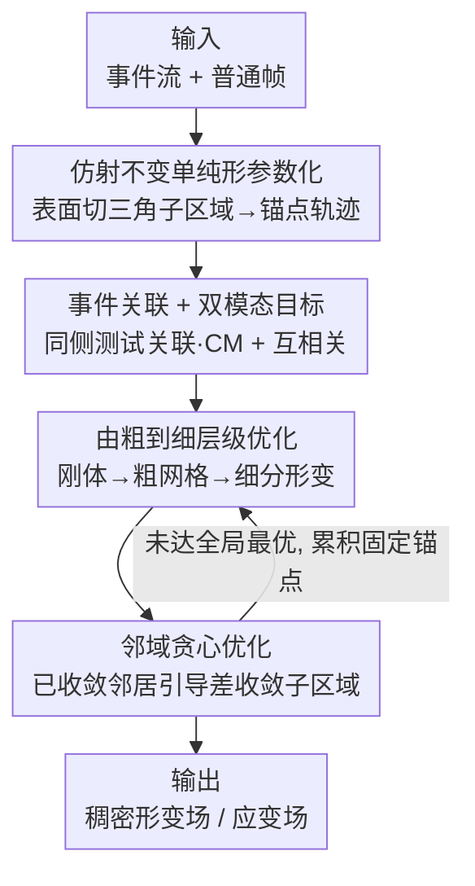

# Event-based Visual Deformation Measurement

**会议**: CVPR 2026  
**论文**: [CVF Open Access](https://openaccess.thecvf.com/content/CVPR2026/html/Wu_Event-based_Visual_Deformation_Measurement_CVPR_2026_paper.html)  
**代码**: https://wyl-ovo.github.io/EVDM/ (项目页)  
**领域**: 事件相机 / 形变测量 / 稠密追踪  
**关键词**: 事件相机, 视觉形变测量, 仿射不变, 对比度最大化, 稠密光流追踪

## 一句话总结
本文提出一套事件—帧融合的视觉形变测量（VDM）系统，用事件相机提供时间稠密的运动线索、用普通帧提供空间稠密的精确约束，并通过仿射不变单纯形（AIS）框架把高维形变场切成低参数三角子区域、再配合邻域贪心优化抑制长程误差累积，在 100+ 像素大形变下把追踪存活率做到 SOTA 的 1.6 倍，而存储/算力只占高速相机方案的 18.9%。

## 研究背景与动机
**领域现状**：视觉形变测量（VDM）的目标是从相机观测中恢复物体表面的稠密形变场——即每个表面材料点相对初始未形变状态的位移向量 $u(X,t)$。传统做法是基于图像的相关性匹配（DIC 类，如 OpenCorr），用相关准则在形变前后的图像子区间里找最佳对应。

**现有痛点**：刚体运动只有 6 个自由度，而可形变表面的自由度极高、表面点可以近乎独立地运动，这给纯图像方法带来两个硬伤——(i) 对应搜索空间大到难以处理；(ii) 形变带来的纹理相似与几何变化让特征匹配不可靠。为了把搜索空间压住，现有方法依赖图像方法的「帧间运动极小」假设，于是被迫上昂贵的高速相机，结果是要处理海量冗余帧、存储与计算成本高得离谱，根本撑不起大形变、快速自运动这类高动态场景。

**核心矛盾**：单一视觉模态无法同时满足「时间稠密（跟得上快速运动）」和「空间稠密、低噪（测得准）」。高速帧给了空间稠密却带来冗余成本；事件相机时间稠密、存储省，却空间稀疏、噪声大，直接做像素级对比度最大化（CM）会有严重的运动估计歧义。

**本文目标**：构建一个事件—帧混合系统，既要利用事件的高时间分辨率追上大位移/自运动，又要消解事件稀疏噪声带来的稠密场歧义，还要解决长程稠密追踪里的误差累积。

**切入角度**：作者重新拾起固体弹性建模的先验——形变在局部是连续、近似仿射的。如果把表面切成足够小的三角子区域，每块内部就能用一个仿射变换无损描述，从而把「高维稠密场」降成「少量锚点轨迹」的低参数问题。

**核心 idea**：用「仿射不变单纯形参数化」把稠密形变场降维成稀疏锚点轨迹（低参数化压住事件歧义），再用「邻域贪心优化」让已收敛子区域去带动没收敛的邻居（压住长程误差累积）。

## 方法详解

### 整体框架
系统输入是时间对齐的事件流与普通帧，输出是物体表面随时间演化的稠密形变场（以及由其导出的 von Mises 应变场）。整条管线可以理解为「先把场降维、再用两种模态联合求解锚点轨迹、最后逐级细化并纠错」：先用 AIS 框架把表面网格化成三角子区域、把场表示成顶点（锚点）轨迹 $\{Tr_j(t)\}$；优化时把事件关联到所属子区域并用仿射插值算位移，事件侧以对比度最大化（CM）为目标、图像侧以归一化互相关（CC）为目标；求解采用由粗到细（先刚体、再粗网格、再细分）的层级策略；最后用邻域贪心策略检出收敛差的子区域、用已收敛邻居引导其收敛，逼近全局最优。

### 关键设计

**1. 仿射不变单纯形（AIS）框架：把高维稠密场降成稀疏锚点轨迹**

针对「稠密场自由度太高 + 事件稀疏噪声导致 CM 歧义」这个核心矛盾，作者把物体表面分解成 $N$ 个三角子区域 $T_k$，并假设每块内部的形变是仿射的：$x(X)=X+u(X)=A_k X + b_k,\ \forall X\in T_k$，其中 $A_k\in\mathbb{R}^{2\times2}$ 是局部形变梯度矩阵、$b_k\in\mathbb{R}^2$ 是平移。关键在仿射不变性质：对三角子区域 $\sigma=\mathrm{conv}\{X_1,X_2,X_3\}$，重心插值算子 $I[f](X)=\sum_{i=1}^3\lambda_i(X)f(X_i)$（满足 $\sum\lambda_i=1$）对任意仿射函数 $f(X)=AX+b$ 满足复现性质 $I[f]=f$。这意味着每个子区域的仿射形变可以被它三个顶点的运动**无损描述**——于是稠密场的优化变量从「逐点位移」坍缩成「顶点（锚点）轨迹 $\{Tr_j(t)\}$」。这一步同时击中两个目标：既降低了高维形变场的求解难度，又用低参数化压住了事件数据稀疏带来的运动歧义。子区域数 $S_N$ 越大非线性表达力越强但优化越难，越小越简单但表达力弱，是个需要权衡的旋钮（后面用由粗到细化解）。

**2. 事件关联 + 仿射不变插值 + 双模态目标：让稀疏事件和精确帧各司其职**

光有参数化还不够，优化时「单个事件属于哪个子区域、该贡献多少位移」是未知的。先前工作（如逐事件 KNN 找最近锚点再平均位移）既慢又因为平均插值引入显著误差。本文改用**同侧测试（same-side test）关联**：给定事件坐标 $X_e$ 和三角顶点在触发时刻的位置 $Tr_j(t_i)$，对每条边算行列式 $C_j$，当 $\mathrm{sign}(C_1)=\mathrm{sign}(C_2)=\mathrm{sign}(C_3)$ 时判定事件落在该子区域内，再解 $X_e=\sum_{k=1}^3\lambda_k Tr_j(t_i)$（约束 $\sum\lambda_k=1$）得重心权重——这是几何精确的关联，避开了 KNN 的低效与平均插值的误差。关联后，事件可被 warp 到参考时刻 $t_{\text{ref}}$ 形成 warped 事件图（IWE），以**对比度最大化**为目标 $f_{CM}(t_{\text{ref}})=\frac{\sum_{\boldsymbol{x}}T_{+1}^2+T_{-1}^2}{\sum_{\boldsymbol{x}}[n(\boldsymbol{x}')>0]+\epsilon}$，即让 warp 后的事件图对比度最大（运动估对了，事件就会聚成清晰边缘）。同时，由于稀疏事件丢失了精确灰度，引入帧侧约束：在每个子区域内按重心坐标均匀采样像素强度，用零均值归一化互相关 $f_{CC}(S_1,S_2)=\frac{\mathrm{Cov}(S_1,S_2)}{\sigma_{S_1}\sigma_{S_2}}$ 把当前帧 $I_i$ 与上一帧 $I_{i-1}$、初始帧 $I_0$ 对齐。事件管时间稠密的运动线索、帧管空间稠密的精度，二者互补。

**3. 由粗到细层级优化：先抓大位移、再补精细形变**

如果一上来就在最细的网格上联合优化全部高维形变参数，既慢又容易陷入局部最优、还抓不住大位移。作者采用 coarse-to-fine 的层级求解：先估计目标区域的**刚体自运动**参数（最低参数），再在**粗子区域**上做初始形变估计，最后通过迭代细分逐级精化——细分规则是把一个三角形按三边中点 $M_i=\frac{Tr_i+Tr_{(i\bmod 3)+1}}{2}$ 拆成 4 个小三角形。优化时事件经两次 warp：Warp 1 把邻近 bin 的事件 warp 到各时间戳生成 $M$ 通道 IWE 捕捉短时运动，Warp 2 把时间窗内全部事件 warp 到帧时刻生成 2 通道 IWE 保证全局运动连续；总目标为 $f_{total}=\lambda_1 f_{CM}^{Warp1}+\lambda_1 f_{CM}^{Warp2}+\lambda_2 f_{CC}$，系数随迭代变化。这样先用低参数（刚体 + 粗网格）拿下大尺度位移，为后续高参数细尺度形变估计提供可靠初始化。

**4. 邻域贪心优化：用收敛好的子区域带动收敛差的邻居**

长程稠密追踪要迭代很多步，少数失配子区域的误差会累积、放大，最终拖垮全局追踪。但直接对所有子区域做全局联合优化又因维度太高而极慢。作者用形变场的连续性先验做贪心：先评估每个子区域 $\Omega_j$ 的收敛质量——统计采样像素中平方误差 SE 偏离均方误差 MSE 过大的比例 $P_j=\frac{1}{N}\sum_i \mathbb{1}(\mathrm{SE}(i)>k\cdot\mathrm{MSE})$，若 $P_j>\tau$ 则判为未收敛（$k,\tau$ 为超参）。然后把已收敛子区域的锚点**固定**，并在目标里加上应变连续性约束 $f_S=\frac{1}{|E_T|}\sum_{(i,j)\in E_T}\|S_i-S_j\|_F^2$（$S_i$ 为锚点 $i$ 处的 von Mises 应变、$E_T$ 是子区域的边集），用这些好邻居引导差邻居继续优化。每轮优化后重新评估收敛状态、贪心地不断累积固定锚点（不释放），直到逼近全局最优。这个策略既靠误差不再回灌提升了长程存活率，又靠收敛判据带来的提前终止大幅缩短了收敛时间。

### 损失函数 / 训练策略
本方法是基于优化（model-based）而非学习训练的：在 PyTorch 框架内用多尺度搜索 + Adam 优化器逐时间窗前向迭代求解锚点轨迹，单卡 NVIDIA RTX 4090（24GB）。优化时把连续两帧间事件 $E_{k,k+1}$ 按等事件数切成 $M$ 个互不重叠 bin、假设 bin 内运动线性，从而在 $M+1$ 个时间戳上优化轨迹。

## 实验关键数据

### 主实验
作者自建了事件—帧时间对齐的 VDM 基准：用 50:50 分光棱镜共置事件相机（Prophesee EVK4）与灰度相机、210Hz 方波同步触发，采集 120+ 条真实序列（挤压/拉伸/弯曲/开裂，位移从 <20 像素到 100+ 像素），真值由高速视频（210fps）跑 VDM 算法后人工精修得到。下表为事件 + 5fps 帧输入下的对比（EPE/SEPE 越低越好，存活率越高越好）：

| 形变量级 | 指标 | 本文 | CoTrackerV3(SOTA) | OpenCorr+TimeLens |
|--------|------|------|------|------|
| 5-20 px | EPE↓ / 存活率↑ | **0.155** / 99.4% | 0.671 / 99.0% | 0.227 / 99.5% |
| 20-100 px | EPE↓ / 存活率↑ | **0.330** / **92.4%** | 2.138 / 91.7% | 0.819 / 89.8% |
| 100+ px | EPE↓ / SEPE↓ / 存活率↑ | **3.204** / **0.813** / **65.7%** | 8.763 / 2.150 / 45.2% | 3.830 / 1.201 / 41.3% |

大形变（100+ px）是分水岭：SOTA 的 CoTrackerV3 存活率只有 45.2%，本文做到 65.7%（约 1.6×），且 EPE/SEPE 均明显更优；图像方法即便接上 TimeLens 帧插值仍落后。纯事件光流方法 E-RAFT 在所有量级都崩（存活率个位数到 21.7%），印证了仅靠事件做稠密形变追踪不可行。

### 消融实验

存储/帧率消融（100+ px 测试集，对比高速相机方案）：

| 配置 | 数据量(帧+事件) | EPE↓ | SEPE↓ | 存活率↑ |
|------|------|------|------|------|
| 本文 事件+1fps | 5.6Mb + 78.3Mb | 4.710 | 2.533 | 32.6% |
| 本文 事件+5fps | 28.1Mb + 78.3Mb | 3.204 | 0.813 | 65.7% |
| 本文 事件+20fps | 112.6Mb + 78.3Mb | 1.618 | 0.573 | 71.2% |
| OpenCorr 纯帧 100fps | 562.5Mb | 3.317 | 0.825 | 64.3% |
| OpenCorr 纯帧 210fps | 1181.3Mb | — | — | 真值计算 |

本文用 5fps 帧（28.1+78.3≈106Mb）就达到与 OpenCorr 100fps（562.5Mb）相当的精度/存活率，存储仅占 18.9%（相对 210fps 高速相机仅 13%）。

优化策略消融：

| 策略 | 存活率↑ | 平均收敛时间↓ |
|------|---------|---------------|
| 邻域贪心优化（完整） | 87.1% | 7.2s |
| Vanilla 优化 | 49.0% | 26.5s |

> ⚠️ 正文与表 3 对存活率的表述略有出入：正文称邻域贪心把存活率从 49.0% 提升到 87.1%，而表 3 列出的邻域贪心存活率为 65.7%、Vanilla 为 39.0%（且对应收敛时间 7.2s vs 26.5s，约 3× 加速）。两处数字以原文为准。

### 关键发现
- **存活率是真正拉开差距的指标**：小形变下各方法 EPE 都 <1、存活率都 >95%，差异主要出现在大位移区——这正是事件高时间分辨率发挥作用的地方。
- **仿射不变插值优于通用插值**：相比最近邻、均值、IDW、高斯加权插值，本文的仿射不变重心插值在各量级的精度与存活率都更优（图 7），说明几何精确的关联/插值是消除误差源的关键。
- **邻域贪心既提存活率又提速**：误差不再回灌让长程追踪存活率大幅上升，而收敛质量判据带来的提前终止把平均收敛时间缩短到约 1/3。
- **帧率是精度—成本旋钮**：从 1fps 到 20fps，存活率 32.6%→71.2% 单调上升，5fps 是性价比甜点。

## 亮点与洞察
- **「降维」的巧思**：用仿射不变性把「逐点稠密位移」无损压成「三角顶点轨迹」，一招同时解决了高维优化难和事件歧义大两个问题——这是把固体弹性的连续性先验翻译成可优化参数化的范例。
- **同侧测试 + 重心插值替代 KNN**：用几何判定（三个行列式同号）做事件—子区域关联，既快又精确，避开了逐事件 KNN 的低效和平均插值的误差，是可迁移到其它「点—网格关联」场景的小 trick。
- **贪心固定 + 应变连续性约束**：把「已收敛邻居引导差邻居」做成显式应变正则 $f_S$，本质是在稠密追踪里引入物理连续性来对抗误差累积，思路可迁到任何带空间连续性的稠密估计任务。
- **存储账算得漂亮**：18.9% 存储拿到可比精度，直接回应了高速相机方案不可扩展的痛点，是「事件相机省冗余」卖点的有力实证。

## 局限与展望
- 作者承认：方法依赖空间连续性与亮度恒定假设，当目标发生**拓扑变化**（如开裂）时会引入伪应变（pseudo-strain）；在**镜面反射**场景下性能退化（图 8 给出石膏板开裂与镜面反射两类失败案例）。
- 自己看：方法是 per-sequence 在线优化（4090 上仍以秒计），不是实时；超参 $k,\tau,S_N$、$\lambda$ 等较多，且未报告对它们的敏感性分析；目前是 2D 表面形变，3D 还没覆盖。
- 改进方向：作者计划探索 3D 事件 VDM；可考虑用学习先验初始化锚点轨迹以加速、或对开裂/镜面引入显式不连续/光照建模来缓解伪应变。

## 相关工作与启发
- **vs OpenCorr / StrainNet（图像 VDM）**：它们靠相关性匹配 + 帧间小运动假设，必须上高速相机；本文用事件补时间分辨率，5fps + 事件即可，存储省一个量级且大形变更稳。
- **vs E-RAFT（事件光流）**：纯事件做短时光流，在稠密大形变追踪上彻底失效（存活率个位数）；本文加入帧侧互相关约束 + 低参数化才把事件用对地方。
- **vs CoTrackerV3（长程点追踪）**：当前 SOTA baseline，小形变够用但大位移存活率仅 45.2%；本文靠 AIS 降维 + 邻域贪心把存活率拉到 65.7%，说明「物理连续性先验」在形变测量上比通用点追踪更对路。
- **vs 既有 CM 框架（全局低参 / 局部平滑约束）**：全局参数模型对形变不成立、平滑约束又压制了形变细节；本文用单纯形局部低参数化在「低歧义」和「保留形变细节」之间找到平衡。

## 评分
- 新颖性: ⭐⭐⭐⭐⭐ 首个事件—帧融合的稠密形变测量系统，AIS 降维 + 邻域贪心两个设计都切中要害且互相支撑。
- 实验充分度: ⭐⭐⭐⭐ 自建 120+ 序列基准、覆盖多量级与多场景、消融完整；但存在正文与表 3 数字不一致、缺超参敏感性分析。
- 写作质量: ⭐⭐⭐⭐ 动机—矛盾—方法链条清晰，公式给得全；个别符号与数字表述略有瑕疵。
- 价值: ⭐⭐⭐⭐⭐ 用 18.9% 存储替代高速相机方案，对结构监测/力学/生物力学等非接触测量有直接落地价值。

<!-- RELATED:START -->

## 相关论文

- [\[CVPR 2026\] Event Structural Valley: A Unified Theoretical and Practical Framework for Event Camera Autofocus](event_structural_valley_a_unified_theoretical_and_practical_framework_for_event_.md)
- [\[CVPR 2026\] Event Stream Filtering via Probability Flux Estimation](event_stream_filtering_via_probability_flux_estimation.md)
- [\[CVPR 2026\] Adaptive Spatial-Temporal Window: Unlocking the Potential of Event Cameras in Heterogeneous Velocity Scenarios](adaptive_spatial-temporal_window_unlocking_the_potential_of_event_cameras_in_het.md)
- [\[CVPR 2026\] Modeling the Visual Ambiguity of Human Sketches](modeling_the_visual_ambiguity_of_human_sketches.md)
- [\[CVPR 2025\] Event Ellipsometer: Event-based Mueller-Matrix Video Imaging](../../CVPR2025/others/event_ellipsometer_event-based_mueller-matrix_video_imaging.md)

<!-- RELATED:END -->
