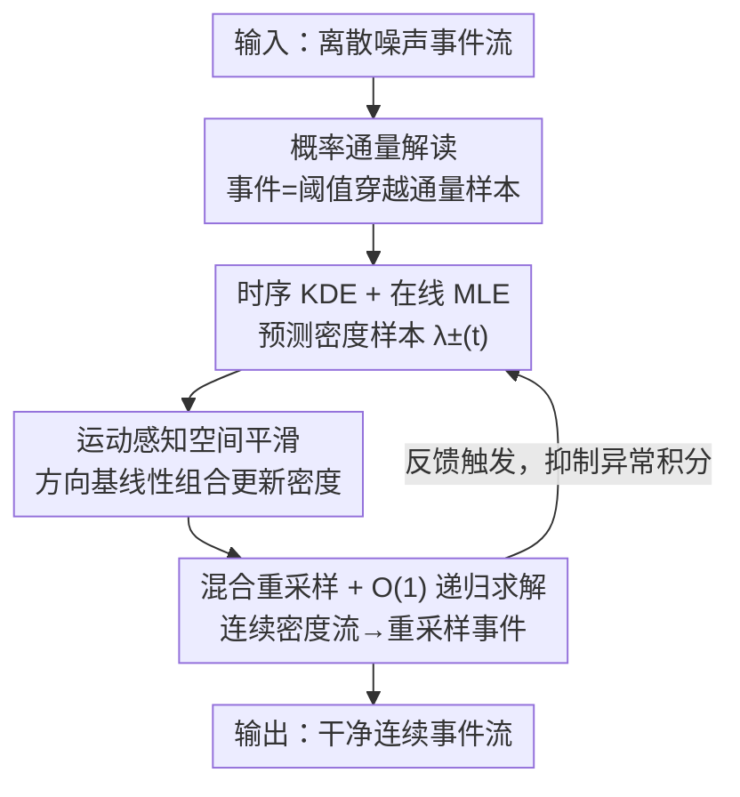

# Event Stream Filtering via Probability Flux Estimation

**会议**: CVPR 2026  
**论文**: [CVF Open Access](https://openaccess.thecvf.com/content/CVPR2026/html/Chen_Event_Stream_Filtering_via_Probability_Flux_Estimation_CVPR_2026_paper.html)  
**代码**: 未找到开源链接  
**领域**: 事件相机 / 信号处理 / 低层视觉  
**关键词**: 事件相机, 事件去噪, 概率通量, 随机微分方程, 实时滤波  

## 一句话总结
把事件相机的成像过程重新解释成"对数辐照度轨迹穿越对比度阈值的随机过程"，事件就是阈值边界上"漏出"的概率通量样本；据此提出生成式滤波器 EDFilter，用时序核密度估计 + 运动感知空间平滑 + 异步重采样，以 O(1) 复杂度实时重建一条干净、连续、物理可解释的事件流。

## 研究背景与动机
**领域现状**：事件相机（event camera）是仿生异步视觉传感器，每个像素独立地在亮度变化超过对比度阈值时输出一个带极性的事件 $(t_i, x, y, p_i)$，具有微秒级时间分辨率。但这种"阈值触发"的工作方式会放大电路内部的热噪声，事件流里混入大量噪声事件，需要滤波。

**现有痛点**：现有事件滤波器绝大多数是**判别式**的——密度法靠时空邻域计数、运动法拟合局部平面、学习法用 MLP/CNN/Transformer 把每个事件分类成"信号 or 噪声"。它们只能**删事件、不能纠正或重新生成**，输出往往比原始输入还稀疏。少数生成式方法（如 EventZoom）则把事件堆成同步的事件帧再用 3D-UNet 去噪，这等于把事件相机最宝贵的微秒级时间精度给丢了。

**核心矛盾**：作者指出一个事件流其实编码了**两类互补信息**：①**状态信息**——事件时刻对数辐照度的离散跳变 $I_{t_i}-I_{t_{i-1}}=p_i C$；②**过程信息**——相邻事件之间辐照度轨迹被对比度不等式约束 $\sup_{t\in[t_{i-1},t_i)}|I_t-I_{t_{i-1}}|<C$。经典信号处理擅长建模连续状态变量，却天然无法处理离散、异步的极性，也无法把上面那条不等式约束施加到隐辐照度路径上。结果就是现有滤波器**只用了状态信息、丢掉了过程信息**，从而限制了连续辐照度动态的重建。

**切入角度**：作者从随机过程视角重新审视事件成因——一个事件之所以被触发，不取决于过去发生了哪些事件，而取决于**此刻亮度正以多快的速度朝阈值流动**。这种"辐照度轨迹朝边界穿越的方向性趋势"，在物理上正好就是**概率通量（probability flux / current）**。

**核心 idea**：把事件流当作"阈值穿越概率通量在边界处漏出的直接采样"，从离散噪声事件中**估计这个通量**，再据此**重采样**出一条干净的连续事件流——用一个统一的生成式框架同时建模状态信息和过程信息。

## 方法详解

### 整体框架
EDFilter 先从理论上证明：事件极性分布和事件间隔分布都由对比度边界上的概率通量决定，于是把"滤波"问题转化成"估计随时间变化的事件密度流（Event Density Flow, EDF）$\lambda_\pm(t)$"。在工程上，框架由三个**串行模块**组成，分别负责**预测、更新、重建**：① 对每个像素独立做时序核密度估计（KDE），用最大似然在线选核，得到预测密度样本；② 用运动感知的空间局部滤波把邻域密度样本融合，得到更精细、保稀疏的密度估计；③ 把连续密度流插值出来并重采样成干净事件输出。输出还会以"应用相关"的方式反馈触发预测模块，抑制异常积分漂移。全部组件都被设计成 O(1) 常数复杂度，能在传感器时间尺度上在线运行。

### 关键设计

**1. 概率通量解读：把事件成因建模成阈值穿越随机过程**

这是全文的理论地基，针对的痛点是"现有方法把极性当连续信号、丢掉过程信息"。作者把对数辐照度 $I_t$ 建模为带吸收边界的随机微分方程 $dI_t=\mu(I_t,t)\,dt+\sigma(I_t,t)\,dW_t$，其中漂移 $\mu$ 表示干净场景动态、扩散 $\sigma$ 表示热噪声。当 $I_t$ 越出区间 $[-C,C]$ 就在边界上触发一个事件，极性由越出哪一侧决定。与该 SDE 对应的 Fokker-Planck 方程描述了密度 $\rho(I,t)$ 的演化，并在两个对比度边界处取吸收条件 $\rho(\pm C,t)=0$。定义概率通量密度 $J(I,t)=\mu(I,t)-\tfrac{1}{2}\partial_I[\sigma^2(I,t)\rho(I,t)]$，它满足连续性方程 $\partial_t\rho+\nabla\cdot J=0$，而边界处的外流通量 $p_\pm(t)=\mp J(\pm C,t)$ 恰好就是瞬时 ON/OFF 事件密度。

由此得到两个关键结论：事件触发时间的分布 $P(t_s\le t)=1-\int_{-C}^{C}\rho(I,t)\,dI=\int_0^t[p_+(\tau)+p_-(\tau)]\,d\tau$，以及极性的条件分布 $P(p=\pm1\mid t)=p_\pm(t)/(p_+(t)+p_-(t))$——也就是说**事件间隔和极性都被边界通量唯一决定**，"事件 = 漏出通量的采样"在数学上成立。由于 FP 方程一般没有闭式解，作者改用失效率（failure rate）形式定义**事件密度流 EDF**：

$$\lambda_\pm(t)=\frac{p_\pm(t)}{1-\int_0^t[p_+(\tau)+p_-(\tau)]\,d\tau}$$

$\lambda_\pm(t)$ 是无约束的非负实值函数，表示瞬时期望事件率，可以直接从离散事件估计，绕开了求解完整扩散方程——这是后面所有工程模块能成立的前提。

**2. 时序 KDE + 在线 MLE：从离散事件预测连续密度**

针对"如何在任意时刻给出连续密度预测"，作者对每个像素独立做时序核密度估计。用矩形核 $\phi(t)$（高度 $\alpha$、带宽 $h$）把序列事件的贡献累加成预测密度 $\psi(t)=\sum_{t_i<t}p_i\phi(t-t_i)$，再按符号映射成 EDF：$\psi(t)>0$ 时 $(\lambda_+,\lambda_-)=(\psi(t),\beta_-)$，反之亦然，其中 $\beta_\pm\ge0$ 是联合优化的常值假事件率。和判别式滤波器不同，**异常事件不被硬阈值剔除，而是仍参与连续场景建模**。

核参数靠似然最大化在线确定：若区间 $(s,t]$ 内观测到 $N_e$ 个事件，对数似然为 $\ln L(s,t)=\sum_{i=1}^{N_e}\ln\lambda_{p_i}(t_i)-\int_s^t[\lambda_+(t)+\lambda_-(t)]\,dt$，第一项是状态似然、第二项是过程似然——一个目标里**同时塞进了状态和过程两类信息**。为得到闭式解，作者再加先验 $f(\alpha,\beta_\pm,h)\propto\tfrac{\gamma}{h^2}\exp(-\gamma/h)$（$\gamma$ 解释为期望事件间隔），最大化后验得到预测 EDF $\bar\lambda_\pm(t)$。带宽 $h$ 通过查找表在离散候选里选似然最大者，$\alpha$、$\beta_\pm$ 独立优化，保证 O(1)。

**3. 运动感知空间局部平滑：用方向基把噪声密度修齐**

时序预测出的 $\bar\lambda_\pm(t)$ 因噪声或阈值失配会有结构不一致。痛点在于：事件的空间 EDF 模式是**有方向、稀疏的**（通常对应运动中的边缘），普通各向同性滤波会把它糊掉。作者在 $3\times3$ 邻域上施加方向运动先验，用 4 个方向基 $B_1,\dots,B_4$（分别代表 0°、45°、90°、135° 运动模式，中心像素贡献 $b_i(t)\in[0,1]$）把平滑后的 EDF 表示成线性组合 $\Lambda_\pm(t)=\sum_{i=1}^4 k_{\pm,i}(t)B_i(t)$。最优系数通过最小化 q-范数重建误差求得：

$$\{k^*_{\pm,i}(t)\}_{i=1}^4=\arg\min_{\{k_{\pm,i}(t)\}}\big\|\Lambda_\pm(t)-\bar\Lambda_\pm(t)\big\|_q,\quad 1\le q\le2$$

更新后的中心密度流 $\lambda^*_\pm(t,x,y)=\sum_{i=1}^4 k_{\pm,i}(t)b_i(t)$。这是个凸优化：$q=2$ 时退化成 $3\times3$ 卷积、$q=1$ 时用局部线性规划给出精确稀疏解，两者都是常数时间。实验里 L1 更利于运动精度、L2 更利于辐照度保真，体现了"稀疏 vs 平滑"的可调权衡。

**4. 混合重采样 + O(1) 递归求解器：连续重建并保住实时性**

最后要把 $\lambda^*_\pm(t,x,y)$ 重建成连续 EDF 并重采样出干净事件。作者用**混合采样**：事件触发时做异步局部更新（一个事件触发其 $3\times3$ 邻域更新，依赖 $5\times5$ 区域的预测值），同时每隔 $T_s$ 秒对全部像素做一次全局更新，兼顾瞬态动态与避免异常积分漂移；再用零阶保持插值得到连续 EDF，把过程当作分段齐次泊松过程来重采样。整套流程被精心设计成 O(1)：时序预测写成 LTI 系统的状态空间形式 $\tfrac{d\psi}{dt}=\alpha(E(t)-E(t-h))$（$E(t)=\sum_i p_i\delta(t-t_i)$ 是极性调制的脉冲串），带宽用查找表选；空间更新是定时收敛的凸问题；事件采样因 EDF 分段常值、间隔服从指数分布，用带极性的改进 thinning 算法 O(1) 顺序采样。

### 损失函数 / 训练策略
EDFilter 是**无需训练的生成式信号处理框架**，没有网络权重，所有参数靠在线最大似然/最大后验估计确定。默认配置：观测窗 $t-s=100\text{ms}$、$\gamma=4\text{ms}$、查找表带宽从 $156.25\,\mu s$ 到 $40\text{ms}$ 按 $2\times$ 递增、$q=2$、去噪时 $T_s=10\text{ms}$；做直接点跟踪时设 $p=1$、$T_s=\infty$（完全异步采样）。

## 实验关键数据

### 主实验
在自建 RED 数据集（带微秒级真值辐照度，用归一化均方误差 NMSE 评估）上，EDFilter 在多数序列取得最优。下表为部分序列的 NMSE（越低越好，DVS=DAVIS346 / EVK=EVK4）：

| 方法 | circle1 DVS | circle1 EVK | spiral1 DVS | spiral1 EVK | text EVK |
|------|------|------|------|------|------|
| Raw（原始） | 0.106 | 0.390 | 0.137 | 0.139 | 0.052 |
| EventZoom | 0.223 | 0.338 | 0.331 | 0.108 | 0.227 |
| EvFlow | 0.285 | 0.504 | 0.529 | 0.312 | 0.142 |
| MLPF | 0.104 | 0.226 | 0.250 | 0.094 | 0.049 |
| Ynoise | 0.244 | 0.230 | 0.516 | 0.115 | 0.089 |
| **Ours** | **0.096** | **0.193** | **0.121** | **0.086** | **0.038** |

在 E-MLB 真实噪声数据集上用非参考指标 ESR（越高越好）评估，EDFilter 在各噪声等级（白天/夜晚）几乎全面第一：

| 方法 | ND1 D/N | ND4 D/N | ND16 D/N | ND64 D/N |
|------|------|------|------|------|
| EventZoom | 1.00/1.06 | 0.99/1.01 | 1.00/1.01 | 0.97/0.99 |
| MLPF | 0.85/0.93 | 0.89/0.93 | 0.85/0.91 | 0.84/0.91 |
| **Ours** | **1.02/1.07** | **1.02/1.03** | **1.02/1.00** | **1.00/0.99** |

运行时（346×260，单核 R9-7945HX）：EDFilter 延迟仅 **4.99 µs**，比 MLPF（7.55 µs）低约 51%，远低于需要事件帧累积的 EventZoom（1.21 s）；吞吐 2.10×10⁵ events/s，超过 EventZoom 的 1.34×10⁵。

### 消融实验
论文按"时序模型 / 空间模型 / 采样策略"逐项替换（图 7），关键结论整理如下：

| 维度 | 配置 | 现象 |
|------|------|------|
| 时序 | EDF vs Poisson/Gaussian | EDF 似然最大化自适应场景动态，运动感知上明显更优 |
| 空间 | L1 vs L2 | L1 更保运动精度（ATE 低），L2 更保辐照度变化（NMSE 低） |
| 采样 | Async / Hybrid10ms / Sync | 异步 ATE 最低但 NMSE 偏高；混合折中最佳；同步全面最差 |
| 采样精度 | Sync1ms vs Sync10ms | 极细采样相对算力代价收益有限 |

### 关键发现
- **状态信息与过程信息存在内在张力**：EvFlow 只保留运动轨迹上最显著的事件，利于粗运动跟踪（点跟踪 ATE 与本文并列前二）但严重损害辐照度重建（NMSE 最差之一）；EDFilter 用概率通量统一建模完整事件分布，在去噪和跟踪两端都强，弥合了这道鸿沟。
- **下游应用提升**：插入 EDFilter 后，事件 SLAM（ESVO）在 MVSEC/RPG 多数序列跟踪误差下降（如 indoor_flying1 从 18.4 → 15.5 cm）；视频重建（E2VID）PSNR 16.04 → 18.37、SSIM 0.53 → 0.68、LPIPS 0.30 → 0.24 全面变好。
- **物理可解释 ≠ 慢**：纯信号处理路线在微秒尺度延迟上反而打过了学习式 MLPF，说明"物理 grounded"和"实时"可以兼得。

## 亮点与洞察
- **把"去噪"重构成"生成"**：不再问"这个事件是不是噪声"，而是估计一条连续的事件密度流再重采样——输出可以比输入更密、更连续，跳出了判别式滤波"只能删"的天花板。这是最 aha 的视角转换。
- **概率通量是漂亮的物理桥梁**：用 SDE + Fokker-Planck 把离散异步极性和连续辐照度统一起来，且证明边界外流通量 $p_\pm(t)=\mp J(\pm C,t)$ 同时决定了事件间隔与极性分布，理论自洽且导出了可直接估计的 EDF。
- **q-范数可调的稀疏-平滑权衡**：同一空间模块靠切换 $q=1/2$ 就能在"保运动 vs 保辐照度"间滑动，且都保持 O(1)，工程上很优雅。
- **RED 数据集填补空白**：用 12 万步/转编码器（0.003°）的高速旋转盘 + 微控制器亚微秒同步，造出了带微秒级真值辐照度的事件评测基准，使"逐事件时间保真度"第一次可被定量评估。

## 局限与展望
- **逐像素独立假设**：理论推导聚焦单像素、起点设为 0，多像素的空间耦合与干扰只在补充材料展开，主文未给完整多像素 SDE 处理。⚠️ 细节以原文/补充材料为准。
- **手工先验与超参**：矩形核、$\gamma$、查找表带宽范围、$T_s$ 等都是手工设定，对不同传感器/光照是否需要重调缺乏系统分析；先验 $f(\alpha,\beta_\pm,h)$ 的形式带有较强假设。
- **真值依赖受控场景**：RED 的微秒真值来自受控旋转盘 + 二值图案，自然复杂场景下的真值辐照度仍难获取，泛化评估只能退回非参考指标 ESR。
- **运动基方向离散**：空间模块只用 4 个固定方向基（0/45/90/135°），对斜向或快速变向运动的表达能力可能受限，可探索更丰富/自适应的方向字典。

## 相关工作与启发
- **vs 判别式滤波（Ynoise / EvFlow / MLPF）**：它们靠时空邻域计数、局部平面拟合或网络分类来"删事件"，本文则估计连续密度流并**重采样生成**干净事件，既能去噪也能补全连续动态；代价是引入了 SDE/通量这套相对重的理论。
- **vs 生成式事件帧方法（EventZoom）**：EventZoom 把事件堆成同步帧再 3D-UNet 去噪超分，牺牲了微秒时间精度且卷积会扩散空间能量；EDFilter 全程异步、零事件帧，延迟低数个数量级、时间保真度更高。
- **vs 事件仿真的随机扩散建模（最接近的相关工作）**：该方向用辐照度随机扩散来**正向仿真**连续时间事件；本文走相反方向——从观测事件**反推**扩散，并证明事件可视为边界概率通量的直接采样，从而绕开求解完整扩散方程，得到更高效的事件建模公式。

## 评分
- 新颖性: ⭐⭐⭐⭐⭐ 把事件滤波重构为阈值穿越概率通量估计，视角和理论都很原创
- 实验充分度: ⭐⭐⭐⭐ 自建 RED + E-MLB + SLAM/视频重建下游验证，但多像素耦合主要留在补充材料
- 写作质量: ⭐⭐⭐⭐ 物理推导清晰、图示到位，公式偏密对非随机过程背景读者门槛较高
- 价值: ⭐⭐⭐⭐⭐ 物理可解释 + 微秒级实时 + 开放新基准，对事件相机低层处理有方法论意义

<!-- RELATED:START -->

## 相关论文

- [\[CVPR 2026\] Event Structural Valley: A Unified Theoretical and Practical Framework for Event Camera Autofocus](event_structural_valley_a_unified_theoretical_and_practical_framework_for_event_.md)
- [\[CVPR 2026\] Event-based Visual Deformation Measurement](event-based_visual_deformation_measurement.md)
- [\[CVPR 2025\] Full-DoF Egomotion Estimation for Event Cameras Using Geometric Solvers](../../CVPR2025/others/full-dof_egomotion_estimation_for_event_cameras_using_geometric_solvers.md)
- [\[CVPR 2026\] Adaptive Spatial-Temporal Window: Unlocking the Potential of Event Cameras in Heterogeneous Velocity Scenarios](adaptive_spatial-temporal_window_unlocking_the_potential_of_event_cameras_in_het.md)
- [\[CVPR 2026\] NAF: Zero-Shot Feature Upsampling via Neighborhood Attention Filtering](naf_zero-shot_feature_upsampling_via_neighborhood_attention_filtering.md)

<!-- RELATED:END -->
