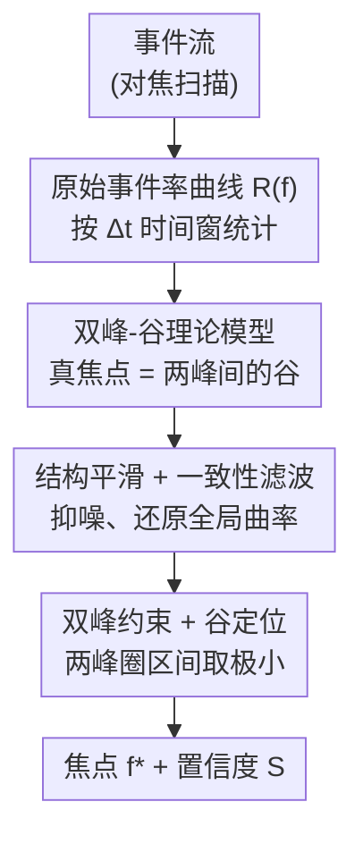

# Event Structural Valley: A Unified Theoretical and Practical Framework for Event Camera Autofocus

**会议**: CVPR 2026  
**论文**: [CVF Open Access](https://openaccess.thecvf.com/content/CVPR2026/html/Xiang_Event_Structural_Valley_A_Unified_Theoretical_and_Practical_Framework_for_CVPR_2026_paper.html)  
**代码**: 未公开  
**领域**: 事件相机 / 神经形态视觉  
**关键词**: 事件相机, 自动对焦, 双峰-谷结构, 事件率曲线, 神经形态视觉  

## 一句话总结
论文从事件生成的物理机制出发，推翻了"对焦最清晰处事件率最高"的传统假设，证明真正的对焦点对应事件率曲线上**两个峰之间的谷（局部极小值）**，并据此提出无需图像重建、无需监督的 ESVA 框架，在多个合成与真实数据集上把对焦误差降到 SOTA。

## 研究背景与动机

**领域现状**：动态、低光、高动态范围场景下，传统帧相机自动对焦（autofocus）容易失败——运动模糊和过曝/欠曝会破坏用于评判清晰度的对比度指标。事件相机（event camera）以微秒级时间分辨率、异步逐像素亮度变化检测的特性，成为一个有吸引力的替代方案，已被用于事件域的对焦估计。

**现有痛点**：几乎所有事件自动对焦方法（如 ER+EGS）都建立在一个直觉假设上——**清晰对焦会触发最多事件，所以最大事件率（Maximum Event Rate, MER）处就是对焦点**。但作者通过理论与实验都发现：在完美对焦处，边缘在空间上极其紧凑，只有很少像素能越过对比度阈值，事件反而**最少**。MER 方法因此往往停在真焦点前面的某个局部峰上，产生系统性偏移。

**核心矛盾**：事件率与离焦程度之间根本不是单调关系。后来的工作（如极性对称性 OLE、PBF）虽然观察到焦点附近的极性反转/对称现象，但都是在受限场景（如显微对焦）下用启发式线索解释，**没有揭示"谷"这一现象的物理根源**，也无法保证泛化。

**本文目标**：（1）从事件生成过程**解析地**推导出事件率随离焦如何变化；（2）据此设计一个鲁棒、可解释、无需图像重建的对焦算法。

**切入角度**：把"对焦扫描时一束像素何时被点亮"建模为离焦尺度 $\sigma$ 的函数。一次对焦扫描会让 $\sigma$ 先降到 0（最清晰）再升高，于是事件率曲线天然呈现"双峰夹一谷"的形状。

**核心 idea**：用"找事件率曲线的谷"代替"找峰"来定位焦点，并用结构正则化把含噪曲线还原成干净的双峰-谷形态。

## 方法详解

### 整体框架

ESVA（Event Structural Valley-based Autofocus）要解决的事情是：在一次连续对焦扫描中，相机只输出异步事件流，如何**仅凭事件**估计出最清晰的焦点位置。整体流程是单向流水线：先把事件流按固定时间窗统计成原始事件率曲线 $R(f)$，但这条曲线被异步噪声、光照闪烁、机械振动污染得很毛糙；于是依次过三道结构正则化（平滑 → 一致性滤波 → 双峰约束）把它整理成物理上自洽的双峰-谷形态；最后在两峰圈定的区间里取极小值作为焦点，并算一个置信度衡量这次估计是否可靠。整个算法是单遍（single-pass）、无迭代优化、复杂度 $O(N)$（$N$ 为对焦采样数），CPU 上毫秒级完成。

### 关键设计

**1. 双峰-谷理论模型：把"谷=焦点"从物理机制推出来，而不是当成经验现象**

这是全文的地基，针对的痛点是前人只观察到现象、没给出原因。事件相机在对数亮度 $L=\log I$ 的变化超过对比度阈值 $C$ 时才输出事件：$\Delta L(x,y,t)=L(x,y,t)-L(x,y,t-\delta t)\ge C$。作者用一个关键近似把"时间阈值"翻译成"空间激活面积"：在对焦扫描的短时间窗内，亮度变化的主导来源是镜头运动引起的模糊尺度变化 $\Delta\sigma$，于是每个像素的亮度变化可写成链式形式 $\Delta L(x;\sigma)\approx \frac{\partial L_\sigma(x)}{\partial\sigma}\,\Delta\sigma$。代入触发条件 $|\Delta L|\ge C$，就得到一个等价的空间阈值 $\theta(C)\coloneqq C/|\Delta\sigma|$，并定义**模糊相关激活区**

$$\Omega(\sigma)\coloneqq\Big\{x:\Big|\tfrac{\partial L_\sigma(x)}{\partial\sigma}\Big|\ge\theta(C)\Big\},\qquad R(\sigma)\propto \mathrm{meas}\big(\Omega(\sigma)\big).$$

也就是说事件率正比于被点亮的像素数量。论文进一步给出两条理论事实：**命题 1（单特征 升-峰-降）**——对一个孤立结构（如单亮点或细线）被高斯核模糊后，激活面积 $\mathrm{meas}(\Omega(\sigma))$ 关于 $\sigma$ 非单调：小 $\sigma$ 时上升、在某 $\sigma^\star>0$ 取最大、再增大则下降，且 $\sigma=0$ 是严格局部极小；**推论 1（单向扫描的双峰-谷）**——一次扫过焦平面时 $\sigma$ 先降到 0 再升，所以观测到的 $R(f)$ 出现被一个谷分开的两个主峰 $(P_1,P_2)$，谷底对应最清晰焦点。由此对焦被形式化为峰圈定区间内的谷定位：$f^\star=\arg\min_{f\in[P_1,P_2]}R(f)$。这条解析模型是整个方法成立的前提，也是它能脱离图像监督、跨数据集泛化的根本原因。

**2. 结构平滑 + 一致性滤波：把含噪的 $R(f)$ 还原成物理自洽的曲线**

理论上的谷在真实测量里常被异步噪声、闪烁、振动淹没，直接取极小会落到伪谷上。这一对模块负责"去噪而不抹掉真结构"。**结构平滑**用高斯核对离散事件率序列做加权平滑：$\tilde R(f_i)=\frac{\sum_j R(f_j)\exp[-(f_i-f_j)^2/(2\sigma_s^2)]}{\sum_j \exp[-(f_i-f_j)^2/(2\sigma_s^2)]}$，$\sigma_s$ 控制结构尺度，压掉脉冲噪声、保住全局曲率。**一致性滤波**接着强制相邻样本的物理连贯性：对每个对焦步算一个归一化跳变 $\delta_i=\frac{|\tilde R(f_i)-\tilde R(f_{i-1})|}{\max(\tilde R(f_{i-1}),\tilde R(f_{i+1}))}$，超过阈值 $\tau_c$ 的样本被判为不一致，投影到局部线性流形上 $\hat R(f_i)=(1-\eta)\tilde R(f_i)+\frac{\eta}{2}[\tilde R(f_{i-1})+\tilde R(f_{i+1})]$，$\eta$ 控制滤波强度。两步配合既消掉孤立振荡，又保留真实的结构性转折——这是后续峰检测能稳定工作的前提。

**3. 双峰约束 + 谷定位 + 置信度：在物理合法区间内取谷并给出可靠性指标**

即便曲线已平滑，全局极小仍可能落在极端离焦的尾部。作者用物理意义把搜索范围锁死在"两个主峰之间"。在正则化曲线 $\hat R(f)$ 上用标准峰检测（最小间隔 + 最小显著度）取局部极大集合 $\mathcal P$，主峰 $P_1=\arg\max_{f\in\mathcal P}\hat R(f)$；次峰 $P_2$ 从剩余候选里选——要求它在对焦轴上离 $P_1$ 足够远、且幅值不与 $P_1$ 过于接近，再取响应最大者。把搜索区间限定为 $[P_1,P_2]$ 能挡掉离焦噪声、峰平台、次级振荡造成的伪极小。在此区间内 $f^\star=\arg\min_{f\in[P_1,P_2]}\hat R(f)$ 即为焦点。最后给一个**结构置信度** $S=\frac{1}{2}[\hat R(P_1)+\hat R(P_2)]-\hat R(f^\star)$，刻画谷与两侧峰的落差：$S$ 越大说明双峰-谷结构越分离、对焦越可靠，可当作失败预警指标。

## 实验关键数据

四个数据集：合成的 SYN（按运动模式分 Static / Small Shake / Huge Shake），真实的 DAVIS（346×260）、EVK4（1280×1080），以及最具挑战的 EAD（含 <1 Lux 极暗场景）。SYN/DAVIS/EVK4 用平均时间戳误差（ms）评估，EAD 用平均距离误差（µm）。对比方法：ER+EGS、OLE'23、PBF、ELP。参数：$\Delta t=1$ ms，$\sigma_s=3$，$\tau_c=0.30$，$\eta=0.6$，纯 CPU（i9 3.8 GHz）。

### 主实验

| 数据集 | 指标 | ELP（次优） | 本文 ESVA | 提升 |
|--------|------|------------|-----------|------|
| SYN（平均） | 时间戳误差↓ ms | 8.68 | **6.62** | 24% |
| DAVIS（平均） | 时间戳误差↓ ms | 2.04 | **1.30** | 36% |
| EVK4（平均） | 时间戳误差↓ ms | 5.33 | **4.22** | 21% |
| EAD（平均） | 距离误差↓ µm | 475.87 | **65.38** | ~30%（对 OLE'23 123.98） |

注：EAD 上 ELP 误差很大（475.87 µm），最接近的对手是 OLE'23（123.98 µm），论文据此报"提升近 30%"。ER+EGS（最大事件率法）几乎在所有场景都明显落后（如 DAVIS 平均 26.20 ms），印证了"找峰"假设的系统性偏移。

### 消融实验

| 配置 | 关键现象 | 说明 |
|------|---------|------|
| Full ESVA | 稳定的双峰-谷、谷底贴合真值 | 完整模型 |
| w/o 结构平滑 | 误差 >43 ms | 高频振荡直接摧毁谷结构 |
| w/o 一致性滤波 | 误差恶化到 1057 µm（启用后降到 54 µm）| 瞬时运动噪声引入伪峰 |
| w/o 双峰约束 | 落到极端离焦处的伪焦点 | 失去物理合法区间 |

### 关键发现

- **三个正则化模块互补**：平滑保结构、一致性滤波抗运动噪声、双峰约束锁物理区间，缺一个就在不同失败模式上崩掉（毛刺谷 / 伪峰 / 尾部伪极小）。
- **运行效率反而最快**：纯 CPU 下 DAVIS 1.43 ms、EVK4 1.68 ms，比 ER+EGS（62/417 ms）、ELP（564/3700 ms）快一两个数量级，因为整条流水线是单遍 $O(N)$、无迭代优化、无图像重建。
- **越极端越占优**：在 EAD 暗光/运动场景，帧相机几乎拍不到清晰图，ESVA 仍能稳定锁谷——验证了"谷=焦点"在真实噪声下依然成立。

## 亮点与洞察

- **反直觉但可证明的核心发现**：把全行业默认的"事件率最大=对焦"翻转成"事件率谷=对焦"，并且不是经验观察而是从事件生成物理（激活面积随模糊尺度先升后降）解析推出，这种"先讲清为什么、再设计算法"的范式很扎实。
- **一维结构变量当对焦指标**：整个方法只依赖事件率曲线这一条标量曲线的几何形状，不碰极性、不重建图像、不需监督，因此天然跨传感器/分辨率泛化（DAVIS↔EVK4 直接迁移）。
- **置信度 $S$ 是免费的预警信号**：谷与双峰的落差既是对焦结果的副产品，又能当可靠性指标，思路可迁移到任何"找极值点"的估计任务上做自检。

## 局限性 / 可改进方向

- **单深度层假设**：方法假定扫描过程中有一个主导深度层。多个竞争深度层的场景下事件率曲线会出现更复杂的结构（多谷/多峰），单一一维准则可能失效——作者自己承认需要额外空间或任务约束。
- **依赖单向、跨过焦点的连续扫描**：理论的双峰-谷结构建立在 $\sigma$ 先降到 0 再升的扫描轨迹上；若扫描没真正跨过最清晰面，或扫描速度/步长不当，峰检测可能拿不到两个合格主峰。⚠️ 论文未详述扫描不完整时的退化行为。
- **多个阈值/超参需场景调**：$\sigma_s$、$\tau_c$、$\eta$、峰检测的最小间隔与显著度都是手工设定的；论文把参数敏感性放在附录，正文未给出跨数据集的自适应策略。
- **可扩展但未做的方向**：作者提到可融合极性模式、强度变化、空间先验做联合对焦估计，但本文只验证了纯事件率的一维版本。

## 相关工作与启发

- **vs ER+EGS（最大事件率 + 黄金分割搜索）**：他们假设清晰=事件最多去找峰，本文证明完美对焦处边缘紧凑、事件反而最少，所以 ER+EGS 会系统性停在真焦点前的局部峰；本文改为找谷，从根上修正了这一偏差。
- **vs OLE'23 / PBF（极性对称性 / 极性平衡）**：他们用焦点附近正负事件对称这一启发式线索，且多为显微对焦等受限场景，泛化到自然光/复杂运动时被极性不均衡和噪声干扰；本文不依赖极性、只用事件率曲线几何，跨场景更稳。
- **vs 事件焦点栈 / 自监督去焦重建等应用类工作**：那些方法隐式利用了"事件活动↔图像清晰度"的关系来重建全清晰图或估深度，但不做显式对焦控制；本文把这层关系显式建模成可解析的物理模型，为事件驱动对焦提供了统一基础。

## 评分
- 新颖性: ⭐⭐⭐⭐⭐ 推翻"找峰"的行业默认假设，并从物理给出"找谷"的解析证明，是真正的认知反转。
- 实验充分度: ⭐⭐⭐⭐ 四数据集（合成+真实+极端低光）、四对手、完整消融与运行时对比，覆盖全面；但多为时间戳/距离误差单一指标族。
- 写作质量: ⭐⭐⭐⭐⭐ 理论推导清晰、动机层层递进、图文（双峰-谷示意）对照到位。
- 价值: ⭐⭐⭐⭐ 简单、$O(N)$、CPU 毫秒级、无监督无重建，对事件相机自动对焦是即插即用的可靠基线。

<!-- RELATED:START -->

## 相关论文

- [\[CVPR 2026\] Event-based Visual Deformation Measurement](event-based_visual_deformation_measurement.md)
- [\[CVPR 2026\] Event Stream Filtering via Probability Flux Estimation](event_stream_filtering_via_probability_flux_estimation.md)
- [\[CVPR 2026\] Adaptive Spatial-Temporal Window: Unlocking the Potential of Event Cameras in Heterogeneous Velocity Scenarios](adaptive_spatial-temporal_window_unlocking_the_potential_of_event_cameras_in_het.md)
- [\[CVPR 2025\] Event Ellipsometer: Event-based Mueller-Matrix Video Imaging](../../CVPR2025/others/event_ellipsometer_event-based_mueller-matrix_video_imaging.md)
- [\[CVPR 2026\] A Unified Framework for Knowledge Transfer in Bidirectional Model Scaling](a_unified_framework_for_knowledge_transfer_in_bidirectional_model_scaling.md)

<!-- RELATED:END -->
