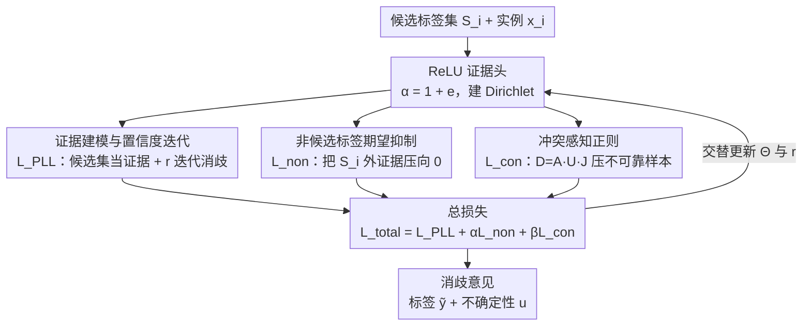

# Evidential Deep Partial Label Learning to Quantify Disambiguation Uncertainty

**会议**: CVPR 2026  
**论文**: [CVF Open Access](https://openaccess.thecvf.com/content/CVPR2026/html/Fan_Evidential_Deep_Partial_Label_Learning_to_Quantify_Disambiguation_Uncertainty_CVPR_2026_paper.html)  
**代码**: 待确认  
**领域**: 弱监督学习  
**关键词**: 部分标签学习, 证据深度学习, 消歧不确定性, Dirichlet分布, 冲突感知正则  

## 一句话总结
把证据深度学习（EDL）引入部分标签学习（PLL），用 Dirichlet 分布把候选标签集当作"证据"来建模消歧的可信度，并配上非候选标签抑制与类内冲突感知两个正则项，做到既能从模糊候选里挑出真标签、又能给出每个预测的不确定性，是一个可插拔到任意深度网络的损失函数。

## 研究背景与动机
**领域现状**：部分标签学习（PLL）是一类弱监督，每个样本只给一个候选标签集合 $S_i$，其中只有一个是真标签，目标是从候选集里识别出 ground-truth 并训练分类器。主流做法分两支：非深度消歧策略（NDS，靠 KNN / 低秩 / EM / SVM 迭代精化标签置信度）和深度消歧策略（DDS，靠正则项、数据增强、自适应损失加权来学消歧）。

**现有痛点**：无论 NDS 还是 DDS，几乎都在最后接一层 softmax 做分类，然后最小化预测损失来消歧。但 softmax 分数本质上是预测分布的**单点估计**——它会在预测错误时仍然给出过度自信（overconfident）的输出。在 PLL 里候选集本来就含噪，模型一旦对错误标签过度自信，就会过拟合噪声，把错误消歧结果当真。

**核心矛盾**：现有 PLL 只会"预测一个类"，却**无法评估这次消歧到底可不可信**。在真实应用里（医疗、决策），一个看起来很自信、实际是错的消歧，可能带来严重后果。问题根源是缺少对预测可靠性的显式建模。

**切入角度**：证据深度学习（EDL）能用单次前向、单个模型同时输出类概率和不确定性——它把神经网络输出当作 Dirichlet 分布的证据向量，天然带"我有多确定"这个量。但 EDL 是为有监督设计的：在 PLL 里**没有 ground-truth**，怎么拿到一个合理的证据向量是全新难题。

**核心 idea**：把模糊的候选标签集**重新解释为"关于标签假设的证据"**，用 belief 和 uncertainty mass 来引导消歧，从而把 EDL 改造到 PLL 上——既给消歧标签，又给一个可信度评分（ED-PLL）。

## 方法详解

### 整体框架
ED-PLL 不改网络结构，只把分类头从 softmax 换成 ReLU（保证非负），把这层输出当作证据向量 $\mathbf{e}=[e_1,\dots,e_Q]$，再令 Dirichlet 浓度参数 $\boldsymbol{\alpha}=\mathbf{1}+\mathbf{e}$。基于 Dempster-Shafer 理论与主观逻辑，每个类的置信度 $b_c=e_c/K$、整体不确定性 $u=Q/K$，其中 $K=\sum_c \alpha_c$ 是 Dirichlet 精度，类概率 $p_c=\alpha_c/K$。这样一次前向就同时给出"预测哪个类"和"有多不确定"。

围绕这个证据表示，方法把三件事拼成一个总损失：① 用候选集内部的证据 + 标签置信度迭代更新做主消歧（$\mathcal{L}_{PLL}$）；② 用 Dirichlet 期望把非候选标签的证据往 0 压（$\mathcal{L}_{non}$）；③ 用类内冲突感知正则压低那些"高冲突、低不确定性"的不可靠样本影响（$\mathcal{L}_{con}$）。三者加权得 $\mathcal{L}_{total}$，训练中交替更新模型参数 $\Theta$ 与标签置信度权重 $\mathbf{r}$，最终用 $\tilde{y}=\arg\max((1+\mathbf{e})/K)$ 出预测，并附带不确定性 $u$ 作可信度。

### 关键设计

**1. 证据建模 + 标签置信度迭代更新：把候选集当证据、用 EDL 风险替代 softmax 损失**

针对 softmax 单点估计导致的过度自信，ED-PLL 把候选标签集解释成"支持标签假设的证据"，用 Dirichlet 分布对意见建模，并设计了 PLL 专用的贝叶斯风险损失：

$$\mathcal{L}_{PLL}(\Theta)=\sum_{j\in S_i} r_{ij}\,y_{ij}\big(\psi(K_i)-\psi(\alpha_{ij})\big)$$

其中 $\psi(\cdot)$ 是 digamma 函数，$r_{ij}$ 是标签 $j$ 作为真标签的置信度权重。它和普通 EDL 的交叉熵风险（Eq.1）区别在于：求和只在候选集 $S_i$ 内进行，且乘上动态权重 $r$。权重不是固定的，而是迭代更新：

$$\mathbf{r}_i^{t}=\begin{cases}\frac{1}{k+1}\big(\mathbf{y}_i+\sum_{j\in\mathcal{N}_i}\mathbf{y}_j\big) & t=0\\[4pt]\mathrm{softmax}(\mathbf{r}_i^{t-1}\boldsymbol{\alpha}_i/K+\mathbf{y}_i) & \text{otherwise}\end{cases}$$

$t=0$ 时用 $k$ 近邻 $\mathcal{N}_i$ 的标签向量做初始化——这依据流形一致性假设：特征空间里相近的样本，标签空间也应相近，于是先借相似样本的候选标签做一次粗消歧。之后每轮用上一轮权重 × 当前 Dirichlet 概率 $\boldsymbol{\alpha}_i/K$ 再加回标签向量，softmax 归一。配合神经网络的"记忆效应"（前几轮先记住高频清晰模式），证据会逐步把权重推向真标签，实现渐进式消歧。

**2. 非候选标签期望抑制：从 $S_i$ 之外的标签里榨取互补信息**

候选集已经模糊，作者想进一步利用"哪些标签肯定不是真标签"这条互补信息来收紧消歧。难点是在 EDL 框架下模型输出的不是概率而是 Dirichlet 分布，不能直接对非候选标签的概率求 log。于是用 Taylor 展开近似 $\log(1-p_j)$，给出非候选标签在 Dirichlet 分布下的期望损失：

$$\mathcal{L}_{non}(\Theta)=-\sum_{j\notin S_i}\mathbb{E}_{\boldsymbol{p}_j\sim\mathrm{Dir}(\boldsymbol{\alpha}_j)}\big[\log(1-\boldsymbol{p}_j)\big]\approx\sum_{j\notin S_i}\Big[\frac{\boldsymbol{\alpha}_j}{K}+\frac{1}{2}\cdot\frac{\boldsymbol{\alpha}_j(\boldsymbol{\alpha}_j+1)}{K(K+1)}\Big]$$

最小化它等于鼓励所有非候选标签 $y_c\notin S_i$ 的证据 $e_{ic}\to 0$。直观说就是：候选集里的可能性大家争，但候选集外的标签必须被明确按下去，从而进一步抬高消歧准确率。⚠️ 该期望的具体推导（Taylor 截断阶数）见原文 Appendix A.2，以原文为准。

**3. 冲突感知正则：压低"高冲突、低不确定"的不可靠样本**

同一真类的样本，预测分布本应相似；如果类内出现高度冲突却又给出很低不确定性的意见，往往说明这个样本的消歧结果不可靠。作者用三个矩阵的逐元素乘积刻画类内冲突度 $\mathbf{D}^c=\mathbf{A}^c\cdot\mathbf{U}^c\cdot\mathbf{J}^c$（对所有被预测为类 $y_c$ 的实例对）：

- 意见距离矩阵 $\mathbf{A}_{ij}^c=\sum_{k=1}^{Q}\frac{|p_{ik}-p_{jk}|}{2}$，越小代表两实例预测分布越一致；
- 不确定性矩阵 $\mathbf{U}_{ij}^c=u_i\cdot u_j$，越大代表预测越冲突；
- Jaccard 相似矩阵 $\mathbf{J}_{ij}^c=\frac{|S_i\cup S_j|-|S_i\cap S_j|}{|S_i\cup S_j|}\in[0,1]$，用候选集交并衡量两实例是否可能同类（无交集即不相关）。

把每个类的冲突度取均值再对 $Q$ 个类平均，得一致性损失 $\mathcal{L}_{con}(\Theta)=\frac{1}{Q}\sum_{c=1}^{Q}\mathrm{mean}(\mathbf{D}^c)$。训练时最小化它，等于强制同类样本的意见趋于一致、削弱那些高冲突低置信样本拖累模型的影响，从而提升鲁棒性。

### 损失函数 / 训练策略
三项加权得总损失：

$$\mathcal{L}_{total}(\Theta)=\mathcal{L}_{PLL}+\alpha\,\mathcal{L}_{non}+\beta\,\mathcal{L}_{con}$$

默认 $\alpha=0.8,\ \beta=0.5$。训练按 Algorithm 1 交替进行：先按 Eq.(4) 初始化置信度权重 $\mathbf{r}^0$，每轮计算 $\mathcal{L}_{total}$、更新 $\Theta$、再更新 $\mathbf{r}^t$，直到收敛。作者还从 EM 视角对框架做了理论解释（Appendix A.3）。实现上用 SGD（momentum 0.9）、batch 64、学习率 0.005，benchmark 用 MLP/ConvNet，训练 200/500 epoch。整个方法是即插即用的损失，可换到任意深度网络或优化器上。

## 实验关键数据

### 主实验
真实世界 PLL 数据集（候选标签来自真实标注歧义）准确率对比（部分）：

| 数据集 | RC | CAVL | PiCO | DIRK | **ED-PLL** |
|--------|------|------|------|------|------------|
| Lost | 75.89% | 63.11% | 65.33% | 74.26% | **76.78%** |
| MSRCv2 | 58.28% | 52.84% | 49.14% | 44.61% | **59.85%** |
| BirdSong | 60.52% | 70.50% | 61.29% | 71.28% | **74.94%** |
| Soccer Player | 53.92% | 54.27% | 55.13% | 53.37% | **58.23%** |
| Yahoo!News | 63.11% | 63.86% | 68.71% | 61.38% | 62.34% |

在 5 真实数据集 × 7 对比算法的 35 组实验里，ED-PLL 在 **94.2%** 的情况下显著领先，Lost / MSRCv2 / BirdSong / Soccer Player 上取得最佳。

benchmark（合成候选集，$q$ 为噪声标签引入概率）上，作为损失替换的增益尤为明显——把 ED-PLL 损失插进结构更复杂的 PiCO / DIRK：

| 数据集 | $q$ | PiCO | **PiCO-ED** | DIRK | **DIRK-ED** |
|--------|-----|------|------|------|------|
| CIFAR-10 | 0.3 | 92.29% | **92.90%** | 92.14% | **93.47%** |
| CIFAR-10 | 0.5 | 91.35% | **92.08%** | 91.34% | **92.64%** |
| K-MNIST | 0.1 | 97.68% | **98.35%** | 97.13% | **99.11%** |
| F-MNIST | 0.1 | 93.36% | **94.49%** | 93.71% | **95.58%** |

说明 ED-PLL 损失对现有深度网络有普适的提升，验证了"可插拔"的卖点。

### 消融实验
在 MNIST（$q=0.3$）与 MSRCv2 上逐项加回组件：

| 配置 | LP/LL | Lnon | Lcon | MNIST | MSRCv2 | 说明 |
|------|------|------|------|--------|--------|------|
| ED-PLL-w/o-A | ✗ | ✗ | ✗ | 97.93% | 49.71% | 仅原始 EDL 损失 |
| ED-PLL-w/o-NC | ✓ | ✗ | ✗ | 98.08% | 54.28% | 加置信度迭代消歧 |
| ED-PLL-w/o-N | ✓ | ✗ | ✓ | 98.64% | 56.57% | 缺非候选抑制 |
| ED-PLL-w/o-C | ✓ | ✓ | ✗ | 98.91% | 57.04% | 缺冲突正则 |
| **ED-PLL** | ✓ | ✓ | ✓ | **99.16%** | **59.85%** | 完整模型 |

### 关键发现
- **原始 EDL 直接搬到 PLL 几乎失效**：w/o-A 在 MSRCv2 只有 49.71%，说明含噪候选下 EDL 很难抽出有效证据——必须配上候选集证据 + 置信度迭代消歧（w/o-NC 直接涨到 54.28%），这是涨幅最大的一步。
- **非候选抑制与冲突正则各有贡献**：从 w/o-NC 出发，单加冲突正则（w/o-N，56.57%）或单加非候选抑制（w/o-C，57.04%）都有提升，两者合一到 59.85%，组件互补。
- **不确定性确实能识别错误消歧**：按不确定性 $u$ 排序，低不确定样本准确率明显更高；risk–coverage 曲线表明拒绝高不确定预测能持续降风险；高不确定样本的预测分布与"错误消歧样本"的分布高度重合，说明 $u$ 能当错误检测信号。
- **校准更好**：ED-PLL 的期望校准误差（ECE）在所有 baseline 中最低，预测置信度与真实准确率对得更齐。
- **超参不敏感**：$\alpha$ 在 0→1 扫，0.8 最佳；$\beta=0.5$ 最佳，整体平稳。

## 亮点与洞察
- **把"候选标签集"重新框定为"证据"是关键认知转换**：传统 PLL 视候选集为待消歧的噪声，本文视其为 belief 的来源，于是 EDL 那套 Dirichlet 不确定性机制就能自然嫁接过来——这是从有监督 EDL 跨到弱监督的核心一跃。
- **非候选标签的 Dirichlet 期望用 Taylor 近似巧解**：EDL 下没有现成概率可取 log，作者绕过去用期望近似把"互补标签该被压低"写成可优化项，这个技巧可迁移到其他基于 Dirichlet 输出 + 需要约束某子集证据的任务。
- **冲突度 $\mathbf{A}\cdot\mathbf{U}\cdot\mathbf{J}$ 三矩阵相乘的设计很直白**：分别管"分布差异 / 不确定性 / 候选集相关性"，三者同时高才判为冲突，避免单一信号误判。这种"多信号逐元素门控"思路可复用到任何需要识别不可靠样本的弱监督场景。
- **即插即用是工程友好点**：不动网络结构、只换损失，PiCO-ED / DIRK-ED 的稳定增益证明它能直接给现有 PLL 方法"打补丁"。

## 局限与展望
- 方法依赖 $k$ 近邻初始化置信度权重（Eq.4），近邻图质量受特征空间好坏影响；在高维稀疏或表示尚未学好的早期，流形一致性假设可能不成立。⚠️ 论文未深入讨论近邻数 $k$ 的敏感性。
- 计算复杂度含 $C_{kNN}$ 与 $N\cdot B\cdot Q$ 的类内冲突矩阵项，类别数 $Q$ 或样本数 $N$ 很大时，冲突矩阵 $\mathbf{D}^c$ 的成对计算可能成为瓶颈，论文称"可扩展"但未给大规模数据集（如 ImageNet 级）实证。
- 非候选抑制的 Taylor 近似只取到二阶，近似误差在 $\boldsymbol{\alpha}$ 很大时的影响未量化。
- 实验集中在 MNIST 系列 + CIFAR-10 与若干真实 PLL 小数据集，更大更复杂的视觉任务上证据建模是否仍稳定，有待验证。

## 相关工作与启发
- **vs 基于损失的 DDS（PRODEN / LW / RC / CC / CAVL）**：它们靠正则、加权、数据增强在 softmax 上做消歧，只输出单点概率；ED-PLL 换成 Dirichlet 证据输出，额外给出不确定性并显式压制非候选标签，因此在含噪候选下更鲁棒、且可做可靠性分析。
- **vs 基于结构的 PLL（PiCO / DIRK）**：它们靠对比学习 / 原型等更复杂结构提升消歧；ED-PLL 是纯损失级别的改造，能直接替换它们的损失（PiCO-ED / DIRK-ED）带来增益，二者正交、可叠加。
- **vs 监督式 EDL**：经典 EDL 假设有 ground-truth 才能拿到证据向量；本文把候选集当证据、用置信度迭代 + 非候选抑制 + 冲突正则补上"无真标签"的缺口，是 EDL 在弱监督下的扩展，并从 EM 视角给了理论解释。

## 评分
- 新颖性: ⭐⭐⭐⭐ 首次系统地把 EDL 的不确定性量化嫁接到 PLL，并用候选集即证据 + 非候选期望抑制补齐弱监督缺口，角度清晰。
- 实验充分度: ⭐⭐⭐⭐ 真实 + 合成数据集齐全、消融逐项拆解、含校准/收敛/不确定性分析；但缺大规模数据与 $k$ 敏感性实证。
- 写作质量: ⭐⭐⭐⭐ 动机与三个损失项推导讲得清楚，公式与算法流程完整，部分推导推到附录。
- 价值: ⭐⭐⭐⭐ 即插即用损失、能给消歧附可信度，对安全敏感的弱监督应用实用价值高。

<!-- RELATED:START -->

## 相关论文

- [\[NeurIPS 2025\] Uncertainty Estimation by Flexible Evidential Deep Learning](../../NeurIPS2025/others/uncertainty_estimation_by_flexible_evidential_deep_learning.md)
- [\[CVPR 2026\] Revisiting Sparsity Constraint Under High-Rank Property in Partial Multi-Label Learning](revisiting_sparsity_constraint_under_high-rank_property_in_partial_multi-label_l.md)
- [\[CVPR 2026\] Mitigating Instance Entanglement in Instance-Dependent Partial Label Learning](mitigating_instance_entanglement_in_instance-dependent_partial_label_learning.md)
- [\[ICML 2026\] Possibilistic Predictive Uncertainty for Deep Learning](../../ICML2026/others/possibilistic_predictive_uncertainty_for_deep_learning.md)
- [\[CVPR 2026\] Towards Knowledge-augmented Bayesian Deep Learning For Computer Vision](towards_knowledge-augmented_bayesian_deep_learning_for_computer_vision.md)

<!-- RELATED:END -->
