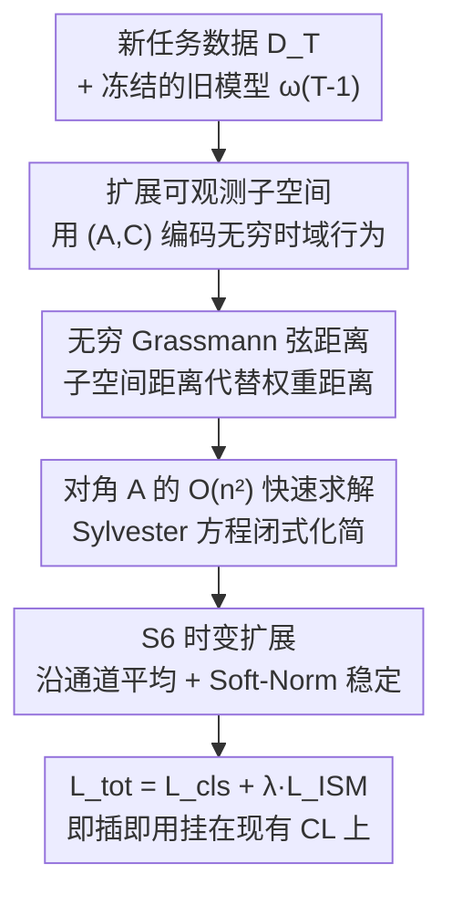

# Exemplar-Free Continual Learning for State Space Models

**会议**: CVPR 2026  
**arXiv**: [2505.18604](https://arxiv.org/abs/2505.18604)  
**代码**: 待确认  
**领域**: 持续学习 / 状态空间模型 (Mamba/SSM) / Vision Mamba  
**关键词**: 持续学习, 灾难性遗忘, 状态空间模型, 扩展可观测子空间, 无穷维 Grassmann 流形

## 一句话总结
本文提出 Inf-SSM——一种几何感知、无需存旧样本的正则化方法，把 SSM（如 Vim/Mamba）的"无穷时域行为"编码成扩展可观测子空间上的一个点，通过约束新旧任务子空间在无穷维 Grassmann 流形上的距离来抑制灾难性遗忘，并把原本 $\mathcal{O}(n^3)$ 的求解代价降到 $\mathcal{O}(n^2)$，即插即用地把现有持续学习方法平均 AA 提升 8.31%、遗忘 FM 降低 9.36%。

## 研究背景与动机
**领域现状**：状态空间模型（S4、S6、Mamba-2、Vision Mamba）凭借结构化递归和线性复杂度，正成为 Transformer 在序列/视觉建模上的有力替代。但把它们放进**持续学习 (Continual Learning, CL)** 场景——尤其是连旧任务样本都不许存的 EFCIL（Exemplar-Free Class-Incremental Learning）——几乎是一片空白。

**现有痛点**：把为 MLP/CNN/Transformer 设计的经典 CL 方法（EWC、SI、MAS、LwF）直接搬到 SSM 上，是把 $(\mathbf{A},\mathbf{B},\mathbf{C})$ 当成普通权重做 Frobenius 正则。问题在于 SSM 的"状态"是会随时间演化的动力系统，普通权重正则**完全无视 SSM 的几何结构和时序动力学**，导致约束既"用力过猛"又"打不到点上"。

**核心矛盾**：SSM 存在 **P-等价 (P-equivalence)**——对任意可逆矩阵 $\mathbf{P}$，参数 $(\mathbf{A},\mathbf{B},\mathbf{C})$ 与 $(\mathbf{P}\mathbf{A}\mathbf{P}^{-1},\mathbf{P}\mathbf{B},\mathbf{C}\mathbf{P}^{-1})$ 描述的是**同一个系统行为**（输入-输出映射完全相同）。这意味着同一个功能有无穷多组参数实现。Frobenius 距离对这条 P-轨道**不变性失效**：它会重罚那些功能等价的参数更新，又会轻放真正改变系统动力学的更新。换句话说，"参数变了多少"和"行为变了多少"根本不是一回事。

**本文目标**：设计一个 (1) 对 P-等价不变、(2) 捕获 SSM **无穷时域**行为、(3) 不需要任何旧样本、(4) 计算可负担的遗忘抑制项。

**切入角度**：作者从系统辨识理论借来**扩展可观测矩阵 (Extended Observability)**——用 $(\mathbf{A},\mathbf{C})$ 的无穷次幂堆叠 $[\mathbf{C};\mathbf{C}\mathbf{A};\mathbf{C}\mathbf{A}^2;\cdots]$ 完整刻画系统对随机激励的期望响应。这个矩阵张成的**子空间**恰好对 P-等价不变，天然落在无穷维 Grassmann 流形 $\mathrm{Gr}(n,\infty)$ 上。

**核心 idea**：不再正则化"参数离得多远"，而是正则化新旧模型的**扩展可观测子空间在 Grassmann 流形上离得多远**——用子空间距离代替权重距离，让约束忠实于 SSM 的真实行为。

## 方法详解

### 整体框架
Inf-SSM 把"防遗忘"重新定义为一个子空间距离最小化问题。训练任务 $T$ 时，对当前模型和上一任务保存的模型 $\boldsymbol\omega_{T-1}$，各自从 SSM 的 $(\mathbf{A},\mathbf{C})$ 构造**扩展可观测矩阵**，它张成的子空间唯一刻画了该 SSM 的无穷时域期望行为；再在无穷维 Grassmann 流形上计算两个子空间的弦距离 (chordal distance) 作为蒸馏正则项，与分类损失加权相加。整条链路的关键在于：直接算无穷维子空间距离不可行，作者证明它可以归约成解一个 **Sylvester 方程**，并利用主流 SSM 中 $\mathbf{A}$ 为对角矩阵的结构，把求解从 $\mathcal{O}(n^3)$ 压到 $\mathcal{O}(n^2)$（FLOPs 最多省 $100\times$），使其能即插即用地挂在任意现有 CL 方法上。

### 关键设计

**1. 扩展可观测子空间：把"无穷时域行为"压成 Grassmann 上的一个点**

普通参数正则的根本病灶是无视 P-等价。作者观察到：当 SSM 被高斯白噪声 $x[t]\sim\mathcal{N}(0,1)$ 激励时，期望输出递推为 $\mathbb{E}[y[t]]=\mathbf{C}\mathbf{A}\,\mathbb{E}[\boldsymbol h[t-1]]$，整段响应可写成 $[\mathbb{E}[y[1]];\mathbb{E}[y[2]];\cdots]=\mathbf{O}_\infty(\mathbf{A},\mathbf{C})\,\boldsymbol h[0]$，其中扩展可观测矩阵 $\mathbf{O}_\infty(\mathbf{A},\mathbf{C})=[\mathbf{C};\mathbf{C}\mathbf{A};\mathbf{C}\mathbf{A}^2;\cdots]\in\mathbb{R}^{\infty\times n}$。关键定理是：它列张成的子空间 $\mathcal{S}_\infty(\mathbf{A},\mathbf{C})$ 在 P-轨道上**不变**——$\mathcal{S}_\infty(\mathbf{A}',\mathbf{C}')=\mathcal{S}_\infty(\mathbf{A},\mathbf{C})$。

这正是 Frobenius 正则缺的东西：把"用随机激励统计探测系统"代替"存样本回放"，既绕过了 EFCIL 不许存数据的限制，又自动覆盖了无穷长时域；而且因为约束的是子空间而非具体参数实现，它对所有功能等价的更新一视同仁，只惩罚真正改变系统行为的漂移。每个子空间是 $\mathrm{Gr}(n,\infty)$ 上的一个点，遗忘就被翻译成"这个点在流形上跑了多远"。

**2. 无穷 Grassmann 弦距离的 $\mathcal{O}(n^2)$ 闭式求解：让"无穷维"真的能算**

有了子空间表示，还得能量它们的距离，否则无法构造 loss。两个子空间的弦距离 $d_{\text{chord}}^2(\mathcal{S},\mathcal{S}')=2n-2\|\mathcal{S}^\top\mathcal{S}'\|_F^2$ 需要 $\mathcal{S}=\mathbf{O}(\mathbf{O}^\top\mathbf{O})^{-1/2}$，而 $\mathbf{O}$ 是无穷高的，直接算不可行。作者把核心 Gram 矩阵 $\mathbf{G}=\mathbf{O}_\infty^\top\mathbf{O}_\infty'=\sum_{t=0}^\infty(\mathbf{A}^\top)^t\mathbf{C}^\top\mathbf{C}'(\mathbf{A}')^t$ 归约成一个 **Sylvester 方程**：

$$\mathbf{A}^\top\mathbf{G}\mathbf{A}'-\mathbf{G}=-\mathbf{C}^\top\mathbf{C}'$$

通用解（Bartels-Stewart 算法）是 $\mathcal{O}(n^3)$，随状态维 $n$ 增长很贵。但主流结构化 SSM 的 $\mathbf{A}$ 是**对角阵**，作者据此把方程化成逐元素的 Hadamard 形式，得到闭式解：

$$\mathbf{G}=\mathbf{C}^\top\mathbf{C}'\odot\frac{1}{\mathbf{1}_n-\mathbf{A}_{\text{diag}}\mathbf{A}_{\text{diag}}'^{\top}}$$

这把复杂度从 $\mathcal{O}(n^3)$ 降到 $\mathcal{O}(n^2)$，FLOPs 从 Bartels-Stewart 的 $25n^3$ 砍到 $4n^2$；在 Vim 的 $n=16$ 时省了 $100\times$。算一次距离需解三个这样的方程（拿到 $\mathbf{G}_1,\mathbf{G}_2,\mathbf{G}_3$ 后做矩阵代数），正是这步把"无穷维子空间正则"从理论变成能跑的工程方案。

**3. 面向 S6/Vim 时变系统的可观测集构造：让方法挂得上真正的 Mamba**

S4D/Mamba 的 $\mathbf{A}\in\mathbb{R}^{\tau\times o\times n}$、$\mathbf{C}\in\mathbb{R}^{\tau\times n}$ 是**时变**的（每个序列位置 $\tau$ 含 $o$ 个 LDS），不再是单一 LTI 系统，前两个设计不能直接套。作者为每个时间步生成一组扩展可观测矩阵 $\mathbb{O}=\{\mathbf{O}_{\infty,t}(\tilde{\mathbf{A}}_t,\tilde{\mathbf{C}}_t)\}_{t=1}^\tau$：把状态沿**外维（通道）$o$ 求平均**得到 $\tilde{\mathbf{A}}=\mathrm{SN}(\frac1o\sum_i\overline{\mathbf{A}}_{i,j})$、$\tilde{\mathbf{C}}=\mathrm{SN}(\mathbf{C})$，其中 Soft-Normalization $\mathrm{SN}(x)=2/(1+e^{-x})-1$ 用来强制 Schur 稳定性（保证幂级数收敛）。

沿 $o$ 平均不是偷懒：直接对 $\tau\times o$ 对 SSM 算距离在 Vim-small 上是 $197\times384\approx7.6\times10^4$ 对，单张 H100 显存都装不下；而通道平均在保留最大方差（信息损失最小）的同时把规模压到可承受。这一步是让 Inf-SSM 从"理论上对 LTI 成立"落地到"实际能正则真·Mamba"的桥梁。

### 损失函数 / 训练策略
最终 Inf-SSM 损失取新旧任务可观测集的期望弦距离 $L_{\texttt{ISM}}=\mathbb{E}_{\mathcal{D}_T}\{d_{\text{chord}}^2(\mathbb{O}_{T-1},\mathbb{O}_T)\}$，与基模型分类损失加权：$L_{\texttt{tot}}=L_{\texttt{cls}}+\lambda L_{\texttt{ISM}}$。整个方法**只引入一个超参 $\lambda$**（很多 SOTA CL 方法需 ≥5 个），极易调参与部署，也是其能即插即用的前提。作者另给出 Inf-SSM+ 变体，额外加一个对 $\mathbf{B}$ 的 Frobenius 项，但实验显示与 Inf-SSM 表现相近，印证了"$(\mathbf{A},\mathbf{C})$ 已足够刻画行为"的理论判断。

## 实验关键数据
骨干统一为 Vim-Small，数据集为 ImageNet-R / CIFAR-100 / Caltech-256，各切成 5 / 10 个序列任务；指标为平均准确率 AA(↑)、平均增量准确率 AIA(↑)、遗忘度 FM(↓)。

### 主实验：即插即用集成到现有 CL 方法（5-Tasks）

| 方法 | 数据集 | AA(%↑) | FM(%↓) |
|--------|------|------|------|
| X-DER | ImageNet-R | 47.42 | 42.99 |
| **+Inf-SSM** | ImageNet-R | **52.61** | **31.00** |
| X-DER | CIFAR-100 | 42.33 | 65.07 |
| **+Inf-SSM** | CIFAR-100 | **48.33** | **56.66** |
| X-DER | Caltech-256 | 58.51 | 44.84 |
| **+Inf-SSM** | Caltech-256 | **68.04** | **32.11** |
| LUCIR | ImageNet-R | 31.18 | 60.24 |
| **+Inf-SSM** | ImageNet-R | **35.35** | **52.05** |

平均而言，挂上 Inf-SSM 使各 baseline 的 AA 提升 8.31%、FM 降低 9.36%；在最强 baseline X-DER 上提升尤为显著（平均 AA +19.61%、FM −23.16%）。任务数越多收益越大，说明它确实抓住了 SSM 在长任务序列上的演化。

### 独立对比 EFCIL 旗舰方法（Vim-small，正则 $(\mathbf{A},\mathbf{B},\mathbf{C})$ 设定下，Inf-SSM 仅正则 $(\mathbf{A},\mathbf{C})$）

| 配置 | ImageNet-R AA / FM | CIFAR-100 AA / FM | Caltech-256 AA / FM | 说明 |
|------|------|------|------|------|
| Seq（无防遗忘） | 38.36 / 56.43 | 36.68 / 55.00 | 37.58 / 71.48 | 下界 |
| EWC | 45.58 / 47.31 | 38.25 / 50.71 | 42.93 / 64.30 | 参数重要性正则 |
| LwF-ABC | 45.09 / 40.77 | 44.62 / 38.68 | 46.52 / 59.03 | 蒸馏 $(\mathbf{A},\mathbf{B},\mathbf{C})$ |
| **Inf-SSM** | **49.34 / 25.14** | 45.18 / 36.59 | **50.75 / 49.93** | 仅正则 $(\mathbf{A},\mathbf{C})$ 仍最优 |

即便被故意放在"只用 $(\mathbf{A},\mathbf{C})$ 对打别人用 $(\mathbf{A},\mathbf{B},\mathbf{C})$"的不利位置，Inf-SSM 平均仍把 FM 降 14.56%、AA 提 6.79%；若都只正则 $(\mathbf{A},\mathbf{C})$，则平均 FM 降 40.18%、AA 提 21.73%。这印证了"正则扩展可观测子空间足以控制 SSM 行为演化"的理论判断。

### 效率分析（Vim-small，单 A40 GPU）

| 操作 | 平均耗时 (s) | 说明 |
|------|------|------|
| EWC Loss (每 batch) | 0.0095 | 但每任务额外需 181.5s 算 FIM |
| X-DER Loss (每 batch) | 1.2534 | 近期方法，慢 |
| **Inf-SSM Loss (每 batch)** | **0.0960** | 比 X-DER 快一个量级，且无任务级开销 |

### 关键发现
- **遗忘下降是主收益**：FM 降幅普遍大于 AA 升幅，说明 Inf-SSM 主要在"稳定性/记得住旧任务"上发力，且任务越长越明显。
- **$(\mathbf{A},\mathbf{C})$ 足矣**：加上对 $\mathbf{B}$ 的正则（Inf-SSM+）只带来零星提升，与"扩展可观测子空间由 $(\mathbf{A},\mathbf{C})$ 唯一决定"的理论一致。
- **正则更多 Vim block 更好**：消融显示对越多 block 施加 Inf-SSM 越好，因为浅层施压会导致过度正则；CKD 分析也发现浅层 SSM 状态结构变化小、深层变化大。
- **效率甜点**：Inf-SSM 单 batch 0.096s，比 X-DER 快约 13×，又不像 EWC 需要每任务跑一遍全数据集算 FIM（181.5s/任务）。

## 亮点与洞察
- **用"系统行为"而非"参数距离"定义遗忘**：把控制论的扩展可观测性 + Grassmann 几何引入持续学习，从根上化解 P-等价导致的"参数变化 ≠ 行为变化"问题，是一个真正对 SSM 量身定制的视角，而非通用方法的简单移植。
- **无穷维 → $\mathcal{O}(n^2)$ 的工程化**：把"无穷时域子空间距离"归约成 Sylvester 方程、再借对角 $\mathbf{A}$ 化成 Hadamard 闭式解，FLOPs 省到 $4n^2$，是理论漂亮且能跑的少见结合。
- **极简即插即用**：只加一个超参 $\lambda$，能同时挂在 replay/replay-free/prompt/frequency 各类 CL 方法上并普遍涨点，部署成本极低，工程友好度高。
- **可迁移思路**：用"随机激励统计探测系统响应"代替"存样本回放"的范式，可启发其它无样本场景（如隐私受限的模型蒸馏、模型压缩）下如何刻画并保持一个动力系统的行为。

## 局限与展望
- **依赖对角 $\mathbf{A}$ 的加速**：$\mathcal{O}(n^2)$ 闭式解建立在主流 SSM $\mathbf{A}$ 为对角阵之上；一般稠密 $\mathbf{A}$ 下方法仍成立，但要退回 $\mathcal{O}(n^3)$ 的通用 Sylvester 求解，失去速度优势（作者承认这是局限，但强调对角是架构选择而非方法限制）。
- **沿通道平均的信息损失**：S6 扩展为避免显存爆炸，把 $\tau\times o$ 对 SSM 沿外维平均成 $\tau$ 个，虽声称保留最大方差，但仍是一种近似，对通道间差异大的任务可能有损。
- **基线不可直接横比**：作者明确标注不同 baseline 因 batch size/epoch 不同而**不能直接比绝对值**，因此应聚焦"挂上 Inf-SSM 前后的相对增益"而非跨方法绝对排名。
- **评测范围**：仅在 Vim-Small + 三个图像分类数据集上验证，未涉及 NLP/语音/更大规模 SSM，泛化性待进一步检验。
- **展望**：作者提出可结合 Schubert 簇处理不同维度、用 RKHS 核方法获得更丰富表示，并把 Inf-SSM 拓展到知识蒸馏与模型压缩。

## 相关工作与启发
- **vs EWC / SI / MAS（参数重要性正则）**：它们估计权重重要性并惩罚关键权重变化，本质是参数空间的 Frobenius 约束，对 SSM 无视 P-等价；Inf-SSM 在行为/子空间空间上约束，对功能等价更新不误伤，遗忘抑制更强。
- **vs LwF（输出/特征蒸馏）**：LwF 在 logits/特征上蒸馏需要前向产生输出，本文则用随机激励的无穷时域期望响应构造可观测子空间，天然无样本且覆盖无穷时域。
- **vs 回放类 ER / LUCIR / X-DER**：它们靠存旧样本或特征做一致性约束，受隐私/存储限制；Inf-SSM 是 EFCIL（零样本存储），却能作为附加项挂在这些方法上进一步涨点。
- **vs Mamba-based CL（cheng2024mamba 等）**：现有 Mamba CL 方法多依赖存特征嵌入、且不显式利用 SSM 几何；本文是首个显式利用 SSM 可观测性几何的 CL 方法，且与上述方法互补。

## 评分
- 新颖性: ⭐⭐⭐⭐⭐ 首个把扩展可观测子空间 + 无穷 Grassmann 几何引入 SSM 持续学习，视角独到且理论自洽
- 实验充分度: ⭐⭐⭐⭐ 覆盖 3 数据集 × 2 任务长度 × 5 类 CL 范式 + 效率与多项消融，但仅限 Vim-Small 视觉分类
- 写作质量: ⭐⭐⭐⭐ 理论推导清晰、动机层层递进，公式较密集对非控制论背景读者有门槛
- 价值: ⭐⭐⭐⭐⭐ 单超参即插即用、普遍涨点且高效，对 SSM 持续学习落地实用价值高

<!-- RELATED:START -->

## 相关论文

- [\[CVPR 2026\] A Faster Path to Continual Learning](a_faster_path_to_continual_learning.md)
- [\[CVPR 2026\] Parameter-efficient Continual Learning for Enhancing Plasticity without Forgetting under Limited Model Capacity](parameter-efficient_continual_learning_for_enhancing_plasticity_without_forgetti.md)
- [\[CVPR 2026\] Spectral Mixture-of-Experts for Continual Learning](spectral_mixture-of-experts_for_continual_learning.md)
- [\[CVPR 2026\] Subspace Alignment for CLIP-based Continual Learning via Canonical Correlation Analysis](subspace_alignment_for_clip-based_continual_learning_via_canonical_correlation_a.md)
- [\[CVPR 2026\] FEAT: Federated Geometry-Aware Correction for Exemplar Replay under Continual Dynamic Heterogeneity](feat_federated_geometry_aware_correction_for_exemplar_replay_under_continual_dynamic_heterogeneity.md)

<!-- RELATED:END -->
