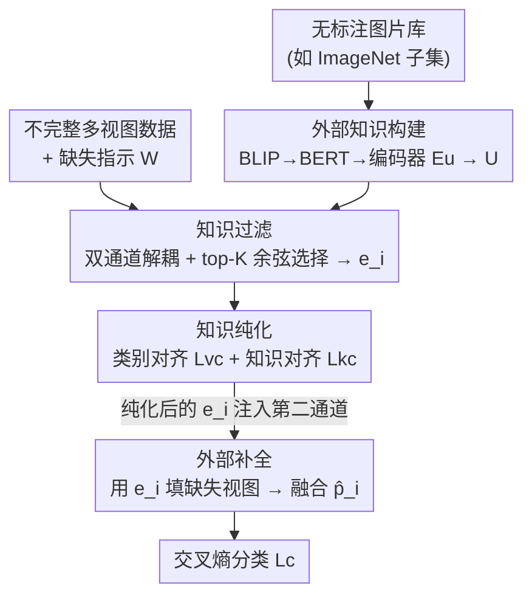

# EXOTIC: External Vision-driven Incomplete Multi-view Classification

**会议**: CVPR 2026  
**论文**: [CVF Open Access](https://openaccess.thecvf.com/content/CVPR2026/html/Xu_EXOTIC_External_Vision-driven_Incomplete_Multi-view_Classification_CVPR_2026_paper.html)  
**代码**: https://github.com/sstaree/EXOTIC  
**领域**: 多视图学习 / 不完整多视图分类  
**关键词**: 不完整多视图分类, 外部视觉知识, 缺失视图补全, 知识纯化, 双通道解耦

## 一句话总结
EXOTIC 首次把"外部视觉知识库"引入不完整多视图分类（IMVC），用预训练视觉语言模型把一堆无标注图片转成语义先验，经过滤、纯化后去补全缺失视图，从而打破现有方法只靠"内部监督"的性能天花板——在高缺失率下相比 SOTA 提升尤其明显（LandUse21 在 MR=0.1 时 80.0% vs 次优 72.1%）。

## 研究背景与动机
**领域现状**：现实中的多视图数据（同一对象的多种传感器/模态/特征）常因传感器故障、遮挡而部分缺失，于是 IMVC（不完整多视图分类）成了热点。主流做法分两路：一是"缺失补全"（用隐图、原型、自编码器把缺失特征补回来），二是"免补全"（只用已有视图学一个共享子空间）。

**现有痛点**：无论哪一路，这些方法都**只从不完整数据内部挖语义**——可用信息本来就少，缺失越多内部监督越稀薄，于是存在一个内生的"性能天花板"。论文的核心观察是：有大量对分类有用的**外部知识**被白白忽略了。

**核心矛盾**：直接引外部知识也不是免费午餐。已有用外部知识的工作（如 SIC、TAC）依赖 WordNet 这类**结构化文本描述**，而高质量文本描述往往难获取、覆盖不全；更麻烦的是外部知识来源异构、语义有偏，一旦它和样本标签或模型内部表示冲突，就会引入"语义噪声"，破坏原本的标签分布、削弱判别力。所以真正的难点是：**怎么构造一个易得又高质量的外部知识源，并把它和内部表示调和到不打架**。

**切入角度**：图片资源在互联网上海量且易得、视觉语义丰富。作者于是用"视觉库"取代"文本库"作为外部知识源——但视觉库是无标注、含噪的，必须先过滤再纯化才能用来补缺。

**核心 idea**：用预训练 VLM 把无标注图片库转成语义表示作为"外部监督"，经过**过滤（选相关）+ 纯化（对齐去冲突）**后，去**补全**缺失视图——首次让外部视觉知识充当 IMVC 的监督信号。

## 方法详解

### 整体框架
给定 $V$ 个视图的数据集 $\{X^v\in\mathbb{R}^{N\times d_v}\}_{v=1}^V$，用缺失指示矩阵 $W\in\{0,1\}^{N\times V}$ 标记哪个视图存在（缺失位置填零），目标是在视图不全的情况下学一个稳健的分类器。EXOTIC 由四个组件串成，并刻意拆成**双通道解耦**结构：第一通道专做"外部知识的过滤与纯化"，第二通道专做"表示学习 + 用纯化后的知识补全缺失视图 + 分类"，两路分工避免互相干扰。

整体数据流：无标注图片库 → BLIP 生成文字描述 → BERT 编码 → 知识编码器得到外部知识表示 $U$；同时多视图数据进第一通道编码并融合成内部表示 $z$，用余弦相似度从 $U$ 里 top-$K$ 选出每个样本专属的外部知识 $e_i$；再用两个对齐损失把 $e_i$ 纯化到和内部表示、和标签都一致；最后第二通道用 $e_i$ 填补缺失视图、融合后做交叉熵分类。

### 关键设计

**1. 外部视觉知识构建：把"无标注图片"翻译成可用的语义先验**

痛点很直接——文本知识库（WordNet 那种）难获取、覆盖窄，但图片满地都是。作者选一批多样、无标注的图片（论文用 ImageNet 的一个子集，5 万张、1000 类）当通用外部知识。关键一步是"视觉→语言"的转译：先用 BLIP 给每张图生成文字描述，再用 BERT 把描述编码成向量 $M$。这一步的价值在于，原始像素给不了高层语义，而经过 BLIP 描述后，知识被抬升到"语义"层面，更适合和多视图的判别任务对齐。最后再过一个知识编码器 $E_u:M\to U$，得到外部知识表示 $U$，供后面过滤、纯化使用。整个过程**无需人工标注**，所以易扩展。

**2. 知识过滤 + 双通道解耦：只挑任务相关的知识，且不打扰表示学习**

视觉库虽然语义丰富，但直接全用会塞进大量噪声和语义偏差，污染补全。过滤模块为每个样本自适应地挑出语义对齐的外部知识。机制上，第一通道编码器 $E_c^v$ 把各视图编成表示，按可用视图做加权平均得到内部融合表示 $z_i=\sum_{v} c_i^{(v)}W_{i,v}/\sum_{v}W_{i,v}$（缺失视图被 $W$ 屏蔽掉）；再算它与每条外部知识 $u_i$ 的余弦相似度 $S(u_i,z_j)=\frac{u_i z_j^\top}{\|u_i\|\|z_j\|}$，取 top-$K$ 后平均得到样本专属知识 $e_i=\frac{1}{K}\sum_{k=1}^{K}u_{i,k}$。

这里的关键巧思是**双通道解耦**：第一通道 $\{E_c^v:X^v\to C^v\}$ 只负责过滤/精炼外部知识，第二通道 $\{E_p^v:X^v\to P^v\}$ 只负责表示学习与分类。如果让同一套表示既要"判断哪条外部知识相关"又要"做分类",两个目标会互相牵扯；拆成两路后，过滤任务和表示任务各自优化、互不干扰，训练更稳、补全质量更高。

**3. 知识纯化：用两个对齐损失把外部知识"洗"到既贴标签又贴内部表示**

光过滤还不够——选出来的 $e_i$ 仍含任务无关信息，且和领域内的多视图表示存在天然差异，硬拿去补缺会引入语义冲突。纯化模块用两个损失解决。其一是**类别对齐损失** $L_{vc}$，一种有监督对比形式：

$$L_{vc}=-\log\frac{\sum_{i}\sum_{j\neq i}\mathbb{I}[\gamma]\cdot\exp(S(z_i,z_j)/\tau)}{\sum_{i}\sum_{j\neq i}\exp(S(z_i,z_j)/\tau)}$$

其中 $\mathbb{I}[\gamma]$ 在 $z_i,z_j$ 同标签时为 1、否则为 0。它逼着第一通道过滤出的知识保持"任务相关"——同类样本的内部表示拉近，从而保证被选知识服务于具体分类任务。其二是**知识对齐损失** $L_{kc}$，在视图级上最大化外部知识 $e_i$ 与视图特定表示 $c_i^v$ 的一致性（带 $q$ 次幂的可调惩罚）：

$$L_{kc}=\sum_{v=1}^{V}\frac{1}{\log(q+1)}\left(1-\frac{\sum_i W_{i,v}\exp(S(e_i,c_i^v)/\tau)}{\sum_i\sum_j W_{i,v}\exp(S(e_i,c_j^v)/\tau)}\right)^{q}$$

它负责"调和内外信息"，让外部知识与内部表示对齐，避免外部语义把模型带偏。两者一个管"贴标签"、一个管"贴内部表示"，互补地把外部知识纯化成可安全使用的补全材料。

**4. 外部补全：缺失位置用纯化知识顶上，存在位置保留原表示**

补全发生在第二通道。第二通道编码器 $E_p^v$ 产出视图表示 $p_i^v$，再把第一通道纯化好的 $e_i$ 注入，按缺失指示做逐视图选择融合：

$$\hat{p}_i=\sum_{v=1}^{V}\big(W_{i,v}\cdot p_i^v+(1-W_{i,v})\cdot e_i\big)$$

即视图存在（$W_{i,v}=1$）就用真实表示 $p_i^v$，视图缺失（$W_{i,v}=0$）就用外部知识 $e_i$ 顶替。融合后的 $\hat{p}_i$ 送 softmax 做最终分类，用交叉熵 $L_c=-\frac{1}{N}\sum_i y_i\log p(\hat{p}_i)$ 监督。这一步正是"外部视觉知识真正发挥作用"的地方——t-SNE 可视化显示，相比用零或均值补全，外部知识补全能得到更清晰的类间边界。

### 损失函数 / 训练策略
总损失为三项加权：$L_{all}=L_c+\alpha\cdot L_{kc}+\beta\cdot L_{vc}$，其中 $\alpha,\beta$ 为惩罚系数。实现上：视图编码器/知识编码器均为带 ReLU 的全连接网，结构为 $d_{in}\text{-}1024\text{-}1024\text{-}1500\text{-}d_{out}$；SGD 优化、batch 128、训练 100 epoch；学习率按数据集取 0.01 / 0.001 / 0.005；超参经验设 $\alpha=30,\ \beta=1,\ q=0.3$。

## 实验关键数据

### 主实验
7 个多视图数据集（Caltech101 / Scene15 / LandUse21 / HW / Fashion / NUSWIDE / CUB），对比 10 个 IMVC 方法，缺失率 MR ∈ {0.1,0.3,0.5,0.7,0.9}，5 次平均准确率（%）。下表节选 MR=0.1 与 MR=0.9 两个极端（"次优"为对应列除 EXOTIC 外的最高值）。

| 缺失率 | 数据集 | EXOTIC | 次优方法 | 提升 |
|--------|--------|--------|----------|------|
| 0.1 | Caltech101 | 94.33 | 91.41 (LMVCAT) | +2.9 |
| 0.1 | LandUse21 | 80.00 | 72.14 (DCP) | +7.9 |
| 0.1 | NUSWIDE | 53.26 | 46.82 (DICNET) | +6.4 |
| 0.9 | Caltech101 | 88.16 | 81.88 (LMVCAT) | +6.3 |
| 0.9 | LandUse21 | 55.24 | 44.29 (DIMC) | +10.9 |
| 0.9 | HW | 94.05 | 92.20 (DICNET) | +1.9 |

关键结论：(1) 即便低缺失率（MR=0.1）EXOTIC 也已全面领先；(2) 高缺失率（MR≥0.3）在所有数据集上都拿第一；(3) 随缺失率上升，EXOTIC 掉点最小，鲁棒性最强——这正契合"外部知识在内部信息稀薄时补位"的设计意图。

### 消融实验
0.9 缺失率下，去掉不同组件（EXOTIC-1：去 $L_{kc}$；EXOTIC-2：去 $L_{vc}$；EXOTIC-3：两损失都去；EXOTIC-4：去外部知识补全）。

| 配置 | Caltech101 | LandUse21 | HW | 说明 |
|------|-----------|-----------|-----|------|
| EXOTIC（Full） | 88.16 | 55.24 | 94.20 | 完整模型 |
| EXOTIC-1（w/o $L_{kc}$） | 85.47 | 54.14 | 93.95 | 去知识对齐，多数集掉点 |
| EXOTIC-2（w/o $L_{vc}$） | 84.31 | 51.05 | 92.80 | 去类别对齐，全数据集掉点，LandUse21 尤甚 |
| EXOTIC-3（w/o 双损失） | 86.13 | 53.38 | 93.10 | 两损失都去 |
| EXOTIC-4（w/o 外部补全） | 85.38 | 54.43 | 93.30 | 去掉外部知识补全 |

### 关键发现
- 类别对齐损失 $L_{vc}$ 影响最大：去掉后全数据集掉点，LandUse21 从 55.24 → 51.05（−4.2），说明"让外部知识贴任务标签"是核心。
- 外部知识库的规模与来源：100 样本时补全不稳定，规模增大后性能稳步提升直至饱和（ImageNet 100→500→5万 在 Caltech101 上 75.98→87.41→88.16），体现可扩展性；连**跨域**的卡通图库 iCartoonFace（2000 张）也能拿到有竞争力的结果，说明对知识来源不挑食。
- 超参敏感性：$\alpha,\beta$ 增大先提升（外部知识质量变好），过大则引入冗余的任务无关信息反而压性能；$q$ 过大会让惩罚过尖锐而失效。

## 亮点与洞察
- **"视觉库代替文本库"是最巧的一招**：绕开了 WordNet 这类结构化文本难获取的瓶颈，用满地都是的无标注图片当知识源，再用 BLIP 做"视觉→语言"转译抬升语义。这个思路可迁移到任何"缺监督但有海量无标注图"的任务。
- **双通道解耦把"选知识"和"用知识"拆开**：避免了过滤目标和分类目标抢同一套表示导致的相互干扰，是个朴素但有效的工程化解法。
- **跨域知识也能用**：卡通图库都能补好自然图像数据集，暗示外部知识起作用的是"高层语义先验"而非像素级匹配，对知识库的领域要求被大幅放宽。

## 局限与展望
- 外部知识构建依赖 BLIP+BERT 的离线流水线，对 5 万张图做描述+编码有不小的预处理开销；论文未 report 这部分时间/存储成本。
- ⚠️ 消融在 Scene15 上出现 EXOTIC-1/3 反而略高于 Full（如 Scene15 EXOTIC-3 62.77 vs Full 62.53）的个别反例，说明两个对齐损失并非在所有数据集上都单调有益——以原文表格为准。
- top-$K$ 的 $K$、知识库规模都需按数据集调，跨域虽可用但最优来源仍需经验选择；论文也未深入分析 BLIP 描述错误时对补全的影响。
- 当前只验证了分类任务，是否能推广到多视图聚类/检索等其他下游任务待考。

## 相关工作与启发
- **vs 内部监督类 IMVC（DIMC / DICNET / AIMNET 等）**：它们只从不完整数据内部挖语义补缺，受多视图结构信息上限约束；EXOTIC 引入外部视觉知识打破这个天花板，高缺失率下优势被进一步放大。
- **vs 外部文本知识类（SIC / TAC，用 WordNet）**：它们靠结构化文本、且多用于无监督聚类，文本描述难获取且在监督场景下易引语义冲突；EXOTIC 改用易得的视觉库，并专门设计过滤+纯化两道工序来抑制语义噪声，使外部知识能安全服务于有监督分类。

## 评分
- 新颖性: ⭐⭐⭐⭐⭐ 首次把外部视觉知识库作为 IMVC 监督信号，视角清新且动机扎实
- 实验充分度: ⭐⭐⭐⭐ 7 数据集 × 5 缺失率 × 10 对比方法，外加知识来源/规模分析，较充分；个别消融反例未解释
- 写作质量: ⭐⭐⭐⭐ 四组件结构清晰、公式完整，框架图与正文对得上
- 价值: ⭐⭐⭐⭐ "无标注图片当外部知识"的范式可迁移性强，高缺失率场景实用

<!-- RELATED:START -->

## 相关论文

- [\[CVPR 2026\] Cross-View Distillation and Adaptive Masking for Incomplete Multi-View Multi-Label Classification](cross-view_distillation_and_adaptive_masking_for_incomplete_multi-view_multi-lab.md)
- [\[CVPR 2026\] Imbalanced View Contribution Evaluation and Refinement for Deep Incomplete Multi-View Clustering](imbalanced_view_contribution_evaluation_and_refinement_for_deep_incomplete_multi.md)
- [\[CVPR 2026\] DF²-VB: Dual-level Fuzzy Fusion with View-specific Boosting for Multi-view Multi-label Classification](df2-vb_dual-level_fuzzy_fusion_with_view-specific_boosting_for_multi-view_multi-.md)
- [\[CVPR 2026\] Plug-and-Play Incomplete Multi-View Clustering via Janus-Faced Affinity Learning with Topology Harmonization](plug-and-play_incomplete_multi-view_clustering_via_janus-faced_affinity_learning.md)
- [\[CVPR 2026\] Multi-Hierarchical Contrastive Spectral Fusion for Multi-View Clustering](multi-hierarchical_contrastive_spectral_fusion_for_multi-view_clustering.md)

<!-- RELATED:END -->
