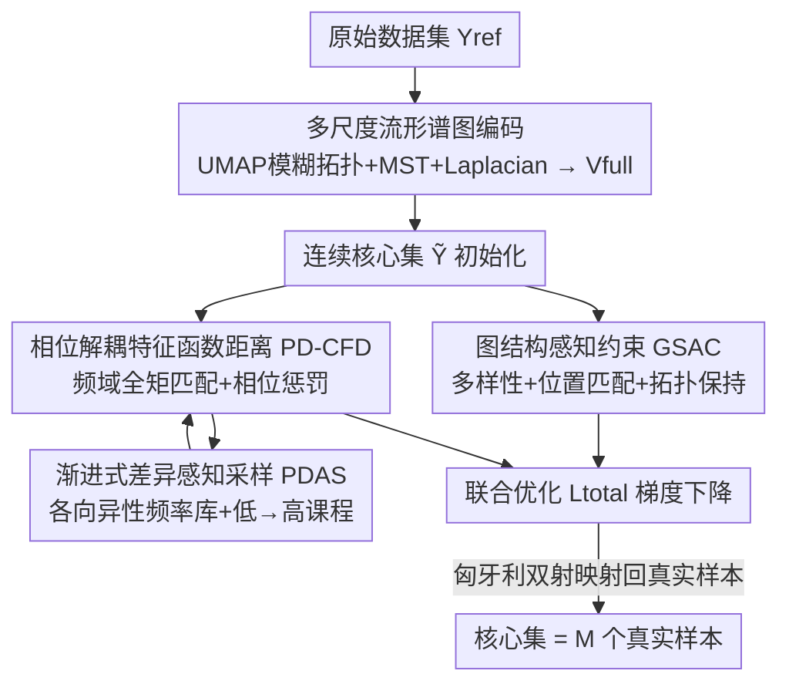

# FAST: Topology-Aware Frequency-Domain Distribution Matching for Coreset Selection

**会议**: CVPR 2026  
**论文**: [CVF Open Access](https://openaccess.thecvf.com/content/CVPR2026/html/Cui_FAST_Topology-Aware_Frequency-Domain_Distribution_Matching_for_Coreset_Selection_CVPR_2026_paper.html)  
**代码**: https://github.com/CAGResearch/FAST-Coreset-Selection  
**领域**: 模型压缩 / 数据集压缩  
**关键词**: coreset selection, 特征函数距离, 谱图论, 频域分布匹配, 课程式采样

## 一句话总结
FAST 把"从大数据集挑出小核心子集"这件事重新表述为一个**谱图约束下的连续分布匹配优化**问题，用**特征函数距离（CFD）** 在频域逐阶匹配原数据集的全部矩信息，再靠拓扑约束把连续解拉回到真实离散样本上，不依赖任何代理 DNN，平均精度比 SOTA 高 9.12%，能耗降 96.57%、CPU 上 2.2× 加速。

## 研究背景与动机
**领域现状**：coreset selection（核心集选择）是数据集压缩的一条主流路线——从原始大数据集里直接挑出一个小而有代表性的真实样本子集来训练网络，相比合成式蒸馏（dataset distillation）省去了昂贵的嵌套梯度下降，特别适合端侧部署。现有方法分两派：(i) **DNN-based**，用一个代理网络对每个样本算"贡献度"（loss、梯度、遗忘次数等）来打分挑样本；(ii) **DNN-free**，完全不用网络，靠几何/启发式准则（如网格采样、流形降维）挑样本。

**现有痛点**：DNN-based 方法和具体网络架构强耦合，引入**架构偏置**——换个下游模型就掉点严重，泛化差且采样开销大；DNN-free 方法虽然没有架构偏置、更高效，但只是启发式，缺乏理论保证，往往只匹配低阶统计量（均值、方差），稳定性差。更关键的是，**两派都没有显式约束"子集和原集分布等价"**，挑出来的子集覆盖不全、不能真正代表原始数据。

**核心矛盾**：为什么大家不直接做分布匹配？因为连续分布匹配（如基于梯度在特征空间连续优化）被普遍认为**不适用于离散的数据集采样**——连续优化得到的点会偏离真实数据流形，找不到对应的真实样本。同时，常用的分布度量（MSE、KL、CE、MMD）受限于模型族/核函数的选择，**抓不住高阶矩差异和多元相关性**，只能对齐到二阶。

**本文目标**：(1) 让"连续优化的分布匹配"第一次能用在离散 coreset 选择上；(2) 找一个能捕获**全部矩信息**的分布度量；(3) 让匹配在极少量频率下就稳定收敛。

**切入角度**：作者注意到一个分布的**特征函数（Characteristic Function, CF）**——也就是它的傅里叶变换——在频域里**唯一地编码了这个分布的所有矩和相关性**。于是用 CF 之间的距离（CFD）当度量，就有了"完整分布等价"的严格保证；再用谱图论给连续优化加拓扑约束，把优化出的连续点一一锚定回真实离散样本。

**核心 idea**：用频域的特征函数距离代替低阶统计度量来衡量分布等价，用谱图拓扑约束把连续优化解钉回离散数据流形——从而把"DNN-free + 完整分布匹配 + 离散选择"三件事第一次拼到一起。

## 方法详解

### 整体框架
FAST（Frequency-domain Aligned Sampling via Topology）的输入是原始数据集 $Y_{ref}$（$N$ 个样本）和目标核心集大小 $M\ll N$，输出是从原集里选出的 $M$ 个真实样本。整条管线分三段：**先把数据的内在流形结构编码成谱图特征 $V_{full}$**（Graph Encoder）；**再优化一个连续的核心集表示 $\tilde{Y}\in\mathbb{R}^{M\times d}$**，让它在频域上（用 PD-CFD 度量）逼近 $V_{full}$ 的分布，同时被拓扑约束（GSAC）牵引、保证每个连续点都能对应到一个真实样本；**最后通过 Graph Decoder 把优化好的连续核心集映射回原始数据空间**，匈牙利算法解出双射，挑出对应的 $M$ 个真实样本。

优化过程中两条线并行：一条是 **PDAS（Progressive Discrepancy-Aware Sampling）** 决定"这一步用哪些频率来算 CFD"——从低频到高频课程式推进；另一条是 **GSAC（Graph-Structure-Aware Constraints）** 用三个约束（多样性、位置匹配、拓扑保持）防止连续优化退化成几个点塌缩到一起。

### 关键设计

**1. 多尺度流形谱图编码：给连续优化一个稳定的"地基"**

要做分布匹配，第一步得有一个能反映原数据几何结构的稳定特征空间。作者不直接在像素/特征上算，而是基于 UMAP 的模糊拓扑理论构造一个**多尺度加权无向图** $B\in\mathbb{R}^{N\times N}$：对每个数据点 $x_i$、每个近邻尺度 $k$，先解 $\sum_{j=1}^{k}\exp\!\big(-\max(0, d(x_i,x_{ij})-\rho_i)/\sigma_i\big)=\log_2(k)$ 求出局部连通距离 $\rho_i$ 和尺度因子 $\sigma_i$，得到有向边权；再用概率 t-conorm（模糊集并）$A_k = A_k + A_k^T - A_k\circ A_k^T$ 对称化，把多个尺度的图融合成单个 $B$，并并入最小生成树 $B = B\cup \text{MST}(B)$ 保证全局连通。最后取对称归一化拉普拉斯 $L_{sym} = I - D^{-1/2}BD^{-1/2}$ 的最小非零特征值对应的 $d$ 个特征向量（$d\ll N$），拼成流形特征矩阵 $V_{full}$。这组谱嵌入是流形 Laplace-Beltrami 算子的离散近似，揭示了数据的内在几何，作为后续所有优化的参照系。之所以要做这一步，是因为后面要在连续空间里优化、又必须能映回离散样本，必须先有一个**对真实样本拓扑忠实**的坐标系。

**2. 相位解耦特征函数距离（PD-CFD）：在频域抓住被标准 CFD 漏掉的高频细节**

这是全文最核心的度量创新。标准的经验特征函数为 $\varphi_Y(t)=\frac{1}{|Y|}\sum_{y\in Y}e^{i\langle t,y\rangle}$，CFD 把两个分布的 CF 在频率上的平方差积分起来：$L_{CFD}=\mathbb{E}_{t\sim p(t)}\big[|\varphi_{\tilde Y}(t)-\varphi_{Y_{ref}}(t)|^2\big]$。作者用极坐标展开这个被积项，发现一个致命问题——**消失相位梯度（Vanishing Phase Gradient）**：

$$|\varphi_{\tilde Y}-\varphi_{Y_{ref}}|^2 = A_{\tilde Y}^2 + A_{Y_{ref}}^2 - 2A_{\tilde Y}A_{Y_{ref}}\cos(\theta_{\tilde Y}-\theta_{Y_{ref}})$$

相位差 $\Delta\theta$ 的贡献被幅值乘积 $A_{\tilde Y}A_{Y_{ref}}$ 缩放，而由 Riemann–Lebesgue 引理，频率 $\|t\|\to\infty$ 时幅值 $A(t)\to 0$。这意味着在中高频区域，相位信息（恰恰编码了边缘、纹理这类细节的空间排布）被幅值抹平，优化器对它视而不见。为此作者把相位**解耦**出来单独加一项惩罚：

$$L_{CF}(\omega)=|\varphi_{Y_{ref}}(\omega)-\varphi_{\tilde Y}(\omega)|^2 + \lambda_\phi(\omega)\,(\theta_{Y_{ref}}(\omega)-\theta_{\tilde Y}(\omega))^2$$

其中相位惩罚 $\lambda_\phi(\omega)=\frac{\lambda_p}{1+\alpha\|\omega\|^2}$ 随频率自适应衰减——在中频（幅值已衰减但相位仍可靠）放大相位信号，在极高频（相位退化为噪声）抑制它。这正好补上了标准 CFD 的盲区，也是 FAST 在 DTD、RESISC45 这类纹理/边缘丰富数据集上能领先 21.93% 的根本原因。主损失为 $L_{main}=\frac{1}{k}\sum_{j=1}^k L_{CF}(\omega_j)$。

**3. 图结构感知约束 GSAC：把连续优化的解钉回离散流形，防止模式塌缩**

只用 $L_{CF}$ 做梯度下降会退化——多个连续代理点 $\tilde y_i$ 会塌缩到同一个模式，有效核心集缩水（论文消融里这是"连续到离散鸿沟"的核心难点）。GSAC 用三个互补约束把连续解牵回真实流形：(i) **多样性约束** $L_{div}=-\log\det(K)$，$K=\Psi\Psi^T+\delta I$ 是 $\tilde Y$ 的随机傅里叶特征的 Gram 矩阵，本质是行列式点过程（DPP），显式惩罚特征冗余、保证覆盖；(ii) **位置匹配** $L_{match}$，每步用匈牙利算法在**图感知代价矩阵** $C_{i,j}=\frac{\|y_i-v_j\|^2}{\deg(v_j)+\epsilon}$ 下解出双射 $\pi$，把每个 $y_i$ 拉向其指派的真实锚点 $V_{full}[\pi(i)]$——代价里除以节点度，让点优先锚定到流形上拓扑中心的真实样本；(iii) **拓扑保持** $L_{graph}=\text{Tr}(\tilde Y^T L_{sub}\tilde Y)$，$L_{sub}$ 是按 $\pi$ 索引的 $M\times M$ 子拉普拉斯，保证原流形上强连接的锚点，其连续对应点也保持靠近。消融显示去掉任一项都会破坏覆盖、采样质量或局部拓扑（见下表），三者缺一不可。

**4. 渐进式差异感知采样 PDAS：用极少频率稳定收敛的课程策略**

CFD 的效果高度依赖"用哪些频率去匹配"。作者发现**过早引入高频**会让优化过度纠缠细节、反而错配全局结构，导致不稳定。PDAS 用课程学习的思路解决：先做一个**各向异性频率初始化**——把频率按 $\|\omega\|$ 分成低/中/高三个频带，对每个频带优化各向异性缩放系数 $s^*_{band}=\arg\max_s \mathbb{E}_{t\sim N(0,\text{diag}(s^2))}[L_{CF}(t)\mid t\in\text{Band}]$，让频率空间对当前数据分布的结构差异更敏感，得到各向异性频率库（AFL）。主优化循环里设一个随迭代 $t$ 递增的频率上界 $\tau_t$，候选频率池 $C_t=\{\omega\in\text{AFL}\mid \|\omega\|\le\tau_t\}$ 从低频逐步放开到高频；在 $C_t$ 内按重要性采样，频率 $\omega$ 被选中的概率正比于复合得分 $p_t(\omega)\propto L_{CF}(\omega)\cdot D(\omega)$，$D(\omega)$ 是惩罚与已选频率高相关的多样性项。这样"先匹配低频全局统计、再细化高频局部结构"，用极少频率就能稳定准确对齐，避免过拟合。

### 损失函数 / 训练策略
联合优化目标把频域匹配主损失和拓扑正则合在一起：

$$L_{total}=L_{main}+\lambda_{div}L_{div}+L_{align},\qquad L_{align}=\lambda_{match}L_{match}+\lambda_{graph}L_{graph}$$

整个优化在连续表示 $\tilde Y$ 上做梯度下降，收敛后经匈牙利双射映回原数据空间得到 $M$ 个真实样本。值得注意的是 FAST 整条管线**只在 CPU 上运行**、不碰 GPU。

## 实验关键数据

### 主实验
6 个数据集（CIFAR-10/100、SVHN、TinyImageNet、纹理丰富的 DTD 与 RESISC-45）、保留率 10/20/30%。FAST 在所有 benchmark 上一致领先：平均比 DNN-based 方法高 17.63%，比 SOTA DNN-free 方法（NMS）高 9.12%；在纹理/边缘丰富的 DTD、RESISC-45 上平均领先 21.93%。

| 数据集 (10% 保留) | FAST | NMS (DNN-free SOTA) | 全量数据集 |
|--------|------|------|------|
| CIFAR-10 | **90.32** | 86.57 | 95.56 |
| CIFAR-100 | **66.61** | 55.13 | 80.59 |
| RESISC-45 | **85.00** | 74.26 | 94.01 |
| DTD | **45.77** | 38.63 | 71.65 |
| TinyImageNet | **34.55** | 31.41 | 66.35 |

计算效率（CIFAR-10，10% 保留）尤为亮眼：FAST 全程 CPU、零 GPU 开销，能耗仅 1.409 Wh，对比 DNN-based 方法降 96.57% 能耗、2.2× 平均加速；端侧版（RK3588，4GB）能耗低至 0.67 Wh，精度几乎不掉。

| 方法 | 时间/s | 能耗/Wh | 精度 |
|------|--------|---------|------|
| FAST-CPU | 353.0 | **1.409** | **90.32** |
| FAST-EDGE | 960.0 | **0.67** | 90.31 |
| GraNd | 4403.0 | 402.4 | 54.6 |
| DQ | 426.3 | 34.57 | 85.2 |
| kCenter | 616.7 | 50.66 | 78.2 |

### 消融实验
| 配置 | CIFAR-10 精度 | 说明 |
|------|---------|------|
| Full (PD-CFD) | **90.32** | 完整模型 |
| w/o GUNN ($L_{align}$) | 89.26 | 点塌缩到少数样本，采样质量降 |
| w/o $L_{graph}$ | 87.32 | 局部拓扑被破坏、过度聚簇 |
| w/o DPP ($L_{div}$) | 85.12 | 点被高密度模式吸引、覆盖差 |
| 仅初始化 (Init.) | 74.74 | 不做匹配的下界 |
| PD-CFD → KL | 83.17 | 抓不住偏度/峰度，掉 7.15% |
| PD-CFD → CE | 85.59 | 掉 4.73% |
| PD-CFD → MSE | 81.16 | 只对齐均值，掉 9.16% |

### 关键发现
- **度量是性能根源**：把 PD-CFD 换成 MSE/KL/CE 分别掉 9.16/7.15/4.73%，证实低阶度量抓不住高阶矩；CFD 能捕获完整分布结构这一点直接对应下游精度提升（Fig.5 显示对齐分数与精度正相关）。
- **三个图约束互补不可缺**：去掉 DPP 掉最多（到 85.12%，覆盖崩），去掉 $L_{graph}$ 次之（拓扑乱），去掉 GUNN 也掉（模式塌缩）——它们共同跨越"连续到离散鸿沟"。
- **PDAS 收敛又快又稳**：固定 64 个频率对比，共线选择会让 CFD 失效、幅值 Top-K 选择忽略分布差异、非渐进策略震荡；只有课程式 PDAS 在更少迭代内稳定收敛，且比 NCFM 用更少频率就饱和（Fig.10）。
- **强跨架构泛化**：跨 ResNet/ShuffleNet/MobileNet/ViT 转移平均仅掉 0.53%（甚至有的涨），而 DNN-free/DNN-based 基线分别掉 3.02%/8.68%，印证它追求的是分布等价而非拟合某个代理模型，"一次选择、处处可用"。
- **相位惩罚有泛化价值**：$\lambda_p=0.3$ 在 RESISC45 上最优；把这个 $\lambda_p$ 直接塞进合成式蒸馏方法 NCFM，在 CUB-200 上还能涨 19.12%。

## 亮点与洞察
- **"特征函数 = 分布的完整频域指纹"被首次用于 coreset 选择**：CF 的混合偏导在原点对应各阶矩 $\partial^\alpha\varphi(0)=i^{|\alpha|}\mathbb{E}[X^\alpha]$，所以匹配 CF 就等于匹配全部矩——这给了"分布等价"一个比 MSE/KL/MMD 都严格的数学基础。
- **消失相位梯度的诊断很漂亮**：把 $|\Delta\varphi|^2$ 极坐标展开后一眼看出相位被幅值乘积压制，再用 $1/(1+\alpha\|\omega\|^2)$ 的自适应衰减惩罚精准补偿——是"先讲清病理、再对症下药"的范本。
- **谱图拓扑约束把连续优化"接地"到离散样本**：图感知代价矩阵 $\|y_i-v_j\|^2/(\deg(v_j)+\epsilon)$ 这个细节很巧，让点优先锚到拓扑中心节点，可迁移到任何"连续松弛 → 离散投影"的组合优化场景。
- **全 CPU、可上端侧**：在数据集压缩这个常被 GPU 主导的领域，做到 1.7GB 内存、CPU-only、能耗降两个数量级，工程价值突出。

## 局限与展望
- 作者主要在分类数据集 + 少量 LLM 微调（Alpaca→LLaMA-7B）上验证；检测/分割/多模态等结构化任务上的分布匹配是否同样有效，待考。
- 谱图构造涉及多尺度 kNN、匈牙利双射、特征分解，**对超大 $N$ 的可扩展性**（如 ImageNet-1k 全量）文中未充分压力测试，匈牙利算法 $O(MN)$ 级的指派开销在大 $M$ 时可能成为瓶颈 ⚠️（以原文为准）。
- PD-CFD 引入了 $\lambda_p,\alpha,\lambda_{div},\lambda_{match},\lambda_{graph}$ 等多个超参，跨数据集的鲁棒性虽有消融但调参成本不低。
- 改进思路：把各向异性频率库与 PDAS 课程做成可学习的调度器，或把谱图约束换成更可扩展的近似（如 Nyström），降低大规模下的开销。

## 相关工作与启发
- **vs NCFM（合成式蒸馏 + 频域）**：NCFM 是唯一也用频域特征做数据集压缩的工作，但局限于合成式蒸馏、不适用离散 coreset；且依赖 DNN 抽特征/选频率（继承架构偏置、可解释性差），并且相位与幅值耦合（正是 FAST 要解决的消失相位梯度）。FAST 完全 DNN-free，并用 PD-CFD 解耦相位——把 NCFM 的 $\lambda_p$ 思想反过来还能给 NCFM 涨点。
- **vs NMS（DNN-free SOTA，流形降维 + 网格采样）**：NMS 靠启发式网格采样、缺乏稳定保证；FAST 用谱图论 + CFD 给出有理论支撑的完整分布匹配，平均高 9.12%、跨架构更稳。
- **vs DNN-based（GraNd / Forget / Glister / Craig 等打分/梯度匹配方法）**：它们和代理网络强耦合、架构偏置大、采样能耗高（GraNd 达 402 Wh）；FAST 不依赖任何网络，能耗低两个数量级且跨架构几乎不掉点。

## 评分
- 新颖性: ⭐⭐⭐⭐⭐ 首次把特征函数距离 + 谱图拓扑约束引入离散 coreset 选择，并诊断/修复消失相位梯度，三处创新都扎实。
- 实验充分度: ⭐⭐⭐⭐⭐ 6 数据集 × 3 保留率 × 5 架构 + 能耗/端侧/LLM + 多组消融，覆盖全面。
- 写作质量: ⭐⭐⭐⭐ 公式推导清晰、动机层层递进；部分符号（GSAC/GUNN/AFL）缩写密集，初读需对照图。
- 价值: ⭐⭐⭐⭐⭐ CPU-only、能耗降 96.57%、跨架构通用，对资源受限部署与绿色 AI 有直接价值。

<!-- RELATED:START -->

## 相关论文

- [\[ICML 2026\] Target-Agnostic Calibration under Distribution Shift with Frequency-Aware Gradient Rectification](../../ICML2026/others/target-agnostic_calibration_under_distribution_shift_with_frequency-aware_gradie.md)
- [\[CVPR 2026\] Content-Aware Frequency Encoding for Implicit Neural Representations with Fourier-Chebyshev Features](content-aware_frequency_encoding_for_implicit_neural_representations_with_fourie.md)
- [\[ICLR 2026\] Noise-Aware Generalization: Robustness to In-Domain Noise and Out-of-Domain Generalization](../../ICLR2026/others/noise-aware_generalization_robustness_to_in-domain_noise_and_out-of-domain_gener.md)
- [\[CVPR 2026\] Plug-and-Play Incomplete Multi-View Clustering via Janus-Faced Affinity Learning with Topology Harmonization](plug-and-play_incomplete_multi-view_clustering_via_janus-faced_affinity_learning.md)
- [\[CVPR 2026\] Debiased Sample Selection for Learning with Noisy Labels](debiased_sample_selection_for_learning_with_noisy_labels.md)

<!-- RELATED:END -->
