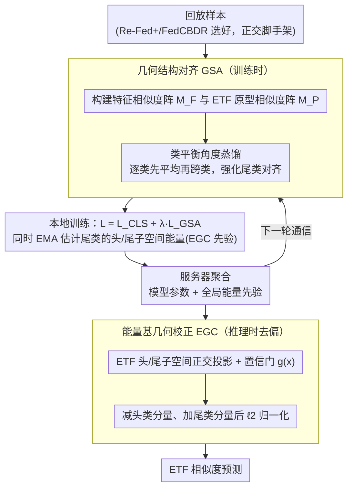

# FEAT: Federated Geometry-Aware Correction for Exemplar Replay under Continual Dynamic Heterogeneity

**会议**: CVPR 2026  
**arXiv**: [2604.08617](https://arxiv.org/abs/2604.08617)  
**代码**: 无  
**领域**: 其他  
**关键词**: federated continual learning, exemplar replay, equiangular tight frame, geometric correction, class imbalance

## 一句话总结

提出 FEAT 方法解决联邦持续学习中回放样本利用不足的问题，通过几何结构对齐（基于 ETF 原型的角度蒸馏）和能量基几何校正（推理时去偏）缓解跨客户端异构和任务级数据不平衡。

## 研究背景与动机

联邦持续学习（FCL）中，回放样本是缓解灾难性遗忘的主流策略。现有研究主要关注如何选择代表性样本（如 Re-Fed、FedCBDR），但忽略了如何有效利用这些有限样本。回放引入两个持续挑战：(1) 回放数据加剧跨客户端异构性；(2) 历史任务（尾类）与当前任务（头类）之间存在严重分布不平衡，导致尾类特征向头类方向漂移。

ETF 分类器虽然鼓励全局一致的类方向，但在持续动态异构下，尾类的跨客户端特征对齐仍明显弱于头类。

## 方法详解

### 整体框架

FEAT 针对联邦持续学习（FCL）里一个被忽视的问题：大家都在研究"回放样本怎么选"（Re-Fed、FedCBDR），却没人管"有限的回放样本怎么用好"。它提出两个与样本选择策略正交的模块——训练时的几何结构对齐（Geometric Structure Alignment, GSA）和推理时的能量基几何校正（Energy-based Geometric Correction, EGC），能直接插在 Re-Fed+、FedCBDR 等现有回放方法上，缓解回放放大的跨客户端异构、以及头/尾类不平衡导致的尾类特征向头类漂移。两个模块都围绕一组**全局共享、固定不变的 ETF（Equiangular Tight Frame）原型**展开：GSA 在训练时把本地特征的角度结构对齐到 ETF 原型，EGC 在推理时借 ETF 原型切出的头/尾子空间把偏头类的方向分量减掉。

### 关键设计

**1. 几何结构对齐（GSA）：用类平衡的角度蒸馏对齐尾类**

ETF 分类器虽鼓励全局一致的类方向，但在持续动态异构下，尾类（历史任务）的跨客户端特征对齐仍明显弱于头类（当前任务）。GSA 的做法是把"特征之间的角度关系"蒸馏到"ETF 原型之间的角度关系"上：在每个 mini-batch 内构建特征余弦相似度矩阵 $M_F$ 和对应 ETF 原型的相似度矩阵 $M_P$（两者都是 $B\times B$、同样的行列顺序），各自行 softmax 归一化成分布 $P_F$、$P_P$ 后计算 KL 散度。真正的关键在于**类平衡聚合**——先对每个类内部的样本求平均 KL，再跨类平均（而不是直接对所有样本平均），这样尾类不会被头类的样本数量淹没，从而获得足够的几何监督。总损失为 $L = L_{CLS} + \lambda \cdot L_{GSA}$，其中 $L_{CLS}$ 直接用特征与 ETF 原型的相似度 $z_i=\langle f, w_i\rangle$ 当 logits 做交叉熵。

**2. 能量基几何校正（EGC）：推理时把偏向头类的方向分量减掉**

即便有 GSA，有限回放仍会留下长尾分布，使尾类特征系统性地朝头类方向漂移、模型对头类过度自信。EGC 用一套"先建子空间、训练时攒先验、推理时去偏"的三步零训练成本校正来纠偏：

- **ETF 子空间分割**：把当前任务类别当头类、历史任务类别当尾类，用各自的 ETF 原型经 Moore–Penrose 伪逆构造正交投影算子 $P_H$、$P_T$，从而能把任意特征投到头类 / 尾类子空间上分别度量能量。
- **训练时攒尾类先验**：对回放的尾类样本，用 EMA 在线估计它们在头/尾子空间上的秩归一化能量；客户端**只上传两个标量统计量**到服务器，按样本数加权聚合成全局先验 $\bar{e}_H^{G}$、$\bar{e}_T^{G}$（既省通信又不泄露原始数据）。
- **推理时去偏**：对每个特征算出头/尾子空间能量 $e_H$、$e_T$，再由"超出全局尾类先验的程度"算一个置信门 $g(\tilde x)=\max\{(e_H-\bar{e}_H^{G})/(e_H+e_T+\varepsilon),\,0\}$；当特征明显偏头类时 $g$ 较大，就按 $\tilde x' = \tilde x - g\,P_H\tilde x + g\,P_T\tilde x$ 减掉头类分量、补强尾类分量，归一化后再用 ETF 相似度预测。

整个校正只在推理时触发，不增加任何训练开销，却能降低对多数类的过度自信、提升对少数类的敏感度。

### 损失函数 / 训练策略

分阶段优化：首个任务（$t=1$）只用分类损失 $L = L_{CLS}$；后续任务（$t>1$）加上 GSA 蒸馏损失，$L = L_{CLS} + \lambda \cdot L_{GSA}$，其中 $L_{CLS}$ 使用 ETF 原型与特征的相似度作为 logits 的交叉熵。每轮通信后服务器聚合模型参数和全局能量统计；EGC 仅在推理时应用，不增加训练成本。

## 实验关键数据

### 主实验

| 数据集 | 异构度 | FEAT | 之前SOTA | 提升 |
|--------|--------|------|---------|------|
| CIFAR-100 (α=0.1) | 高 | 最优 | 多种方法 | Top-1 一致提升 |
| Tiny-ImageNet | 中 | 最优 | 多种方法 | 一致提升 |
| Mini-ImageNet | 低 | 最优 | 多种方法 | 一致提升 |

### 消融实验

| 配置 | Top-1 准确率 | 说明 |
|------|-----------|------|
| Baseline (无 FEAT) | 较低 | 尾类漂移严重 |
| + GSA | 提升 | 跨客户端对齐改善 |
| + EGC | 进一步提升 | 推理去偏有效 |
| + 两者组合 | 最优 | 互补效果 |

### 关键发现

- GSA 有效改善尾类的跨客户端特征一致性
- EGC 的推理时去偏在不增加训练成本的前提下显著提升尾类准确率
- FEAT 正交于样本选择策略，与 Re-Fed+、FedCBDR 组合均有提升

## 亮点与洞察

- 关注回放样本"如何用"而非"如何选"，填补研究空白
- GSA 的类平衡 KL 蒸馏确保尾类获得公平的对齐监督
- EGC 作为推理时后处理零额外训练成本，实用性强
- 方法与回放策略正交的设计使其具有广泛适用性

## 局限与展望

- ETF 原型数量随类别数增长，可能面临高维空间的挑战
- EGC 的能量统计依赖于训练时收集的先验，分布漂移时可能不准确

## 评分

- 新颖性：⭐⭐⭐⭐ — 关注回放利用而非选择的新视角
- 技术深度：⭐⭐⭐⭐ — ETF+角度蒸馏+能量校正设计完整
- 实验充分度：⭐⭐⭐⭐ — 三数据集多异构度验证
- 实用价值：⭐⭐⭐⭐ — 即插即用，推理去偏零成本

<!-- RELATED:START -->

## 相关论文

- [\[NeurIPS 2025\] Exploiting Task Relationships in Continual Learning via Transferability-Aware Task Embeddings](../../NeurIPS2025/others/exploiting_task_relationships_in_continual_learning_via_transferability-aware_ta.md)
- [\[ICML 2026\] HASTE: Hardware-Aware Dynamic Sparse Training for Large Output Spaces](../../ICML2026/others/haste_hardware-aware_dynamic_sparse_training_for_large_output_spaces.md)
- [\[ICLR 2026\] Federated ADMM from Bayesian Duality](../../ICLR2026/others/federated_admm_from_bayesian_duality.md)
- [\[ICML 2026\] Target-Agnostic Calibration under Distribution Shift with Frequency-Aware Gradient Rectification](../../ICML2026/others/target-agnostic_calibration_under_distribution_shift_with_frequency-aware_gradie.md)
- [\[ICML 2026\] Continual Learning of Domain-Invariant Representations](../../ICML2026/others/continual_learning_of_domain-invariant_representations.md)

<!-- RELATED:END -->
