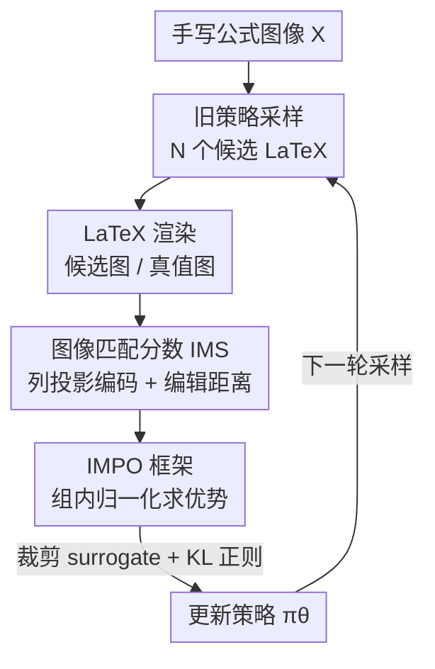

# From Pixel to Precision: Enhancing Handwritten Mathematical Expression Recognition with Image-Level Reward

**会议**: CVPR 2026  
**论文**: [CVF Open Access](https://openaccess.thecvf.com/content/CVPR2026/html/Liu_From_Pixel_to_Precision_Enhancing_Handwritten_Mathematical_Expression_Recognition_with_CVPR_2026_paper.html)  
**代码**: 无  
**领域**: 视觉文档识别 / 强化学习  
**关键词**: 手写公式识别, 图像级奖励, GRPO, 视觉保真度, 编辑距离  

## 一句话总结
针对手写数学公式识别中"LaTeX 文本相似 ≠ 渲染图像相似"的根本错位，本文提出图像匹配分数 IMS（基于列投影编码 + Levenshtein 距离的轻量图像级奖励），并用它驱动一个去掉 value 网络的 GRPO 强化学习框架 IMPO，在 CROHME / HME100K / M2E 三套基准上把 ExpRate 平均提升约 1.1%、最高 1.37%，刷新 SOTA。

## 研究背景与动机
**领域现状**：手写数学公式识别（HMER）把手写表达式转写成 LaTeX 代码，主流是把它当作 image-to-sequence 任务的序列模型（WAP、BTTR、CoMER、PosFormer 等），训练时用最大似然（MLE）或者在此基础上加文本级奖励（BLEU、ROUGE、字符串精确匹配）做强化微调。

**现有痛点**：所有这些目标本质上都在优化"文本相似度"这个**代理目标**，而 HMER 真正想要的是"渲染出来的公式图像和原始手写长得一样"，也就是**视觉保真度**。LaTeX 的双重表示（符号文本 vs 渲染图像）之间存在系统性错位：一方面，文本上完全不同的 LaTeX 串可能渲染出**一模一样**的图像（如 `\sin x` 与 `\sin{x}`、`\left(...\right)` 与 `\biggl(...\biggr)`），文本指标会误判为错误（false negative）；另一方面，一个微小的文本错误（漏一个花括号、上标写成下标）可能让渲染**彻底崩坏**，但字符级指标只扣很少的分。

**核心矛盾**：优化信号（文本距离）和真实目标（视觉一致）方向不一致。表达式越复杂、越长，这种错位越严重——文本级奖励完全抓不住结构正确性，导致模型在长公式上性能大幅下滑。

**本文目标**：把优化目标从"文本级监督"切换到"图像级监督"，并且要找到一个**既轻量又对结构错误敏感**的图像相似度度量来当奖励。

**切入角度**：作者观察到数学公式天然是**从左到右、按列排布**的二维结构，因此只要把渲染图按列编码成整数序列、再算序列编辑距离，就能在像素层面捕捉"上标错位、相似字符替换"这类局部结构错误，而不必上重型的图像感知网络。

**核心 idea**：用"渲染图像的列投影编辑距离"做奖励（IMS），把它塞进无 value 网络的 GRPO 里直接优化视觉保真度（IMPO），让模型为"渲染对"而不是"字符串对"而训练。

## 方法详解

### 整体框架
IMPO 把 HMER 重新表述成一个强化学习问题：策略网络（一个序列式 HMER 模型，如 PosFormer）以手写图像 $X$ 为输入，生成 LaTeX token 序列 $Y=\{y^{(t)}\}_{t=1}^{T}$，奖励不再来自和参考字符串的文本相似度，而来自**预测 LaTeX 与真值 LaTeX 各自渲染成图像后的视觉相似度**。整条流水线是：给定输入图像，用旧策略 $\pi_{\theta_{old}}$ 采样一组 $N$ 个候选 LaTeX 序列 → 每个候选和真值分别渲染成图像 → 用 IMS 算出序列级奖励 → 组内归一化得到优势 → 用带裁剪的 surrogate loss + KL 正则更新当前策略 $\pi_\theta$。整个过程**不需要单独的 value 网络**，因为 GRPO 用组内奖励统计来估计优势。

### 关键设计

**1. 图像匹配分数 IMS：用列投影编辑距离量化渲染视觉保真度**

这一设计直击"文本相似 ≠ 视觉相似"的痛点：它不在 LaTeX 串上算距离，而是在**渲染后的图像**上算距离。计算分三步。第一步**图像预处理**——把预测图 $F_i$ 和真值图 $G_i$ 用白像素（值 0）补齐到相同最大高度并垂直居中，再用固定阈值 128 二值化分离前景符号与背景，最后**删掉全空白列**以消除整体水平平移。第二步**列向编码**——把每张图按列处理，每一列的竖直二值向量当作一个二进制字符串、转成十进制整数，于是整张图变成一个整数序列。这一步是 IMS 的精髓：数学表达式天生是从左到右排布，按列编码恰好捕捉了"水平方向的组合关系"，同时每列的整数又保留了"竖直方向的局部模式"，因此它对上标错位、形近字符替换（如 "V" 与 "v"）这类局部结构错误特别敏感。第三步**相似度计算**——对预测序列 $S_P$ 和真值序列 $S_G$ 算标准 Levenshtein 编辑距离 $D_i$，用较长序列长度 $L_i=\max(|S_P|,|S_G|)$ 归一化：

$$\mathrm{IMS}(F_i, G_i) = 1 - \frac{D_i}{L_i}, \quad \mathrm{IMS} \in [0,1].$$

分数越高表示越接近。论文给的直观例子：真值列编码为 `[7,4,2,1,7]`、预测为 `[7,4,5,1,7]`，单字符错误造成一个列不匹配，于是 $\mathrm{IMS}=1-\tfrac{1}{5}=0.8$。相比 SSIM 这类整图感知指标，IMS 计算极轻量、且对渲染分辨率（DPI）变化更鲁棒（见实验 Tab. 4）。

**2. IMPO：基于 GRPO 的无 value 网络图像级策略优化**

有了图像级奖励，还需要一个能稳定吃这种"序列级稀疏奖励"的优化框架。作者选择 GRPO（Group Relative Policy Optimization，PPO 的变体）而不是 PPO，关键在于 GRPO **去掉了 value 网络**：它不学价值函数，而是在采样的一组候选里用奖励的归一化统计来估计优势，既省算力又简化训练，天然契合 IMS 这种序列级整体奖励。具体地，给定输入图像，用 $\pi_{\theta_{old}}$ 采样 $N$ 个候选 $Y_i$，对每个候选用 IMS 算序列级奖励 $R_i$，然后在 batch 内归一化得到优势估计 $\hat{A}_i$——注意这个优势在轨迹 $i$ 的所有时间步 $t$ 上是**常数**，相当于把"整条表达式渲染得好不好"作为统一的信用分配信号，这正符合"视觉保真度是表达式级别的整体属性"这一性质。

**3. 裁剪 surrogate + KL 正则的复合损失：在策略更新与稳定性之间约束偏移**

为了稳定训练，策略更新最小化一个复合目标。逐时间步的裁剪 surrogate 目标为：

$$\mathcal{L}_{\mathrm{CLIP}}(\theta) = \min\!\big(\rho_{i,t}\hat{A}_i,\ \mathrm{clip}(\rho_{i,t}, 1\pm\epsilon)\hat{A}_i\big),$$

其中 $\rho_{i,t}=\dfrac{\pi_\theta(y_{i,t}\mid y_{i,<t})}{\pi_{\theta_{old}}(y_{i,t}\mid y_{i,<t})}$ 是重要性比率。再叠加一个对参考策略 $\pi_{\theta_{ref}}$ 的 KL 散度正则，得到逐步联合损失 $\mathcal{L}_{i,t}(\theta) = -\mathcal{L}_{\mathrm{CLIP}}(\theta) + \beta\,D_{KL}(\pi_\theta \,\|\, \pi_{\theta_{ref}})$，最终损失对采样轨迹和时间步取期望：$\mathcal{L}(\theta)=\mathbb{E}_{\tau_i\sim\pi_{\theta_{old}}}\big[\sum_t \mathcal{L}_{i,t}(\theta)\big]$。裁剪项防止单步更新过大，KL 项约束策略不要偏离参考策略太远——这对"奖励是离散视觉分数、容易让模型钻空子"的场景尤其重要。整个框架是 **model-agnostic 的**：它只对序列式 HMER 模型做微调，不依赖任何特定架构。

### 一个完整示例
以论文 case study 里的例子直观感受 IMS 奖励为何更优。真值是 `\sin(nz)`，基线 CoMER 误识为 `\sin(n2)`（把 `z` 看成 `2`）。在文本层面，`z` 和 `2` 只是一个字符的差，BLEU 几乎不扣分，所以 `+IMPO-BLEU` 仍然输出错误的 `\sin(n2)`；但在渲染图像上，`z` 和 `2` 的列投影模式差别明显，IMS 给出更大的惩罚，于是 `+IMPO-IMS` 被引导着纠正回 `\sin(nz)`。类似地 `2\pi\sin\alpha`（真值）被 CoMER 写成 `2\pi\sin a`，只有 IMS 版本因为 `\alpha` 与 `a` 渲染差异显著而修正成功。这组例子说明：当错误"文本上很小、视觉上很大"时，唯有图像级奖励才能提供正确的梯度方向。

## 实验关键数据

### 主实验
在 CROHME 2014/2016/2019 上以 PosFormer 为基座，IMPO 全面刷新 SOTA（ExpRate 为预测 LaTeX 与真值完全匹配的比例，越严格越能反映真实正确率；≤1/≤2 表示允许 1/2 个错误的放松指标）。

| 数据集 | 指标 | PosFormer | IMPO（本文） | 提升 |
|--------|------|-----------|--------------|------|
| CROHME 2014 | ExpRate | 62.68 | **63.89** | +1.21 |
| CROHME 2016 | ExpRate | 61.03 | **62.04** | +1.01 |
| CROHME 2019 | ExpRate | 64.97 | **66.34** | +1.37 |
| CROHME 2019 | ≤1 error | 82.49 | **85.52** | +3.03 |
| HME100K | ExpRate | 69.51 | **70.67** | +1.16 |
| M2E | ExpRate | 58.33 | **59.56** | +1.23 |

值得注意的是放松指标（≤1/≤2）的提升普遍比 ExpRate 更大（如 CROHME 2014 的 ≤2 提升 +3.49），说明 IMPO 不只是多对了几条，还**降低了错误的严重程度**——把"渲染崩坏的大错"压成了"差一两个符号的小错"。在需要复杂二维布局理解的多行数据集 M2E 上同样有 +1.23 的稳定增益，印证图像级奖励对结构解析的帮助。

### 跨架构泛化（model-agnostic 验证）
把 IMPO 接到 ABM / CoMER / PosFormer 三种不同骨干上，ExpRate 一致提升，证明它解决的是"优化目标错位"这一**共性问题**而非某个架构的特性。

| 骨干 | 数据集 | Vanilla ExpRate | +IMPO | 提升 |
|------|--------|-----------------|-------|------|
| ABM | CROHME 2014 | 56.85 | 57.98 | +1.13 |
| CoMER | CROHME 2014 | 59.33 | 60.72 | +1.39 |
| CoMER | CROHME 2014（≤2） | 75.66 | 83.21 | +7.55 |
| PosFormer | CROHME 2014 | 62.68 | 63.89 | +1.21 |

### 消融实验
在 CoMER 骨干、CROHME 数据集上拆解各组件（IMS-HDiv = 改用水平切分，IMS-KBC = 保留空白列，REIN-b = 带 baseline 的 REINFORCE）。

| 配置（CROHME 2014） | ExpRate | 说明 |
|---------------------|---------|------|
| Vanilla（无 RL） | 59.33 | 基线 |
| SSIM + GRPO | 60.11 | 换成 SSIM 图像奖励 |
| IMS + REIN-b | 59.77 | 换成 REINFORCE 框架 |
| IMS-HDiv + GRPO | 59.68 | 水平切分而非列向 |
| IMS-KBC + GRPO | 60.36 | 保留空白列（不删平移） |
| **IMS + GRPO（完整）** | **60.72** | 完整 IMPO |

### 关键发现
- **列向编码是 IMS 的命门**：把列向换成水平切分（IMS-HDiv）后 ExpRate 从 60.72 掉到 59.68，几乎退回基线，证明"按列编码捕捉公式从左到右排布"这一假设是有效性的核心来源。
- **IMS 比 SSIM 更稳更强**：按公式长度分桶、150→300 DPI 变化下测变异系数（CV），IMS 全局 CV 仅 0.62%，SSIM 为 1.21%；且 SSIM 随公式变长急剧不稳（50+ 长度时 CV 高达 7.03%），IMS 仍稳定在 1.34%。下游表现上 IMS+GRPO（60.72）也稳超 SSIM+GRPO（60.11）。
- **长公式收益最大**：按长度分层看，文本级奖励（BLEU/ROUGE）在长公式（40+）上几乎不涨，IMS 在 CoMER-CROHME2014 长公式上达到 27.65%（比 vanilla 提升约 2.17 个点），印证文本奖励"越复杂越失效、IMS 抓全局布局保真度"的论断。
- **删空白列有小幅稳定收益**：IMS-KBC（保留空白列）为 60.36，略低于删空白列的 60.72，说明消除水平平移确有帮助但增益有限（因固定渲染器下平移本就少见）。

## 亮点与洞察
- **把"奖励设计"问题转化为"图像编码"问题**：核心创新不是更复杂的网络，而是一个用列投影 + 编辑距离构造的轻量度量。它把二维公式的空间结构压成一维整数序列，让序列编辑距离直接可用——简单、可解释、计算便宜，却比 SSIM 这种重型感知指标更鲁棒，是非常漂亮的"用对的表示替代复杂模型"的范例。
- **奖励与真实目标对齐的普适价值**：论文的真正洞察是"代理目标 vs 真实目标错位"这个 RL 通病在 HMER 里的具体化。这个思路可迁移到任何"输出有可渲染/可执行的标准形式"的任务——如代码生成（用执行结果而非 token 匹配做奖励）、SVG/图表生成、化学分子式 SMILES 识别等，都可以借鉴"渲染后比对"的奖励范式。
- **GRPO 去 value 网络恰好契合序列级视觉奖励**：IMS 是表达式级整体分数，正好让 GRPO 的组内归一化优势成为天然的信用分配方式，省掉了 value 网络的训练负担，工程上很务实。

## 局限与展望
- **依赖可渲染性**：IMS 要求预测的 LaTeX 能成功渲染才能比图。对于语法严重错误、根本渲染失败的候选，如何打分论文未充分讨论（⚠️ 以原文为准），这可能在训练早期模型输出很乱时造成奖励信号缺失。
- **固定渲染器的假设**：论文明确指出"删空白列消除平移"收益有限，因为固定渲染器下水平平移本就罕见；这也意味着 IMS 的部分设计是针对受控渲染环境的，换到字体/排版多变的真实扫描件未必同样稳健。
- **绝对增益偏小**：ExpRate 提升多在 1% 量级，虽稳定且刷 SOTA，但相对放松指标（≤1/≤2）的大幅提升，严格 ExpRate 的天花板仍受限于基座模型本身的识别能力——IMPO 是"纠错增强"而非"识别能力跃升"。
- **改进思路**：可探索把 IMS 设成可微的软奖励直接进损失、或结合渲染失败的显式惩罚项；也可把列向编码推广到二维 patch 编码以更好处理多行/矩阵这类强二维结构。

## 相关工作与启发
- **vs 文本级奖励（BLEU/ROUGE/精确匹配）**：它们优化字符串相似度，对"文本异图像同"误判、对"文本微变图像大变"漏罚；IMPO 直接在渲染图上算奖励，从根本上对齐"视觉保真度"这个真实目标，长公式上优势尤为明显。
- **vs SSIM 等整图图像奖励**：SSIM 是整图感知相似度，对公式长度和分辨率敏感、随长度急剧不稳；IMS 用列投影编辑距离，对 DPI 变化的变异系数小一个量级，且对局部结构错误（上标错位、形近替换）更敏感。
- **vs 树结构 HMER（SAN、DenseWAP-TD、TDv2）**：树方法显式解析公式语法结构但灵活性受限；IMPO 不改变序列式骨干的架构，作为 model-agnostic 的强化微调插件叠加在任意序列模型上，兼容性更好。

## 评分
- 新颖性: ⭐⭐⭐⭐ 图像级奖励本身不算全新，但"列投影编码 + 编辑距离"这个轻量构造和它与 GRPO 的契合点很巧妙。
- 实验充分度: ⭐⭐⭐⭐⭐ 三套基准、三种骨干、IMS vs SSIM/HDiv/KBC、长度分层、DPI 鲁棒性，RQ 拆解清晰。
- 写作质量: ⭐⭐⭐⭐ 动机用 Fig.1 一图说清，方法公式完整，case study 直观。
- 价值: ⭐⭐⭐⭐ 思路可迁移到其他"输出可渲染/可执行"的生成任务，对齐目标的范式有借鉴意义。

<!-- RELATED:START -->

## 相关论文

- [\[CVPR 2026\] UniMERNet: A Universal Network for Real-World Mathematical Expression Recognition](unimernet_a_universal_network_for_real-world_mathematical_expression_recognition.md)
- [\[CVPR 2026\] Rethinking BCE Loss for Multi-Label Image Recognition with Fine-Tuning](rethinking_bce_loss_for_multi-label_image_recognition_with_fine-tuning.md)
- [\[CVPR 2026\] ArtiMuse: Fine-Grained Image Aesthetics Assessment with Joint Scoring and Expert-Level Understanding](artimuse_fine-grained_image_aesthetics_assessment_with_joint_scoring_and_expert-.md)
- [\[CVPR 2026\] UPLiFT: Efficient Pixel-Dense Feature Upsampling with Local Attenders](uplift_efficient_pixel-dense_feature_upsampling_with_local_attenders.md)
- [\[CVPR 2025\] On the Generalization of Handwritten Text Recognition Models](../../CVPR2025/others/on_the_generalization_of_handwritten_text_recognition_models.md)

<!-- RELATED:END -->
