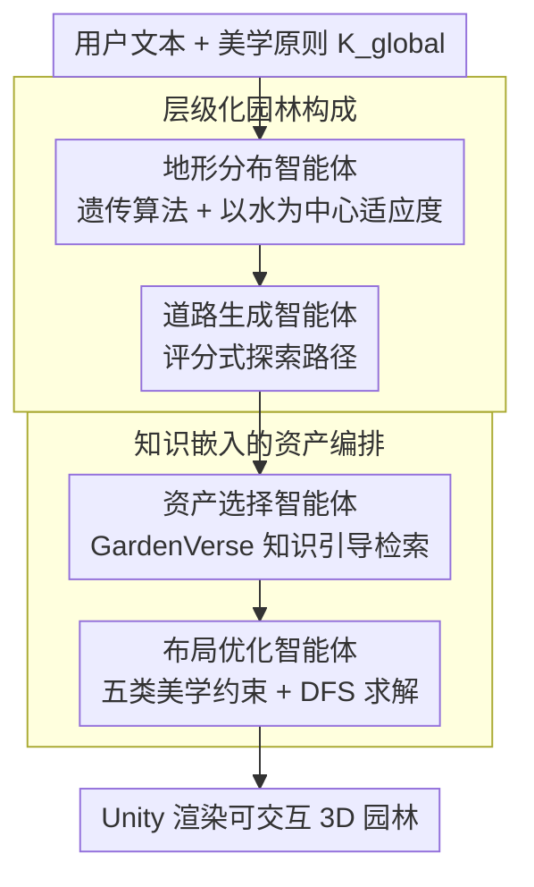

# GardenDesigner: Encoding Aesthetic Principles into Jiangnan Garden Construction via a Chain of Agents

**会议**: CVPR 2026  
**arXiv**: [2604.01777](https://arxiv.org/abs/2604.01777)  
**代码**: [https://github.com/monad-cube/GardenDesigner](https://github.com/monad-cube/GardenDesigner)  
**领域**: 场景生成 / 文化遗产  
**关键词**: 江南园林, 链式智能体, 程序化建模, 美学约束, 布局优化

## 一句话总结
提出 GardenDesigner 框架，通过链式智能体（地形分布→道路生成→资产选择→布局优化）将江南园林的美学原则编码为可计算的约束，结合专家标注的 GardenVerse 数据集，实现非专业用户通过文本输入在一分钟内自动构建符合美学规范的江南园林。

## 研究背景与动机
1. **领域现状**：江南园林是中国古典园林的重要流派，在数字旅游、影视游戏制作中有巨大应用潜力。传统的园林数字建模依赖专家经验，通常需要 3-4 位设计师耗时 3-4 周完成。
2. **现有痛点**：现有学习型场景生成方法受训练数据领域限制，泛化能力有限；程序化建模方法结合 LLM/VLM 主要聚焦室内空间或非结构化自然场景，无法处理江南园林特有的精细空间构成。
3. **核心矛盾**：江南园林涉及三个独特挑战——（1）复杂的水为中心的地形与空间布局，（2）抽象的美学原则难以编码为计算约束，（3）缺乏带文化标注的园林数据集。
4. **本文目标** 如何将江南园林的隐含美学规则（以水为中心、曲径通幽、象征微缩、不对称平衡）转化为可优化的程序化生成流程。
5. **切入角度**：将园林构建分解为四个顺序依赖的子任务，用链式智能体逐步执行，每个智能体内嵌美学约束。
6. **核心 idea**：用链式 LLM 智能体驱动程序化建模，将美学原则编码为遗传算法的适应度函数和布局优化的损失函数。

## 方法详解

### 整体框架
GardenDesigner 要解决的是：让非专业用户只用一句文本，就能自动生成一座符合江南园林美学的 3D 场景。难点在于园林的美学规则（以水为中心、曲径通幽、不对称平衡）是隐性的人文经验，既无法直接交给学习型生成模型，也不是通用 LLM 能凭空推理出来的。

它的做法是把"造园"拆成四个**顺序依赖**的子任务，每个任务交给一个专职智能体，前一个的输出就是后一个的输入：地形分布 $\mathcal{A}_T$ 先在网格上铺出以水为中心的山水骨架，道路生成 $\mathcal{A}_R$ 沿这个骨架画出蜿蜒小径，资产选择 $\mathcal{A}_S$ 从 GardenVerse 知识库里挑出文化适配的建筑与植物，布局优化 $\mathcal{A}_C$ 最后把这些资产按美学约束摆到位。论文把前两者归为「层级化园林构成」、后两者归为「知识嵌入的资产编排」两大模块。整条链的关键在于：LLM 只负责把模糊的自然语言翻译成各阶段的可计算参数，真正保证空间正确性的是嵌在每个智能体里的程序化算法和美学约束函数——人文知识由此被"编译"成了适应度函数和损失函数。

### 关键设计

**1. 遗传算法驱动的以水为中心地形生成：把"水是园林骨架"写进适应度函数**

传统程序化地形算法只会均匀铺设地块，生成的是散乱的水塘和无组织的地面，完全抓不住江南园林"以水统领空间"的逻辑。这个智能体先让 LLM 把用户文本翻成遗传算法参数（各地形的存在性、数量、总覆盖率、单区域覆盖率），再在 2D 网格上对 Outside / Waterbody / Land / Ground 四类地形做交叉、变异、进化。让它真正"向水靠拢"的是这个以水为中心的适应度项：

$$L_{\text{terrain}} = f \cdot \max\left(1 - \frac{\sum c(T,(x_i,y_i))}{\phi}, 0\right)$$

其中 $\sum c(T,(x_i,y_i))$ 度量地形单元偏离水体核心的程度、$\phi$ 是容忍阈值——离水越远惩罚越大，于是进化压力会把水体推到园林的空间组织核心，山石、地块自然环水分布，而不是各自为政。

**2. 评分式探索道路生成：用三条美学规则换掉"走最短路"**

地形定下后要在上面画路，但现有路径算法追求的是几何效率或均匀覆盖，画出来的是横平竖直的捷径，跟江南园林"移步换景、曲径通幽"的体验背道而驰。道路智能体先从指令里提参数（入口数、必经关键点、主干道宽度、道路复杂度），再在网格边界上按打分挑路径 $R = \mathcal{A}_R(\mathcal{S}(T, e_{i,j}), U, K_{\text{global}})$。评分规则直接把三条美学要求量化进去：路径要能抵达园中大部分区域、优先贴边界绕行（让游览动线拉长、景致逐步揭示）、并惩罚过度弯曲与过度笔直之间的两个极端。于是选出的不是最短路，而是一条把人引着绕、边走边看的探索式动线。

**3. 知识引导的资产检索：给 LLM 外挂一部"造园辞典"**

通用 LLM 不知道假山该背靠什么、亭子和水面是什么关系，凭它直接挑资产会得到大片空白和文化错位。资产选择智能体 $\mathcal{A}_S$ 的做法是先把 GardenVerse 里专家标注的园林知识 $K_a$（视觉属性、空间组合关系、适配季节等）编码进向量库 $\mathcal{V}(K_a)$，再结合每个区域的语境信息 $I_{\text{area}}$ 用 LLM 检索查询：

$$O_s = \mathcal{A}_S\big(\mathcal{Q}(\mathcal{V}(K_a), o_i, U),\ I_{\text{area}}\big)$$

查询会为每个区域返回一组文化一致的资产 $O_s$（厅堂、亭、假山、当季花木等），相当于给模型外挂了一部"造园辞典"——选什么资产不再靠 LLM 凭空想象，而是被专家知识约束住，这正是 GardenVerse 数据集带来增益的根源。

**4. 五类美学约束的布局优化：把"摆得对不对"写成损失再用 DFS 求解**

资产选好后还要摆到位，但"假山背山面水、亭子临水、植物错落环绕"这些关系通用方法表达不了。布局优化智能体 $\mathcal{A}_C$ 把空间美学拆成八种约束、归并为五类语义，各配一个损失项：Global（该靠边还是居中）、Position（环绕 / 背靠关系）、Distance（彼此远近）、Alignment（对齐）、Rotation（朝向），加权成总目标

$$\mathcal{L}_{\text{opt}} = \lambda_1 \mathcal{L}_{\text{glo}} + \lambda_2 \mathcal{L}_{\text{pos}} + \lambda_3 \mathcal{L}_{\text{dis}} + \lambda_4 \mathcal{L}_{\text{ali}} + \lambda_5 \mathcal{L}_{\text{rot}}$$

权重取 $\lambda = \{2.0, 0.5, 1.8, 0.5, 0.5\}$，可见全局位置和相对距离被看得最重。求解不用连续梯度下降，而用深度优先搜索（DFS）在离散摆放空间里找可行布局：每个资产由 $(x, y, l, w, \text{rotation})$ 描述、朝向只取 0/90/180/270 四个离散角，再叠加"不许碰撞、不许出界"两条硬约束，跑 100 步迭代后取损失最低的可行解——因为资产的位置与朝向本就是离散选择，DFS 比梯度法更自然。

### 一个完整示例
以一句"建一座临水的小型江南园林，含一座主厅和环水步道"为例走一遍：$\mathcal{A}_T$ 先把它翻成遗传参数（Waterbody 存在、覆盖率约 30%、单块连续），进化出一片居中的水体作骨架；$\mathcal{A}_R$ 接过这张地形图，沿水岸和边界评分选路，得到一条不走直线、绕水半圈再通向厅堂的步道；$\mathcal{A}_S$ 读到"主厅""临水"，从知识库检索出适配的厅堂、亲水平台、几丛适配当季的竹与花木；最后 $\mathcal{A}_C$ 用五类损失把厅堂背山面水、平台贴岸、植物错落环绕地摆好，DFS 搜出可行解后交给 Unity 渲染成可交互的 3D 园林。一条链下来，文本里没明说的"以水为中心"和"曲径通幽"都被前序智能体的约束自动补齐了。

### 损失函数 / 训练策略
全流程无需训练：LLM 用 GPT-5 做参数翻译与资产查询，地形阶段靠以水为中心的适应度函数驱动遗传搜索，布局阶段用五类空间约束损失（权重 $\{2.0, 0.5, 1.8, 0.5, 0.5\}$）加权后由 DFS 求解，Unity 作为可视化与交互平台。

## 实验关键数据

### 主实验

| 方法 | Path-S ↑ | Class-Div | FD | CLIP-S ↑ |
|------|----------|-----------|-----|----------|
| Liu et al. (baseline) | 0 | 21.8±1.6 | 1.42±0.1 | 27.4±0.1 |
| **GardenDesigner** | **8.1±2.5** | **68.3±5.6** | **1.36±0.1** | **27.6±0.1** |

| 方法 | CLIP-A ↑ | VLM-S ↑ | QA-Quality ↑ |
|------|----------|---------|--------------|
| Liu et al. | 52.9±1.0 | 24.9±1.2 | 43.8±2.5 |
| **GardenDesigner** | **54.2±2.0** | **32.5±2.3** | **53.8±3.1** |

### 消融实验

| 配置 | FD | CLIP-S ↑ | VLM-S ↑ |
|------|-----|----------|---------|
| GardenDesigner w/o Asset Arrange. | 1.27±0.1 | 27.4±0.1 | 31.6±1.1 |
| **Full GardenDesigner** | **1.36±0.1** | **27.6±0.1** | **32.5±2.3** |

### 关键发现
- Path-S 从 0 提升到 8.1，说明 baseline 根本生成不了合理的道路-建筑关系，而 GardenDesigner 的道路可以连接到重要景点。
- 资产多样性（Class-Div）提升了 3 倍以上（21.8→68.3），从 26 类到 71 类资产。
- FD=1.36 接近真实江南园林的分形维度范围（1.123-1.329），说明空间结构更自然。
- 人类评估中 11 位园林专家和 32 位普通用户均在所有维度上偏好 GardenDesigner，尤其是文化氛围维度。
- GardenVerse 数据集本身的加入就显著提升了 baseline 的质量，说明高质量领域数据集的重要性。

## 亮点与洞察
- **链式智能体分解设计非常巧妙**：将复杂的园林构建分解为四个有清晰依赖关系的子任务，每个子任务都有明确的输入输出，既利用了 LLM 的语言理解能力，又通过程序化算法保证了空间约束的精确性。
- **美学原则的可计算化**：将抽象的"以水为中心""曲径通幽"等美学理念转化为适应度函数和损失函数，这种人文知识→数学优化的桥接思路可以迁移到其他文化遗产数字化场景。
- **GardenVerse 数据集的专家标注**：不只标注基本信息，还包含园林领域知识（适配季节、文化语境等），为 LLM 提供了必要的领域知识补充。

## 局限与展望
- 依赖 GardenVerse 中有限的 132 个资产，多样性仍然受限，难以覆盖所有江南园林元素。
- 评估指标主要基于 VLM 评分和人类评估，缺乏对空间可达性、视线分析等园林设计专业指标的量化。
- 链式智能体的错误会逐层传播——如果地形生成不合理，后续所有步骤都会受影响。
- 当前仅针对江南园林风格，需要验证框架对其他园林风格（如皇家园林、日式庭院）的扩展性。

## 相关工作与启发
- **vs Liu et al. (LLM for landscape)**：他们用 LLM 做通用景观，但缺乏园林专业知识和文化约束，生成的布局有大片空白。GardenDesigner 通过专家知识嵌入和美学损失函数解决了这个问题。
- **vs Infinigen**：Infinigen 侧重自然场景的程序化生成，但不涉及文化约束。GardenDesigner 的链式智能体+美学编码范式可以推广到其他文化场景。
- 这篇论文展示了**人文知识计算化**的可能性，启发我们思考如何将其他领域的专家经验编码为可优化的约束。

## 评分
- 新颖性: ⭐⭐⭐⭐ 将江南园林美学原则编码为计算框架，这个切入点本身很独特，但技术层面主要是对现有方法的组合
- 实验充分度: ⭐⭐⭐⭐ 有定量对比+人类评估+消融，但仅有一个baseline
- 写作质量: ⭐⭐⭐⭐ 结构清晰，美学原则的形式化描述做得好
- 价值: ⭐⭐⭐⭐ 文化遗产数字化是重要方向，GardenVerse数据集有独立价值

<!-- RELATED:START -->

## 相关论文

- [\[CVPR 2026\] Content-Aware Frequency Encoding for Implicit Neural Representations with Fourier-Chebyshev Features](content-aware_frequency_encoding_for_implicit_neural_representations_with_fourie.md)
- [\[NeurIPS 2025\] A Differentiable Model of Supply-Chain Shocks](../../NeurIPS2025/others/a_differentiable_model_of_supply-chain_shocks.md)
- [\[ICML 2025\] Practical Principles for AI Cost and Compute Accounting](../../ICML2025/others/practical_principles_for_ai_cost_and_compute_accounting.md)
- [\[ICML 2026\] Markov Chain Monte Carlo without Evaluating the Target: An Auxiliary Variable Approach](../../ICML2026/others/markov_chain_monte_carlo_without_evaluating_the_target_an_auxiliary_variable_app.md)
- [\[ECCV 2024\] ADMap: Anti-disturbance Framework for Vectorized HD Map Construction](../../ECCV2024/others/admap_anti-disturbance_framework_for_vectorized_hd_map_construction.md)

<!-- RELATED:END -->
