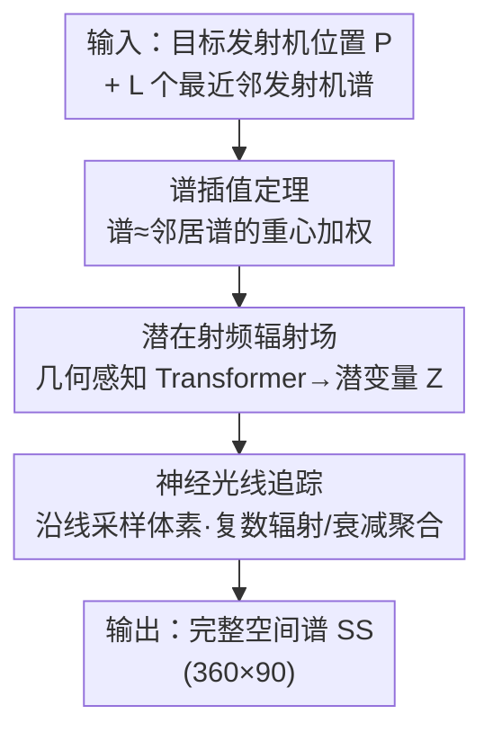

# Generalizable Radio-Frequency Radiance Fields for Spatial Spectrum Synthesis

**会议**: CVPR 2026  
**论文**: [CVF Open Access](https://openaccess.thecvf.com/content/CVPR2026/html/Yang_Generalizable_Radio-Frequency_Radiance_Fields_for_Spatial_Spectrum_Synthesis_CVPR_2026_paper.html)  
**代码**: 无（论文未提供）  
**领域**: 射频感知 / 神经辐射场 / 跨场景泛化  
**关键词**: 射频辐射场, 空间谱合成, 谱插值定理, 几何感知 Transformer, 神经光线追踪

## 一句话总结
GRaF 把 NeRF 思想搬到射频域，但用一条"目标发射机的空间谱可由邻近发射机的谱插值近似"的定理，把"逐场景重训"的 NeRF 改造成"跨场景泛化"的潜在射频辐射场——靠几何感知 Transformer 编码邻居谱、再用复数值神经光线追踪重建空间谱，在单场景和未见场景上都超过 NeRF2。

## 研究背景与动机
**领域现状**：无线网络（WiFi、6G）既是通信骨干也是感知平台，二者都依赖大量"空间谱"数据——即接收机在某发射机发信时，测得的信号功率在三维方向（方位角 $\alpha$、俯仰角 $\beta$）上的分布。采集这类数据要做密集的实地勘测（site survey），耗时耗力。于是有人用传播建模来"合成"数据：给定收发位置，估计经过反射、衍射、散射后的接收谱。

**现有痛点**：自由空间里 Maxwell 方程能精确算，但真实复杂环境下直接解不可行；射线追踪仿真要靠精确的 CAD 场景模型且计算昂贵，实践中既不准也不实用。近来 NeRF2、NeWRF 把光学域的神经辐射场迁移到射频域，成为 SOTA，但它们和原版 NeRF 一样**对训练场景过拟合**——每换一个新场景就要从头重训，代价高昂。

**核心矛盾**：射频信号波长在厘米级，与障碍物的相互作用（吸收、反射、衍射、散射）远比可见光复杂，这使得"为每个场景单独学一个辐射场"几乎成了射频 NeRF 的宿命，泛化无从谈起。

**本文目标**：学一个**场景无关**的模型，既能在单场景内合成高质量空间谱，又能直接迁移到未见过的场景布局甚至未见过的房间类型。

**切入角度**：作者证明了一条射频域的插值定理——某发射机位置的空间谱，可由地理上邻近的若干发射机的谱近似（误差随邻域半径平方收敛）。这把"逐场景学辐射场"变成了"学如何从邻居谱插值"，后者天然是跨场景的。

**核心 idea**：用"邻居谱 → 潜在射频辐射场 → 神经光线追踪"替代"场景坐标 → MLP → 光线追踪"，把可泛化的插值能力编码进潜变量 $Z$ 里。

## 方法详解

### 整体框架
给定若干训练场景，每个场景含一组（空间谱 $\mathbf{SS}_i\in\mathbb{R}^{360\times90}$，发射机位置 $\mathbf{P}_i\in\mathbb{R}^3$）配对，目标是学一个模型 $\mathcal{F}_\Theta$：对任意场景中任意目标发射机位置 $\mathbf{P}_{\text{target}}$，取它的 $L$ 个最近邻发射机 $\mathcal{N}_L$，合成出目标的空间谱。

GRaF 由两大组件串成一条管线：(i) **潜在射频辐射场**——几何感知 Transformer 把邻居的谱和几何关系编码成潜变量 $Z$，$Z$ 概括了该场景的传播特性（路径损耗、阴影、多径）；(ii) **神经光线追踪**——以 $Z$ 为条件，从接收机向各方向发射光线、沿线采样体素、预测每个体素的复数值辐射与衰减，逐线聚合后取模平方得到该方向的功率，遍历所有方向拼成完整空间谱。整个模型只用一个 L2 重建损失端到端训练。

### 关键设计

**1. 射频空间谱插值定理：把"逐场景学辐射场"换成"学插值"**

这是全文的理论基石，直接针对"NeRF 必须逐场景重训"的痛点。定理 1 断言：位置 $\mathbf{P}$ 的空间谱可由 $L$ 个最近邻的谱近似，$\mathbf{SS}(\mathbf{P})\approx\sum_{i=1}^{L} w_i\,\mathbf{SS}_i$，其中重心权重 $\{w_i\}$ 由局部发射机几何决定；插值误差满足 $\epsilon\le K\delta^2$，$\delta=\max_i\|\mathbf{P}-\mathbf{P}_i\|$ 是邻域半径、$K$ 刻画环境曲率（完整证明在补充材料 §A，⚠️ 此处误差界以原文为准）。它的意义在于：插值这件事不依赖具体场景几何，所以模型学到的是"如何根据邻居加权"，而非"这个房间长什么样"，泛化能力由此而来。GRaF 后面所有设计都是把这条线性插值"非线性化、几何感知化"。

**2. 潜在射频辐射场：用几何感知 Transformer 把邻居谱编码成场景无关的 $Z$**

简单的线性插值（对应基线 KNN）抓不住邻居谱之间复杂的空间关系。本文把插值权重升级为一个潜变量 $Z=\mathcal{T}_\Psi(\mathcal{N}_L,\mathbf{P})$，它"精炼自插值权重，但经过非线性变换以刻画超出线性组合的传播行为"。具体地：每个邻居的谱 $\mathbf{SS}_i$（可当成图像）先过 ResNet-18 抽特征，捕捉方向功率分布、信号强度等高层模式；同时把相对位置 $(\mathbf{P}_i-\mathbf{P})$ 做位置编码以保留几何关系。谱特征和几何嵌入一起送入带**交叉注意力**的几何感知 Transformer——注意力动态地给"最有影响力的邻居"加权，这正是在学定理 1 里的插值权重，同时把干扰、衍射、多径散射等非线性效应也吸收进来。Transformer 输出再过两个 MLP 映射到最终 $Z\in\mathbb{R}^d$。因为 $Z$ 编码的是"传播规律"而非"具体坐标值"，它能跨场景复用。

整篇似然被建模为对 $Z$ 的边缘化：$p(\mathbf{SS}\mid\mathcal{N}_L,\mathbf{P})=\int p(\mathbf{SS}\mid\mathbf{Z},\mathbf{P})\,p(\mathbf{Z}\mid\mathcal{N}_L)\,d\mathbf{Z}$，并进一步在各条光线上分解。

**3. 复数值神经光线追踪：让聚合过程尊重射频的幅度与相位**

光学 NeRF 的体素只有不透明度和颜色，但射频信号是复数（带相位），直接套用会丢相位信息。本设计以 $Z$ 为条件，对每条方向 $(\alpha,\beta)$ 的光线均匀采样 $S$ 个点 $\{\mathbf{x}_s\}$，每点的体素特征为

$$\mathbf{v}_s=\mathrm{MLP}\big(\mathbf{Z},\,\mathrm{PosEnc}(\mathbf{x}_s,(\alpha,\beta),\mathbf{P})\big).$$

关键是用两个 MLP 把 $\mathbf{v}_s$ 分别映射成**复数辐射信号** $s=I_s+jQ_s$ 和**复数衰减** $a=A_s+jB_s$——衰减项同时编码了幅度衰减和相位偏移。沿线聚合时显式带上自由空间路径损耗 $\frac{\lambda}{4\pi d_s}$ 和传播时延引起的相移 $e^{-j\frac{2\pi f d_s}{c}}$：

$$y_r=\sum_{s=1}^{S}\Big(\prod_{j=1}^{s-1} a(\mathbf{x}_j,\alpha,\beta)\Big)\,s(\mathbf{x}_s,\alpha,\beta)\cdot\frac{\lambda}{4\pi d_s}e^{-j\frac{2\pi f d_s}{c}},$$

其中 $\prod a$ 表示前面体素对当前体素的累积衰减（注意力分数天然对应这种累积衰减）。最后该方向的谱值取接收信号的功率 $\hat{\mathbf{SS}}_\Theta(r)=|y_r|^2$。相比 NeRF2 只用"发射强度 + 衰减"两个实标量（式 6），本文的复数向量体素表示能刻画更丰富的传播物理，这也是消融里掉点最多的模块。

### 损失函数 / 训练策略
由于 $Z$ 是潜在射频辐射场**确定性**产出的，对似然 $\int\prod_r p(\mathbf{SS}(r)\mid\mathbf{Z},\mathbf{P})\,p(\mathbf{Z}\mid\mathcal{N}_L)\,d\mathbf{Z}$ 的优化退化为有监督重建，最终目标就是逐光线的 L2 谱重建：

$$\Theta^*=\arg\min_\Theta\sum_{r=1}^{Q}\big\|\mathbf{SS}(r)-\hat{\mathbf{SS}}_\Theta(r)\big\|^2,$$

其中 $Q=N_a\times N_e=360\times90$ 是按一度分辨率离散化、覆盖上半球的光线总数。

## 实验关键数据

数据集：RFID（NeRF2 提出，915 MHz，4×4 阵列，6123 个发射机位置）+ MATLAB 仿真的会议室/办公室两种布局，每种又按是否摆放椅子/桌子分出 V1–V3 三个版本（共六个场景，发射机数从 3107 到 8481 不等）。指标：MSE↓、LPIPS↓、PSNR↑、SSIM↑。基线：KNN（邻居谱等权平均）、KNN-DL（逐像素可学权重加权）、NeRF2（≈NeWRF）。

### 主实验（单场景 + 跨场景泛化）

| 设置 | 模型 | MSE↓ | LPIPS↓ | PSNR↑ | SSIM↑ |
|------|------|------|--------|-------|-------|
| 单场景 | KNN | 0.089 | 0.357 | 15.16 | 0.543 |
| 单场景 | KNN-DL | 0.048 | 0.198 | 20.81 | 0.675 |
| 单场景 | NeRF2 | 0.052 | 0.274 | 19.93 | 0.704 |
| 单场景 | **GRaF** | **0.038** | **0.136** | **21.94** | **0.766** |
| 未见场景 | NeRF2 | 0.065 | 0.337 | 17.36 | 0.691 |
| 未见场景 | **GRaF** | **0.039** | **0.215** | **20.96** | **0.705** |
| 未见布局 | NeRF2 | 0.092 | 0.477 | 12.76 | 0.481 |
| 未见布局 | **GRaF** | **0.042** | **0.268** | **17.81** | **0.629** |

单场景下 GRaF 相对 NeRF2 在 MSE/LPIPS/PSNR/SSIM 上分别提升 26.9%、50.4%、10.2%、8.8%，相对 KNN/KNN-DL 的 PSNR 提升 44.7%/5.5%。最能说明问题的是泛化设置：从"未见场景"（只增删一两件家具）到"未见布局"（会议室训练→办公室测试），NeRF2 的 PSNR 从 19.93 一路跌到 12.76（跌幅约 35.9%），而 GRaF 仅从 21.94 缓降到 17.81，差距越拉越大——印证了"逐场景过拟合 vs 学插值"的根本区别。

### 消融实验（未见场景设置）

| 配置 | LPIPS↓ | PSNR↑ | 说明 |
|------|--------|-------|------|
| 完整 GRaF | 0.215 | 20.96 | 全管线 |
| 去掉交叉注意力 | 0.239 | 19.37 | 换成简单点积注意力，掉 1.59 dB |
| 去掉神经光线追踪 | 0.379 | 16.79 | 换成 NeRF2 式两标量体素 + 式(6)，掉 4.17 dB |

### 关键发现
- **复数神经光线追踪是第一功臣**：去掉它 PSNR 从 20.96 跌到 16.79（掉 4.17 dB），甚至低于 NeRF2 的 17.36——说明只保留 Transformer 编码邻居谱、却用 NeRF2 式简化体素是不够的，复数向量体素表示才是把传播物理学准的关键。
- **交叉注意力锦上添花**：换成普通点积注意力只掉 1.59 dB，作者据此认为泛化能力主要来自"建模邻居谱间交互"这一机制本身，交叉注意力是更优的实现而非唯一来源。
- **频段适配**：分别在 928 MHz / 2.412 GHz / 5.805 GHz 各自训练时 PSNR 都在 24–26 dB；但只在 2.412 GHz 训练、固定体素尺寸 0.124 m 直接测其它频段会明显掉点——因为传播特性随频率变（低频穿透强、高频更易散射吸收），且固定体素尺寸导致空间分辨率不匹配。
- **下游收益**：合成谱可直接用于到达角（AoA）估计，作者用 AANN 验证了用合成谱训练/测试 AoA 的可行性（图 6）。

## 亮点与洞察
- **用一条定理把问题换了赛道**：与其堆网络去硬学泛化，不如先证明"谱可由邻居插值"，把跨场景泛化的负担转移到"学插值权重"上——这是本文最漂亮的一步，理论与架构高度自洽（Transformer 的注意力 = 插值权重 = 累积衰减，三个含义在不同模块复用同一机制）。
- **复数体素是迁移光学 NeRF 到射频的真正难点**：把体素从两个实标量升级为复数辐射 + 复数衰减，并在聚合里显式写入路径损耗与时延相移，这个"物理先验注入"是消融里贡献最大的部分，可迁移到任何需要保相位的波场重建（声学、地震波等）。
- **可复用 trick**：把空间谱当图像、用 ResNet-18 + 图像质量指标（LPIPS/SSIM/PSNR）来抽特征和评估，是把视觉工具箱嫁接到射频感知的轻巧做法。

## 局限与展望
- 作者承认：跨布局（cross-layout）合成质量明显低于单场景，因为不同布局和物体材质带来更大分布差异；跨频段直接迁移也会掉点。
- 依赖"邻近发射机谱可得"这一前提——定理误差界 $\epsilon\le K\delta^2$ 意味着邻域半径 $\delta$ 大时（发射机稀疏）误差快速增大，开阔/稀疏反射体的室外场景天然不利（正文也提到 Outdoor 是难点）。
- 固定体素尺寸是跨频段的硬伤，一个自适应分辨率（随 $\lambda$ 缩放体素）的设计是显然的改进方向。
- ⚠️ 论文未提供代码链接，复现需自行实现几何感知 Transformer 与复数光线追踪聚合；定理误差界与若干推导都在补充材料，正文仅给结论。

## 相关工作与启发
- **vs NeRF2 / NeWRF**：它们是射频 NeRF 的 SOTA，但逐场景重训、且 NeWRF 还需 DoA 测量（要专用阵列，实践难得）。GRaF 不需场景专属训练、不需 DoA、不需先验场景模型，泛化设置下优势随场景差异扩大而扩大。
- **vs KNN / KNN-DL**：KNN 是定理 1 的朴素线性实现，KNN-DL 给每个邻居每个像素学权重但忽略几何关系。GRaF 等于把它们升级成"几何感知 + 非线性"的插值，PSNR 大幅领先。
- **vs WiNeRT / RFScape**：二者需要 CAD 或 SDF 形式的先验场景几何，不在同一可比设定；GRaF 完全无场景模型先验。
- **vs 可泛化光学 NeRF（MVSNeRF、WaveNeRF、GSNeRF）**：思路同源（从少量输入推断辐射场以泛化），但因射频波长和传播机制差异无法直接套用，本文相当于把"可泛化 NeRF"这条线扩展到了射频空间谱合成。

## 评分
- 新颖性: ⭐⭐⭐⭐⭐ 首个把"可泛化 NeRF"系统迁移到射频空间谱合成，并用插值定理给出理论支撑
- 实验充分度: ⭐⭐⭐⭐ 单场景/未见场景/未见布局/跨频段/AoA 下游覆盖全面，但真实数据仅 RFID 一个、代码缺失
- 写作质量: ⭐⭐⭐⭐ 理论—架构对应清晰，但大量关键推导与误差界放在补充材料，正文略显省略
- 价值: ⭐⭐⭐⭐ 为无线通信/感知的数据合成提供了免重训的实用范式，物理先验注入思路可迁移到其它波场

<!-- RELATED:START -->

## 相关论文

- [\[ECCV 2024\] SpatialFormer: Towards Generalizable Vision Transformers with Explicit Spatial Understanding](../../ECCV2024/others/spatialformer_towards_generalizable_vision_transformers_with_explicit_spatial_un.md)
- [\[CVPR 2026\] When Lines Meet Textures: Spatial-Frequency Aligned Diffusion Features for Cross-Sparsity Correspondence](when_lines_meet_textures_spatial-frequency_aligned_diffusion_features_for_cross-.md)
- [\[ECCV 2024\] FisherRF: Active View Selection and Mapping with Radiance Fields Using Fisher Information](../../ECCV2024/others/fisherrf_active_view_selection_and_mapping_with_radiance_fields_using_fisher_inf.md)
- [\[CVPR 2025\] Radio Frequency Ray Tracing with Neural Object Representation for Enhanced RF Modeling](../../CVPR2025/others/radio_frequency_ray_tracing_with_neural_object_representation_for_enhanced_rf_mo.md)
- [\[CVPR 2026\] Hyperbolic Defect Feature Synthesis for Few-Shot Defect Classification](hyperbolic_defect_feature_synthesis_for_few-shot_defect_classification.md)

<!-- RELATED:END -->
