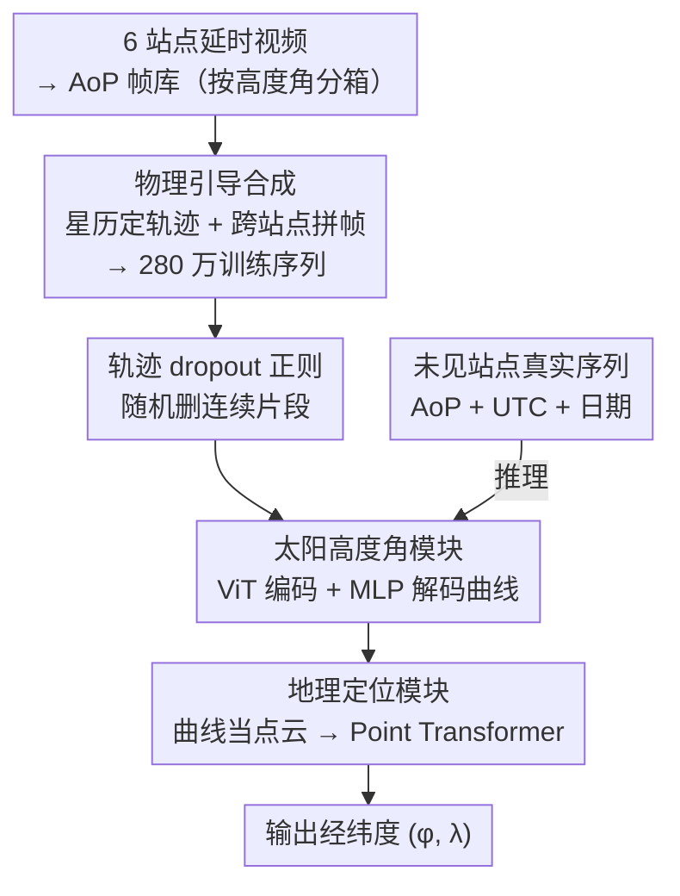

# Global Underwater Geolocation from Time-Lapse Polarization Imagery

**会议**: CVPR 2026  
**论文**: [CVF Open Access](https://openaccess.thecvf.com/content/CVPR2026/html/Aghajanzadeh_Global_Underwater_Geolocation_from_Time-Lapse_Polarization_Imagery_CVPR_2026_paper.html)  
**代码**: 无（论文称将释出新基准数据集）  
**领域**: 水下视觉 / 偏振成像 / 地理定位  
**关键词**: 水下地理定位, 天空偏振, 太阳高度角, 物理引导合成, Transformer  

## 一句话总结
一台水下偏振相机只需拍一段仰拍天空的延时序列加上 UTC 时间戳，本文就用「物理引导合成 280 万条训练序列 + 两段式 Transformer 先重建太阳高度角曲线再回归经纬度」把跨站点（未见过的水域）的定位中位误差从 SOTA 的约 3000 km 压到约 500 km，提升近 8 倍。

## 研究背景与动机

**领域现状**：水下智能体（自主潜航器、海洋监测平台）几乎无法知道自己在哪——GPS 信号入水几厘米就消失，声学基线/地形匹配声呐需要昂贵的预先布设，且只能在 10 km 量级的「已仪器化」小区域内定位。一个不依赖基础设施的线索是天空：阳光透过水面后形成的偏振图样隐含太阳高度角，而「一天内太阳高度角随时间的变化曲线」配上时钟，就能反解出观测者的纬度和经度（这正是动物用天空偏振导航的原理）。

**现有痛点**：从偏振图反推太阳高度角本身极难（图 4：同一高度角下，曝光、云、浑浊度、游过的海洋生物都会让图像面目全非）。更致命的是数据「稠密又稀疏」——同一站点能拍到海量帧（观测稠密），但实际采集点只有寥寥几个（地点稀疏）。已有深度方法（RI-ResNet-RDM、SecTran-MIM）在训练过见过的站点上能做到约 400 km，可一旦换到没见过的水域，中位误差直接膨胀到约 3000 km。

**核心矛盾**：泛化所需的「地点多样性」与「现实里只能在少数地点采集」根本无法兼得——在大洋上按 100 km 网格布点采数据完全不现实，而影响「从图反推高度角」的种种 nuisance（水的浑浊度、天气、生物）又恰恰和地点强相关，于是模型一换地点就崩。

**切入角度**：作者抓住一条一阶光学规律——水下天空 AoP（偏振角）图样的主导因子只有太阳高度角；局部水体光学（浑浊度、颜色）只缩放对比度，太阳方位角（heading）只让整张图刚性旋转，不改变其径向结构。既然「同一高度角、不同地点/水体/朝向」的图样在对齐方位角后会塌缩成同一条径向曲线，那就可以把少数站点采到的真实帧当作「积木」，按物理上合法的太阳轨迹重新拼接出任意地点、任意日期的训练序列。

**核心 idea**：不去硬刚「单帧→高度角」这个超难任务，而是用物理引导合成把 6 个站点的真实延时帧扩成 280 万条覆盖各纬度/季节/水型的「太阳高度角对齐」序列，把水体/天气/生物当 nuisance 在合成里随机化平均掉；再用紧凑两段式 Transformer 从序列里先重建整条太阳高度角曲线、再回归经纬度。

## 方法详解

### 整体框架

系统分「离线物理引导合成训练集」和「两段式 Polar Transformer」两部分。输入是一段 64 帧的水下仰拍 AoP 偏振序列（每帧带 UTC 时间戳和拍摄日期），输出是相机所在的纬度 $\hat\varphi$ 和经度 $\hat\lambda$。中间先把序列还原成一条 64 点的太阳高度角曲线 $\hat s$，再由这条曲线（即「太阳一天的弧」）解出地理坐标——因为给定日期下，太阳高度角随时间的轨迹（峰高、对称性、斜率）唯一对应一个地理位置。

训练数据不是真去全球采集，而是合成：把 6 个光学差异巨大的站点的延时视频转成 AoP 帧、按高度角分箱编号入库；对全球网格上随机采的「地点 + 日期」，用星历算出该天逐分钟的太阳高度角轨迹，再从库里挑高度角匹配的真实帧拼接成序列，并故意混合不同站点的帧、随机化朝向，让水体/天气被「平均」成噪声。

### 关键设计

**1. 物理引导合成：把少数站点的真实帧拼成全球训练集**

这一步直击「地点稀疏导致泛化崩」的痛点。作者没用完整辐射传输求解器去渲染，而是从 6 个光学多样站点（北马其顿 Lake Ohrid 能见度 >10 m、伊利诺伊 Champaign 浑浊时仅约 0.3 m，覆盖一个数量级以上的水清晰度）采来的真实延时帧出发拼接。合成一条序列时：先在全球网格上选一个地点和一个日期，用 Arvo 的面积保持采样器把点均匀映射到球面三角形（避免简单经纬网格在高纬度过采样——一度经度跨度约 $111.32\cos\varphi$ km 随纬度收缩），年内按四天一箱选随机日保证相邻轨迹差不超过 7 天；再用 Astropy（IAU 标准算法）算出该天日出到日落逐分钟的太阳高度角；然后把轨迹分层为 64 个等间隔采样点（平均间隔约 10 分钟），每个时间步在帧库里搜高度角最接近的 5 帧随机取一帧拼上去。由于库很大、随机匹配可重抽，同一条轨迹能实例化出许多条，形成保物理一致的随机增广。关键在于合成时**为同一高度角随机选不同朝向的帧**（让遮日斑块在图里游走）、**混合不同水型的帧**（防止网络记住单一光学环境），从而把水体/天气/生物变成被平均掉的 nuisance。最终得到 280 万条覆盖纬度、季节、水型的序列，补充材料称合成序列复现目标高度角误差在 $0.01^\circ$ 内、各站点图像数均衡。当某站点作为跨站点测试集时，它的整个帧库会从合成、训练、验证中完全剔除。

**2. 两段式 Polar Transformer：先重建太阳曲线，再把曲线当点云回归坐标**

针对「逐帧独立猜高度角不可靠」的痛点，本文用注意力让序列里每一点都能关注其他所有点，从而对整条日弧的全局性质（峰高、对称性、斜率）做联合推理，而非像旧深度模型那样逐帧独立预测。输入编码上，每帧先过一个浅层 CNN 得空间描述子 $h_i=\mathrm{CNN}(x_i)\in\mathbb{R}^H$；把帧内 UTC 时间归一化为 $\tilde t_i=\text{当日午夜后秒数}/86400\in[0,1]$；把日期（季节）编成周期二维向量 $e(d)=(\sin(2\pi\tilde d),\cos(2\pi\tilde d))$，其中 $\tilde d=\text{年内日序}/D$。三者拼成 token $z_i=[h_i;\tilde t_i;e(d)]\in\mathbb{R}^{H+3}$，加 64 位置嵌入后送入。

第一段「太阳高度角模块」用 ViT 编码器 $T_\theta$ 处理 64 个 token 输出一个全局 summary state，再用 MLP 把每帧特征与该全局状态一起解码成平滑的高度角曲线 $\hat s=(\hat s_1,\dots,\hat s_{64})$。第二段「地理定位模块」把预测曲线 $\hat s$ 与时间上下文 $[\tilde t_i;e(d)]\in\mathbb{R}^3$ 当作一个「64 点云」，喂给 Point Transformer $P_\varphi$ 回归经纬度。之所以用点云式的 Point Transformer 而非 MLP，是因为坐标取决于整条轨迹的全局形状，点间自注意力能提供更稳的全局参照（消融里换 MLP 误差直接 >620 km）。端到端损失为高度角 MSE 加坐标余弦损失：

$$L = \lambda_{\text{elev}}\cdot\frac{1}{64}\sum_{i=1}^{64}\lVert s^{gt}_i-\hat s_i\rVert_2^2 \;+\; \lambda_{\text{geo}}\,\bigl(1-\langle \hat c, c\rangle\bigr)$$

其中 $\hat c, c$ 是预测/真值的单位范数笛卡尔坐标向量（用余弦损失而非欧氏，是因为经纬度本质是球面方向）。

**3. 轨迹 dropout 正则：弥合「合成序列完整 vs 真实序列残缺」的鸿沟**

合成训练序列总是从日出到日落完整覆盖，但真实部署时拍到的延时往往不完整（只有上午段或下午段、或中间断帧）。只在完整序列上训练的模型一遇残缺输入就垮。为此作者在训练中随机删掉输入序列里的**连续片段**，逼模型学会在缺失时间段下也稳健工作。这条正则配合合成器本就刻意做的「只覆盖上午/只覆盖下午」的 daylight 变化，共同提升对部分日弧的鲁棒性；消融里加上它后跨站点中位误差从 567 km 进一步降到 466 km。

### 损失函数 / 训练策略
端到端训练，总损失为高度角 MSE 项（监督 64 点曲线）与坐标余弦损失项的加权和（见上式）；每站点帧库按时间顺序 85%/15% 切训练/验证；跨站点评测时被测站点整库从合成/训练/验证剔除。训练数据规模 280 万序列，序列长度固定 64 帧。

## 实验关键数据

### 主实验

跨站点（leave-one-site-out）与同站点两套设定，指标为测地线中位/平均误差（沿地表的公里数）：

| 设定 | 指标 | Polar Transformer (ours) | SecTran-MIM | RI-ResNet-RDM |
|------|------|--------------------------|-------------|---------------|
| 跨站点（Florida Keys 留出） | 中位测地误差 | **465 km** | 1,733 km | 2,786 km |
| 跨站点（六站点平均） | 站点平均中位误差 | **513 km** | 2,394 km* | 3,971 km* |
| 同站点（六站点平均） | 平均测地误差 | **9 km** | 427 km* | 530 km* |

\* 基线仅在其报告的 4 个站点上评测（缺 Río Ceballos、Kona）。跨站点上本文较 SOTA 约 8 倍提升；同站点上即便只用「排除目标站点帧」的纯合成序列训练（variant c），也与「用目标站点真实帧」训练的 variant a 持平，说明物理合成提供的光学多样性足以替代到站采集。

太阳高度角曲线重建精度（RMSE，越低越好），它是定位精度的上游基础：

| 设定 | Polar Transformer (ours) | RI-ResNet-RDM | SecTran-MIM |
|------|--------------------------|---------------|-------------|
| 同站点（六站均值） | **1.3°**（0.3°@Champaign ~ 3.6°@Río Ceballos） | 3.8° | 4.7° |
| 跨站点（六站均值） | **4.5°**（峰值 9°@Tampa Bay） | 18° | 13°（≈24°@Lake Ohrid） |

本文跨站点仍保持 sub-5° 精度，足以把全球位置框定在约 500 km 测地圆内；而基线在未见水域可偏差几十度，完全无法定位。有趣的是同站点里纯合成训练的 variant b/c 在高度角精度上还略优于真实数据训练的 variant a，说明合成提供的「高度角–图样」配对比任何单一站点都更丰富。

### 消融实验

跨站点、Champaign 测试站，每次只改一个组件：

| Index | 配置 | 高度角 RMSE | 中位测地误差 | 说明 |
|-------|------|-------------|--------------|------|
| 1 | baseline（AoP 帧 + 时间嵌入） | 6.5° | — | 起点 |
| 2 | + day-of-year token | 5.2° | — | 加季节编码，分布更集中 |
| 3 | Point Transformer 用绝对注意力（替换相对） | 2.47° | 845 → 567 km | 约 33% 增益，点序重要时绝对注意力提供更稳全局参照 |
| 4 | + 轨迹 dropout 正则 | 2.2° | 466 km | 进一步降低，最终配置 |
| 5 | 序列长度 64 → 128 | 3° | 微增益 | 翻倍算力却几无收益，故保留 64 |
| 6 | 去掉 ViT 编码器（无 summary token） | 升高 | 中位反而略降但出现离群 | 解码器失去全局上下文，曲线变锯齿 |
| 7 | Point Transformer 换成 MLP | — | >620 km | 各指标恶化，证明点云自注意力关键 |

### 关键发现
- 三大设计——日期编码、对 elevation 采样的绝对注意力、轨迹 dropout——缺一不可，去掉任一都涨误差；其中绝对注意力（Index 3）单独带来约 33% 定位增益，贡献最大。
- 序列长度翻倍（Index 5）几乎无收益却翻倍成本，说明 64 帧已足够刻画一天的太阳弧。
- 物理合成的「地点多样性」比「目标站点真实帧」更值钱：同站点 variant b 与 c 几乎无差距，意味着只要合成捕捉到高度角驱动的结构，局部光学差异是二阶因素。
- ⚠️ 跨站点 leave-one-out 里各站点中位误差范围为 300–800 km（图 1 文字），站点平均 513 km；基线 2394/3971 km 仅基于其报告的 4 个站点，与本文 6 站点平均不完全同口径，横向比大小时需注意这点 caveat。

## 亮点与洞察
- **用物理不变性把「采集」变成「拼接」**：抓住「AoP 图样主导因子只有太阳高度角，朝向只刚性旋转、水体只缩放对比度」这条一阶规律，就能把 6 个站点的真实帧合法地拼成全球 280 万序列——这是个可迁移到任何「nuisance 与标签弱相关、真实采集点稀疏」场景的数据合成范式。
- **两段式分解 = 先解物理量再解任务量**：把「图→坐标」拆成「图→太阳高度角曲线→坐标」，让中间量有明确物理意义且可单独监督/评测，比端到端黑箱更可解释、也更易诊断（图 7 直接看曲线 RMSE）。
- **把「曲线当点云」是个聪明的复用**：预测出的 64 点高度角曲线本质是有序点集，直接套 Point Transformer 做坐标回归，省去为序列回归另设结构。
- **轨迹 dropout 直面 sim-to-real 的具体 gap**（合成完整 vs 真实残缺），这种「针对部署时数据形态做针对性正则」的思路比泛泛的数据增广更对症。

## 局限与展望
- 作者承认：模拟先验区域一旦超过 $2\times10^6\ \text{km}^2$ 性能开始衰减，更广域需要更密采样和更大模型；极低（<10°）和极高（>80°）太阳高度角在帧库里欠采样，这些极端工况表现待考。
- 自己看到的局限：评测站点仅 6 个且分布偏特定，全球泛化的统计说服力有限；跨站点 513 km 的中位误差对很多导航任务仍偏大（同站点 9 km 才实用），方法更像「全球粗定位」而非精定位；高度依赖准确 UTC 时间戳与日期（时钟漂移会直接污染轨迹反解）；需要能仰拍天空、避开强遮挡（生物/船体）的部署姿态。
- 改进思路：作者建议端到端吞入原始四通道 Stokes 图像、加入冰川粉/藻华等异常散射水体、用更大 Transformer；还可引入运动/惯性弱先验做时序滤波把粗定位收紧。

## 相关工作与启发
- **vs Powell et al.（物理参数化定位）**: 他们用解析模型把观测者定位到约 2000 km，但在低太阳高度角或浑浊水中急剧退化；本文用数据驱动合成 + Transformer，跨站点降到约 500 km 且对浑浊更鲁棒。
- **vs RI-ResNet-RDM [2] / SecTran-MIM [3]（深度基线）**: 它们在训练过的站点上能到约 400 km，但换站点膨胀到约 3000 km；区别在本文用物理引导合成强行制造「地点多样性」、并用序列级注意力对整条日弧联合推理而非逐帧独立预测，从而跨站点提升约 8 倍。
- **启发**: 「真实数据稠密但标签维度稀疏」的难题，可借助领域已知的物理/几何不变性，把已有真实样本按合法约束重组成覆盖稀疏维度的合成集——比纯仿真渲染更真实、比硬采集更可行。

## 评分
- 新颖性: ⭐⭐⭐⭐⭐ 物理引导帧拼接 + 两段式曲线-坐标分解，把一个几乎无解的水下定位问题做出近 8 倍提升，角度独特。
- 实验充分度: ⭐⭐⭐⭐ 跨站/同站/高度角三层评测加 7 项消融较完整，但仅 6 个站点、且与基线口径不完全一致。
- 写作质量: ⭐⭐⭐⭐⭐ 物理机制与方法分解讲得清晰，图 1/2/5 把 pipeline 串得很直观。
- 价值: ⭐⭐⭐⭐ 为 GPS 不可用的水下平台提供无基础设施的相机-only 粗定位方案，应用前景实在；精度对精导航仍偏粗。

<!-- RELATED:START -->

## 相关论文

- [\[CVPR 2026\] AVGGT: Rethinking Global Attention for Accelerating VGGT](avggt_rethinking_global_attention_for_accelerating_vggt.md)
- [\[CVPR 2026\] Beyond Global Similarity: Multi-Conditional Retrieval for Fine-Grained Cross-Modal Understanding](beyond_global_similarity_multi-conditional_retrieval_for_fine-grained_cross-moda.md)
- [\[CVPR 2026\] Neural Collapse in Test-Time Adaptation](neural_collapse_in_test-time_adaptation.md)
- [\[CVPR 2026\] ViT3: Unlocking Test-Time Training in Vision](vit3_unlocking_test_time_training_in_vision.md)
- [\[ICLR 2026\] The Invisibility Hypothesis: Promises of AGI and the Future of the Global South](../../ICLR2026/others/the_invisibility_hypothesis_promises_of_agi_and_the_future_of_the_global_south.md)

<!-- RELATED:END -->
