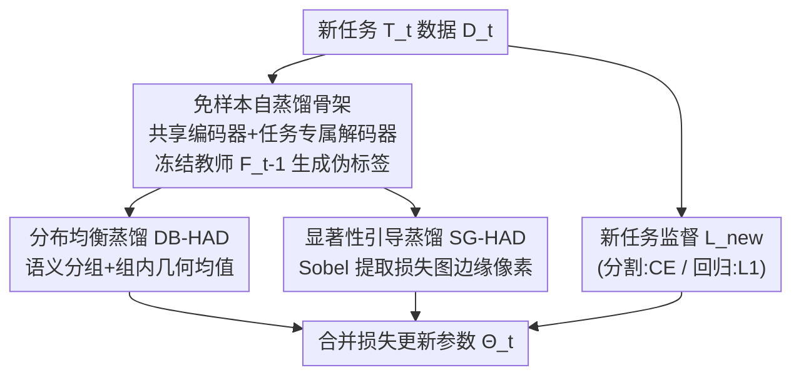

# HAD: Heterogeneity-Aware Distillation for Lifelong Heterogeneous Learning

**会议**: CVPR 2026  
**论文**: [CVF Open Access](https://openaccess.thecvf.com/content/CVPR2026/html/Zhang_HAD_Heterogeneity-Aware_Distillation_for_Lifelong_Heterogeneous_Learning_CVPR_2026_paper.html)  
**代码**: https://github.com/Deexaa/HAD  
**领域**: 持续学习 / 终身学习 / 稠密预测  
**关键词**: 终身学习, 灾难性遗忘, 异构任务, 自蒸馏, 稠密预测

## 一句话总结
本文把终身学习从"同构任务流"推广到"异构任务流"（LHL），并落地到稠密预测场景（LHL4DP），提出免样本的异构感知蒸馏 HAD——靠冻结教师生成伪标签做自蒸馏，再用分布均衡损失（DB-HAD）和显著性引导损失（SG-HAD）两个互补项缓解伪标签的类别/数值失衡与边界信息丢失，在 CityScapes / NYUv2 / Taskonomy 上显著优于现有终身学习方法。

## 研究背景与动机
**领域现状**：终身学习（又称持续学习 / 增量学习）的目标是让模型按时间顺序学一串新任务的同时不忘旧任务，核心敌人是"灾难性遗忘"。但绝大多数已有方法都假设任务是**同构**的——要么全是分类、要么全是分割，输出空间结构一致。

**现有痛点**：现实世界里任务往往是**异构**的：自动驾驶 / 智能体需要一个模型同时具备分割（离散类别标签）、深度估计（连续深度图）、表面法向估计（连续三维向量）等多种稠密预测能力。把这些任务排成一条流式序列逐个学，旧的分类经验、回归经验各自结构完全不同，现有同构假设下的方法直接失效——比如持续语义分割（CSS）依赖类别标签/分类概率，回归任务里根本不存在；增量深度估计（IDE）的域感知设计也搬不到分割任务上。

**核心矛盾**：异构任务流要求同时保留**结构互不相同的异构知识**（分割的语义结构 vs 深度的三维场景理解），而出于隐私和数据采集的时序不一致，又不能存历史数据联合训练。"保留异构知识"与"不存旧数据"之间的张力，是传统终身学习从没正面处理过的。作者实测（Fig.1）：在 LHL4DP 下做朴素顺序训练，无论任务排列顺序如何，所有任务都发生灾难性遗忘。

**本文目标**：① 形式化定义这个更广的设定——终身异构学习（LHL），并实例化到稠密预测（LHL4DP）；② 设计一个免样本（exemplar-free，不存历史数据）的方法守住异构知识。

**切入角度**：既然不能存旧数据，但所有任务**共享同一输入域**，那就用上一阶段训好的"教师"在当前新任务数据上生成伪标签，把旧任务知识"投影"到新数据上做自蒸馏。问题在于：稠密预测的伪标签天然**分布失衡**（少数类别/数值区间占据绝大多数像素），且最有信息量的边界像素占比极小，朴素蒸馏会被多数像素淹没。

**核心 idea**：用"分布均衡 + 显著性引导"两个互补的蒸馏损失，替代朴素逐像素蒸馏，分别解决像素分布失衡和边界信息保留两个问题。

## 方法详解

### 整体框架
HAD 处理的是 LHL4DP：一串异构稠密预测任务 $\{T_t\}_{t=1}^T$ 顺序到来，共享输入空间 $X$，但每个任务有自己的输出空间 $Y_t$（离散类别 / 连续深度 / 连续法向）。模型用一个**任务共享编码器** $f_{\omega_t}$ 抽取细粒度特征，外加**逐任务专属解码器** $\{g_{\varepsilon_t^i}\}$ 映射到各自输出。

第 $t$ 个训练阶段的流程是：参数 $\Theta_t$ 从上一阶段 $\Theta_{t-1}$ 初始化、扩展出新任务的解码器 $\varepsilon_t^t$；用任务专属监督损失 $L_{new}$（深度用 L1、分割用交叉熵）学新任务 $T_t$；同时把上一阶段冻结的旧学习器 $\{F_j^{t-1}\}$ 当**教师**，在新任务数据 $D_t$ 上为每个旧任务 $T_j$ 生成伪标签，由两个异构感知蒸馏损失（DB-HAD + SG-HAD）把学生预测对齐到伪标签，从而保住旧知识。总损失为

$$L = \frac{\lambda}{2(t-1)}\sum_{j=1}^{t-1} L_{had,j} + L_{new}, \qquad L_{had,j} = \mathbb{E}_{x\in D_t}\big[L_{db,j}(x) + L_{sg,j}(x)\big].$$

### 关键设计

**1. 免样本自蒸馏骨架：用共享输入域把旧知识"投影"到新数据**

针对"不能存历史数据、却要保异构知识"的核心矛盾，HAD 不存任何旧样本（exemplar-free），而是利用所有任务共享输入域这一事实：在新任务 $T_t$ 的数据 $D_t$ 上，用上一阶段冻结的旧学习器 $F_j^{t-1}$ 直接前向得到每个旧任务的伪标签，再让正在训练的学生 $F_j^t$ 去对齐它们。架构上共享编码器负责积累跨任务的通用特征、各任务专属解码器负责异构输出，新任务来时只扩一个解码器、其余从 $\Theta_{t-1}$ 初始化。消融（Tab.3）对比了几种维持旧知识的训练范式——只更新旧解码器、先学新任务再补旧解码器、只更新新解码器等——结果都不如本文选定的"边学新任务边自蒸馏（DIS）"范式，说明编码器与解码器同步在新数据上做蒸馏对保住共享表征是必要的。

**2. DB-HAD 分布均衡蒸馏：按语义分组 + 组内几何均值，压制多数像素的统治**

朴素蒸馏的问题是伪标签像素分布严重失衡（Fig.3：分割里少数类别占绝大多数像素，深度里某些数值区间像素特别多），多数类的逐像素损失会主导优化、淹没稀有但重要的语义。DB-HAD 先把伪标签划成 $C_j$ 个**语义组**：分类任务里一个组=一个类别（用指示函数构造二值掩码 $M_{c,j}^x[m,n]=\mathbb{I}(F_j^{t-1}(x)[m,n]=c)$）；回归任务先把通道平均成标量、min–max 归一化到 $[0,1]$、再用阈值 $\delta$ 二值化成前景/背景两组。组内不取算术均值而取**几何均值**来平滑逐像素蒸馏损失（抑制伪标签噪声/离群值的影响），组间再算术平均、保证每组贡献相等：

$$L_{db,j}(x) = \sum_{c=1}^{C_j}\frac{1}{C_j}\Big(\prod_{(m,n)\in I_{c,j}(x)} L_{dis,j}\big(F_j^t(x),F_j^{t-1}(x)\big)[m,n]\Big)^{\frac{1}{|I_{c,j}(x)|}}.$$

消融显示：去掉 DB-HAD 掉 2.84%，把几何均值换成算术均值掉 6.29%（验证几何均值抗噪的价值）；回归任务上本文的二组前景/背景划分也优于把数值域均匀切成 5/10/15 等宽区间的做法。

**3. SG-HAD 显著性引导蒸馏：用 Sobel 在损失图上锁定边界像素**

稠密预测里最有信息量的信号集中在**语义边界 / 数值突变处**，但这些像素占比小，DB-HAD 仍可能让它们被平坦区域稀释。SG-HAD 的巧思是：不在预测图上找边缘，而在**师生逐像素蒸馏损失图** $I_j(x)=L_{dis,j}(F_j^t(x),F_j^{t-1}(x))$ 上找边缘。用 Sobel 算子（水平核 $G_h$、垂直核 $G_v$）算梯度幅值 $G_j(x)=\sqrt{(G_h*I_j)^2+(G_v*I_j)^2}$，再阈值 $k$ 选出边缘像素集 $P_j(x)=\{(m,n)\mid G_j(x)[m,n]>k\}$，只在这些显著像素上累加损失：$L_{sg,j}(x)=\sum_{(m,n)\in P_j(x)}\frac{1}{|P_j(x)|}I_j(x)[m,n]$。作者比较了"损失图梯度"与"预测图梯度"（Fig.5），前者边缘更清晰、更适合定位边界集。消融里去掉 SG-HAD 掉 1.27%，说明边界感知是 DB-HAD 之外的有效补充。

### 损失函数 / 训练策略
总目标见整体框架的式子：每个旧任务 $T_j$ 的蒸馏项 $L_{had,j}=L_{db,j}+L_{sg,j}$ 对 $t-1$ 个旧任务求和、用 $\frac{\lambda}{2(t-1)}$ 归一并加权，再叠加新任务监督 $L_{new}$。骨干网络统一用 DeepLabV3+（ResNet-18/-50 带空洞卷积作共享编码器，ASPP 作任务专属解码器）。$\lambda$ 控制蒸馏强度，阈值 $\delta$、$k$ 控制分组与边界选择。

## 实验关键数据

### 主实验
所有方法统一 DeepLabV3+ 架构。评价指标用两类：相对朴素训练的**平均相对提升** $\Delta_v^m$（跨任务、跨指标聚合，越高越好）与**平均排名** MR（越低越好）。

| 数据集 / 任务数 | 编码器 | 指标 | HAD | 最优基线 | Joint(上界) |
|------|------|------|------|----------|-------------|
| NYUv2 / 3 任务 | ResNet-18 | $\Delta_v^m$↑ | **+32.74%** | LwF +24.74% | +40.83% |
| NYUv2 / 3 任务 | ResNet-50 | $\Delta_v^m$↑ | **+35.71%** | LwF +32.94% | +44.36% |
| Taskonomy / 10 任务 | ResNet-18 | $\Delta_v^m$↑ | **+10.90%** | iCaRL +8.47% | +44.57% |

对比的终身学习基线包括 EWC、LwF、iCaRL、DER、SPG、SGP，以及两个极端参照——朴素顺序训练（下界）和联合训练（上界）。HAD 在不同架构、不同任务数下都取得最高 $\Delta_v^m$ 与最优/次优 MR：NYUv2 上 ResNet-18 的 MR 3.67、ResNet-50 的 MR 4.00，10 任务 Taskonomy 上 MR 3.50（在所有终身学习方法里最好），且在最多的单个任务上取得最低测试损失。

### 消融实验
| 配置 | $\Delta_v^m$（相对完整 HAD） | 说明 |
|------|------|------|
| HAD（完整） | +0.00% | 完整模型，MR 1.00 |
| w/o SG-HAD | -1.27% | 去掉显著性边界损失 |
| w/o DB-HAD | -2.84% | 去掉分布均衡损失，掉点更多 |
| w/ Arithmetic | -6.29% | 几何均值换算术均值，抗噪能力丧失 |
| $\hat{C}_j=5/10/15$ | -3.64% / -5.43% / -9.72% | 回归任务用等宽分组替代前景/背景二分组，组越多越差 |

### 关键发现
- **DB-HAD 比 SG-HAD 贡献更大**：去掉 DB-HAD 掉 2.84% > 去掉 SG-HAD 的 1.27%，说明像素分布失衡是稠密预测蒸馏的首要矛盾，边界保留是次要但仍有效的补充。
- **几何均值是 DB-HAD 的关键**：换成算术均值直接掉 6.29%，远大于去掉整个 DB-HAD 的 2.84%——劣质的算术聚合甚至比不用分组更糟，印证几何均值在抗伪标签噪声上的作用。
- **回归分组宜粗不宜细**：等宽切 5/10/15 组单调变差（-3.64%→-9.72%），本文前景/背景二分组反而最好，因为细分组让每组样本太少、几何均值不稳。
- **LHL4DP 本身有额外收益**：相比为每个任务单独训模型，共享编码器在 ResNet-18 / 10 任务下省去 172.23% 的额外编码器参数开销，且在 NYUv2 上分割/深度/法向分别还提升 1.38% / 5.2% / 9.87%（任务间正迁移）。

## 亮点与洞察
- **把终身学习从同构推广到异构（LHL/LHL4DP）是设定层面的贡献**：以往工作处理的是类别增量、域增量这类"同一任务类型内"的异构，本文第一次正面处理"任务类型本身异构（分类 + 回归混流）"且输出空间结构不同的场景，这个问题定义本身就有价值。
- **"在损失图而非预测图上做 Sobel 找边界"很巧**：直接对预测图求梯度会把所有纹理边缘都框进来，而对师生蒸馏损失图求梯度，框出的恰是"师生分歧大、最该保留"的像素，把"显著性"和"待保留知识"统一了起来——这个视角可迁移到任何蒸馏场景。
- **几何均值替代算术均值抗噪**：组内用几何均值平滑逐像素损失，对伪标签噪声鲁棒，是个轻量可复用的 trick，迁移到其他用伪标签自训练的任务都可能受益。

## 局限与展望
- **大量细节与扩展实验放进附录**：基准细节、$L_{new}$ 形式、不同任务序列、更多架构与数据集结果、敏感性分析都在 Appendix，正文实验主要落在三个数据集，难以独立判断方法对任务顺序的稳健性。
- **依赖共享输入域假设**：伪标签生成的前提是所有任务共享同一输入图像域，一旦不同任务输入分布差异大（如跨模态），教师在新数据上的伪标签质量会下降，方法可能失效（⚠️ 以原文为准）。
- **超参敏感**：DB-HAD 的回归阈值 $\delta$、SG-HAD 的边缘阈值 $k$、蒸馏权重 $\lambda$ 都需调，论文把敏感性分析留在附录，实际部署到新任务组合时调参成本未知。
- **改进方向**：可探索自适应分组数、把显著性引导扩展到时序/视频稠密预测，或与参数隔离类方法结合进一步降遗忘。

## 相关工作与启发
- **vs EWC / SPG / SGP（正则化派）**：它们靠参数重要性正则约束旧知识，本文不约束参数而靠伪标签自蒸馏约束输出，在异构稠密预测上 $\Delta_v^m$ 显著更高（如 ResNet-18 上 32.74% vs EWC 24.39%）。
- **vs iCaRL / DER（回放派）**：回放需存历史样本/预测，本文 exemplar-free 不存任何旧数据，且性能反超（10 任务上 10.90% vs iCaRL 8.47%），更契合隐私/数据时序不一致的现实约束。
- **vs LwF（蒸馏派）**：LwF 是经典的免样本知识蒸馏，但用朴素逐像素蒸馏；本文在其思路上加了分布均衡 + 显著性引导两个针对稠密预测的改造，是最强的可比基线，HAD 一致优于它。
- **vs CSS / IDE（任务专属终身学习）**：持续语义分割依赖类别标签、增量深度估计靠域感知设计，都绑死单一任务类型，无法跨异构任务；本文的异构感知损失对离散/连续输出统一适用。

## 评分
- 新颖性: ⭐⭐⭐⭐⭐ 首次形式化终身异构学习设定（LHL/LHL4DP），问题定义本身有开创性
- 实验充分度: ⭐⭐⭐⭐ 三数据集 + 完整消融，但大量结果与序列鲁棒性分析压进附录
- 写作质量: ⭐⭐⭐⭐ 问题动机与损失推导清晰，正文略受页数限制
- 价值: ⭐⭐⭐⭐ 异构任务终身学习贴近自动驾驶/智能体真实需求，方法免样本易落地

<!-- RELATED:START -->

## 相关论文

- [\[CVPR 2026\] Anti-Degradation Lifelong Multi-View Clustering](anti-degradation_lifelong_multi-view_clustering.md)
- [\[CVPR 2026\] FEAT: Federated Geometry-Aware Correction for Exemplar Replay under Continual Dynamic Heterogeneity](feat_federated_geometry_aware_correction_for_exemplar_replay_under_continual_dynamic_heterogeneity.md)
- [\[CVPR 2026\] Cluster-aware Anchor Learning for Multi-View Clustering](cluster-aware_anchor_learning_for_multi-view_clustering.md)
- [\[CVPR 2026\] Cross-View Distillation and Adaptive Masking for Incomplete Multi-View Multi-Label Classification](cross-view_distillation_and_adaptive_masking_for_incomplete_multi-view_multi-lab.md)
- [\[CVPR 2026\] PAF: Perturbation-Aware Filtering for Open-Set Semi-Supervised Learning](paf_perturbation-aware_filtering_for_open-set_semi-supervised_learning.md)

<!-- RELATED:END -->
