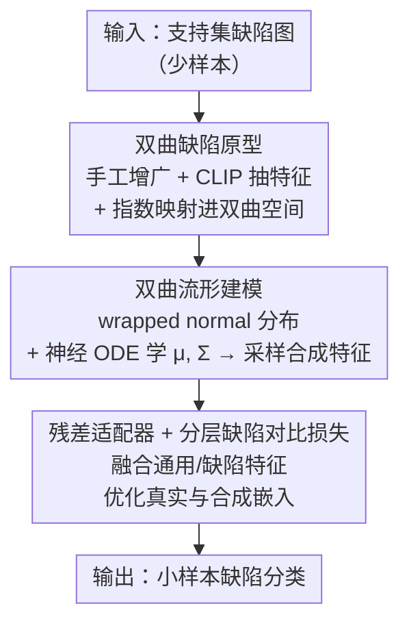

# Hyperbolic Defect Feature Synthesis for Few-Shot Defect Classification

**会议**: CVPR 2026  
**论文**: [CVF Open Access](https://openaccess.thecvf.com/content/CVPR2026/html/Li_Hyperbolic_Defect_Feature_Synthesis_for_Few-Shot_Defect_Classification_CVPR_2026_paper.html)  
**代码**: 待确认  
**领域**: 工业缺陷分类 / 小样本学习 / 双曲表示学习  
**关键词**: 双曲空间, 缺陷特征合成, 小样本分类, 原型建模, 对比学习

## 一句话总结
本文提出 HypDFS，把工业缺陷的特征合成从欧氏空间搬到**双曲空间**——用少量双曲缺陷原型建模缺陷分布、采样出合成特征，再配残差适配器和分层缺陷对比损失，利用双曲空间天然适合表达"树状层级"的特性，在 MVTec-FS 和 MTD 小样本基准上大幅超越欧氏基线。

## 研究背景与动机

**领域现状**：工业生产从"大批量单品类"转向"小批量多品类"，缺陷分类常常只有极少样本。缺陷合成（defect synthesis）是解决小样本缺陷分类的主流路线之一，分三类：手工规则增广（旋转/翻转/缩放/加噪）、AIGC 生成（GAN/扩散）、以及**特征级合成**（直接在特征空间造缺陷特征）。其中特征级合成在算力和性能之间取得较好平衡。

**现有痛点**：现有的特征级缺陷合成方法（如 SimpleNet 用预训练特征+噪声）**全都在欧氏空间里做**。而欧氏空间是"平的"，难以刻画缺陷数据里复杂的结构关系——尤其是缺陷天然带有的树状层级（如 leather 缺陷下分 glue/fold/color，color 又细分不同颜色/形状/尺寸）。

**核心矛盾**：欧氏空间的"平坦性"与缺陷语义的"树状层级指数增长"之间不匹配——树的节点数随深度指数增长，而欧氏空间体积只随半径多项式增长，硬塞会挤压、扭曲层级关系。文中量化指出：MVTec-FS 的 leather 缺陷在树深为 3 时平均分支因子达 9.3，呈指数增长特征。

**本文目标**：把缺陷特征合成扩展到双曲空间，让合成的缺陷特征能保留并强化缺陷间的层级语义，从而得到更泛化的缺陷表示、提升下游小样本分类。

**切入角度**：双曲空间（常负曲率黎曼流形）的体积随半径指数膨胀，天然适合嵌入树状层级数据。既然缺陷语义是树状的，就应该在双曲空间里建模其分布。

**核心 idea**：用少量"双曲缺陷原型"建模缺陷的潜在分布并采样合成特征，再用"双曲距离驱动的分层缺陷对比损失"优化真实与合成特征，把缺陷合成整体迁入双曲空间。

## 方法详解

### 整体框架
HypDFS 的输入是支持集里少量缺陷图，输出是一个能把查询图分到正确缺陷类的分类器。训练时分三大模块串行：(1) 用预训练 CLIP 抽取整图与裁剪区域特征、经指数映射得到**双曲缺陷原型**；(2) 在双曲空间用 wrapped normal 分布 + 神经 ODE 建模每类缺陷的流形，采样出**合成缺陷特征**；(3) 训练一个**残差适配器**动态融合通用特征与缺陷特征，并用**分层缺陷对比损失**优化真实/合成特征。评估时，查询图在训练好的适配器引导下被分到支持集对应类别。

### 关键设计

**1. 双曲缺陷原型：先在欧氏抽特征，再经指数映射进双曲空间**

痛点是缺陷样本太少，直接估分布会偏。作者先用手工增广 $\mathrm{AUG}(\cdot)$（旋转/平移/缩放）扩充缺陷图 $I_{hd}=\mathrm{AUG}(I)$，用预训练 CLIP 抽特征 $f_{hd}=\mathrm{CLIP}(I_{hd})$ 作为原型来源；从 $f_{hd}$ 采样得欧氏原型 $f$，再用 Poincaré 球的指数映射搬到双曲空间：$h=\exp_u^c(f)=u\oplus_c\big(\tanh(\sqrt{c}\tfrac{\lambda_u^c\lVert f\rVert}{2})\tfrac{f}{\sqrt{c}\lVert f\rVert}\big)$，其中 $c$ 是曲率参数、$\lambda_u^c=2/(1+c\lVert u\rVert^2)$ 是共形因子、$u$ 取原点 0。$\oplus_c$ 是双曲空间的 Möbius 加法（式 1），双曲距离 $d_{\mathbb{D}_c}$ 用 $\mathrm{arctanh}$ 定义（式 2），且当 $c\to0$ 退化回欧氏距离——这保证双曲是欧氏的严格推广。这一步把"原型"这个小样本分类的关键载体放进了能表达层级的几何里。

**2. 双曲流形建模 + 神经 ODE：用 wrapped normal 分布建模每类缺陷并采样合成特征**

有了双曲原型，需要建模每类缺陷的分布以便采样新特征。作者用 wrapped normal 分布 $\mathcal{P}(z\mid c,h,\mu,\Sigma)$（式 5）——它是把切空间上的高斯 $\mathcal{N}(\cdot\mid\mu,\Sigma)$ 经对数映射 $\log_u^c$ 投到流形上、再乘一个由双曲距离决定的体积修正因子 $\tfrac{\sqrt{c}\,d_{\mathbb{D}_c}(h,z)}{\sinh(\sqrt{c}\,d_{\mathbb{D}_c}(h,z))}$ 得到。直接从少量原型估 $\mu,\Sigma$ 会有偏，所以改用**神经 ODE**（Runge–Kutta 数值解）逐迭代算每类的 $\mu_i,\Sigma_i=\mathrm{RK}(\mu_0,\Sigma_0,\mathrm{ODE}_\mu,\mathrm{ODE}_\Sigma,i)$（式 7），$\mathrm{ODE}_\mu/\mathrm{ODE}_\Sigma$ 是全连接+自注意力网络。采样时先在欧氏切空间采高斯、再经指数映射回双曲（式 4），并用重参数化技巧解决采样不可导问题。最终得到合成缺陷特征 $h_{sd}$，相当于在缺陷流形上"长"出更多带层级语义的样本来补足小样本。

**3. 残差适配器 + 分层缺陷对比损失：融合通用与缺陷特征、用双曲距离拉出层级**

合成出特征后，要让预训练 CLIP 的通用知识适配到缺陷域。残差适配器把真实特征 $f$ 与（由 $h_{sd}$ 经对数映射回欧氏的）合成特征 $f_{sd}$ 拼接：$f_{in}=\mathrm{CON}(f,f_{sd})$，再 $f_{out}=\mathrm{SiLU}(Wf_{in})+f_{in}$（式 8），$f_{out}$ 进普通交叉熵 $\mathcal{L}_{ce}$。总损失是 $\mathcal{L}_{hdcl}=\mathcal{L}_{ce}+\alpha\mathcal{L}_s+\beta\mathcal{L}_{cl}$（式 10）：合成约束 $\mathcal{L}_s$（式 9）用双曲距离与 margin $m_d$ 防止合成特征过度聚到原型旁、也防合成特征互相挤成一团；对比项 $\mathcal{L}_{cl}$（式 11）在整图特征 $h_{wd}$ 与对应裁剪区域特征 $h_{cd}$ 之间做基于双曲距离的对比（温度 $\tau$），把"整图—缺陷区"的层级对应关系拉出来。这一组损失是双曲建模能真正落到分类增益的关键——它让合成特征既多样又层级清晰。

### 损失函数 / 训练策略
总损失 $\mathcal{L}_{hdcl}=\mathcal{L}_{ce}+\alpha\mathcal{L}_s+\beta\mathcal{L}_{cl}$，默认 $\alpha=\beta=0.1$、$\tau=0.3$、曲率 $c=0.05$（启发式选取）。优化器 AdamW，初始学习率 1e-4 + 余弦退火，batch size 默认 32。特征提取器默认 AlphaCLIP（ViT-L/14）。采用 N-way K-shot 设定，$K\in\{1,3,5\}$。单张 RTX 3090 训练。

## 实验关键数据

数据集：MVTec-FS（MVTec-AD 的小样本版，14 类工业产品、46 种缺陷、1228 张图）与 MTD（磁瓦缺陷，5 类、392 张图）。指标为平均分类准确率（%）。

### 主实验：与 SOTA 对比

| 数据集 | K | 之前最好（Zip-A-F [29]） | HypDFS（本文） | 提升 |
|--------|---|--------------------------|----------------|------|
| MVTec-FS | 1 | 73.7 | **79.3** | +5.6 |
| MVTec-FS | 3 | 86.1 | **89.3** | +3.2 |
| MVTec-FS | 5 | 89.4 | **91.7** | +2.3 |
| MTD | 1 | 55.4 | **59.4** | +4.0 |
| MTD | 3 | 67.6 | **78.6** | +8.7 |
| MTD | 5 | 78.6 | **86.4** | +7.8 |

（HypDFS 全面超越 CLIP-Adapter、CLIP-ProtoNet、CLIP-KNN、Tip-A-F、Zip-A-F 等欧氏方法；在更难的 MTD 上提升尤为显著。）

### 消融实验（均为 MTD，部分 K=5）

| 模块 / 配置 | 关键指标 | 说明 |
|------------|---------|------|
| 残差适配器：NO → Real → Real&Syn（K=5） | 69.5 → 78.1 → **86.4** | 仅适配器 +8.6，再加合成特征 +8.3，验证"合成特征"是核心增益 |
| 对比损失：Euclidean → Hyperbolic → HDCL（K=5） | 78.1 → 79.2 → **86.4** | 仅换双曲空间 +1.1；加分层缺陷对比损失再 +7.2 |
| 曲率 $c$：0(欧氏) → 0.1（K=5） | 78.1 → 79.1 | 合适曲率比欧氏 +1.0；设为可学习反而没更好（79.2 vs 78.9）|
| 主干：VanillaCLIP ViT-L/14 → AlphaCLIP ViT-L/14（MTD,K=5,无微调） | 52.5 → 69.5 | 带掩码的 AlphaCLIP 更聚焦缺陷区，+17.0 |

### 关键发现
- **合成特征贡献最大**：适配器消融里，"Real → Real&Syn"再涨 8.3%（K=5），说明双曲合成特征本身就是主增益来源，而非只靠适配。
- **双曲空间单独换不够，要配对比损失**：仅把损失从欧氏换到双曲只涨 1.1%（78.1→79.2），但叠加分层缺陷对比损失 HDCL 后猛涨到 86.4%——说明双曲几何的价值要靠对比损失把层级"拉开"才能兑现。
- **曲率难自动选**：固定 $c$ 在 0.01–1.0 区间准确率都稳定在 79% 附近，但可学习曲率并没带来更好结果，作者把"自适应找最优曲率"列为未来工作。
- **AlphaCLIP 的掩码很关键**：带掩码聚焦缺陷区的 AlphaCLIP 比 VanillaCLIP 高 17%，所以默认用 AlphaCLIP ViT-L/14。

## 亮点与洞察
- **几何对路是关键洞察**：缺陷语义本就是树状层级（leather→color→具体颜色），而双曲空间体积指数膨胀恰好匹配树的指数增长——把合成放进对的几何里，比在欧氏里堆技巧更有效。这个"先看数据的内在几何、再选空间"的思路可迁移到任何带层级结构的少样本任务。
- **神经 ODE 估分布参数**：用 ODE 而非直接矩估计来算每类的 $\mu,\Sigma$，缓解了少量原型导致的估计偏差，是小样本下建模分布的一个实用 trick。
- **整图—裁剪区的双曲对比**：用"整张缺陷图 vs 对应裁剪缺陷区"做双曲对比，把层级关系显式编码进损失，是它能从双曲几何里真正榨出分类增益的机关。

## 局限与展望
- 作者承认只在两个工业图像基准（MVTec-FS、MTD）上验证，更多基准上的表现仍需进一步评估。
- 曲率 $c$ 靠启发式手调、可学习版反而更差，缺一个有原则、可解释的曲率选取方法。
- ⚠️ 缓存为 OCR 文本，多处公式（式 1/4/5/6/9/11 的 LaTeX 源码）有转义乱码，本笔记按上下文语义复述，具体公式以原文为准。
- 自己发现：方法把手工增广、CLIP、AlphaCLIP、wrapped normal、神经 ODE、残差适配器、双层对比损失串成一条较长流水线，组件多、超参（$c,\alpha,\beta,\tau$）也多，复现与调参成本不低；论文未充分分析各组件对算力/时延的代价。

## 相关工作与启发
- **vs SimpleNet [28]（欧氏特征合成）**：同是特征级缺陷合成，但 SimpleNet 在欧氏空间用预训练特征+噪声造缺陷；本文在双曲空间用原型+wrapped normal 建模分布，能保留树状层级，故表示更泛化。
- **vs CutPaste [22] / MVREC [29]（手工/规则增广）**：那类靠裁剪、旋转、多视角偏移造缺陷，合成的缺陷类型有限且需领域知识；本文在特征空间合成，类型更丰富。
- **vs DualAnoDiff [17]（扩散生成）**：扩散生成可控但算力重、资源受限场景难用；本文走特征级、在算力与性能间平衡。
- **vs CLIP-Adapter [10] / Tip-Adapter / Zip-A-F [29]（CLIP 微调）**：都靠微调 CLIP 适配下游，但都在欧氏空间且不显式建模层级；本文用 AlphaCLIP + 合成特征微调残差适配器，并在双曲空间优化，全面超过这些基线。

## 评分
- 新颖性: ⭐⭐⭐⭐ 首次把缺陷特征合成迁入双曲空间，几何动机扎实，但双曲表示+神经 ODE 等组件多为已有工具的组合
- 实验充分度: ⭐⭐⭐⭐ 对比 + 多角度消融（适配器/损失/曲率/主干）较完整，但仅两个基准、缺算力代价分析
- 写作质量: ⭐⭐⭐⭐ 动机与公式清晰，需要双曲几何背景；OCR 外的逻辑链顺畅
- 价值: ⭐⭐⭐⭐ 在工业小样本缺陷分类上大幅提点（MTD 最高 +8.7），开辟了"双曲缺陷合成"的新方向

<!-- RELATED:START -->

## 相关论文

- [\[CVPR 2026\] Language Does Matter for Cross-Domain Few-Shot Visual Feature Enhancement](language_does_matter_for_cross-domain_few-shot_visual_feature_enhancement.md)
- [\[CVPR 2026\] Data-Centric Meta-Learning for Robust Few-Shot Generalization](data-centric_meta-learning_for_robust_few-shot_generalization.md)
- [\[CVPR 2026\] NAF: Zero-Shot Feature Upsampling via Neighborhood Attention Filtering](naf_zero-shot_feature_upsampling_via_neighborhood_attention_filtering.md)
- [\[ECCV 2024\] An Incremental Unified Framework for Small Defect Inspection](../../ECCV2024/others/an_incremental_unified_framework_for_small_defect_inspection.md)
- [\[CVPR 2026\] HypeVPR: Exploring Hyperbolic Space for Perspective to Equirectangular Visual Place Recognition](hypevpr_exploring_hyperbolic_space_for_perspective_to_equirectangular_visual_pla.md)

<!-- RELATED:END -->
