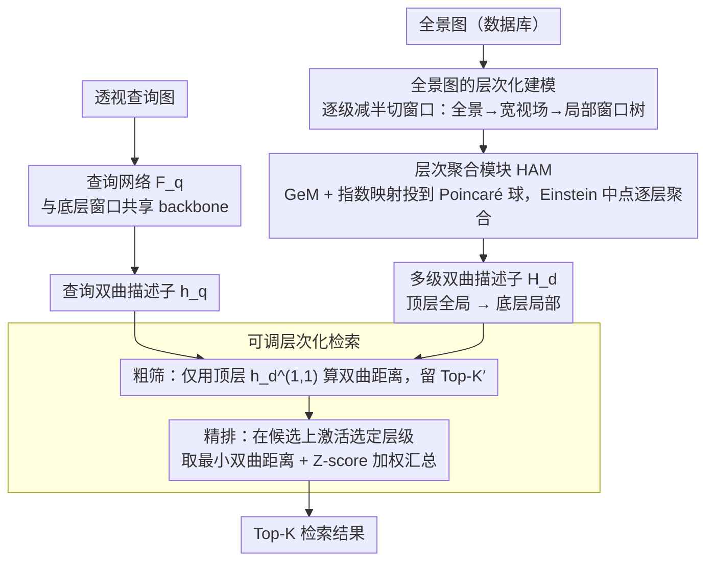

# HypeVPR: Exploring Hyperbolic Space for Perspective to Equirectangular Visual Place Recognition

**会议**: CVPR 2026  
**arXiv**: [2506.04764](https://arxiv.org/abs/2506.04764)  
**代码**: [https://suhan-woo.github.io/HypeVPR/](https://suhan-woo.github.io/HypeVPR/) (Project Page)  
**领域**: 其他  
**关键词**: 视觉位置识别, 双曲空间, 全景图像, 层次化嵌入, 透视-全景匹配

## 一句话总结
本文提出 HypeVPR，一个基于双曲空间层次化嵌入的视觉位置识别框架，专门解决透视图像（查询）与全景图像（数据库）之间的跨视场匹配问题，通过在 Poincaré 球中从局部到全局构建多级描述子，实现精度-效率-存储的灵活平衡，检索速度比滑窗基线快数倍且精度相当。

## 研究背景与动机
视觉位置识别（VPR）通过从数据库中检索与查询图像最相似的图像来定位位置，是自主导航和移动机器人的核心能力。传统 P2P（透视对透视）方法需要对每个位置存储多个方向的图像以覆盖所有可能的查询视角，导致存储和检索开销巨大。

**透视-全景（P2E）框架**是一个更实用的方案：数据库用全景图代表每个位置（一张图覆盖所有方向），查询仍为普通透视图。但 P2E 面临核心挑战：全景图包含 360° 信息，而查询只覆盖有限视场角——如何从一张全景图中提取一个既能编码全局上下文又能精确匹配局部视角的描述子？

现有方法（PanoVPR、Orhan et al.）要么对全景图做滑窗裁剪逐一比对（$O(n)$ 次比较，极慢），要么无法捕获全景图内部的结构化关系。

本文的核心洞察：视觉场景天然具有**层次结构**——全景图包含多个宽视场子视图，每个子视图又包含更窄的局部视角。**双曲空间**天然适合建模层次关系（指数级距离增长可以低失真地嵌入树状结构），用它来组织全景图的多级描述子比欧氏空间更合适。

## 方法详解

### 整体框架
HypeVPR 要解决的是 P2E 检索的不对称性：查询是一张窄视场的透视图，数据库里每个位置却是一张 360° 全景图，两者必须落到同一个度量空间里比距离。框架由两路网络组成。查询网络 $\mathcal{F}_q$ 把透视图压成单个双曲描述子 $\mathbf{h}_q$；数据库网络 $\mathcal{F}_d$ 则把每张全景图拆成一棵「全景→宽视场子视图→窄局部窗口」的层次树，再用层次聚合模块（HAM）把这棵树编码成一组从全局到局部、由粗到细的双曲描述子 $\mathbf{H}_d$。检索时不是把全景图和查询直接比，而是先拿树顶的全局描述子快速粗筛出少量候选，再用树下层的细粒度描述子在候选里精排——这样既保留了全景图的全局上下文，又能对准查询实际看到的那一小片区域。

### 关键设计

**1. 全景图的层次化建模：把一张全景图拆成由粗到细的窗口树**

一张全景图里其实只有一小条带状区域和查询真正对得上，其余 300 多度都是冗余视场，若用单个描述子硬编码整张图，匹配信号会被无关内容稀释。HypeVPR 的做法是按水平视场角逐级减半地切窗口：顶层 $\ell=1$ 是完整全景，往下每一级把水平宽度砍一半，$I_d^{(\ell)} \in \mathbb{R}^{H \times \frac{W'}{2^{\ell-1}} \times C}$，到最底层时窗口的视场角和分辨率刚好与透视查询图对齐，因此底层窗口可以和查询网络共享同一个 backbone。这棵树让检索能「先粗后细」——顶层判断查询大致落在全景的哪个方位，底层再精确锁定匹配的那个局部视角。

**2. 层次聚合模块（HAM）：在双曲空间里按几何尊重层次地聚合描述子**

有了窗口树还需要一个能保住层次结构的聚合方式，而欧氏空间里简单求平均会把「全局抽象」和「局部细节」混成一团。HAM 先对每个窗口做 GeM pooling + Linear 得到欧氏描述子 $\mathbf{d}_d^{(\ell,j)}$，再用指数映射把它投到 Poincaré 球上 $\mathbf{h}_d^{(\ell,j)} = \exp_0^c(\mathbf{d}_d^{(\ell,j)})$。双曲空间的关键性质是：越靠近原点的点表示越抽象的全局语义，越远离原点的点表示越细粒度的局部概念，这恰好对应窗口树从顶到底的层级。相邻窗口往上聚合时用的是 **Einstein 中点**而非算术平均：

$$\mathcal{A}_{hyp}(h_1,\dots,h_n) = \frac{\sum_j \gamma_j h_j}{\sum_j \gamma_j}, \qquad \gamma_j = \frac{1}{\sqrt{1-c\|h_j\|^2}}$$

其中 $\gamma_j$ 是 Lorentz 因子，会给靠近边界（即更细粒度）的描述子更大权重，这种 norm-aware 加权让聚合遵循双曲几何的距离结构，不会像欧氏平均那样把不同层级的信息几何失真地抹平。

**3. 可调层次化检索：推理时按需选层，免重训地换取精度-效率权衡**

不同部署场景对速度和精度的诉求不一样，但传统方法一旦训完，速度-精度比就被钉死了。HypeVPR 利用层次结构做级联检索：先只用每个位置的顶层描述子 $\mathbf{h}_d^{(1,1)}$ 跑一遍粗检索，拿到 Top-$K'$ 候选；再从用户选定的层级集合 $\mathbb{L}$ 里取子描述子对这批候选重新打分，每一层的分数取查询与该层所有子窗口的最小双曲距离 $d_\ell = \min_k d_c(\mathbf{h}_q, \mathbf{h}_d^{(\ell,k)})$，各层分数经 Z-score 归一化后加权汇总成最终得分 $s = \sum_{\ell \in \{1\} \cup \mathbb{L}} w_\ell \hat{s}_\ell$。由于候选集在粗筛阶段已大幅收缩，昂贵的细粒度比对只在少量候选上发生；而激活哪几层完全是推理时的开关，想更快就少激活几层、想更准就多激活几层，全程不需要重新训练。

### 一个完整示例

跟着一张查询透视图走一遍检索，能看清「树」和「级联」是怎么配合的。实验里数据库全景图按 $W'=224\times 8$ 切，正好对应 $L=4$ 层、底层 $2^{L-1}=8$ 个窗口，每个窗口宽 224，与查询图 $224\times224$ 对齐。于是每个库位置被 HAM 编成一组金字塔描述子：第 1 层 1 个全景级 $\mathbf{h}_d^{(1,1)}$、第 2 层 2 个、第 3 层 4 个、第 4 层 8 个，下层每个窗口覆盖的水平视场恰好是上层的一半。

**粗筛**：拿查询描述子 $\mathbf{h}_q$ 只和每个库位置的顶层 $\mathbf{h}_d^{(1,1)}$ 算双曲距离，按距离排序留下 Top-$K'$ 个位置。这一步每个位置只比 1 个描述子，所以哪怕库很大也很快，目的只是把「方位大致对得上」的少数候选挑出来。

**精排**：只在这 $K'$ 个候选里激活下层。比如激活第 4 层，对某个候选的 8 个局部窗口描述子逐一和 $\mathbf{h}_q$ 比，取最小双曲距离 $d_4 = \min_k d_c(\mathbf{h}_q, \mathbf{h}_d^{(4,k)})$——这一步自动选中了和查询视场真正重叠的那一个窗口（比如第 5 个，对应全景图正后方 45° 那片），而其余 7 个朝向不同方位的窗口因为距离大被自然忽略。各激活层的分数先在 $K'$ 个候选上做 Z-score 归一化，再加权汇总成最终得分 $s$，重排后输出 Top-$K$。

整个过程候选集从「全库」收缩到 $K'$ 再定位到具体窗口，画面就是：先用一张缩略图判断「在不在这条街」，再放大去对「是不是这个朝向」。

### 损失函数 / 训练策略
训练用三元组框架端到端优化，核心是一个 **层次三元组损失** $\mathcal{L}_{hier}$：把相邻层级中视场相互重叠的描述子当作正对、同一层里视场不重叠的当作负对，距离一律用双曲距离度量，从而显式地把「父窗口包含子窗口」的层次关系刻进双曲嵌入；在此之上再叠加查询-数据库匹配的标准三元组损失，保证透视查询与对应全景窗口在双曲空间里靠近。

## 实验关键数据

### 主实验

| 方法 | Backbone | Pitts250K R@1 | Pitts250K R@5 | YQ360 R@1 | YQ360 R@5 | 每查询时间(ms) |
|------|----------|------|------|------|------|------|
| PanoVPR×16 (ConvNeXt-S) | ConvNeXt-S | 40.3 | 63.0 | 46.0 | 83.2 | 48.6 |
| HypeVPR-L (ConvNeXt-S) | ConvNeXt-S | **43.4** | **64.3** | **52.4** | **85.2** | **14.0** |
| Orhan et al.* | ResNet-101 | 47.0 | 66.4 | 47.6 | 79.2 | 1555.2 |
| HypeVPR-O* | ResNet-50 | **66.5** | **82.1** | **53.6** | **81.2** | **4.0** |

### 消融实验

| 配置 | 关键指标 | 说明 |
|------|---------|------|
| HypeVPR-B vs PanoVPR×8 (Swin-T) | R@1: 29.4 vs 22.0 (Pitts) | 单描述子优于8窗口滑窗 |
| HypeVPR-L vs PanoVPR×16 (Swin-T) | R@1: 32.5 vs 33.6 (Pitts) | 精度持平但速度快3.5倍 |
| HypeVPR-B 速度 vs PanoVPR×8 | 3.6ms vs 17.0ms | 4.7倍加速 |
| HypeVPR-L 速度 vs PanoVPR×16 | 14.0ms vs 48.6ms | 3.5倍加速 |
| HypeVPR-O* vs Orhan et al.* | 时间: 4.0ms vs 1555.2ms | 388倍加速，R@1提升19.5 |

### 关键发现
- 在额外大数据集训练的条件下（HypeVPR-O*），Pitts250K R@1 达到 66.5%，远超 Orhan 的 47.0%，且速度快 388 倍
- 层次化检索使得 HypeVPR 在使用更少的子描述子（-B 模式）时仍超越需要更多滑窗的 PanoVPR
- 双曲空间嵌入相比欧氏空间更好地保留了全景图内部的局部-全局层次关系
- 精度-效率权衡可在推理时通过选择激活层级来灵活控制，无需重新训练

## 亮点与洞察
- 将双曲空间引入 VPR 是一个非常自然且有说服力的创新：全景图 → 子视图 → 局部区域的嵌套关系本身就是一棵树
- Einstein 中点聚合保证了层次聚合时尊重双曲几何，避免了简单求平均带来的几何失真
- 可调层次化检索是一个实用功能：部署在边缘设备上时可牺牲少量精度换取大幅加速

## 局限与展望
- 底层窗口数量随级数指数增长（$2^{L-1}$），L 较大时内存和计算开销仍然较大
- 实验只在两个数据集上进行（Pitts250K-P2E 和 YQ360），泛化性验证不够充分
- 层次化检索中各层权重 $w_\ell$ 的选择似乎是手动设定的，可考虑学习或自适应
- 共享 backbone 对透视查询和全景窗口使用相同特征提取，可能不是全局最优

## 相关工作与启发
- 与 PanoVPR 的核心区别在于：PanoVPR 做 P2P 滑窗暴力搜索，HypeVPR 用层次化嵌入将匹配复杂度从 $O(n)$ 降到 $O(\log n)$
- 双曲嵌入在 NLP（Poincaré embeddings）和图像检索中已有应用，本文是首次应用于 P2E VPR
- 层次化三元组损失的设计可推广到其他存在自然层次的视觉匹配问题

## 评分
- 新颖性: ⭐⭐⭐⭐⭐ 双曲空间+层次化全景建模+可调检索的组合非常新颖且合理
- 实验充分度: ⭐⭐⭐⭐ 多框架对比充分，但数据集数量偏少
- 写作质量: ⭐⭐⭐⭐ 理论基础扎实，图示清晰，动机阐述有说服力
- 价值: ⭐⭐⭐⭐ P2E VPR 的实用解决方案，速度优势在实际部署中价值巨大

<!-- RELATED:START -->

## 相关论文

- [\[ICCV 2025\] Learning Visual Hierarchies in Hyperbolic Space for Image Retrieval](../../ICCV2025/others/learning_visual_hierarchies_in_hyperbolic_space_for_image_retrieval.md)
- [\[ICCV 2025\] A Hyperdimensional One Place Signature to Represent Them All: Stackable Descriptors For Visual Place Recognition](../../ICCV2025/others/a_hyperdimensional_one_place_signature_to_represent_them_all_stackable_descripto.md)
- [\[ICLR 2026\] HEEGNet: Hyperbolic Embeddings for EEG](../../ICLR2026/others/heegnet_hyperbolic_embeddings_for_eeg.md)
- [\[ICLR 2026\] Out of the Shadows: Exploring a Latent Space for Neural Network Verification](../../ICLR2026/others/out_of_the_shadows_exploring_a_latent_space_for_neural_network_verification.md)
- [\[CVPR 2026\] Crowdsourcing of Real-world Image Annotation via Visual Properties](crowdsourcing_of_real_world_image_annotation_via_visual_properties.md)

<!-- RELATED:END -->
