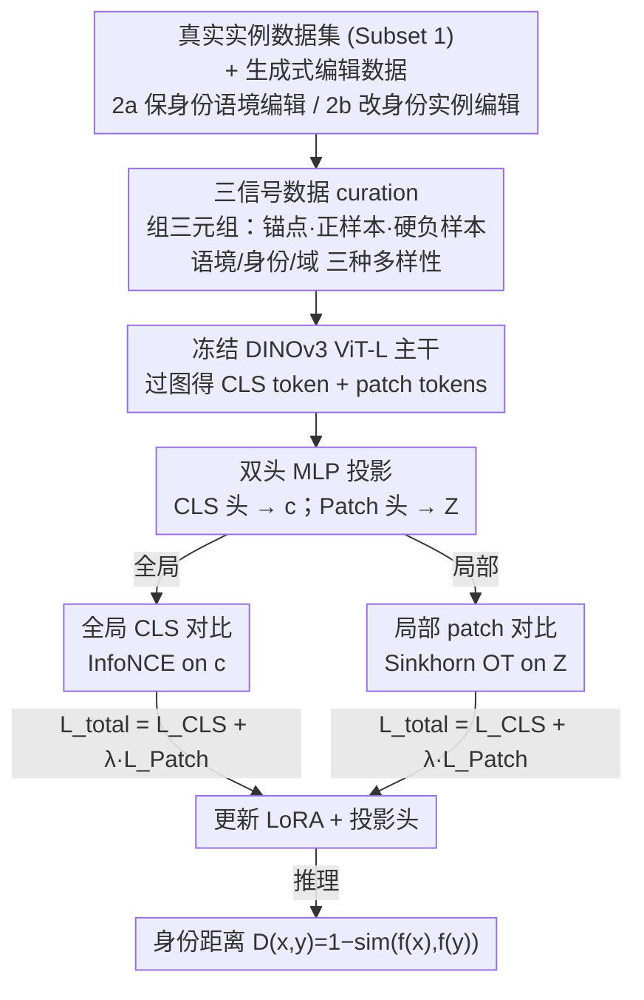

# ID-Sim: An Identity-Focused Similarity Metric

**会议**: CVPR 2026  
**论文**: [CVF Open Access](https://openaccess.thecvf.com/content/CVPR2026/html/Chae_ID-Sim_An_Identity-Focused_Similarity_Metric_CVPR_2026_paper.html)  
**代码**: 待确认（论文称有 project page，链接未在正文给出）  
**领域**: 感知相似度度量 / 身份识别  
**关键词**: 感知度量, 身份相似度, 选择性敏感, 对比学习, DINOv3

## 一句话总结
本文提出 ID-Sim——一个前馈式、专门衡量"身份一致性"的感知度量，它模仿人类的"选择性敏感"（对背景/姿态/光照等语境变化不敏感、却对细微的身份变化敏感）：在冻结的 DINOv3 ViT-L 上用真实+合成编辑数据训练 LoRA 与双头 MLP，配合全局 CLS 对比 + 局部 patch 最优传输对比双目标，在 7 个数据集、49 个评测设置里有 48 个超过现有度量，且用的标注数据少 100× 多、主干更小。

## 研究背景与动机
**领域现状**：感知度量的每次进步都推动了视觉研究——从信号层的 PSNR/SSIM 到学习型的 LPIPS、DISTS、DreamSim，让"图像相似度"越来越贴近人类判断。但这些度量优化的都是**外观相似度**，而不是**身份一致性**。

**现有痛点**：人类有一种"选择性敏感（selective sensitivity）"——既能跨视角/光照/姿态认出同一个体，又能对改变身份的细微差异保持高度警觉。视觉模型却很难兼顾这两端：① 通用感知度量（LPIPS/DreamSim）会被无关的语境变化（背景、光照）干扰，把"同一物体换姿态"和"两个相似但不同的物体"混为一谈；② 基础模型（DINOv3/CLIP）在中等变换下就认不出同一物体，或被背景这种表面特征误导；③ 专用系统（Re-ID、实例检索、个性化评测）只在窄域里管用，跨域就失效，且优化的是"判别间隔最大化"而非"对齐人类相似度判断"。

**核心矛盾**：身份聚焦类任务（尤其是个性化/主体驱动生成的评测）缺一个**通用、跨域、与人类判断对齐**的身份一致性度量。现有方法要么只测外观、要么只在单一域内判别，没有一个能稳定回答"某个变换究竟是保住了身份、还是改变了身份"。

**本文目标**：造一个前馈、确定性、跨域通用的身份度量，让"同一身份的多样外观聚得紧、不同身份分得开"，并与人类标注高度一致；同时给身份感知建一套统一基准来衡量进展。

**切入角度**：作者先给"视觉身份（一个物体内在视觉属性的唯一集合：形状/纹理/颜色）"和"实例（共享同一视觉身份的物体）"下了明确定义，把模糊的"identity/instance"收敛成可操作的判据；再发现没有现成数据同时提供"语境多样、身份多样、域多样"三种信号，于是用真实实例数据 + 生成式编辑来补齐。

**核心 idea**：用"真实实例 + 生成式可控编辑"curate 出带选择性敏感信号的三元组训练数据，在强基础模型上用**全局+局部双对比**目标轻量微调，得到一个专测身份一致性的感知度量。

## 方法详解

### 整体框架
ID-Sim 的流程分两段：**数据 curation** 与 **度量训练**。数据侧把真实实例数据集（Subset 1）和两类生成式编辑数据（Subset 2a 保身份的语境编辑、Subset 2b 改身份的实例编辑）拼成三元组 $(x_0, x^+, \{x_i^-\})$——锚点与正样本是同一实例的两张图，硬负样本来自"改身份编辑"或"DINOv3 近邻挖到的真实近似实例"，其余负样本取自同 batch 的其他实例。训练侧把每张图过冻结的 ViT 主干 $f_\theta$ 得到全局 CLS token $c'$ 和 patch tokens $Z'$，再用双头 MLP 分别投影到两个嵌入空间，用全局 CLS 对比损失 + 局部 patch 对比损失联合优化（只训 LoRA + 投影头）。推理时直接用 $D(x,y)=1-\mathrm{sim}(f_\theta(x), f_\theta(y))$ 算两图的身份距离。

### 关键设计

**1. 三信号数据 curation：用真实+生成式编辑同时灌入语境/身份/域三种多样性**

针对"没有现成数据能同时支撑不变性与判别性"的痛点。作者把训练需要的信号拆成三类——语境多样性（支撑对背景/光照/视角的不变性）、视觉身份多样性（支撑对细微外观差异的敏感）、域多样性（支撑跨类别泛化），并指出没有任一现成数据集三者齐备。于是 curation 分两路：Subset 1 汇总 7 个真实实例级数据集（ILIAS/FORB/MET/GLDv2/Dogs/Cats/DF2，涵盖地标、平面物体、艺术品、动物、时尚）；Subset 2 用生成式编辑扩充——2a 对视频数据集（UCO3D/LASOT/YouTubeVIS/GOT10k）做**保身份的语境编辑**得到"语境多样的正样本对"，2b 做**改身份的实例编辑**得到"细粒度负样本"。最终训练集是 10k 三元组（约 30k 图、约 1 万实例、10 个数据集），并刻意做**三等分**：纯真实三元组 / 生成保身份正样本+真实负样本 / 真实正样本+改身份负样本。消融显示这套"平衡 + 过滤 + 编辑"的组合直接把验证分从 0.693 拉到 0.965，是 ID-Sim 表现的根基——正向编辑提升类内一致性、改身份编辑锐化类间判别。

**2. 全局+局部双对比目标：CLS 管整体语义、patch 用最优传输管细粒度对应**

针对"只看全局 token 会丢掉密集/局部判别线索"的问题。作者在监督对比框架下用联合目标 $\mathcal{L}_{\text{total}}=\mathcal{L}_{\text{CLS}}+\lambda\,\mathcal{L}_{\text{Patch}}$。全局项是投影后 CLS token 上的标准 InfoNCE：$\mathcal{L}_{\text{CLS}}=-\log \frac{e^{s^+}}{e^{s^+}+\sum_{i=1}^N e^{s_i^-}}$，其中 $s^+=\mathrm{sim}(c_0,c^+)/\tau$、$s_i^-=\mathrm{sim}(c_0,c_i^-)/\tau$，$\mathrm{sim}$ 是余弦相似度。局部项的关键洞察是：跨视角/语境时 patch 的空间布局会错位，逐位置比对不可靠，于是把两图的 patch tokens 当成**无序的局部描述子集合**，用软对齐衡量相似——具体定义为负的熵正则最优传输（OT）距离 $\mathrm{sim}_{\text{patch}}(A,B)=-S_\varepsilon(A,B)$，$S_\varepsilon$ 是用 GeomLoss 在 patch 上以均匀权重算的 Sinkhorn 距离，再把它代回 InfoNCE 得到 $\mathcal{L}_{\text{Patch}}$。与 DenseCL 用同一图增广视图建硬最近邻对应不同，这里是**跨同一实例的不同图**、通过一个软全局 OT plan 隐式学对应，因此能容忍真实的姿态/语境位移。Table 2b 显示 patch 监督把相对 DINOv3 的提升从 13%（仅 CLS）放大到 40%。

**3. 冻结强主干 + LoRA + 双头投影的轻量微调：用极少标注撬动跨域身份对齐**

针对"专用 Re-ID/检索模型要海量域内细标注、还不跨域"的痛点。作者选 DINOv3 ViT-L @ 448×448 作主干 $f_\theta$（在验证集上实例级表现最强），**冻结主干**，只微调两样东西：注意力与前馈层上 rank-16 的 LoRA 适配器、以及轻量 2 层双头 MLP 投影头 $c=\mathrm{MLP}_{\text{CLS}}(c')$、$Z=\mathrm{MLP}_{\text{Patch}}(z')$。硬负样本的来源也很省力——要么取 Subset 2b 的改身份编辑，要么在预训练 DINOv3 嵌入空间用最近邻挖"长得像但不同"的真实实例。这种设计让 ID-Sim 用比检索 SOTA（Universal Embedding，ViT-H + 百万级细标注）少约 100× 的标注、更小的主干，反而拿到更好的跨域综合表现，说明收益来自"身份聚焦的数据 + 双对比目标"而非堆参数堆标注。

## 实验关键数据

主干 DINOv3 ViT-L @ 448，冻结主干只训 LoRA(rank 16)+双头 MLP。对比 7 个 baseline（感知度量 DreamSim/LPIPS/DiffSim、基础模型 DINOv3/CLIP/OpenCLIP、检索模型 Universal Embedding[ViT-H]），在 7 个与训练集不相交的数据集、3 类任务（实例检索、概念保持、Re-ID）上评测。**49 个评测设置中 ID-Sim 赢 48 个**，所有 ViT 方法默认用全局 CLS token 算相似度。

### 主实验（与 MLLM 对比概念保持，Table 2a）

| 方法 | 模型 | SUBJECTS2K (AP) | DreamBench++ |
|------|------|-----------------|--------------|
| **ID-Sim（本文）** | ViT-L | **0.4063** | 0.697 |
| GPT-4o（原 prompt） | GPT-4o | 0.2901 | 0.748 |
| GPT-5（受控 prompt） | GPT-5 | 0.3159 | 0.3554 |
| Gemini（受控 prompt） | Gemini | 0.3354 | 0.70 |

在更细粒度的 SUBJECTS2K 上 ID-Sim 超过所有 MLLM；DreamBench++ 上 MLLM 略高但对 prompt 极敏感（GPT-5 换成受控身份保持 prompt 后从 ~0.7 暴跌到 0.3554），而 ID-Sim 是确定性前馈、跨评测稳定且算力开销低得多。其中 SUBJECTS2K 是作者新标注的基准：对 Subjects200k 的子集补了 2k 条人工二元（同/异实例）标注以替代噪声较大的 GPT-4v 标签。

### Patch 级嵌入跨任务对比（Table 2b，含 patch 监督消融）

| 数据集 | 指标 | DINOv3 | Ours（无 patch 监督） | Ours（完整） |
|--------|------|--------|----------------------|--------------|
| DeepFashion2 | mAP | 0.4071 | 0.4765 | **0.7967** |
| AerialCattle2017 | mAP | 0.4516 | 0.5471 | **0.6245** |
| CUTE | Acc | 0.6561 | 0.6439 | **0.8189** |
| DreamBench++ | Spearman | 0.5479 | 0.5913 | **0.6834** |
| PetFace | mAP | 0.7849 | 0.8377 | **0.8446** |
| PODS | mAP | 0.5825 | **0.8181** | 0.7907 |
| SUBJECTS2K | AP | 0.2314 | 0.2348 | **0.3674** |

仅 CLS 监督已比 DINOv3 平均提升约 13%，加上显式 patch 监督放大到 40% 相对提升；唯一例外是 PODS，无 patch 监督版略高（0.8181 vs 0.7907）。

### 消融实验（数据组成与编辑策略，Table 3）

| 配置 | 平衡 | 过滤 | 正样本编辑 | 负样本编辑 | 比例 | 验证分 |
|------|------|------|-----------|-----------|------|--------|
| 全部数据 | ✗ | ✗ | ✗ | ✗ | – | 0.693 |
| 全部数据 | ✓ | ✗ | ✗ | ✗ | – | 0.752 |
| 过滤后 | ✓ | ✓ | ✗ | ✗ | – | 0.890 |
| 过滤后 | ✓ | ✓ | ✓ | ✗ | 1:1 | 0.937 |
| 过滤后 | ✓ | ✓ | ✓ | ✓ | 1:1:1 | **0.965** |

### 个性化分割迁移（PerSAM on PODS，Table 2c）

| 方法 | mAP | F1 |
|------|-----|----|
| PerSAM + DINOv3 | 0.153 | 0.18 |
| PerSAM + Ours（无 patch 监督） | 0.214 | 0.235 |
| PerSAM + Ours（完整） | **0.436** | **0.409** |

### 关键发现
- **数据质量与平衡比堆量更重要**：平衡正负样本 + 过滤噪声实例把验证分从 0.693 推到 0.890，再加生成式正/负编辑推到 0.965——正向编辑提类内一致性、改身份负样本锐化类间判别。
- **patch 监督是细粒度任务的放大器**：仅 CLS 已超 DINOv3 13%，显式 patch 对比把提升放大到 40%，并让 ID-Sim 的局部特征能直接插进 PerSAM，把分割 mAP 从 0.153 拉到 0.436。
- **最强收益出现在"跨语境识别"与"细微身份判别"两端**：在 PODS、DeepFashion2 这类正样本明确换了语境的数据上，相对第二/第三名分别 +0.11、+0.30 mAP；在细粒度的 SUBJECTS2K 上比次优 +0.05 mAP。
- **敏感度分析印证选择性敏感**：在 identity/background/viewpoint/lighting 四维度上，ID-Sim 取得"高身份敏感 + 低语境敏感"的最佳平衡——身份变化时相似度下降最大、语境变化时最稳；而 CLIP/OpenCLIP/LPIPS 身份敏感度最弱（更像测语义/图像级相似），DINOv3/Universal Embedding 对视角光照不变但对背景敏感。

## 亮点与洞察
- **"选择性敏感"这个问题定义本身就是贡献**：把模糊的 identity/instance 收敛成"内在视觉属性唯一集合"的可操作判据，并据此把训练信号拆成语境/身份/域三类去 curate 数据——这个拆解思路可迁移到任何"要兼顾不变性与判别性"的度量学习。
- **用 Sinkhorn OT 做 patch 软对齐很巧**：把"跨语境时空间错位导致逐位置比对失效"这个真实痛点，转成"无序局部描述子集合的最优传输距离"，既保留细粒度局部线索又容忍姿态/视角位移，且能直接迁移到分割等密集任务。
- **生成式编辑当可控数据增广**：保身份编辑造正样本、改身份编辑造硬负样本，给度量学习提供了真实数据难以采集的"细粒度可控变化"，是这篇把验证分推到 0.965 的关键。
- **少标注小主干反超大模型**：用比检索 SOTA 少约 100× 标注、ViT-L vs ViT-H，仍综合最优，说明"身份聚焦的数据与目标"比单纯堆规模更对路。

## 局限与展望
- **训练高度依赖生成式编辑质量**：保身份/改身份编辑由扩散/编辑模型（Qwen-Edit、Flux 等）生成，编辑失真或身份泄漏会直接污染监督信号；论文未定量评估编辑错误率对度量的影响。⚠️ 编辑管线细节在补充材料，正文未展开。
- **代码/项目页缺失**：正文写"Our project page id here"但未给出实际链接，可复现性待确认。⚠️ 以原文/项目页为准。
- **基准仍以静态图为主**：虽用了视频数据集做编辑源，但身份一致性的时序维度（同一实例长时间演化）只在"猫长成大猫"这类定义层面提及，未系统评测。
- **PODS 上 patch 监督反而略降**（0.8181→0.7907），说明 patch 对比并非对所有域都正向，何时该开 patch 监督缺乏判据。
- **依赖冻结的 DINOv3 主干**：度量上限部分受限于主干的实例级表征，若主干在某域弱，LoRA 微调能否补足未充分验证。

## 相关工作与启发
- **vs LPIPS / DreamSim / DISTS（感知度量）**：它们优化整体外观相似度，会被背景/光照等无关语境干扰；ID-Sim 显式以"选择性敏感"为目标，对语境不变、对身份敏感。DreamSim 因人类对齐目标在 DreamBench++ 上仍最强，但跨身份判别上不如 ID-Sim。
- **vs DINOv3 / CLIP / OpenCLIP（基础模型）**：基础模型在光照变化下的身份相似尚可（CUTE/PetFace），但背景变化、检索任务上掉点；ID-Sim 用身份聚焦数据 + 双对比把这两类弱项一起补上，patch 级还显著优于 DINOv3。
- **vs Universal Embedding（检索 SOTA）**：UNED 第一名靠 ViT-H + 百万级实例/细粒度标注，是综合次优；ID-Sim 用更小主干、少约 100× 标注反超，且把"实例检索"扩展到检索/概念保持/Re-ID 三类任务统一对齐。
- **vs DenseCL（密集对比）**：DenseCL 在同一图增广视图间建硬最近邻对应；ID-Sim 的 patch OT 在"同实例不同图"间用软全局传输隐式学对应，更适配真实语境位移。
- **vs PerSAM 等个性化分割**：PerSAM 追求像素级 mask；ID-Sim 不直接做分割，但其 patch 特征能即插即用地把 PerSAM 的 mAP 从 0.153 提到 0.436，体现身份度量对下游定位的价值。

## 评分
- 新颖性: ⭐⭐⭐⭐ "选择性敏感"问题定义 + 真实/生成编辑数据 + 全局-局部双对比组合新颖，但单个组件（LoRA、InfoNCE、Sinkhorn OT）均为已知部件的巧妙组装。
- 实验充分度: ⭐⭐⭐⭐⭐ 7 baseline × 7 数据集 × 3 类任务、49 设置、MLLM 对比、patch 消融、数据组成消融、四维敏感度分析与下游分割迁移，覆盖很全。
- 写作质量: ⭐⭐⭐⭐ 定义—数据—方法—实验逻辑清晰、动机讲透；项目页链接缺失、部分编辑细节压在补充材料。
- 价值: ⭐⭐⭐⭐⭐ 填补了"通用跨域身份一致性度量"的空白，并配套 SUBJECTS2K 基准，对个性化生成评测等身份聚焦任务有直接推动作用。

<!-- RELATED:START -->

## 相关论文

- [\[CVPR 2026\] Convolutional Neural Networks Driven by Content Similarity](convolutional_neural_networks_driven_by_content_similarity.md)
- [\[CVPR 2026\] Beyond Global Similarity: Multi-Conditional Retrieval for Fine-Grained Cross-Modal Understanding](beyond_global_similarity_multi-conditional_retrieval_for_fine-grained_cross-moda.md)
- [\[AAAI 2026\] From Sequential to Recursive: Enhancing Decision-Focused Learning with Bidirectional Feedback](../../AAAI2026/others/from_sequential_to_recursive_enhancing_decision-focused_learning_with_bidirectio.md)
- [\[ICLR 2026\] Deterministic Bounds and Random Estimates of Metric Tensors on Neuromanifolds](../../ICLR2026/others/deterministic_bounds_and_random_estimates_of_metric_tensors_on_neuromanifolds.md)
- [\[CVPR 2025\] Potential Field Based Deep Metric Learning](../../CVPR2025/others/potential_field_based_deep_metric_learning.md)

<!-- RELATED:END -->
