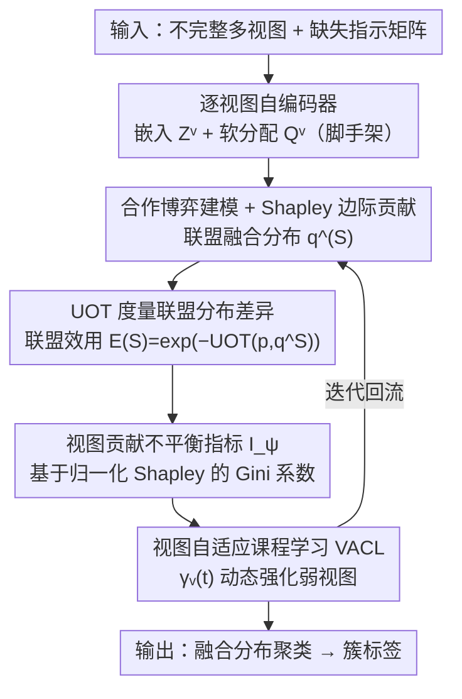

# Imbalanced View Contribution Evaluation and Refinement for Deep Incomplete Multi-View Clustering

**会议**: CVPR 2026  
**论文**: [CVF Open Access](https://openaccess.thecvf.com/content/CVPR2026/html/Zhou_Imbalanced_View_Contribution_Evaluation_and_Refinement_for_Deep_Incomplete_Multi-View_CVPR_2026_paper.html)  
**代码**: https://github.com/Evelyn-zhou24/ICER （有）  
**领域**: 多视图聚类 / 不完整多视图 / 表示学习  
**关键词**: 不完整多视图聚类, 视图贡献不平衡, Shapley值, 不平衡最优传输, 课程学习

## 一句话总结
ICER 指出"视图缺失不只是数据不全、更会引发视图贡献不平衡"这一被忽视的问题：用 Shapley 值量化每个视图的边际贡献、用不平衡最优传输（UOT）刻画分布偏差，构造视图贡献不平衡指标 $I_\psi$，再用视图自适应课程学习（VACL）动态强化弱视图、抑制强视图主导，在五个不完整多视图基准上稳定超过现有方法。

## 研究背景与动机
**领域现状**：多视图数据融合多个传感器/异构源的互补信息，在分类、聚类、检索中价值显著。但现实中视图常因隐私保护、传感器故障、传输错误而缺失，形成不完整多视图数据。传统不完整多视图聚类（IMVC）基于矩阵分解、核学习、图学习、子空间学习；近年深度 IMVC（DIMVC）用非线性表示学习取得明显提升，成为热点。

**现有痛点**：绝大多数已有方法（无论传统还是深度）都**隐式假设融合时所有视图贡献相等**。但缺失的随机性和不平衡会让各视图在"可观测性"和"特征质量"上产生显著差异——某些"强视图"主导融合、某些"弱视图"贡献边缘化，导致局部特征被压制、跨视图关系被扭曲，最终训练不稳、聚类退化。

**核心矛盾**：缺失本质上不只是数据不完整问题，而是**引发跨视图协作不平衡的根本机制**。忽视这种缺失诱发的不平衡，会高估强视图、低估弱视图。

**本文目标**：拆成两个科学问题——(1) 在不平衡缺失下如何**量化每个视图的边际贡献**？异构的观测比例和特征质量使得难以建立统一可比的协作贡献度量；(2) 如何**基于评估自适应增强跨视图协作**，调节强弱视图影响，缓解主导与参与不足？

**切入角度**：把不完整多视图聚类建模为**无监督合作博弈**，每个视图是一个 player——这样就能借合作博弈论的 Shapley 值对"联盟效用"做公平分配，给出跨视图可比的贡献度量。

**核心 idea**：用 Shapley 值 + 不平衡最优传输评估视图贡献不平衡，再用视图自适应课程学习显式强化弱视图，实现协作层面的自适应优化。

## 方法详解

### 整体框架
ICER 输入是不完整多视图数据集 $\{X^v\in\mathbb{R}^{N\times d_v}\}_{v=1}^V$ 及指示缺失的指示矩阵 $A=[a_i^v]$（$a_i^v=0$ 表示第 $i$ 样本在第 $v$ 视图缺失）。整条流程为：每个视图先用一个自编码器学习聚类友好的嵌入 $Z^v$（脚手架级特征学习），并产生软聚类分配 $Q^v$；然后进入两大核心模块——**视图贡献评估模块**把各视图视为合作博弈 player，基于 UOT 度量"联盟融合分布 $q^{(S)}$ 与理想全局分布 $p$ 的差异"得到联盟效用 $E(S)$，再算每个视图的 Shapley 值 $\phi_v$ 及归一化贡献 $\psi_v$，并据此定义全局不平衡指标 $I_\psi$；**贡献均衡增强模块**把评估结果当先验，通过视图自适应课程学习（VACL）动态调整各视图的优化步调、强化弱视图。两个模块在训练中迭代交替，最终在融合表示空间上做聚类，输出簇标签。

### 关键设计

**1. 把不完整多视图聚类建模为合作博弈，用 Shapley 值量化视图边际贡献**

针对"如何统一可比地度量各视图贡献"的痛点，作者把每个视图当作合作博弈的 player，任意视图子集 $S\subseteq\{1,\dots,V\}$ 构成联盟，对应一个融合聚类分布 $q^{(S)}$。第 $i$ 样本在联盟 $S$ 下的融合分配 $q_{ij}^{(S)}$ 只聚合**实际可见**视图的信息（用 $a_i^v$ 屏蔽缺失项），并通过可学习权重 $\kappa_j^v$（由参数矩阵 $W$ softmax 归一化）加权。空联盟 $S=\varnothing$ 时退化为均匀先验 $Q^{(\varnothing)}=\frac{1}{K}\mathbf{1}_{N\times K}$。第 $v$ 视图的 Shapley 值定义为

$$\phi_v=\sum_{S\subseteq V\setminus\{v\}}\frac{|S|!\,(V-|S|-1)!}{V!}\big[E(S\cup\{v\})-E(S)\big],$$

即该视图加入各种联盟带来的平均效用增量。再归一化为 $\psi_v=\phi_v/\sum_i\phi_i$ 表示相对贡献占比。这给了跨视图、缺失感知的可比贡献度量，是后续评估和增强的基础。

**2. 用不平衡最优传输（UOT）度量联盟分布偏差，定义联盟效用**

Shapley 值依赖一个"联盟好不好"的效用函数。作者把自蒸馏、锐化后的融合分布 $p$（$p_{ij}=q_{ij}^2/\sum_j q_{ij}^2$）当作理想全局聚类结构，联盟分布 $q^{(S)}$ 越接近 $p$、该联盟对重建完整聚类模式的贡献越大。但缺失会造成样本量/质量不匹配，普通 OT 的质量守恒约束不适用，于是用 **KL 松弛边际**的不平衡最优传输：

$$\text{UOT}(p,q^{(S)})=\min_{\pi\geq0}\big\{\langle G_{kl},\pi_{kl}\rangle+\text{KL}(\pi\mathbf{1}\,\|\,p)+\text{KL}(\pi^\top\mathbf{1}\,\|\,q^{(S)})\big\},$$

其中 $G_{k\ell}=\|u_k-u_\ell\|_2^2$ 是簇质心间的传输代价。KL 惩罚允许质量不守恒，自然容纳缺失诱发的不确定性。据此联盟效用定义为 $E(S)=\exp(-\text{UOT}(p,q^{(S)}))$——传输距离越小、效用越大。此外引入跨视图一致性损失 $L_{ccl}=\frac{1}{N}\sum_v\sum_i a_i^v\,\text{UOT}(q_i^{(v)},q_i^{(S)})$ 让每个可见视图向共识语义靠拢。

**3. 视图贡献不平衡指标 $I_\psi$：用 Gini 系数量化"谁在主导"**

有了归一化 Shapley 向量 $\psi=(\psi_1,\dots,\psi_V)$，作者借鉴 Gini 系数定义全局不平衡指标

$$I_\psi=\frac{1}{2V^2\bar\psi}\sum_{i=1}^V\sum_{j=1}^V|\psi_i-\psi_j|,\qquad \bar\psi=\frac{1}{V}\sum_v\psi_v.$$

$I_\psi$ 越小、贡献越均衡；越大则少数视图主导。论文进一步给出有界性定理：在合理假设下 $I_\psi\in[0,1-\frac{1}{V}]$，下界 0 当且仅当所有 $\psi_v=\frac{1}{V}$（完全均衡），上界 $1-\frac{1}{V}$ 对应一个视图 $\psi_v=1$ 其余为 0 的极端主导。这个指标既是诊断不平衡的可量化探针，也是后续增强策略的优化信号。

**4. 视图自适应课程学习（VACL）：动态强化弱视图、抑制强视图主导**

针对"如何基于评估增强协作"的痛点，作者发现若统一优化，模型早期会过拟合少数高贡献视图、弱视图因表示不稳和噪声梯度被埋没。于是设计 VACL：用课程因子调制各视图的优化权重

$$\gamma_v(t)=\frac{t}{T_c}\big[(1-\psi_v)^2+\varepsilon\big],$$

其中 $T_c$ 是课程周期（约总 epoch 的 30%），时间项 $t/T_c$ 随训练线性增长实现渐进课程，平方项 $(1-\psi_v)^2$ **专门放大弱视图**（$\psi_v$ 小者权重大）。联合目标 $L_t=\sum_v\gamma_v(t)L^{(v)}(\theta_t^{(v)})$，参数按 $\theta_{t+1}^{(v)}=\theta_t^{(v)}-\eta\,\gamma_v(t)\nabla L^{(v)}$ 更新——弱视图保持低 $\psi_v$ 时其 $\gamma_v(t)$ 增大、梯度响应被放大，从而从"强视图主导"平滑过渡到"均衡多视图协作"。论文称该因子平滑、有界、单调，保证 Lipschitz 稳定。

### 损失函数 / 训练策略
总目标由三部分组成：视图内重建损失 $L_{rec}=\sum_v\sum_i a_i^v\|x_i^v-D_v(E_v(x_i^v))\|_2^2$、跨视图语义一致性损失 $L_{ccl}$、以及聚类损失 $L_c=\text{KL}(P\|Q)$（$P$ 由 $Q$ 锐化得到）：

$$L=L_{rec}+\lambda_1 L_{ccl}+\lambda_2 L_c.$$

训练分两阶段（预训练 100 epoch + 主训练 300 epoch，batch 256，Adam，RTX 3090），VACL 在主训练阶段把 Shapley 贡献当先验逐步介入。

## 实验关键数据

评测指标：**ACC**（聚类准确率）、**NMI**（归一化互信息）、**ARI**（调整兰德指数），均越高越好。自定义指标 **$I_\psi$**（视图贡献不平衡指数，越小越均衡）。五个基准：Synthetic3d / Reuters / Caltech101 / Wikipedia / Animal，覆盖 2~6 视图、600~10158 样本。缺失模拟：给定平均缺失率 $r\in\{0.1,\dots,0.5\}$，每视图随机采样缺失因子 $\alpha_v$（约束 $\sum_v\alpha_v=V$），视图缺失率 $r_v=\alpha_v\times r$，保证每样本至少在一个视图可见。

### 主实验
与 7 个 SOTA（CPSPAN、RPCIC、GHICMC、PMIMC、FREECSL、NBIMVC、BURG）对比，节选 ACC（不同缺失率）：

| 数据集 | 缺失率 | 最强基线 (ACC) | ICER (ACC) | 提升 |
|--------|--------|----------------|------------|------|
| Synthetic3d | r=0.1 | 0.9600 (GHICMC) | **0.9650** | +0.0050 |
| Caltech101 | r=0.2 | 0.4556 (BURG) | **0.6221** | +0.1665 |
| Caltech101 | r=0.2 (NMI) | 0.2264 (CPSPAN) | **0.4727** | +0.2463 |
| Animal | r=0.1 | 0.6117 (CPSPAN) | **0.6240** | +0.0123 |
| Reuters | r=0.5 | 0.3267 (NBIMVC) | **0.3625** | +0.0358 |
| Wikipedia | r=0.5 | 0.3829 (BURG) | **0.4546** | +0.0717 |
| Animal | r=0.5 | 0.4502 (GHICMC) | **0.4628** | +0.0126 |

ICER 在 Caltech101 和 Animal 上跨所有缺失率与指标都最优，在 Reuters/Synthetic3d/Wikipedia 上也整体领先；高缺失率（r=0.5）下仍是最佳，体现对不平衡缺失的鲁棒性。

### 消融实验
损失组件消融（Table 3，缺失率 0.3）：

| 数据集 | $L_{rec}$ | $L_{ccl}$ | $L_c$ | ACC | NMI | ARI |
|--------|:--:|:--:|:--:|------|------|------|
| Synthetic3d | ✓ | | | 0.4283 | 0.0563 | 0.0296 |
| Synthetic3d | ✓ | ✓ | | 0.3350 | 0.0111 | 0.0007 |
| Synthetic3d | ✓ | | ✓ | 0.7433 | 0.5470 | 0.4789 |
| Synthetic3d | ✓ | ✓ | ✓ | **0.9133** | **0.7182** | **0.7616** |
| Caltech101 | ✓ | ✓ | ✓ | **0.5109** | **0.4377** | **0.3548** |
| Animal | ✓ | ✓ | ✓ | **0.5471** | **0.6373** | **0.4088** |

VACL 消融（Table 4，缺失率 0.5）：

| 数据集 | 配置 | ACC | $I_\psi$ |
|--------|------|------|----------|
| Wikipedia | 带 VACL | **0.4546** | **0.0020** |
| Wikipedia | 去 VACL | 0.3699 | 0.2700 |
| Caltech101 | 带 VACL | **0.4288** | **0.0148** |
| Caltech101 | 去 VACL | 0.4072 | 0.0225 |
| Animal | 带 VACL | **0.4628** | **0.0490** |
| Animal | 去 VACL | 0.4339 | 0.0681 |

### 关键发现
- **三损失互补、聚类损失 $L_c$ 是主力**：只有 $L_{rec}$ 时最弱（Synthetic3d ACC 0.4283）；单加 $L_{ccl}$ 反而掉（0.3350，⚠️ 原文称加 $L_{ccl}$ 提升语义对齐，但该行数字单独看是下降，可能指需配合 $L_c$ 才生效，以原文为准）；加 $L_c$ 后 ACC 跳到 0.7433，三者全开达 0.9133。
- **VACL 直接压低不平衡指标**：去掉 VACL 后 $I_\psi$ 在所有数据集显著上升（Wikipedia 从 0.0020 飙到 0.2700），说明少数视图开始主导；加回 VACL 后 $I_\psi$ 大降、ACC 一致提升，证明它确实把贡献分布拉均匀。
- **对超参不敏感**：$\lambda_1,\lambda_2$ 在 $\{0.001,\dots,100\}$ 范围内聚类性能波动很小，鲁棒性好。
- **高缺失率下优势更明显**：Wikipedia r=0.5 时 ICER 仍达 0.4546，而多个深度基线随不平衡加剧明显退化。

## 亮点与洞察
- **重新框定问题**：把"视图缺失"从单纯的数据补全问题，升维成"跨视图协作不平衡"问题，并首次系统分析这种不平衡如何影响聚类——这个视角转换本身就是贡献。
- **博弈论 + 最优传输的组合很自洽**：Shapley 值天然适合"公平分配联盟价值"，UOT 的质量不守恒特性恰好对应缺失造成的样本量不匹配，两者拼起来给出缺失感知的可比贡献度量，理论上还证了 $I_\psi$ 的有界性。
- **课程因子设计巧妙**：$\gamma_v(t)=\frac{t}{T_c}[(1-\psi_v)^2+\varepsilon]$ 用一个标量同时编码"训练进度"和"视图弱势程度"，平方项放大弱视图、时间项渐进介入，简单却能把"强视图主导→均衡协作"平滑过渡。
- **$I_\psi$ 指标可迁移**：用归一化 Shapley 的 Gini 系数度量"贡献不平衡"，这套思路可迁移到任何多模态/多源融合场景做诊断与正则。

## 局限与展望
- Shapley 值精确计算需枚举所有视图子集，复杂度随视图数 $V$ 指数增长；论文实验视图数最多 6，⚠️ 对视图数很多的场景如何近似计算正文未明确讨论。
- $L_{ccl}$ 单独使用时在 Synthetic3d 上反而掉点，说明各损失耦合较强、消融解释略含糊，三者协同的机理还可更深入。
- 缺失模拟是人工合成（随机 $\alpha_v$），与真实世界缺失模式是否一致存疑；真实缺失往往有结构性（某传感器整段失效），是否还适用待验证。
- VACL 课程周期 $T_c$ 固定为 30% epoch，这一选择的敏感性未给出。
- 方法整体仍是"先评估再增强"的两阶段迭代，评估与增强的交替频率、收敛性正文论述有限。

## 相关工作与启发
- **vs 传统 IMVC（矩阵分解/核/图学习）**：它们靠零/均值填充缺失再做浅层学习，把缺失当同质噪声、忽略各视图缺失模式差异；ICER 用深度非线性表示 + 显式建模视图贡献不平衡，避开了线性假设和"贡献相等"假设。
- **vs 深度 IMVC（分布对齐/GAN 生成/对比恢复）**：如 CPSPAN、NBIMVC、BURG 等在重建数据后仍假设视图贡献相等，无法应对非均匀缺失诱发的不平衡；ICER 在 Caltech101 r=0.2 把 ACC 从 0.4556 提到 0.6221，正是补上了这块短板。
- **vs 不平衡多视图学习（自适应加权/注意力/博弈协作）**：已有工作用注意力抑制噪声视图或对比优化缓解信息不平衡，Wang 等从博弈视角评估视图协作价值；ICER 进一步**联合建模缺失与贡献不平衡**，用 Shapley + UOT + 课程学习给出统一框架，而非只做加权。

## 评分
- 新颖性: ⭐⭐⭐⭐⭐ 首次把"缺失诱发的视图贡献不平衡"作为核心问题，并用博弈论+UOT+课程学习统一求解。
- 实验充分度: ⭐⭐⭐⭐ 五数据集×五缺失率×七基线全面对比，消融含损失与 VACL，但缺失为合成、视图数偏少。
- 写作质量: ⭐⭐⭐⭐ 问题分解清晰、理论给了有界性定理，但损失消融的解释（$L_{ccl}$ 单用掉点）略含糊。
- 价值: ⭐⭐⭐⭐ 指出并缓解了被忽视的协作不平衡，$I_\psi$ 与 VACL 对多源融合有借鉴意义。

<!-- RELATED:START -->

## 相关论文

- [\[AAAI 2026\] Deep Incomplete Multi-View Clustering via Hierarchical Imputation and Alignment](../../AAAI2026/others/deep_incomplete_multi-view_clustering_via_hierarchical_imputation_and_alignment.md)
- [\[CVPR 2026\] Plug-and-Play Incomplete Multi-View Clustering via Janus-Faced Affinity Learning with Topology Harmonization](plug-and-play_incomplete_multi-view_clustering_via_janus-faced_affinity_learning.md)
- [\[CVPR 2026\] Cross-View Distillation and Adaptive Masking for Incomplete Multi-View Multi-Label Classification](cross-view_distillation_and_adaptive_masking_for_incomplete_multi-view_multi-lab.md)
- [\[CVPR 2026\] Anti-Degradation Lifelong Multi-View Clustering](anti-degradation_lifelong_multi-view_clustering.md)
- [\[CVPR 2026\] Reliable Clustering Number Estimation for Contrastive Multi-View Clustering](reliable_clustering_number_estimation_for_contrastive_multi-view_clustering.md)

<!-- RELATED:END -->
