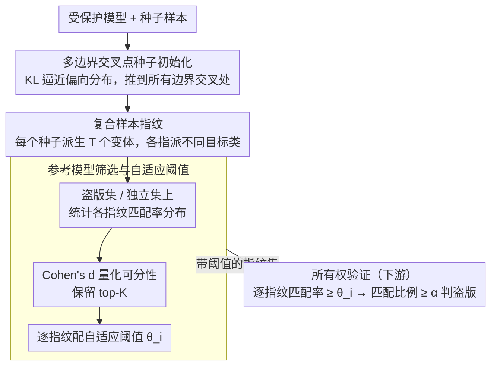

# IrisFP: Adversarial-Example-based Model Fingerprinting with Enhanced Uniqueness and Robustness

**会议**: CVPR 2026  
**arXiv**: [2603.24996](https://arxiv.org/abs/2603.24996)  
**代码**: 无  
**领域**: 其他  
**关键词**: 模型指纹, 对抗样本, 知识产权保护, 所有权验证, 决策边界

## 一句话总结

提出IrisFP模型指纹框架，通过将指纹放置在多类决策边界交叉点处、构建复合样本指纹、以及基于统计可分性的指纹筛选三项创新，同时增强指纹的唯一性和鲁棒性，在5个数据集上AUC一致超过SOTA方法。

## 研究背景与动机

基于对抗样本的模型指纹技术通过向干净输入添加微小扰动来引出模型特定的响应行为，用于DNN的知识产权保护和所有权验证。现有方法面临**唯一性与鲁棒性之间的根本冲突**：

- **唯一性问题**：指纹需要靠近决策边界以捕获模型特定行为，但现有方法只针对单一边界，导致区分力不足
- **鲁棒性问题**：模型修改攻击（微调、剪枝、对抗训练等）会移动决策边界，使指纹失效。为增强鲁棒性，先前方法将指纹放在目标类区域深处，但这又损害了唯一性

核心矛盾：现有方法要么弱唯一性，要么弱鲁棒性，无法两全。

本文关键洞察：位于**多类决策边界交叉点**处的样本具有更大的预测裕量（predicted margin），即目标类置信度高但与所有其他类距离近。这样既保持了模型敏感性（唯一性），又增加了预测裕量（鲁棒性），无需将指纹放在深层区域。

## 方法详解

### 整体框架

IrisFP要解决的核心难题，是让一组对抗样本指纹既能精确标识出"这是我训练的模型"（唯一性），又能在模型被微调、剪枝、对抗训练后依然有效（鲁棒性）。它把整个流程拆成离线的**指纹生成**和在线的**所有权验证**两段。指纹生成分三步走：先在受保护模型上把每个种子样本优化到所有决策边界的交叉点上，再围绕每个种子派生一组变体构成复合指纹，最后用一批参考模型把区分力弱的指纹淘汰掉、并给留下的每个指纹配一个专属阈值。验证时拿这套带阈值的指纹去查询嫌疑模型，逐个判断匹配、再聚合成"是否盗版"的最终结论。指纹生成的三步对应下面三个关键设计，逐层把唯一性和鲁棒性同时往上抬；验证是套用这套指纹的下游应用。

### 关键设计

**1. 多边界交叉点种子初始化：让指纹同时贴住所有边界，而不是只推向一条**

传统对抗指纹只把样本推过一条决策边界，靠近哪条边界就只对那条边界附近的行为敏感，区分力天然受限；而把样本塞进目标类深处虽然抗扰动，却又丢了模型敏感性。IrisFP的做法是给每个输入 $x_i^0$ 构造一个**偏向目标类 $\hat{y}_i^0$ 的目标分布** $p_i$：目标类概率压到 $\frac{1}{C}+\tau$，剩下的概率在其余类间均分。然后通过最小化

$$\mathcal{L}_{phase1} = KL(f_o(\hat{x}_i^0) \,||\, p_i) + \lambda_1\|\delta_i^0\|_1$$

把模型对扰动样本 $\hat{x}_i^0=x_i^0+\delta_i^0$ 的输出逼向这个分布，$\ell_1$ 项约束扰动尽量小。关键在于 $p_i$ 让目标类只比其他类略高一点，于是优化结果是一个"目标类置信度最高、但与所有其他类都贴得很近"的点——恰好落在多类边界的交叉处。$\tau$ 越小，样本越靠近交叉点中心，预测裕量越大；这正是它能同时拿到唯一性（仍在边界上，对模型敏感）和鲁棒性（裕量大，边界小幅移动也不易翻车）的原因。

**2. 复合样本指纹：用一组样本的集体行为对抗偶然复制**

单个指纹的响应有可能被一个独立训练的无关模型碰巧复现，从而误判为盗版。IrisFP为此在每个种子 $\hat{x}_i^0$ 周围再派生 $T$ 个带可训练扰动 $\{\delta_i^1,\dots,\delta_i^T\}$ 的变体，给每个变体随机指派一个不同的目标类，同样用偏向分布加KL散度把它们各自压到对应的多边界交叉点上。这样种子加变体共 $T+1$ 个样本构成一个"复合指纹"，验证时看的是这一整组样本各自的预测是否都对得上。单点行为容易撞车，但一整组样本在交叉点附近呈现出的特定预测模式几乎不可能被另一个模型完整复制，唯一性因此大幅提升。

**3. 参考模型筛选与自适应阈值：在生成阶段就用攻击模型验货**

以往方法造完指纹就直接用，完全没考虑模型修改攻击和独立训练会怎样影响匹配——IrisFP把这一步前置成质量控制。它先构造两个参考模型集：**盗版集** $\mathcal{V}_f$（对受保护模型做FT/KD/AT等修改得到，理论上应仍匹配）和**独立集** $\mathcal{I}_f$（无关的独立训练模型，理论上应不匹配）。对每个复合指纹，统计它在这两个集合上的匹配率分布，用Cohen's d效应量量化它把两类模型分开的能力：

$$d_i = \frac{\mu_i^{\mathcal{V}} - \mu_i^{\mathcal{I}}}{\sqrt{\tfrac{1}{2}\big((\sigma_i^{\mathcal{V}})^2 + (\sigma_i^{\mathcal{I}})^2\big)}}$$

$d_i$ 越大说明盗版集与独立集的匹配率均值离得越远、方差越小，越能干净地区分——据此保留 top-K 的指纹。被选中的每个指纹再单独配一个**自适应阈值** $\theta_i$，取盗版集与独立集匹配率均值的加权平均、权重与各自标准差成反比（哪一侧更集中就更信哪一侧）。这比给所有指纹一个全局固定阈值更贴合每个指纹的实际分布，避免了一刀切带来的次优。消融中正是这个自适应阈值把AUC从0.812抬到0.893，是单项贡献最大的设计。

### 损失函数 / 训练策略

两个生成阶段都用"KL逼近偏向分布 + $\ell_1$ 约束扰动"的目标。Phase I 优化单个种子：$\mathcal{L}_{phase1} = KL(f_o(\hat{x}_i^0) \,||\, p_i) + \lambda_1\|\delta_i^0\|_1$；Phase II 对 $T$ 个变体取平均：$\mathcal{L}_{phase2} = \frac{1}{T}\sum_{t=1}^T \big[KL(f_o(\hat{x}_i^t) \,||\, p_i^t) + \lambda_2\|\delta_i^t\|_1\big]$。验证侧是两步决策：单个指纹的匹配率 $\ge \theta_i$ 即判为该指纹匹配，全部指纹中匹配比例 $\ge \alpha$ 即判定嫌疑模型为盗版。

## 实验关键数据

### 主实验 — AUC对比

| 受保护模型 | 方法 | CIFAR-10 | CIFAR-100 | Fashion-MNIST | MNIST | Tiny-ImageNet |
|-----------|------|----------|-----------|--------------|-------|---------------|
| ResNet-18 | IPGuard | 0.675 | 0.654 | 0.721 | 0.471 | 0.726 |
| ResNet-18 | ADV-TRA | 0.799 | 0.806 | 0.845 | 0.753 | 0.767 |
| ResNet-18 | AKH | 0.710 | 0.785 | 0.765 | 0.820 | 0.823 |
| ResNet-18 | **IrisFP** | **0.893** | **0.916** | **0.940** | **0.854** | **0.874** |
| MobileNet-V2 | **IrisFP** | **0.936** | **0.937** | **0.963** | **0.876** | **0.934** |
| ViT-B/16 | **IrisFP** | — | — | — | — | **0.887** |

### 模型修改攻击鲁棒性（ResNet-18, CIFAR-10）

| 方法 | FT | PR | KD | AT | PFT | NFT |
|------|-----|-----|-----|-----|-----|-----|
| IPGuard | 0.656 | 0.997 | 0.515 | 0.511 | 0.687 | 0.724 |
| ADV-TRA | 1.000 | 1.000 | 0.805 | 0.025 | 0.959 | 0.962 |
| AKH | 0.921 | 0.876 | 0.621 | 0.531 | 0.701 | 0.733 |
| **IrisFP** | 0.954 | **1.000** | 0.616 | **0.929** | **0.965** | **0.968** |

### 消融实验

| 配置 | CIFAR-10 AUC | 说明 |
|------|-------------|------|
| Seed | 0.691 | 仅种子 |
| Seed_s | 0.748 | +指纹筛选 |
| Com_ft | ~0.79 | +复合样本+固定阈值 |
| Com_s_ft | 0.812 | +复合样本+筛选+固定阈值 |
| IrisFP | **0.893** | +复合样本+筛选+自适应阈值 |

### 关键发现

- IrisFP在对抗训练（AT）攻击下表现尤为突出——ADV-TRA在CIFAR-10上AT攻击下AUC仅0.025（几乎完全失效），而IrisFP达0.929
- 复合样本机制和指纹筛选是独立有效的，自适应阈值从0.812提升到0.893贡献最大
- 在更复杂的ViT-B/16架构上仍然有效（AUC 0.887）

## 亮点与洞察

- 多边界交叉点定位的核心洞察简单但深刻：靠近所有边界反而比深入目标类区域更鲁棒，因为预测裕量更大
- 复合样本指纹利用集体行为模式而非单样本匹配，显著提升了唯一性
- Cohen's d效应量和自适应阈值为指纹质量评估提供了有统计学依据的定量方法
- 方法是黑盒验证——仅需查询模型输出即可

## 局限与展望

- 知识蒸馏（KD）攻击下性能相对较弱（如CIFAR-10上AUC 0.616），因为KD可以根本改变模型的决策边界结构
- 需要构建参考盗版模型集和独立模型集进行指纹筛选，增加了前期成本
- 仅在图像分类任务上验证，对检测、分割等任务的适用性未知
- 200次查询的预算假设在某些场景下可能过高

## 相关工作与启发

- **vs IPGuard**: IPGuard直接将指纹推向单一边界，唯一性和鲁棒性都最差
- **vs ADV-TRA**: ADV-TRA通过对抗轨迹捕获丰富的模型特征，鲁棒性尚可但唯一性差；且在AT攻击下几乎完全失效
- **vs IBSF/SDBF**: 虽然也利用多边界交叉，但它们仅用于篡改检测且鲁棒性极弱；IrisFP通过复合样本和筛选解决了鲁棒性问题

## 评分

- 新颖性: ⭐⭐⭐⭐ 多边界交叉+复合样本+统计筛选三重创新，同时解决唯一性和鲁棒性
- 实验充分度: ⭐⭐⭐⭐⭐ 5数据集、3架构、6种攻击、4个基线、详细消融，非常全面
- 写作质量: ⭐⭐⭐⭐ 动机清晰，方法层层递进，但符号较多
- 价值: ⭐⭐⭐ 模型知识产权保护的实际需求明确，但应用场景相对窄

<!-- RELATED:START -->

## 相关论文

- [\[CVPR 2025\] Towards Million-Scale Adversarial Robustness Evaluation With Stronger Individual Attacks](../../CVPR2025/others/towards_million-scale_adversarial_robustness_evaluation_with_stronger_individual.md)
- [\[CVPR 2026\] Your Classifier Can Do More: Towards Balancing the Gaps in Classification, Robustness, and Generation](your_classifier_can_do_more_towards_balancing_the.md)
- [\[ICCV 2025\] Failure Cases Are Better Learned But Boundary Says Sorry: Facilitating Smooth Perception Change for Accuracy-Robustness Trade-Off in Adversarial Training](../../ICCV2025/others/failure_cases_are_better_learned_but_boundary_says_sorry_facilitating_smooth_per.md)
- [\[ICML 2025\] Maximum Coverage in Turnstile Streams with Applications to Fingerprinting Measures](../../ICML2025/others/maximum_coverage_in_turnstile_streams_with_applications_to_fingerprinting_measur.md)
- [\[ACL 2025\] Multi-Facet Blending for Faceted Query-by-Example Retrieval](../../ACL2025/others/multi-facet_blending_for_faceted_query-by-example_retrieval.md)

<!-- RELATED:END -->
