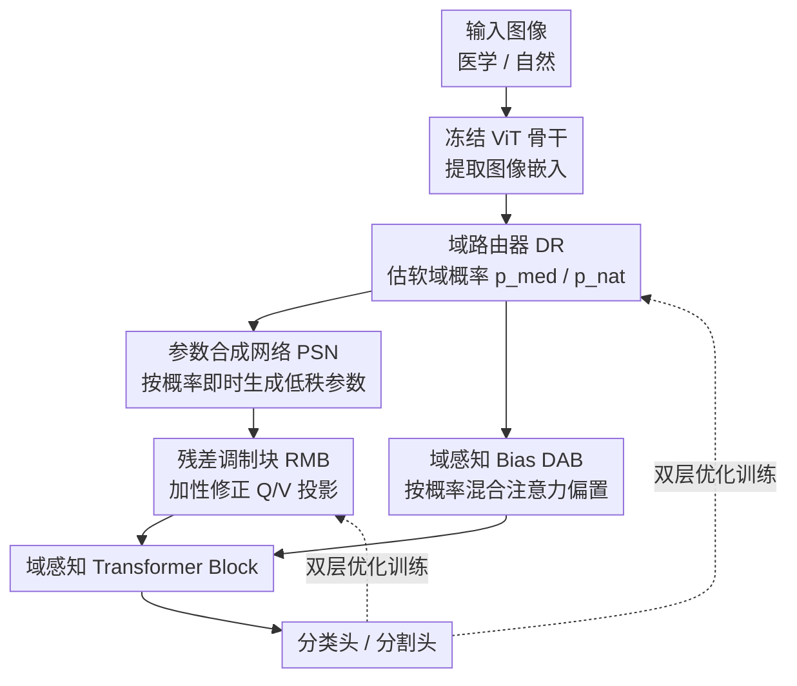

# Keep It Frozen: Domain-Routed Conditional Residual Modulation for Multi-Domain Vision Transformers

**会议**: CVPR 2026  
**论文**: [CVF Open Access](https://openaccess.thecvf.com/content/CVPR2026/html/Khan_Keep_It_Frozen_Domain-Routed_Conditional_Residual_Modulation_for_Multi-Domain_Vision_CVPR_2026_paper.html)  
**领域**: 多域视觉Transformer / 参数高效微调  
**关键词**: 冻结骨干, 域路由, 残差调制, 超网络, 双层优化

## 一句话总结
在完全冻结的 ViT 骨干上挂一组轻量级残差调制模块（RMB），由一个域路由器（DR）实时估计样本属于"医学/自然"的软概率、再用参数合成网络（PSN）按概率即时生成低秩修正参数注入 Q/V 投影与注意力 bias，配合 MAML 式双层优化，实现单一模型在医学（超声/CT/MRI）与自然图像间同时适配且互不损伤，只用约 3.5% 的可训练参数。

## 研究背景与动机

**领域现状**：让一个视觉模型同时胜任自然图像与医学图像，常规做法是对预训练 ViT 做任务专属的全量或大块微调（full fine-tuning）。医学侧也有 MedCLIP、BiomedCLIP 这类领域预训练模型，以及 LoRA、AdaptFormer、Adapter 等参数高效微调（PEFT）方案。

**现有痛点**：医学图像（尤其胎儿超声）天然带声影、运动模糊、斑点噪声、边界模糊、姿态/尺度剧烈变化，通用视觉模型对这些模态特有伪影很脆弱。而一旦为医学域做重型微调，又会**反过来侵蚀模型在自然图像上的通用能力**——改一个域常常悄悄拖垮另一个域。多数 PEFT 方法要么按"任务"离散路由（AdapterFusion），要么学一组静态域专属权重（ExPLoRA），要么需要换权重，缺乏对"单张图到底有多医学/多自然"的连续、逐样本响应。

**核心矛盾**：医学与自然之间的差异是**连续的、而非纯类别式的**——一张图可能"七分医学三分自然"。用静态、整域级别的调整去套连续变化的输入，要么调过头伤通用性，要么调不到位丢鲁棒性；而测试时适配（TTA）虽能提鲁棒性却要在推理时反复更新参数，违背延迟/内存/稳定性约束。

**本文目标**：用单一端到端模型同时服务医学与自然图像；推理保持快速、无测试时更新（update-free）；满足紧的显存/延迟预算；在不同模态间稳定。

**切入角度**：既然域差异连续，就别做"重而静"的整域调整，而是做"**最小、按需、逐样本**"的修正——只在有益的投影上、只修正所需的量。骨干一直冻结，所有适配交给极小的、由输入条件化的残差调制器。

**核心 idea**：冻结骨干，用"域路由器估软域概率 → 超网络按概率即时合成低秩参数 → 残差模块加性注入"这条链，把逐样本的域感知修正叠加到注意力投影上，配双层优化把"域级元参数"和"任务级表征"解耦学习。

## 方法详解

### 整体框架
DCRM-ViT 接收一张图（医学或自然），先过冻结的 ViT 骨干得到图像嵌入；域路由器（DR）从这些特征里估计该样本属于各域的软概率 $D(x)=[p_{medical}, p_{natural}]$；参数合成网络（PSN）把图像特征与域概率映射成一组逐样本、低秩的调制参数；这些参数驱动插在每个 transformer block 里的残差调制模块（RMB），对 Q/V 投影做加性低秩修正，并可选地往注意力 logits 上加一个域感知 bias（DAB）；修正后的特征继续走 transformer block，最后进分类头或分割头。整条链里骨干权重始终不动，推理是一次前向、无梯度更新。

### 关键设计

**1. 残差调制块 RMB + TALer：在冻结投影上做加性低秩修正**

这一块直接对应"骨干一动就伤通用性"的痛点：与其改 $W_q, W_v$ 本身，不如在它们旁边并一条可训练支路，把修正**加**上去。每个 RMB 的核心是一个任务对齐层（TALer），由低秩编码器、ReLU 非线性、低秩解码器和一个尺度因子组成。对输入特征 $h\in\mathbb{R}^d$，TALer 输出为

$$h' = r \cdot \sigma(W_{DS} h + b_{DS}) \odot \big(W_{US}\,\sigma(W_{DS} h + b_{DS}) + b_{US}\big)$$

其中 $W_{DS}\in\mathbb{R}^{d'\times d}$ 降维、$W_{US}\in\mathbb{R}^{d\times d'}$ 升回原维、$r$ 是尺度因子（让模型对病灶 vs 胎儿结构这类不同尺度的目标都敏感）。修正注入方式是 $Q=\tilde W_q\gamma = W_q\gamma + h'_q$、$V=\tilde W_v\gamma = W_v\gamma + h'_v$——只动 Q、V 投影，**Key 投影 $K=W_k\gamma$ 保持原样**，作者刻意让 K 不变以保住注意力分数反映的是数据里真实的关联结构。因为是加性低秩、且骨干冻结，预训练知识被原封保留，只在需要的投影上叠加少量域专属可塑性。

**2. 域路由器 DR + 参数合成网络 PSN：把"有多医学"连续地翻译成参数**

针对"域差异是连续的、静态整域调整套不住"这个核心矛盾，DR 不做硬分类，而是输出软域概率。DR 内部含一个域感知层（DALer，含收缩/扩张两类层 + 非线性）和一条并行门控通道（1×1 卷积 $g=\mathrm{Conv}_{1\times1}(x;\theta_g)$ 提取空间细节后与原嵌入拼接），再由域分类器 $D$ 经 softmax 给出 $D(x)=[p_{medical}, p_{natural}]$。关键的"连续性"来自 PSN：它是一个全连接超网络，吃图像嵌入 $x$ 和域概率 $D(x)$，输出 TALer 的全部权重和偏置 $\theta_A = P(x, D(x);\theta_P)$。也就是说 RMB 参数不是固定查表，而是**逐样本即时合成**，从而在医学/自然参数之间平滑插值——一张"偏医学"的图会拿到更偏医学的修正核。这正是它区别于 ExPLoRA（静态域 LoRA）、Supernet（离散子网选择）的地方：无需换权重即可连续跨域适配。

**3. 域感知注意力偏置 DAB：用几乎零开销让注意力按域偏移**

为了让注意力本身也能按域调整关注点（比如医学图更该盯声影/低对比边界），作者在 logits 上加一个域专属偏置矩阵：

$$\mathrm{Attention}(Q,K,V) = \mathrm{softmax}\!\Big(\frac{QK^\top}{\sqrt{d_k}} + B_d\Big)V,\quad B_d = p_{medical}B_{medical} + p_{natural}B_{natural}$$

$B_{medical}, B_{natural}$ 是各域学到的偏置矩阵，按 DR 给的概率混合。这等于让同一套注意力按"这张图有多医学"动态偏移，几乎不增计算量，却能捕捉模态特有的上下文关系。消融里 DAB 属于"稳定/精修"类组件而非主力适配能力，但加它能带来一致的小幅提升。

**4. 双层（MAML 式）优化：把域级元参数与任务级表征解耦**

如果让 PSN、DR、RMB 在同一个损失里一起拟合所有任务和域，梯度会互相打架——既想服务超声分割又想服务自然分类，PSN 收到冲突信号，域线索变弱、适配变慢。作者用双层优化拆开这两类学习：内层对每个任务 $T$ 用任务数据 $D_T^{task}$ 多步梯度微调 RMB 参数 $\phi'_T \leftarrow \phi - \alpha\nabla_\phi L_T(\theta,\phi,\omega;D_T^{task})$（此时 RMB 参数本身是 $\phi=P(\omega,D(x))$ 由 PSN 生成）；外层用域特征数据 $D_T^{dom}$ 更新 DR 参数 $\omega$、RMB 初始化 $\phi$ 以及内层学习率 $\alpha$：$\omega\leftarrow\omega-\beta\nabla_\omega\mathbb{E}_T[L_T(\theta,\phi'_T,\omega;D_T^{dom})]$。整体训练损失是 $L_{total}=L_{cls}+\beta L_{domain}+L_{reg}$（任务分类 + 域分类 + 正则）。这样外层学"怎么生成好参数"的域级元知识、内层学具体任务表征，干净地隔离了梯度干扰——消融里去掉元学习（No Meta Learning）在多个数据集上掉点明显，印证了这一解耦的必要性。

### 损失函数 / 训练策略
联合训练域分类器、PSN 与主干模块，总损失 $L_{total}=L_{cls}+\beta L_{domain}+L_{reg}$。优化采用双层（episodic）框架：外层用域特征样本 $D_T^{dom}$ 训元参数、内层用任务样本 $D_T^{task}$ 做快速任务适配，外层还顺带学内层学习率。RMB 层数在 12 层前越多越好、之后饱和或略降。分割任务则冻结编码器、只训一个浅层逐像素解码头 + RMB + DR，用 Dice + 交叉熵。

## 实验关键数据

骨干统一 ViT-B/16、224×224、FP16、batch=128、单张 A100-40GB。评测覆盖胎儿医学（Fpus23、Fetal Planes）、自然/标准（CIFAR-10、Caltech101、Natural Images）、细粒度（Food101、SUN397、Stanford Cars）以及超声/CT/MRI 分割。

### 主实验（联合微调，Acc %）
| 数据集 | LoRA | CLIP | DINOv2 | DCRM-ViT |
|--------|------|------|--------|----------|
| Fpus23（超声） | 63.0 | 61.6 | 59.3 | **63.4** |
| Fetal Planes | 88.3 | 42.2 | 87.8 | **89.3** |
| CIFAR-10 | 88.1 | 88.4 | 87.9 | **89.2** |
| Caltech101 | 84.0 | 84.1 | 83.1 | **85.8** |
| Food101 | 94.5 | 93.1 | 95.1 | **95.7** |
| Stanford Cars | 90.1 | 88.7 | 90.8 | **91.5** |

分割任务（Dice ↑）上同样全面领先：BUS-UCLM 0.862 / BUID 0.789 / BUS-BRA 0.834 / ACDC 0.928 / MMWHS-CT 0.880 / MMWHS-MRI 0.856，平均比 SAMUS 超声 +3.07、其它模态 +2.23。说明域条件机制能直接迁移到逐像素任务。

### 消融实验（Table 6，FPUS23 Acc %）
| 配置 | Acc(%) | 说明 |
|------|--------|------|
| Full | 63.4 | 完整模型 |
| w/o RMB | 51.4 | **掉 12.0 点，最致命**——主适配能力来自 RMB |
| w/o DR. | 58.2 | 掉 5.2 点，失去软域估计 |
| No PSN | 59.1 | 掉 4.3 点，退回固定参数、丢连续插值 |
| No Meta Learning | 58.8 | 掉 4.6 点，梯度互相干扰 |
| w/o DAB | 60.1 | 掉 3.3 点，稳定性组件 |
| w/o Rescale | 61.4 | 掉 2.0 点，多尺度敏感性下降 |

### 计算开销（Table 7）
| 模型 | 总参数(M) | 可训练(M) | 吞吐(img/s) | 每轮(min) |
|------|-----------|-----------|-------------|-----------|
| CLIP | 123.0 | 123.0 | 205 | 3.0 |
| LoRA | 88.4 | 5.5 | 308 | 0.45 |
| DCRM-ViT | 90.3 | **3.3** | **335** | **0.3** |

PSN 用瓶颈维 $h=120$ 时约 3.0M 参数（占可训练大头），但每 batch 只跑一次生成共享调制权重，约 7 MFLOPs（< ViT-B 的 0.04%），延迟影响可忽略。可训练参数仅约 ViT-B 的 3.5%。

### 关键发现
- RMB 是绝对主力：去掉它 FPUS23 掉 12 点、Food101 掉 7.3 点，远超其它任一组件，说明"逐样本低秩残差"才是适配的核心容量来源。
- DR / PSN / 双层元学习是"组织者"：它们决定 RMB 容量怎么按域分配，去掉任一个掉 4~5 点；而 Gates、Drop-Path、GELU、DAB、Rescale 属于稳定/精修类，各自 0.x~2 点的小幅贡献。
- 零样本场景下，MedCLIP/BioMedCLIP 在胎儿数据上能超 CLIP（医学预训练有效），但仍低于 DCRM-ViT，且在多个自然数据集上反而不如 CLIP；DCRM-ViT 在医学和自然两侧都拿到最高，体现"互不损伤"的设计目标达成。
- 跨域迁移（医学↔自然双向）无需任何测试时更新就保持最优，与需要推理时更新的 TTA 形成对比。

## 亮点与洞察
- **"连续域"假设落到了参数生成上**：把"一张图有多医学"建模成软概率、再用超网络即时合成低秩核，是对"域是连续而非类别"这一观察的干净工程化，比静态域 LoRA / 离散子网选择更贴合现实分布。
- **只改 Q/V、保留 K 不动**：一个很克制的设计——既给注意力留出域适配的口子，又用"K 不变"守住注意力分数的真实结构，避免修正污染相似度计算，这个取舍思路可迁移到任何"想微调注意力但怕破坏预训练几何"的场景。
- **双层优化解耦"生成参数的元知识"与"任务表征"**：把超网络的训练从"同时讨好所有任务"里解放出来，消融数据明确支持这能减梯度干扰，对所有"用 hypernetwork 做条件生成"的工作都有借鉴价值。
- 工程性价比高：3.3M 可训练、0.3 min/epoch、PSN 仅每 batch 跑一次，落地约束友好。

## 局限与展望
- **只有两个域（医学/自然）**：DR/DAB 的 bias 与概率都是二元混合，扩到三域以上（如不同医学模态各自成域）时软路由是否仍稳定、$B_d$ 怎么组合，论文未验证。
- **域分类器需要域标签监督**：$L_{domain}$ 依赖真域标签，意味着训练时要知道每张图属于哪个域，对域边界本身模糊或无标注的数据不友好。
- **医学侧主要是胎儿超声 + 心脏 CT/MRI**：声影/斑点等伪影针对性强，是否泛化到病理切片、内镜、X 光等差异更大的医学模态存疑。
- **PSN 是参数大头**（3.0M / 3.3M）：虽然 FLOPs 极小，但参数生成网络本身的容量/泛化与瓶颈维 $h$ 的敏感性只给了单点（120），缺少系统扫描。
- 全文部分公式排版来自 OCR 缓存，TALer 的逐元素相乘与升降维细节建议⚠️ 以原文为准。

## 相关工作与启发
- **vs LoRA / AdaptFormer（静态 PEFT）**：它们学一组固定的低秩/适配参数，对所有输入一视同仁；DCRM-ViT 用 DR→PSN 逐样本生成低秩残差，按"有多医学"连续插值，多域共享一套架构而非任务专属模块。
- **vs ExPLoRA / Supernet**：ExPLoRA 学静态域专属 LoRA、Supernet 离散选子网、FreqFit 做显式频率对齐；DCRM-ViT 始终冻结骨干、不换权重，靠输入条件化的连续生成跨域。
- **vs MAML / 元适配控制器**：借了 MAML 的双层思想，但落点是"为域分类元学最优初始化与参数生成策略"，专门解决医学伪影下的保留-适配权衡，把元适配带进了此前少被触及的胎儿超声等高难模态。
- **vs 测试时适配 TTA**：TTA 在推理时更新参数提鲁棒性；DCRM-ViT 推理一次前向、无更新，更适合延迟/内存/稳定性敏感的临床部署。

## 评分
- 新颖性: ⭐⭐⭐⭐ "连续域软路由 + 超网络即时合成低秩残差 + 双层解耦"组合清晰且贴合"域连续"观察，单点不算颠覆但整合有巧思。
- 实验充分度: ⭐⭐⭐⭐ 覆盖分类/分割/零样本/跨域 + 细致消融，但医学侧模态偏窄、PSN 瓶颈维等关键超参缺系统扫描。
- 写作质量: ⭐⭐⭐ 动机与方法链条讲得清楚，但组件命名繁多（DR/PSN/RMB/TALer/DALer/GCU/DAB）、公式排版略乱，读起来需要反复对照。
- 价值: ⭐⭐⭐⭐ "单一冻结模型同时适配医学+自然、低开销、无测试时更新"对临床部署很实用，方法对一般多域 ViT 适配也有迁移价值。

<!-- RELATED:START -->

## 相关论文

- [\[CVPR 2026\] Bridging Domain Expertise and Generalization for Performance Estimation](bridging_domain_expertise_and_generalization_for_performance_estimation.md)
- [\[CVPR 2026\] Align Once to Explain: Feature Alignment for Scalable B-cosification of Foundational Vision Transformers](align_once_to_explain_feature_alignment_for_scalable_b-cosification_of_foundatio.md)
- [\[CVPR 2026\] FAST: Topology-Aware Frequency-Domain Distribution Matching for Coreset Selection](fast_topology-aware_frequency-domain_distribution_matching_for_coreset_selection.md)
- [\[CVPR 2026\] Temporal Interaction in Spiking Transformers with Multi-Delay Mixer](temporal_interaction_in_spiking_transformers_with_multi-delay_mixer.md)
- [\[ICLR 2026\] Noise-Aware Generalization: Robustness to In-Domain Noise and Out-of-Domain Generalization](../../ICLR2026/others/noise-aware_generalization_robustness_to_in-domain_noise_and_out-of-domain_gener.md)

<!-- RELATED:END -->
