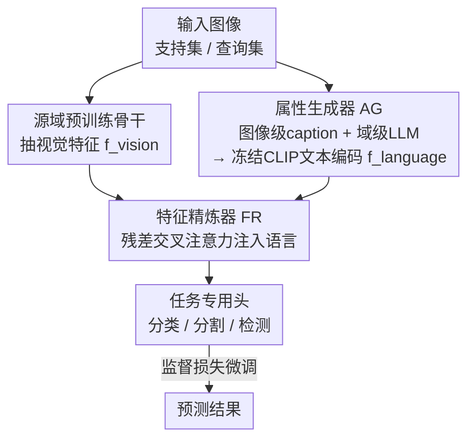

# Language Does Matter for Cross-Domain Few-Shot Visual Feature Enhancement

**会议**: CVPR 2026  
**论文**: [CVF Open Access](https://openaccess.thecvf.com/content/CVPR2026/html/Zhou_Language_Does_Matter_for_Cross-Domain_Few-Shot_Visual_Feature_Enhancement_CVPR_2026_paper.html)  
**代码**: https://github.com/SivanXT/LDM-CDFSL  
**领域**: 跨域小样本 / 视觉-语言  
**关键词**: 跨域小样本、语言属性、残差交叉注意力、CLIP、特征增强

## 一句话总结
针对跨域小样本任务里"纯视觉特征容易学到不可迁移的捷径模式"这一痛点，本文用图像描述模型 + 大语言模型为每张图生成「图像级 + 域级」语言属性，再用一个轻量残差交叉注意力把语言语义嵌进视觉特征，做成即插即用模块挂到分类/分割/检测基线上，在多个 CD-FSL 基准上稳定涨点。

## 研究背景与动机
**领域现状**：跨域小样本图像解译（CD-FSII）的主流做法，是把在源域大规模数据上预训练好的视觉模型，用目标域里极少量标注样本去微调，让它迁移到分布差异很大的新域上，覆盖分类、语义分割、目标检测等任务。

**现有痛点**：源域和目标域在低层（颜色、纹理、分辨率）到高层（物体组成、视觉风格、背景语境）上都存在显著差异；同时目标域里物体外观变化大、标注又极少。两者叠加，使得只靠视觉特征微调的模型很容易抓住一些"在支持集里碰巧相关、但换到查询集就失效"的**捷径模式（shortcut patterns）**——这些特征脆弱、依赖语境、无法承载跨域可迁移的高层语义。

**核心矛盾**：物体外观的剧烈变化需要丰富的语义引导才能对齐，但小样本场景下能提供的监督信号严重不足，模型只能退而依赖浅层视觉相关性，被困在一个僵硬、不可迁移的特征空间里。

**本文目标**：在不破坏现有微调流程的前提下，给视觉特征补上"高层、可跨域迁移的语义"，并让这套增强同时服务于分类、分割、检测三类任务。

**切入角度**：作者观察到视觉模态本身很难显式表达"风格、背景、物体属性"这类高层语义，而语言天然擅长描述这些。于是引入语言模态——但不同于以往把类别标签当文本去构造类原型的做法，本文要描述的是**每张图自身的属性**和**整个域的属性**。

**核心 idea**：用语言属性描述去"调教"预训练视觉特征——一边用图像描述模型刻画单图的图像级属性，一边用 LLM 总结整域的域级属性，再通过残差交叉注意力把这些语言语义注入视觉特征，从而把模型从捷径模式里拉出来。

## 方法详解

### 整体框架
框架（作者称为跨模态视觉特征增强框架，开源名 LDM-CDFSL）在标准小样本微调管线里插入两个新模块：**属性生成器（Attribute Generator, AG）** 和**特征精炼器（Feature Refiner, FR）**。对一张目标域图像，先用源域预训练骨干 $F_\theta$ 抽视觉特征 $f_{vision}\in\mathbb{R}^{h\times w\times d_v}$；同时 AG 为它生成语言表征 $f_{language}$；FR 用残差交叉注意力把语言注入视觉，得到精炼特征 $f_{refined}$，再送进任务专用头（分类器/分割器/检测器）算损失微调。推理时查询图像走同样的流程：先生成语言属性、精炼视觉特征，再喂任务头预测——属于严格遵守 CD-FSL 协议的**归纳式推理**（每个查询只用自己的属性，不偷看整个查询集）。

### 关键设计

**1. 属性生成器 AG：把"单图属性"和"整域属性"都翻译成语言**

针对"纯视觉抓不到高层语义"的痛点，AG 从两个互补层级构造语言知识。**图像级属性**用预训练图像描述（image-to-caption）模型为每张图生成细粒度的内容描述，强调任务相关的视觉线索、削弱虚假相关；**域级属性**则把目标域的结构化说明喂给 ChatGPT，按预定义模板让它生成整域共享的风格/背景等高层语义刻画。两级属性融合后，用一个**冻结的 CLIP 文本编码器**编码成语言表征 $f_{language}\in\mathbb{R}^{1\times d_p}$。这一粗到细的设计直接对应消融结论：域级属性提供全局先验与高层语义，图像级属性补充实例级细节，二者互补。

**2. 特征精炼器 FR：轻量残差交叉注意力，把语言"焊"进视觉特征**

光有语言表征还不够，得无损地嵌入视觉特征里。FR 用视觉特征当 query、语言表征当 key/value 做交叉注意力：$Q=f_{vision}W_q,\ K=f_{language}W_k,\ V=f_{language}W_v$，注意力分数 $A=\frac{QK^\top}{\sqrt{d_k}}$、权重 $\alpha=\mathrm{Softmax}(A)$。关键是加了**残差连接**保留原始视觉信息：

$$f_{refined}=\alpha V + f_{vision}W_r$$

这样既注入了语言带来的可迁移高层语义，又不丢原视觉线索。作者特意把视觉设为 query（而非反过来），消融里"交换 Q/K/V 角色（swapping order）"会掉点，说明"用视觉去检索语言语义"这个方向才对。整个模块只引入四个全连接层，参数与训练开销增加极小。

**3. 信息瓶颈视角下的即插即用通用性**

设计 3 解释"为什么这样有效"并支撑通用性。从信息瓶颈（IB）视角看，精炼特征 $f_{refined}$ 充当中间表征 $Z$，目标是 $L_{IB}=I(X;Z)-\beta I(Z;Y)$：注入语言后，一方面降低对捷径视觉线索的依赖、压低 $I(X;Z)$（即降低 $H(Z)$、简化假设空间、收紧泛化界），另一方面用域相关语义抬高 $I(Z;Y)$。因为 AG/FR 都不依赖具体任务头，框架是**任务无关、即插即用**的，可直接挂到 StyleAdv、PMF、CD-CLS、IFA、GPRN、CD-ViTO 等现成基线上，覆盖分类/分割/检测。

### 损失函数 / 训练策略
微调阶段在支持集 $T_S$ 上，对每张支持图先经 AG 得语言表征、再经 FR 得精炼特征，送任务头 $G_\phi$ 预测，按任务损失（如交叉熵或 MSE）优化全部可学习参数：$L=\sum_{\{X_S,Y_S\}\in T_S}\mathrm{Loss}(G_\phi(f_{refined}),Y_S)$。所有优化器、学习率等超参与原基线保持一致以公平对比。

## 实验关键数据

### 主实验
评测覆盖跨域小样本分类（CD-FSC，源域 mini-ImageNet → EuroSAT/ISIC/ChestX/CropDisease）、分割（CD-FSS，源域 PASCAL VOC → ISIC/Chest X-Ray/FSS-1000/DeepGlobe）、检测（CD-FSOD，源域 COCO → ArTaxOr 等 6 个域）。框架挂到多个基线上一致涨点（数值为各任务多域平均的相对增益）：

| 任务 | 基线 | 1-shot 增益 | 5-shot 增益 | 备注 |
|------|------|------------|------------|------|
| CD-FSC | StyleAdv | +2.5% | +1.9% | 4 域平均 |
| CD-FSC | PMF | +4.83% | +3.33% | 4 域平均 |
| CD-FSC | CD-CLS | +3.36% | +2.34% | 4 域平均 |
| CD-FSS | IFA | +4.1% | ≈同量级 | 4 域平均 |
| CD-FSS | GPRN | +2.9% | ≈同量级 | 4 域平均 |
| CD-FSOD | CD-ViTO | +4.4% | +5.4% | 另 10-shot +7.3% |

可见任务越"难、标注越稀缺"（如检测、更多 shot 预算），语言增强带来的相对收益越明显。⚠️ 表中 CD-FSS 5-shot 原文只说"similar improvements"，未给精确数值。

### 消融实验
以 CD-FSS、IFA 基线、在 ISIC 和 Chest X-Ray 上拆开两级属性的贡献（相对基线的绝对涨幅，%）：

| 配置 | ISIC 1-shot | ISIC 5-shot | Chest 1-shot | Chest 5-shot |
|------|------------|------------|--------------|--------------|
| 仅图像级属性 | +4.3 | +2.0 | +5.9 | +6.0 |
| 仅域级属性 | +3.8 | +1.9 | +5.6 | +5.6 |
| 两级属性（完整） | 进一步提升 | 进一步提升 | 进一步提升 | 进一步提升 |

另一组变体对比（Table 5）显示：① 即便给基线补上同样数量的 MLP（"Baseline w/ same MLP"），本文仍显著更优，说明涨点不是单纯靠参数量；② 去掉残差连接、把交叉注意力换成逐元素加/乘、或交换 Q/K/V 角色，均掉点。

### 关键发现
- **两级属性互补、缺一不可**：图像级给实例细节、域级给全局先验，合起来形成"粗到细"的语义谱，单用任一级都不如组合。
- **交叉注意力的方向很关键**：视觉当 query 去"问"语言，比反向或逐元素融合都好——说明应该让视觉特征主动检索语言语义，而非简单叠加。
- **收益随任务难度放大**：检测（CD-FSOD）和高 shot 预算下增益最大，10-shot 检测平均 +7.3%。

## 亮点与洞察
- **"语言描述属性"而非"类别标签"这一立意很巧**：以往跨模态 CD-FSII 多把类名当文本构造类原型，本文转去描述单图与整域的属性，直击"纯视觉学捷径"的病根，是更贴近问题本质的用法。
- **残差交叉注意力极轻**：只加四个 FC 层、视觉做 query、语言做 key/value，外加残差兜底原视觉信息，几乎不增训练成本，却能即插即用挂到任意任务头——这套"轻量注入"范式可迁移到很多需要补语义先验的视觉任务。
- **IB 解释把"为什么有效"说圆了**：用语言降低 $I(X;Z)$（去捷径）、抬高 $I(Z;Y)$（补语义），给"语言增强提升跨域泛化"提供了一个可讲清的理论落点，而非纯经验涨点。

## 局限与展望
- **强依赖外部大模型质量**：图像级属性靠 caption 模型、域级属性靠 ChatGPT 生成，描述若不准或有幻觉，注入的就是噪声语义；论文未深入分析描述质量对最终精度的敏感性。
- **域级属性需要人工提供"结构化域说明"**：要给 LLM 喂目标域的描述模板，遇到完全陌生、难以用语言概括的域时，这一步可能成为瓶颈。⚠️ 原文未明确该模板的自动化程度。
- **语言表征被压成单一向量** $f_{language}\in\mathbb{R}^{1\times d_p}$：把整段属性描述压成一个 token 级表征，可能损失细粒度空间语义；可探索多 token、与视觉空间位置对齐的更细注入方式。

## 相关工作与启发
- **vs 类原型文本融合（Han et al. / Shangguan et al.）**: 他们把类别标签当文本、用 CLIP 编码成类级原型再与视觉原型融合；本文不做类原型，而是把"图像级 + 域级属性描述"嵌进视觉特征本身，目标是补可迁移高层语义而非构造判别原型。
- **vs 提示微调（Zhuo et al. / Wu et al.）**: 他们学视觉提示或把支持集信息塞进可学习 prompt 来调制特征；本文用显式的自然语言属性描述 + 交叉注意力注入，语义来源更显式、且任务无关可即插即用。
- **vs 纯视觉 CD-FSL 微调（StyleAdv/PMF/CD-CLS 等）**: 这些方法只在视觉模态内做归一化/对抗/线性变换缓解过拟合，本文正是挂在它们之上、用语言模态补齐它们缺的高层语义。

## 评分
- 新颖性: ⭐⭐⭐⭐ "描述属性而非类名"的语言用法 + 残差交叉注意力注入，立意清晰但单个组件较常规
- 实验充分度: ⭐⭐⭐⭐⭐ 横跨分类/分割/检测三任务、多基线多目标域，消融拆到两级属性与注意力方向
- 写作质量: ⭐⭐⭐⭐ 动机—方法—IB 分析链条完整，部分公式/缓存有 OCR 痕迹需对照原文
- 价值: ⭐⭐⭐⭐ 即插即用、开销小、跨任务涨点，对跨域小样本社区实用性强

<!-- RELATED:START -->

## 相关论文

- [\[CVPR 2026\] Hyperbolic Defect Feature Synthesis for Few-Shot Defect Classification](hyperbolic_defect_feature_synthesis_for_few-shot_defect_classification.md)
- [\[CVPR 2026\] Data-Centric Meta-Learning for Robust Few-Shot Generalization](data-centric_meta-learning_for_robust_few-shot_generalization.md)
- [\[CVPR 2026\] NAF: Zero-Shot Feature Upsampling via Neighborhood Attention Filtering](naf_zero-shot_feature_upsampling_via_neighborhood_attention_filtering.md)
- [\[CVPR 2026\] DDSF: Robust Few-Shot Learning via Disentangled Subspaces with Determinantal Point Process](ddsf_robust_few-shot_learning_via_disentangled_subspaces_with_determinantal_poin.md)
- [\[ACL 2025\] ALGEN: Few-Shot Inversion Attacks on Textual Embeddings via Cross-Model Alignment](../../ACL2025/others/algen_few-shot_inversion_attacks_on_textual_embeddings_via_cross-model_alignment.md)

<!-- RELATED:END -->
