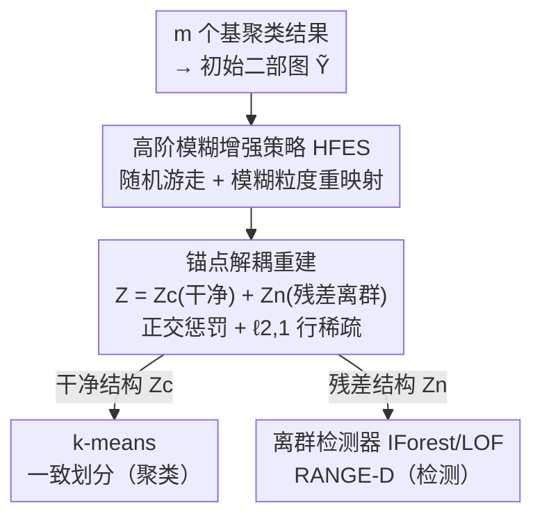

# Large-scale Robust Enhanced Ensemble Clustering via Outlier Decoupling

**会议**: CVPR 2026  
**论文**: [CVF Open Access](https://openaccess.thecvf.com/content/CVPR2026/html/Xu_Large-scale_Robust_Enhanced_Ensemble_Clustering_via_Outlier_Decoupling_CVPR_2026_paper.html)  
**代码**: https://github.com/middle258/RANGE  
**领域**: 集成聚类 / 无监督学习  
**关键词**: 集成聚类、锚点、离群解耦、二部图增强、离群检测

## 一句话总结
针对锚点式集成聚类在数据含离群点时"重建被污染的基聚类→锚点有偏→相似度矩阵质量下降"的痛点，本文提出 RANGE：先用高阶模糊增强策略提升二部图可靠性，再在锚点空间把相似度矩阵显式拆成"干净结构 + 残差离群结构"并用正交惩罚和 $\ell_{2,1}$ 范数约束把污染压到极少数锚点方向，从而得到无偏锚点；该残差结构还能顺手用于离群检测，做成线性复杂度、可扩到百万级样本的跨任务框架。

## 研究背景与动机
**领域现状**：集成聚类（ensemble clustering）从多个基聚类结果中提炼一个一致划分，只用决策级信息、不需原始特征。多数方法把基聚类转成 $n\times n$ 的共关联（CA）矩阵刻画样本相似度，但处理 CA 矩阵复杂度至少 $O(n^2)$，难以扩展到大规模数据。

**现有痛点**：为破计算瓶颈，锚点式（anchor-based）方法引入少量代表性样本"锚点"，用锚点-样本相似度矩阵替代样本-样本相似度，分三步走（选锚点、建锚点相似度矩阵、聚类）。锚点相似度矩阵的质量直接决定聚类精度。但现有锚点方法（k-means 选固定锚点，或用重建动态更新锚点）都忽略了一个关键问题：**基聚类结果本身不可靠**——尤其当数据被离群点污染时，基聚类被进一步扭曲，以"最小化重建误差"为目标去重建这些扭曲结果，会产出**有偏锚点**和被污染的相似度矩阵。

**核心矛盾**：重建目标想忠实逼近基聚类结果，但基聚类结果里混着离群污染；忠实重建 = 把污染也一并学进锚点。干净结构和离群污染纠缠在同一组锚点方向上，是精度下降的根源。

**本文目标**：作者把它拆成三个挑战——(C1) 如何增强基聚类结果的可靠性以提升集成精度；(C2) 如何在重建时避开扭曲基聚类的影响、生成无偏锚点；(C3) 如何显式刻画并利用离群结构以服务离群检测。

**切入角度**：与其在重建后被动容忍污染，不如在锚点空间里**显式地把相似度矩阵分解**为干净分量与残差离群分量，并强制两者尽量解耦——干净的去聚类，残差的去检测离群。

**核心 idea**：增强二部图（HFES）+ 在锚点空间做"干净 / 残差"解耦重建（正交惩罚 + 行稀疏 $\ell_{2,1}$），一举得到无偏锚点用于聚类、残差结构用于检测，复杂度 $O(n)$。

## 方法详解

### 整体框架
RANGE（large-scale **R**obust enh**A**nced e**N**semble clusterin**G** via outlier d**E**coupling）输入是 $m$ 个基聚类结果，输出一致划分（并可选输出离群分数）。整条线为：把基聚类结果转成初始二部图 $\tilde Y$ → 用**高阶模糊增强策略 HFES** 把不稳定的初始二部图细化成增强二部图 $Y$ → 在 $Y$ 上做锚点重建，但把锚点相似度矩阵 $Z$ 显式拆成干净分量 $Z_c$ 与残差离群分量 $Z_n$，靠**解耦约束**把离群污染逼进残差里 → 在干净分量 $Z_c$ 上跑 k-means 得一致划分；同时残差 $Z_n$ 喂离群检测器（IForest/LOF）得到 RANGE-D 变体做离群检测。整套优化用交替方向（ALM）求解，时间复杂度线性于样本数。

### 关键设计

**1. 高阶模糊增强策略 HFES：先把不可靠的二部图修稳，再去重建**

直接拿初始二部图 $\tilde Y$ 重建，等于把基聚类的不可靠也一并继承（对应挑战 C1）。HFES 分三步增强。先用 Jaccard 相似度量化基聚类簇之间的相似性 $S_{ij}=J(\pi_p,\pi_q)=\frac{|\tilde Y_{p:}\cap\tilde Y_{q:}|}{|\tilde Y_{p:}\cup\tilde Y_{q:}|}$，归一化得转移矩阵 $S_p=D_S^{-1}S$，再做随机游走累加捕捉**高阶**簇相似度：

$$S_h=S_p^{(1)\top}S_p+S_p^{(2)\top}S_p+\cdots+S_p^{(d)\top}S_p$$

直接按高阶相似度硬合并基簇会损失多样性，所以作者用**软合并**：按阈值 $\tau$ 过滤 $S_h$、取连通分量把 $s$ 个基簇划成 $h$ 个"簇粒（cluster granule）"，构造基簇-簇粒的模糊隶属矩阵 $G$。然后分两跳（样本→簇粒→基簇）算出模糊的样本-基簇隶属 $\tilde Y_s$，最后与初始图加权融合 $Y=\alpha\tilde Y+(1-\alpha)\tilde Y_s^\top$。这样既注入高阶模糊信息提升稳定性，又靠软合并保住了集成最看重的多样性。

**2. 锚点空间的离群解耦重建：把污染从锚点里"剥"出去**

这是核心创新，正面回应 C2/C3。先做标准锚点重建 $\min_{A,Z}\|Y-AZ\|_F^2$（约束 $A^\top A=I_k,\ Z^\top 1_k=1_n,\ Z\ge0$），引入映射矩阵 $P$ 重参数化为 $\|P^\top Y-AZ\|_F^2$ 提效。关键一步是把相似度矩阵分解 $Z=Z_c+Z_n$：$Z_c$ 是干净的锚点-样本相似度，$Z_n$ 是残差离群结构。但光分解不够——两部分可能复用相似的锚点方向，于是加两条约束：① **全局互相关惩罚** $\|Z_c^\top Z_n\|_F^2$，逼 $Z_c$ 与 $Z_n$ 的系数子空间近似正交、抑制残差向干净部分泄漏；② 对 $Z_n$ 施行 **行稀疏 $\ell_{2,1}$ 范数** $\|Z_n\|_{2,1}=\sum_{i=1}^k\|Z_n(i,:)\|_2$，只激活极少数残差行，把污染限制在少量"噪声锚点方向"里、不扩散到全部锚点。完整目标：

$$\min_{P,A,Z_c,Z_n}\|P^\top Y-A(Z_c+Z_n)\|_F^2+\lambda\|Z_n\|_{2,1}+\|Z_c^\top Z_n\|_F^2$$

$Z_c,Z_n$ 的非负约束帮助两结构分离，$Z_c^\top 1_k=1_n$ 让每个样本对所有锚点的相似度和为 1（概率化软分配）。最终在干净的 $Z_c$ 上跑 k-means，离群污染则被隔离在 $Z_n$ 中——锚点因此"无偏"。

**3. 线性复杂度交替优化 + 残差驱动的跨任务离群检测**

目标含 $P,A,Z_c,Z_n$ 四个变量，作者用交替优化逐个闭式/半闭式更新：$P$、$A$ 子问题化成带正交约束的 $\max \mathrm{tr}(\cdot)$ 形式、由 SVD 给出闭式解（如 $P^*=U_HV_H^\top$）；$Z_c$ 用增广拉格朗日（ALM）求解并做非负截断；$Z_n$ 引入对角重加权矩阵 $D$ 处理 $\ell_{2,1}$、其 Hessian 半正定故子问题凸，更新不增目标值。因 $n\gg s,k,s'$，整体时间复杂度线性 $O(n)$、空间 $O(ns)$，可扩到百万级（最大报告 2,000,000 样本）。同一框架直接把检测器作用在 $Z_n$ 上即得 **RANGE-D**：离群点在基聚类里通常孤立、相似关系异于正常样本，残差结构恰好刻画了样本在决策级的异常程度，于是聚类与检测共用一套表示，形成跨任务通用框架。

### 损失函数 / 训练策略
优化由 Algorithm 2 串起：初始化 $P,A,Z_c,Z_n,J$，设 $\rho=1.3,\ \mu=0.5$；建初始二部图 $\tilde Y$ → HFES 得增强图 $Y$ → 循环更新 $P\to A\to Z_c\to Z_n\to$ 拉格朗日乘子（$J=J+\mu(Z_c^\top 1_k-1_n),\ \mu=\min(\rho\mu,\mu_{max})$）直至收敛 → 在 $Z_c$ 上 k-means 出一致划分。目标各项非负、下有界且每步不增，故目标序列单调收敛（实验显示几轮即收敛）。关键超参：随机游走最大阶 $d=20$、$\lambda=0.5$、融合权重 $\alpha=0.8$、锚点数 $k=k'+c$（$k'\in\{-1,0,1,2,3\}$，$c$ 为簇数）、阈值 $\tau\in\{0.9:0.01:1\}$。

## 实验关键数据

### 主实验
在 1 个合成（SF-2M，2,000,000 样本）+ 9 个真实数据集上评测，对每个数据集随机跑 100 次 k-means 生成基聚类、集成规模 $m=20$、重复 10 次取均值，与 19 个代表性方法比 ACC 与 ARI。下表摘取若干强基线在代表性数据集上的 ACC（%），RANGE 全面领先：

| 数据集 | YACHT (IJCAI25) | CEHM (AAAI25) | FSEC (Inf.Fusion25) | RANGE (本文) |
|--------|------|------|------|------|
| COIL20 (D2) | 68.6 | 68.2 | 70.7 | **74.1** |
| ISOLET (D3) | 58.5 | 54.9 | 57.8 | **59.7** |
| COIL100 (D4) | 53.8 | 45.7 | 51.2 | **54.8** |
| ALOI100 (D5) | 71.9 | 68.0 | 70.8 | **73.2** |
| FashionMNIST (D6) | 55.1 | 49.7 | 50.9 | **58.5** |
| EMNIST (D9, 28万) | 55.8 | 54.8 | 55.3 | **57.6** |
| MNIST8M-1M (D10, 百万) | 48.7 | 49.1 | 48.5 | **50.8** |

ACC = 聚类准确率，ARI = 调整兰德指数，均越高越好；"-" 表示运行超时或内存不足。RANGE 在 SF-2M（百万级合成）上 ACC 74.6 / ARI 52.9，也优于各对手。⚠️ 部分数值来自 OCR 文本，建议对照原文 Table 4。

### 消融实验
在 10 个数据集上拆三个组件（ACC，%）：

| 配置 | COIL20 (D2) | FashionMNIST (D6) | MNIST (D7) | 说明 |
|------|------|------|------|------|
| w/o $\|Z_n\|_{2,1}$ | 73.0 | 53.5 | 56.7 | 去行稀疏正则 |
| w/o $\|Z_c^\top Z_n\|_F^2$ | 73.8 | 54.5 | 55.8 | 去解耦正交惩罚 |
| w/o HFES | 72.8 | 54.2 | 54.8 | 去二部图增强 |
| RANGE（完整） | **74.1** | **58.5** | **58.0** | 三件套齐全 |

### 关键发现
- **三个组件都在贡献，缺一掉点**：去掉 HFES、解耦项或 $\ell_{2,1}$ 任一项 ACC 都下降；其中 FashionMNIST/MNIST 上掉得最明显，说明在更大/更难的数据集上，增强二部图 + 解耦的价值更突出。
- **超参极少且不敏感**：RANGE 只有 $k'$ 和 $\tau$ 两个超参，敏感性分析显示对不同组合都很稳健；且锚点数按簇数设定（如百万级只需很少锚点），不像 FSEC 要 $k=1024$ 那么多。
- **可扩展性强**：ECCMS 等 SOTA 在小数据上精度高但扩不到大规模（超时/超内存），RANGE 在百万级仍稳定有效；速度快于 CEHM 和 YACHT（虽非最快，但精度更高使其更具竞争力）。

### 离群检测（RANGE-D）
把 IForest/LOF 直接作用在残差 $Z_n$ 上，在 14 个 ADBench 数据集上比平均 AUC（%）：

| 方法 | 平均 AUC |
|------|---------|
| IForest | 66.67 |
| LOF | 60.40 |
| COR（决策级基线） | 62.19 |
| RANGE-D (LOF) | 69.70 |
| RANGE-D (IF) | **74.91** |

RANGE-D 在多数数据集上提升了两种检测器的表现，平均也超过决策级基线 COR——验证残差结构确实捕到了决策级离群信息，使聚类与检测共用一套表示成立。

## 亮点与洞察
- **"解耦"用得恰到好处**：把锚点相似度矩阵拆成干净 + 残差，再用"正交惩罚（防泄漏）+ $\ell_{2,1}$ 行稀疏（把污染压进极少数锚点方向）"双约束逼污染就范——这套低秩/稀疏分离的思路从鲁棒 PCA 迁到了集成聚类的锚点空间，落点很准。
- **一套残差，两个任务**：残差 $Z_n$ 不是被丢掉的"垃圾"，而是离群点在决策级的画像，直接喂检测器就得 RANGE-D。把"聚类要去掉的噪声"重用为"检测要找的信号"，是很优雅的跨任务设计。
- **HFES 的软合并保多样性**：高阶随机游走容易把基簇合并过头、抹掉集成赖以生效的多样性，作者用阈值 + 连通分量 + 模糊隶属做软合并，稳定性和多样性两头兼顾，这个权衡值得借鉴。
- **百万级线性复杂度落地**：闭式 SVD 更新 + ALM + $n\gg s,k$ 的近似，把方法压到 $O(n)$，真的在 200 万样本上跑通。

## 局限与展望
- **边界附近离群点失效**：作者承认当离群点落在簇边界时，RANGE-D 与 COR 性能都退化，因为其异常模式在决策级难以清晰显现。
- **依赖基聚类质量与多样性**：方法吃的是 $m=20$ 个 k-means 基聚类；若基聚类整体偏差大或多样性不足，HFES 增强与解耦能补救的上限受限。⚠️ 论文主要用随机 k-means 生成基聚类，未充分考察异质基聚类下的表现。
- **超参 $\tau$ 的连通分量敏感性**：簇粒由阈值 $\tau$ 过滤后的连通分量决定，$\tau$ 影响簇粒数 $h$；虽称不敏感，但极端 $\tau$ 下连通分量结构可能突变，跨数据集的普适默认值仍需经验设定。

## 相关工作与启发
- **vs CA 矩阵方法（ECCMS/CEAM 等）**: 它们建 $n\times n$ 共关联矩阵刻画样本级相似度，复杂度 $\ge O(n^2)$、扩不到大规模；RANGE 走锚点-二部图路线把复杂度压到 $O(n)$，在大数据上 CA 方法直接超时/超内存。
- **vs 固定锚点 / 动态锚点（FSEC / YACHT）**: FSEC 用 k-means 选固定锚点、YACHT 动态更新锚点，但都未处理"基聚类被离群污染→锚点有偏"；RANGE 既动态重建又显式解耦污染，故对两者都有明显优势，且锚点数远少于 FSEC。
- **vs 鲁棒多视图聚类（RCAGL 等）**: 这类方法在特征空间算样本相似度、不适配只有决策级信息的集成聚类场景；实验中 RCAGL 落后于专门的集成方法，凸显需要面向基聚类结果定制的鲁棒集成框架。
- **vs 随机游走集成（ECPCS-HC/MC）与鲁棒方法 TRCE**: 同为随机游走或鲁棒思路，RANGE 凭 HFES 的软合并 + 锚点解耦在精度与鲁棒性上均超过它们。

## 评分
- 新颖性: ⭐⭐⭐⭐ 把低秩/稀疏解耦引入锚点式集成聚类、并复用残差做检测，组合新颖
- 实验充分度: ⭐⭐⭐⭐⭐ 10 个聚类数据集 + 14 个检测数据集、19 个对手、含百万级与消融/敏感性/收敛分析
- 写作质量: ⭐⭐⭐⭐ 挑战(C1-C3)→设计逐一对应、推导完整，惟缓存 OCR 致部分公式需对照原文
- 价值: ⭐⭐⭐⭐ 线性复杂度可扩到百万级、跨任务通用且开源，对大规模无监督聚类很实用

<!-- RELATED:START -->

## 相关论文

- [\[CVPR 2026\] MSPT: Efficient Large-Scale Physical Modeling via Parallelized Multi-Scale Attention](mspt_efficient_large-scale_physical_modeling_via_parallelized_multi-scale_attent.md)
- [\[CVPR 2026\] Efficient Unrolled Networks for Large-Scale 3D Inverse Problems](efficient_unrolled_networks_for_large-scale_3d_inverse_problems.md)
- [\[CVPR 2026\] Life-IQA: Boosting Blind Image Quality Assessment through GCN-enhanced Layer Interaction and MoE-based Feature Decoupling](life-iqa_boosting_blind_image_quality_assessment_through_gcn-enhanced_layer_inte.md)
- [\[ICML 2026\] Torus Graphs for Large-Scale Neural Phase Analysis](../../ICML2026/others/torus_graphs_for_large_scale_neural_phase_analysis.md)
- [\[ACL 2025\] Code-Switching and Syntax: A Large-Scale Experiment](../../ACL2025/others/code-switching_and_syntax_a_large-scale_experiment.md)

<!-- RELATED:END -->
