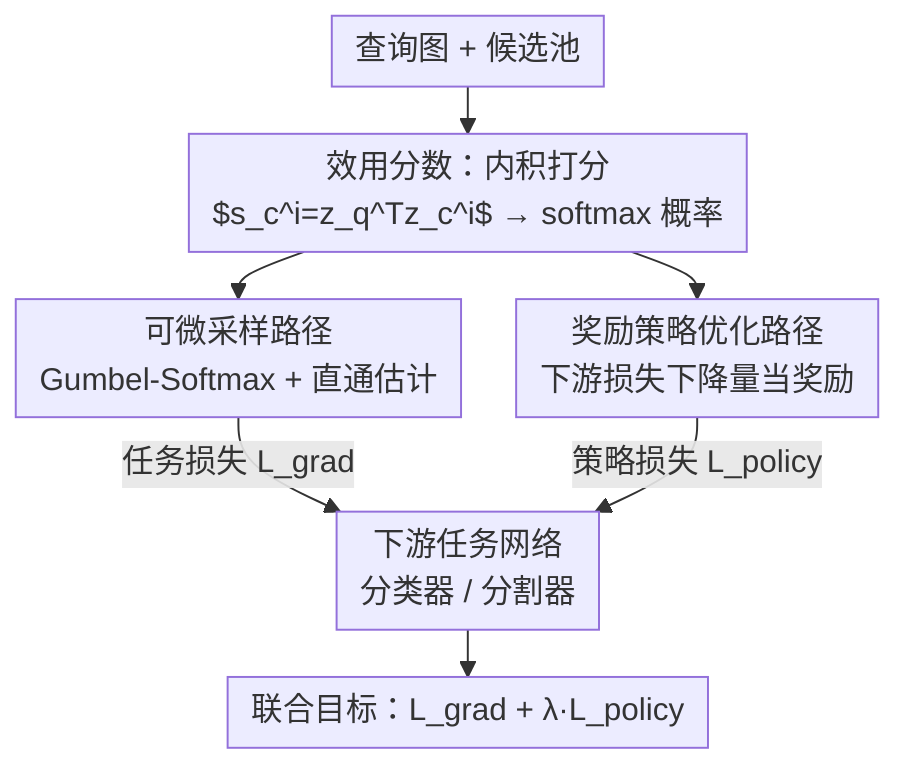

# Learning What Helps: Task-Aligned Context Selection for Vision Tasks

**会议**: CVPR 2026  
**论文**: [CVF Open Access](https://openaccess.thecvf.com/content/CVPR2026/html/Guo_Learning_What_Helps_Task-Aligned_Context_Selection_for_Vision_Tasks_CVPR_2026_paper.html)  
**代码**: 待确认  
**领域**: 检索增强 / 判别式视觉 / 上下文选择  
**关键词**: 任务对齐检索, 上下文选择, ViT, Gumbel-Softmax, 策略梯度

## 一句话总结
TACS 让判别式视觉模型（ViT）学会从候选池里挑出"真正能提升任务表现"的配对样本，而非"看起来最像"的近邻——通过可微采样路径 + 奖励驱动的策略优化路径联合训练一个选择器，把检索从静态预处理变成可学习的、由下游任务损失反向监督的环节，在 18 个数据集上稳定超越相似度检索。

## 研究背景与动机

**领域现状**：大语言模型早已学会"检索增强"——遇到不确定就去外部语料里拉相关信息来支撑预测（RAG/RAL）。但判别式视觉模型（如分类、分割用的 ViT）几乎没有把检索纳入决策的机制，少数多视图/多实例方法依赖预定义或人工配对的数据。

**现有痛点**：现有视觉系统里，检索是一个**静态的预处理步骤**——用 CLIP / DINO 这类冻结嵌入算感知相似度，挑最近邻当辅助输入，隐含假设"长得像 = 对任务有用"。但这个假设站不住：视觉相似并不保证那张图能帮 ViT 做出更好的判断。在细粒度识别里，相似度检索往往挑到近重复样本（同姿态的鸟、同光照的场景），只是强化了冗余。

**核心矛盾**：检索本质是**离散选择**（从 $N_c$ 个候选里挑一个），离散操作不可微，无法直接接收下游任务损失的梯度反馈；于是大家退而求其次用"相似度"这种与任务无关的静态代理，结果选出来的样本未必对任务有用。

**本文目标**：让一个专精的视觉模型**自己学会**——哪些上下文样本最能提升它自身的表现？把"选什么上下文"从固定启发式变成可学习、任务对齐的策略。

**切入角度**：人类专家（如放射科医生）判断良恶性时，不只参考相似既往病例，也会参考**不同**的病例来厘清诊断边界。这提示：一张**互补**的样本（暴露判别性对比，如不同姿态/光照）可能比最近邻更有用。

**核心 idea**：训练一个选择器（Selector），用"配上这个候选后下游损失下降多少"作为信号来定义"有用性"，并用**可微松弛 + 策略梯度**的混合优化让选择器直接对齐下游任务奖励。

## 方法详解

### 整体框架
TACS 由两个**联合训练**的模块组成：一个 **Selector（选择器）** 从候选池里挑出最有信息量的样本，一个 **Downstream Task Network（下游任务网络，分类器或分割器）** 用"查询图 + 被选样本"这对输入做主任务。关键在于：下游网络的梯度会反传给选择器，使检索本身成为学习目标的一部分。

给定查询图 $x_q$ 和 $N_c$ 个候选 $\{x_c^i\}$，选择器主干把它们编码成 $z_q, z_c^i$，每个候选的效用分数（utility score）取查询与候选特征的内积 $s_c^i = z_q^{\mathsf T} z_c^i$，再 softmax 成选择概率。推理时取 $\arg\max$ 选中那张图 $x_{\text{sel}}$，喂给下游网络得到预测 $\hat y = f_d(x_q, x_{\text{sel}})$。

训练时离散的 $\arg\max$ 不可微，所以选择器同时走两条互补的优化路径：**可微采样路径**提供稳定梯度流、刻画候选间平滑的效用关系；**策略优化路径**用下游任务的奖励反馈来强化"真正提升表现"的离散选择。两条路径共享选择器参数。

### 关键设计

**1. 效用分数：把"相似"重定义为"有用"**

痛点是相似度检索用的是与任务无关的冻结嵌入。TACS 不再用预先算好的 CLIP/DINO 相似度，而是让选择器主干**端到端学习**一套嵌入，使内积 $s_c^i = z_q^{\mathsf T} z_c^i$ 直接反映"任务效用"而非"视觉相似"。这个分数经 softmax 转成选择概率 $p(x_c^i|x_q)=\frac{\exp(s_c^i)}{\sum_j \exp(s_c^j)}$。因为这套嵌入是被下游任务损失反传塑造的，所以"分高"逐渐等价于"配上后任务表现好"，而不是"长得像"。这是把检索从静态预处理转成可学习组件的根基。

**2. 可微采样路径：让离散选择有梯度可传**

$\arg\max$ 选择是离散的、阻断梯度。本文用直通 Gumbel-Softmax 估计器（straight-through Gumbel-Softmax）做分类采样的可微近似：往 logits 上加 Gumbel 噪声 $g_i = -\log(-\log u_i),\ u_i\sim\mathcal U(0,1)$，再用温度 $\tau$ 控制的 softmax $p=\frac{\exp((s_c^i+g_i)/\tau)}{\sum_j \exp((s_c^j+g_j)/\tau)}$ 得到软样本，前向用直通估计输出 one-hot 的硬选择、反向保留梯度。对应目标就是标准交叉熵任务损失 $\mathcal L_{\text{grad}}=\mathcal L_{ce}(f_d(x_q,x_{\text{sel}}),y)$。这条路径在训练早期提供平滑稳定的监督，让效用关系连续可学。

**3. 奖励策略优化路径：直接奖励"真能降损失"的选择**

只有可微采样还不够——它不显式判断"加了这张检索图到底有没有让预测变好"。理想的好选择应满足 $\mathcal L_{ce}(f_d(x_q,x_c),y) < \mathcal L_{ce}(f_d(x_q,\emptyset),y)$，即配上下文比单用查询图的损失更低。于是把选择器当作一个策略 agent：观测 $o=\{z_q, z_c^1,\dots\}$、动作 $a\in\{1,\dots,N_c\}$、策略 $\pi(a|o)=\text{softmax}(s(o))$，奖励定义为下游表现的相对提升 $r(o,a)=\mathcal L_{ce}(f_d(x_q,\emptyset),y) - \mathcal L_{ce}(f_d(x_q,x_c^a),y)$——正奖励代表这张检索图确实提升了准确率。梯度从任务模型上 detach，使策略更新只依赖奖励信号。策略目标为 $\mathcal L_{\text{policy}} = -\mathbb E_{a\sim\pi}[\log\pi(a|o)\,A(o,a)]$，其中优势 $A(o,a)$ 取 batch 内标准化奖励以降方差。这条路径专门强化那些离散上、确实拉低下游损失的选择行为。

**4. 联合目标：平滑监督与决断性奖励的合流**

两条路径共享选择器参数、联合训练，让梯度和奖励作用在同一套"任务效用"的概念上。总损失 $\mathcal L_{\text{TACS}} = \mathcal L_{\text{grad}} + \lambda\,\mathcal L_{\text{policy}}$，$\lambda$ 平衡可微监督与奖励驱动（默认 $\lambda=1.0$，$\tau=0.1$）。直观上，可微路径负责早期平滑塑形、策略路径负责后期决断锐化，两者合起来既稳定又果断。

### 损失函数 / 训练策略
选择器与下游网络共享 ViT-S/16 主干，用 DINOv3 预训练权重初始化、AdamW 微调，100 epoch + 余弦退火。分类时直接拼接主图与配对图的 patch 嵌入后整模型微调；分割时冻结主干、在每个 transformer block 后插入门控交叉注意力（gated cross-attention）增强主图特征，再接轻量 DPT 头。每个数据集采样 20% 训练图构成固定候选池，并排除同患者等关联图以防数据泄漏。

## 实验关键数据

### 主实验
在 18 个数据集上评测（11 个细粒度自然图像分类 + 4 个医学分类 + 3 个医学分割），统一用 ViT-S/16 + DINOv3 初始化。

| 数据集组 | 指标 | TACS | Frozen DINO 相似检索 | No-Context | 备注 |
|----------|------|------|----------------------|-----------|------|
| 细粒度分类 Avg.（11 个） | mAcc/Acc ↑ | 88.3 | 86.6 | 86.3 | 平均 +1.7% vs 冻结检索 |
| CUB-200 | Acc ↑ | 85.2 | 81.4 | 82.1 | 提升最大，达 +3.8% |
| SUN397 | Acc ↑ | 71.8 | 69.2 | 68.0 | +2.6% |
| 医学分类 Avg.（4 个） | — ↑ | 92.9 | 92.0 | 91.0 | 平均 +0.9% vs 冻结检索 |
| DDSM | AUC ↑ | 97.4 | 96.1 | 96.1 | +1.3% AUC |
| Kvasir-SEG（分割） | IoU ↑ | 81.1 | 80.0 | 77.0 | 最高 +1.1 IoU |

注：自定义指标说明——细粒度分类按惯例报 top-1 准确率或 mean per-class accuracy（mAcc）；医学分类各数据集指标不同（APTOS 用二次加权 Cohen's Kappa、Colorectal 用 Acc、DDSM 用 ROC-AUC、ISIC2019 用 Recall）；分割报 Dice 与 IoU。"Avg." 为组内平均。

### 消融实验

**上下文配对方式的消融（Tab. 4）**：把"学习检索"换成各种固定配对，验证收益来自"选得对"而非"多塞了 token / 模型容量"。

| 配置 | 关键指标 | 说明 |
|------|---------|------|
| TACS（学习检索） | 最优 | 完整模型 |
| No context image | ↓ ~2% | 不给上下文 |
| Blank / 空图 | ≈ No-Context | 等同没给上下文 |
| Duplicate 查询图 | ≈ No-Context | 复制查询图无增益 |
| Noisy 查询图 | 不稳定 | 噪声版查询图 |
| Frozen DINO 相似检索 | 略升但远逊 TACS | 静态相似度有点用但不够 |

**优化组件的消融（Tab. 5）**：拆开可微路径与策略路径。

| 配置 | 相对表现 | 说明 |
|------|---------|------|
| 冻结检索（固定嵌入） | 基线 | 无学习 |
| 仅可微（soft）选择 | 优于固定 | 早期平滑监督 |
| 仅策略（hard）选择 | 优于固定 | 离散奖励精修 |
| 双路完整模型 | 最稳最高 | 两路互补 |

### 关键发现
- **收益随检索图的信息量缩放**：给空图或复制查询图都等同于"没给上下文"（掉约 2%），证明提升不是来自多塞图像 token 或模型容量，而是来自"选得有用"。
- **两条优化路径互补**：单独用任一路径都优于静态检索，但联合最稳——可微路径管早期平滑监督，策略路径管离散决策的奖励精修。
- **学到的策略是"互补"而非"冗余"**：相比相似检索偏爱近重复，TACS 把跨类选择率提高了 40–70%、检索样本的感知多样性（LPIPS 距离）更大；例如在 APTOS 上常把轻度与重度糖网病例配对以对比病变严重度，在 SUN397 上检索对比鲜明的场景来厘清细粒度边界。
- **在挑战性 / 数据受限场景增益最大**：细粒度（CUB/SUN397）和小样本医学任务上提升最明显，正是相似度检索最容易陷入冗余的地方。

## 亮点与洞察
- **把"有用性"操作化成可优化的奖励**：用"配上后下游损失下降量"$\mathcal L_{ce}(\cdot,\emptyset)-\mathcal L_{ce}(\cdot,x_c)$ 直接量化一张检索图的价值，绕开了"相似 ≈ 有用"的不可靠假设——这个奖励定义可迁移到任何"选辅助样本/视图"的判别任务。
- **可微 + 策略双路的工程巧思**：Gumbel-Softmax 给早期稳定梯度、策略梯度给后期决断锐化，且策略路径从任务模型 detach 梯度使奖励信号纯净，解决了"离散检索不可端到端训练"的老问题。
- **填补了判别式视觉的检索空白**：RAG/RAL 此前几乎只服务生成式/多模态大模型；本文首次把任务对齐的可学习检索引入纯视觉 ViT，对医学影像这类配对数据稀缺的领域尤其有价值。

## 局限与展望
- **候选池是固定子集**：每个数据集取 20% 训练图构成固定池，池外样本无法被选；池的覆盖度和构建方式可能影响上限，作者未深入探讨动态/全量池的代价。
- **每次只选一张配对图**：当前框架是 query 配单个 $x_{\text{sel}}$，没有讨论多样本组合检索（top-k 协同）是否更优、以及如何避免组合爆炸。
- **依赖强预训练主干**：用 DINOv3 初始化，效用嵌入的可学习性可能部分得益于好的起点；在弱主干或从头训练下效果未知。
- ⚠️ 部分消融表（Tab. 4/5）在缓存中数值不全或可能存在 OCR 噪声，具体数字以原文为准。

## 相关工作与启发
- **vs Frozen DINO 相似检索**: 他们用冻结嵌入算静态相似度挑近邻，本文用任务损失反传学一套效用嵌入挑"有用"样本，区别在于检索目标从"感知相似"换成"下游奖励"，因此能选出互补而非冗余的上下文。
- **vs REACT / SWAT（视觉检索增强）**: 它们把检索来的图当额外训练数据、检索仍是静态相似驱动；TACS 把检索做成推理过程本身的一部分，每实例、任务对齐地学选择策略。
- **vs SmartRAG / RAG-DDR / DRO（生成式可微/强化检索）**: 这些方法用可微数据奖励或策略梯度联合训练检索与生成，但只服务生成式/多模态任务、奖励看文本流畅性；本文把同一原则迁到判别式视觉，奖励直接是预测准确率的提升。

## 评分
- 新颖性: ⭐⭐⭐⭐⭐ 首次把任务对齐的可学习检索引入纯视觉判别模型，"损失下降量当奖励"的定义干净有力。
- 实验充分度: ⭐⭐⭐⭐ 18 个数据集跨自然/医学、分类/分割，消融到位；但缺多样本组合检索、动态池等更深探究。
- 写作质量: ⭐⭐⭐⭐ 动机—方法—实验逻辑顺，双路设计讲得清楚；部分公式/表格在开放版里排版较乱。
- 价值: ⭐⭐⭐⭐ 对配对数据稀缺的医学影像等领域有实用价值，奖励设计可迁移。

<!-- RELATED:START -->

## 相关论文

- [\[CVPR 2026\] Debiased Sample Selection for Learning with Noisy Labels](debiased_sample_selection_for_learning_with_noisy_labels.md)
- [\[CVPR 2026\] Towards Knowledge-augmented Bayesian Deep Learning For Computer Vision](towards_knowledge-augmented_bayesian_deep_learning_for_computer_vision.md)
- [\[CVPR 2026\] Computer Vision with a Superpixelation Camera](computer_vision_with_a_superpixelation_camera.md)
- [\[CVPR 2026\] Adapting In-context Generation for Enhanced Composed Image Retrieval](adapting_in-context_generation_for_enhanced_composed_image_retrieval.md)
- [\[CVPR 2026\] ALLNet: Multi-task Dense Prediction for Degraded Images](allnet_multi-task_dense_prediction_for_degraded_images.md)

<!-- RELATED:END -->
