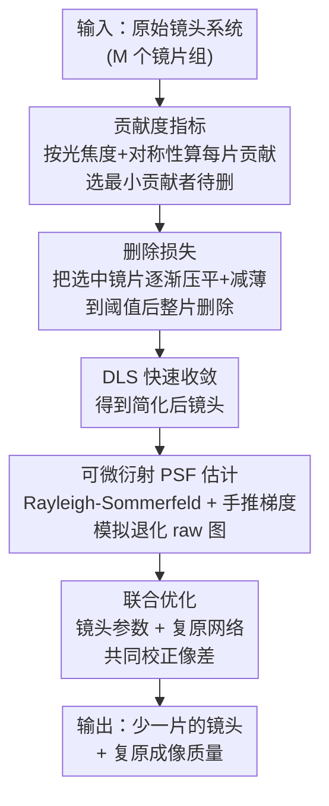

# Lens Component Deletion based on Differentiable Ray Tracing

**会议**: CVPR 2026  
**论文**: [CVF Open Access](https://openaccess.thecvf.com/content/CVPR2026/html/Zhang_Lens_Component_Deletion_based_on_Differentiable_Ray_Tracing_CVPR_2026_paper.html)  
**代码**: https://github.com/WenguanZhang/HappyLens（项目页）  
**领域**: 计算成像 / 可微光线追踪 / 联合光学设计  
**关键词**: 镜片删除, 可微光线追踪, 衍射 PSF, 联合优化, 像差校正

## 一句话总结
针对微型光学镜头的小型化/降本需求，提出一条"自动删片"流水线：用一个贡献度指标自动挑出系统中最不重要的镜片，用一个删除损失把它逐渐压薄压平直至安全删除，再配合基于 Rayleigh-Sommerfeld 衍射理论的可微 PSF 估计，把简化后镜头与后处理复原网络联合优化，在删掉一片镜片后仍能保持与原系统相当的成像质量。

## 研究背景与动机
**领域现状**：光学镜头系统在电动车、手机、便携相机等场景里越来越追求紧凑和低成本。传统上要设计"片数更少"的镜头，得靠资深光学工程师在商业软件（如 Zemax）里反复手工调，往往要花几天甚至几周；近年兴起的可微光线追踪让镜头与下游网络可以联合优化，已经在衍射光学元件、全光谱成像、扩展景深、HDR、深度估计等任务上展现潜力。

**现有痛点**：现有联合设计流水线主要有两类问题。其一，简化设计高度依赖专家经验——用非球面/自由曲面换多片球面镜虽能校正像差，但加工难度和成本大幅上升，靠 MTF 或 Seidel 像差系数做约束的方法仍需大量人工调参。其二，号称"可微图像退化仿真"的方法大多只建模**几何退化**（几何 PSF），忽略了衍射效应；而对微型成像系统，几何 PSF 与真实退化偏差很大，导致联合优化在实际落地时失真。

**核心矛盾**：要"自动地删掉一片镜片"，删除动作本身是离散、不可微的——直接抠掉一组镜片往往让系统直接崩溃（无法成像/无法优化）；而要补偿删片后的像差，又必须有一个对微型系统**足够准、又足够省显存**的可微 PSF 模型，否则联合优化跑不起来。

**本文目标**：把"删哪一片 + 怎么安全删 + 删后如何复原"三件事都做成自动、可微、端到端的流程。

**切入角度**：删片不是"一刀切"，而是先用物理量化每片镜片的贡献，挑出影响最小的那片，再用一个损失把它**渐进式地压扁压薄**到可以无痛移除；同时把几何 PSF 换成衍射 PSF，并手动推导梯度来绕开自动微分的显存爆炸。

**核心 idea**：用"贡献度指标选片 + 删除损失渐进压扁 + 可微衍射 PSF 联合复原"替代专家手工简化，让删片这个离散操作变成稳定可优化的连续过程。

## 方法详解

### 整体框架
流水线分两大模块。**模块一（删片与镜头优化）**：每轮优化先用贡献度指标算出每片镜片对系统的贡献，选贡献最小的那片作为待删目标；为防止直接删除导致系统崩溃，引入删除损失，逼迫这片镜片逐渐"压平 + 减薄"，直到满足阈值条件被程序整片删除，随后用阻尼最小二乘法（DLS, Zemax 标准优化）让镜头系统快速收敛。**模块二（联合优化复原）**：用基于 Rayleigh-Sommerfeld 衍射模型的可微 PSF 估计模拟删片后镜头的退化原始图像（空间变化卷积 + 重新马赛克），再用复原网络（DeepSN）在 ISP 后处理链里做像差校正，把镜头参数和网络参数联合训练。

### 关键设计

**1. 贡献度指标：用物理量自动判断哪片镜片最该删**

要"自动选片"，就得有一个客观标准衡量每片镜片对成像的重要性，否则只能靠工程师拍脑袋。作者受已有工作启发，从**光焦度贡献**和**对称性**两个角度刻画每个折射面。对含 $N$ 个面的一个镜片，第 $i$ 面在入射角 $\theta_i$、波长 $\lambda$ 下的光焦度贡献为 $p_i(\lambda,\theta_i)=\left(\frac{n_{i+1}(\lambda)}{l_{i+1}}-\frac{n_i(\lambda)}{l_i}\right)\cdot\sin\phi_i$，对称性为 $a_i(\lambda,\theta_i)=\left(\frac{u_{i+1}}{n_{i+1}(\lambda)}-\frac{u_i}{n_i(\lambda)}\right)\cdot\sin\theta_i\cdot n_i(\lambda)$。借助 GPU，作者把**所有采样光线**（而非只用主光线和边缘光线）都纳入统计，对全部光线求和得到该面的总光焦度贡献 $P_i$ 和对称性 $A_i$，再把一片镜片所有面合起来：$C=\left(\sum_{i=1}^{N}P_i\right)\cdot\left(\sum_{i=1}^{N}A_i\right)$。最后把所有镜片的 $C_j$ 归一化到和为 1，挑贡献最小者删。相比传统只看少数代表光线，全光线统计让贡献评估更贴近真实成像，删错片的风险更低。

**2. 删除损失：把"硬删"变成"渐进压扁"，避免系统崩溃**

直接把选中镜片抠掉常导致系统彻底失效——要么无法成像、要么无法优化。删除损失的思路是：不立刻删，而是逼着这片镜片**慢慢压平、慢慢变薄**，平滑过渡到可以无害移除的状态。镜片第 $i$ 面用二次曲面 $z_i(x,y)=\frac{(x^2+y^2)c_i}{1+\sqrt{1-(1+\kappa_i)(x^2+y^2)c_i^2}}$ 表示（$c_i$ 曲率半径、$\kappa_i$ 二次项系数）。删除损失含两项：压平损失 $L_{\text{flat}}=\sum_{i=1}^{N}\max|z_i(x,y)|$ 逼面型趋于平面；残差损失 $L_{\text{res}}=\sum_{i=1}^{N-1}\max|-z_i(x,y)+t_i+z_{i+1}(x,y)|$ 逼镜片整体减薄（$t_i$ 为厚度）。当 $L_{\text{flat}}<\Omega$ 或 $L_{\text{res}}<\Omega$（阈值 $\Omega=\alpha\cdot\max(D_1,\dots,D_N)$，$D_i$ 为通光口径，经验值 $\alpha=0.02$）即整片删除。删除损失权重 $\omega_{\text{del}}=100$、光学损失权重 $\omega_{\text{opt}}=1$。消融显示：不用删除损失而直接删 + DLS，系统会卡在很差的局部极小（Double Gauss 的 Avg Spot RMS 从 1.2µm 恶化到 42.5µm），印证了渐进压扁对优化稳定性的关键作用。

**3. 可微 Rayleigh-Sommerfeld 衍射 PSF：又准又省显存的退化建模**

微型镜头里衍射效应不可忽略，纯几何 PSF 偏差太大。作者改用 Rayleigh-Sommerfeld 衍射理论：光线先正向追迹到像面、再反向追迹到出瞳面，像面点 $(x,y)$ 的复振幅 $E(x,y)=\iint_\Sigma \frac{jk r^{-1}}{-2\pi r}E(x_0,y_0)e^{jkr}\cos(\vec n,\vec r)\,dx_0dy_0$，PSF 为 $\mathrm{PSF}(x,y)=E^*(x,y)E(x,y)$。关键工程点在于：直接用自动微分（AD）会因存储所有中间变量而显存爆炸，作者**手动推导 PSF 对各坐标和光程的解析梯度**（如 $\frac{\partial\mathrm{PSF}}{\partial x}=\frac{\partial\mathrm{PSF}}{\partial r}\frac{x-x_0}{r}$ 等），用正向追迹数据直接算梯度。这样在计算时间几乎不变的前提下大幅降低显存，使每轮能算更多 PSF、给网络训练留出显存，保证联合优化跑得通。实验显示其 PSF 形态与 Zemax 一致性明显优于几何 PSF 方法 DeepLens ⚠️（论文图中标注为 DeepLens / 几何 PSF 方法 [31]，以原文为准）。

**4. 联合优化：镜头与复原网络一起训，而非各管各的**

删片后镜头会引入额外像差，若只固定镜头、单独训复原网络（separate design），复原上限受限。本文把镜头参数与复原网络（DeepSN）放进一个联合损失里同训：$L_{\text{total}}=L_{\text{img}}+\omega\cdot L_{\text{opt}}$，其中 $L_{\text{img}}$ 沿用 DeepSN 的图像损失，光学损失 $L_{\text{opt}}=L_{\text{spot}}+L_{\text{dist}}+L_{\text{efl}}+L_{\text{fno}}+L_{\text{ttl}}+L_{\text{bfl}}+L_{\text{gla\,min}}+L_{\text{gla\,max}}+L_{\text{air\,min}}+L_{\text{surf}}$ 同时约束成像指标（RMS 光斑、畸变）和物理约束（焦距、F 数、总长、后焦距、玻璃/空气厚度、面型斜率）防止镜头跑偏。消融显示去掉 $L_{\text{opt}}$ 后焦距、F 数与原系统严重偏离、光斑显著变差（USP4488788 复原 PSNR 从 40.79 掉到 38.22）。联合训练让镜头"主动往好复原的方向变形"，复原质量优于固定镜头的分离设计。

## 实验关键数据

### 实验设置
在两套镜头上验证：短焦系统选专利 USP4488788（五片结构，焦距 6.84mm，FOV 62°，F/3.35）；长焦系统选经典 Double Gauss（四组六片，焦距 22.5mm，FOV 20°，F/3.95）。数据用 FiveK，训练用 3840×2160 的 raw 图、测试用 4800×2700。NVIDIA RTX 4090 ⚠️（原文写 "GTX 4090"，应为笔误，以原文为准），Adam，镜头与网络学习率均 1e-3，patch 256×256，batch 16。

### 主实验：删片后成像质量（FiveK）

| 镜头 | 方法 | 复原 PSNR↑/SSIM↑/LPIPS↓ | EFFL | F# | Avg Spot RMS |
|------|------|------|------|------|------|
| Double Gauss | Original | -/-/- | 22.50mm | 3.95 | 1.0µm |
| Double Gauss | Del. Separate | 40.90/0.9785/0.0169 | 22.50mm | 3.95 | 1.2µm |
| Double Gauss | **Del. Joint (Ours)** | **41.26/0.9797/0.0166** | 22.50mm | 3.94 | 1.2µm |
| USP4488788 | Original | -/-/- | 6.83mm | 3.20 | 3.5µm |
| USP4488788 | Del. Separate | 40.65/0.9745/0.0345 | 6.83mm | 3.20 | 2.7µm |
| USP4488788 | **Del. Joint (Ours)** | **40.79/0.9759/0.0287** | 6.83mm | 3.20 | 2.5µm |

两套镜头删掉一片后，联合设计的复原质量都优于分离设计，且与原始（未删片）镜头质量相当甚至更好——尤其 USP4488788 删片后 Avg Spot RMS 反而从 3.5µm 降到 2.5µm。

### 消融实验

| 配置 | 关键结果 | 说明 |
|------|---------|------|
| 强删 C1 / C2 | 系统失效 | 删错片直接崩溃 |
| 强删 C5 | ✓ 但 Spot RMS 9.8µm | 删非最优片，光斑差 |
| w/ 贡献度指标（删 C4） | ✓ Spot RMS 2.7µm | 自动选对片，光斑最好 |
| Double Gauss w/ 删除损失+DLS | ✓ Spot RMS 1.2µm | 渐进压扁稳定收敛 |
| Double Gauss w/o 删除损失+DLS | 卡在局部极小，Spot RMS 42.5µm | 直接删导致优化失败 |
| USP4488788 w/o $L_{\text{opt}}$ | 复原 38.22/0.9598，EFFL 漂到 7.45mm | 焦距/F 数失控、质量下降 |
| USP4488788 w/ $L_{\text{opt}}$ | 复原 40.79/0.9759，EFFL 6.83mm | 物理约束保住系统 |

### 关键发现
- **删片选择是成败关键**：强删 C1/C2 直接让系统失效，强删 C5 能成但光斑差（9.8µm），而贡献度指标选出的 C4 光斑最好（2.7µm）——选错片几乎前功尽弃。
- **删除损失对优化稳定性至关重要**：去掉后 Double Gauss 卡在局部极小，Spot RMS 恶化 35 倍（1.2µm→42.5µm）。
- **联合 > 分离**：联合优化让镜头主动配合复原网络变形，复原 PSNR/SSIM/LPIPS 全面优于固定镜头的分离设计。
- **衍射 PSF 不可省**：几何 PSF 在微型系统里与真实退化偏差大，本文衍射 PSF 与 Zemax 在色彩保真和模糊形态上最接近。

## 亮点与洞察
- **把离散删片变连续可优化**：删除损失用"压平 + 减薄"两项把"删一片镜片"这个离散动作平滑成连续优化过程，避免系统崩溃，这种"渐进消融"思路可迁移到其他需要删模块/删通道的结构搜索任务。
- **手推梯度绕开 AD 显存墙**：对衍射 PSF 解析推导梯度而非依赖自动微分，时间几乎不变却大幅省显存——在物理可微仿真里"用解析梯度换显存"是很实用的工程 trick。
- **全光线贡献评估**：用 GPU 把所有采样光线纳入贡献度统计，比传统只用主/边缘光线更接近真实成像，提升选片准确性。
- **物理约束嵌进 loss**：把焦距、F 数、总长等硬性光学指标做成可微约束项，保证优化出的镜头物理上可制造，而非数值上好看。

## 局限与展望
- 仅在两套经典镜头（USP4488788、Double Gauss）上验证，删片数量也只演示了"删一片"，对删多片、更复杂自由曲面系统的可扩展性未充分验证。
- 贡献度指标的具体每片数值放在补充材料、正文未给完整对比，指标对不同镜头结构的普适性需更多证据。
- 依赖 Zemax 的 DLS 做收敛，流程并非完全脱离商业软件。
- 联合优化耦合了 DeepSN 复原网络，复原上限部分取决于该网络能力，换更强复原网络是否进一步提升值得探究。

## 相关工作与启发
- **vs 几何 PSF 联合设计（如 DeepLens / [31]）**：他们只建模几何退化、忽略衍射，对微型系统失真；本文用 Rayleigh-Sommerfeld 衍射 PSF 并手推梯度，更准且省显存。
- **vs 传统专家简化（非球面/自由曲面替换、Seidel 像差约束 [32]）**：他们靠工程师手工调参、加工成本高；本文自动选片 + 渐进删除，显著降低对专家经验的依赖。
- **vs 分离设计（先固定镜头再训网络）**：本文联合优化让镜头与复原网络互相适配，复原质量更高。

## 评分
- 新颖性: ⭐⭐⭐⭐ 删除损失把离散删片做成连续优化、手推衍射 PSF 梯度省显存，都是有新意的工程化创新
- 实验充分度: ⭐⭐⭐ 两套镜头 + 完整消融到位，但镜头种类和删片数量偏少，跨结构普适性证据不足
- 写作质量: ⭐⭐⭐⭐ 公式与流程交代清晰，图文对照充分（缓存中部分 PSF/网络名疑似 OCR 噪声）
- 价值: ⭐⭐⭐⭐ 面向手机/车载等微型镜头小型化降本的实际需求，自动删片流水线落地价值明确

<!-- RELATED:START -->

## 相关论文

- [\[CVPR 2025\] Radio Frequency Ray Tracing with Neural Object Representation for Enhanced RF Modeling](../../CVPR2025/others/radio_frequency_ray_tracing_with_neural_object_representation_for_enhanced_rf_mo.md)
- [\[CVPR 2026\] Differentiable Stroke Planning with Dual Parameterization for Efficient and High-Fidelity Painting Creation](differentiable_stroke_planning_with_dual_parameterization_for_efficient_and_high.md)
- [\[CVPR 2026\] DiffBMP: Differentiable Rendering with Bitmap Primitives](diffbmp_differentiable_rendering_with_bitmap_primitives.md)
- [\[ICML 2026\] DisjunctiveNet: Neural Symbolic Learning via Differentiable Convexified Optimization Layers](../../ICML2026/others/disjunctivenet_neural_symbolic_learning_via_differentiable_convexified_optimizat.md)
- [\[NeurIPS 2025\] Improving Decision Trees through the Lens of Parameterized Local Search](../../NeurIPS2025/others/improving_decision_trees_through_the_lens_of_parameterized_local_search.md)

<!-- RELATED:END -->
