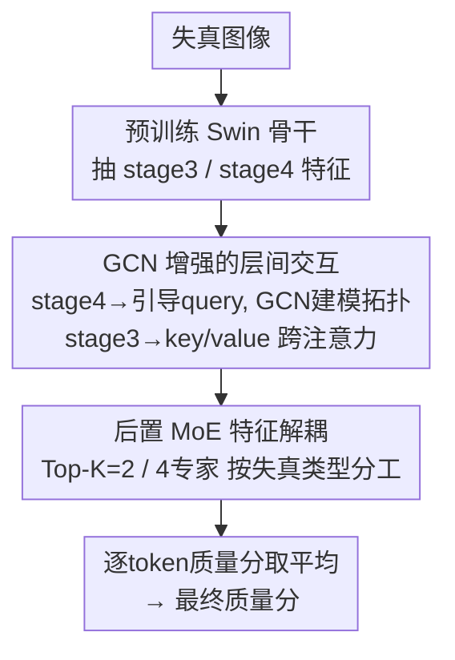

# Life-IQA: Boosting Blind Image Quality Assessment through GCN-enhanced Layer Interaction and MoE-based Feature Decoupling

**会议**: CVPR 2026  
**论文**: [CVF Open Access](https://openaccess.thecvf.com/content/CVPR2026/html/Tang_Life-IQA_Boosting_Blind_Image_Quality_Assessment_through_GCN-enhanced_Layer_Interaction_CVPR_2026_paper.html)  
**代码**: 无  
**领域**: 图像质量评估 / 低层视觉  
**关键词**: 盲图像质量评估, GCN, 混合专家(MoE), Transformer解码器, 跨层交互

## 一句话总结
针对盲图像质量评估(BIQA)中"把所有层特征一股脑融合反而引入噪声"的问题，Life-IQA 只用骨干网最深两层特征做质量解码：用 GCN 增强的查询拓扑把 stage4 特征当 query、stage3 特征当 key/value 做跨层交互，再用一个后置的 MoE 头按失真类型解耦特征，在七个 BIQA 基准上以约 95M 参数取得 SOTA。

## 研究背景与动机
**领域现状**：主流 BIQA 方法用 ImageNet 预训练骨干网(ResNet/Swin 等)抽多尺度特征，然后把浅层(stage1/2，编码局部纹理)和深层(stage3/4，编码全局语义)特征融合后送进回归头预测质量分。这套做法默认"不同层级特征互补"。

**现有痛点**：作者用六个预训练骨干在真实失真数据集 LIVEC 上逐层挂一个简单回归头(GAP+线性层)测各层单独的预测能力，发现浅层(stage1/2)的 SROCC 系统性地差于深层(stage3/4)——在 ResNet50 上 stage1 与 stage4 的 SROCC 差距达 0.178。再用 t-SNE 看 KADID-10k 上 stage1 与 stage4 的特征分布：stage1 特征纠缠在一起、类边界严重模糊，而 stage4 形成紧致可分的簇。

**核心矛盾**：IQA 数据量本就有限，模型很难从被细节主导的浅层特征里学到有效的质量表征；把所有层"完整且直接"地融合，反而往质量解码里灌进噪声和冗余。同时，虽然各种编码器骨干被反复研究，**质量解码端的架构却几乎没人碰**——DEIQT 第一个搭了编码器-解码器，但它的 query 只来自 ViT 的单个 CLS token，视角单一、效果完全受制于上游编码器质量。

**本文目标**：(1) 量化各层对 BIQA 的真实贡献并据此重新设计解码路径；(2) 设计一个数据高效、能区分不同失真类型的质量解码器。

**切入角度**：既然浅层贡献小，就**放弃传统多尺度融合**，把精力放在让"更深、语义更丰富"的特征之间高效交互。

**核心 idea**：用 stage4 当 query、stage3 当 key/value 做跨层交互(并用 GCN 显式建模 query 之间的拓扑)，再用一个后置 MoE 头把融合特征按失真维度解耦——把"融合什么层"和"怎么解码"两件事都重新设计。

## 方法详解

### 整体框架
输入失真图像，先过预训练 Swin Transformer 抽出 stage3($\tfrac{H}{16}\times\tfrac{W}{16}\times C_3$)和 stage4($\tfrac{H}{32}\times\tfrac{W}{32}\times C_4$)两路深层特征；GCN 增强的层间交互模块把 stage4 压缩成引导式 query、把 stage3 池化成上下文序列做跨注意力融合；融合结果送进后置的 MoE 头按失真类型解耦；最后每个 query token 各出一个质量分，取平均得到最终图像质量分。整条链路只动最深两层，刻意绕开了不稳定的全尺度融合。

### 关键设计

**1. 深层特征主导的观察：少融合、只交互最深两层**

这是全文的出发点，也直接决定了后面架构"只用 stage3/4"的取舍。作者用六个骨干在 LIVEC 上逐层挂简单回归头量化各层贡献，发现浅层(stage1/2)的 SROCC 系统性弱于深层；t-SNE 进一步显示浅层特征类边界模糊、深层特征簇紧致可分。结论是：在小数据的 IQA 场景下，浅层细节特征学不出可靠的质量表征，把全部层级直接融合会引入噪声与冗余。于是 Life-IQA 不做传统多尺度融合，而是只让 stage3、stage4 这两层语义最丰富的特征做高效交互——这个"减法"是后两个模块成立的前提。

**2. GCN 增强的层间交互：把 stage4 当 query、stage3 当 key/value 并显式建模 query 拓扑**

标准 Transformer 解码器用一组可学习 embedding $Q_{init}\in\mathbb{R}^{N\times D}$($D{=}384$)当初始 query，但它在特征空间里没有和图像内容相关的"锚点"，学习低效。Life-IQA 让 stage4 经 $1\times1$ 卷积降维、GAP 压成全局上下文向量 $v_{global}$，再广播到长度 $N$ 加到 $Q_{init}$ 上得到引导式 query：$Q'_{init}=\text{expand}(\text{GAP}(\text{conv}_1(stage4)))+Q_{init}$，让每个 query 一上来就带着图像整体质量属性的先验，显著加速收敛。

更关键的是，标准自注意力里 query/key 是逐 token 独立线性投影生成的、彼此"看不见"，导致 query 之间缺乏协同、抓不住结构化依赖。作者用一个三层 GCN 替换自注意力里的 query-key 交互：把 $Q'_{init}$ 视为图上 $N$ 个节点，用**可学习的邻接矩阵** $A_i\in\mathbb{R}^{N\times N}$ 自适应捕捉 query 间关系，逐层传播 $Q_{l}=\sigma(A_l\cdot H_{l-1}\cdot W_{l-1})$，输出 $Q_3$ 带上了邻域上下文。融合端利用跨注意力 query 与 key/value 不必同尺度的特性，把 stage3 用分块平均池化(划成 $N\times N$ 网格、每格做平均)压成紧凑序列 $S\in\mathbb{R}^{N^2\times D}$ 当 key/value，$Q_3$ 当 query 做跨注意力，让每个 query 自适应地从局部区域里聚合最相关的语义。

**3. 后置 MoE 特征解耦：把 MoE 放在解码末端做"集成裁决"而非替换 FFN**

图像失真类型多种多样，单一 FFN 的固定映射既限制表达力、又在小数据上易过拟合(FFN 约占解码器 70% 参数)。直觉做法是把 MoE 当 FFN 等价物塞进每个解码层，但那样参数随专家数线性膨胀(2/4/8 专家约 2.36M/4.73M/9.46M)，在小规模 IQA 数据上又训不动稀疏路由，效果常和原 FFN 持平。Life-IQA 的做法是把 MoE **后置**到整个解码流程末端，对高度精炼后的特征做最终集成裁决——这样不依赖专家预训练就能拿到更稳健的质量判断。

具体地，门控 $g_i=W_g\cdot X_i+b_g$ 给每个 token 排序专家，只保留 Top-K(K=2)、其余 logits 置 $-\infty$ 后 softmax 得稀疏权重，按权重聚合被选专家(每个专家是独立 MLP)的输出。为防专家负载失衡，训练时加 router z-loss $L_z$ 与负载均衡 loss $L_{aux}$；再用一个由可学习标量 $\gamma$ 控制的正则旁路 $Y_{final}=Y_{MoE}(X)+\gamma\cdot X$ 抑制路由带来的梯度方差。总损失为 $L_{total}=L_{main}+\lambda_1 L_{aux}+\lambda_2 L_z$($\lambda_1{=}0.01,\lambda_2{=}0.001$)，其中 $L_{main}$ 是质量分的 L1 损失。作者称这是首个把 MoE 用进 BIQA 的工作。

### 损失函数 / 训练策略
解码器 4 层、query 数 $N{=}6$、MoE 4 专家 Top-K=2、6 头注意力、嵌入维 384；Adam 优化，合成失真数据集学习率 $2\times10^{-4}$、真实失真 $2\times10^{-5}$；训练 30 epoch，每 10 epoch 学习率 ×0.01 衰减。每个数据集随机 8:2 划分、重复 10 次取 SROCC/PLCC 中位数。

## 实验关键数据

> 评价指标：**SROCC**(Spearman 秩相关系数，衡量预测分与主观分的排序一致性)、**PLCC**(Pearson 线性相关系数，衡量数值线性吻合度)，两者越高越好。

### 主实验
在七个基准上与多种 SOTA 比较(Swin-Base 骨干，约 95M 参数)：

| 数据集 | 指标 | Life-IQA | DEIQT(24M) | VISGA |
|--------|------|----------|-----------|-------|
| CSIQ | SROCC/PLCC | **0.966 / 0.971** | 0.946 / 0.963 | 0.960 / 0.971 |
| TID2013 | SROCC/PLCC | **0.918 / 0.930** | 0.892 / 0.908 | 0.901 / 0.914 |
| KADID-10K | SROCC/PLCC | 0.940 / 0.943 | 0.889 / 0.887 | 0.939 / 0.944 |
| KonIQ | SROCC/PLCC | **0.943 / 0.946** | 0.921 / 0.934 | 0.931 / 0.940 |
| LIVEC | SROCC/PLCC | 0.896 / 0.919 | 0.875 / 0.894 | 0.882 / 0.912 |

相比 24M 的 DEIQT、34M 的 FsPN 等紧凑模型精度提升明显；相比 151M 的 LIQE、152M 的 TRes 等大模型则以更省的参数取得相当或更优结果。跨库泛化(KonIQ 训练→其他库测)在六个指标中五个排第一：CSIQ 0.715/0.738、TID2013 0.453/0.578、LIVE 0.822/0.800。

### 消融实验

解码器变体替换(参数预算对齐，表 4)与组件移除(表 5)：

| 配置 | CSIQ SROCC/PLCC | KADID-10K SROCC/PLCC | 说明 |
|------|----------------|----------------------|------|
| Life-IQA(完整) | **0.966 / 0.971** | **0.940 / 0.943** | 完整模型(约 95M) |
| GCN→MHA | 0.942 / 0.954 | 0.917 / 0.914 | 用普通多头注意力替 GCN |
| MoE→FFN | 0.952 / 0.960 | 0.924 / 0.925 | 用标准 FFN 替 MoE 头 |
| SwinT+decoder | 0.959 / 0.968 | 0.926 / 0.926 | 香草 Transformer 解码器 |
| w/o stage3(K/V 路径) | 0.938 / 0.952 | 0.933 / 0.934 | 去掉深层引导融合路径 |
| w/o MoE | 0.934 / 0.949 | 0.920 / 0.921 | 去掉 MoE 头掉点最多 |
| w/o GCN | 0.952 / 0.963 | 0.931 / 0.931 | 去掉 query 拓扑建模 |

### 关键发现
- **去掉 MoE 头掉点最多**(CSIQ SROCC 0.966→0.934)，说明末端的专家集成裁决是主要增益来源；去掉 stage3 的 K/V 路径或 GCN 也都稳定掉点，三者(深层交互、query 拓扑、专家头)缺一不可。
- **数据高效**：在 LIVE/LIVEC/KonIQ 上仅用 20% 训练数据，Life-IQA 就已超过 DEIQT；40%/60% 数据下优势继续扩大，印证"只用深层特征 + 后置 MoE"对小数据更友好。
- **骨干越大越好**：Swin-T→S→B 性能单调上升；可视化显示注意力从 epoch 0 的散乱逐步聚焦到主体物与失真区域，说明模型在学与人眼感知对齐的质量线索。

## 亮点与洞察
- **先做"层贡献量化"再设计架构**：用逐层挂回归头 + t-SNE 把"浅层没用"这件事量化出来，再据此做减法——这种"先诊断后设计"的范式比直接堆模块更有说服力，结论也可迁移到其他低层视觉任务。
- **MoE 后置而非替 FFN**：一个反直觉但很实在的工程洞察——在小数据任务上，把 MoE 当 FFN 塞进每层只会让参数白白膨胀、稀疏路由训不动；放到末端做集成裁决反而稳。这个"放在哪"的取舍对所有想在小数据上用 MoE 的任务都有参考价值。
- **用 GCN 显式建模 query 拓扑**：把"query 之间互相看不见"这个自注意力盲点用可学习邻接矩阵补上，是个可复用的 trick——任何用 learnable query 的解码器(检测/分割的 DETR 系)都能借鉴。

## 局限与展望
- 作者承认每个专家对"失真特异 + 语义"信息的刻画还能更强，是后续方向。
- 方法强依赖 query 数 $N{=}6$、4 专家 Top-K=2 等固定配置，论文未充分给出这些超参在不同数据规模下的敏感性曲线，自动适配能力存疑。⚠️
- 只在标准 BIQA 基准上验证，对 AIGC 图像、超分辨/压缩等更复杂混合失真的泛化未测；"后置 MoE 不需专家预训练"的结论是否在更大数据上仍成立也待验证。
- 公式 (15) 的 $L_{main}$ 在原文写作 $\tfrac1N\sum(\hat y_i-y_i)$ 未带绝对值符号，按 L1 损失语义应为 $|\hat y_i-y_i|$，⚠️ 以原文为准。

## 相关工作与启发
- **vs DEIQT**：DEIQT 第一个为 BIQA 搭编码器-解码器，但 query 只来自单个 CLS token、视角单一且受制于编码器质量；Life-IQA 用 stage4 引导 query + GCN 拓扑 + stage3 跨层 K/V，信息源更丰富、解码更灵活，多库精度全面领先。
- **vs 传统多尺度融合(DACNN 等)**：他们默认各层互补、直接拼接所有层；Life-IQA 用实验证明浅层在小数据上反而是噪声源，只交互最深两层，更稳更省。
- **vs NLP 里的 MoE(Mixtral 等)**：NLP 把 MoE 当 FFN 替换、靠大规模预训练优化稀疏路由；Life-IQA 在小数据 IQA 上把 MoE 后置做集成裁决，绕开了对专家预训练的依赖。

## 评分
- 新颖性: ⭐⭐⭐⭐ 首个把 MoE 用进 BIQA，"后置 MoE + GCN query 拓扑 + 只交互深层"组合有新意，但每个组件单看都不算全新。
- 实验充分度: ⭐⭐⭐⭐⭐ 七个库 + 跨库 + 数据高效 + 骨干规模 + 两套消融 + 可视化，覆盖很全。
- 写作质量: ⭐⭐⭐⭐ 动机由实验逐步推出、逻辑清晰；个别公式记号略糙。
- 价值: ⭐⭐⭐⭐ 在 BIQA 上以中等参数拿到 SOTA，"先诊断层贡献再做减法"与"MoE 后置"的思路有迁移价值。

<!-- RELATED:START -->

## 相关论文

- [\[CVPR 2026\] Rethinking Knowledge Transfer in Image Quality Assessment: A Perceptual Preference Structure Alignment Perspective](rethinking_knowledge_transfer_in_image_quality_assessment_a_perceptual_preferenc.md)
- [\[CVPR 2026\] Large-scale Robust Enhanced Ensemble Clustering via Outlier Decoupling](large-scale_robust_enhanced_ensemble_clustering_via_outlier_decoupling.md)
- [\[CVPR 2026\] Adapting In-context Generation for Enhanced Composed Image Retrieval](adapting_in-context_generation_for_enhanced_composed_image_retrieval.md)
- [\[CVPR 2026\] ArtiMuse: Fine-Grained Image Aesthetics Assessment with Joint Scoring and Expert-Level Understanding](artimuse_fine-grained_image_aesthetics_assessment_with_joint_scoring_and_expert-.md)
- [\[CVPR 2026\] Temporal Interaction in Spiking Transformers with Multi-Delay Mixer](temporal_interaction_in_spiking_transformers_with_multi-delay_mixer.md)

<!-- RELATED:END -->
