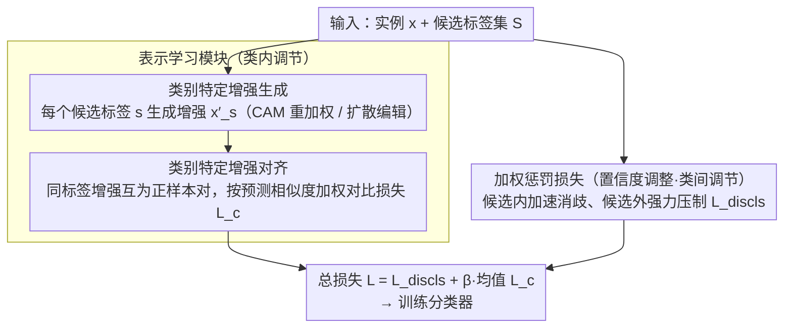

# Mitigating Instance Entanglement in Instance-Dependent Partial Label Learning

**会议**: CVPR2026  
**arXiv**: [2603.04825](https://arxiv.org/abs/2603.04825)  
**代码**: [RyanZhaoIc/CAD](https://github.com/RyanZhaoIc/CAD)  
**领域**: others (弱监督学习 / 偏标签学习)  
**关键词**: Partial Label Learning, Instance Entanglement, Class-specific Augmentation, Contrastive Learning, Weakly Supervised Classification

## 一句话总结
针对实例依赖偏标签学习 (ID-PLL) 中相似类别实例因特征和候选标签重叠导致的"实例纠缠"问题，提出 CAD 框架，通过类别特定增强的类内对齐和加权惩罚损失的类间分离，双管齐下缓解类混淆。

## 研究背景与动机

**偏标签学习的实际需求**：现实中获取精确标签成本高昂，偏标签学习 (PLL) 允许每个样本关联一组候选标签（含真实标签），可通过众包、网络挖掘等方式低成本获取，具有广泛应用价值。

**实例依赖假设更贴近现实**：传统 PLL 假设候选标签与实例特征无关（随机或类别相关噪声），但现实中标签歧义往往取决于实例特征——例如，银狐犬更容易被标注为"狐狸"而柯基犬则不会。

**实例纠缠问题被忽视**：在 ID-PLL 中，来自相似类别的实例共享重叠特征和候选标签（如银狐犬和北极狐），导致严重的类混淆。统计显示 CIFAR-10 上最混淆类对有 96.62% 的实例共享候选标签。

**对比学习的局限性**：现有 SOTA 方法（如 ABLE、DIRK）依赖对比学习拉近同类实例表示，但对纠缠实例反而会错误对齐不同类别样本，加剧类边界模糊。

**类间距离不足**：仅优化类内对齐而不显式增大类间距离，会使纠缠实例在迭代训练中持续提供错误消歧信号，最终恶化分类性能。

**纠缠实例普遍存在且影响显著**：实验表明即使在余弦相似度阈值 >0.90 时，Fashion-MNIST 仍有 52.9 万对纠缠实例；随着相似度增加，现有方法在这些样本上的准确率急剧下降。

## 方法详解

### 整体框架

ID-PLL 的核心障碍是"实例纠缠"：相似类别的样本（如银狐犬和北极狐）既共享重叠特征又共享候选标签，现有靠对比学习拉近同类表示的方法反而会把它们错误对齐。CAD（Class-specific Augmentation based Disentanglement）的思路是双管齐下——一边在类内把同一类别的特征对齐收紧，一边在类间显式拉开易混淆类别的距离。整个模型由**表示学习模块**（类内调节，含「类别特定增强生成」与「类别特定增强对齐」两步）和**置信度调整模块**（类间调节，即「加权惩罚损失」）组成，总损失把两者加权相加：$\mathcal{L}(\boldsymbol{x}, \mathcal{S}) = \mathcal{L}_{discls}(\boldsymbol{x}) + \frac{\beta}{|\mathcal{S}|}\sum_{s \in \mathcal{S}}\mathcal{L}_c(\boldsymbol{x}'_s)$，$\beta$ 控制两个模块的权重。下图给出整体数据流：原始实例兵分两路，一路按候选标签逐个生成增强并做对比对齐（类内），一路送进分类器做候选/非候选的置信度调整（类间），两路损失汇合训练同一个分类器。

### 关键设计

**1. 类别特定增强生成：把"这个样本属于哪个候选类"显式画出来**

针对纠缠实例特征混在一起、无从分辨的痛点，CAD 不直接在原图上做文章，而是对每个实例 $\boldsymbol{x}$ 及候选标签集 $\mathcal{S}$ 中的每个标签 $s$，生成一张专门强化该类特征的增强图 $\boldsymbol{x}'_s$。论文给了两条实现路径：轻量版 CAD-CAM 用 Class Activation Mapping 定位类别相关区域，按 $\boldsymbol{x}'_s = \boldsymbol{a}_s \odot \boldsymbol{x} + \epsilon \cdot (\boldsymbol{1} - \boldsymbol{a}_s) \odot \boldsymbol{x}$ 放大该类特征、淡化无关区域，无需任何外部模型；重型版直接用 InstructPix2Pix 以类别名为指令编辑图像，语义更丰富但离线生成约多花 24% 训练时间。这样一来，同一张图对应不同候选标签就有了语义清晰、彼此可分的多个版本。

**2. 类别特定增强对齐：用同标签增强当正样本，绕开弱监督选正样本的难题**

弱监督下最棘手的是"谁和谁是正样本对"，PLL 里候选标签本就带歧义。CAD 把同一候选标签引导生成的增强视为正样本对做对比学习：$\mathcal{L}_c(\boldsymbol{x}') = -\sum_{\boldsymbol{x}^+ \in \mathcal{A}_{y'}} w(\boldsymbol{x}', \boldsymbol{x}^+) \log s_\tau(\boldsymbol{q}_{\boldsymbol{x}'}, \boldsymbol{k}_{\boldsymbol{x}^+}, \mathcal{K})$。这一步妙在三处：正样本对由"同一标签"天然定义，回避了正样本识别难题；同一实例的不同类别增强互为语义强硬负样本，逼模型把决策边界画细；再用基于预测 logits 相似度的权重 $w(\boldsymbol{x}', \boldsymbol{x}^+)$ 压低噪声增强的影响。

**3. 加权惩罚损失：候选内加速消歧、候选外强力压制**

光对齐类内还不够，纠缠实例会在迭代中持续给出错误的消歧信号，必须显式把类间推开。加权惩罚损失对候选集内的高置信标签给更大正向权重（加速消歧），对非候选集内的高置信标签施加更强惩罚（压制混淆）：$\mathcal{L}_{discls}(\boldsymbol{x}) = \sum_{j \in \mathcal{Y}} \omega_j \ell(\boldsymbol{s}_j, \boldsymbol{x})$。权重 $\omega_j$ 在候选/非候选集内分别归一化（$\sum_{j \in \mathcal{S}} \omega_j = 1$，$\sum_{j \in \bar{\mathcal{S}}} \omega_j = 1$），使其不受候选集大小影响；实际用交叉熵变体提升数值稳定性。该损失可归入 Leveraged Weighted Loss 族，带 Bayes 一致性保证。

## 实验

### 主实验：分类准确率

| 方法 | Fashion-MNIST | CIFAR-10 | CIFAR-100 | Flower | Oxford-IIIT Pet |
|------|:---:|:---:|:---:|:---:|:---:|
| DIRK | 91.48 | 90.87 | 68.77 | 44.03 | 64.95 |
| ABLE | 89.81 | 83.92 | 63.92 | 43.51 | 54.19 |
| CEL | 87.78 | 89.18 | 68.73 | 38.51 | 68.19 |
| **CAD-CAM** | 91.64 | 92.69 | 69.08 | **49.67** | **74.56** |
| **CAD** | **92.14** | **93.57** | **72.03** | 47.88 | 69.46 |

CAD 在全部 5 个基准上达到最优，CIFAR-10 上超 DIRK 2.70%，CIFAR-100 上超 3.26%。CAD-CAM 在细粒度数据集上表现更优。

### 纠缠实例准确率

| 数据集 | Top 0.1% | Top 0.01% | Top 0.001% |
|--------|:---:|:---:|:---:|
| CIFAR-10 DIRK | 91.78 | 85.88 | 74.09 |
| CIFAR-10 CAD | **94.51** | **90.90** | **83.37** |
| CIFAR-100 DIRK | 70.42 | 66.61 | 62.59 |
| CIFAR-100 CAD | **72.43** | **68.80** | **67.78** |

在最具挑战性的 top 0.001% 纠缠对上，CAD 在 CIFAR-10 上超 DIRK 达 9.28%。

### 消融实验

| 变体 | Fashion-MNIST | CIFAR-10 |
|------|:---:|:---:|
| CAD (完整) | 92.14 | 93.57 |
| w/o CA (去掉置信度调整) | 91.19 | 93.32 |
| w/o RL (去掉表示学习) | 91.48 | 91.21 |
| w/o Both | 85.30 | 87.81 |

两个模块均有正贡献，表示学习模块提升更显著（CIFAR-10 上贡献 +2.36%）。

### 其他关键发现

- **增益非来自外部模型**：CAD-CAM 不使用任何外部生成模型已超越所有基线，证明核心框架设计有效。直接将扩散编辑样本加入 DIRK/ABLE 反而降低性能，说明收益源于结构化整合方式。
- **类间距离显著增大**：t-SNE 可视化和定量度量均表明 CAD 使类间距离最大（类中心距离 1.103 vs DIRK 0.936）。
- **混淆矩阵改善**：cat-dog、truck-automobile 等高混淆类对的错误率显著降低。
- **细粒度提示有效**：在 Oxford-IIIT Pet 上使用精细类别描述提示后，CAD 准确率从 69.46% 提升至 76.23%，超过 CAD-CAM。

## 亮点

- **问题定义清晰**：首次系统定义和分析 ID-PLL 中"实例纠缠"现象，提供了量化统计和可视化证据
- **方法设计优雅**：类内+类间双重调节的框架设计简洁有效，两种增强实例化（CAM/扩散）展示了框架的通用性
- **正样本构造巧妙**：通过类别特定增强天然解决弱监督对比学习中正样本对识别的核心难题
- **实验扎实全面**：14 个基线、5 个数据集、纠缠实例专项分析、t-SNE/混淆矩阵/类间距离多维度评估

## 局限性

- **细粒度类别依赖提示质量**：扩散模型编辑在细粒度数据集上需要人工编写详细类别描述，自动化程度受限
- **专业领域适用性**：医学/工业图像中视觉语义难以用文本描述，通用扩散模型的先验知识不足
- **离线增强成本**：扩散模型增强需离线生成并存储，对大规模数据集增加存储和预处理时间
- **纠缠定义依赖预训练特征**：纠缠对的识别依赖预训练 ResNet 提取的特征相似度，定义对特征提取器敏感

## 相关工作

- **ID-PLL 方法**：VALEN（Dirichlet 后验推断）、ABLE（歧义引导对比学习）、DIRK（负标签置信度调控），均未显式处理实例纠缠
- **对比学习 PLL**：PiCO 等方法通过原型对比学习消歧，但共享候选标签的纠缠实例会被错误对齐
- **最大间隔方法**：早期 SVM 类方法可隐式增大类间距离，但难以扩展到高维数据
- **扩散图像编辑**：InstructPix2Pix 被创新性地用于类别特定增强生成，而非传统的图像编辑任务

## 评分
- 新颖性: ⭐⭐⭐⭐ — 实例纠缠问题的系统定义与分析为 ID-PLL 提供新视角，CAD 框架设计新颖
- 实验充分度: ⭐⭐⭐⭐⭐ — 14 个基线、5 个数据集、纠缠专项分析、多维度可视化，非常充分
- 写作质量: ⭐⭐⭐⭐ — 问题阐述清晰，图表丰富，但公式较密集
- 价值: ⭐⭐⭐⭐ — 对弱监督学习中的类混淆问题提出有效解决方案，CAD-CAM 变体实用性强

<!-- RELATED:START -->

## 相关论文

- [\[CVPR 2025\] Instance-wise Supervision-level Optimization in Active Learning](../../CVPR2025/others/instance-wise_supervision-level_optimization_in_active_learning.md)
- [\[ICML 2025\] Revisiting Instance-Optimal Cluster Recovery in the Labeled Stochastic Block Model](../../ICML2025/others/revisiting_instance-optimal_cluster_recovery_in_the_labeled_stochastic_block_mod.md)
- [\[NeurIPS 2025\] Improving Time Series Forecasting via Instance-aware Post-hoc Revision (PIR)](../../NeurIPS2025/others/improving_time_series_forecasting_via_instance-aware_post-hoc_revision.md)
- [\[ACL 2025\] Mitigating Shortcut Learning with InterpoLated Learning](../../ACL2025/others/mitigating_shortcut_learning_with_interpolated_learning.md)
- [\[ICML 2026\] DISCO: Mitigating Bias in Deep Learning with Conditional Distance Correlation](../../ICML2026/others/disco_mitigating_bias_in_deep_learning_with_conditional_distance_correlation.md)

<!-- RELATED:END -->
