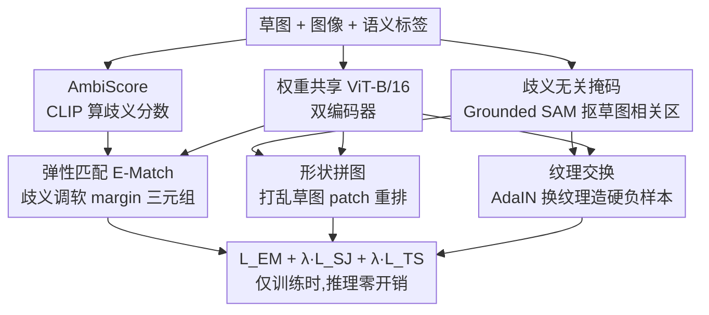

# Modeling the Visual Ambiguity of Human Sketches

**会议**: CVPR 2026  
**论文**: [CVF Open Access](https://openaccess.thecvf.com/content/CVPR2026/html/Zhou_Modeling_the_Visual_Ambiguity_of_Human_Sketches_CVPR_2026_paper.html)  
**代码**: 待确认  
**领域**: 草图理解 / 跨模态检索  
**关键词**: 草图视觉歧义, 零样本草图检索, 噪声监督, 弹性匹配, 形状-纹理解耦

## 一句话总结
这篇论文指出"一张草图能对应多张合理图像"的**视觉歧义**会把草图-图像匹配训练拖垮，提出用 CLIP 算出的 **AmbiScore** 量化每对草图-图像的歧义程度，再用 **DisAmb** 框架（弹性匹配按歧义动态调监督强度 + 提纯匹配用 Grounded SAM 掩码做形状拼图与纹理交换）显式建模并消解歧义，在 ZS-SBIR / FG-ZS-SBIR 上大幅刷新 SOTA，且不增加任何推理开销。

## 研究背景与动机

**领域现状**：从手绘草图学视觉表征一直是计算机视觉的核心方向之一。草图作为一种直接、可控、富表达力的交互接口，被广泛用于基于草图的图像检索（SBIR）、分割、生成等任务，其中**零样本草图检索（ZS-SBIR）**——用一张草图在没见过的类别里检索对应自然图像——是最具代表性的测试床。主流做法是用度量学习把草图和图像对齐到共享隐空间，再靠三元组损失拉近同类、推远异类。

**现有痛点**：草图与图像在视觉结构上有根本差异——草图只有稀疏的轮廓线，自然图像却充满密集纹理、颜色和背景。这导致图像里大量内容（背景、共现物体）在草图里**根本没有对应**。作者把这种错配定义为**视觉歧义（visual ambiguity）**：一张"鸟"的草图既可能对应单只飞鸟，也可能对应一群鸟、或鸟+树枝+天空的复杂场景。可现有 ZS-SBIR 方法（SAKE、Sketch3T、ZSE-SBIR 等）把所有训练对**一视同仁**，默认每对都同等可靠。

**核心矛盾**：歧义本质上是一种**噪声监督**。作者观察 ViT 的 `[RET]` token 注意力图，发现在高歧义样本上出现"模型走神（model distraction）"现象——注意力被吸到背景或共现物体上，而不是草图相关区域。更要命的是，把 Sketchy 数据集按歧义分成 5 个区间统计后发现，**只有约 40% 的数据落在低歧义区间**，而在高歧义子集上训练会让 ZS-SBIR、尤其是细粒度 FG-ZS-SBIR 性能急剧崩塌。也就是说，大半训练数据都在悄悄毒害模型。

**本文目标**：(1) 如何**量化**一对草图-图像的歧义？(2) 如何在训练里**显式消解**歧义，让监督信号变干净？

**切入角度**：歧义本身很主观、没法人工标注，但作者抓住一个关键观察——草图和图像往往**共享语义标签**。于是可以借视觉-语言预训练模型（CLIP）来衡量"图像内容与其类别标签的语义相关度"，作为"图像内容多大程度匹配草图意图"的代理。

**核心 idea**：先用 CLIP 把歧义打成一个连续分数 AmbiScore，再让监督信号"看分数行事"——歧义高的对降权、歧义低的对加强（弹性匹配），同时用基础模型掩码把图像里草图无关的像素直接抹掉、强迫模型学形状+语义而非走纹理捷径（提纯匹配）。

## 方法详解

### 整体框架

DisAmb 建立在标准 SBIR 双编码器之上：输入一对草图 $x_s$、图像 $x_i$ 及其共享语义标签 $T$，用两个**权重共享的 12 层 ViT-B/16**（草图编码器 $V_s$、图像编码器 $V_i$）抽取跨域嵌入。整套方法的关键设定是——**所有歧义建模组件只在训练时启用，推理时完全退化为干净的双编码器**，因此零额外推理开销，也不依赖特定基础模型。

训练阶段先离线为每个样本算好两样东西：AmbiScore（歧义分数）和"歧义无关掩码"（只保留草图相关区域的二值掩码）。然后两条支路并行作用于三元组训练：**E-Match（弹性匹配）**拿 AmbiScore 去动态调三元组损失的 margin，把歧义对的监督放软；**P-Match（提纯匹配）**则不躲避歧义、反而更激进地用掩码滤掉无关像素，在提纯后的特征上做形状拼图和纹理交换两个辅助任务。两条支路一软一硬互补——E-Match 在高歧义数据上容易"偷懒"（margin 被压到很小），P-Match 用基于掩码的硬三元组损失把它纠正回来。

### 关键设计

**1. AmbiScore：用 CLIP 把"草图-图像歧义"打成一个连续分数**

歧义没法人工标，作者用 CLIP 的图文相关度作代理。对有 $N$ 个类别的数据集，给每类造一句模板提示 `"a photo of [category]"`，用 CLIP 文本编码器 $\mathcal{T}(\cdot)$ 得到文本特征 $\{t_1,\dots,t_N\}$；对图像 $x_i$ 用 CLIP 图像编码器得到视觉特征 $v_c$。算内积 $p_i = v_c^\top t_i$ 得到相似度向量，再 softmax 归一化：

$$p_i = \frac{\exp(p_i/\tau)}{\sum_{j=1}^N \exp(p_j/\tau)}, \quad \tau = 1.5$$

设 $y$ 为图像的真值类别索引，则 **AmbiScore 定义为 $s_t = (1 - p_t)$**——即"CLIP 把这张图判给真值类别"的置信度的补。$p_t$ 越高说明图像内容越纯粹地对应这个类别（草图意图清晰），$s_t$ 越小；反之图像里掺杂越多无关内容、CLIP 越拿不准，$s_t$ 越大。这样设计的妙处是 AmbiScore 反映的是样本在**当前数据集分布内的相对歧义**，而非用成百上千固定提示组合去算绝对歧义，能自适应不同数据集的规模和分布。作者还发现 "person" 类别在数据里出奇高频，于是额外加一条 `"a photo of person"` 提示来提升跨数据集泛化（去掉它会掉 3.1% mAP@200）。

**2. 弹性匹配 E-Match：让监督强度跟着歧义"软硬有度"**

针对"所有训练对一视同仁"的痛点，E-Match 把固定 margin 的三元组损失改成**软 margin**，让 margin 随 AmbiScore 自适应。损失形式仍是标准三元组：

$$\mathcal{L}_{\rm EM} = \max\{d(v_s^{\rm cls}, v_p^{\rm cls}) - d(v_s^{\rm cls}, v_n^{\rm cls}) + \alpha_t,\ 0\}$$

其中 $d(a,b)=1-\frac{a\cdot b}{\|a\|\|b\|}$ 是余弦距离，关键在于软 margin $\alpha_t$ 由归一化后的歧义分数 $\hat{s_t}$ 决定：

$$\alpha_t = \frac{\epsilon^{1-\hat{s_t}}-1}{\epsilon-1}\,\alpha$$

$\hat{s_t} = (s_t - s_{\min})/(s_{\max}-s_{\min})$ 在 gallery 上归一化（防止高歧义数据集里 $\alpha_t$ 整体被压低、导致 $\mathcal{L}_{\rm EM}$ 集体"昏睡"）。直觉很清楚：当 $s_t \to 1$（高歧义正样本对），$\alpha_t$ 被赋一个很小的值，模型不必硬把这对拉到很近，从而**降权**这些噪声监督；当 $s_t \to 0$（干净对），$\alpha_t$ 增大，强制更严的类间分离、**加强**可靠监督。$\epsilon$（取 10）是控制曲线弯曲程度的参数。这一步本质是把噪声样本检测从"硬选 / 丢弃"换成"连续软调"，比传统 co-teaching 那种二分清洁/噪声更平滑。

**3. 提纯匹配之形状拼图：用基础模型掩码抠出草图相关区，再逼模型理解形状**

E-Match 是"躲"歧义，作者认为还应该"用"歧义。P-Match 先造一张**歧义无关掩码**：给图像 $x_i$ 和标签 $T$，用 Grounding DINO 定位物体框、再喂给 SAM 出掩码 $M$（即 Grounded SAM，$\mathcal{F}(\cdot)$），把草图无关的像素直接滤掉；掩码抽取失败时退回整图兜底。掩码降采样成 patch 级二值向量 $m = \mathbb{I}[\text{AvgPool}_{p\times p}(M) > \theta]$（阈值 $\theta=0.2$），用来筛出与草图相关的图像特征 $v_{\rm mask}=\{v_i\}_{i\in S}$。

在提纯后的特征上做**形状拼图**：把草图特征 $v_s$ 切成 $k$ 个随机打乱的片段得到 $v_s^r$，与 $v_{\rm mask}$ 一起送进带交叉注意力的多层 Transformer 解码器 $\mathcal{D}_r$，先做一个二分类判断这对 $(v_s^r, v_{\rm mask})$ 是否匹配（$\mathcal{L}_{\rm pair}$，二元交叉熵），对正样本对再预测被打乱草图 patch 的空间顺序（$\mathcal{L}_{\rm jigsaw}=H(l_s, l_{gt})$，多类交叉熵）。整体 $\mathcal{L}_{\rm SJ}=\mathcal{L}_{\rm pair}+\mathcal{L}_{\rm jigsaw}$。为何有效：自然图像语义复杂、直接建立局部草图-图像对应很难，语义掩码把这个过程**化简**到可学；而且作者特意**打乱草图而非图像**——草图通常只画一个显著物体，图像却常含多个或小目标，打乱图像 patch 会误导模型。$k=16$（$4\times4$）时最优。

**4. 纹理交换：造"同形状、异语义"硬负样本，治草图匹配的形状偏置**

作者发现一个隐患：图像纹理丰富、草图只有轮廓，于是草图-图像匹配很容易**退化成纯形状匹配**——实验里把图像换成纯掩码 / 边缘图后性能几乎不变（0.466 vs 0.449 vs 0.479），证明 SBIR 框架严重依赖形状偏置而非真懂语义。可纹理其实和物体语义高度相关（"马"和"斑马"形状相近、靠纹理区分）。纹理交换就是要把语义重新逼出来：对一张正样本图 $x_p^\delta$，用 AdaIN 风格迁移从 Describable Textures 数据集随机抽纹理，渲染出一张**同形状但换了纹理/材质**的合成负样本 $x_n^\delta$。再用掩码 $M^*$ 只保留物体内在纹理（$v_p^\delta=M^*\odot v_p^i$，$v_n^\delta=M^*\odot v_n^i$），构成三元组 $(x_s, x_p^\delta, x_n^\delta)$ 做硬 margin 三元组损失：

$$\mathcal{L}_{\rm TS} = \max\{d(v_s, v_p^\delta) - d(v_s, v_n^\delta) + \alpha_{ts},\ 0\}$$

这等于强迫模型："形状一样、纹理不同 → 必须判成不同"，从而学会语义对应而非死盯轮廓。它还有个副作用——**防止 $\mathcal{L}_{\rm EM}$ 在高歧义样本上变懒**：当 E-Match 把 margin 压软时，这条硬三元组兜底保证优化继续有效。总训练目标为

$$\mathcal{L}_{\rm DisAmb} = \mathcal{L}_{\rm EM} + \lambda_{\rm SJ}\mathcal{L}_{\rm SJ} + \lambda_{\rm TS}\mathcal{L}_{\rm TS},\quad \lambda_{\rm SJ}=\lambda_{\rm TS}=0.5$$

### 损失函数 / 训练策略
图像/草图尺寸 $224\times224$，margin $\alpha=\alpha_{ts}=1.0$，$\epsilon=10$；ViT-B/16 用 ImageNet 初始化，Adam，学习率 $1e^{-5}$，40 epoch，单张 A100。形状拼图分段 $k=4\times4=16$，Transformer 解码器 4 层 4 头，隐空间维度 768。**AmbiScore 与歧义无关掩码全部离线预算**，保证训练高效。

## 实验关键数据

### 主实验

**类别级 ZS-SBIR（Table 1，节选 mAP@200 / Prec@200 等）**：DisAmb 既有不依赖基础模型的 B-DisAmb，也有套用 CLIP prompt 微调的 C-DisAmb，两条线都刷 SOTA。

| 方法 | Sketchy mAP@200 | Sketchy Prec@200 | TU-Berlin mAP | QuickDraw mAP |
|------|------|------|------|------|
| ZSE-SBIR | 0.525 | 0.624 | 0.542 | 0.145 |
| **B-DisAmb** | **0.682** | **0.648** | **0.592** | **0.170** |
| SketchLVM | 0.723 | 0.725 | 0.651 | 0.202 |
| SketchFusion（CLIP+扩散） | 0.761 | 0.763 | 0.695 | 0.242 |
| **C-DisAmb** | **0.812** | **0.789** | **0.707** | **0.245** |

在 Sketchy 上，B-DisAmb 的 mAP@200 比之前 SOTA 高 10.7%，说明 top-200 检索排序质量显著更好；C-DisAmb 进一步超过用了两个基础模型的 SketchFusion。

**跨类别 FG-ZS-SBIR（Table 2）**：细粒度检索更难，需同时抓形状和纹理细节。

| 方法 | acc@1 | acc@5 |
|------|------|------|
| ZSE-SBIR | 23.97 | 49.52 |
| **B-DisAmb** | **28.09** | **58.69** |
| SketchFusion | 33.01 | 67.92 |
| **C-DisAmb** | **33.83** | **69.61** |

B-DisAmb 比同样用掩码机制的 ZSE-SBIR 高 4.32%——后者只为效率保留前景内容交换，在歧义样本上仍会走神。

**下游任务适配（Table 6）**：把提纯后的 SBIR 编码器当监督信号用于草图分割（SBIS）和生成（SBIG），均无需真值掩码。

| 任务 | 方法 | 指标 | 数值 |
|------|------|------|------|
| 分割 | SketchYourSeg | mIoU↑ / pAcc↑ | 65.68 / 68.29 |
| 分割 | **Ours** | mIoU↑ / pAcc↑ | **71.27 / 79.86** |
| 生成 | StableSketch | FID-I↓ / FID-C↓ | 26.21 / 12.82 |
| 生成 | **Ours** | FID-I↓ / FID-C↓ | **21.05 / 8.63** |

分割 pAcc 比基线高 11.57%；且只用 50% 训练数据即可达到 / 超过 SOTA，证明提纯监督信号数据高效。

### 消融实验（Table 4，Sketchy）

| 配置 | mAP@200 | acc@1 | 说明 |
|------|---------|-------|------|
| w/o E-Match（固定 margin $\alpha_t$） | 0.514 | 17.24 | 掉最多，噪声监督直接毒化语义空间 |
| w/o "person" 提示 | 0.651 | 26.17 | 高频类削弱类间判别力 |
| w/o $\mathcal{L}_{\rm pair}$（形状拼图） | 0.631 | 23.53 | 去掉匹配二分类 |
| w/o $\mathcal{L}_{\rm jigsaw}$（形状拼图） | 0.616 | 22.01 | 去掉空间顺序预测 |
| w/o $\mathcal{L}_{\rm TS}$（纹理交换） | 0.635 | 21.28 | FG 上掉点尤其明显 |
| **Ours-full** | **0.682** | **28.09** | 完整模型 |

形状拼图分段 $k$ 的选择：$k=4$→0.603，$k=9$→0.642，**$k=16$→0.682（最优）**，$k=25$→0.661，$k=36$→0.580（过大反而难优化）。

**纹理偏置验证（Table 5）**：只用掩码 / 边缘图 / 原图训练，ZS-SBIR mAP@200 分别是 0.466 / 0.449 / 0.479——几乎相等，坐实 SBIR 的强形状偏置；开启纹理交换后跳到 0.537（+5.8%），FG acc@1 +3.84%。

### 关键发现
- **E-Match 是性能主力**：去掉它 mAP@200 暴跌 0.168、acc@1 跌 10.85%，因为高歧义噪声监督会直接污染语义空间，证明"显式建模歧义"的方向选对了。
- **E-Match 与 P-Match 互补**：歧义分数超过 0.6 后，连 SketchLVM 这种靠文本-图像软约束的强基线也会鲁棒性崩溃；DisAmb 因为 E-Match 软调 + P-Match 硬掩码兜底的协同，在高歧义区间仍稳定领先。
- **细粒度任务更吃纹理**：FG-ZS-SBIR 上纹理交换比形状拼图更有效，因为细粒度检索需要区分形状相近、语义不同的物体。
- **对粗糙草图更鲁棒**：在自建 Sketchy-Q（好/中/差三档质量）上，高质量草图 mAP 比 ZSE-SBIR 高 11%，对低质量草图也更抗造。

## 亮点与洞察
- **把"草图歧义"这件长期被无视的事量化成一个数**：AmbiScore 用现成 CLIP 图文相关度做代理，无需人工标注、还能自适应数据集分布，是个干净又可即插即用的诊断工具——把它当数据筛子或难度课程都行。
- **一软一硬的双匹配设计很聪明**：E-Match 软调 margin"躲"噪声、P-Match 硬掩码"用"噪声，而且作者点明 E-Match 会"偷懒"、需要 $\mathcal{L}_{\rm TS}$ 兜底防懒，这种对失效模式的预判很到位。
- **"SBIR 其实在靠形状作弊"是个扎实的洞察**：用纯掩码/边缘图训练性能几乎不掉的对照实验，直接戳破了"模型真懂语义"的假象，纹理交换正是对症下药——这个"同形状异纹理硬负样本"的造法可迁移到任何易被形状捷径带偏的跨模态匹配。
- **训练时提纯、推理时零开销**：所有歧义组件只在训练用，推理退化成普通双编码器，工程上极友好，也让它能当下游分割/生成的免标注监督信号复用。

## 局限与展望
- **作者承认**：手工设计的提示词会让 AmbiScore 产生小幅波动，导致歧义判断不够一致；未来打算用人类反馈或 MLLM 做更可靠的歧义评估。
- AmbiScore 完全依赖 CLIP 的图文对齐质量，对 CLIP 本身泛化差的细分领域（如医学、工业草图）可能失准，文中只在自然物体类别上验证。
- 歧义无关掩码依赖 Grounding DINO + SAM 的开放集检测/分割质量，掩码失败时退回整图等于放弃提纯，论文未量化失败率对最终性能的拖累。
- "person" 提示这类靠经验补的 trick 说明 AmbiScore 对类别频率分布敏感，换到长尾分布数据集上是否还需要类似人工补丁存疑。

## 相关工作与启发
- **vs ZSE-SBIR**：两者都用掩码机制，但 ZSE-SBIR 只为算力效率保留前景内容交换，在歧义样本上仍会模型走神；本文显式量化歧义并软硬双调，FG-ZS-SBIR 上高 4.32%。
- **vs SketchLVM / SD-PL / SketchFusion（基础模型派）**：这些方法引入文本约束，无意中部分缓解了歧义，但没人意识到歧义问题本身；本文是第一个点明歧义并充分利用文本提示去量化它，C-DisAmb 在同样用 CLIP 的情况下全面超过它们，且不依赖扩散这类重型基础模型。
- **vs 噪声监督学习（NCR、ALBEF 等）**：以往把噪声监督研究集中在图文数据上，用记忆效应分清洁/噪声或动量蒸馏造伪目标；本文把"草图-图像歧义"识别为一类**此前未被探索**的噪声监督，并用连续 AmbiScore 软调取代二分清洁/噪声。
- **启发**：AmbiScore 这种"用预训练模型的标签置信度当样本难度/噪声代理"的思路，可推广到任何缺乏人工歧义标注的跨模态对齐任务（音频-图像、低质量手绘 UI-渲染图等）。

## 评分
- 新颖性: ⭐⭐⭐⭐⭐ 首次把草图视觉歧义量化并显式建模，AmbiScore + 软硬双匹配是成体系的新框架。
- 实验充分度: ⭐⭐⭐⭐⭐ 三大检索基准 + 多歧义区间 + 草图质量 + 下游分割/生成 + 数据量消融，验证非常完整。
- 写作质量: ⭐⭐⭐⭐ 动机和洞察讲得清楚、对照实验有说服力，但公式排版（缓存里）较乱、部分符号定义需对原文。
- 价值: ⭐⭐⭐⭐⭐ 即插即用、训练时提纯零推理开销，还能当下游免标注监督信号，实用性强。

<!-- RELATED:START -->

## 相关论文

- [\[CVPR 2026\] Event-based Visual Deformation Measurement](event-based_visual_deformation_measurement.md)
- [\[AAAI 2026\] TDSNNs: Competitive Topographic Deep Spiking Neural Networks for Visual Cortex Modeling](../../AAAI2026/others/tdsnns_competitive_topographic_deep_spiking_neural_networks_for_visual_cortex_mo.md)
- [\[ACL 2025\] Visual Cues Enhance Predictive Turn-Taking for Two-Party Human Interaction](../../ACL2025/others/visual_cues_enhance_predictive_turn-taking_for_two-party_human_interaction.md)
- [\[CVPR 2026\] Negative Binomial Variational Autoencoders for Overdispersed Latent Modeling](negative_binomial_variational_autoencoders_for_overdispersed_latent_modeling.md)
- [\[CVPR 2026\] Advancing Image Classification with Discrete Diffusion Classification Modeling](advancing_image_classification_with_discrete_diffusion_classification_modeling.md)

<!-- RELATED:END -->
