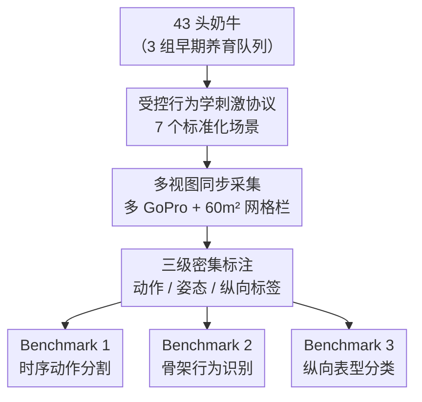

# MooCap: A Multi-View Benchmark for Cow-Object-Human Interaction and Behavior Dynamics

**会议**: CVPR 2026  
**论文**: [CVF Open Access](https://openaccess.thecvf.com/content/CVPR2026/html/Noronha_MooCap_A_Multi-View_Benchmark_for_Cow-Object-Human_Interaction_and_Behavior_Dynamics_CVPR_2026_paper.html)  
**代码**: https://github.com/IannoIITR/MooCap （有）  
**领域**: 动物行为理解 / 多视图视频基准 / 时序动作分割  
**关键词**: 动物行为, 多视图基准, 时序动作分割, 骨架动作识别, 纵向表型推断

## 一句话总结
MooCap 把经典动物行为学的"受控刺激实验"搬进计算机视觉，用 43 头奶牛、7 种标准化交互场景、42 小时同步多视角视频，配上 23 类细粒度行为 + 39 个关键点 + 4 个空间区 + 三组早期养育标签的密集标注，建立时序动作分割、骨架行为识别、纵向表型分类三个 benchmark——而 SOTA 模型只跑到 66.4% 帧准确率、0.39 mean F1，暴露出动物行为理解的巨大空间。

## 研究背景与动机

**领域现状**：动物行为分析在计算机视觉里的发展轨迹，几乎是人类动作识别（HAR）的翻版——先有 KTH、HMDB51 这类小规模受控数据，再走向 ActivityNet、Kinetics 那样的"in-the-wild"大规模基准。动物侧也类似：从单物种的 Cattle Visual Behaviours，到 Animal Kingdom（850 物种）、MammalNet（539 小时、173 类哺乳动物）这种海量被动采集数据集。

**现有痛点**：这些大规模数据集几乎都只服务于**孤立动作识别**或**逐帧姿态估计**，要么标"这一帧动物在干什么"，要么标骨架关键点，但很少提供研究"行为动态"所需的、结构化的多实体（动物—物体—人—同类）交互标注。理解动物行为本质上是建模"身体、物体、其他个体如何随时间互动"，而不是检测一个个独立动作。

**核心矛盾**：被动采集（passive observation）存在一个根本的**观察瓶颈**——野外视频虽有生态效度，却会过度采样"抓眼球"的行为（如打斗），而对真正关键的福利指标（出现频率低、不戏剧化的行为）严重欠采样，并引入数据集偏置。于是现状被劈成两个极端：① 大规模、被动、缺乏上下文和控制的野外数据；② 小规模、假设驱动、用强大姿态追踪工具但无法 scale、物种单一的实验室研究。前者能回答"动物在做什么"（descriptive recognition），却答不了"这个个体如何响应特定刺激"（behavioral profiling）。

**本文目标**：造一个既有**受控实验协议**（能系统性诱发可解释的行为响应）、又有**视频规模与密集多模态标注**的数据集，把这两个极端桥接起来，让模型能学到"行为画像"而不只是"动作标签"。

**切入角度**：作者来自普渡大学农业工程 + 动物科学 + 奥胡斯大学兽医，把经典**行为学实验范式（ethological assays）**——给每个个体施加一连串标准化刺激（陌生环境、新奇物体、人接近、陌生同类、母子重逢）——直接嵌进多相机视频采集框架。这些刺激经过动物行为学验证，能系统探测探索动机、新奇恐惧（neophobia）、社交能力、人—畜关系等维度，而这些维度在非结构化录像里几乎看不到。

**核心 idea**：用"标准化受控刺激 + 同步多视图视频 + 三级密集标注 + 纵向养育标签"取代"被动野外采集"，把动物行为数据集从单纯的动作识别 benchmark 升级成可做**因果/表型推断**的行为动态测试床。

## 方法详解

MooCap 不是提模型，而是提**数据集 + 三个 benchmark**。整条管线可以理解为：先用行为学设计决定"拍什么"（受控刺激协议），再用多相机阵列决定"怎么拍"（同步多视图），接着做三级密集标注（动作 / 姿态 / 纵向标签），最后在三个任务上跑 SOTA baseline 探明难度边界。

### 整体框架

输入是 43 头奶牛在标准化测试栏里依次经历的 7 个场景；输出是一个三级标注的多视图视频基准，以及在其上定义的三个 benchmark 任务。中间经过"受控刺激设计 → 多视图同步采集 → 三级密集标注 → 三任务 baseline 评测"四个阶段。

### 关键设计

**1. 受控行为学刺激协议：用标准化"考题"取代被动偷拍，让行为可比可解释**

被动采集的致命伤是无法控制变量——你不知道动物为什么这么做，也没法横向比较不同个体的响应。MooCap 借鉴经典行为学：每头牛按**完全相同的顺序、相同的时长**经历五个核心场景——新环境（3 分钟，测探索动机/孤立恐惧）、新奇物体（3 分钟，测 neophilia vs neophobia）、人接近（3 分钟主动 + 约 1 分钟人主动靠近直到牛退避，测人—畜关系）、陌生同类·受限（5 分钟，仅视觉接触）、陌生同类·不受限（5 分钟，可物理接触）；对母牛仍在群里的子集，再加母子重逢的受限/不受限两场景（各 5 分钟）。每头牛约 20–25 分钟视频。这种"两阶段（视觉评估 → 物理接触）"的社交协议能分离出支配等级、亲和结合、同类识别等信号。正因为刺激是标准化的，模型学到的就不只是"动物在做什么"，而是"这个个体面对同一刺激如何响应"——这才支撑表型分类、系统行为画像这类需要跨重复测试一致性的任务。

**2. 同步多视图采集 + 网格化场地：用几何先验把遮挡和空间关系标定下来**

非刚体动物身体 + 多实体交互天然带来大量遮挡，单视角根本标不准。作者在唯一的标准化测试栏（保证跨个体环境一致）里，把多台同步 GoPro 架在抬高的观察平台上，提供互补视角以消解遮挡并支持鲁棒 3D 姿态重建；为减小昼夜节律差异，所有测试集中在 11:00–14:00。场地 60 m²，地面按 1 米网格划线，并保留固定的料槽、水槽作为标定与空间定位的参考点——这让"空间占用映射、轨迹追踪、approach-avoidance 度量"这些量化空间分析有了 ground truth 基准坐标系，也为后面"4 个象限的空间区标注"提供物理依据。

**3. 三级密集标注：动作 + 姿态 + 纵向标签，把数据集从"识别"升级到"推断"**

标注分三层，逐层加深可研究的问题。第一层是**逐帧动作标签**：用 BORIS 行为观察软件做跨多相机视角时间对齐的密集标注，覆盖 23 类细粒度行为（探索类如嗅闻/舔/蹭/自我梳理、注意状态如警觉/对物/对人注意、交互类、社交类又细分为亲和[触碰、互相梳理、头部玩耍]与争斗[威胁、推搡、打斗]）；为保证可靠性，要求观察者间一致性 Cohen's kappa > 0.8。第二层是**骨架姿态**：人工标注约 3000 帧、每头牛 39 个解剖关键点（头朝向、四肢、尾部姿态等），让运动学特征与语义行为可联合建模。第三层是**纵向养育标签**，也是最独特的一层：43 头牛分属三组早期养育队列——出生 48 小时到 10 周龄期间，分别与生母全天接触（23 小时/天）、半天接触（10 小时/天）、出生即分离（对照组）；处理期后统一断奶、统一管理，而 MooCap 的行为录像在**断奶 9 个月后**采集。这个巨大的时间间隔把数据集变成一个表型推断测试床：模型要从当下可观测行为反推 9 个月前的早期经历这一**潜在因**，直接对应行为基因组学与福利科学的核心难题。

### 三个 Benchmark 任务

**Benchmark 1 · 时序动作分割**：对未裁剪的 20–25 分钟超长视频做逐帧动作标注。难点是极端时序跨度、23 类高多样性 + 严重类别不平衡，加上动物行为是分布于全身的细微非刚体运动、状态间存在长而模糊的过渡区。评测含监督（FACT、LTContext、DiffAct、ASFormer、SSTDA、MS-TCN++、UVAST）与无监督（TSA-ActionSeg 多种聚类）两类。

**Benchmark 2 · 骨架行为识别**：给定 39 关键点的位姿轨迹（时间序列），分类威胁、梳理、玩耍、近距离接触等行为，骨架图按解剖连通性定义。这一任务隔离出"纯运动学是否足以判别行为"的问题，对隐私保护监控有价值。评测三种 GCN：AMGCN、MS-G3D、2S-AGCN。

**Benchmark 3 · 纵向行为分类**：作者提出的新任务——给定一个或多个场景的视频，把个体分到其早期养育组（全/半/无母牛接触）。与标准动作识别不同，这里标签不对应可见动作，模型必须提取**分布性签名**（探索潜伏期、警觉时长、接近距离、社交参与度等细微统计），从"观测到的果"反推"潜在的因"。评测四种视频 Transformer：TimeSformer、Video Swin、ViViT、UniFormer。

## 实验关键数据

### Benchmark 1：时序动作分割（监督 + 无监督）

| 模型 | 类型 | Acc(MoF)↑ | F1@0.10↑ | F1@0.25↑ | F1@0.50↑ |
|------|------|-----------|----------|----------|----------|
| FACT | 监督 | **66.39** | 40.76 | 36.94 | **30.57** |
| LTContext | 监督 | 48.87 | 34.99 | 26.33 | 17.81 |
| DiffAct | 监督 | 35.65 | 19.83 | 11.57 | 3.31 |
| ASFormer | 监督 | 34.15 | 13.43 | 8.96 | 2.99 |
| MS-TCN++ | 监督 | 29.72 | 15.12 | 6.98 | 4.65 |
| UVAST | 监督 | 25.56 | 5.79 | 3.22 | 1.61 |
| TSA-ActionSeg (FINCH) | 无监督 | 14.73 | — | — | — |

最强的 FACT（层级 Transformer 注意力，建模帧级特征 + 段级上下文）也只有 66.39% 帧准确率、30.57% F1@0.5；无监督最佳配置仅 14.73% MoF，与监督差 51 个百分点。说明动物行为语义复杂、状态过渡渐变而非离散，是个远未解决的难任务。

### Benchmark 2：骨架行为识别（GCN，全部为 F1）

| 行为 | AMGCN | MS-G3D | 2S-AGCN |
|------|-------|--------|---------|
| Attentive 注意 | 0.39 | 0.02 | **0.62** |
| Threat 威胁 | **0.50** | 0.16 | 0.14 |
| Close Proximity 近距 | 0.09 | **0.50** | 0.13 |
| Grooming 梳理 | 0.35 | **0.51** | 0.22 |
| Playful 玩耍 | 0.40 | **0.52** | 0.23 |
| Push 推搡 | 0.45 | **0.53** | 0.24 |
| Sexual 性行为 | 0.34 | **0.49** | 0.21 |
| **Mean F1** | 0.36 | **0.39** | 0.26 |

MS-G3D 以 0.39 mean F1 领先，在梳理/玩耍/推搡等"刻板重复运动签名"上最强；而模糊的社交交互（靠细微姿态线索）依旧很难。纯骨架方法会丢失个体间距离、环境布局等场景级上下文。

### Benchmark 3：纵向行为分类（视频 Transformer，准确率 %）

| 场景 | TimeSformer | VSwin | ViViT | UniFormer |
|------|-------------|-------|-------|-----------|
| 新环境 NE | 25.18 | 18.00 | 30.00 | **88.10** |
| 新物体 NO | 32.10 | 14.82 | 23.46 | **88.89** |
| 人接近 HA | 22.22 | 22.22 | 20.99 | **83.95** |
| 陌生同类·受限 UCR | 24.00 | 17.00 | 25.00 | **85.00** |
| 陌生同类·不受限 UCU | 25.00 | 16.00 | 28.39 | **87.00** |
| 母子重逢·受限 DR | **96.67** | 63.33 | 66.67 | 86.67 |
| 母子重逢·不受限 DU | **93.33** | 56.67 | 76.67 | 70.00 |
| **Mean** | 45.50 | 29.72 | 38.74 | **84.23** |

### 关键发现
- **UniFormer 在跨场景的稳定性碾压其他架构**（mean 84.23% vs ViViT 38.74、TimeSformer 45.50、VSwin 29.72），说明并非所有视频 Transformer 都能捕捉表型相关的时序统计；架构选择对这一新任务极敏感。
- **TimeSformer 的"偏科"很说明问题**：它在母子重逢场景冲到 96.67%，却在人交互（22.22%）、新物体（32.10%）上崩盘——暗示它抓的是场景特定运动模式，而非可泛化的表型特征。母子重逢之所以好做，可能是对生母的情绪响应放大了判别信号；而物体/人交互里表型差异更隐晦。
- **互补的失败模式**：FACT 在重复舔舐的梳理序列上分割准确，但当牛距离相近时会在"近距/性行为"间混淆，重叠过大时又把交互误判成"其他/玩耍"；MS-G3D 在肢体构型独特的"推搡"上准，却在更依赖空间关系的"近距"上失败。两者都指向同一缺口——**纯姿态/单视角缺少场景级推理（个体间距、环境布局）**，作者建议用 pose + 空间场景图的混合架构补上。

## 亮点与洞察
- **把行为学实验范式工程化进 CV 数据集**：最"啊哈"的是用标准化受控刺激（同序、同时长）取代被动偷拍，让不同个体的响应直接可比——这把数据集从"识别 what"提升到"画像 how does this individual respond"，是方法论层面的升级而非简单堆数据。
- **纵向养育标签 = 天然的因果测试床**：早期养育处理（9 个月前）与行为录像（当下）之间的巨大时间间隔，逼模型从"果"反推"因"，开辟了"从可观测行为推断潜在表型"的新任务，对行为基因组学/福利诊断有实打实价值。
- **可迁移的设计**：①"刺激标准化 → 响应可比"的思路可迁到任何需要个体画像的视频任务（如临床步态、儿童发育评估）；② BORIS + 多视角时间对齐 + kappa>0.8 的标注质控流程，是细粒度行为标注的可复用模板；③"分布性签名分类"（从统计而非单个动作判别）这一框定，可迁到任何需从长序列推断潜在特质的场景。

## 局限与展望
- **物种/场地单一**：仅 Holstein 奶牛、单一设施，对多样农场环境与管理方式的泛化存疑；固定相机位也限制了视角多样性（相比真·野外采集）。
- **样本量小**：N=43（虽对纵向行为研究而言已属典型），对某些表型分析的统计功效有限。
- **作者给出的方向**：扩展物种多样性、纳入真实野外交互场景（如牧场母子结合）、用自动追踪系统 scale 到更大牛群。
- **自己补充**：三个 baseline 都是直接搬人类中心的架构，没有针对非刚体身体/物种特异运动学先验做适配；纵向任务里 84% 的"高分"也要小心——它可能部分来自个体外观/场地线索泄漏，而非真正学到了养育处理的行为表型，建议加跨个体 leave-one-out 与外观去偏的对照。

## 相关工作与启发
- **vs Animal Kingdom / MammalNet（大规模野外）**：它们靠海量被动采集换生态效度（850 物种 / 539 小时），但缺上下文与控制、有"抓眼球行为"偏置；MooCap 反其道行之，用受控刺激换可比性与可解释性，并独家提供纵向福利标签做因果分析。
- **vs MBE-ARI / ChimpACT（受控/纵向）**：同样带交互或纵向标注，但 MooCap 在同一数据集里同时给齐密集动作 + 39 关键点姿态 + 空间区 + 个体 ID + 纵向养育标签，覆盖面更全（见论文 Table 1）。
- **vs 实验室姿态追踪研究（DeepLabCut 等工具链）**：实验室方法姿态精度高但无法 scale、物种单一；MooCap 把受控协议嵌进可规模化的视频框架，兼顾控制与体量。

## 评分
- 新颖性: ⭐⭐⭐⭐ 把行为学受控实验范式 + 纵向养育标签引入 CV 动物行为数据集，并提出"从行为反推早期表型"的新任务，方法论上确有突破；扣分在于模型侧无创新，纯 benchmark。
- 实验充分度: ⭐⭐⭐⭐ 三个 benchmark 覆盖 13 个 baseline，监督/无监督都跑，有定量表 + 定性失败分析；样本仅 43 头、单物种单场地是客观天花板。
- 写作质量: ⭐⭐⭐⭐ 动机推导（被动 vs 受控、观察瓶颈）清晰，表格与失败模式分析到位，CV × 行为科学的跨学科叙述完整。
- 价值: ⭐⭐⭐⭐ 数据 + 代码 + 评测工具公开，填补"受控 + 规模化 + 多模态密集标注"的空白，对精准畜牧、动物福利、行为基因组学有实际意义；SOTA 远未饱和留足研究空间。

<!-- RELATED:START -->

## 相关论文

- [\[ICCV 2025\] SyncDiff: Synchronized Motion Diffusion for Multi-Body Human-Object Interaction Synthesis](../../ICCV2025/others/syncdiff_synchronized_motion_diffusion_for_multi-body_human-object_interaction_s.md)
- [\[CVPR 2026\] Cross-View Distillation and Adaptive Masking for Incomplete Multi-View Multi-Label Classification](cross-view_distillation_and_adaptive_masking_for_incomplete_multi-view_multi-lab.md)
- [\[CVPR 2026\] Temporal Interaction in Spiking Transformers with Multi-Delay Mixer](temporal_interaction_in_spiking_transformers_with_multi-delay_mixer.md)
- [\[CVPR 2026\] Multi-Hierarchical Contrastive Spectral Fusion for Multi-View Clustering](multi-hierarchical_contrastive_spectral_fusion_for_multi-view_clustering.md)
- [\[CVPR 2026\] DF²-VB: Dual-level Fuzzy Fusion with View-specific Boosting for Multi-view Multi-label Classification](df2-vb_dual-level_fuzzy_fusion_with_view-specific_boosting_for_multi-view_multi-.md)

<!-- RELATED:END -->
