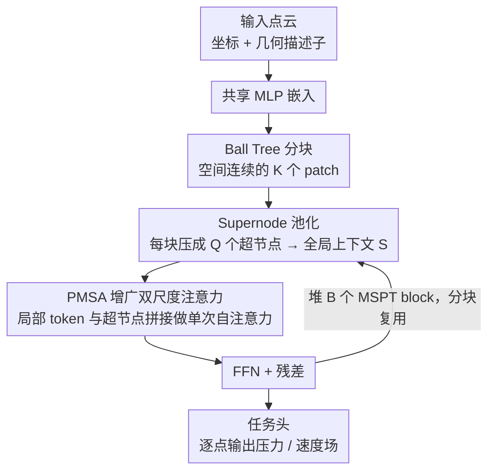

# MSPT: Efficient Large-Scale Physical Modeling via Parallelized Multi-Scale Attention

**会议**: CVPR 2026  
**论文**: [CVF Open Access](https://openaccess.thecvf.com/content/CVPR2026/html/Curvo_MSPT_Efficient_Large-Scale_Physical_Modeling_via_Parallelized_Multi-Scale_Attention_CVPR_2026_paper.html)  
**代码**: https://github.com/pedrocurvo/mspt （有）  
**领域**: 大规模物理建模 / 神经 PDE 算子 / 高效注意力  
**关键词**: 神经算子, 多尺度注意力, ball tree 分块, 超节点池化, CFD 代理模型

## 一句话总结
MSPT 把百万级点云切成 ball tree 分块，在每个分块内做局部自注意力、同时把每个分块池化成少量"超节点"做跨块全局通信，并把两者塞进**同一个**注意力算子里并行算出来，从而以近线性复杂度在单卡上求解工业级 PDE / 空气动力学问题，在多个基准上达到 SOTA 且显存和延迟显著更低。

## 研究背景与动机
**领域现状**：用神经网络当物理仿真（PDE 求解）的代理模型已是热门方向。主流路线有两类：一是神经算子（FNO 及其变体），在傅里叶谱域学函数空间到函数空间的映射，保证离散化无关；二是基于 Transformer 的算子（Transolver、UPT、Erwin 等），把注意力搬到非结构网格 / 点云上，用来捕捉长程依赖。

**现有痛点**：当 CFD、多物理设计这类应用放大到**百万级网格点**时，原始注意力的两两交互是 $O(N^2)$，根本算不动。各家给出的近似各有硬伤：谱方法（FNO 系）需要规则网格或周期边界，对尖锐的局部特征表达力差；Transolver 把整个域压成一组固定数量的全局 slice 再在隐空间里注意，slice 这个瓶颈一变大就 scaling 很差，而且池化会牺牲仿真保真度；UPT/AB-UPT 用集中式 latent token 概括全域，全局上下文被"均匀"地摊到各个区域，对局部细节不友好；Erwin 干脆只在 ball tree 分块内做严格局部注意力，复杂度线性、局部保真度高，但信息只能靠堆很多层才慢慢扩散，长程依赖捕捉乏力。

**核心矛盾**：不同物理场对空间依赖的需求天然不同——固体力学里应力应变在载荷附近高度局部化，而不可压缩流体因散度为零约束会产生全局压力耦合，空气动力学又要求表面压力和远场边界一致。也就是说，**既要细粒度局部交互、又要长程全局耦合，还要近线性的代价**，三者很难同时满足：纯局部（Erwin）丢全局，固定全局瓶颈（Transolver/UPT）丢局部细节。

**本文目标**：设计一个注意力机制，让局部交互和全局通信在**同一次、近线性代价**的运算里同时发生，并且能弹性适配不规则几何与不同分辨率。

**核心 idea**：把点云切成空间连续的小分块，分块内做局部注意力捕捉细结构；同时把每个分块池化成少量"超节点"作为粗粒度代表，让局部 token 去注意所有超节点，从而把全局信息在不付出二次代价的前提下铺开——而且这两件事被合并进一个增广后的自注意力里**并行**算出来。

## 方法详解

### 整体框架
MSPT（Multi-Scale Patch Transformer）的输入是一个点云 $P=\{p_1,\dots,p_N\}$ 及其特征矩阵 $H\in\mathbb{R}^{N\times F}$，输出是每个点上的目标物理场（如压力、速度）。整条流程是：先把每个点的坐标 $x_i$ 和几何描述子 $g_i$ 拼起来过一个共享 MLP 得到 hidden 特征；然后用 ball tree 在坐标上建一棵平衡树，按叶子的深度优先遍历给点重排序，重排后**连续的每 $L$ 个点**就构成一个分块 $P_k$，共 $K$ 个分块（$N=KL$，不够的补零 padding）。这个分块只在第一个 block 之前算一次，后续所有 block 复用。

接下来堆 $B$ 个 MSPT block。每个 block 是一个改过的 pre-norm Transformer block：先 LayerNorm，对每个分块做 **Supernode 池化**得到该块的 $Q$ 个超节点，把所有块的超节点拼成全局上下文 $S$；再跑 **PMSA（并行多尺度注意力）**——在每个分块里把局部 token 和全局超节点拼在一起做一次自注意力，残差加回；最后过 FFN（LayerNorm + GELU MLP）残差加回。逐 block 迭代地同时精炼点特征和超节点。最后一个 block 把 FFN 换成任务头，输出每个点的目标场。

### 关键设计

**1. Ball Tree 分块：给不规则几何切出空间连续的"邻域块"**

注意力要做局部，前提是先有"局部"。但 CFD 网格、点云是非结构的、几何不规则，没有现成的规则分块。MSPT 借用 Erwin 的 ball tree 思路：在点坐标上建一棵平衡 ball tree，对叶子做深度优先遍历，得到一个**空间局部性的点重排列**——空间上邻近的点在序列里也相邻。重排后把序列切成长度 $L$ 的连续块，就得到 $K$ 个空间连续的分块 $P_k$，满足 $P=\bigcup_{k=1}^K P_k$、$|P_k|=L$、$N=KL$（$N$ 不能整除时补零 padding）。关键是这棵树**只在第一个 block 之前建一次**，后续所有 block 共享同一套分块，把预处理摊销掉。这样既高效处理任意几何，又给后面的局部注意力提供了"邻域"语义——同一块内的点确实在物理上彼此靠近，局部注意力才有意义。

**2. Supernode 池化：把每块压成少量"代表"，搭起全局通信的桥**

光有局部块还不够，块与块之间需要交换信息。MSPT 的做法是给每个分块选派少量"代表"——超节点。在分块 $k$ 内，把 $L$ 个点 token 压成 $Q$ 个超节点 $S_k\in\mathbb{R}^{Q\times F}$，具体把这 $L$ 个 token 分成 $Q$ 个子块、每个子块聚合成一个超节点：均值池化 $S_k^q=\frac{1}{L/Q}\sum_{j=1}^{L/Q}(H_k^q)_j$、最大池化，或一个可学的线性投影 $S_k=W_{\text{pool}}^\top H_k$。把所有 $K$ 个块的超节点拼起来得到全局上下文 $S=[S_1;S_2;\cdots;S_K]\in\mathbb{R}^{(KQ)\times F}$。设计上可以调分块大小 $L$ 让 $KQ$ 远小于 $N$（甚至 $KQ\approx\sqrt N$），于是全局通信的"信道宽度"很窄，开销可控。消融显示均值池化最稳，最大池化因为只盯极值、不代表分块的典型特征而更差；$Q>1$ 让每块的表征更丰富、效果更好，但 $Q$ 太大又会吃掉池化省下的算力。

**3. PMSA 并行多尺度注意力：把局部与全局塞进同一次自注意力里**

这是全文的核心。痛点是：要么纯局部丢全局（Erwin），要么固定全局瓶颈丢局部（Transolver）。PMSA 的破法是**在每个分块里把局部 token 和全局超节点拼成一个增广序列**，对它做一次普通自注意力，让两个尺度的交互一次性发生。具体地，在分块 $k$ 上拼接 $Z_k=\begin{bmatrix}H_k\\ S\end{bmatrix}\in\mathbb{R}^{(L+KQ)\times F}$，按标准 QKV 算 $A_k=\mathrm{softmax}(Q_kK_k^\top/\sqrt F)$。这个注意力矩阵天然按局部/全局分成四块：$A_k^{\text{loc,loc}}$ 是块内局部互注意，$A_k^{\text{loc,glob}}$ 是局部 token 注意所有超节点。MSPT 只保留更新后的局部 token：

$$H_k'=A_k^{\text{loc,loc}}V_k^{\text{loc}}+A_k^{\text{loc,glob}}V_k^{\text{glob}}\in\mathbb{R}^{L\times F}$$

第一项捕捉块内细粒度结构，第二项通过池化超节点带来长程上下文——两者在**同一个 softmax** 里被联合归一化、并行算出，而不是先局部再全局串两遍。整个机制可紧凑写成 $H'=\mathrm{PMSA}(H)=\bigsqcup_{k=1}^K \Pi_{\text{loc}}\,\mathrm{MHA}\!\left(\begin{bmatrix}H_k\\S\end{bmatrix}\right)$，其中 $\Pi_{\text{loc}}$ 取前 $L$ 行、$\bigsqcup$ 把各块结果堆回完整序列。复杂度 $O(NL+N^2Q/L)$：第一项是块内局部注意力，第二项是全局注意力，由于二次项系数 $Q/L$ 通常很小，线性项主导，实际近线性。$L$ 是一个可调旋钮——$L$ 越大全局二次项越被压住但局部代价升、$L$ 越小局部省但跨块开销增，这个弹性让 PMSA 能根据硬件约束扩展到百万点。

### 损失函数 / 训练策略
模型按各基准的标准协议训练，报告预测场与真值之间的相对 $L_2$ 误差。CFD 任务（ShapeNet-Car / AhmedML）的验证损失定义为 $L=L_v+0.5\,L_s$（体场项 + 0.5×表面场项）。最后一个 block 的 FFN 被替换为任务专属头，逐点回归目标场（压力 / 速度），残差通路保留。所有实验在 Neural-Solver-Library 框架内、按 Wu et al. / Alkin et al. 的基准设置完成。

## 实验关键数据

### 主实验

标准 PDE 基准（相对 $L_2$，单位 $\times10^{-2}$，越小越好；"Promotion"为相对第二名的误差下降，负数=未夺冠）：

| 模型 | Elasticity | Plasticity | Airfoil | Pipe | Navier-Stokes | Darcy |
|------|-----------|-----------|---------|------|---------------|-------|
| Transolver | 0.64 | 0.12 | 0.53 | 0.33 | 9.00 | **0.57** |
| Erwin | **0.34** | **0.10** | 2.57 | 0.61 | N/A | N/A |
| **MSPT (本文)** | 0.48 | **0.10** | **0.51** | **0.31** | **6.32** | 0.63 |
| Relative Promotion | -41% | 17% | 4% | 6% | **30%** | -10% |

MSPT 在 6 个标准基准里的 4 个上拿到 SOTA，最亮眼的是 Navier-Stokes（相对 Transolver 降 30%）和 Plasticity/Airfoil/Pipe；在 Elasticity 上不敌严格局部的 Erwin、在 Darcy 上略逊 Transolver。

工业级 3D 空气动力学基准（相对 $L_2$，$\times10^{-2}$）：

| 模型 | ShapeNet-Car Vol↓ | Surf↓ | CD↓ | ρD↑ | AhmedML Vol↓ | Surf↓ |
|------|------|------|------|------|------|------|
| Transolver | 2.07 | 7.45 | 1.03 | 99.35 | 2.05 | 3.45 |
| **MSPT (本文)** | **1.89** | **7.41** | **0.98** | **99.41** | **2.04** | **3.22** |
| AB-UPT（原文双分支） | 1.16 | 4.81 | N/A | N/A | 1.90 | 3.01 |
| AB-UPT（本文复现） | 2.51 | 7.67 | 2.20 | 97.48 | 2.39 | 4.33 |

在单分支模型里 MSPT 全面最优；专用双分支的 AB-UPT 原文数字更低，但作者在统一框架下复现时其指标明显回退（细节见原文 Appendix C），作者指出同样的分支思路可叠加到 MSPT 上。

### 消融实验

分块数 $K$ 对 ShapeNet-Car 测试损失的影响（$\times10^{-2}$）：

| K | 32 | 64 | 128 | 256 | 512 | 1024 |
|---|----|----|-----|-----|-----|------|
| Test Loss | 6.08 | 6.23 | 6.83 | 6.77 | 6.37 | 5.99 |

| 配置 | 结论 |
|------|------|
| 分块数 K | **非单调**：K 太小（块大）局部上下文足但全局通信受限；K 增大先变差，越过阈值（约 512）后又变好（超节点变多、全局交互增强） |
| 池化方式 | 均值池化最稳；最大池化更差（只盯极值）；可学线性投影不稳定地优于均值 |
| 超节点数 Q | $Q>1$ 普遍更好（表征更丰富），但 $Q$ 太大吃掉池化省下的算力 |

### 关键发现
- **$K$ 的非单调曲线揭示了一个本质权衡**：分块太少会把局部细节抹平（oversmooth），分块太多又会割裂长程相干性，中间某个 $K$ 才同时兼顾局部分辨率和全局上下文——这正是 PMSA"双尺度并行"想平衡的东西。
- **效率是核心卖点**：峰值显存随点数近似线性增长；在 Fig. 1 的 500k 点设置下 MSPT 峰值显存 26.0 GB、延迟 28 ms，优于 Transolver 的 42.8 GB / 31 ms。$K=128$ 时能在 50 GB 显存内、0.084 s 内吞下百万点的一次前向，单卡可达百万点分辨率。
- **MSPT vs Erwin 的画像很清楚**：Erwin 纯局部、极省、局部任务（Elasticity）强，但需多层才扩散信息；MSPT 的超节点让全局信息在**每一层**就直接共享，因此在需要长程耦合的 Airfoil / Navier-Stokes 上明显更强。

## 亮点与洞察
- **"把多尺度塞进一次注意力"是真正巧妙的地方**：不是先局部 block 再全局 block 串两段，而是把超节点拼进局部序列，靠注意力矩阵自然分块（loc-loc / loc-glob），一次 softmax 联合归一化。这避免了串行两阶段里"全局信息被二次处理稀释"的问题，工程上也只是一次标准 MHA，易实现易复用。
- **超节点 = 可调宽度的全局信道**：通过调 $L$ 让 $KQ\approx\sqrt N$，把全局通信成本压到二次项系数 $Q/L$ 很小，是"近线性"的来源。这个"用少量代表换全局通信"的设计可迁移到任意需要长程依赖又怕二次复杂度的点云 / 图任务（如大规模点云分割、分子动力学）。
- **$K$ 这个旋钮把局部-全局权衡显式暴露给用户**：同一架构通过改分块数就能在"重局部"和"重全局"之间滑动，并且能按显存/延迟预算调（Fig. 5），对工业部署很实用。

## 局限与展望
- **未夺冠的基准暴露了边界**：纯局部主导的 Elasticity 上 Erwin 更好、Darcy 上 Transolver 更好，说明 PMSA 的双尺度并不是对所有物理场都最优——当问题本质上极度局部或极度全局时，专用结构仍可能赢。
- **超节点池化是有损的瓶颈**：把 $L$ 个点压成 $Q$ 个代表必然丢信息，均值池化最稳但也最"平均化"；论文也承认改进池化与分块策略是未来工作。Q 的最优值依任务而变，缺少自适应机制。
- **和双分支专用模型的比较依赖复现**：AB-UPT 原文数字更强，作者用统一框架复现后才反超，这个对比的说服力部分系于复现是否公平（原训练 pipeline 未开源）。作者提出的双分支 MSPT 变体尚未实现验证。
- **复杂度仍含二次项**：$O(NL+N^2Q/L)$ 在 $Q/L$ 不够小或 $K$ 取得不好时，全局项会重新变贵（Fig. 5 中 512–1024 分块在 10k 点就 >30 GB），近线性是有前提的。

## 相关工作与启发
- **vs Transolver**：Transolver 把整个域压成一组**固定数量**的全局 slice 并在隐空间注意；MSPT 在**局部分块**上操作、用超节点做全局通信。区别在于跨块交互随分块数 $K$ 伸缩，而非卡在一个固定全局瓶颈，因此保留局部细节、避免过平滑——这是 MSPT 在多数基准反超 Transolver 的根因。
- **vs Erwin**：Erwin 去掉所有池化、只在 ball tree 分块内严格局部注意力，线性且局部保真，但长程信息要堆多层才扩散；MSPT 复用了 Erwin 的 ball tree 分块，却额外用超节点在每层直接铺开全局上下文，在长程依赖任务上更强（但纯局部任务可能不及 Erwin）。
- **vs UPT / AB-UPT**：UPT 用集中式 latent token 把全局上下文均匀摊给各区域，AB-UPT 进一步拆成表面 / 体积双分支独立自注意、再交叉注意。MSPT 是单一耦合的局部-全局算子，作者指出 AB-UPT 的分支思路可正交叠加到 MSPT 上形成双分支变体。
- **vs FNO 系神经算子**：谱方法需规则网格 / 周期边界、对尖锐局部特征表达差；MSPT 走注意力路线，靠 ball tree 直接吃任意几何的非结构点云。

## 评分
- 新颖性: ⭐⭐⭐⭐ "把局部 token + 池化超节点拼进单次自注意力实现并行双尺度"是个干净且有效的新机制，但 ball tree 分块借自 Erwin、超节点思路和 Transolver/UPT 同源。
- 实验充分度: ⭐⭐⭐⭐ 覆盖 6 个标准 PDE + 2 个工业 CFD 基准、含分块数/池化/效率消融与百万点 scaling，较扎实；但部分关键对比（AB-UPT）依赖自行复现，且消融多在单一基准上。
- 写作质量: ⭐⭐⭐⭐ 动机推导（局部 vs 全局矛盾）清晰，PMSA 的矩阵分块推导完整；图表信息量足。
- 价值: ⭐⭐⭐⭐ 单卡百万点、显存/延迟双优，对大规模设计优化与实时工业 CFD 代理很有实用价值，且机制可迁移到其他大规模点云任务。

<!-- RELATED:START -->

## 相关论文

- [\[CVPR 2026\] Efficient Unrolled Networks for Large-Scale 3D Inverse Problems](efficient_unrolled_networks_for_large-scale_3d_inverse_problems.md)
- [\[CVPR 2026\] Large-scale Robust Enhanced Ensemble Clustering via Outlier Decoupling](large-scale_robust_enhanced_ensemble_clustering_via_outlier_decoupling.md)
- [\[ICML 2026\] AMDP: Asynchronous Multi-Directional Pipeline Parallelism for Large-Scale Models Training](../../ICML2026/others/amdp_asynchronous_multi-directional_pipeline_parallelism_for_large-scale_models_.md)
- [\[ICML 2026\] Torus Graphs for Large-Scale Neural Phase Analysis](../../ICML2026/others/torus_graphs_for_large_scale_neural_phase_analysis.md)
- [\[ACL 2025\] Code-Switching and Syntax: A Large-Scale Experiment](../../ACL2025/others/code-switching_and_syntax_a_large-scale_experiment.md)

<!-- RELATED:END -->
