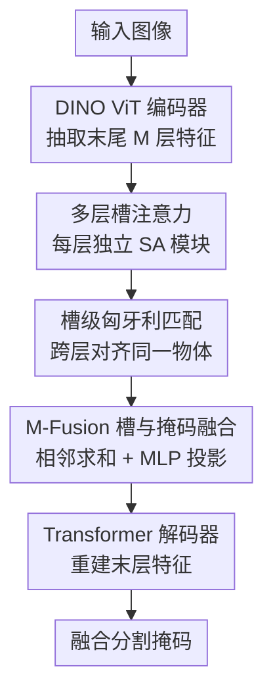

# MUFASA: A Multi-Layer Framework for Slot Attention

**会议**: CVPR 2026  
**论文**: [CVF Open Access](https://openaccess.thecvf.com/content/CVPR2026/html/Bock_MUFASA_A_Multi-Layer_Framework_for_Slot_Attention_CVPR_2026_paper.html)  
**代码**: https://visinf.github.io/mufasa/ （项目页，有）  
**领域**: 对象中心表示 / 自监督表示学习  
**关键词**: 槽注意力, 对象中心学习, 无监督物体分割, 多层特征融合, DINO

## 一句话总结
MUFASA 是一个即插即用的多层槽注意力框架：它不再只拿预训练 DINO ViT 最后一层的特征做槽注意力，而是同时在末尾若干层上各跑一套槽注意力、用匈牙利匹配把跨层的槽对齐后再融合成一组统一的对象中心表示，把 DINOSAUR/SPOT 等方法在 VOC/COCO/MOVi-C 上的无监督分割刷到新 SOTA，同时还显著加快了训练收敛、只带来很小的推理开销。

## 研究背景与动机

**领域现状**：无监督对象中心学习（Object-Centric Learning, OCL）想在没有标注的情况下把一张图分解成若干"物体级"的表示。其中最流行的一支是槽注意力（Slot Attention, SA）：把图像 patch 特征通过一个类似软 k-means 的迭代注意力机制，聚成 $K$ 个远少于 patch 数的隐向量——"槽"（slot），每个槽竞争性地绑定到图里的一个物体。DINOSAUR 把这条路从合成数据带到真实场景，办法是不在像素上、而在一个预训练自监督编码器（DINO ViT）的**特征空间**里做重建；SPOT 又用师生自训练蒸馏注意力掩码、加上 patch 顺序扰动，把无监督物体分割（UOS）推到了当时的最强。

**现有痛点**：DINOSAUR、SPOT 这些方法都**只用 DINO ViT 最后一层的特征**喂给槽注意力。但已有研究表明，DINO ViT 的语义并不只集中在最后一层——浅层主要编码位置信息，语义从中间层开始浮现、越往深越丰富，而且不同层之间是**语义互补**的（不同层会把同一场景切成不太一样的样子）。只用最后一层，等于把 ViT 中间几层里互补的、对分割有用的语义信息白白扔掉了。

**核心矛盾**：单层特征的"语义视角"是单一且有偏的——某一层可能把人和狗并到一个槽里，另一层能分开却引入背景噪声。没有哪一层"全对"，但它们各自的错误又不一样，存在天然的互补冗余可以利用。

**本文目标**：在不重训编码器、不加新损失的前提下，让槽注意力同时吃多层特征，并把多层得到的槽**对齐再融合**成一组干净统一的对象表示；而且要做成能直接塞进现有 SA 方法的插件。

**切入角度**：作者用 PCA 可视化和逐层单独训练的实验（Fig. 2e）确认——末尾几个深层各自单独做分割就已经很强且互不相同，把这几层的槽融合起来能超过任何单层。于是问题就从"挑哪一层最好"变成"怎么把好的几层捏到一起"。

**核心 idea**：在 ViT 末尾 $M$ 个连续层上各跑一套独立的槽注意力，用基于掩码 IoU 的匈牙利匹配把跨层的槽逐一对齐到同一物体，再用一个带"相邻层求和"归纳偏置的 MLP（M-Fusion）把它们融成单组槽，喂给原来的解码器。

## 方法详解

### 整体框架
MUFASA 要解决的是"只用最后一层、浪费了 DINO 中间层语义"这件事。整体流程是：给一张图，DINO 编码器抽出末尾 $M$ 层（默认末 4 层）的 patch 特征；每一层配一个**参数独立**的槽注意力模块，各自产出一组 $K$ 个槽和对应的注意力掩码；然后做**槽级匈牙利匹配**，把相邻层里绑定同一物体的槽对齐到相同下标；对齐后进入 **M-Fusion 融合模块**，把多层的槽和掩码各自融成一组统一表示；最后这组融合后的槽喂给一个自回归 Transformer 解码器去重建**最后一层**的特征，训练只用基模型原本的重建/蒸馏信号，不引入任何额外损失。整个模块替换掉原方法里"单层 SA 瓶颈"那一块，塞进 DINOSAUR 得到 DINOSAUR-M、塞进 SPOT 得到 SPOT-M。

### 关键设计

**1. 多层槽注意力：让每个深层各管一套独立的槽**

针对"只用末层、丢掉中间层互补语义"的痛点，MUFASA 从 DINO 的 12 层特征 $\mathcal{H}=\{h_1,\dots,h_{12}\}$ 里选一个下标集 $\mathcal{I}\subseteq\{1,\dots,12\}$（$|\mathcal{I}|=M$），取出子集 $\hat{\mathcal{H}}=\{h_i\in\mathbb{R}^{N\times d_\mathrm{emb}}\mid i\in\mathcal{I}\}$，对每个 $h_i$ **单独**跑一遍槽注意力，得到 $M$ 组槽 $\mathcal{U}=\{S_1,\dots,S_M\}$，每组各有自己的 $K$ 个槽向量。这里的关键是每个槽注意力模块 $\mathrm{SA}_m$ 都有**自己独立的可训练参数**而不共享权重——因为不同层特征的统计和语义本就不同，独立参数才能让每个模块适配本层、捕捉到更多样化的信息。槽注意力本身沿用标准做法：把特征映射为 key、把上一轮槽映射为 query，做缩放点积加 softmax 得到分配矩阵

$$\mathcal{A}^{\mathrm{Slot}}=\underset{K}{\mathrm{softmax}}\!\left(\frac{f_{\mathrm{Key}}(h)\cdot f_{\mathrm{Query}}(\mathcal{S})^T}{\sqrt{d}}\right),$$

softmax 沿槽维度归一化，迫使槽之间竞争绑定不同区域，再用 GRU 类的循环函数迭代更新槽。结果就是每层都拿到一组掩码 $\mathcal{A}^{\mathrm{Slot}}_m$，代表本层视角下"哪些 patch 属于哪个槽"。

**2. 槽级匈牙利匹配：先对齐再融合，否则槽顺序对不上**

不同层的槽注意力是各自独立初始化、独立训练的，所以**层与层之间槽的下标并不对应**——第 1 层的第 3 个槽是狗、第 2 层的第 3 个槽可能是人。直接把这些槽相加或拼接会把不同物体混到一起，融合必然失败。MUFASA 的做法是：在相邻两层 $S_m$ 和 $S_{m+1}$ 之间，基于二值化注意力掩码的 mIoU 做匈牙利匹配，求一个使平均 IoU 最大的一一对应排列 $\Pi_{m+1}$，再用它把 $S_{m+1}$ 及其掩码重排，使得同一物体在各层都落到相同下标。从 $m=1$ 起逐对推进，得到对齐后的槽集 $\hat{\mathcal{U}}=\{\hat{S}_1,\dots,\hat{S}_M\}$（$\hat{S}_1=S_1$）和对应掩码。这一步是融合能成立的前提：先把"同一个物体在不同层的化身"对齐到同一槽位，后面的逐位求和、加权才有意义。作者也指出这种硬性一对一匹配是个约束，未来可以换更灵活的软匹配。

**3. M-Fusion：用"相邻层求和"的局部归纳偏置把多层槽捏成一组**

对齐之后还要把 $M$ 组槽融成解码器能用的单组 $\mathcal{S}_\mathrm{fused}\in\mathbb{R}^{K\times d_\mathrm{slot}}$。最朴素的做法是直接拼接或平均，但平均（Avg-Fusion）几乎等于没融、效果退回基线，纯拼接（Concat-Fusion）又丢了层间结构。M-Fusion 的核心是先在**相邻层之间做滑窗式的逐位求和**：把每一对相邻槽集 $(\hat{S}_m,\hat{S}_{m+1})$ 对应槽相加，得到 $M-1$ 个元素 $\mathcal{Z}=\{(\hat{S}_1+\hat{S}_2),\dots,(\hat{S}_{M-1}+\hat{S}_M)\}$——这个相邻求和编码了"相邻层之间存在局部交互"的归纳偏置；然后沿特征维拼接 $\mathcal{Z}$，过一个单隐层 MLP 投影成融合槽：

$$\mathcal{S}_\mathrm{fused}=\mathrm{MLP}\big(\mathrm{Concat}(\mathcal{Z},\,\text{axis=features})\big).$$

注意力掩码也同样处理（mask fusion）：相邻掩码逐对相加得到 $\mathcal{Z}^\mathrm{att}$，再做加权线性组合 $\mathcal{A}^{\mathrm{Slot}}_\mathrm{fused}=\sum_{m=1}^{M-1}w_m\mathcal{Z}^\mathrm{att}_m$。当不用师生训练（DINOSAUR-M）时，权重 $w$ 取均匀常数 $\tfrac{1}{M-1}$，各层对等；当启用自训练（SPOT-M）时，权重作为可学习参数、由教师到学生的掩码蒸馏信号引导学习，并对层维做 softmax 归一化。消融显示：把相邻求和换成普通拼接（Concat-Fusion）会掉点，证明这个局部交互归纳偏置真的有用；把 MLP 换成 Transformer（T-Fusion）反而没更好，说明融合不需要更重的结构。

### 损失函数 / 训练策略
MUFASA **不引入任何新损失**，完全复用基模型的训练信号。底座是标准的"在特征空间重建"目标——解码器重建 DINO 最后一层特征，归一化重建损失为

$$\mathcal{L}_\mathrm{Rec}=\frac{1}{N\cdot d_\mathrm{emb}}\big\lVert h-\mathrm{Decoder}(\mathcal{S})\big\rVert_2^2.$$

DINOSAUR-M 只用这条重建损失；SPOT-M 额外继承 SPOT 的师生自训练，把教师的注意力掩码蒸馏给学生（与 SPOT 不同的是，作者改用**槽注意力模块**的掩码而非解码器掩码做蒸馏，因为实验发现前者分割质量更高），并据此学习掩码融合权重。实现上：取**末尾 4 个连续层**，M-Fusion 的 MLP 单隐层宽 768、GELU 激活；槽数随数据集变（VOC $K{=}6$、COCO $K{=}7$、MOVi-C $K{=}11$）；编码器 ViT-B/16 用 DINO 预训练权重。

## 实验关键数据

### 主实验
在 PASCAL VOC、COCO、MOVi-C 三个数据集上，把 MUFASA 塞进 DINOSAUR 和 SPOT 后几乎在所有设置上都超过原模型，刷新 UOS 的 SOTA；提升最明显的是类别级 mBO（mBOc）。下表为 VOC 上的对比（%，越高越好，三个种子均值）：

| 模型 | mBOc | mBOi | mIoU | FG-ARI |
|------|------|------|------|--------|
| DINOSAUR | 51.2 | 44.0 | – | 24.8 |
| DINOSAUR-M（本文） | 57.6 | 49.2 | 47.2 | 25.2 |
| SPOT | 55.3 | 48.1 | 46.5 | 19.7 |
| SPOT-M（本文） | **59.8** | **51.3** | **49.4** | 20.6 |

值得注意的是：即使更简单的 DINOSAUR-M（mBOc 57.6）也已经超过了更复杂的 SPOT（55.3），说明 MUFASA 的增益不依赖 SPOT 那套精巧的自训练。在 COCO 上 DINOSAUR-M 全指标改进 DINOSAUR，SPOT-M 在 mBOc/mBOi 上超 SPOT；在合成的 MOVi-C 上 DINOSAUR-M 把 mBOi 从 42.4 提到 49.2、FG-ARI 从 55.7 提到 66.4。

### 消融实验
融合策略消融（SPOT-M on VOC，%，越高越好）最能说明 M-Fusion 的价值：

| 融合方式 | mBOc | mBOi | mIoU | FG-ARI |
|----------|------|------|------|--------|
| SPOT（单层基线） | 55.3 | 48.1 | 46.5 | 19.7 |
| Avg-Fusion（非学习平均） | 55.6 | 48.1 | 46.5 | 19.4 |
| Concat-Fusion（去相邻求和） | 59.0 | 50.9 | 48.9 | 20.0 |
| T-Fusion（MLP→Transformer） | 59.0 | 50.7 | 48.9 | 19.7 |
| **M-Fusion（本文）** | **59.8** | **51.3** | **49.4** | **20.6** |

训练效率上（Tab. 2），MUFASA 收敛极快：SPOT-M 在 VOC 上达到基线水平只需 51 epoch（SPOT 要 944），达峰也更早，整体把 VOC 训练时间压了 94.4%、DINOSAUR-M 压 90.2%。

### 关键发现
- **相邻求和的归纳偏置是 M-Fusion 的关键**：去掉它退化成 Concat-Fusion，mBOc 从 59.8 掉到 59.0、mIoU 从 49.4 掉到 48.9；而单纯平均（Avg-Fusion）几乎等于没融，退回单层基线水平。
- **不是层越多越好**：取末 3/4/5 连续层，结果在 4 层达峰，再加层反而略降——更多层既不提分还增开销，末 4 连续层是精度与效率的甜点。
- **连续深层 > 跨位拼层**：把早层和深层混着选虽能超基线，但比不过直接用末尾连续几层；早层（如第 4 层）单独用时分割质量明显不足。
- **对编码器/解码器都更鲁棒**：换 MAE、DINOv2、ViT-S/8、ViT-B/14，MUFASA 都稳超对应基线；换成更弱的 MLP 解码器时，基线掉点比 MUFASA 更狠，说明增益直接来自槽注意力机制本身、对解码器选择更不敏感。
- **开销很小**：DINOSAUR-M 参数比 DINOSAUR 多 20.7%、SPOT-M 比 SPOT 多 12.1%；推理吞吐 SPOT 几乎不变（86.1→84.7 img/s）。

## 亮点与洞察
- **把"挑最优层"换成"融合互补层"**：作者没有去争论 DINO 哪一层最好，而是承认每层都有各自的对与错、且错得不一样，于是用融合让它们互相补噪。这个视角对所有"用预训练 ViT 中间特征"的任务都有迁移价值。
- **匈牙利匹配解决了多分支表示融合的根本难题**：多个独立分支产出的隐向量天然没有对应关系，先用掩码 IoU 做一一对齐再融合，是一个干净且可复用的套路——任何"多视角/多分支 slot/query 要合并"的场景都能借用。
- **相邻层逐位求和 = 廉价的局部归纳偏置**：仅靠"滑窗相邻相加"就显著优于拼接和换 Transformer，说明在层间引入"局部交互"的结构先验比堆参数更有效，是个低成本高回报的小设计。
- **即插即用且不加损失**：MUFASA 只替换 SA 瓶颈、复用基模型信号，却能让更轻的 DINOSAUR-M 超过更重的 SPOT，这种"机制层面的增益"比靠训练 trick 的增益更扎实。

## 局限与展望
- **同类实例会被并到同一槽**：MUFASA 继承了槽注意力模型的通病——多个同类物体（如画面里几个人）容易被绑进同一个槽，类别级表现好但实例级分割受限。这是 OCL 通用问题，非 MUFASA 独有。
- **硬性一对一匹配是个约束**：匈牙利匹配强制层间槽一一对应，作者承认这可能过于刚性，更灵活的软匹配是值得探索的方向。
- **层数/层选仍是手工超参**：末 4 连续层是在 VOC 上调出来的甜点，换数据集/编码器时这个选择是否最优需要重新验证，缺少自动选层机制。
- **训练参数增加但内存影响不均**：DINOSAUR-M 训练显存多 8.1%、SPOT-M 仅多 0.4%，多层 SA 在不同底座上的开销差异较大，大规模训练前需要实测。

## 相关工作与启发
- **vs DINOSAUR**：DINOSAUR 首次把槽注意力从像素搬到 DINO 特征空间、用最后一层做重建目标；MUFASA 直接在其上加多层 SA + M-Fusion，DINOSAUR-M 在 VOC 把 mBOc 从 51.2 提到 57.6，且不动其训练流程。
- **vs SPOT**：SPOT 靠师生自训练蒸馏注意力掩码 + patch 顺序扰动取得 SOTA，强烈依赖解码器；MUFASA 的增益在槽注意力机制端，对解码器更不敏感，SPOT-M 进一步刷新 SOTA，而更轻的 DINOSAUR-M 甚至能超过原版 SPOT。
- **vs 多查询槽注意力（[45]）**：那类方法在**同一层**上用多个独立 SA 模块做集成；MUFASA 关键区别是跨**不同层**做 SA 以利用层间语义互补，并显式用匈牙利匹配对齐+M-Fusion 融合，而非简单集成。
- **vs 多层 ViT 特征的其它用法**：已有工作把多层 ViT 特征用于多模态、特征预测、视觉对应、物体发现等；MUFASA 是首个把多层 ViT 表示系统地引入槽注意力 OCL 的工作。

## 评分
- 新颖性: ⭐⭐⭐⭐ 首次把多层 ViT 特征系统引入槽注意力，匈牙利对齐+相邻求和融合的组合干净且有效，但每个零件都源自已有思路的组合。
- 实验充分度: ⭐⭐⭐⭐⭐ 三数据集 × 两底座 × 多编码器/解码器，融合策略/层选/层数消融齐全，含训练时间与吞吐的效率分析。
- 写作质量: ⭐⭐⭐⭐ 动机—观察—方法的逻辑链清晰，图 2 的层互补性可视化很有说服力，公式与符号偶有繁琐。
- 价值: ⭐⭐⭐⭐ 即插即用、不加损失、还顺带大幅加速训练，对无监督物体分割与一切用 DINO 中间特征的任务都有直接借鉴意义。

<!-- RELATED:START -->

## 相关论文

- [\[CVPR 2026\] MSPT: Efficient Large-Scale Physical Modeling via Parallelized Multi-Scale Attention](mspt_efficient_large-scale_physical_modeling_via_parallelized_multi-scale_attent.md)
- [\[CVPR 2026\] AVGGT: Rethinking Global Attention for Accelerating VGGT](avggt_rethinking_global_attention_for_accelerating_vggt.md)
- [\[ACL 2025\] A Multi-Persona Framework for Argument Quality Assessment](../../ACL2025/others/a_multi-persona_framework_for_argument_quality_assessment.md)
- [\[CVPR 2026\] Drainage: A Unifying Framework for Addressing Class Uncertainty](drainage_a_unifying_framework_for_addressing_class_uncertainty.md)
- [\[CVPR 2026\] Multi-Hierarchical Contrastive Spectral Fusion for Multi-View Clustering](multi-hierarchical_contrastive_spectral_fusion_for_multi-view_clustering.md)

<!-- RELATED:END -->
