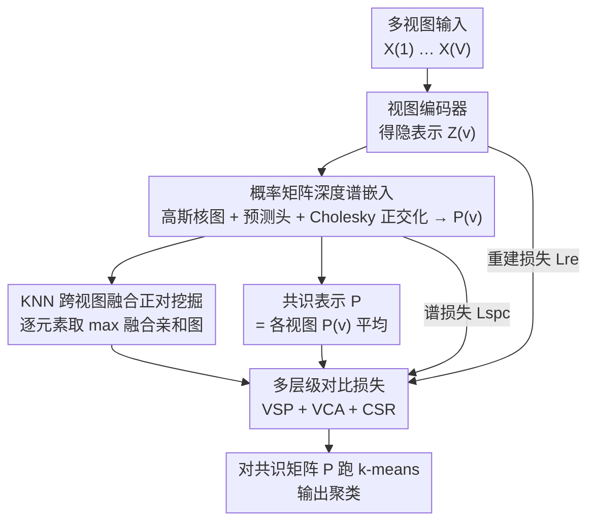

# Multi-Hierarchical Contrastive Spectral Fusion for Multi-View Clustering

**会议**: CVPR 2026  
**论文**: [CVF Open Access](https://openaccess.thecvf.com/content/CVPR2026/html/Cai_Multi-Hierarchical_Contrastive_Spectral_Fusion_for_Multi-View_Clustering_CVPR_2026_paper.html)  
**领域**: 多视图聚类 / 对比学习 / 谱嵌入  
**关键词**: 多视图聚类, 深度谱嵌入, 对比学习, 共识表示, 流形结构

## 一句话总结
MCSF 把可微的深度谱嵌入塞进多视图聚类的编码器里，再用一个分三层级（视图内结构保持 / 视图-共识对齐 / 共识结构精炼）的对比损失把多个视图融成一个"结构感知"的共识表示，在 8 个 benchmark 上刷出明显领先的聚类精度。

## 研究背景与动机

**领域现状**：多视图聚类（MVC）要在图文对、多传感器、多语种语料这类"同一批样本、多种异构表示"上挖出一致的聚类结构。近几年主流做法是对比学习：把语义相近的样本（正对）拉近、相异的（负对）推远，从实例级、邻域级一路做到簇级/伪标签级对齐。

**现有痛点**：作者指出当前对比聚类框架几乎都是 **structure-agnostic（结构无关）** 的——它们靠余弦相似度、k 近邻或初步聚类伪标签来选正对，能把语义相关样本在嵌入空间拉近，却**捕捉不到数据真实的几何/流形结构**。结果就是在噪声、视图差异、细微类间差异下，学到的表示簇内不紧凑、簇间不可分，聚类边界破碎（论文 Figure 1(a)）。

**核心矛盾**：表示学习只优化"谁和谁像"，没有约束"嵌入空间是否还忠实地反映原始数据流形"。已有的深度谱嵌入方法（如 SpectralNet、MvSCN）虽然能保结构，却要靠额外的 Siamese 网络去构相似度图，计算贵、且和表示学习是两张皮。另外，传统对比方法只做视图内或视图间的**成对**对齐，缺一个统一的共识空间来承载全局语义一致性。

**本文目标**：(1) 让谱结构约束以可微、低成本的方式直接长在编码器上；(2) 把成对对齐升级成一个能产出"结构感知共识表示"的多层级机制。

**切入角度**：把"概率矩阵"本身当作谱嵌入——softmax 预测头输出的簇概率矩阵 $H^{(v)}$ 经 Cholesky 正交化后既满足谱嵌入的正交性，又天然可微、可端到端训练，省掉了 Siamese 构图这一步。

**核心 idea**：用"概率矩阵谱嵌入 + 三层级对比损失"取代"Siamese 谱图 + 成对对比"，在一个统一网络里同时做到流形保持、跨视图对齐和共识精炼。

## 方法详解

### 整体框架

MCSF（Multi-Hierarchical Contrastive Spectral Fusion）对 $V$ 个视图各配一套编码器-解码器。每个视图 $X^{(v)}\in\mathbb{R}^{n\times d_v}$ 经编码器得到隐表示 $Z^{(v)}$，隐表示分两路用：一路构高斯核相似度图 $W^{(v)}$（局部几何），一路经预测头 $g_\psi$ 出簇概率矩阵 $H^{(v)}$，再 Cholesky 正交化成谱嵌入 $P^{(v)}$。把所有视图的 $P^{(v)}$ 平均初始化出共识表示 $P$。训练时三个损失协同：重建损失 $L_{re}$ 保住各视图原始信息，谱损失 $L_{spc}$ 把局部流形烙进 $P^{(v)}$，多层级对比损失 $L_c$ 同时优化"视图内结构 / 视图-共识对齐 / 共识内精炼"。收敛后直接对共识矩阵 $P$ 跑 k-means 出簇标签。

### 关键设计

**1. 概率矩阵深度谱嵌入：让谱结构免 Siamese 直接长在编码器上**

传统谱聚类要算图拉普拉斯 $L$ 的特征向量，需要昂贵且不可微的特征分解，没法塞进深度网络；已有的深度谱方法又得额外搭 Siamese 网络去学相似度图。MCSF 的做法是：编码器先把 $Z^{(v)}$ 用高斯核构出相似度矩阵 $W^{(v)}_{ij}=\exp(-\|z^{(v)}_i-z^{(v)}_j\|_2^2/2\sigma^2)$，并得到非归一化拉普拉斯 $L^{(v)}=D^{(v)}-W^{(v)}$；同时用预测头 $g_\psi$ 出簇概率矩阵 $H^{(v)}=\mathrm{softmax}(g_\psi(Z^{(v)}))\in\mathbb{R}^{n\times K}$（每行是 $K$ 维概率单纯形）。关键一步是把这个**概率矩阵本身当谱嵌入**，并用 Cholesky 参数化做批内正交化以防维度坍塌：

$$P^{(v)}=H^{(v)}\,\mathrm{chol}\!\left((H^{(v)})^\top H^{(v)}+\varepsilon I\right)^{-1}.$$

这样 $P^{(v)}$ 近似正交，再配一个谱损失 $L_{spc}=\sum_v\sum_{i,j}W^{(v)}_{ij}\|p^{(v)}_i-p^{(v)}_j\|_2^2$ 把相似样本在嵌入里拉近。论文给了 Theorem 1：最小化 $L_{spc}$ 等价于最小化标准谱目标 $\sum_v \mathrm{Tr}(P^{(v)\top}L^{(v)}P^{(v)})$。之所以有效，是因为它把"构图—正交—谱保结构"全部做成可微算子端到端训练，既保住局部几何，又省掉 Siamese 构图那套额外开销，结构学习和表示学习在一张网里统一了。

**2. 多层级对比损失：把"成对对齐"升级成"结构感知共识"**

现有对比方法只做视图内或视图间的成对对齐，没有一个统一共识空间承载全局语义一致性。MCSF 在谱嵌入 $P^{(v)}$ 和共识表示 $P=\frac1V\sum_v P^{(v)}$ 上构造三个层级的对比项，相似度用温度缩放余弦 $f(p_i,p_j)=\exp(\mathrm{sim}(p_i,p_j)/\tau)$：

- **VSP（视图内结构保持）**：$L_{VSP}=-\sum_v\log\frac{\sum_{P_i}f(p^{(v)}_i,p^{(v)}_j)}{\sum_{N_i}f(p^{(v)}_i,p^{(v)}_j)}$，在同一视图内拉近正对、推远负对，守住单视图局部结构。
- **VCA（视图-共识对齐）**：把每个视图的 $p^{(v)}_i$ 与共识 $p_j$ 对齐，逼各视图都向统一共识贡献，承载跨视图共享语义。
- **CSR（共识结构精炼）**：在共识表示 $P$ 内部做对比，让共识空间里高相似样本继续靠拢，增强簇内紧凑、簇间可分。

三项乘在一起得到完整的多层级对比损失：

$$L_c=-\sum_v\log\Big(\underbrace{\tfrac{\sum_{P_i}f(p^{(v)}_i,p^{(v)}_j)}{\sum_{N_i}f(p^{(v)}_i,p^{(v)}_j)}}_{VSP}\cdot\underbrace{\tfrac{\sum_{P_i}f(p^{(v)}_i,p_j)}{\sum_{N_i}f(p^{(v)}_i,p_j)}}_{VCA}\cdot\underbrace{\tfrac{\sum_{P_i}f(p_i,p_j)}{\sum_{N_i}f(p_i,p_j)}}_{CSR}\Big).$$

为什么这样有效：作者在 Theoretical Analysis 里证明（Theorem 2）最小化 $L_c$ 等价于同时最大化三层互信息 $I(P^{(v)};P^{(v)})+I(P^{(v)};P)+I(P;P)$，并进一步给 Theorem 3——在多层级语义一致性条件下，共识表示与真实标签的互信息不低于任何单视图，$I(P;Y)\ge\max_v I(P^{(v)};Y)-\epsilon$。换句话说，三层级对比不是堆 trick，而是有信息论意义上的保证：共识表示一定不比最好的单视图差。

**3. KNN 跨视图融合的正对挖掘：用局部结构而非伪标签定义正样本**

对比学习成败系于正对怎么选。MCSF 不用余弦阈值或聚类伪标签，而是从输入特征的局部相似结构挖正对：对每个视图算余弦亲和 $A^{(v)}_{ij}=\cos(x^{(v)}_i,x^{(v)}_j)$，取每个样本 top-$k$ 近邻构稀疏 KNN 图；再把所有视图的亲和矩阵**逐元素取最大** $A_{ij}=\max_v A^{(v)}_{ij}$ 融成一张图。融合图里 $A_{ij}=1$ 的就是正集 $P_i$（近邻），其余为负集 $N_i$。逐元素取 max 的好处是只要任一视图认为两样本相近就算正对，跨视图地补全了单视图可能漏掉的近邻关系，让正对选择更稳、更贴合真实流形——这也呼应了参数分析里"$k$ 一般取 2–3 即可，稀疏文本数据 3Sources 才需要 $k=15$"的发现。

### 损失函数 / 训练策略

总损失为重建 + 谱 + 对比三项加权：

$$L=L_{re}+\alpha L_{spc}+\beta L_c,\qquad L_{re}=\sum_v\sum_i\|x^{(v)}_i-\hat x^{(v)}_i\|_2^2.$$

其中 $\alpha,\beta$ 平衡重建保真、结构保持与语义对齐，按数据集网格搜索；温度 $\tau$ 和高斯带宽 $\sigma$ 默认 1.0。用自适应动量的 mini-batch 优化器训练，正交约束只在 batch 内施加，所以采用较大 batch 来平滑正交化。收敛后对共识矩阵 $P$ 跑 k-means 得最终簇标签。

## 实验关键数据

### 主实验

8 个 benchmark（3Sources / MSRC-v1 / Extended YaleB / MNIST-USPS / COIL-20 / Hdigit / NUS-WIDE / CIFAR-100），三指标 ACC/NMI/ARI，对比 4 个浅层 + 7 个深度 MVC 方法。下表摘取几个有代表性数据集的 ACC（%）：

| 数据集 | 指标 | MCSF (本文) | 次优方法 | 提升 |
|--------|------|------|----------|------|
| COIL-20 | ACC | 93.75 | 82.71 (DCMVSC) | +11.0 |
| Extended YaleB | ACC | 81.72 | 81.09 (PCMVSC) | +0.6 |
| NUS-WIDE | ACC | 46.12 | 41.19 (PCMVSC) | +4.9 |
| MSRC-v1 | ACC | 96.19 | 92.38 (CVCL) | +3.8 |
| CIFAR-100 | ACC | 99.98 | 95.68 (ROLL) | +4.3 |
| Hdigit | ACC | 99.90 | 99.78 (UMCGL) | +0.1 |

MCSF 在 8 个数据集上几乎全部拿到最优或次优；在 COIL-20、NUS-WIDE 这类难数据集上 ACC 领先次优 10%+。在含强光照噪声的 Extended YaleB 上压过图方法 UMCGL 和对比方法 CVCL，作者归因于深度谱嵌入显式保住局部流形、对结构噪声更鲁棒。

### 消融实验

三个损失的逐项消融（Table 3，ACC %）：

| Lre | Lspc | Lc | 3Sources | COIL-20 | Hdigit |
|-----|------|-----|----------|---------|--------|
| ✓ | | | 36.69 | 56.11 | 21.80 |
| | ✓ | | 73.37 | 56.46 | 86.55 |
| | | ✓ | 44.38 | 59.31 | 21.48 |
| ✓ | ✓ | | 74.56 | 56.46 | 84.28 |
| | ✓ | ✓ | 94.08 | 84.86 | 99.84 |
| ✓ | ✓ | ✓ | **94.67** | **93.75** | **99.90** |

### 关键发现

- **谱损失和对比损失是互补的，缺一不可**：单用 $L_{spc}$ 或单用 $L_c$ 在 COIL-20 都只有 56% 上下；二者合用直接跳到 84.86%，再加重建损失 $L_{re}$ 补到 93.75%。三项联合才达最优，印证"重建保信息 + 谱保结构 + 对比保语义"三者协同。
- **三层级对比各有所长（Figure 2）**：VCA 在文本数据 3Sources 上单独就 >90% ACC，说明异构数据融合最吃跨视图对齐；VSP 在视觉数据 COIL-20 上单独接近完整模型；CSR 单独表现差，但与其他项组合时稳定加分（如 COIL-20 上 VSP+CSR 明显优于 VSP）。
- **超参偏好清晰**：$\alpha$ 偏大、$\beta$ 偏小时聚类更好（谱结构权重更关键）；batch 越大越好（COIL-20 上 batch 从 48→1440，ACC 从 54.37%→93.75%，因为正交化需大 batch 才稳），但 Extended YaleB 在 batch=640 时因过度正则反掉到 60.94%。近邻数 $k$ 多数数据集取 2–3 最好，稀疏文本 3Sources 需 $k=15$。

## 亮点与洞察
- **把概率矩阵直接当谱嵌入**是最巧的一笔：softmax 簇概率矩阵经 Cholesky 正交化既满足谱嵌入正交性、又可微，一举省掉传统深度谱方法必需的 Siamese 构图网络，结构学习和表示学习真正统一进一张网。
- **三层级对比有信息论背书**：VSP/VCA/CSR 不是拍脑袋堆的，论文证明最小化乘积式 $L_c$ 等价于同时最大化三层互信息，且共识表示与标签的互信息不低于最好单视图——给"为什么共识一定有用"提供了理论下界。
- **逐元素 max 融合 KNN 图**这个正对挖掘 trick 简单且可迁移：任意一个视图认为两样本相近就纳入正对，能补全单视图漏掉的近邻，适用于任何多视图/多模态对比框架。

## 局限与展望
- **强依赖大 batch 做批内正交化**：正交约束只在 batch 内施加，小 batch 直接崩（COIL-20 batch=48 时仅 54%），对显存受限或样本极少的场景不友好；且 Extended YaleB 上过大 batch 反而过度正则掉点，batch 需逐数据集调。
- **超参较多需逐数据集网格搜索**：$\alpha,\beta,k$ 都对数据集敏感（如 $k$ 在 2–15 间跨度很大），缺少自适应选择机制，迁移到新数据集时调参成本不低。
- **多为小/中规模 benchmark**：最大的 CIFAR-100 也才 5 万样本，论文反复强调"可微、低成本"，但没有给与 Siamese 谱方法的实际运行时间/显存对比数字，可扩展性优势还停留在定性论述。
- **共识初始化为简单平均**：$P=\frac1V\sum_v P^{(v)}$ 对各视图等权，当某些视图质量差或含噪时，等权平均可能拖累共识，未来可引入视图置信度加权。

## 相关工作与启发
- **vs SpectralNet / MvSCN（深度谱聚类）**: 它们用神经网络逼近谱嵌入、靠 Siamese 网络学相似度图；MCSF 把概率矩阵直接当谱嵌入、用 Cholesky 正交化，省掉 Siamese 构图，把结构学习并入主网络，更省算力。
- **vs CVCL / MFLVC（对比 MVC）**: 它们做实例级或簇级的成对对比，是 structure-agnostic 的；MCSF 加了谱流形约束并把成对对齐升级成 VSP/VCA/CSR 三层级 + 共识空间，因此在噪声大的 Extended YaleB 上更鲁棒。
- **vs DCMVSC（GCN 子空间 MVC）**: DCMVSC 用 GCN 在表示与聚类结果间交互优化；MCSF 不依赖图卷积，靠可微谱损失保几何 + 多层级对比保语义，t-SNE 上共识矩阵呈更清晰的块对角结构。

## 评分
- 新颖性: ⭐⭐⭐⭐ 概率矩阵当谱嵌入 + Cholesky 正交化免 Siamese，加三层级对比，组合新颖且自洽。
- 实验充分度: ⭐⭐⭐⭐ 8 数据集 ×3 指标、11 个基线、损失/组件/超参多重消融，但缺实际效率（时间/显存）对比。
- 写作质量: ⭐⭐⭐⭐ 逻辑清晰、定理支撑，符号略密集但配图（Fig 1/3/4）辅助理解到位。
- 价值: ⭐⭐⭐⭐ 给"结构感知对比聚类"提供了可微、有理论保证的范式，正对融合与共识互信息下界可迁移到多模态对比学习。

<!-- RELATED:START -->

## 相关论文

- [\[CVPR 2026\] Reliable Clustering Number Estimation for Contrastive Multi-View Clustering](reliable_clustering_number_estimation_for_contrastive_multi-view_clustering.md)
- [\[CVPR 2026\] Anti-Degradation Lifelong Multi-View Clustering](anti-degradation_lifelong_multi-view_clustering.md)
- [\[CVPR 2026\] Scalable Multi-View Subspace Clustering with Tensorized Anchor Guidance](scalable_multi-view_subspace_clustering_with_tensorized_anchor_guidance.md)
- [\[CVPR 2026\] Learning Anchor in Dual Orthogonal Space for Fast Multi-view Clustering](learning_anchor_in_dual_orthogonal_space_for_fast_multi-view_clustering.md)
- [\[CVPR 2026\] DF²-VB: Dual-level Fuzzy Fusion with View-specific Boosting for Multi-view Multi-label Classification](df2-vb_dual-level_fuzzy_fusion_with_view-specific_boosting_for_multi-view_multi-.md)

<!-- RELATED:END -->
