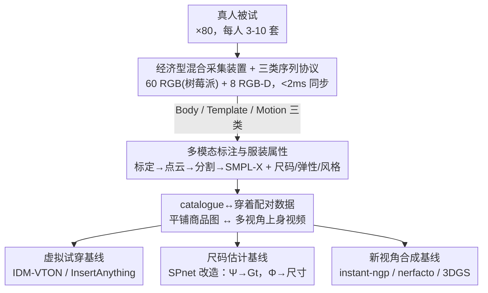

# MV-Fashion: Towards Enabling Virtual Try-On and Size Estimation with Multi-View Paired Data

**会议**: CVPR 2026  
**论文**: [CVF Open Access](https://openaccess.thecvf.com/content/CVPR2026/html/Laczko_MV-Fashion_Towards_Enabling_Virtual_Try-On_and_Size_Estimation_with_Multi-View_CVPR_2026_paper.html)  
**代码**: https://hunorlaczko.github.io/MV-Fashion (项目页/数据集主页)  
**领域**: 数据集 / 虚拟试穿 / 尺码估计  
**关键词**: 多视角数据集, 虚拟试穿(VTON), 尺码估计, 服装动态, 新视角合成

## 一句话总结
MV-Fashion 用一套由 60 台树莓派 RGB 相机 + 8 台 RGB-D 相机组成的"经济型"多视角同步采集装置，录下 80 位被试穿着 474 套（754 件）衣服的 3,273 段同步视频（共 72.5M 帧），并为每件衣服配上**平铺商品图（catalogue）↔ 上身穿着图**的配对、像素级分割、SMPL-X、点云、尺码表、面料弹性、穿搭风格等多模态标注，从而第一次把虚拟试穿、尺码估计、新视角合成所需的数据放进同一个数据集里，并给出三类任务的基线。

## 研究背景与动机

**领域现状**：服装相关的视觉研究目前被两类互不重叠的数据集割裂。一类是 2D 虚拟试穿（VTON）数据集（VITON-HD、DressCode、IGPair 等），它们最宝贵的资产是**配对数据**——把一件衣服的平铺商品图和它穿在人身上的样子一一对应起来，这是训练"把衣服 P 到人身上"模型的前提；但它们都是单视角 2D 图，没有任何 3D 几何或多视角信息。另一类是 3D/4D 人体数据集（4D-DRESS、DNA-Rendering、MVHumanNet++ 等），它们用大相机阵列采到几何和运动，但**完全没有 catalogue↔穿着的配对**，也缺少面向时尚的细粒度标注（尺码、面料、穿搭风格）。

**现有痛点**：没有任何一个数据集能同时提供"同步多视角 + catalogue 配对"。结果是 VTON 研究被锁死在单视角，做不了跨视角一致性、做不了根据真实尺码估算 fit；3D 数据集又喂不了 VTON 模型。合成数据（CLOTH3D/4D、BEDLAM）虽然标注完美、规模大，但有显著的**真实感鸿沟**，捕捉不到真实织物在松垮衣服（裙子、大衣）上的动态。而真实多视角采集（ActorsHQ、DNA-Rendering）又往往依赖昂贵设备，门槛高、数据量大到难以处理。

**核心矛盾**：配对数据（VTON 需要）和多视角几何/动态（3D 任务需要）这两类信息，历史上从来没被同一套采集协议同时拿到过；再加上真实采集要么贵、要么缺时尚专属标注。

**本文目标**：造一个数据集，让它同时具备 ①同步多视角视频、②catalogue↔穿着配对、③面向时尚的丰富标注（尺码表、面料弹性、穿搭风格、分层衣物），并用一套**用得起的现成硬件**实现，从而把 VTON、尺码估计、新视角合成统一到一份数据上。

**切入角度**：作者发现"贵"主要贵在工业级相机阵列上，于是用 60 台便宜的树莓派全局快门相机打底、只用 8 台 RGB-D 相机补深度和 4K，配电子同步把时间对齐压到 <2ms，就能用可负担的成本拿到密集多视角覆盖。

**核心 idea**：用"经济型混合多视角装置 + 三类序列录制协议 + catalogue 配对标注"造一个真实、带配对、带时尚细粒度标注的多视角时尚视频数据集，并给 VTON / 尺码估计 / NVS 三类下游任务建基线。

## 方法详解

这是一篇**数据集论文**，所以"方法"指的是数据怎么采、怎么标、怎么配对，以及作者用它跑通的三类下游基线。整体可以分成两段：先是数据生产管线（采集 → 标注 → 属性 → 配对），产出一个 72.5M 帧、带 catalogue 配对的多视角数据集；再是用这份数据为虚拟试穿、尺码估计、新视角合成各搭一个基线，证明"这数据真的能跑这些任务"。

### 整体框架

输入是真人被试穿着多套衣服在采集棚里做动作；输出是一个结构化的多视角数据集，每个序列都带同步多视角视频、点云、像素级分割、SMPL-X 体型/姿态、尺码表/面料/风格标注，以及对应的平铺商品图配对。数据集规模：80 位被试，每人 3–10 套衣服，共 474 套穿搭（754 件单品），3,273 段视频，72.5M 帧；分层情况为单层 326 套、双层 145 套、三层 3 套。

### 关键设计

**1. 经济型混合多视角采集装置 + 三类序列录制协议：用便宜硬件拿到密集同步覆盖，并按用途分录**

针对"真实多视角采集太贵、门槛高"的痛点，作者放弃工业相机阵列，改用 60 台树莓派全局快门相机（1.6 MP）做主力密集覆盖，只配 8 台 Orbbec Femto Bolt RGB-D 相机补充深度和 4K 画面；相机分三排装在一个 20 面的铝制框架上环绕被试，40 块大功率 LED 板提供恒定照明、压低曝光时间以减少运动模糊。关键在于**外部电子同步**把所有相机的帧对齐误差压到 <2ms，这是后续做跨视角几何、点云配准的前提——没有硬同步，多视角的"同一时刻"就对不齐。

录制协议把每套衣服拆成三类 20 秒、15fps 的序列，各司其职：**Body 序列**让被试穿极少衣物做固定标准姿势，用来估体型（脱离衣服干扰）；**Template 序列**让被试穿这套衣服做同样的固定姿势，捕捉衣服的静态几何作为"模板/canonical"参考；**Motion 序列**让被试做 5 个随机时尚姿势，捕捉衣服的动态形变，并尽量录多条以覆盖不同穿搭风格（卷袖、敞开/扣上外套）和分层场景（外面再加一件）。这套"体型基线 / 静态模板 / 动态运动"的三分法，正好对应下游尺码估计里需要的"canonical 模板 + 任意姿态输入"的配对。

**2. catalogue↔穿着配对数据：把 VTON 的命脉信息搬进多视角场景**

这是论文最核心的差异点。VTON 模型训练离不开"平铺商品图 ↔ 上身图"的配对，但所有 3D/4D 数据集都没有这个配对。MV-Fashion 给**每一段多视角视频序列**都配上对应衣服的平铺/商品图（正面、背面，且分常态与拉伸两种状态）。这意味着模型第一次可以在"同一件衣服既有标准商品图、又有它从任意视角穿在动态人身上的样子"这种监督下训练——既能做传统单视角 VTON，又能做单视角数据根本做不了的跨视角试穿（用正面商品图去合成背面姿态的穿着）。Table 1b 的对比里，能同时打勾 MV(多视角)、Paired(配对)、Video(视频)三项的只有 MV-Fashion 一家。

**3. 多模态标注与服装属性：把"尺码表"这种时尚专属、却从无公开数据的标注做进去**

针对"3D 数据集缺时尚细粒度标注"的痛点，作者搭了一条统一标注流水线，并补上几项业界稀缺的属性。几何/姿态侧：先用 AprilTags 标定相机内参/畸变/外参并做 RGB-深度立体标定，用 ColorICP 把深度精配成点云、再用多项式做颜色校正；前景与分层服装掩码用"两段式"——YOLOv8 和语义感知的 Qwen3-VL 做初始化、SAM2 做分割、再人工质检；人体用 RTMW-x 检 2D 关键点、三角化到 3D，再用**引入点云约束的改版 SMPLify-X** 拟合 SMPL-X（点云让最小穿着扫描的体型拟合更准）。

时尚属性侧最有价值的是**尺码表**：作者指出据其所知没有任何公开数据集提供详细 sizing chart，于是用卷尺手工量出每件衣服的尺寸表，并给出 14 类服装标签、贴身程度（slim/regular/loose 三档）、穿搭风格（卷袖、敞/扣外套、塞衣摆等）、面料与弹性（1=刚硬 到 5=高弹 的离散尺度）、以及 Qwen3-VL 生成的文字描述。为了让尺码分析可比，14 类衣服按测量部位合并成 6 组 G1–G6（如 G1=衬衫/上衣，G6=连衣裙），这组划分直接被尺码估计基线复用。

**4. 尺码估计基线：把为合成数据设计的 SPnet 改到真实数据上，并升级多任务结构**

尺码估计是论文里"方法味"最重的一块，也是个被严重忽视的难题——从任意姿态、有褶皱和垂坠的穿着图里反推真实尺寸非常难。作者改造 SPnet：编码-解码网络 $\Psi(G_s, P_s, P_t)$ 把"输入服装法线图 $G_s$ + 输入体姿 $P_s$ + 输出 canonical 姿态 $P_t$"映射成 canonical 姿态下的目标法线图 $G_t$，再由网络 $\Phi(G_t)$ 回归缝纫参数/尺寸。关键改动有三：① 训练数据从 SPnet 原本的合成数据换成 MV-Fashion 的**真实数据**（$G_s$ 来自 Motion 序列经分割+Sapiens 得到，$P_s$ 来自 SMPL-X 估计，$G_t/P_t$ 来自 Template 序列）；② $\Phi$ 改成回归**归一化**尺寸（除以数据集最大尺寸缩放到 $[0,1]$）；③ 对比三种 $\Phi$ 变体——按 G1–G6 各训一个的 per-group（SPnet 原做法）、所有组联合训的 multi-task、以及把 SegNet 编码器换成 SwinV2 且额外条件化 $P_t$ 的增强版。第三种把"不同组共享的测量规律"和"姿态对齐"都用上，拿到最低 MAE 4.279 cm，说明真实穿着图里确实含有足够信号来学准尺码。

## 实验关键数据

论文不追求 SOTA 数字，而是用基线证明"数据集能撑起这三类任务"。

### 数据集规模对比（Table 1，节选关键维度）

| 维度 | MVHumanNet++ | 4D-DRESS | VITON-HD | MV-Fashion(本文) |
|------|--------------|----------|----------|------------------|
| 帧数 | 645.1M | 78K | 13,679 | 72.5M |
| 被试/序列 | 4,500 / 60K | 32 / 520 | – | 80 / 3,273 |
| 多视角 | 是(48 cam) | 是(53 cam) | 否 | 是(68 cam) |
| catalogue 配对 | 否 | 否 | 是 | **是** |
| 尺码/风格/分层标注 | 否 | 部分 | 否 | **是** |

关键发现：单看帧数 MV-Fashion 不是最大（MVHumanNet++ 接近它的 9 倍），但它是**唯一**同时具备"多视角视频 + catalogue 配对 + 尺码/风格/分层标注"的数据集——这正是它要填的空白。

### 虚拟试穿基线（Table 3）

| 设置 | 方法 | SSIM↑ | LPIPS↓ | FID↓ |
|------|------|-------|--------|------|
| 单视角 | IDM-VTON | 0.881 | 0.086 | 10.187 |
| 单视角 | InsertAnything | 0.927 | 0.065 | 8.192 |
| 多视角 | IDM-VTON 跨视角 | 0.868 | 0.098 | 12.907 |
| 多视角 | IDM-VTON 视角自适应 | 0.873 | 0.093 | 12.775 |

### 尺码估计基线（Table 4，$\Phi$ 的 MAE，单位 cm，括号为 std）

| 组 | Per-Group | Multi-Task | Multi-Task + SwinV2 |
|----|-----------|------------|---------------------|
| G3(裙) | 9.951 (8.437) | 6.847 (9.174) | 6.643 (10.135) |
| G5(连体衣) | 12.109 (10.313) | 4.295 (2.746) | 4.889 (4.633) |
| 平均 | 4.904 (6.533) | 4.710 (6.392) | **4.279 (5.870)** |

法线预测器 $\Psi$ 全局 MAE 0.0163、SSIM 0.9355，说明它能有效把姿态从服装几何里解耦、恢复出 canonical 的衣服内在形状。

### 关键发现
- **配对数据是真有用**：单视角下两个现成 VTON 模型直接就能在 MV-Fashion 的正面配对子集上拿到高保真分数（InsertAnything SSIM 0.927），证明数据能即插即用现有 VTON 管线。
- **跨视角是真难**：把跨视角约束加进来后，IDM-VTON 所有指标都掉（FID 10.187→12.907），直接量化了"只给正面商品图、要合成背面姿态"的几何不一致难度；而把正背面商品图都喂给共享 IP-Adapter 的"视角自适应"设置能部分缓解失败（FID 回到 12.775），说明多视角配对确实打开了新研究空间。
- **多任务 + 姿态条件化最稳**：尺码估计里 SwinV2+$P_t$ 变体平均 MAE 最低（4.279 cm），尤其在样本可能偏少的 G5（连体衣）上，multi-task 把 per-group 的 12.1 cm 砍到 4.3 cm，体现了跨组共享测量规律的价值。
- **NVS 视角密度饱和在 56 视角**（Table 5）：3DGS(splatfacto) 随训练视角增多指标持续改善，但到 56 视角趋于饱和（PSNR 29.567），说明这套 68 相机的装置对 NVS 任务来说视角密度已经够用、再加相机收益递减——反过来佐证了"经济型装置规模合理"。

## 亮点与洞察
- **"配对"是这篇论文的灵魂**：它没发明新模型，但把 VTON 命脉的 catalogue↔穿着配对第一次搬进了多视角动态场景，一举打通了原本割裂的 2D-VTON 与 3D/4D 两个世界——这是个"数据结构层面"的创新，价值不在算法在 enabling。
- **用便宜硬件换密集覆盖的工程取舍很务实**：60 台树莓派 + 8 台 RGB-D 的混合方案，用电子同步把廉价相机的硬伤（时间对齐）补上，把"多视角真实采集"的门槛大幅拉低，这套思路对其他想自建采集棚的团队有直接借鉴意义。
- **"Body/Template/Motion 三类序列"的协议设计有迁移性**：把"估体型 / 拿静态模板 / 录动态"拆开录，天然产出了下游任务需要的 canonical↔posed 配对，这种"按下游需求反推录制协议"的做法值得做数据集时模仿。
- **手工尺码表填了真空白**：自己承认没有公开数据集提供详细 sizing chart，于是卷尺一件件量，这种"脏活"恰恰是把尺码估计这个被忽视任务做成可学习问题的关键。

## 局限与展望
- **被试人群有偏**：作者坦承因地理限制，被试以欧洲(56.8%)和美洲为主、亚洲仅 4.9%，体型/肤色/服饰文化分布不均，基于此训练的模型可能对欠代表人群泛化差或带偏见。
- **不提新架构，只给基线**：论文明确把"先进的可控试穿机制、多视角 VTON 新架构"留给未来工作；现有基线在语义可控（按风格提示改外观）上仍常失败、有可见 artifact，说明数据虽备好了、方法还远未解决。
- **分层/风格样本极不均衡**：三层衣物只有 3 套、某些品类的 style 变体也很少，会限制在这些长尾配置上学到的模型质量；尺码估计里 G3/G6（裙/连衣裙）的 MAE 明显高于其他组，反映褶皱/垂坠大的衣服仍是硬骨头。
- **改进方向**：补充更均衡的全球人群采集；在这份配对数据上真正训练原生的多视角一致 VTON 模型（而非改造单视角模型）；把面料弹性/材质标注用进物理仿真，做数据驱动的织物动态。

## 相关工作与启发
- **vs VITON-HD / DressCode / IGPair（2D 配对 VTON 数据集）**：它们有 catalogue 配对但只有单视角 2D，没法做跨视角一致；MV-Fashion 保留配对的同时加上同步多视角视频，把 VTON 从单视角解放出来。
- **vs 4D-DRESS / DNA-Rendering / MVHumanNet++（多视角人体数据集）**：它们有多视角几何和大规模，但无 catalogue 配对、缺时尚专属标注（尺码/面料/风格）；MV-Fashion 规模虽小一些，却补齐了这些 VTON/尺码所必需的信息。
- **vs CLOTH3D / BEDLAM（合成数据集）**：合成数据标注完美但有真实感鸿沟、捕不到真实织物动态；MV-Fashion 是真人真衣真采集，代价是标注要靠流水线+人工、规模受限。
- **vs SPnet（尺码/缝纫参数估计方法）**：SPnet 在合成数据上学缝纫参数；本文把它的 $\Psi/\Phi$ 结构搬到真实数据并升级成 multi-task+SwinV2，证明真实穿着图也能学准尺码。

## 评分
- 新颖性: ⭐⭐⭐⭐ 不在算法而在数据结构——首个"多视角 + catalogue 配对 + 时尚细粒度标注"三合一数据集，填了真实空白。
- 实验充分度: ⭐⭐⭐⭐ VTON/尺码/NVS 三类任务都给了基线和消融，足以证明数据可用；但每项都浅尝辄止、未训练原生新模型。
- 写作质量: ⭐⭐⭐⭐ 动机和数据集对比讲得很清楚，Table 1 的两张对比表说服力强；基线方法描述略简。
- 价值: ⭐⭐⭐⭐ 作为 enabling 数据集，给 VTON/尺码/NVS 社区提供了此前拿不到的配对多视角资源，长期复用价值高。

<!-- RELATED:START -->

## 相关论文

- [\[CVPR 2026\] Reliable Clustering Number Estimation for Contrastive Multi-View Clustering](reliable_clustering_number_estimation_for_contrastive_multi-view_clustering.md)
- [\[CVPR 2026\] Cross-View Distillation and Adaptive Masking for Incomplete Multi-View Multi-Label Classification](cross-view_distillation_and_adaptive_masking_for_incomplete_multi-view_multi-lab.md)
- [\[CVPR 2026\] Multi-Hierarchical Contrastive Spectral Fusion for Multi-View Clustering](multi-hierarchical_contrastive_spectral_fusion_for_multi-view_clustering.md)
- [\[CVPR 2026\] DF²-VB: Dual-level Fuzzy Fusion with View-specific Boosting for Multi-view Multi-label Classification](df2-vb_dual-level_fuzzy_fusion_with_view-specific_boosting_for_multi-view_multi-.md)
- [\[CVPR 2026\] Imbalanced View Contribution Evaluation and Refinement for Deep Incomplete Multi-View Clustering](imbalanced_view_contribution_evaluation_and_refinement_for_deep_incomplete_multi.md)

<!-- RELATED:END -->
