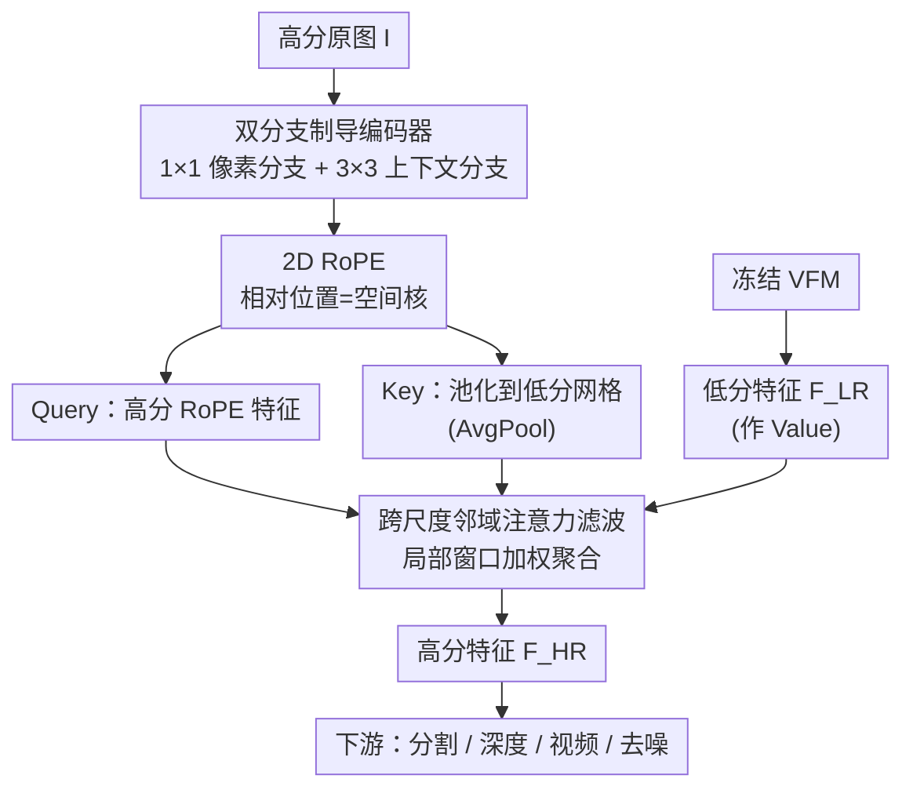

# NAF: Zero-Shot Feature Upsampling via Neighborhood Attention Filtering

**会议**: CVPR 2026  
**论文**: [CVF Open Access](https://openaccess.thecvf.com/content/CVPR2026/html/Chambon_NAF_Zero-Shot_Feature_Upsampling_via_Neighborhood_Attention_Filtering_CVPR_2026_paper.html)  
**代码**: https://github.com/valeoai/NAF  
**领域**: 通用视觉算子 / 特征上采样  
**关键词**: 特征上采样, 视觉基础模型, 零样本, 邻域注意力, 联合双边滤波

## 一句话总结
NAF 把"上采样视觉基础模型（VFM）的低分辨率特征"重新表述为一次**只看高分辨率原图、不看 VFM 特征本身**的邻域注意力滤波——训练一次就能零样本套到任意 VFM（包括 7B 大模型）、任意放大倍率上，在语义分割、深度估计、开放词汇分割、视频传播等多个下游任务上同时刷新 SOTA，速度还比同类方法快约 4 倍。

## 研究背景与动机
**领域现状**：DINOv2、RADIO、DINOv3、SigLIP2 这类视觉基础模型（VFM）能从图像里抽出语义极强的特征，但出于算力和结构原因，输出特征图的空间分辨率被大幅下采样（通常是原图的 1/14 或 1/16）。对语义分割、深度估计这类需要逐像素精度的任务，这种粗糙特征很吃亏。直接放大输入图能提分辨率，但大多数 VFM 不具备尺度不变性，放大输入反而掉点，而且算力随分辨率平方膨胀。所以主流做法是**直接对 VFM 输出的低分辨率特征做上采样**。

**现有痛点**：现有上采样器陷在一个两难里。一端是经典滤波器（双边滤波 JBF、联合双边上采样 JBU），快、通用、可解释，但用的是固定形式的核（如高斯），表达力不足、精度有限。另一端是学习式上采样器（FeatUp、JAFAR、LoftUp），精度高，但它们的制导信号都**依赖具体 VFM 的低分辨率语义特征**，换一个 VFM 就得重新训练；而且管线复杂、吞吐低、显存大、最大可行放大倍率受限（FeatUp/LiFT 甚至只支持固定倍率）。

**核心矛盾**："通用性/速度"和"精度"被绑死了——想要高精度就得把上采样器和某个 VFM 的特征分布耦合在一起，从而丧失零样本迁移能力；想要 VFM 无关（如 JBU、并发工作 AnyUp）又打不过 VFM 专用方法，AnyUp 的制导计算其实仍然要读 VFM 低分特征、且比最好的专用方法还慢。

**本文目标**：造一个真正 VFM 无关、零样本即插即用、还能反超 VFM 专用上采样器的模块，同时保持经典滤波器的速度与可解释性，并能扩展到 2K 分辨率和 7B 级大模型。

**切入角度**：作者注意到一个关键事实——**上采样所需的"哪些邻居该被加权聚合"的线索，其实主要藏在高分辨率原图里（边缘、纹理、局部结构），而不是非得来自 VFM 的低分语义特征**。既然如此，就把制导信号完全从原图里抽，彻底切断对 VFM 特征的依赖。

**核心 idea**：把上采样写成一次"邻域注意力滤波"——注意力的 value 直接就是 VFM 低分特征，而决定权重的 Query/Key **只从高分原图编码得到**；用跨尺度邻域注意力 + RoPE 学一个数据自适应、空间与内容双重感知的聚合核。作者进一步证明这等价于隐式学习了聚合核的逆离散傅里叶变换（IDFT），即网络预测频域谱系数、再重建出空间滤波核，从而既保留经典滤波的可解释性，又获得学习式方法的灵活性。

## 方法详解

### 整体框架
NAF 解决的问题是：给定高分原图 $\mathbf{I}\in\mathbb{R}^{H_{HR}\times W_{HR}\times 3}$ 和某个 VFM 抽出的低分特征 $\mathbf{F}^{LR}\in\mathbb{R}^{H_{LR}\times W_{LR}\times d}$，重建出对齐原图细节的高分特征 $\mathbf{F}^{HR}$（放大倍率 $s$）。整体只有一条很短的路：原图先过一个轻量的**双分支制导编码器** $\mathrm{Enc}_\theta$ 得到高分制导图，加上 **2D RoPE** 后，高分位置上的 RoPE 特征当 Query $Q$、把同一套特征平均池化到低分网格当 Key $K$；VFM 的低分特征 $\mathbf{F}^{LR}$ 直接充当 attention 的 Value；最后做一次**跨尺度邻域注意力**，每个高分像素只在其对应低分位置周围的小窗口里聚合，输出高分特征。注意：整条路里 VFM 是冻结的、只贡献 Value，所有"该怎么加权"的决策都来自原图，这正是零样本可迁移的来源。

核心聚合公式（式 3）：

$$\mathbf{F}^{HR}_{p}=\frac{1}{Z(p)}\sum_{q\in\mathcal{N}(p)}\exp\!\left(\frac{\langle Q_p,K_q\rangle}{\sqrt{d}}\right)\mathbf{F}^{LR}_{q}$$

其中 $\mathcal{N}(p)$ 是局部邻域，$Z(p)$ 是归一化因子。它和经典联合双边滤波（式 1）$\mathbf{F}^{HR}_p=\frac{1}{Z(p)}\sum_q w(p,q\mid\mathbf{G})\,\mathbf{F}^{LR}_q$ 形式同构——只是把手工设计的固定权重 $w$ 换成了从原图学出来的注意力权重。

### 关键设计

**1. 跨尺度邻域注意力滤波：把上采样写成一次局部注意力聚合**

痛点是经典滤波器核的形状被写死（高斯/双边），表达力不够；而全局注意力又太重、显存爆。NAF 把式 3 中的注意力 value 直接设为 VFM 低分特征，权重由 Query/Key 内积经 softmax 得到，并且**每个高分 query 只 attend 到它对应低分位置周围的一个紧凑邻域**（跨尺度，因为 query 在高分网格、key/value 在低分网格）。这样做有两层好处：一是局部性大幅压掉 key–query 交互量，相比 JAFAR 约省 40% GFLOPs，从而能撑到 2K 特征图、72× 放大倍率、甚至 7B VFM；二是作者在附录里证明这个聚合等价于学习核的逆离散傅里叶变换——网络其实在预测频域谱系数，再 IDFT 还原出一个空间核，于是兼得经典滤波的可解释性和学习核的自适应性。和"先把特征怼进复杂解码器"的学习式方法相比，它本质还是一次滤波，所以又快又轻。

**2. 制导只来自原图、Key 由 Query 池化得到：实现真正的 VFM 无关零样本**

这是 NAF 最关键的一刀，针对的痛点是"现有方法的制导都要读 VFM 低分语义特征，所以换 VFM 必须重训"。NAF 让 Query 和 Key **全部从高分原图编码 $\mathrm{Enc}_\theta(\mathbf{I})$ 里产生**，VFM 特征只当 Value、完全不参与"该加权谁"的决策。具体地，Query 是高分位置的 RoPE 特征 $Q_p:=\mathrm{RoPE}(\mathrm{Enc}_\theta(\mathbf{I}))_p$（式 4）；Key 则是把同一套高分制导特征**平均池化**到低分网格 $K_q:=\mathrm{AvgPool}_{q'\in q}[\mathrm{RoPE}(\mathrm{Enc}_\theta(\mathbf{I}))_{q'}]$（式 5），即对落入低分位置 $q$ 的所有高分像素取平均，保证 Key 和低分特征几何对齐。和 JAFAR/AnyUp"Query、Key 各用一条独立分支编码"不同，NAF 的 Key 直接由 Query 池化而来，从而保证制导机制与 VFM 特征彻底解耦——推理时换任何 VFM 都不用重训。消融还发现：在池化后再加 1×1 卷积去混合通道（即 JAFAR/AnyUp 的做法）反而显著掉点，因为它破坏了 Query 与 Key 之间的通道对齐，所以 NAF 坚持用最朴素的 AvgPool。

**3. 用 2D RoPE 当"空间核"、双分支编码器抓"内容核"：把经典双边滤波拆成两件可学的事**

经典联合双边滤波把权重分解成"空间邻近度 × 内容相似度"两项。NAF 用注意力把这两项各自交给一个可学组件。**空间核**由 2D 旋转位置编码 RoPE 提供：它把相对空间偏移直接编进 Query/Key 的内积里，不增加任何参数就能表达"越近权重越大"的几何先验；消融里 RoPE 明显优于不加位置编码、Manhattan 核、Gaussian 核等显式乘性空间核。**内容核**由双分支制导编码器提供：受 Inception 启发，编码器一支用堆叠 1×1 卷积抽逐像素细节（pixel 分支），一支用 3×3 卷积聚合局部上下文（context 分支），各出 $C/2$ 通道后拼接；消融显示去掉 context 分支会掉点，说明仅靠逐像素信息不足以刻画局部结构。两者相乘，就还原出一个"既看位置又看外观、且完全来自原图"的自适应滤波核。

### 损失函数 / 训练策略
训练极简：给定高分图 $\mathbf{I}^{HR}$，用因子 2 的双线性下采样造出低分图 $\mathbf{I}^{LR}$；同一个 VFM 对二者分别抽特征，高分特征 $\mathbf{F}^{HR}$ 当监督目标、低分特征 $\mathbf{F}^{LR}$ 当输入。NAF 用 $\mathbf{I}^{HR}$ 作制导把 $\mathbf{F}^{LR}$ 上采样回去，只用一个 $\ell_2$ 重建损失 $\mathcal{L}_{train}=\|\hat{\mathbf{F}}^{HR}-\mathbf{F}^{HR}\|_2^2$。和 FeatUp/LoftUp/AnyUp 不同，NAF **不用**总变差、分割掩码、裁剪一致性等任何额外正则项。主实验默认用 DINOv3-B 特征训练（一次），主配置取 $C=256,\,L=2$。

## 实验关键数据

### 主实验

跨 VFM 的线性探测（Pascal VOC 语义分割 mIoU / NYUv2 深度估计 δ1），∆Mean 相对最近邻基线：

| 方法 | VFM 无关 | 分割 ∆Mean (mIoU) | 深度 ∆Mean (δ1) | DINOv3-7B 可用 |
|------|:---:|:---:|:---:|:---:|
| FeatUp | ✗ | +3.29 | +2.09 | 否（OOM） |
| AnyUp | ✓ | +4.09 | +2.52 | 是 |
| JAFAR | ✗ | +5.12 | +2.39 | 否（OOM） |
| **NAF** | ✓ | **+5.58** | **+3.16** | **是** |

NAF 是**第一个反超 VFM 专用方法（JAFAR）的 VFM 无关上采样器**；在 DINOv3-7B 这种大模型上，专用方法直接显存爆炸训不了，NAF 仍可用，深度 δ1 比最近邻提升达 +12.69。

效率对比（×16 上采样，输入 (384,28,28)）：

| 方法 | VFM 无关 | 参数量(M) | GFLOPs | FPS | 最大放大比 |
|------|:---:|:---:|:---:|:---:|:---:|
| JBU | ✓ | 0.03 | 4.88 | 4 | 28 |
| AnyUp | ✓ | 0.88 | 329 | 5 | 32 |
| JAFAR | ✗ | 0.63 | 366 | 11 | 32 |
| **NAF** | ✓ | 0.66 | 265 | **18** | **72** |

NAF 比并发工作 AnyUp 约快 4 倍、少 25% 参数，最大放大比却从 32 提到 72。

### 消融实验

注意力 Key 设计 + 空间编码（Cityscapes 线性探测 mIoU，均值）：

| 配置 | Mean mIoU | 说明 |
|------|:---:|------|
| AvgPool（默认 Key）| **60.41** | 局部平均聚合，最佳 |
| MaxPool | 59.93 | 最大池化，略逊 |
| Bilinear（无池化）| 59.66 | 去掉局部聚合，掉点 |
| AvgPool + Conv. | 58.38 | 仿 JAFAR/AnyUp 加 1×1 卷积，**反而最差** |
| RoPE（默认空间编码）| **60.41** | 相对位置最佳 |
| Gaussian 核 | 58.19 | 显式高斯空间核 |
| Manhattan 核 | 58.03 | 显式 L1 空间核 |
| ∅（无位置编码）| 57.07 | 缺空间感知，最差 |

编码器设计（Kitti360 mIoU 均值）：仅 pixel 分支 59.86 → 加 context 分支 60.41；双分支块优于 Inception(59.56)/ResNet(59.79) 块；放大到 $C=768,L=5$ 的 NAF++ 可达 64.56，但 FPS 从 18 跌到 3。

### 关键发现
- **制导解耦是性能与通用性的双重来源**：把 Key 改成"AvgPool + Conv"（即让 Key 独立混合通道、贴近 JAFAR/AnyUp 的做法）会掉到 58.38，作者归因于它破坏了 Query–Key 的通道对齐——这从反面印证"Key 必须由 Query 池化而来"是关键。
- **位置编码不可或缺**：去掉位置编码直接掉到 57.07，RoPE 不加参数却能最好地表达相对几何，优于一切显式空间核。
- **经典滤波在跨数据集设置里意外坚挺**：在固定 DINOv3-B、跨 COCO/VOC/ADE20K/Cityscapes 的设置下，JAFAR、FeatUp、AnyUp 竟然打不过 bicubic，而 JBF/JBU 这类经典方法反而更好；NAF 仍以 +4.23 mIoU 稳居最佳，说明它继承了经典滤波的鲁棒性。
- **跨任务即插即用**：在开放词汇分割（ProxyCLIP）上 +1.04 mIoU（次优 JAFAR 仅 +0.63）、视频物体分割传播（DAVIS）上 +3.37，均作为 drop-in 替换、无需额外训练。
- **可泛化到去噪**：把同一架构（邻域核从 9 扩到 15）用于图像去噪，参数仅 0.66M 却逼近 26.13M 的 Restormer，且在椒盐噪声下显著优于传统去噪网络。

## 亮点与洞察
- **"上采样=滤波=注意力=IDFT"的统一视角很漂亮**：把上采样写成式 3 的邻域注意力后，既能和经典联合双边滤波（式 1）一一对应、保留可解释性，又能证明它在隐式学习聚合核的频域谱系数，理论与工程罕见地对齐。
- **"Value 用 VFM 特征、QK 只用原图"是点睛之笔**：一句话切断了对目标特征分布的依赖，零样本迁移、对 7B 大模型可用、换 VFM 不重训，这三件事全靠这一个解耦决策同时拿到。
- **Key = Query 的池化，朴素到反直觉却最优**：别人加卷积混通道结果掉点，NAF 用最简单的 AvgPool 保住通道对齐，提醒人"对齐"比"表达力"在这里更重要——这个 trick 可迁移到任何需要跨分辨率匹配 Q/K 的场景。
- **极简训练（单 $\ell_2$、无任何正则）还能 SOTA**，说明强约束来自架构归纳偏置（局部性 + 原图制导 + RoPE），而非训练 trick。

## 局限与展望
- **Value 永远是 VFM 的低分特征，NAF 不创造新语义**：它只是个聪明的"重加权插值器"，若 VFM 低分特征本身就漏掉了某个小目标的语义，NAF 无从凭原图凭空补回，上采样质量有天花板。
- **图像去噪上仍输给专用模型**：Restormer 用 40× 参数仍领先，且 NAF 在高强度高斯噪声（σ=0.5）下明显落后，说明"通用滤波器"在重度退化任务上不及任务专用架构。
- **跨任务横向数字不可直接比大小**：不同表里的 ∆Mean 基线、任务难度、VFM 各异（如分割 +5.58 与深度 +3.16 不可直接比），结论需带 caveat。
- **可改进方向**：默认仅在 2× 下采样的合成对上训练，更大尺度差或真实退化下的泛化未充分验证；邻域窗口大小（9 vs 15）需按任务手调，能否自适应是个开放问题。

## 相关工作与启发
- **vs 经典滤波（JBF / JBU）**：它们用固定形式的核（高斯 + 强度相似度），快且 VFM 无关但表达力受限；NAF 保留同样的滤波形式与 VFM 无关性，但把核换成从原图学出的注意力权重，因此精度大幅反超，同时不丢可解释性。
- **vs VFM 专用上采样器（FeatUp / JAFAR / LoftUp）**：它们靠读 VFM 低分语义特征算制导、精度高但换 VFM 必重训、且对 7B 大模型 OOM；NAF 制导只来自原图，零样本迁移、对大模型可用，并首次以 VFM 无关身份反超 JAFAR。
- **vs 并发的 VFM 无关方法 AnyUp**：AnyUp 虽号称无关，但制导计算仍依赖 VFM 低分特征、且比最好的专用方法更慢更重；NAF 用"原图制导 + Key 池化自 Query"彻底解耦，约快 4 倍、少 25% 参数、重建质量更高。
- **启发**：当任务本质是"跨分辨率聚合"时，与其把上采样器和源特征绑死，不如把"该聚合谁"的决策外包给一个分布无关的旁路信号（这里是原图）——这种"决策与载荷解耦"的思路可迁移到跨模态对齐、特征蒸馏等需要换 backbone 不重训的场景。

## 评分
- 新颖性: ⭐⭐⭐⭐⭐ "原图制导 + Value 用 VFM 特征"的解耦一举拿下零样本、VFM 无关、反超专用方法三件事，并配 IDFT 理论解释。
- 实验充分度: ⭐⭐⭐⭐⭐ 跨多 VFM、多数据集、多模型尺寸、多下游任务（分割/深度/开放词汇/视频/去噪）+ 细致消融，覆盖面很广。
- 写作质量: ⭐⭐⭐⭐ 动机与方法叙述清晰、与经典滤波的类比讲得透；公式密集，部分理论推导放附录略增阅读门槛。
- 价值: ⭐⭐⭐⭐⭐ 训一次即插即用到任意 VFM、能上 7B 与 2K，是非常实用的通用视觉算子，落地价值高。

<!-- RELATED:START -->

## 相关论文

- [\[CVPR 2026\] Upsample Anything: A Simple and Hard to Beat Baseline for Feature Upsampling](upsample_anything_a_simple_and_hard_to_beat_baseline_for_feature_upsampling.md)
- [\[CVPR 2026\] UPLiFT: Efficient Pixel-Dense Feature Upsampling with Local Attenders](uplift_efficient_pixel-dense_feature_upsampling_with_local_attenders.md)
- [\[ICLR 2026\] AnyUp: Universal Feature Upsampling](../../ICLR2026/others/anyup_universal_feature_upsampling.md)
- [\[CVPR 2026\] Hyperbolic Defect Feature Synthesis for Few-Shot Defect Classification](hyperbolic_defect_feature_synthesis_for_few-shot_defect_classification.md)
- [\[CVPR 2026\] Language Does Matter for Cross-Domain Few-Shot Visual Feature Enhancement](language_does_matter_for_cross-domain_few-shot_visual_feature_enhancement.md)

<!-- RELATED:END -->
