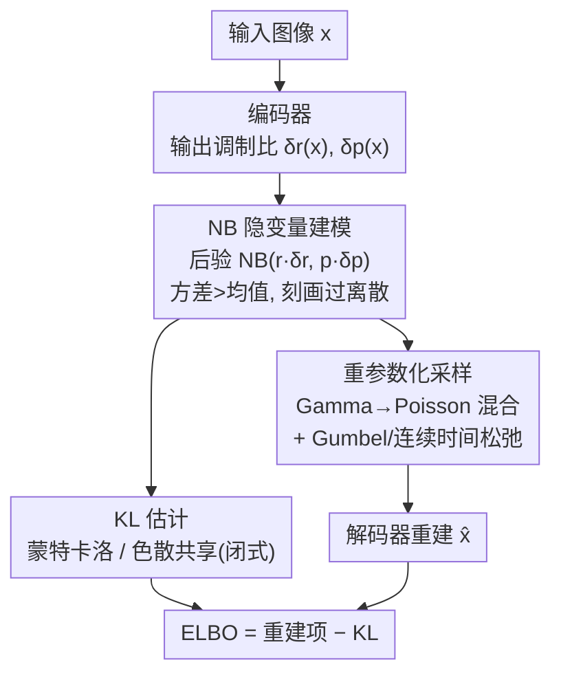

# Negative Binomial Variational Autoencoders for Overdispersed Latent Modeling

**会议**: CVPR 2026  
**论文**: [CVF Open Access](https://openaccess.thecvf.com/content/CVPR2026/html/Zhang_Negative_Binomial_Variational_Autoencoders_for_Overdispersed_Latent_Modeling_CVPR_2026_paper.html)  
**代码**: https://github.com/co234/NegBio-VAE  
**领域**: 概率生成建模 / VAE  
**关键词**: 负二项分布、离散隐变量、过离散、VAE、重参数化采样

## 一句话总结
把 VAE 的离散脉冲隐变量从泊松分布换成负二项分布，引入一个色散参数让方差能超过均值，从而刻画真实神经脉冲的"过离散"，并配套设计了可训练的 KL 估计与重参数化采样，在四个数据集上把重建和生成质量同时拉到优于单层 VAE 基线。

## 研究背景与动机

**领域现状**：人工神经网络常被说成"受大脑启发"，但大多数模型用的是连续激活，而真实神经元是靠离散的动作电位（脉冲）通信的。为了缩小这条鸿沟，近年有一类工作给 VAE 换上离散隐变量——其中 Poisson VAE（P-VAE）用泊松分布把数据编码成"脉冲计数"，既有生物可解释性，又能建模计数结构，是这条线上的代表作。

**现有痛点**：泊松分布有一个写死的假设——**均值必须等于方差**。但真实皮层记录里的神经脉冲普遍是"过离散"（overdispersion）的：方差显著大于均值，源头是试次间增益波动、网络级涨落等神经生物学因素。泊松把均值和方差绑死，等于强行假设这种波动不存在，结果是低估了不确定性、隐空间表达力受限。

**核心矛盾**：单参数的泊松分布在"计数建模"和"灵活刻画离散程度"之间没有自由度——你一旦定了均值，方差就被锁死。要既保留离散计数表示、又能让方差独立于均值放大，就需要一个多出一个自由度的计数分布。

**本文目标**：在保留 P-VAE 离散脉冲表示与可解释性的前提下，让隐变量能表达过离散；并且要让这个更灵活的模型真的能稳定训练出来。

**切入角度**：负二项分布（NB）正是泊松的两参数推广——多出来的色散参数允许方差超过均值，且当色散趋于无穷时退化回泊松。它在脉冲神经元建模、RNA 测序、语言建模里都被验证过适合过离散计数，是替换泊松的天然候选。

**核心 idea**：用负二项分布替换 P-VAE 里的泊松分布来建模过离散的隐脉冲计数（NegBio-VAE），并解决随之而来的两个训练障碍——NB 之间没有闭式 KL、以及 NB 离散采样不可直接重参数化。

## 方法详解

### 整体框架
NegBio-VAE 的骨架仍是标准 VAE：编码器把图像 $x$ 映成隐脉冲计数 $z\in\mathbb{Z}_{\ge0}^K$ 的后验分布，解码器从 $z$ 重建图像，训练目标是最大化 ELBO。唯一但关键的改动是：先验和后验都从泊松换成**负二项**。先验取 $p(z)=\mathrm{NB}(z;r,p)$，后验取 $q(z\mid x)=\mathrm{NB}(z;r\odot\delta_r(x),\,p\odot\delta_p(x))$，其中 $\delta_r(x)、\delta_p(x)$ 是编码器输出、表示后验参数相对先验参数的调制比例（与 P-VAE 同款的"调制比"设计），分布在 $K$ 个神经元上完全因子化。

换分布带来一个"灵活但难训"的问题：ELBO 里那两项——KL 正则项和重建期望项——在泊松下都有现成办法，但在 NB 下都失效了。两条 NB 之间的 KL 没有闭式解，NB 的离散采样也没有标准的可重参数化形式。所以方法的主体不是搭新网络，而是把这两个数值障碍各自打通，让"NB 当隐变量的 VAE"从理论上的好想法变成实际能跑的模型。

### 关键设计

**1. 负二项隐脉冲建模：给离散计数松绑均值-方差**

针对泊松"均值=方差"锁死过离散的痛点，本文把隐变量分布换成 NB。NB 是泊松的两参数推广，其均值为 $r(1-p)/p$、方差为 $r(1-p)/p^2$——因为方差比均值多乘了一个 $1/p$、而 $p\in(0,1)$，所以**方差天然大于均值**，正好对上神经脉冲的过离散。后验沿用 P-VAE 的"调制比"思路：编码器不直接吐参数，而是输出相对先验的缩放 $\delta_r(x)、\delta_p(x)$，再去乘先验的 $r、p$。这样隐空间在保留离散计数、可解释性的同时，多出一个色散自由度去匹配每个神经元各自的波动强度。一个值得注意的细节是：即便后验和先验共享同一个 $r$，只要 $p$ 不同，二者的均值和方差仍然不同，所以"共享色散"并不会牺牲后验刻画差异分布的能力——这一点是下面闭式 KL 能成立的前提。

**2. 两套 KL 估计：在"无偏但高方差"和"有偏但稳定"之间给选择**

NB 之间的 KL 没有闭式解，这是训练第一道坎。本文给两条路。其一是**蒙特卡洛估计**：直接用 $D_{KL}[q\|p]=\mathbb{E}_q[\log q(z)-\log p(z)]$，从后验采样、平均后验与先验的对数密度之差，代回 ELBO 得到一个只要能采样就能优化的目标。它不对后验做任何假设，但梯度方差偏高。其二是**色散共享（Dispersion Sharing）**：作者注意到当两条 NB 共享色散参数（即令 $\delta_r(x)=1$，使先验后验同 $r$）时，KL 反而有闭式解：

$$D_{KL}\big[\mathrm{NB}(z;r,p\odot\delta_p)\,\|\,\mathrm{NB}(z;r,p)\big]=\sum_{i=1}^{K}r_i\,g(p_i,\delta_{p_i}),\quad g(a,b)=\log b+\frac{1-ab}{ab}\log\!\frac{1-ab}{1-a}.$$

这把 KL 项变成一个可解析计算的求和，省掉采样噪声。两者各有取舍：MC 无假设但梯度噪声大；色散共享虽然约束了 $r$ 相等（如前所述仍能靠 $p$ 表达过离散），但解析 KL 让优化更平稳、实践中训练更稳定。论文把两者都作为可切换配置（实验里的 MC 与 DS 系列）。

**3. 经 Gamma–Poisson 混合做 NB 的可重参数化采样**

第二道坎是 ELBO 的重建期望需要对 NB 采样、且要能回传梯度，但离散分布不能直接重参数化。本文利用 NB 的一个关键性质——**NB 是泊松的连续混合，混合权重服从 Gamma 分布**：

$$\mathrm{NB}(z;r,p)=\int_0^\infty \mathrm{Poi}(z\mid\lambda)\,\mathrm{Gamma}\!\Big(\lambda;r,\tfrac{p}{1-p}\Big)\,d\lambda.$$

于是从 NB 采样被拆成两步：先 $\lambda\sim\mathrm{Gamma}(r,\frac{p}{1-p})$，再 $z\sim\mathrm{Poi}(\lambda)$。第一步的 Gamma 采样可用隐式重参数化梯度（PyTorch `Gamma.rsample()` 底层用 Marsaglia–Tsang 并保证可微）。第二步的泊松采样仍不可直接重参数化，于是用松弛技巧把"硬计数"变"软计数"：一是 **Gumbel-Softmax 松弛**，把泊松当作截断支撑 $\{0,\dots,Z_{\max}\}$ 上的类别分布，用温度 $\tau$ 控制软化程度，$\tilde z=\sum_{z} z\cdot\mathrm{softmax}\big((\log\mathrm{Poi}(z)+\eta_z)/\tau\big)$，$\tau\to0$ 时收敛回泊松；二是**连续时间模拟**，借泊松过程视角，把"单位区间内事件数"用指数分布的到达间隔模拟出来，$\tilde z=\sum_{n}\sigma((1-S_n)/\tau)$（$S_n$ 是间隔累加和，$\sigma$ 是 sigmoid）。两者都有效，经验上连续时间松弛给出更平滑的计数、Gumbel-Softmax 更锐利，构成实验里的 G / C 两个分支。

### 损失函数 / 训练策略
最终目标就是 NB 版 ELBO：重建期望项 $\mathbb{E}_{q}[\log p_\omega(x\mid z)]$ 减去 NB-KL 项，KL 按 MC 或色散共享二选一计算。解码器用高斯似然 $p_\omega(x\mid z)=\mathcal{N}(x;f_\omega(z),\sigma^2 I)$，于是重建项等价于带系数 $\beta=2\sigma^2$ 的 MSE，这个 $\beta$ 同时充当了 KL 项的权重，用来平衡重建与正则。默认隐维度固定为 256，编解码器一般用卷积网络。把 KL 估计（MC/DS）与重参数化（Gumbel/连续时间）两两组合，就得到 MC-G、MC-C、DS-G、DS-C 四个变体。

## 实验关键数据

### 主实验
四个数据集（MNIST、Fashion-MNIST、CIFAR16×16、CelebA-64）上同时比重建（MSE↓、SSIM↑）和生成（FID↓、KID↓）。对比的是单层 VAE 基线：G-VAE、L-VAE、C-VAE、P-VAE（论文明确不与 NVAE、Very Deep VAE 等分层模型直接比，认为对单层模型不公平）。

| 数据集 | 指标 | 最佳 NegBio 变体 | P-VAE（最强基线） | 说明 |
|--------|------|------------------|-------------------|------|
| MNIST | FID@10k↓ | 78.4（MC-G） | 104.1 | 生成质量大幅领先 |
| MNIST | MSE↓ | 0.0123（MC-C） | 0.0125 | 重建持平略优 |
| Fashion-MNIST | FID@10k↓ | 125.9（MC-G） | 146.0 | 生成明显更好 |
| CIFAR16×16 | FID@10k↓ | 39.8（MC-G） | 59.1 | FID 降到 39.8，提升最大 |
| CIFAR16×16 | SSIM↑ | 0.809（DS-C） | 0.679 | 重建结构保真大幅提升 |
| CelebA-64 | FID@10k↓ | 83.6（DS-G） | 87.8 | 复杂数据上仍最低 |

整体规律：MC-G 变体在生成（FID/KID）上几乎全数据集最好；MC-C / DS-C 在重建（MSE/SSIM）上更强。CelebA-64 上重建误差略高于 P-VAE，作者归因于生物启发先验带来的更强正则，但换来了更结构化的隐表示。

### 隐表示下游评测

| 任务 | 设置 | NegBio-VAE | 最强基线 | 说明 |
|------|------|-----------|----------|------|
| 碎片化预测 | MNIST, N=200 | 0.811 | 0.798（L-VAE） | 标签扰动下更鲁棒 |
| 碎片化预测 | Shattering Dim. | 0.898 | 0.892（L-VAE） | 隐空间可分性更强 |
| 少样本(LR) | MNIST 20-shot | 0.865 | 0.838（P-VAE） | 监督越多差距越大 |
| 少样本(LR) | CIFAR 20-shot | 0.266 | 0.261（P-VAE） | 跨数据集仍领先 |

### 消融实验
| 配置 | 结论 | 说明 |
|------|------|------|
| 解码器架构（线性编码器固定） | MLP 解码器 MSE/SSIM 最优，卷积解码器 FID/KID 最优，线性最差 | 解码器容量对重建与生成都关键 |
| $\beta$ 缩放 | 小 $\beta$(0.2–0.4)利重建，$\beta\approx1.0$ 时 FID 最佳，$\beta>2.0$ 双双退化 | 0.6–1.0 是重建-生成最佳折中 |
| MC 样本数 5→25 | 各指标基本稳定 | 模型对采样方差鲁棒，少量样本即可 |

### 关键发现
- **KL 估计和重参数化的组合决定偏好**：MC-G 偏生成、MC-C / DS-C 偏重建——没有一个变体全面通吃，是个有意思的 trade-off 信号。
- **NB 隐变量带来的过离散直接反映在生成多样性上**：CIFAR 上 FID 从 59.1 砍到 39.8，作者认为正是更灵活的方差让隐空间能捕捉更丰富的生成模式。
- **MC 样本数只需很少**：从 5 增到 25 几乎无增益，说明重参数化采样方差控制得不错，训练成本不会因 MC 而爆炸。
- **$\beta$ 的"重建↔生成"反向调节**：小 $\beta$ 利重建、大 $\beta$ 利生成，和经典 β-VAE 的解耦直觉一致，但这里是在离散 NB 隐空间上观察到。

## 亮点与洞察
- **"换一个分布"换出真问题，并把真问题逐个打通**：把泊松换 NB 只是一句话，但 NB-KL 无闭式、NB 不可重参数化是两个硬骨头；论文的真正价值在于给出了可落地的 MC / 色散共享 KL 和 Gamma–Poisson 混合采样，让这个想法能训练。
- **色散共享的"以约束换闭式"很巧**：发现"共享 $r$ 时 KL 有解析解、但靠 $p$ 仍能表达过离散"，等于找到一个几乎免费的稳定化技巧——既拿到解析 KL，又没丢掉建模过离散的核心能力。
- **Gamma–Poisson 混合是可迁移的采样套路**：把"难采样的复合离散分布"拆成"可重参数化的连续分布 + 一步可松弛的简单离散分布"，这套拆分思路可以迁移到其他需要重参数化的离散隐变量模型。
- **生物可解释性与工程指标罕见地同向**：很多"生物启发"改动是以掉指标为代价的，这里换上更符合神经统计的 NB 反而把 FID/SSIM 一起拉高，是个正向案例。

## 局限与展望
- **只在单层、低分辨率小数据集上验证**：四个数据集都偏简单（MNIST/CIFAR16×16/CelebA-64），且刻意回避了与 NVAE、Very Deep VAE 等分层强模型的比较，所以"优于基线"的结论仅限单层设定，能否扩到高分辨率/复杂分布未知。
- **作者承认的理论空白**：KL 估计与重参数化的不同选择如何影响训练与表示，目前缺乏更深的理论刻画，只能靠经验在 MC/DS、G/C 之间挑。
- **变体偏好需手动权衡**：没有一个变体同时拿下重建和生成最优，实际用时要按任务在 MC-G/MC-C/DS-C 间做取舍，缺乏自适应选择机制；作者把"按数据特性自适应重参数化"列为未来工作。
- **过离散假设的适用边界**：NB 只能表达方差≥均值的过离散；论文也提到带不应期的神经元会出现欠离散（方差<均值），这类情形 NB 反而不如泊松，框架未覆盖。

## 相关工作与启发
- **vs Poisson VAE (P-VAE)**：本文的直接母版。P-VAE 用泊松建模脉冲计数但锁死均值=方差；本文换 NB 多出色散参数解开这个约束，代价是要额外解决 KL 与采样两个数值问题，换来过离散建模能力和更好的下游表示。
- **vs Categorical / Bernoulli 离散 VAE**：这些用类别/伯努利分布做离散隐变量，擅长语音合成、图像生成，但不是为"计数 + 过离散"设计的；本文专注计数型隐变量的统计变异性。
- **vs 用 NB 建模离散数据的工作（如 [53]）**：已有工作用 NB 去建模计数型**数据**（如文本计数），但隐变量仍是连续的；本文把 NB 推到**离散隐变量**上，是这条线没覆盖的方向。
- **vs 分层 VAE（NVAE / Very Deep VAE）**：本文是单层模型，未与分层模型正面比；但作者把"扩展到 NVAE 式分层隐结构"作为明确的未来方向，二者可视为正交的改进维度（分布灵活性 vs 层级深度）。

## 评分
- 新颖性: ⭐⭐⭐⭐ 把泊松换 NB 的想法不算颠覆，但配套的色散共享闭式 KL + Gamma–Poisson 重参数化让它真正可训，是有分量的技术贡献。
- 实验充分度: ⭐⭐⭐⭐ 四数据集 + 重建/生成/下游/三组消融较完整，但数据集偏简单且回避分层强基线，说服力受限于单层设定。
- 写作质量: ⭐⭐⭐⭐ 动机—挑战—解法链条清晰，两个技术障碍交代到位，公式给得完整；部分推导（如闭式 KL 的 $g$ 函数）需查附录。
- 价值: ⭐⭐⭐⭐ 给离散隐变量 VAE 提供了一个即插即用、几乎免费稳定化的过离散建模方案，且采样拆分思路可迁移，对概率生成建模社区有实用价值。

<!-- RELATED:START -->

## 相关论文

- [\[CVPR 2026\] BrepVGAE: Variational Graph Autoencoder with Unified Latent Representation for B-rep](brepvgae_variational_graph_autoencoder_with_unified_latent_representation_for_b-.md)
- [\[CVPR 2026\] Modeling the Visual Ambiguity of Human Sketches](modeling_the_visual_ambiguity_of_human_sketches.md)
- [\[CVPR 2026\] Advancing Image Classification with Discrete Diffusion Classification Modeling](advancing_image_classification_with_discrete_diffusion_classification_modeling.md)
- [\[ICLR 2026\] Disentangling Shared and Private Neural Dynamics with SPIRE: A Latent Modeling Framework for Deep Brain Stimulation](../../ICLR2026/others/disentangling_shared_and_private_neural_dynamics_with_spire_a_latent_modeling_fr.md)
- [\[CVPR 2026\] MSPT: Efficient Large-Scale Physical Modeling via Parallelized Multi-Scale Attention](mspt_efficient_large-scale_physical_modeling_via_parallelized_multi-scale_attent.md)

<!-- RELATED:END -->
