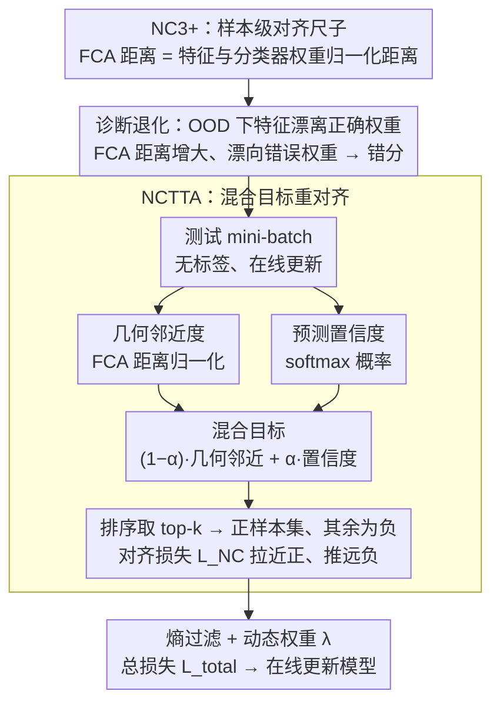

# Neural Collapse in Test-Time Adaptation

**会议**: CVPR 2026  
**arXiv**: [2512.10421](https://arxiv.org/abs/2512.10421)  
**代码**: [https://github.com/Cevaaa/NCTTA](https://github.com/Cevaaa/NCTTA)  
**领域**:其他
**关键词**: 神经坍缩, 测试时自适应, 分布外鲁棒性, 特征-分类器对齐, 混合目标

## 一句话总结
将神经坍缩 (Neural Collapse) 理论从类级别扩展到样本级别，发现了NC3+现象（样本特征嵌入与对应分类器权重对齐），基于此揭示了分布偏移下性能退化的根本原因是样本级特征-分类器错位，并提出NCTTA方法通过几何邻近度与预测置信度的混合目标引导特征重新对齐，在ImageNet-C上比Tent提升14.52%。

## 研究背景与动机

1. **领域现状**：测试时自适应 (TTA) 已成为应对分布偏移的实用方案，主要方法包括：基于原型的方法（SHOT、T3A）、一致性正则化方法（MEMO、CoTTA）、归一化层方法（NOTE、SAR）和熵最小化方法（Tent、EATA、DeYO）。

2. **现有痛点**：虽然这些方法通过算法优化在推理时取得了不错效果，但普遍缺乏对分布偏移下模型退化根本原因的理论理解，更多是"知其然不知其所以然"。

3. **核心矛盾**：Neural Collapse (NC) 理论揭示了训练后DNN的优雅几何结构（类均值↔分类器权重对齐），但其分析依赖类标签和全训练集来计算类均值——这在TTA场景中不可行（只有无标签的小batch测试数据）。

4. **本文目标**
    - 将NC理论扩展到样本级别，使其适用于TTA场景
    - 从NC视角解释分布偏移下的性能退化原因
    - 提出理论驱动的TTA方法

5. **切入角度**：既然NC3说"类均值与分类器权重对齐"，那么在TPT后期，类内方差趋近零（NC1），意味着每个样本的特征也该与对应分类器权重对齐——这就是NC3+。

6. **核心 idea**：性能退化 = 样本特征偏离了正确的分类器权重，因此TTA的核心任务是重新对齐，但伪标签不可靠，需用几何邻近度+预测置信度的混合目标替代。

## 方法详解

### 整体框架
这篇论文先用神经坍缩理论解释"分布偏移下模型为什么会退化"，再据此设计 TTA 方法。整条逻辑围绕一个量展开——样本特征与分类器权重之间的对齐程度。先把 NC 理论从依赖整批标注的类级别下放到单样本级别（NC3+），得到一把能在无标签测试 batch 上直接测量的"对齐尺子"；用这把尺子量 OOD 数据，发现错分的本质是特征漂离了正确的分类器权重；最后让模型在测试时主动把特征拉回去。具体到一个测试 mini-batch：先算每个样本特征到所有分类器权重的 FCA 距离，再把这个几何距离与预测置信度融成一个混合目标，按它挑出最可能正确的 top-k 类当正样本、其余当负样本，用对齐损失拉近正样本、推远负样本。

### 关键设计

**1. NC3+：把"对齐"从类级别下放到样本级别**

经典 NC3 说的是"类均值与分类器权重对齐"，但要算类均值得有标签、得遍历整个训练集，TTA 里只有无标签的小 batch，这条根本用不上。本文的突破口是：当训练后期类内方差趋近零（NC1）时，每个样本的特征几乎等于其类均值，于是"类均值对齐权重"可以收紧成"单个样本特征也对齐对应权重"——这就是 NC3+。落到可计算的量上，定义 FCA 距离 $d_{ij} = \|\frac{\mathbf{h}_i}{\|\mathbf{h}_i\|_2} - \frac{w_j}{\|w_j\|_2}\|_2$，即样本特征 $\mathbf{h}_i$ 与第 $j$ 类分类器权重 $w_j$ 归一化后的欧氏距离。论文进一步证明在交叉熵损失下，ground-truth 的 FCA 距离 $d_{iy_i}$ 随训练单调递减趋于零，并在 ImageNet-100 上用多种 backbone 验证了 G-FCA 距离全程下降。关键在于这个量只需要单样本特征和分类器权重，不碰类均值、不碰标签，于是天然适配 TTA 的约束。

**2. 用 FCA 距离把"退化"解释成"特征漂移"**

有了样本级的对齐尺子，就能定量回答"OOD 数据为什么被错分"。对受损数据按对错分组观察会发现一个清晰的此消彼长：分对的样本，其 ground-truth FCA 距离 $d_{iy_i}^{\text{correct}}$ 仍然较小，特征还守在正确权重附近；分错的样本，$d_{iy_i}^{\text{wrong}}$ 显著增大（特征已偏离正确权重），同时它到预测类权重的 P-FCA 距离 $d_{i\hat{y}_i}^{\text{wrong}}$ 反而变小（特征漂到了错误权重旁边）。corruption 越严重，这两类距离的 gap 拉得越开。这把退化的根因从模糊的"算法不够好"钉到了具体的"样本级特征-分类器错位"，也就直接指明了 TTA 该做的事——把漂走的特征重新拉回对齐。

**3. NCTTA：用混合目标替不可靠的伪标签指方向**

既然要拉回对齐，最直接的想法是用伪标签 $\hat{y}_i$ 指定对齐目标，但特征本已漂移、伪标签恰恰在严重偏移下最不可靠，照着错的目标拉只会越拉越偏。NCTTA 的做法是不全信伪标签，而是把几何信息掺进来构造混合目标 $\widetilde{\mathbf{y}}_i = (1-\alpha)\hat{d}_i + \alpha p_i$，其中 $\hat{d}_i$ 是 FCA 距离经 softmax 归一化得到的几何邻近度，$p_i$ 是预测概率代表的置信度，$\alpha$ 调两者比重。按 $\widetilde{\mathbf{y}}_i$ 排序取 top-k 类组成正样本集 $\mathcal{T}_i$、其余为负样本，再用 NC 引导的对齐损失 $\mathcal{L}_{\text{NC}}$ 拉近正样本、推远负样本；同时给每个样本配一个动态权重 $\lambda_i$，综合熵指标和 P-FCA 距离决定它在总损失里的话语权。这样设计是因为两个极端都不稳：纯伪标签（$\alpha=1,k=1$）在重度偏移下错误率高，纯几何邻近度又会被异常特征带偏，混合后两者互补；而用 top-k 而非 top-1，等于在"哪个类才对"上留了容错空间，进一步抵抗伪标签噪声。

### 损失函数 / 训练策略
最终损失为 $\mathcal{L}_{\text{total}}(x_i) = \lambda_i \cdot \mathbb{I}_{x_i \in S_{\text{ENT}}} \cdot (\mathcal{L}_{\text{ENT}}(x_i) + \mathcal{L}_{\text{NC}}(x_i))$：$S_{\text{ENT}}$ 是熵过滤后保留的样本集（剔掉高熵的不可信预测），$\mathcal{L}_{\text{ENT}}$ 是标准熵最小化损失，对齐项 $\mathcal{L}_{\text{NC}}$ 可实例化为 InfoNCE、L2 或 Triplet 三种形式（实验中 InfoNCE 最优）。

## 实验关键数据

### 主实验

| 方法 | CIFAR-10-C Avg (ResNet50) | ImageNet-C Avg (ViT-B/16) |
|------|--------------------------|--------------------------|
| no_adapt | 57.39 | 38.88 |
| Tent | 75.19 | 51.87 |
| EATA | 74.04 | 63.91 |
| SAR | 74.67 | 53.97 |
| NOTE | 71.03 | 39.15 |
| MEMO | 68.85 | 45.38 |
| DeYO | 76.65 | 63.49 |
| **NCTTA** | **78.16** | **66.46** |

NCTTA在ImageNet-C上比Tent提升14.59%，比DeYO提升2.97%。

### 消融实验

| $\mathcal{L}_{\text{NC}}$ 形式 | ImageNet-C Contrast (Sev-5) |
|------|------|
| InfoNCE-style | **最优** |
| L2-style | 略低 |
| Triplet-style | 最低 |

| $\alpha$ | $k=1$ | $k=3$ | $k=5$ | 说明 |
|------|-------|-------|-------|------|
| 0.0 (纯几何) | 较低 | 中等 | 中等 | 纯FCA距离不够 |
| 0.5 (混合) | 中等 | **最优** | 中等 | 平衡几何和置信度 |
| 1.0 (纯置信度) | 最低 | 低 | 低 | 纯伪标签不可靠 |

### 关键发现
- NCTTA在几乎所有corruption类型上都是最好或次好的，展示了很强的泛化性。
- InfoNCE-style损失最有效，可能因为其对比学习的梯度更有信息量。
- $\alpha=0.5, k=3$ 是最佳配置，说明几何和置信度的平衡以及适度的top-k范围最重要。
- 在Waterbirds数据集上最差组准确率从70.87%(no_adapt)/75.65%(DeYO)提升至76.56%，说明对子群偏移也有效。
- PACS跨域实验中也取得了最好的平均结果。

## 亮点与洞察
- **NC理论与TTA的桥接非常自然**：NC3+是NC3在满足NC1（类内方差→0）情况下的自然推论，但之前无人明确指出并加以利用。这个样本级视角完美适配了TTA只有无标签小batch的场景限制。
- **混合目标设计精巧**：用几何邻近度"校正"不可靠的伪标签是很好的思路。在严重偏移下伪标签错误率高，但几何上的近邻关系仍保持一定可靠性，两者互补。
- **理论→方法→实验的完整链条**：从NC3+理论发现→性能退化解释→方法设计→实验验证，逻辑链非常清晰完整，是理论驱动方法设计的好范例。

## 局限与展望
- NC3+的理论证明假设交叉熵损失和标准的TPT条件，对其他损失函数（如对比学习预训练的模型）的适用性未讨论。
- 目前NCTTA需要遍历所有K个类的分类器权重计算FCA距离，对类别数很大的任务（如ImageNet-21K）可能有计算开销。
- 连续域适应（continual TTA）场景下模型参数不断更新，分类器权重也在变化，NC3+的假设是否仍成立需要进一步分析。
- 未考虑标签空间偏移（open-set TTA）的情况。

## 相关工作与启发
- **vs Tent**：Tent仅做熵最小化，没有利用特征-分类器的几何结构。NCTTA在ImageNet-C上超越Tent 14.59%，说明几何引导的对齐比纯熵最小化更有效。
- **vs DeYO**：DeYO通过更精细的样本筛选提升性能，但仍缺乏对齐机制。NCTTA进一步提升2.97%。
- **vs EATA**：EATA也做熵过滤，但缺少NC引导的对齐。在CIFAR-10-C上NCTTA超越EATA 4.12%。

## 评分
- 新颖性: ⭐⭐⭐⭐⭐ NC3+是新发现，理论到方法的桥接非常优雅
- 实验充分度: ⭐⭐⭐⭐⭐ 多数据集多backbone验证，消融详尽
- 写作质量: ⭐⭐⭐⭐⭐ 理论推导严谨，可视化直观
- 价值: ⭐⭐⭐⭐ 为TTA领域提供了新的理论视角和实用方法

<!-- RELATED:START -->

## 相关论文

- [\[CVPR 2026\] Back to Source: Open-Set Continual Test-Time Adaptation via Domain Compensation](back_to_source_open-set_continual_test-time_adaptation_via_domain_compensation.md)
- [\[CVPR 2026\] Curvature-Aware Zeroth-Order Optimization for Memory-Efficient Test-Time Adaptation](curvature-aware_zeroth-order_optimization_for_memory-efficient_test-time_adaptat.md)
- [\[CVPR 2026\] WiTTA-Bench: Benchmarking Test-Time Adaptation for WiFi Sensing](witta-bench_benchmarking_test-time_adaptation_for_wifi_sensing.md)
- [\[CVPR 2026\] Towards Stable Federated Continual Test-Time Adaptation in Wild World](towards_stable_federated_continual_test-time_adaptation_in_wild_world.md)
- [\[NeurIPS 2025\] Test-Time Adaptation by Causal Trimming](../../NeurIPS2025/others/test-time_adaptation_by_causal_trimming.md)

<!-- RELATED:END -->
