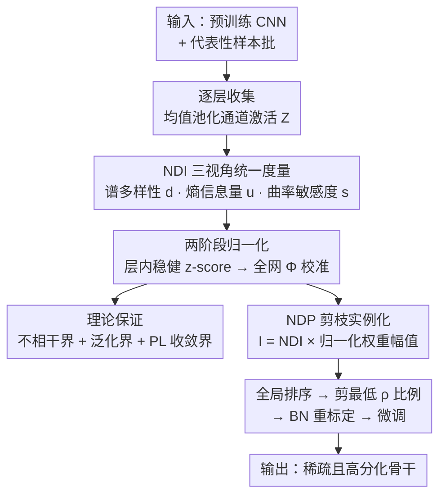

# Neural Differentiation in Deep Networks: A Theoretical Framework for Expressivity and Representational Diversity

**会议**: CVPR 2026  
**论文**: [CVF Open Access](https://openaccess.thecvf.com/content/CVPR2026/html/Wang_Neural_Differentiation_in_Deep_Networks_A_Theoretical_Framework_for_Expressivity_CVPR_2026_paper.html)  
**领域**: 模型压缩 / 网络剪枝 / 表达力理论  
**关键词**: 神经分化、通道重要性、结构化剪枝、表达多样性、可证明误差界

## 一句话总结
本文提出"神经分化"的数学框架，用一个统一的**神经分化指数 NDI**（融合谱多样性、熵信息量、二阶曲率敏感度）来量化每个神经元/通道的功能独特性，并据此给出剪枝的可证明误差界；其落地算法 NDP 在 MNIST/CIFAR-10/Tiny-ImageNet/ImageNet 上以更高稀疏率取得与 SOTA 相当甚至更优的精度。

## 研究背景与动机

**领域现状**：随着模型容量和数据规模膨胀，剪枝（pruning）成为压缩网络、降低推理成本、适配受限硬件的主流手段。在 CNN 上，结构化剪枝（去掉整条通道/滤波器）因为能直接转化成显存和算力节省、对硬件友好，被研究得最多。

**现有痛点**：但主流剪枝准则仍停留在"简单规则"上——按权重幅值（magnitude）排序，或按局部敏感度排序。这类准则只看单个参数的大小，**捕捉不到现代卷积网络里更丰富的冗余形态与通道间交互**：两个权重幅值都很大的通道，功能上可能高度重复（互为冗余），单看幅值无法发现。

**核心矛盾**：神经元的"重要性"并不等于"参数大小"。表征几何、特征秩、激活多样性、在损失景观中的曲率敏感度，都会影响一个神经元对网络表达力的真实贡献。把这些维度压缩成单一的幅值标量，必然丢信息，导致剪枝要么剪错（删掉了独特通道）、要么剪不动（保留了一堆冗余通道）。

**本文目标**：定义一个能同时刻画"功能独特 + 信息丰富 + 对损失敏感"的统一通道重要性度量，并把它的剪枝行为用理论界约束住——剪掉低重要性通道后误差最多涨多少、优化稳定性如何，要能证明。

**切入角度**：作者从生物学的"神经分化"（progenitor 细胞逐渐获得各自不同的神经元身份/功能）借来直觉——一个好的网络里，**每个神经元都应该承担一个与众不同的表征角色，避免冗余、最大化集体表达力**。但他们强调这只是命名灵感，框架本身完全是数学的、与架构无关的。

**核心 idea**：用一个**乘性耦合**的 NDI（Neural Differentiation Index）量化神经元偏离同伴的程度，从几何（谱多样性）、信息（熵）、曲率（Hessian 敏感度）三个互补视角统一打分；再用它驱动剪枝（NDP），并配上可证明的损失扰动界。

## 方法详解

### 整体框架
方法分两层。**第一层是理论框架**：对网络每一层收集激活，构造一个能横向跨层比较的通道重要性指数 NDI——它把"通道间响应是否正交（谱多样性 $d$）、激活分布是否信息丰富（熵 $u$）、通道对损失曲率是否敏感（二阶敏感度 $s$）"三件事乘在一起，并通过两阶段归一化把不同层的分数拉到同一可比尺度，最后给出三条定理保证高 NDI 通道确实"互不相关、剪掉它们误差/收敛可控"。**第二层是落地剪枝 NDP**：把 NDI 再乘上归一化的权重幅值得到全局重要性 $I$，按 $I$ 全局排序、按目标稀疏率剪掉最低的一批通道，重标定 BN 统计后微调恢复精度。

整条管线是清晰的多阶段流程，画成框架图便于图文对照：

### 关键设计

**1. NDI 三视角统一度量：把"功能独特性"拆成几何/信息/曲率三个可计算分量再乘起来**

这是全文的核心。针对"单看权重幅值抓不住通道间冗余"的痛点，作者把一个通道 $c$ 的重要性拆成三个互补分量，每个分量回答一个不同的问题。

*谱多样性 $d$（几何视角，回答"这个通道是否与别人正交"）*：对中心化激活 $\tilde Z^{(\ell)}$ 求样本协方差 $\Sigma^{(\ell)}=\frac{1}{N-1}\tilde Z^{(\ell)\top}\tilde Z^{(\ell)}$，再标准化成相关矩阵 $R^{(\ell)}$ 并特征分解 $R^{(\ell)}=V\Lambda V^\top$。定义通道在各特征模上的载荷 $a^{(\ell)}_{c,k}=\big(v^{(\ell)}_k[c]\big)^2$（满足 $\sum_k a^{(\ell)}_{c,k}=1$），则冗余度

$$\phi^{(\ell)}_c=\sum_{k=1}^{C_\ell} a^{(\ell)}_{c,k}\cdot\frac{\lambda^{(\ell)}_k}{\sum_j\lambda^{(\ell)}_j+\epsilon_{\text{stab}}}$$

衡量该通道的能量有多集中在主特征模（即与其他通道"共享方向"的程度）。层内归一化后取 $d^{(\ell)}_c=1-\tilde\phi^{(\ell)}_c$，**越不冗余、越独立的通道分数越高**。

*熵信息量 $u$（信息视角，回答"激活分布是否信息丰富"）*：用 $B$ 个自适应分位桶 + Laplace 平滑估计每个通道激活的 Shannon 熵 $\hat H_c$，再归一成 $u^{(\ell)}_c=\hat H_c/\ln B\in[0,1]$，高熵（响应模式丰富、不是常数或单峰）通道得分高。

*二阶敏感度 $s$（曲率视角，回答"这个通道对损失景观贡献多大曲率"）*：用 Hutchinson 估计器配 Pearlmutter trick 算损失 Hessian 的对角 $\widehat{\mathrm{diag}}(H)=\frac1m\sum_t v^{(t)}\odot(Hv^{(t)})$，按通道聚合得 $\hat s^{(\ell)}_c$ 再 min–max 归一。它捕捉"剪掉这个通道会不会在尖锐曲率方向上扰动损失"。

三者通过**乘性耦合**合成 NDI：

$$\mathrm{NDI}^{(\ell)}_c=\big(\bar d^{(\ell)}_c+\epsilon_f\big)^p\cdot\big(\bar u^{(\ell)}_c+\epsilon_f\big)^q\cdot\big(\bar s^{(\ell)}_c+\epsilon_f\big)^r$$

之所以用乘法而非加权和，是因为乘法只奖励"三项同时高"的通道——一个既独立、又信息丰富、又对损失敏感的通道才算真正重要；任一项塌到 0 就整体被压低（小常数 $\epsilon_f$ 防止某项为 0 时直接归零）。指数 $p,q,r$ 调三项相对影响。

**2. 两阶段归一化：让 NDI 能跨层全局排序，而不是只在层内有效**

剪枝要全局比较"网络里所有通道谁最该删"，但不同层的激活尺度天差地别，直接比 NDI 会被层尺度主导。作者设计两阶段归一化解决这个对不齐的问题。第一阶段是**层内稳健标准化**：对每个原始分量用中位数和 MAD（中位数绝对偏差）算稳健 z-score $r^{(\ell)}_{x,c}=\frac{x^{(\ell)}_c-\mathrm{med}_\ell(x)}{1.4826\cdot\mathrm{MAD}_\ell(x)+\epsilon_{\text{norm}}}$，用 MAD 而非标准差是为了抗激活里的离群值。第二阶段是**全网校准**：把所有层的稳健分数汇到一起算全局均值方差，得 $g^{(\ell)}_{x,c}=\frac{r^{(\ell)}_{x,c}-\mu_{R_x}}{\sigma_{R_x}+\epsilon_{\text{norm}}}$，再用标准正态 CDF $\Phi(\cdot)$ 压到 $(0,1)$ 得最终可比分量 $\bar d,\bar u,\bar s$。经此处理三个分量在全网范围分布对齐，NDI 才能直接拿来做全局排序。

**3. 理论保证：把"高 NDI 通道独特 + 剪低分通道安全"证成定理**

光有度量不够，作者给出三条定理把直觉变成可证明的保证。**Lemma 3.5（谱多样性 ⇒ 不相干）**：定义通道 $c$ 在 top-$k$ 特征子空间的投影质量 $\mu_c=\|P_k e_c\|_2^2=\sum_{i=1}^k a_{c,i}$，在谱隙 $\gamma=\lambda_k-\lambda_{k+1}>0$ 和样本误差 $\|\hat R-R\|_2\le\delta$ 的条件下，任意两个通道的样本相关满足 $|\hat R_{c,j}|\le\sqrt{\mu_c\mu_j}+\frac{2\delta}{\gamma}$——也就是说投影质量小（高多样性）的通道之间可证明地近乎正交，坐实了"高 $d$ 通道确实彼此独立"。**Theorem 3.6（泛化界）**：在输出 $L_{\text{out}}$-Lipschitz、映射 $L_\Theta$-Lipschitz 假设下，剪枝前后参数差 $\Delta=\|\Theta-\Theta'\|_2$ 直接控制期望损失：$\mathbb E[L(f_{\Theta'})]\le\frac1N\sum_i L(f_\Theta(x_i),y_i)+L_{\text{out}}L_\Theta\Delta+O(\sqrt{\log(1/\delta)/N})$，而把通道置零的剪枝恰好让 $\Delta=\big(\sum_{(c,\ell)\in P}\|W^{(\ell)}_c\|_F^2\big)^{1/2}$——给出剪枝的"安全边际"。**Theorem 3.7（PL 收敛稳定性）**：在 L-smooth + PL 条件下，从剪枝点 $\Theta'$ 重启梯度下降，$f(\Theta'_t)-f^\star\le(1-\eta\mu)^t(f(\Theta)-f^\star)+(1-\eta\mu)^t\frac{L}{2}\Delta^2$，扰动只引入一个被 $\Delta^2$ 控制的可加项，说明微调能稳定收敛。三条定理共同把"剪低 NDI 通道"从经验做法升级为有界、可证明安全的操作。

**4. NDP 剪枝实例化：NDI × 权重幅值的全局排序剪枝**

把框架落地为算法时，作者再补一个结构显著性视角：单纯按 NDI 还不够，于是乘上归一化权重幅值 $\bar w^{(\ell)}_c=\frac{\|W^{(\ell)}_c\|_F}{\frac{1}{C_\ell}\sum_{c'}\|W^{(\ell)}_{c'}\|_F+\epsilon_w}$，得到全局可比的重要性 $I^{(\ell)}_c=\mathrm{NDI}^{(\ell)}_c\cdot\bar w^{(\ell)}_c$，兼顾"功能分化"与"结构显著"。给定目标稀疏率 $\rho$，把全网通道按 $I$ 降序排，剪掉最低的 $\rho\cdot\sum_\ell C_\ell$ 个通道；对带残差/分支的结构则沿相连路径联合剪枝以保持张量兼容，剪后重标定 BN 统计恢复激活稳定性，最后微调找回精度。NDI 在卷积层用均值池化通道激活、在全连接层直接用激活向量，框架无缝泛化。

### 损失函数 / 训练策略
NDP 主体是"训练后剪枝 + 微调"流程，剪枝准则 NDI 本身无需额外训练。值得注意的是消融实验里作者额外用了一个**基于 NDI 的正则项**在训练时鼓励神经元分化（见实验 4.1），证明分化思想既能当剪枝准则也能当训练正则。

## 实验关键数据

### 主实验
覆盖从 MLP 到大规模 CNN 的多个架构/数据集，NDP 在各稀疏率下普遍领先，且在**极端稀疏区优势被放大**。

| 数据集 / 架构 | 稀疏率 | NDP | 最优对手 | 说明 |
|--------------|--------|-----|----------|------|
| MNIST / MLP-Net | 95% | **96.68%** | 94.70% (MSP) | 对手 SpaM 跌到 89.43% |
| MNIST / MLP-Net | 98% | **94.59%** | <91% (多数<60%) | 极端稀疏几乎不崩 |
| CIFAR-10 / ResNet-18 | 98% | **90.03%** | 89.01% (EarlySNAP) | 全程领先 2–3% |
| CIFAR-10 / VGG-16 | 95% | **93.03%** | ~91.4% | 高稀疏更稳 |
| Tiny-ImageNet / ResNet-18 | 68.38% | **72.10%** | ~58.4% (NPB) | 高出近 14 个点 |
| ImageNet / MobileNet-V2 | 90% | **56.39%** | 42.46% (UniPTS) | 大规模仍稳健 |

Tiny-ImageNet 上 NDP 还同时降 FLOPs：90% 稀疏时仅 $2.32\times10^8$ FLOPs（不到 PHEW/SynFlow 一半）却拿 66.32% 精度（对手 55.93% / 54.68%）。

### 消融实验
| 配置 | 现象 | 说明 |
|------|------|------|
| 带 NDI 正则训练 | t-SNE 簇紧致、类间分离好 | 倒数第二层表征更判别 |
| 不带 NDI 正则（ablation） | t-SNE 簇重叠弥散 | 表征纠缠、类间可分性差 |
| 动态 NDI 跨层分析（VGG-16/CIFAR-10） | 浅层 NDI 几千步内快速饱和、深层最慢最弱 | 揭示分层表征的涌现节律 |

### 关键发现
- **极端稀疏下的鲁棒性是最大卖点**：稀疏率越高，NDP 与对手差距越大（MNIST 98%、Tiny-ImageNet 99% 别人崩到 40% 以下时 NDP 仍保 53.63%），说明"按功能分化而非幅值选通道"在激进压缩时更不容易误删关键通道。
- **乘性耦合 + 全网归一化是 NDI 能全局排序的关键**：三视角同时高才算重要，避免单一指标偏置；两阶段归一化让跨层比较成立。
- **动态 NDI 给出机制洞察**：浅层特征检测器快速变得类敏感、深层分化最慢，复现了"早期特征先稳定、再支撑后期专化"的层级规律，这是一个独立于剪枝的可分析量。

## 亮点与洞察
- **把"通道重要性"从标量幅值升级成几何/信息/曲率三视角的乘积**：思路干净且可解释，每个分量都有明确的统计含义，乘性耦合天然实现"木桶效应"——一项弱就整体弱，正好对应"真正重要的通道要三项全强"。
- **理论与实践罕见地咬合**：Lemma 把"高多样性 ⇒ 近正交"证出来，两条定理把剪枝误差和收敛用 $\Delta$ 显式约束，给结构化剪枝提供了少见的可证明安全边际，而不是纯经验启发式。
- **动态 NDI 是可复用的分析工具**：把 NDI 当成训练过程中逐神经元的"类敏感度轨迹"来画，能定量刻画分层表征涌现，这个用法可以迁移到表征学习/可塑性研究，不止服务剪枝。
- **NDI 既能当剪枝准则又能当训练正则**：消融里用它做正则就改善了 t-SNE 簇的分离度，说明"鼓励神经元去相关"本身就是有益的训练信号。

## 局限与展望
- **作者承认仅限 CNN**：剪枝实例化和实验都只在卷积网络上，Transformer、脉冲网络有根本不同的冗余模式，需要重新定义分化与剪枝算子，论文没做。
- **计算开销未充分讨论**：NDI 要算协方差特征分解（用随机化 SVD 近似）和 Hessian 对角（Hutchinson + Pearlmutter），相比纯幅值剪枝代价明显更高，论文没给出准则计算的时间/显存成本对比。
- **超参较多且未做敏感性分析**：$p,q,r$ 指数、$\epsilon_f/\epsilon_{\text{stab}}/\epsilon_{\text{norm}}$、熵的桶数 $B$、Hutchinson 探针数 $m$ 都是可调项，正文没有系统的敏感性研究，复现时调参负担可能不小。
- **理论假设较强**：Theorem 3.7 依赖 PL 条件、Theorem 3.6 依赖全局 Lipschitz，这些在真实深网上未必成立，定理更多是定性指引而非紧界。
- **生物学命名易引误解**：作者反复声明"神经分化"只是命名灵感、框架是纯数学的，但标题/叙述里的生物隐喻仍可能让读者高估其与神经科学的实质联系。

## 相关工作与启发
- **vs 幅值/局部敏感度剪枝（MP、WF 等）**：它们按单参数大小或局部一阶敏感度排序，捕捉不到通道间冗余；NDP 用谱多样性显式刻画"通道是否与同伴正交"，在高稀疏区因此更不易误删独特通道。
- **vs 早期剪枝 / 初始化时剪枝（CroPit、EarlyCroP、SNAP、SNIP、SynFlow、PHEW）**：这些方法多在训练早期或基于初始化的连通性/梯度流剪枝；NDP 走训练后激活统计 + 可证明界路线，在 ResNet-18/VGG-16/Tiny-ImageNet 上以更高精度和更低 FLOPs 占优。
- **vs 激活/归因感知剪枝（NBP 等用激活统计选通道）**：本文同属"基于功能统计而非纯参数"一脉，但把多样性、信息量、曲率敏感度三者统一进一个带理论保证的指数，并加全网归一化使其可全局排序，是相对它们的系统化推进。
- **vs Min et al. 早期神经元对齐 / Niu et al. task-specific "neural differentiation"**：前者分析两层 ReLU 网络的神经元对齐动力学，后者在纠正捷径学习时局部用过"neural differentiation"一词但未形式化；本文声称是首次把"神经分化"在 ML 里显式定义为统一框架。

## 评分
- 新颖性: ⭐⭐⭐⭐ 把通道重要性统一成几何/信息/曲率三视角乘积并配可证明界，视角清晰、形式化扎实，但底层组件（谱、熵、Hessian 敏感度）多为已有工具的有机组合。
- 实验充分度: ⭐⭐⭐⭐ 覆盖 MLP→ResNet/VGG→MobileNet、MNIST→ImageNet 多稀疏率，且有 t-SNE 与动态 NDI 分析；但缺准则计算开销对比和超参敏感性研究。
- 写作质量: ⭐⭐⭐⭐ 定义/定理/算法层次分明，公式与动机咬合好；生物隐喻虽反复澄清仍稍有干扰，附录化的伪代码使主文流程稍欠完整。
- 价值: ⭐⭐⭐⭐ 给结构化剪枝提供了少见的"可证明安全边际 + 可解释多视角准则"，动态 NDI 还是可复用的表征分析工具，对压缩与表征研究都有借鉴。

<!-- RELATED:START -->

## 相关论文

- [\[CVPR 2026\] Event Structural Valley: A Unified Theoretical and Practical Framework for Event Camera Autofocus](event_structural_valley_a_unified_theoretical_and_practical_framework_for_event_.md)
- [\[CVPR 2026\] Convolutional Neural Networks Driven by Content Similarity](convolutional_neural_networks_driven_by_content_similarity.md)
- [\[ICLR 2026\] Training Deep Normalization-Free Spiking Neural Networks with Lateral Inhibition](../../ICLR2026/others/training_deep_normalization-free_spiking_neural_networks_with_lateral_inhibition.md)
- [\[CVPR 2026\] Robust Spiking Neural Networks by Temporal Mutual Information](robust_spiking_neural_networks_by_temporal_mutual_information.md)
- [\[CVPR 2026\] On the Role of Temporal Granularity in the Robustness of Spiking Neural Networks](on_the_role_of_temporal_granularity_in_the_robustness_of_spiking_neural_networks.md)

<!-- RELATED:END -->
