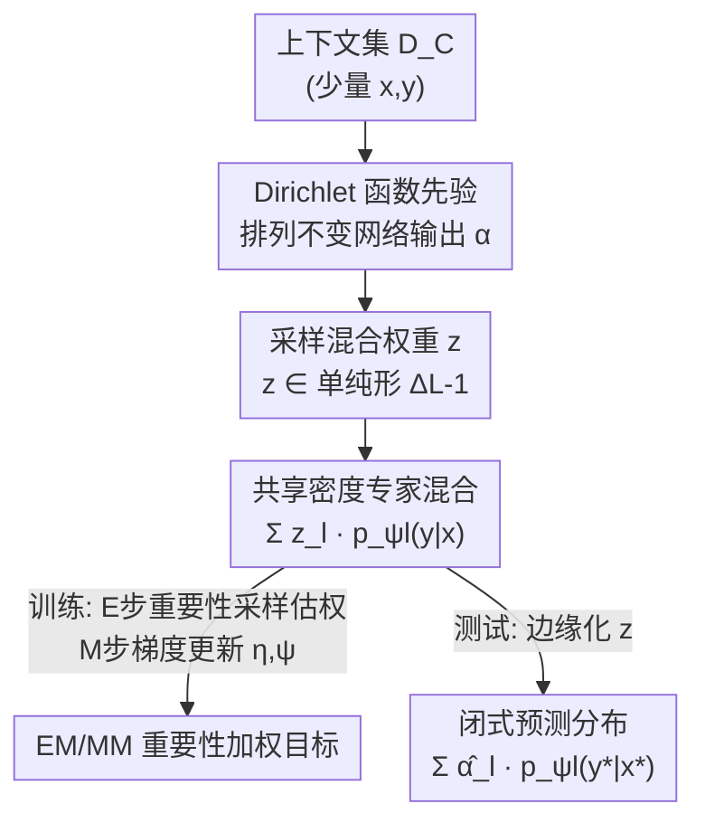

# Neural Mixture Density Processes

**会议**: CVPR 2026  
**论文**: [CVF Open Access](https://openaccess.thecvf.com/content/CVPR2026/html/Ding_Neural_Mixture_Density_Processes_CVPR_2026_paper.html)  
**领域**: 概率元学习 / 神经过程  
**关键词**: 神经过程, 混合密度, Dirichlet先验, 重要性采样, EM/MM优化

## 一句话总结
针对经典神经过程（NP）因假设高斯似然而只能输出单峰预测分布的局限，本文提出神经混合密度过程（NMDP）：用单纯形上的 Dirichlet 隐变量去线性加权一组任务共享的密度专家，再用重要性加权的 EM/MM 式代理目标来训练，从而在异质、多峰的函数族上取得有竞争力的预测精度、更好的不确定性校准和可解释的任务表示。

## 研究背景与动机
**领域现状**：概率元学习近年成为一条有吸引力的范式，它从过去经验中学会快速适应新任务，同时给出预测的不确定性。其中神经过程（Neural Process, NP）家族是代表性路线——它把上下文数据集 $D_\tau^C$ 编码成一个全局隐变量 $z$，用 $z$ 来近似"函数先验"，作为高斯过程（GP）的可扩展替代品，计算开销远低于 GP。

**现有痛点**：现有 NP 变体（CNP、ANP 等）几乎都假设**高斯似然**，于是预测分布被锁死成**单峰**。可现实任务里函数行为常常是天然多峰的——同一个上下文集合下，输出可能有好几种合理形态。单峰假设在这种情况下既抓不住真实的不确定性结构，也表达不出多样的可能输出。

**核心矛盾**：NP 表达力的瓶颈不在网络容量，而在**隐变量结构和条件机制的设计**——文献里恰恰对这块研究不足。大多数后续工作（ANP 的注意力、ConvCNP 的平移等变、DNP 的 bi-Lipschitz 约束）都是往 NP 里塞**结构归纳偏置**，但没有从"能不能逼近更复杂的随机过程"这个角度去改造 NP 模块本身。

**本文目标**：(1) 设计一个能逼近任意复杂函数分布的 NP 变体；(2) 给它配一套可处理（tractable）、收敛稳定的优化策略；(3) 让学到的任务表示具备可解释性（能反映任务的聚类结构）。

**切入角度**：作者从经典的**混合密度网络（MDN）**和 **Dirichlet 过程混合**得到启发——既然单个高斯不够，那就用一组密度专家的**混合**来逼近任意分布，而混合权重本身用一个定义在单纯形 $\Delta^{L-1}$ 上的隐变量来表示。这样"函数分布的多峰性"就被自然地编码进"专家的混合权重"里。

**核心 idea**：用"Dirichlet 单纯形隐变量 × 一组共享密度专家"的显式混合分布，替代 NP 里"单个全局高斯隐变量"，并把模型参数拆成**任务无关的共享专家**和**任务相关的 Dirichlet 先验**两部分，再用重要性加权的 EM/MM 目标训练。

## 方法详解

### 整体框架
NMDP 把一次元学习的生成过程拆成两个神经模块协同：一个**先验推断网络**把上下文 $D_\tau^C$ 编码成 Dirichlet 函数先验 $p(z|D_\tau^C;\eta)=\mathrm{Dir}_\eta(z;\alpha)$（输出单纯形上的混合权重 $z$），一个**生成网络**持有 $L$ 个任务共享的密度专家 $\{p_{\psi_l}(\cdot|\cdot)\}_{l=1}^L$，用 $z$ 把这些专家线性加权成一个混合预测分布。元训练的目标，就是发现一组能最好解释所有任务、并揭示任务间聚类结构的共享专家 $\psi$，以及一个能从少量上下文准确推断混合权重的先验网络 $\eta$。

整条管线是：上下文点 → 先验推断网络得到 Dirichlet 先验 → 采样/推断混合权重 $z$ → 用 $z$ 加权 $L$ 个密度专家 → 混合预测分布；训练时通过 E 步（重要性采样估权）和 M 步（梯度更新 $\eta,\psi$）交替迭代；测试时上下文喂进先验网络，预测分布有闭式解。

### 关键设计

**1. 单纯形隐变量 × 共享密度专家：把多峰性编码进混合权重**

经典 NP 的生成式（式 1）是 $\rho(y_{1:n})=\int p(z)\prod_i \mathcal{N}(y_i;\mu_\theta([x_i,z]),\Sigma_\theta([x_i,z]))\,dz$——隐变量 $z$ 进了高斯的参数，但似然仍是单个高斯，所以预测分布单峰。NMDP 改成式 3：

$$\rho_{x_{1:n}}(y_{1:n}\mid\psi)=\int \mathsf{Dir}(z;\alpha)\prod_{i=1}^{n}\Big[\sum_{l=1}^{L} z_l\, p_{\psi_l}(y_i|x_i)\Big]\,dz$$

关键变化有两处：其一，隐变量 $z$ 不再进单个分布的参数，而是约束在 $L-1$ 维单纯形 $\Delta^{L-1}$ 上、作为**混合权重**去线性调制 $L$ 个密度专家 $p_{\psi_l}$；其二，专家集合 $\{\psi_l\}$ 是**所有任务共享**的，只有权重 $z$ 随任务变。以高斯专家为例（Example 1），单点预测密度就是 $p(y|x,z)=\sum_l z_l\,\mathcal{N}(y;\mu_{\psi_l}(x),\Sigma_{\psi_l}(x))$，是一个货真价实的高斯混合，天然能表达多峰。作者还从 Dirichlet 过程混合的视角论证（Remark 1）：当专家数 $L$ 足够大时，NMDP 在理论上可以逼近任意函数分布——它本质上是 Dirichlet-过程混合的**有限混合类比**。

**2. 任务无关 / 任务相关的参数解耦：让测试时适应只需推一个紧凑隐变量**

NMDP 显式地把模型参数拆成两块：任务无关的密度专家 $\psi=\{\psi_1,\dots,\psi_L\}$（一次元训练学好，对所有任务固定），和任务相关的先验网络参数 $\eta$（每个新任务只需用它从上下文推出一个 Dirichlet 浓度向量 $\alpha$，也就是 $z$ 的分布）。这个解耦解决的是"测试时适应成本"的痛点——NMDP 在面对新任务时**不需要重新优化任何专家参数**，只要把上下文喂进先验网络、推断出一个低维、紧凑的单纯形隐变量 $z$ 即可。这和 MAML 这类需要在新任务上做梯度更新（内层优化）的方法形成对照：适应被压缩成一次前向推断。同时，由于任务表示就是单纯形上的概率向量，它本身具有可解释性——每一维对应一个专家被这个任务用到的程度。

**3. 重要性加权的 EM/MM 代理目标：绕开 ELBO 的近似间隙**

NMDP 的后验 $p(z|D_\tau^T,D_\tau^C)$（式 6）分母是非解析积分、不可处理，没法直接采样做蒙特卡洛。常规做法是再引入一个变分分布走 ELBO，但那会带来**后验近似间隙**。本文换了一条路：借鉴重加权 wake-sleep（RWS）算法，写出一个 EM/MM 式的代理目标（式 7）

$$\max_{\eta,\psi}\mathcal{L}=\mathbb{E}_{p(z|D_\tau^T,D_\tau^C;\Theta_t)}\Big[\ln \underbrace{p(D_\tau^T|z;\psi)}_{\text{混合似然}}+\ln \underbrace{p(z|D_\tau^C;\eta)}_{\text{Dirichlet 先验}}\Big]$$

它由"生成式混合似然项 + Dirichlet 先验项"组成，期望里的分布在优化括号内的项时被当作固定。由于真后验采不了样，作者用**自归一化重要性采样**：拿上一轮外迭代的先验 $p(z|D_\tau^C;\eta_t)$ 当提议分布抽 $B$ 个粒子 $z^{(b)}$，重要性权重正比于目标似然 $\omega_t^{(b)}=p(D_\tau^T|z^{(b)};\psi_t)$，再自归一化 $\hat\omega_t^{(b)}=\omega_t^{(b)}/\sum_{b'}\omega_t^{(b')}$（式 9）。最终得到可微的重要性加权目标 $\mathcal{L}_{\mathsf{IW\text{-}MC}}$（式 8）。和原版 RWS 的区别有两点：NMDP 学的是**排列不变、上下文条件**的 Dirichlet 先验（RWS 里先验通常固定），且**复用当前先验当提议分布**，从而省掉了一个额外的 sleep 阶段推断网络。Remark 2 给出理论保证：在理想的精确推断与精确最大化下，该 EM/MM 过程恢复标准的**单调改进**性质。

### 损失函数 / 训练策略
训练按 Algorithm 1 的外/内两层迭代展开。每个外迭代 $t$ 对一批任务 $\mathcal{T}$：**E 步**对每个任务 $\tau$ 从当前先验 $p(z|D_\tau^C;\eta_t)$ 采 $B$ 个粒子、按式 9 算自归一化重要性权重；**M 步**用这些权重加权累积梯度 $\nabla_\eta\mathcal{L}\mathrel{+}=\sum_b\hat\omega^{(b)}\nabla_\eta\ln p(z^{(b)}|D_\tau^C;\eta)$、$\nabla_\psi\mathcal{L}\mathrel{+}=\sum_b\hat\omega^{(b)}\nabla_\psi\ln p(D_\tau^T|z^{(b)};\psi)$，在任务批上平均后梯度上升更新 $\eta,\psi$。测试时把上下文 $D_\tau^C$ 喂进先验网络得到 $\mathrm{Dir}_\eta(z;\alpha)$，新点 $(x_*,y_*)$ 的预测分布对 $z$ 边缘化后有**闭式解**（式 10）：$p(y_*|x_*,D_\tau^C)=\sum_l \hat\alpha_l\,p_{\psi_l}(y_*|x_*)$，其中 $\hat\alpha_l=\alpha_l/\sum_{l'}\alpha_{l'}$ 是 Dirichlet 的均值参数。也就是说预测就是用先验的**期望混合权重**去加权各专家，无需采样。

## 实验关键数据

基线覆盖上下文式方法（CNP、ANP、ConvCNP、TNP、DNP）和梯度式方法（MAML、CAVIA），所有模型统一用高斯似然、相同归一化与实现设置以保证可比性。

### 主实验

**1D 合成 GP 回归**（在 RBF / 弱周期 / Matérn-5/2 三种核混合的异质数据上训练，1000 个测试任务的平均对数似然，越大越好）：

| 模型 | RBF | 弱周期 | Matérn-5/2 |
|------|------|--------|-----------|
| MAML | 0.08 | 0.89 | -0.12 |
| CAVIA | 0.21 | 0.96 | 0.07 |
| CNP | 0.15 | 1.08 | -0.14 |
| ANP | 0.42 | 1.11 | 0.18 |
| ConvCNP | 1.05 | 0.80 | 0.71 |
| TNP | 1.23 | 1.13 | 1.06 |
| DNP | 0.95 | 1.06 | 0.78 |
| **NMDP (Ours)** | **1.26** | **1.19** | **1.15** |

NMDP 在三种核上全部最优，且跨核类型的表现最稳定，说明它对异质函数族的泛化更好（回答 RQ-1：Dirichlet 函数先验 + 任务级混合密度建模确实更有表达力）。

**图像补全**（把图像看成 $f:[-1,1]^2\to[0,1]^c$ 的连续函数，预测目标点像素值的对数似然，10 次平均，越大越好）：

| 模型 | CIFAR10-target | SVHN-target | MNIST-target | EMNIST-target |
|------|------|------|------|------|
| CNP | 2.51 | 2.62 | 1.01 | 0.86 |
| ANP | 3.76 | 3.05 | 1.03 | 0.92 |
| ConvCNP | 3.88 | 3.08 | 1.17 | 1.12 |
| TNP | 4.03 | 3.23 | 1.38 | 1.13 |
| DNP | 3.81 | 3.10 | 1.09 | 0.95 |
| **NMDP (Ours)** | **4.19** | **3.29** | **1.42** | **1.17** |

在 3 通道 RGB（CIFAR-10、SVHN）上 NMDP 大幅领先：CIFAR-10 上 target 对数似然 4.19，比最强基线 TNP（4.03）提升约 3.9%；在结构更简单的单通道灰度（MNIST、EMNIST）上仍取得最优 target 似然，仅 context 似然略低于 TNP。这说明 NMDP 的额外建模容量在**多通道、强相关的复杂自然图像**上收益最明显。

**多输入输出回归**（SARCOS / WQ / SCM20D，MSE 越小越好）：NMDP 分别取得 0.82 / 0.67 / 0.75，在三个数据集上均最优（基线最好为 0.84 / 0.69 / 0.82）。

### 消融实验

五阶段递进消融（合成 GP 基准，每个变体在前一个基础上增加一个建模元素）：

| 变体 | 配置 | 说明 |
|------|------|------|
| A1 | 单专家 ($L=1$) | 最简基线，无混合 |
| A2 | 均匀混合 ($L>1$，$z$ 固定) | 引入解码器多样性但不自适应 |
| A3 | 确定性门控 | 上下文编码器生成可学习的确定性权重，自适应选专家 |
| A4 | 随机门控 + ELBO | 引入 Dirichlet 隐变量 $z$，用标准 ELBO 优化 |
| A5 | Full NMDP | 用重要性加权目标精化对 $z$ 的后验推断 |

### 关键发现
- **验证对数似然沿 A1→A5 单调上升**：混合容量（A2）带来小幅增益，自适应门控（A3）进一步提升表达力，而最大的跃升来自 A4、A5 这两个核心创新。
- **A4（随机门控）在稀疏上下文下尤其有用**：当上下文少、函数类型本身存在歧义时，用 Dirichlet 隐变量对"任务身份"做概率推理比确定性门控更稳。
- **A5（重要性加权目标）的价值不止于精度**：相比 A4 的 ELBO，它不仅渐近性能更高，**训练方差也显著降低**（置信区间更窄）、收敛更快——更紧的变分界绕开了 ELBO 的近似间隙，让函数先验的优化更忠实、元学习更稳定。
- **任务表示可解释**（RQ-2）：把推断出的 Dirichlet 浓度向量做 CLR 变换 + UMAP 投影，NMDP 把 RBF / 弱周期 / Matérn 三类任务分成清晰簇，NMI=0.42、ARI=0.44、Silhouette=0.26、线性探针准确率 84.4%（随机 ≈33%），说明核类型信息被可靠编码。

## 亮点与洞察
- **把"多峰性"从似然形式转移到混合权重上**：经典 NP 想表达多峰要去改似然分布本身，很笨重；NMDP 让似然继续用简单的高斯专家，但用单纯形隐变量去**混合**它们——多峰性变成了"权重往哪几个专家倾斜"，既保持了每个专家的可解析性，又拿到了任意逼近能力。这个"复杂性外包给混合权重"的思路可迁移到任何想增强表达力又不想放弃闭式预测的概率模型。
- **复用先验当提议分布，省掉一个推断网络**：RWS 一般要额外训一个 sleep 阶段网络，NMDP 直接拿上一轮的上下文条件先验当重要性采样的提议分布，工程上更省、也更自洽（先验既是模型组件又是采样器）。
- **任务表示天然落在单纯形上**：因为隐变量就是混合权重（概率向量），它本身就是一个可解释、可聚类的任务嵌入，不需要额外设计探针就能反映任务的功能多样性——这是把"可解释性"内建进模型结构而非事后解释的好例子。

## 局限与展望
- **作者承认的局限**：当测试任务远离元训练分布、或上下文信息不足时，推断出的 Dirichlet 先验会变成高熵（近似均匀），导致各专家被平均使用、预测不确定性上升；不过作者也指出 Dirichlet 熵可以反过来当一个简单的"歧义指示器"。
- **依赖有限专家假设**：NMDP 最有效的前提是"跨任务变化能被一组有限的共享专家很好地覆盖"——当任务多样性超出 $L$ 个专家能张成的范围时，逼近能力受限；专家数 $L$ 是个需要权衡的超参，论文未充分讨论如何自适应选 $L$。
- **重要性采样的额外开销**：多粒子带来额外计算，虽然作者说在现代 GPU 上大体可并行，但粒子数 $B$、重要性权重的方差对训练稳定性的影响、以及在高维任务上是否会出现权重退化（少数粒子主导）等问题，正文未给出敏感性分析。
- **可改进方向**：把有限混合扩成真正的非参（如 stick-breaking）以自适应专家数；或用 Dirichlet 熵做主动学习/上下文选择的信号，闭环地决定该再观测哪些点。

## 相关工作与启发
- **vs 经典 NP / CNP / ANP**：它们用单个全局高斯隐变量、单峰似然；NMDP 用单纯形隐变量 + 混合密度专家，能表达多峰，且把参数拆成共享专家与任务相关先验，适应只需推一个紧凑 $z$。
- **vs ConvCNP / TNP / DNP（结构归纳偏置路线）**：这些工作往 NP 里塞平移等变、注意力、bi-Lipschitz 约束等结构先验来提精度；NMDP 不改结构归纳偏置，而是从"逼近更复杂随机过程"的角度改造 NP 模块本身并配套可处理的推断——在异质多峰任务上反而更稳更好。
- **vs MAML / CAVIA（梯度式元学习）**：它们靠内层梯度更新适应新任务；NMDP 把适应压成一次前向的 Dirichlet 先验推断，无需在新任务上反传，测试更轻。
- **vs 混合专家（MoE）与 Dirichlet 过程混合**：NMDP 借用了 MoE 的"专家 + 门控"骨架和 DP 混合的"随机概率测度"视角，但把门控做成上下文条件的 Dirichlet 隐变量、并以 EM/MM 重要性加权目标训练，是 DP 混合在神经过程框架下的有限混合落地。

## 评分
- 新颖性: ⭐⭐⭐⭐ 把混合密度 + 单纯形 Dirichlet 隐变量 + RWS 式重要性加权目标系统地缝进神经过程，角度（改造模块而非加结构先验）清晰且自洽。
- 实验充分度: ⭐⭐⭐⭐ 覆盖 1D 回归、图像补全、多输出回归三类场景 + 五阶段递进消融 + 任务表示聚类分析，证据链完整；但缺粒子数 $B$ 和专家数 $L$ 的敏感性分析。
- 写作质量: ⭐⭐⭐⭐ 动机—方法—理论保证—实验的逻辑链顺畅，图 1/2 把架构和优化过程讲清；公式较密，对读者有一定门槛。
- 价值: ⭐⭐⭐⭐ 给"既要多峰表达力、又要闭式预测和快速适应"的概率元学习提供了一个干净的范式，可解释的单纯形任务表示和 Dirichlet 熵歧义指示器都有实用价值。

<!-- RELATED:START -->

## 相关论文

- [\[CVPR 2026\] Spectral Mixture-of-Experts for Continual Learning](spectral_mixture-of-experts_for_continual_learning.md)
- [\[NeurIPS 2025\] Addressing Mark Imbalance in Integration-free Neural Marked Temporal Point Processes](../../NeurIPS2025/others/addressing_mark_imbalance_in_integrationfree_neural_marked_t.md)
- [\[CVPR 2026\] Progressive Neural Architecture Generation](progressive_neural_architecture_generation.md)
- [\[ACL 2025\] Entropy-UID: A Method for Optimizing Information Density](../../ACL2025/others/entropy-uid_a_method_for_optimizing_information_density.md)
- [\[ICLR 2026\] A Representer Theorem for Hawkes Processes via Penalized Least Squares Minimization](../../ICLR2026/others/a_representer_theorem_for_hawkes_processes_via_penalized_least_squares_minimizat.md)

<!-- RELATED:END -->
