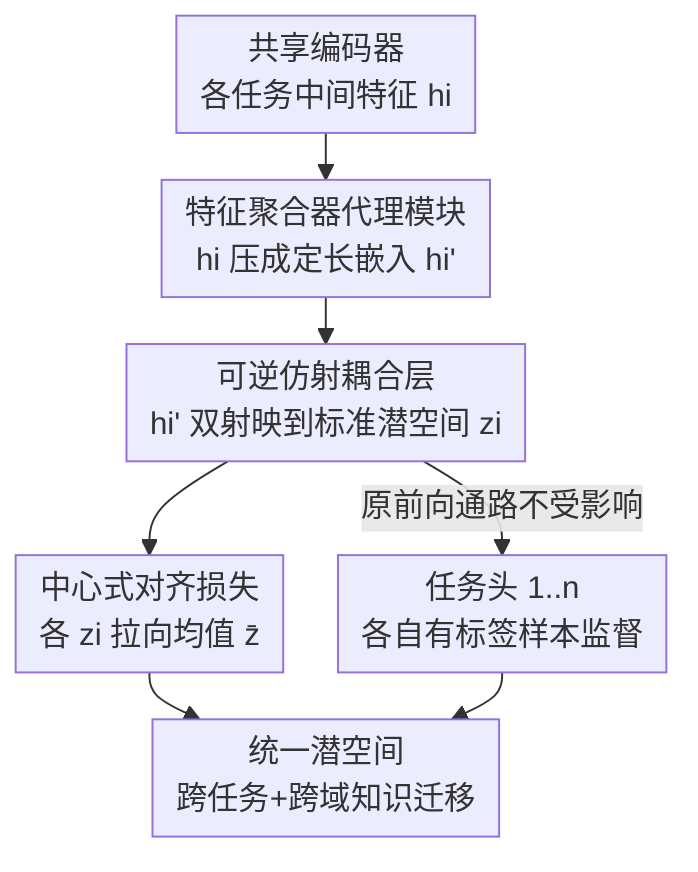

# NexusFlow: Unifying Disparate Tasks under Partial Supervision via Invertible Flow Networks

**会议**: CVPR 2026  
**论文**: [CVF Open Access](https://openaccess.thecvf.com/content/CVPR2026/html/Lin_NexusFlow_Unifying_Disparate_Tasks_under_Partial_Supervision_via_Invertible_Flow_CVPR_2026_paper.html)  
**代码**: https://github.com/ark1234/NexusFlow  
**领域**: 多任务学习 / 部分监督  
**关键词**: 部分监督多任务学习, 可逆流网络, 仿射耦合层, 潜空间对齐, 自动驾驶感知

## 一句话总结
NexusFlow 用一组带可逆仿射耦合层的"代理网络"把结构上完全不同的任务（如稀疏目标跟踪 vs. 稠密地图重建）的中间特征映射到同一个标准潜空间并对齐其分布，在标注被按地理域切开、各任务只在不同城市有标签的极端部分监督场景下，做到几乎逼近全监督的性能，且是即插即用、不改原模型结构。

## 研究背景与动机

**领域现状**：多任务学习（MTL）能共享表示、提升效率，但前提是每个样本对每个任务都有标注。现实中标注成本高得离谱，于是出现了部分监督多任务学习（PS-MTL）——每个样本只标了部分任务。已有的 PS-MTL 进展几乎都集中在"同质稠密预测任务"上（语义分割、深度、法向量），因为这些任务天然耦合、输出结构一致，可以用一致性正则、伪标签、对抗判别器等手段互相借力。

**现有痛点**：真实系统里的任务往往结构上根本不同。比如自动驾驶里，地图重建是稠密的栅格语义（每个空间格子一个类别），多目标跟踪是稀疏的实例集合（每个目标一个框 + ID，数量还逐帧变）。把这种异构任务硬塞进同质方法里对不上。更糟的是，已有工作模拟"缺标签"的方式太理想化——随机 mask 掉某些任务标注，这只是受控的简化设定。现实中不同任务的标注常常采集自互不相交的域（不同城市、不同场景），任务类型和数据域被强绑定。

**核心矛盾**：当"结构异构"叠加"域被切开的监督"时，难度陡增。论文给出的代表场景是 nuScenes 上：地图任务只在波士顿有标注，跟踪任务只在新加坡有标注。对任意一个样本，监督掩码是硬性的、且和输入的地理域完全相关。这意味着模型既要跨越任务输出结构的鸿沟，又要跨越数据域的鸿沟，二者叠加让知识迁移极难。作者指出据其所知此前没有工作系统性处理过这个既现实又重要的设定。

**本文目标**：设计一个机制，在不改原模型架构、不动任务头的前提下，把异构任务的潜在特征分布对齐，让知识能在"各自只在不同域有标签"的任务间迁移。

**切入角度**：直接在原始特征空间用 CNN 之类的模块去对齐，容易导致表征塌缩（representational collapse）——为了让两个分布靠拢，模块会把信息压扁、丢掉任务相关的细节。作者从流式可逆模型（normalizing flow）得到启发：如果对齐用的变换是**双射**的，就能在把特征搬到共享空间的同时保证信息不丢、表达能力不降。

**核心 idea**：给每个任务插一个"降维 + 可逆仿射耦合层"的代理网络，把各任务特征映到同一个标准潜空间，再用一个对齐损失把这些潜变量拉到一起；可逆性保证对齐不以牺牲表达力为代价。

## 方法详解

### 整体框架

NexusFlow 把一个标准的"共享编码器 + n 个任务专属分支"的 baseline 当作底座，完全不动它的前向通路。对每个任务 $t_i$，它在中间特征 $h_i$ 之后挂一个轻量的代理模块（surrogate module）：先用一个特征聚合器 $g_i(\cdot)$ 把 $h_i$ 压成定长嵌入 $h_i'$，再用一组可逆仿射耦合层 $c_i(\cdot)$ 把 $h_i'$ 变换到共享的标准潜空间，得到 $z_i = c_i(h_i')$。所有任务的 $z_i$ 被一个对齐损失约束去靠拢它们的均值，从而在潜空间里"撮合"出一个跨任务一致的统一表示。训练时这个对齐损失只是加在原任务损失上的辅助项，原任务头照常被各自有标签的样本监督；推理时代理模块可以摘掉，不增加部署开销。

一个关键细节是梯度控制：给定一个 batch（比如只有任务 1 有标注），所有 N 个任务头都会被前向跑出特征 $h_i$ 并编码成 $z_i$，但只有当前有监督的分支参与任务损失，对齐损失则把各 $z_i$ 拉向均值，让"有标签任务"学到的几何结构通过共享潜空间传染给"无标签任务"的特征。

### 关键设计

**1. 即插即用代理模块：在不碰原模型的前提下另开一条对齐支路**

痛点是已有对齐方法往往要改任务头或耦合架构，侵入性强、难迁移。NexusFlow 的做法是给每个任务 $t_i$ 单挂一个代理模块 $S_{\text{surro}_i}(\cdot)$，由两部分组成：特征聚合器 $g_i$（可以是 MLP 或可变形注意力）把任务特征 $h_i$ 压成定长嵌入 $h_i' = g_i(h_i)$，后接可逆变换 $c_i$。重点在于 baseline 的前向路径"完全不受影响"——代理模块是旁挂的另一条支路，只在训练时贡献对齐梯度，不改变原任务的预测通路。这让它能套到 UniAD 这类复杂自动驾驶框架、也能套到普通的多任务注意力网络上，真正做到 plug-and-play。

**2. 可逆仿射耦合层：用双射保住信息、避免表征塌缩**

这是全文的核心。普通 CNN 对齐模块在把两个分布拉近时会顺手把信息压扁、维度塌缩，导致细节丢失；对结构差异巨大的任务（稀疏实例集 vs. 稠密几何场）尤其致命。NexusFlow 借用 RealNVP 的仿射耦合变换：把嵌入 $h_i'$ 切成两半 $(h_i'^{1}, h_i'^{2})$，对其中一半做尺度平移、另一半保持，

$$c(h_i') = \big(h_i'^{1},\ h_i'^{2} \odot \exp(s(h_i'^{1})) + t(h_i'^{1})\big),$$

其中 $s(\cdot)$、$t(\cdot)$ 是小 MLP。这个变换是双射的：逆变换有闭式解、直接复用前向的 $s$、$t$，不需要对 MLP 求逆。双射意味着 $h_i'$ 与 $z_i$ 一一对应，信息无损，因此对齐发生在潜空间却不会牺牲任意任务头的表达力。论文的实证分析（PCA scree 图）显示：baseline 和去掉可逆层的变体特征值衰减很快（说明表示被压缩、信息少），而完整 NexusFlow 的特征值衰减更慢，证明对齐过程反而锻造出了更复杂、信息更丰富、足以同时服务两个异构任务的特征空间。

**3. 中心式对齐损失：把 $O(n^2)$ 的两两匹配降到 $O(n)$**

把所有任务潜变量对齐有两种写法。两两匹配（pairwise）直接约束每对任务的潜变量靠拢：$\mathcal{L}_{\text{align(pair)}} = \sum_{i<j} \|z^i - z^j\|_2^2$，但要做 $O(n^2)$ 次比较，任务数一多就吃不消。中心式匹配（center-based）先算潜变量中心 $\bar{z} = \frac{1}{n}\sum_{i=1}^{n} z_i$，再让每个 $z_i$ 对齐到这个中心：$\mathcal{L}_{\text{align(center)}} = \sum_{i=1}^{n} \|z^i - \bar{z}\|_2^2$，只需 $O(n)$ 项，梯度结构也更简单。作者默认采用中心式，并把它加权进总损失：$\mathcal{L}_{\text{all}} = \sum_{i=1}^{n} \mathcal{L}_{t_i} + \lambda\,\mathcal{L}_{\text{align}}$。这个对齐项既可以在一阶段联合训练里全程开启，也可以作为两阶段微调的第二阶段，两种用法都稳定有效。

**4. 可逆性带来的理论保证：潜空间对齐可证地传回原特征空间**

只在潜空间拉近 $z_i$ 有个隐忧：万一原始特征其实没靠拢呢？论文用一个引理回应。假设逆变换 $c_1^{-1}$、$c_2^{-1}$ 是 $L$-Lipschitz 连续的，则两任务原始特征的 L2 距离被对齐损失上界控制：

$$\|h_1' - h_2'\|_2 \le L \cdot \sqrt{\mathcal{L}_{\text{align}}} + \delta,$$

其中 $\delta$ 是两个逆变换在关注域上的最大结构差异。证明用三角不等式拆成"同一逆变换下 $z_1$ 与 $z_2$ 的差（受 Lipschitz 控制）"加"同一 $z$ 下两逆网络的差（受常数 $\delta$ 控制）"。结论是：最小化潜空间对齐损失，确实在可控误差内压低了原始任务特征分布间的距离，所以 NexusFlow 提供的是"可证的跨任务特征一致性"，而非仅仅潜空间里好看。正是耦合层的可逆性（保证 $h_i'$ 与 $z_i$ 一一对应）让这条因果链成立。

### 损失函数 / 训练策略
总损失为原任务损失加权对齐损失 $\mathcal{L}_{\text{all}} = \sum_i \mathcal{L}_{t_i} + \lambda \mathcal{L}_{\text{align}}$。支持一阶段（对齐损失全程激活）和两阶段微调两种模式，nuScenes 上两阶段略优。nuScenes 实验把模块插在共享 BEV 编码器与两个任务解码器之间；NYU-V2 上插在特征编码器与三个解码器之间。⚠️ 关于耦合层层数有一处原文不自洽：4.1 节实现细节写的是 $N=4$ 个耦合层，而消融表（Table 3）的结论是"6 层最优"并称最终采用，以原文为准。

## 实验关键数据

### 主实验（nuScenes：跟踪 + 在线地图，域切分部分监督）
所有方法都建在 SOTA 的 UniAD 骨干上；监督协议为地图只标波士顿、跟踪只标新加坡，但在两城合并验证集上评测。

| 方法 | 跟踪 AMOTA↑ | 跟踪 IDS↓ | 地图 Lanes IoU↑ | 地图 Crossing IoU↑ |
|------|------------|----------|----------------|-------------------|
| Full-supervision（上界） | 0.323 | 696 | 31.4 | 21.3 |
| Baseline (UniAD) | 0.289 | 1025 | 27.1 | 14.1 |
| MTPSL | 0.255 | 1089 | 27.0 | 11.5 |
| JTR | 0.197 | 774 | 25.1 | 12.1 |
| **NexusFlow（两阶段）** | **0.329** | **690** | **37.1** | **22.8** |

关键观察：NexusFlow 的 AMOTA 比 MTPSL 高 +7.4%、比 baseline 高 +4.0%，且 ID Switch 最低（时序一致性最好）；地图 Lanes IoU 比 baseline/MTPSL 高出 +10% 以上，跟踪域（新加坡）的知识被成功迁移去增强地图。更刺眼的是：为同质稠密任务设计的 MTPSL、JTR 在这个异构 + 域切分场景里反而把 baseline 拉低了，说明老方法在这个更现实的设定下会失效。

### 分布对齐度量（MMD，越小越相似）

| 数据集 | Baseline | MTPSL | JTR | Ours (w/o inv) | Ours |
|--------|----------|-------|-----|----------------|------|
| nuScenes | 2.97 | 2.81 | 2.77 | 2.54 | **1.56** |
| NYU-V2 | 4.48 | 3.76 | — | — | **3.02** |

完整 NexusFlow 把跨任务特征分布的 MMD 显著压下来，为知识迁移提供了统计基础。

### 消融实验（nuScenes，耦合层深度）

| 配置 | 跟踪 AMOTA↑ | 地图 Lanes IoU↑ | 说明 |
|------|------------|----------------|------|
| Baseline | 0.289 | 27.1 | 无 NexusFlow 模块 |
| Ours (w/o inv) | 0.214 | 32.3 | 去掉可逆耦合层，跟踪甚至掉到低于 baseline |
| Ours (4 Layer) | 0.292 | 35.3 | — |
| **Ours (6 Layer)** | **0.329** | **37.1** | 最优，最终采用 |
| Ours (8 Layer) | 0.247 | 33.1 | 过深反而退化 |

### N 任务泛化（NYU-V2，分割/深度/法向量，聚类切三份各标一任务）

| 方法 | Seg IoU↑ | Depth aErr↓ | Norm mErr↓ |
|------|---------|------------|-----------|
| Full-supervision | 35.84 | 0.5694 | 30.42 |
| Baseline | 26.75 | 0.6511 | 35.17 |
| MTPSL | 29.65 | 0.6286 | 33.28 |
| Ours (pairwise) | 31.35 | 0.6082 | 31.74 |
| **Ours (center)** | **31.70** | **0.6055** | 31.88 |

效率上 NexusFlow 训练时间与全监督持平（~8 小时），GPU 显存 4554 MiB，相比 MTPSL 的 8900 MiB 省了近 50%。

### 关键发现
- 可逆耦合层是命脉：去掉它（w/o inv）跟踪 AMOTA 从 0.329 暴跌到 0.214，甚至低于 baseline 的 0.289，印证"普通对齐会塌缩、双射才保得住信息"这一核心论点。
- 耦合层深度存在甜点：1→6 层稳步上升、6 层最优、8 层回落，说明可逆变换的容量需要匹配任务难度，不是越深越好。
- 老 PS-MTL 方法迁移失败：MTPSL、JTR 在异构 + 域切分场景下把 baseline 拉低，证明"同质稠密 + 随机 mask"的假设一旦被打破，原有方法论会崩。
- 两阶段微调 > 一阶段联合（nuScenes 上 AMOTA 0.329 vs 0.318），但两者都稳定超过 baseline，体现即插即用的鲁棒性。

## 亮点与洞察
- 把 normalizing flow 的"双射保信息"特性借来做多任务特征对齐，是个很漂亮的跨界——别人用可逆性做密度估计/生成，这里用它来保证"对齐不塌缩"，并配上 Lipschitz 上界把"潜空间靠拢 ⇒ 原始特征靠拢"证明出来，理论与实证闭环。
- 提出并形式化了一个真实但被忽视的设定：结构异构 + 域切分的部分监督。它一针见血指出此前 PS-MTL 的"随机 mask"评测太理想化，nuScenes 上"地图只标波士顿、跟踪只标新加坡"的协议非常贴近社区共建数据集各自单任务标注的现实。
- 即插即用 + 推理零开销：代理模块旁挂、不改原前向，训练完可摘掉，对工程落地友好；中心式损失把复杂度从 $O(n^2)$ 降到 $O(n)$，N 任务可扩展。
- "去掉可逆层反而低于 baseline"这个消融结果很有说服力——它把"对齐有用"和"可逆才有用"这两件事干净地分开了，是可迁移的设计启示：做特征对齐时，与其压维度凑相似，不如用可逆变换在不丢信息的前提下搬运分布。

## 局限与展望
- 仍明显落后全监督上界（NYU-V2 Seg IoU 31.70 vs 35.84；nuScenes 跟踪 0.329 vs 0.323 接近、但地图多项仍有差距），说明跨域 + 异构的鸿沟只是被缩小而非填平。
- N 任务设定只在同质稠密的 NYU-V2 上验证，且因数据可得性用聚类切分模拟域切分；真正的"异构 + 域切分"大规模实验只有 nuScenes 两任务，更多异构任务（如 3 个结构都不同的任务）的可扩展性未充分检验。
- 原文层数描述不一致（实现写 4 层、消融称 6 层最优），$\lambda$ 的取值与敏感性、聚合器选 MLP vs 可变形注意力的影响等超参分析较少。
- 改进方向：把对齐目标从"拉向均值"换成保结构的分布匹配（如保留任务内的多模态），或让中心 $\bar{z}$ 自适应加权（不同任务可信度不同），可能进一步缩小与全监督的差距。

## 相关工作与启发
- **vs MTPSL（Li 等，把任务对映到联合空间）**: 它针对同质稠密任务、两两映射，复杂度 $O(n^2)$，且在结构异构 + 域切分场景下会把 baseline 拉低。NexusFlow 用可逆耦合 + 中心式对齐，既保信息又把复杂度降到 $O(n)$，显存省近一半。
- **vs JTR（把所有预测堆进统一联合任务空间）**: JTR 追求可扩展但仍假设同质任务，本文场景下退化最严重（AMOTA 仅 0.197）。NexusFlow 的差异在于不在输出空间堆叠，而在中间特征用双射对齐，绕开了异构输出结构无法直接拼接的问题。
- **vs DiffusionMTL / 区域感知（SAM + 高斯建模）等新式 PS-MTL**: 它们走"把缺标签输出当噪声去噪"或"细粒度区域对齐"，仍限于同质稠密任务。NexusFlow 的关注点是更硬的异构 + 域切分设定，互补而非竞争。
- **vs UniAD/VAD 等端到端自驾框架**: 这些统一框架默认全监督；NexusFlow 不替换它们，而是作为插件挂上去，解决"各任务只在不同城市有标注"的现实标注稀缺问题。

## 评分
- 新颖性: ⭐⭐⭐⭐⭐ 首次形式化"结构异构 + 域切分"部分监督设定，并用可逆流做对齐 + Lipschitz 上界把因果证清楚，跨界且有理论支撑。
- 实验充分度: ⭐⭐⭐⭐ nuScenes 主战场 + NYU-V2 泛化 + MMD/PCA/t-SNE 机制分析齐全，但异构大实验只有两任务、层数描述不自洽。
- 写作质量: ⭐⭐⭐⭐ 问题设定讲得清楚、图示直观；个别符号（公式 1 排版）和层数表述有瑕疵。
- 价值: ⭐⭐⭐⭐ 即插即用、推理零开销、显存省半，贴近社区单任务数据集共建的真实痛点，落地价值高。

<!-- RELATED:START -->

## 相关论文

- [\[CVPR 2026\] Revisiting Sparsity Constraint Under High-Rank Property in Partial Multi-Label Learning](revisiting_sparsity_constraint_under_high-rank_property_in_partial_multi-label_l.md)
- [\[CVPR 2026\] Drainage: A Unifying Framework for Addressing Class Uncertainty](drainage_a_unifying_framework_for_addressing_class_uncertainty.md)
- [\[CVPR 2026\] Bidirectional Normalizing Flow: From Data to Noise and Back](bidirectional_normalizing_flow_from_data_to_noise_and_back.md)
- [\[CVPR 2026\] Evidential Deep Partial Label Learning to Quantify Disambiguation Uncertainty](evidential_deep_partial_label_learning_to_quantify_disambiguation_uncertainty.md)
- [\[CVPR 2026\] Learning What Helps: Task-Aligned Context Selection for Vision Tasks](learning_what_helps_task-aligned_context_selection_for_vision_tasks.md)

<!-- RELATED:END -->
