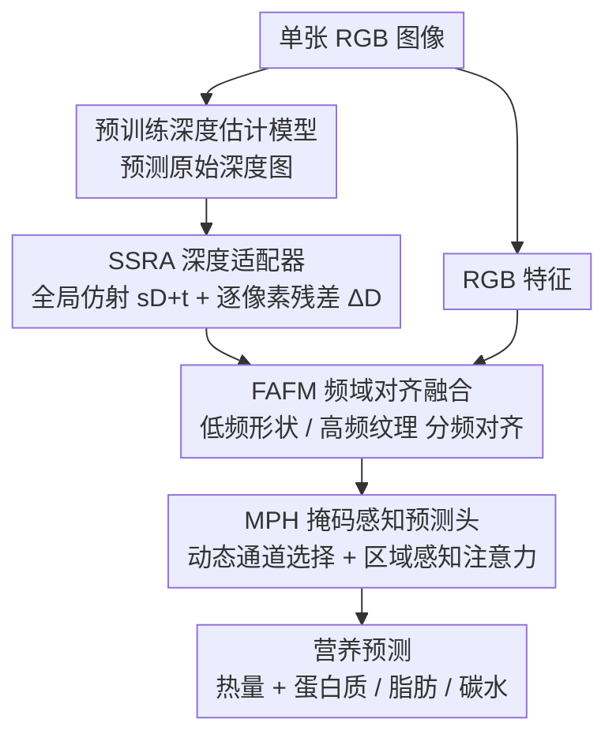

# OmniFood8K: Single-Image Nutrition Estimation via Hierarchical Frequency-Aligned Fusion

**会议**: CVPR 2026 Highlight  
**arXiv**: [2604.12356](https://arxiv.org/abs/2604.12356)  
**代码**: [https://yudongjian.github.io/OmniFood8K-food/](https://yudongjian.github.io/OmniFood8K-food/)  
**领域**: 食物计算 / 多模态融合  
**关键词**: 食物营养估计, 多模态数据集, 深度估计, 频域融合, 中国菜

## 一句话总结

构建了涵盖 8036 个样本的中式食物多模态营养数据集 OmniFood8K 和 115K 合成数据集 NutritionSynth-115K，并提出端到端框架通过 Scale-Shift 深度适配器、频域对齐融合和掩码预测头从单张 RGB 图像预测营养信息。

## 研究背景与动机

**领域现状**：食物营养估计在公共健康中至关重要，深度学习方法在自动识别和估计食物质量、体积和营养方面展现潜力。

**现有痛点**：(1) 数据限制：现有数据集严重偏向西方菜系，对中式食物覆盖不足；(2) 算法限制：先进方法依赖深度相机获取深度信息，日常场景中食物照片通常用 RGB 相机拍摄。

**核心矛盾**：深度信息对准确估计食物体积和营养至关重要，但实际部署场景通常只有 RGB 图像。

**本文目标**：(1) 构建覆盖中式菜系的综合多模态食物数据集；(2) 提出仅需单张 RGB 图像的端到端营养预测框架。

**切入角度**：利用预训练深度估计模型从 RGB 图像预测深度，通过适配器校正和频域融合替代实际深度传感器。

**核心 idea**：预测深度图 → 适配器校正 → 频域对齐融合 RGB 和深度特征 → 掩码感知预测。

## 方法详解

### 整体框架

这篇论文要解决的是「日常场景只有单张 RGB 照片、却想拿到食物体积和营养」的矛盾——准确估营养离不开深度，但用户手机里没有深度相机。作者的思路是把深度"算出来"再用好：先用一个预训练深度估计模型从 RGB 图预测出深度图，但这张深度图尺度不准、局部还有失真，所以接一个适配器 SSRA 把它校正成可用的几何信号；校正后的深度特征再和 RGB 特征在频域里对齐融合（FAFM），让形状和纹理各走各的频段；最后由一个掩码感知的预测头 MPH 把注意力收到真正含食材的区域上，回归出热量与三大宏量营养素。整条链路端到端训练，推理时只吃一张 RGB 图。

### 关键设计

**1. Scale-Shift Residual Adapter (SSRA)：把"借来的"深度图改造成能用的几何信号**

预训练深度模型是在通用场景上训的，搬到食物图上会出两类错——整体尺度对不上（同一盘菜估出的绝对深度可能整体偏大或偏小），以及盘沿、堆叠食材这些局部结构被估糊。SSRA 用两条互补的修正同时治这两类病：一条学一对全局参数 $s,t$ 对原始深度 $D$ 做仿射变换 $sD+t$，把整张图的尺度和零点拉回正确量程；另一条用一个轻量残差网络预测逐像素的局部修正量 $\Delta D$，补回被压平的边界和细节。最终校正深度为 $\hat D = sD + t + \Delta D$。全局仿射负责"对得准"、残差负责"看得清"，两者叠加既不破坏整体量程又能保留精细几何，这也解释了消融里去掉 SSRA 后误差暴涨约 12 个点——原始预训练深度本身偏得很厉害。

**2. Frequency-Aligned Fusion Module (FAFM)：换个域融合，避开 RGB 和深度的模态冲突**

RGB 携带颜色纹理、深度携带几何，直接在空间域拼接或相加容易让两种异质信号互相干扰。FAFM 改在频域里做：把 RGB 和深度特征变换到频域后按频段对齐再融合——低频成分对应食物的整体形状和体积轮廓，高频成分对应表面纹理和细节边界，于是"形状归形状、纹理归纹理"地分频对齐，每个频段只融合语义相容的部分，再变换回空间域。这样融合出的特征比空间域直接拼接更干净，消融中频域融合相比直接拼接把热量 MAE 从 175.6 降到 165.8，正是这个动机的验证。

**3. Mask-based Prediction Head (MPH)：让预测头只看含营养的地方**

一张食物照里盘子、桌面、背景都是噪声，不同食材区域的营养密度也差很多，用一个普通 MLP 头在全图上回归等于把无关像素的信息也算进去。MPH 做两件事来收窄注意力：先用动态通道选择，按信息量给特征通道打分、筛掉贡献低的通道，只留下对营养判别最有用的那批；再叠一层区域感知注意力，对真正含食材的空间区域加权、压低容器和背景的响应。两步配合让预测头把容量集中在关键食材上，去掉 MPH 后误差上升约 5.5 个点说明这种"聚焦"确有收益。

### 损失函数 / 训练策略

训练用标准回归损失同时监督热量与蛋白质、脂肪、碳水三大宏量营养素的预测值。为缓解真实标注数据稀缺，先在合成数据集 NutritionSynth-115K（11.5 万样本）上预训练增强泛化，再在 OmniFood8K 上微调。

## 实验关键数据

### 主实验

| 方法 | 热量 MAE↓ | 蛋白质 MAE↓ | 脂肪 MAE↓ | 碳水 MAE↓ |
|------|----------|-----------|----------|----------|
| Im2Calories | 224.5 | 15.8 | 13.2 | 22.1 |
| Nutrition5K | 198.3 | 13.5 | 11.4 | 19.7 |
| RoDE | 185.7 | 12.8 | 10.6 | 18.3 |
| FBFPN (RGB+D) | 172.4 | 11.2 | 9.8 | 16.5 |
| **本文 (仅RGB)** | **165.8** | **10.5** | **9.2** | **15.8** |

### 消融实验

| 配置 | 热量 MAE↓ | 说明 |
|------|----------|------|
| 完整模型 | 165.8 | SSRA + FAFM + MPH |
| 无 SSRA | 178.2 | 不校正深度 |
| 无 FAFM (直接拼接) | 175.6 | 空间域拼接 |
| 无 MPH | 171.3 | 标准MLP头 |
| 无深度分支 | 182.5 | 仅RGB |

### 关键发现

- SSRA 贡献最大：去掉深度校正后 MAE 增加约 12 个点，说明预训练深度的原始预测确实存在显著偏差
- 频域融合优于空间域拼接，验证了 FAFM 的设计动机
- 仅用 RGB 输入的性能超过了使用真实深度传感器的 FBFPN 方法

## 亮点与洞察

- 用预训练深度估计替代深度传感器的思路具有实用价值：使得营养估计在日常场景中可部署
- OmniFood8K 数据集覆盖完整烹饪流程（原料→食谱→烹饪视频→多视图成品），是该领域最全面的数据集之一
- 合成数据集 NutritionSynth-115K 的构建方法对数据稀缺场景有借鉴价值

## 局限与展望

- 仅覆盖中式菜系，跨文化泛化性未验证
- 数据集规模（8036 样本）在深度学习标准下仍较小
- 预训练深度模型在食物图像上的适用性需要更多分析
- 可结合食材识别和份量估计进一步提升

## 相关工作与启发

- **vs Nutrition5K**: Nutrition5K 以西方食物为主且需多视图，本文覆盖中式食物且仅需单视图
- **vs FBFPN**: FBFPN 需要真实 RGB-D 输入，本文从单张 RGB 预测深度反而效果更好

## 评分

- 新颖性: ⭐⭐⭐⭐ 数据集和频域融合框架都有新意
- 实验充分度: ⭐⭐⭐⭐ 多数据集对比和详细消融
- 写作质量: ⭐⭐⭐⭐ 结构清晰
- 价值: ⭐⭐⭐⭐ 数据集贡献突出

<!-- RELATED:START -->

## 相关论文

- [\[CVPR 2026\] Multi-Hierarchical Contrastive Spectral Fusion for Multi-View Clustering](multi-hierarchical_contrastive_spectral_fusion_for_multi-view_clustering.md)
- [\[AAAI 2026\] Private Frequency Estimation via Residue Number Systems](../../AAAI2026/others/private_frequency_estimation_via_residue_number_systems.md)
- [\[CVPR 2026\] When Lines Meet Textures: Spatial-Frequency Aligned Diffusion Features for Cross-Sparsity Correspondence](when_lines_meet_textures_spatial-frequency_aligned_diffusion_features_for_cross-.md)
- [\[AAAI 2026\] CAE: Hierarchical Semantic Alignment for Image Clustering](../../AAAI2026/others/hierarchical_semantic_alignment_for_image_clustering.md)
- [\[CVPR 2025\] Towards In-the-Wild 3D Plane Reconstruction from a Single Image](../../CVPR2025/others/towards_in-the-wild_3d_plane_reconstruction_from_a_single_image.md)

<!-- RELATED:END -->
