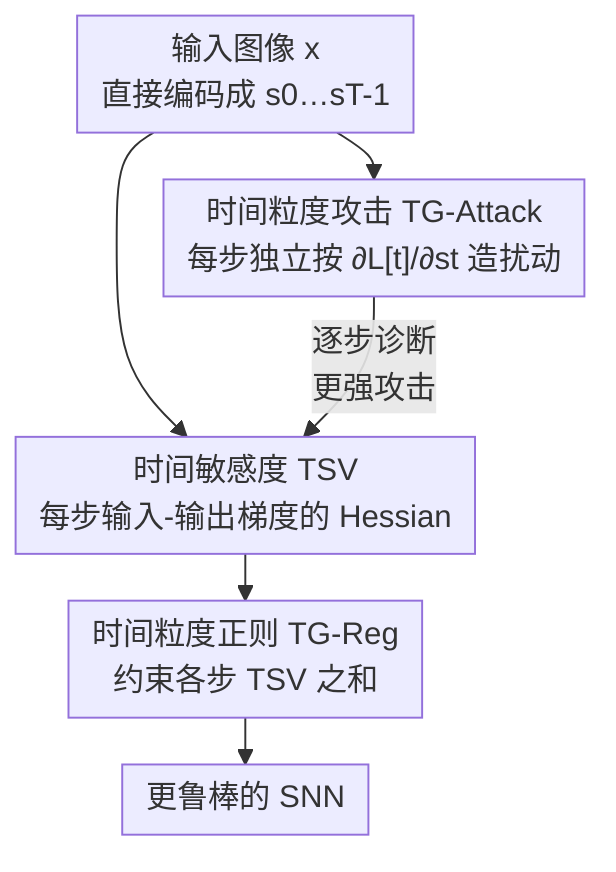

# On the Role of Temporal Granularity in the Robustness of Spiking Neural Networks

**会议**: CVPR 2026  
**论文**: [CVF Open Access](https://openaccess.thecvf.com/content/CVPR2026/html/Xu_On_the_Role_of_Temporal_Granularity_in_the_Robustness_of_CVPR_2026_paper.html)  
**代码**: https://github.com/zjubmi-lab/TG-SNN-code  
**领域**: 脉冲神经网络 / 对抗鲁棒性  
**关键词**: 脉冲神经网络, 时间粒度, 对抗攻击, 鲁棒性分析, Hessian 正则

## 一句话总结
本文从"时间粒度"（单个时间步）而非"时间平均"的视角重新审视脉冲神经网络（SNN）的鲁棒性，提出按时间步逐步构造扰动的 TG-Attack（攻击更强）、用每步输入-输出梯度的 Hessian 定义无需生成对抗样本就能估鲁棒性的 Temporal Sensitivity Value（TSV），并据此设计约束各时间步 TSV 的正则项 TG-Reg，在多数据集多网络上一致超过现有 SOTA 防御。

## 研究背景与动机

**领域现状**：SNN 作为"第三代神经网络"，靠 LIF 神经元在时间维度上累积膜电位、发放脉冲，天然带时序动态。研究 SNN 鲁棒性时，主流做法是把它当成一个"展开了 $T$ 个时间步的网络"，攻击时按 FGSM/PGD 沿损失梯度方向加扰动。

**现有痛点**：几乎所有现有攻击与防御都建立在**时间平均梯度**上——即把各时间步的梯度 $\frac{\partial L}{\partial s_t}$ 平均成 $\frac{1}{T}\sum_t \frac{\partial L}{\partial s_t}$ 再加到原图上（见式 5）。这种平均会**互相抵消/压制**某些时间步上本来很强的方向，导致攻击不够强、基于它训练出来的防御也"看不到"真正的弱点。

**核心矛盾**：已有研究早就发现 SNN 的时序学习能力、各时间步的梯度本就**逐步不同**，但鲁棒性研究却仍只看"整体时间行为"，把这种逐步差异平均掉了。换句话说，分析的粒度（时间平均）和现象发生的粒度（单个时间步）不匹配。

**本文目标**：拆成三个子问题——(1) 能不能造一个在**单时间步**粒度上更强的攻击，暴露逐步鲁棒性差异？(2) 能不能**不生成对抗样本**就量化每个时间步的脆弱程度？(3) 能不能据此设计一个直接提升逐步鲁棒性的训练正则？

**切入角度**：作者聚焦于"直接编码 + 代理梯度直训"这一最主流但也被指出比 rate-encoding 更脆弱的 SNN 设定，主张在**每个时间步独立**地看梯度。

**核心 idea**：把鲁棒性分析从"时间平均"下沉到"时间粒度"——逐步攻击、用每步 Hessian 量化敏感度、再逐步正则化。

## 方法详解

### 整体框架

整篇工作围绕一条逻辑链：**先用更强的逐步攻击证明"时间粒度视角有意义"，再从理论上把逐步鲁棒性归结到每个时间步的 Hessian（TSV），最后把 TSV 变成一个训练正则项去压低它**。三个部件是层层递进的——攻击是"诊断工具"，TSV 是"免攻击的体检指标"，TG-Reg 是据指标开的"药方"。

SNN 的基本动力学是 LIF 神经元：膜电位 $u^l_t = \tau(u^l_{t-1} - V_{th}s^l_{t-1}) + W^l s^l_{t-1}$，发放 $s^l_t = H(u^l_t - V_{th})$（$H$ 为阶跃函数，不可导，训练/攻击时用代理梯度近似）。输入图像 $x$ 经直接编码复制成时间序列 $s = \langle s_0, \dots, s_{T-1}\rangle$ 后送入网络。

### 关键设计

**1. TG-Attack：把扰动从"时间平均"拆到"每个时间步独立构造"**

传统攻击（式 4+5）把各步梯度平均后再加到未编码的原图 $x$ 上，强方向被均匀化掉。TG-Attack 反过来——**对编码后序列的每一帧 $s_t$，只用该时间步自己的梯度造扰动**：

$$\hat{s}_t = s_t + \epsilon\,\mathrm{sign}\big(\nabla_{s_t} L(f(s_t), y_{true})\big), \quad \nabla_{s_t} L = \frac{\partial L[t]}{\partial s_t}$$

最终对抗样本由各步扰动后的帧拼回 $\hat{x} = \langle \hat{s}_0, \dots, \hat{s}_{T-1}\rangle$（式 7-9）。两个关键点：一是损失 $L[t]$ 用 $f(s_t)$ 计算，而 $f(s_t)$ 是把输出层脉冲**累积到第 $t$ 步**得到的——因为 LIF 神经元当前输出依赖此前所有时刻的信息，所以"当前步输出"必须含历史累积，不能孤立取单帧。二是每步都选自己最优的扰动方向、并把这些"时间特定方向"保留下来，因此比平均梯度更强。它既是更狠的攻击，也顺带把"各时间步鲁棒性不同"这一现象显式暴露出来。

**2. Temporal Sensitivity（TS/TSV）：用每步 Hessian 把"逐步鲁棒性"变成可计算、免攻击的指标**

有了"逐步看"的视角，作者想要一个**不用真的生成对抗样本**就能衡量某个时间步多脆弱的量。思路是：在第 $t$ 步给输入加微扰 $\epsilon$，用 KL 散度 $KL(f_w(y_t|s_t)\,\|\,f_w(y_t|s_t+\epsilon))$ 度量输出分布的变化（变化越大越脆弱）。对 $\log f_w(y_t|s_t+\epsilon)$ 做二阶 Taylor 展开后，一阶项在期望下消去，得到 Theorem 1：

$$KL\big(f_w(y_t|s_t)\,\|\,f_w(y_t|s_t+\epsilon)\big) \approx \tfrac{1}{2}\,\epsilon^\top\, \mathbb{E}_{f_w(y_t|s_t)}\big[-H_{s_t}\log f_w(y_t|s_t)\big]\,\epsilon$$

即**第 $t$ 步的鲁棒性由该步输入-输出对数概率的 Hessian 决定**。作者把这个期望 Hessian 定义为 Temporal Sensitivity Matrix（TSM，式 14），其所有元素之和定义为 Temporal Sensitivity Value $TSV(s_t) = \sum_{i,j}\mathbb{E}[-H_{s_t}\log f_w(y_t|s_t)]_{i,j}$（式 15）。TSV 越大、KL 越大、该步越易被扰动。实验（图 2）显示 TSV 随时间步的变化趋势与 FGSM 攻击下各步精度下降趋势一致，验证了它确实是免攻击的鲁棒性"体检表"。

**3. TG-Reg：把"压低每步 TSV"做成可训练的一阶正则项**

既然高 TSV = 脆弱，自然的防御就是训练时压低所有时间步的 TSV 之和：$L_{TG} = \sum_{t=0}^{T} TSV(s_t)$（式 16），总损失 $L = L_{CE} + \lambda L_{TG}$（式 17）。但直接算二阶 Hessian（式 15）训练太慢，作者把 $\log f$ 的 Hessian 展开成 $\frac{H_{s_t}f}{f} - \frac{\nabla_{s_t}f\,\nabla_{s_t}f^\top}{f^2}$（式 19），在期望下近似消掉二阶项，最终得到**只含一阶梯度**的形式：

$$TSV(s_t) \approx \sum_{i,j}\mathbb{E}_{f_w(y_t|s_t)}\big[\nabla_{s_t}\log f_w(y_t|s_t)\,\nabla_{s_t}\log f_w(y_t|s_t)^\top\big]_{i,j}$$

（式 21，即每步对数似然梯度的外积，类似 Fisher 信息，⚠️ 二阶项消去的具体条件以原文附录证明为准）。这样正则项无需二阶反传即可插进训练。作者特别对比了 SR [25]：SR 取真标签输出概率、对原图 $x$ 算**时间平均**梯度并用有限差分近似；TG-Reg 则对**编码后每帧 $s_t$ 独立**算梯度幅度——三点差异（梯度计算粒度 / 扰动目标 / 正则实现）正对应"时间粒度 vs 时间平均"的核心立场。

### 损失函数 / 训练策略
总损失 $L = L_{CE} + \lambda L_{TG}$，默认 $\lambda = 100$；时间步 $T=8$，训练 200 epoch，SGD（初始 lr=0.1，余弦退火），代理梯度用 triangle-like 函数，BatchNorm 缓解梯度消失/爆炸。对抗训练对比基线用 PGD（$\epsilon=2/255$, $k=2$）样本。

## 实验关键数据

数据集：CIFAR-10 / CIFAR-100 / Tiny-ImageNet / DVS-CIFAR10；网络：VGG11 / WideResNet16 / ResNet19 / ResNet34。攻击默认 $\epsilon=8/255$, $k=7$, $\alpha=0.01$。

### TG-Attack 更强（同一模型，TG 版精度更低 = 攻击更狠）

| 设置 (CIFAR10, VGG11, T=4) | FGSM | TG-FGSM | PGD | TG-PGD | BIM | TG-BIM |
|------|------|---------|-----|--------|-----|--------|
| Vanilla（净训练后被攻击残余精度%） | 12.71 | **9.72** | 0.38 | **0.21** | 0.23 | **0.18** |

逐步攻击在每种基础攻击上都把残余精度压得更低（如 FGSM 12.71%→TG-FGSM 9.72%），证明"按时间步造扰动"确实比平均梯度更有效。

### TG-Reg 防御对比 SOTA（对抗训练设定，残余精度% 越高越鲁棒）

| 设置 (CIFAR10, VGG11, T=4) | Clean | FGSM | PGD | BIM | AutoAttack |
|------|-------|------|-----|-----|------------|
| AT [27] | 90.56 | 37.88 | 20.01 | 18.88 | 6.25 |
| RAT [8] | 90.52 | 40.78 | 22.35 | 20.88 | 7.04 |
| SR [25] | 90.96 | 36.87 | 13.11 | 11.43 | 6.33 |
| **TG-Reg (Ours)** | 89.45 | **48.64** | **31.12** | **29.40** | **8.76** |

在最强的 AutoAttack 下 TG-Reg 仍把鲁棒精度从 RAT 的 7.04% 提到 8.76%，PGD/BIM 上领先幅度更大（约 +9 个百分点），且 Clean 精度仅小幅下降（90.56→89.45）。CIFAR-100/VGG11 上同样全面领先（AutoAttack 4.72% vs RAT 2.32%）。

### 关键发现
- TSV 的逐步曲线与攻击下逐步精度下降曲线高度吻合（图 2），印证 Theorem 1——**鲁棒性确由每步 Hessian 决定**，且 TSV 可作免攻击的鲁棒性估计器。
- TG-Reg 在净训练（train with original samples）和对抗训练两种范式下都能提鲁棒性，说明它是**正交于对抗训练**的增益项，而非替代。
- 对比 SR 的全面领先（如 CIFAR10 PGD 31.12% vs 13.11%）说明"逐时间步算梯度"比"时间平均梯度 + 有限差分"更切中 SNN 的脆弱来源。

## 亮点与洞察
- **把"鲁棒性"精确定位到 Hessian 上**：用 KL 二阶展开严格推出"逐步鲁棒性 ∝ 每步 Hessian"，再把二阶量近似成一阶梯度外积，既给了理论根据又能高效训练——这套"理论指标→可训练正则"的桥接很干净，可迁移到其他需要免攻击鲁棒性度量的场景。
- **时间粒度这个视角本身是最大贡献**：SNN 社区长期默认"时间平均"，本文用一个更强的攻击直接证明这个默认丢信息，属于"换个粒度看就发现新弱点"的洞察型工作。
- **TSV 免对抗样本估鲁棒性**很实用：评估鲁棒性通常要跑昂贵的多步攻击，TSV 只需一次前/反传即可逐步打分。

## 局限与展望
- 仅限"直接编码 + 代理梯度直训"的 SNN，是否推广到 rate-encoding 或其他训练范式未充分验证（作者自述聚焦于此设定）。
- TSV 用全 Hessian 元素求和作为标量，⚠️ 这种"逐元素加和"是否最优、对各向异性敏感度是否丢信息，原文未深入讨论。
- 实验规模止于 Tiny-ImageNet，未见大规模数据集；$\lambda=100$ 偏大，敏感性仅在附录给出，实际部署需调参。
- 二阶项在期望下被消去（式 19→21）依赖近似条件，⚠️ 具体成立范围以原文附录证明为准。

## 相关工作与启发
- **vs AT / RAT [8,27]（对抗训练类）**：它们直接拿对抗样本训练，不显式建模时间结构；TG-Reg 是无对抗样本的正则项、显式压每步 TSV，且与对抗训练可叠加，鲁棒精度更高。
- **vs SR [25]（梯度稀疏正则）**：SR 对原图算时间平均梯度 + 有限差分；TG-Reg 对每帧编码输入独立算梯度外积，正是"时间粒度 vs 时间平均"之别，实验上大幅领先 SR。
- **vs FEEL-SNN [40] / RSC-SNN [36]（时序编码类）**：它们改编码方式（频率/随机平滑）来提鲁棒性，关注整体时序动态；本文不改编码，而是从单步梯度的二阶几何（Hessian）切入，两条路线正交，可考虑结合。

## 评分
- 新颖性: ⭐⭐⭐⭐⭐ "时间粒度"视角 + Hessian 理论 + 免攻击指标，三者串成一条清晰且少有人走的线。
- 实验充分度: ⭐⭐⭐⭐ 4 数据集 4 网络、攻击/防御双向验证充分，但规模止于 Tiny-ImageNet。
- 写作质量: ⭐⭐⭐⭐ 逻辑链（攻击→指标→正则）顺畅，公式推导完整；部分二阶近似细节压在附录。
- 价值: ⭐⭐⭐⭐ 提供可迁移的"免攻击鲁棒性度量 + 正则"范式，对 SNN 鲁棒性研究有方法论意义。

<!-- RELATED:START -->

## 相关论文

- [\[CVPR 2026\] Robust Spiking Neural Networks by Temporal Mutual Information](robust_spiking_neural_networks_by_temporal_mutual_information.md)
- [\[CVPR 2026\] Temporal Interaction in Spiking Transformers with Multi-Delay Mixer](temporal_interaction_in_spiking_transformers_with_multi-delay_mixer.md)
- [\[CVPR 2026\] Temporal Representation Enhancement (TRE): Learning to Forget Dominant Patterns for Enhanced Temporal Spiking Features](temporal_representation_enhancement_tre_learning_to_forget_dominant_patterns_for.md)
- [\[ICML 2026\] Bullet Trains: Parallelizing Training of Temporally Precise Spiking Neural Networks](../../ICML2026/others/bullet_trains_parallelizing_training_of_temporally_precise_spiking_neural_networ.md)
- [\[AAAI 2026\] TDSNNs: Competitive Topographic Deep Spiking Neural Networks for Visual Cortex Modeling](../../AAAI2026/others/tdsnns_competitive_topographic_deep_spiking_neural_networks_for_visual_cortex_mo.md)

<!-- RELATED:END -->
