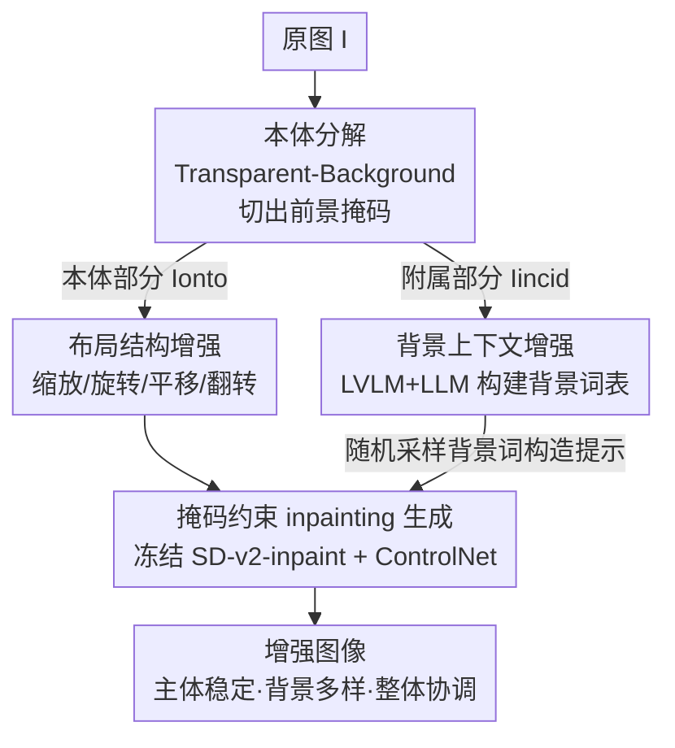

# OntoAug: Rethinking Generative Data Augmentation via Ontology Guidance

**会议**: CVPR 2026  
**论文**: [CVF Open Access](https://openaccess.thecvf.com/content/CVPR2026/html/Wang_OntoAug_Rethinking_Generative_Data_Augmentation_via_Ontology_Guidance_CVPR_2026_paper.html)  
**关键词**: 生成式数据增强、本体引导、扩散模型、前景背景解耦、细粒度分类

## 一句话总结
OntoAug 把一张图显式拆成「本体部分」（前景主体）和「附属部分」（背景），用前景掩码作为扩散 inpainting 的硬约束只改背景、不动主体，再配上几何布局变换 + LVLM/LLM 扩充的背景词表，从而在生成增强样本时同时拿到「主体稳定、背景多样、整体协调」三者，在细粒度分类、小样本、WSOL、VLM 强化微调上均刷到 SOTA。

## 研究背景与动机
**领域现状**：数据增强是提升图像识别的标配。传统方法（Mixup、CutMix 等）靠像素插值或区域替换造样本；近两年随着扩散模型成熟，生成式增强（Diff-Mix、DiffuseMix、SaSPA、De-DA）成为主流，能合成语义合理、画质更高的样本。

**现有痛点**：分类任务里判别信息分布是**不均匀**的——前景主体携带的类别信号远比背景丰富。但大多数生成增强方法把图像当成一个整体处理，不区分前景背景，结果在合成时引入了「意外的语义漂移」：Diff-Mix 的跨类扩散会改掉主体的颜色纹理、产生反事实样本；DiffuseMix 用固定文本提示，只能做风格变化；SaSPA 用边缘约束保真，却把生成空间锁死、背景不够多样；De-DA 直接把前景像素叠到别的背景上，边界语义不连贯。

**核心矛盾**：增大背景多样性往往会动到主体身份，而想保住主体结构又会限制多样性——这是「保真 vs 多样」的根本 trade-off。作者把它细化成三个相互拉扯的诉求：Q1 主体语义一致、Q2 背景语义多样、Q3 前景背景整体协调，现有方法没一个能同时兼顾。

**切入角度**：人的类别识别本身就是这样工作的——主体身份保持稳定，背景环境的变化只要整体协调就能容忍。作者把这套「本体（ontology）」直觉搬进生成增强：图像里真正定义类别的是主体本体，背景只是附属。

**核心 idea**：先把图拆成本体部分和附属部分，用前景掩码当硬约束让扩散模型**只 inpaint 背景**，本体区域只允许布局级别（缩放/旋转/平移/翻转）的几何变化，背景则用一个通用词表大幅多样化——这样 Q1/Q2/Q3 一次满足。

## 方法详解

### 整体框架
OntoAug 解决的是「生成增强时怎么既不改坏主体、又能把背景玩出花样」。整条管线分两阶段：先做**本体分解**把图切成前景本体 $I_{onto}$ 和附属背景 $I_{incid}$；再做**本体引导生成**——对本体做几何布局变换、对背景从词表里随机采样一个语义，最后把布局增强后的前景掩码 + 背景提示一起喂给冻结的扩散 inpainting 模型，只在背景区域去噪生成，本体像素被掩码锁住不变。整图相对原图主体不变、布局多样、背景全新且边界协调。

### 关键设计

**1. 本体分解：把「定义类别的部分」从背景里抠出来**

痛点是整体式生成会无差别地改动全图，连主体的判别细节也被一起改掉。OntoAug 先承认图像里不同像素语义功能不同：一部分像素承载类别核心特征（如「跑车」里车本身），另一部分只反映环境背景（如道路）。于是显式地把图 $I$ 分解成两个不重叠的部分：

$$I = I_{onto} \cup I_{incid}, \quad I_{onto} \cap I_{incid} = \emptyset$$

实现上用一个 Transparent-Background 分割模型 $S(\cdot)$ 抽前景掩码 $I_m = S(I)$ 来界定本体区域。这个分割模块是可替换的（也能换成 SAM 系或 Grounded-SAM 等文本引导分割）。这一步是后面所有约束的地基：只有先知道「哪里是不能动的主体」，才谈得上「只改背景」。

**2. 布局结构增强：本体可以挪位置，但不能变身**

只锁住主体不动会让样本缺乏空间多样性——真实场景里同一个物体会出现在不同位置、角度、尺度。OntoAug 在保持本体语义不变的前提下，模拟前景物体的多样空间布局。具体先求前景在掩码和原图中的最小外接矩形：

$$O_{I}, O_{I_m} = \text{MinBBox}(I_m)$$

求最小外接矩形是为了约束后续变换，防止前景越出图像边界、丢失主体结构。然后把这两个几何控制单元同步施加几何操作——缩放（L1）、旋转（L2）、平移（L3）、水平翻转（L4）：

$$O_{I_m}', O_{I}' = LM(O_{I_m}, O_{I})$$

注意掩码和原图的本体区域是**同步**变换的，保证变换后掩码仍精确对齐主体。这跟那些改风格、改主体内容的方法本质不同：本体只做布局级（geometry-only）变化，纹理、颜色、身份一概不动，所以 Q1 语义一致天然成立。

**3. 背景上下文增强：用通用词表把背景的语义组合潜力榨出来**

现有方法背景不够多样，根因是提示固定或受边缘约束。OntoAug 反过来把背景当成「越多样越好」的附属维度，构建一个丰富的背景词表 $V_{bg}$。做法是先借助 LVLM 从 Stanford Cars、Aircraft、CUB 等数据集里抽取、整理代表性背景词（涵盖自然环境、交通场景、人类活动等），并刻意排除可能出现在前景里的词（如「bridge」），优先保留纯背景词（如「sky」），避免污染主体；再用 LLM 对这些种子词做语义扩展，形成更全面的词表。生成时从 $V_{bg}$ 随机采一个词，按模板 `"An image of <Class> with the background of <Background word>"` 构造提示。关键在于这个词表是**通用而非数据集专属**的，因此能跨数据集引入背景多样性、缓解背景偏置（后面 Waterbirds OOD 实验验证了这点）。

**4. 掩码约束 inpainting 生成：让扩散模型只画背景、且边界协调**

前面三步备好了「不动的本体 + 要换的背景词」，这一步要让扩散模型把它们协调地缝起来。OntoAug 沿用 PBG 的生成范式，采用**冻结**的 Stable Diffusion v2-inpainting 作为生成主干，并集成一个**可训练**的改版 ControlNet，额外接收掩码和前景图像输入。布局变换后的本体控制区域 $O_{I_m}', O_{I}'$ 喂进去引导去噪，使生成**仅在背景区域**发生；CFG 引导尺度用默认 7.5，每张图生成 4 张增强样本。掩码作为强约束在去噪全程把前景内容钉死不变，而把前景图像显式作为输入，又让模型在推理时能把主体自然地融进新生成的环境里，从而减少边界伪影。这正是 Q3 整体协调的来源——De-DA 那种「前景像素硬叠到背景」会破坏边界语义，而这里是模型在掩码外「围着主体重新作画」，边界自然衔接。

### 一个完整示例
以一张 Yellow-throated Vireo（黄喉绿鹃）的图为例：① 本体分解抠出鸟的前景掩码，鸟身=本体，原始树枝=附属；② 布局增强对鸟的外接框做随机组合变换（比如缩放 + 水平翻转），鸟的纹理颜色不变只是换了位置姿态；③ 从背景词表随机采到「branch」，构造提示 `"An image of Yellow_throated_Vireo with the background of branch"`；④ 把变换后的前景掩码 + 提示送入冻结的 SD-inpainting，模型只在掩码外重画背景，生成一张「同一只鸟、新姿态、全新协调背景」的样本。重复 4 次即得 4 张增强图，主体始终是那只鸟，背景各不相同。

## 实验关键数据

### 主实验
ResNet-50 从零训练 300 epoch 的细粒度分类（FGVC），OntoAug 在三个数据集全部最优：

| 数据集 | Vanilla | 最强生成基线 | OntoAug | 相对最强基线 |
|--------|---------|--------------|---------|--------------|
| CUB | 65.50 | Diff-Mix 81.62 | **84.62** | +3.00 |
| Cars | 85.52 | De-DA 93.04 | **94.29** | +1.25 |
| Aircraft | 80.29 | Diff-Mix 85.84 | **87.91** | +2.07 |

迁移学习（ImageNet-1K 预训练 ResNet-50）下也稳超此前 SOTA Diff-Mix，且与经典 Mix 方法叠加后还能再涨：

| 配置 | CUB | Cars | Aircraft |
|------|-----|------|----------|
| Vanilla | 85.49 | 93.04 | 91.07 |
| Diff-Mix | 86.42 | 91.87 | 92.26 |
| OntoAug | **88.33** | **94.34** | **92.89** |
| OntoAug+SnapMix | **88.97** | **94.80** | **94.46** |

小样本（CUB 每类 10 张，3 个 backbone 平均）是差距最悬殊的场景：

| 方法 | 平均准确率 | 相对 Vanilla 增益 |
|------|-----------|-------------------|
| Vanilla | 31.79 | — |
| Diff-Mix | 44.32 | +12.53 |
| De-DA（次优） | 53.67 | +21.88 |
| **OntoAug** | **67.55** | **+35.76** |

OntoAug 比次优 De-DA 高出 **13.88%**，说明在数据极度稀缺时，「主体稳定 + 背景多样」的高质量样本格外救命。此外 WSOL（CUB，IoU30/50/70 平均 55.39，全场最高）、Waterbirds OOD（平均 74.82，比次优 De-DA 高 1.75）、Qwen2.5-VL-3B 的 GRPO 强化微调（66.24，优于所有增强基线）都验证了跨任务通用性。

### 消融实验
布局策略逐项叠加（在背景增强基础上），CUB 上每项的单独增益：

| 配置 | CUB | 说明 |
|------|-----|------|
| 仅背景增强（无布局） | 81.53 | 基线 |
| + L1 缩放 | 83.91 | +2.38，单项最大 |
| + L2 旋转 | 83.06 | +1.53 |
| + L3 平移 | 82.29 | +0.76，单项最小 |
| + L4 翻转 | 83.75 | +2.22 |
| L1+L2+L3+L4 全开 | **84.62** | 四项协同最优 |

整体协调策略消融（Figure 5，ResNet-50/CUB）：原图 65.50 →（仅换 Places 真实背景）71.90 →（生成背景）77.17 →（原始布局 + 生成背景）81.53 →（增强布局 + 生成背景，完整版）**84.62**。

### 关键发现
- **布局四项里缩放贡献最大（+2.38）、平移最小（+0.76）**，但四项协同（84.62）明显高于任一单项，说明空间多样性需要多种几何变换叠加才充分。
- **生成背景 > 真实采样背景**：Figure 5 里 Experiment E（生成背景 81.53）优于 Experiment C（Places 真实背景 77.17），说明扩散模型生成的协调背景比直接贴真实背景更有利——印证了 Q3 整体协调的价值。
- **小样本场景增益最夸张（+35.76）**，远超迁移学习（约 +2~3）的提升幅度；数据越稀缺，高保真高多样样本的边际价值越高。
- **背景词表越丰富越鲁棒**：Waterbirds 上完整版（74.82）优于只用栖息地相关词的 OntoAug*（73.48），通用多样词表对背景偏移更稳。
- **合成数据量边际递减**：合成倍数 1→4 单调上升到峰值 84.62，再加更多则趋于平缓；OntoAug 用 4 倍就超过 Diff-Mix 5 倍（81.62）、DiffuseMix 10 倍（79.37），在成本和效果上双赢。

## 亮点与洞察
- **把哲学里的「本体（ontology）」概念落成一个可操作的工程约束**：本体=不可动的判别主体、附属=可自由变的背景，简单直白却恰好对应 Q1/Q2/Q3 三个诉求，是那种「想通了就觉得理所当然」的设计。
- **掩码即硬约束 + 只 inpaint 背景**，从机制上根除了主体语义漂移，比 Diff-Mix 那种生成后再用 CLIP 过滤反事实样本的事后补救要干净得多——把问题在生成阶段就堵死。
- **背景词表通用而非数据集专属**，且刻意排除会混入前景的词，这个工程细节是 Waterbirds OOD 鲁棒性的直接来源，思路可迁移到任何需要「换背景但别换主体」的可控生成任务。
- **生成主干全程冻结、只训一个改版 ControlNet**，训练成本低、可即插即用换分割器/扩散器，工程友好度高。

## 局限与展望
- **强依赖前景分割质量**：本体边界由 Transparent-Background 等分割模型决定，对前景模糊、多主体、伪装目标或主体与背景纠缠的图，掩码不准会直接连累生成质量；论文未量化分割误差对最终精度的影响。
- **「主体绝不变化」的假设有适用边界**：对某些类别，背景/上下文本身就是判别线索（如水鸟 vs 陆鸟的栖息地），一味多样化背景甚至可能削弱有用的上下文先验——Waterbirds 上有效，但不保证所有任务都成立。
- **本体只允许几何级变换**，无法引入主体本身的合理类内变化（如不同车型角度的形变、鸟的不同姿态形变），多样性主要落在背景侧，主体侧多样性受限。
- **评测集中在细粒度分类系任务**（FGVC/小样本/WSOL/Waterbirds 多为 CUB/Cars/Aircraft），在通用大规模分类（ImageNet 全量）、检测/分割等密集预测任务上的收益尚待验证。

## 相关工作与启发
- **vs Diff-Mix**：Diff-Mix 做跨类扩散混合来丰富类别边界，但常生成反事实/语义不一致样本，需额外 CLIP 过滤；OntoAug 用掩码锁死主体、只改背景，从源头避免主体漂移，CUB 上 84.62 vs 81.62。
- **vs SaSPA**：SaSPA 用边缘条件保语义准确，却把生成空间限得太死、背景不够多样；OntoAug 用前景掩码（而非全图边缘）做约束，背景留出充分自由度，兼顾保真与多样。
- **vs DiffuseMix**：DiffuseMix 靠固定文本提示 + 风格叠加，样本主要是风格变化、缺乏内容/布局多样性；OntoAug 的背景词表 + 布局变换提供了语义和空间两个维度的多样性。
- **vs De-DA**：两者都解耦前景背景，但 De-DA 直接把前景像素硬叠到别的背景上，边界语义不连贯；OntoAug 让扩散模型围着掩码重画背景，边界自然协调（Q3），这是二者在「整体一致性」上的根本区别。

## 评分
- 新颖性: ⭐⭐⭐⭐ 「本体 vs 附属」的视角清晰、把 Q1/Q2/Q3 三诉求对应到三个具体机制，组合方式新颖；但分解+掩码inpainting的零件多为已有技术。
- 实验充分度: ⭐⭐⭐⭐⭐ 覆盖细粒度分类/迁移/小样本/WSOL/OOD/VLM-RFT 六类任务 + 布局与协调双消融，证据链完整。
- 写作质量: ⭐⭐⭐⭐ Q1/Q2/Q3 框架贯穿全文、动机与方法对应清晰，公式与图示到位。
- 价值: ⭐⭐⭐⭐ 即插即用、训练成本低，小样本场景增益巨大（+35.76），对数据稀缺的细粒度任务实用价值高。

<!-- RELATED:START -->

## 相关论文

- [\[CVPR 2026\] Accelerating Diffusion via Hybrid Data-Pipeline Parallelism Based on Conditional Guidance Scheduling](accelerating_diffusion_via_hybrid_data-pipeline_parallelism_based_on_conditional.md)
- [\[CVPR 2026\] Adaptive Data Augmentation with Multi-armed Bandit: Sample-Efficient Embedding Calibration for Implicit Pattern Recognition](adaptive_data_augmentation_with_multi-armed_bandit_sample-efficient_embedding_ca.md)
- [\[ICML 2025\] Curvature Enhanced Data Augmentation for Regression](../../ICML2025/others/curvature_enhanced_data_augmentation_for_regression.md)
- [\[CVPR 2026\] AVGGT: Rethinking Global Attention for Accelerating VGGT](avggt_rethinking_global_attention_for_accelerating_vggt.md)
- [\[ACL 2025\] Is Linguistically-Motivated Data Augmentation Worth It?](../../ACL2025/others/is_linguistically-motivated_data_augmentation_worth_it.md)

<!-- RELATED:END -->
