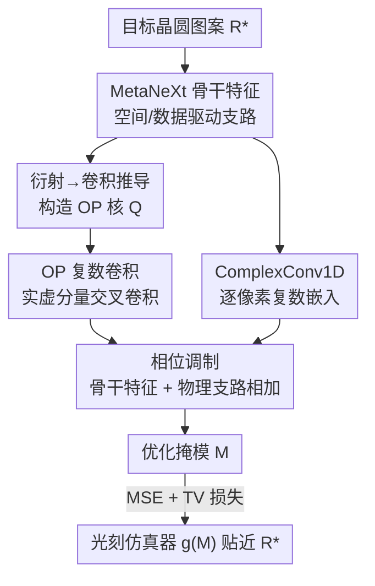

# Optical Diffraction-based Convolution for Semiconductor Lithography

**会议**: CVPR 2026  
**论文**: [CVF Open Access](https://openaccess.thecvf.com/content/CVPR2026/html/Son_Optical_Diffraction-based_Convolution_for_Semiconductor_Lithography_CVPR_2026_paper.html)  
**代码**: 无  
**领域**: 光学计算 / 计算光刻 / 物理先验网络  
**关键词**: 半导体光刻, 掩模优化, 光学衍射, 复数卷积, 相位调制

## 一句话总结
OptiCo 把瑞利-索末菲衍射积分推导成一次"复数卷积"，构造出编码光波相位变化的**光学相位（OP）核**直接嵌进 CNN，让网络在做光刻掩模优化时显式遵守衍射物理，在 LithoBench 的 OOD 子集上把 EPE 从同行的几十量级压到接近 0。

## 研究背景与动机
**领域现状**：光刻是半导体制造里最关键也最贵的一步（约占整体成本 30%），核心任务是**掩模优化**——给定希望印在晶圆上的目标图案 $R^*$，反求一张掩模 $M$，让它经过光学投影 + 光刻胶显影后得到的图案尽量贴近 $R^*$。由于真实跑光刻线极贵、解析建模又太复杂，业界转向"仿真 + 深度学习"的计算光刻：早期 GAN-OPC 用 GAN 直接学"目标晶圆图→掩模"的映射，DAMO 换上 UNet++ 提分辨率，后来 DOINN、CFNO 用傅里叶神经算子（FNO）在频域隐式建模衍射。

**现有痛点**：这些方法要么纯数据驱动（UNet++/CGAN），要么只是在**频域隐式**地碰到了衍射（FNO），都没有把光学衍射的物理原理显式写进网络结构里。后果是：当掩模图案偏离训练分布（OOD，而真实产线上的掩模天天偏离）时，模型泛化能力崩塌——衍射效应在短波长（如 EUV）下尤其剧烈，投影到晶圆上的图案会明显偏离设计意图，纯统计模型抓不住这种由物理支配的规律。

**核心矛盾**：传统卷积核只看**空间特征**，而光刻的本质是光在掩模透明/不透明区交界处发生**相位变化**后再传播成像——空间域的标准卷积根本没有"相位"这个自由度，于是物理被丢在了网络之外。

**本文目标**：把衍射物理（尤其是**相位因子**）显式塞进卷积运算本身，而不是当成外部正则或频域 trick。

**切入角度**：作者注意到一个数学事实——光从孔径平面传播到目标平面的**瑞利-索末菲（RS）衍射积分**，其形式恰好就是一个**卷积**（被积函数是输入光场与一个传播核的卷积）。既然衍射 = 卷积，那就可以把这个"传播核"直接当成 CNN 的卷积核来用。

**核心 idea**：用从衍射积分推导出来的**光学相位核**替换/增强普通卷积核，并在**复数域**做卷积来承载相位，使网络每一步卷积都内蕴光的物理传播。

## 方法详解

### 整体框架
OptiCo（Optical diffraction-based Convolutional neural network）的输入是目标晶圆图案、输出是优化后的掩模 $M$，整体仍是一个 encoder-decoder 形的 CNN，但把骨干里的关键层替换成了 **OptiCo Block**。一个 OptiCo Block 内部走两条并行支路再相加：一条是普通的 **MetaNeXt 骨干特征**（负责空间/数据驱动特征），另一条是**物理相位支路**——先把骨干特征用逐像素复数投影（ComplexConv1D）嵌入复数域，再与 **OP 复数卷积**的输出做 Hadamard 乘法完成相位调制，乘上衍射常数后加回骨干特征。最后整体用 MSE + TV 损失训练，TV 损失专门抑制掩模上的颗粒噪声、提升可制造性。

整条 pipeline 的衔接如下：

### 关键设计

**1. 把衍射积分改写成卷积，构造光学相位（OP）核**

这一步是全文的物理地基，针对"标准卷积没有相位自由度"的痛点。光场 $U$ 从孔径平面 $(x,y)$ 传播距离 $z$ 到目标平面 $(x',y')$ 的 RS 衍射积分（以 Fresnel 形式为例）为

$$U(x',y') = \frac{e^{jkz}}{j\lambda z}\iint_{-\infty}^{\infty} U(x,y)\, e^{\frac{jk}{2z}[(x'-x)^2+(y'-y)^2]}\,dx\,dy,$$

其中 $\lambda$ 是波长、$k=2\pi/\lambda$ 是波数。作者注意到这个积分把对 $(x'-x)$、$(y'-y)$ 的二次依赖项隔离出来后，正好就是卷积的定义 $(f * h)(x',y')=\iint f(x,y)h(x'-x,y'-y)\,dx\,dy$，于是衍射积分可写成 $U(x',y')=\frac{e^{jkz}}{j\lambda z}[U * h]$。这里的 $h$ 就是 **OP 核**，承载衍射的相位调制。不同 RS 形式给出不同核：Fresnel 形式 $h(x,y)=\exp\!\big(\frac{jk}{2z}(x^2+y^2)\big)$、Helmholtz–Kirchhoff、Green's 等。实现上对 $(N,N)$ 大小的核，以核中心为原点算出复指数 $Q(x,y)=\exp\!\big(\frac{jk}{2z}(x^2+y^2)\big)$，每个元素就是一个衍射相位项。框架是"公式无关"的（formulation-flexible）——默认用 Fresnel，但也能换成 Helmholtz/Green's，甚至光刻界标准的 Hopkins TCC 核。

**2. OP 复数卷积：让相位真正参与计算**

光场天然是复数，相位信息藏在虚部里，所以仅有实数核没法表达相位调制。作者把 OP 核 $Q$ 和一个可学习复权重 $W$ 组合成**有效核** $W_{\text{eff}}=Q\odot W$（逐元素乘），或更严格的标量缩放变体 $W_{\text{eff}}=\lambda_\alpha\cdot Q$（只用一个可学习标量去缩放纯物理核，物理保真度更高）。输入和有效核都拆成实虚部 $U=U_r+jU_i$、$W_{\text{eff}}=W_r+jW_i$，复数卷积按复数乘法展开：

$$\text{OPconv}(U)=\big(U_r * W_r - U_i * W_i\big) + j\big(U_r * W_i + U_i * W_r\big).$$

这样每一次卷积都内蕴了光的物理传播——区别于普通卷积只在实数空间域学统计相关，这里实虚部的交叉卷积显式地把相位偏移算了出来。消融（表 5）显示，哪怕只加上复数域建模，OOD 的 EPE 就从 22.6 降到个位数，证明"复数域承载相位"是性能的关键来源。

**3. OptiCo Block：物理支路与数据支路的融合**

针对"物理先验如何和强大的数据驱动骨干结合"，作者设计了双支路相加的 block。骨干用 MetaNeXt 风格的残差块

$$Y_{\text{backbone}}(U)=\big(\text{DWConv}(\text{Norm}(U_r)W_1)\odot\sigma(\text{Norm}(U_r)W_2)\big)W_3 + U_r,$$

负责空间特征。由于 OP 卷积是复数运算，先用逐像素的 **ComplexConv1D** 把骨干特征 $x_{pq}\in\mathbb{R}^C$ 投影进复数域：$\text{CConv1D}(x_{pq})=(x_{pq,r}V_r-x_{pq,i}V_i)+j(x_{pq,r}V_i+x_{pq,i}V_r)$，其中 $V_r,V_i$ 是可学习投影矩阵，作用是给每个像素的通道向量做复数嵌入，使其能与 OP 核交互。随后用 Hadamard 积完成相位调制，乘上衍射常数 $\frac{e^{jkz}}{j\lambda z}$，再加回骨干特征：

$$Y_{\text{phase}}(U)=\frac{e^{jkz}}{j\lambda z}\big[\text{CConv1D}(Y_{\text{backbone}}(U))\odot \text{OPconv}(U)\big],\quad Y_{\text{OptiCo}}=Y_{\text{backbone}}(U)+Y_{\text{phase}}(U).$$

消融表明那个看似不起眼的衍射常数 $\frac{e^{jkz}}{j\lambda z}$（论文称 Multiply Constants, MC）是保持衍射公式完整性的必需项，去掉它性能大跌——说明它们把物理公式"原封不动"地搬进网络这件事做得很认真。

### 损失函数 / 训练策略
主损失是掩模优化后经光刻仿真器 $g(\cdot)$ 得到的抗蚀图与目标的 MSE：$L_{\text{mse}}(M)=\|g(M)-R^*\|^2$。为提升掩模可制造性、抑制颗粒状高频噪声，额外加 2D 全变分（TV）正则：

$$L_{\text{tv}}(M)=\sum_{p,q}\big|M_{p+1,q}-M_{p,q}\big|+\big|M_{p,q+1}-M_{p,q}\big|,$$

它惩罚相邻像素的突变、鼓励掩模空间平滑。最终目标为 $L_{\text{final}}(M)=L_{\text{mse}}(M)+\lambda_{\text{tv}}L_{\text{tv}}(M)$，$\lambda_{\text{tv}}$ 控制正则强度。

## 实验关键数据

数据集用 LithoBench（10 万+ 布局 tile，分辨率 $2048\times2048$、每像素代表 $1\text{nm}^2$），含两个合成集 MetalSet/ViaSet 和两个真实世界 OOD 集 StdMetal/StdContact。掩模优化用 MSE、EPE（边缘放置误差违规）、PVB（工艺变化带面积）三个指标，均越低越好。

### 主实验（掩模优化，Average 列，越低越好）

| 方法 | MSE | PVB | EPE |
|------|-----|-----|-----|
| DAMO | 26056 | 27651 | 8.1 |
| DOINN | 34691 | 23370 | 16.9 |
| CFNO | 38578 | 25196 | 18.0 |
| ILILT（前 SOTA） | 22143 | 31064 | 2.6 |
| **OptiCo** | **14535** | 29373 | **0.4** |

最能说明问题的是 OOD 子集：StdContact 上多数方法 EPE 飙到 26~56，而 OptiCo 仅 **0.1**；StdMetal 上 OptiCo EPE 为 **0.0**，平均 EPE（0.4）大幅领先此前最强的 ILILT（2.6）。光刻仿真任务（表 2）OptiCo 在 MSE/IoU 上同样全面领先（平均 MSE_resist 6.38e-4、IoU 0.96）。

### 消融实验

| 配置 | StdMetal EPE | StdContact EPE | 说明 |
|------|------|------|------|
| w/o kernel（无 OP 核） | 2.819 | 22.612 | 退化为纯骨干 |
| 仅 ComplexConv1D（CC） | 0.657 | 7.491 | 只加复数域嵌入就大降 |
| 仅 OP 复数卷积（OP） | 1.561 | 6.321 | 单独物理核也有效 |
| OP + MC（衍射常数） | 0.188 | 1.273 | 补全衍射公式常数项 |
| **OP + MC + CC（完整）** | **0.044** | **0.079** | 完整 OptiCo Block |

另有 OP 核公式选择的消融（表 3，标准 $W_{\text{eff}}=Q\odot W$）：相对 w/o kernel（StdContact EPE 22.6），Fresnel（0.079）与 Green's（0.188）这类轻量公式最好，说明简单公式更易与网络融合；而在严格变体 $W_{\text{eff}}=\lambda_\alpha Q$ 下（表 4），光刻界标准的 Hopkins TCC 核反而最优（StdContact 0.212），印证框架与高保真物理模型对齐良好。

### 关键发现
- **复数域 + 衍射常数是性能命门**：从 w/o kernel 到完整 block，StdContact EPE 从 22.6 一路降到 0.079；其中"补全衍射常数 MC"和"复数嵌入 CC"各自都带来数量级提升，说明把物理公式**完整、忠实**地搬进网络比只搬一部分重要得多。
- **物理先验 = OOD 泛化**：在分布内（ViaSet）几乎所有方法 EPE 都接近 0，差距全在 OOD 上拉开——显式衍射建模本质上是给网络注入了不依赖训练分布的物理引导。
- **公式选择有讲究**：标准变体下轻量 Fresnel/Green's 更好（易训练）；严格标量变体下高保真 Hopkins 更好。核太小则感受野不足以覆盖衍射、太大则二次相位项 $(x^2+y^2)$ 变化过陡反而难训练，存在最优核尺寸 ⚠️（具体数值在附录 B.5，正文未给）。

## 亮点与洞察
- **"衍射 = 卷积"的等价改写非常优雅**：作者没有发明新算子，而是发现 RS 衍射积分天然是卷积形式，于是把物理核直接当 CNN 核用——这种"物理本来就长成网络的样子"的洞察可复用到任何由传播积分支配的成像问题（声学、超声、光场成像）。
- **物理保真度可调的两档设计**：$W_{\text{eff}}=Q\odot W$（更灵活、可学）vs $W_{\text{eff}}=\lambda_\alpha Q$（更严格、纯物理只缩放），相当于给"数据驱动 ↔ 物理约束"提供了一个旋钮，且实验显示两档各有最佳匹配的衍射公式。
- **复数卷积承载相位**这套实虚部交叉卷积 + 逐像素复数嵌入的写法，是把"物理量是复数"翻译成网络可计算形式的标准范式，可迁移到任何需要建模相位/波动的任务。

## 局限与展望
- 方法强绑定 LithoBench 的设定（固定分辨率、特定光刻胶模型），是否能直接迁移到真实 EUV 产线的多重曝光、3D 掩模等更复杂场景未充分验证（TEMPO 处理的 3D 掩模这里没正面对比）。
- OP 核里距离 $z$、波长 $\lambda$ 等物理参数如何设定/是否学习，正文交代不多 ⚠️（以原文及附录为准），现实中这些参数随工艺节点变化，参数失配时鲁棒性存疑。
- 复数卷积 + 双支路相比纯 FNO 的计算开销/推理速度未给量化对比，工程落地的成本未知。
- 核尺寸的最优值是个超参，二次相位项导致大核难训练，意味着对更大感受野的衍射场景可能需要额外技巧。

## 相关工作与启发
- **vs DOINN / CFNO（FNO 系）**：它们在**频域隐式**建模衍射（傅里叶变换 + MLP 嵌入再与 CNN 局部特征拼接），OptiCo 则在**空间域显式**把衍射核写进卷积；论文用"把 OptiCo block 换成 FNO"的对照（图 3）证明显式物理建模优于隐式频域建模。
- **vs ILILT**：ILILT 把反向光刻技术（ILT）迭代地嵌进学习过程、是此前 SOTA，但物理是以"迭代喂仿真抗蚀图"的间接方式引入；OptiCo 通过 OP 核把物理直接写进核运算，平均 EPE 0.4 vs 2.6 显著更优。
- **vs DAMO（纯数据驱动 UNet++）**：DAMO 完全靠数据学映射、无物理先验，OOD 上 EPE 崩到 8.1+；对比凸显"物理先验主要买的是泛化"这一结论。
- **vs Nitho**：Nitho 用受光学核回归启发的坐标式复数 MLP 做光刻仿真，仍是间接物理；OptiCo 把物理放进架构与核运算本身，仿真任务上也更强。

## 评分
- 新颖性: ⭐⭐⭐⭐⭐ 首个把光学衍射原理显式嵌入卷积核运算的 CNN，"衍射=卷积"的改写干净有力。
- 实验充分度: ⭐⭐⭐⭐ LithoBench 主任务 + 仿真 + 多组细致消融（公式/组件/核尺寸），但缺真实产线与计算开销对比。
- 写作质量: ⭐⭐⭐⭐ 物理推导清晰、动机层层递进；部分关键参数设定散落附录。
- 价值: ⭐⭐⭐⭐⭐ 计算光刻里 OOD 泛化是刚需，物理先验把 OOD EPE 压到接近 0，对实际制造意义大。

<!-- RELATED:START -->

## 相关论文

- [\[ICCV 2025\] Recover Biological Structure from Sparse-View Diffraction Images with Neural Volumetric Prior](../../ICCV2025/others/recover_biological_structure_from_sparse-view_diffraction_images_with_neural_vol.md)
- [\[CVPR 2025\] SDF-Net: Structure-Aware Disentangled Feature Learning for Optical–SAR Ship Re-Identification](../../CVPR2025/others/sdf-net_structure-aware_disentangled_feature_learning_for_opticall-sar_ship_re-i.md)
- [\[CVPR 2026\] Neural Differentiation in Deep Networks: A Theoretical Framework for Expressivity and Representational Diversity](neural_differentiation_in_deep_networks_a_theoretical_framework_for_expressivity.md)
- [\[CVPR 2026\] Electromagnetic Inverse Scattering from a Single Transmitter](electromagnetic_inverse_scattering_from_a_single_transmitter.md)
- [\[CVPR 2026\] Temporal Interaction in Spiking Transformers with Multi-Delay Mixer](temporal_interaction_in_spiking_transformers_with_multi-delay_mixer.md)

<!-- RELATED:END -->
