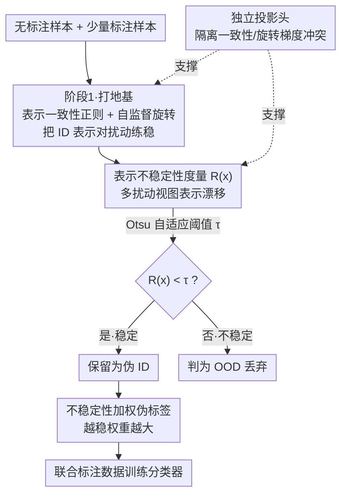

# PAF: Perturbation-Aware Filtering for Open-Set Semi-Supervised Learning

**会议**: CVPR 2026  
**论文**: [CVF Open Access](https://openaccess.thecvf.com/content/CVPR2026/html/Han_PAF_Perturbation-Aware_Filtering_for_Open-Set_Semi-Supervised_Learning_CVPR_2026_paper.html)  
**代码**: https://github.com/njustkmg/CVPR26-PAF  
**领域**: 开集半监督学习  
**关键词**: 开集半监督, OOD检测, 表示不稳定性, 扰动感知, 自适应阈值

## 一句话总结
PAF 发现 OOD 样本在"语义保持扰动"下的**表示**波动远大于 ID 样本，把这种表示级不稳定性做成一个 Otsu 自适应阈值的动态过滤器，配上两阶段训练把不稳定样本筛掉并按稳定度加权伪标签，在四个开集半监督基准上分类精度和 OOD 检测 AUC 都刷到新 SOTA。

## 研究背景与动机

**领域现状**：半监督学习（SSL）靠少量标注 + 大量无标注数据逼近全监督性能，主流是一致性正则和伪标签两条路。但传统 SSL 默认无标注集和标注集**类别分布一致**——这在现实里几乎不成立，真实无标注数据里常混进训练时没见过的新类，即分布外（OOD）样本。开集半监督（OSSL）就是要在无标注数据里既学好已知类分类器，又把 OOD 样本识别并过滤掉，否则它们会污染伪标签、扭曲决策边界。

**现有痛点**：现有 OSSL 方法识别 OOD 的手段大体三类——一致性正则配 One-vs-All 边界（OpenMatch）、给标签空间加一个"未知类"吸收 OOD（IOMatch）、或用证据/贝叶斯建模把低置信样本判为未知（ANEDL）。它们都有一个共同的盲区：**只看单视图预测的置信度，没有利用 ID 与 OOD 样本在被扰动时表现出的不同敏感性**。

**核心矛盾**：已有工作（confidence mutation）注意到 OOD 样本在语义保持扰动下最大 softmax 概率会剧烈抖动、ID 样本相对稳定，于是用"置信度波动"来检测 OOD。但**置信度只是表示不稳定性的浅层投影**：表示变化小一定保证置信度变化小，反过来却不成立（置信度稳不代表内部表示稳）。本文的预实验（Figure 1）量化了这点——用置信度突变区分 ID/OOD 的分离度只有 0.0462，而直接用表示不稳定性的分离度高达 0.1386，差了近 3 倍。

**核心 idea**：把过滤信号从"置信度波动"下沉到"**表示级不稳定性**"——度量样本在多次语义保持扰动下倒数第二层表示的平均漂移量，漂移大的判为 OOD 过滤掉，漂移小的判为 ID 保留并训练。再用一套两阶段框架先把 ID 表示练稳，再用 PAF 动态清洗无标注数据。

## 方法详解

### 整体框架

PAF 的目标是在无标注集 $D_u$（混有 ID 和 OOD）里可靠地把 ID 子集挑出来训练。整体是一个**两阶段**流程：第一阶段是"打地基"——用标注数据做监督分类，同时用表示一致性正则把 ID 表示对扰动练稳、用自监督旋转预测任务给骨干网络补语义结构；第二阶段才"动刀"——周期性地用 PAF 度量每个无标注样本的表示不稳定性，Otsu 阈值自适应切出 ID 子集，再用"按稳定度加权的伪标签"把这批伪 ID 样本和标注数据联合训练。骨干用 WideResNet28-2，为防止一致性目标（拉近同图不同视图）和旋转目标（推开不同朝向）梯度打架，两个任务各配独立的投影头。

### 关键设计

**1. 表示不稳定性度量 + Otsu 自适应过滤：把过滤信号从置信度下沉到表示空间**

这是 PAF 的核心，针对"置信度只是浅层信号、抓不住细微表示变化"的痛点。给定无标注样本 $\mathbf{x}^u$，先用语义保持扰动算子 $A$（弱增广，如翻转、轻微色彩抖动）生成 $K_a$ 个扰动视图，记 $\varphi(\cdot)$ 为骨干表示、$\phi_{\text{con}}(\cdot)$ 为一致性投影头，表示不稳定性定义为原视图与各扰动视图在投影空间的平均 $\ell_2$ 平方距离：

$$R(\mathbf{x}^u) = \frac{1}{K_a d}\sum_{k=1}^{K_a} \left\| \phi_{\text{con}}\bigl(\varphi(\mathbf{x}^u)\bigr) - \phi_{\text{con}}\bigl(\varphi(\mathbf{x}^u_{(k)})\bigr) \right\|_2^{2}$$

其中 $d$ 是表示维度，$\mathbf{x}^u_{(k)}$ 是第 $k$ 个扰动视图（实践中为效率取 $K_a=1$ 就够）。拿到一个 batch 的不稳定性分布后，**不设固定阈值**，而是用 Otsu 准则（经典图像二值化里的类间方差最大化）自动求一个自适应阈值 $\tau$，把无标注集切成 ID 与 OOD 两半：$\mathcal{X}_u^{\text{ID}} = \{\mathbf{x}^u \mid R(\mathbf{x}^u) < \tau\}$，$\mathcal{X}_u^{\text{OOD}} = \{\mathbf{x}^u \mid R(\mathbf{x}^u) \ge \tau\}$。为什么有效：作者从 Lipschitz-margin 角度证明，扰动诱导的预测方差随决策间隔 $m(\mathbf{x})$ **指数级衰减**（$\mathrm{Var}_\delta[s(\mathbf{x}+\delta)] \le \beta^2(K-1)^2 e^{-2m(\mathbf{x})}\sigma^2$）——ID 样本间隔大、天然稳定，OOD/边界样本间隔小、对扰动高度敏感；又证明 $|s(\mathbf{x})-s(\mathbf{x}')| \le \beta(K-1)e^{-m(\mathbf{x})}\|\varphi(\mathbf{x})-\varphi(\mathbf{x}')\|_2$，即"表示变化小 ⇒ 置信度变化小，反之不成立"，所以**直接检测表示不稳定性是更严格的判据**。

**2. 两阶段框架 + 表示一致性正则 + 自监督旋转：先把表示练稳，PAF 才有意义**

PAF 靠"表示稳不稳"区分 ID/OOD，前提是骨干学到的表示对语义保持扰动本身得是**稳定且有判别力**的，否则度量出来全是噪声。所以第一阶段先打地基：表示一致性正则对同一图生成两个弱增广视图 $\mathbf{x}', \mathbf{x}''$，最小化它们在投影空间的均方差 $\mathcal{L}_{\text{con}} = \frac{1}{d|\mathcal{D}_l|}\sum_{\mathbf{x}\in\mathcal{D}_l}\|\phi_{\text{con}}(\varphi(\mathbf{x}')) - \phi_{\text{con}}(\varphi(\mathbf{x}''))\|_2^{2}$，把 ID 表示对扰动"锚"稳。但标注数据太少，骨干语义不够丰富，于是引入辅助自监督旋转预测：每张图随机旋转 $\{0°, 90°, 180°, 270°\}$ 之一让模型预测角度，损失 $\mathcal{L}_{\text{rot}}$ 是 4 类交叉熵，作用于全部样本（标注+无标注）——识别旋转角度需要理解图像的高层语义结构，相当于免费给骨干补一层语义。第一阶段总损失 $\mathcal{L} = \mathcal{L}_{\text{ce}} + \mathcal{L}_{\text{con}} + \mathcal{L}_{\text{rot}}$。这套"先练稳、再过滤"的解耦比一上来就过滤要稳健得多，因为早期表示不可靠时贸然过滤会把好样本误删。

**3. 不稳定性加权伪标签：让"既自信又稳定"的样本主导决策边界**

PAF 切出 ID 子集 $\mathcal{X}_u^{\text{ID}}$ 后，怎么用？最朴素的做法（UDA）对所有伪 ID 样本一视同仁，但即便都过了阈值，稳定度仍有高低之分。本文设计了不稳定性加权伪标签损失，给每个样本生成弱增广视图 $\mathbf{x}^w$ 和强增广视图 $\mathbf{x}^s$，软预测分别为 $p^w, p^s$，并把样本的归一化不稳定性 $\hat{\delta}(\mathbf{x}^u)$（min-max 归一化到 $[0,1]$）转成权重：

$$\mathcal{L}_{\text{u}} = \frac{1}{|\mathcal{X}_u^{\text{ID}}|}\sum_{\mathbf{x}^u \in \mathcal{X}_u^{\text{ID}}} \bigl(1 - \hat{\delta}(\mathbf{x}^u)\bigr)\,\mathds{1}\bigl[\max(p^w) \ge \alpha\bigr]\,\mathrm{KL}\bigl(p^w \,\|\, p^s\bigr)$$

越稳定（$\hat{\delta}\to 0$）权重 $(1-\hat\delta)$ 越接近 1，越不稳定的样本被自动压低甚至丢弃；指示函数 $\mathds{1}[\max(p^w)\ge\alpha]$ 再卡一道置信度门槛 $\alpha$。这样**"既自信又稳定"的样本才驱动决策边界**，把伪标签学习和表示一致性判据紧紧耦合在一起。第二阶段总损失 $\mathcal{L} = \mathcal{L}_{\text{ce}} + \mathcal{L}_{\text{u}} + \mathcal{L}_{\text{con}} + \mathcal{L}_{\text{rot}}$，且每 20 个 epoch 才重新用 PAF 过滤一次 ID 子集。

**4. 独立投影头：隔离一致性与旋转的梯度冲突**

这是个不起眼但消融里掉点最狠的设计。一致性正则要把同一图不同扰动视图的表示**拉近**，而旋转预测要把不同朝向**推开**到不同子空间——两个目标方向相反，若共享同一投影空间，梯度常常对冲。所以作者给自监督分支和一致性分支各配一个专用投影头（连同分类头），让它们映射到各自子空间、保证独立的梯度流。去掉这个隔离，CIFAR-100 上精度暴跌近 16%（77.7→61.8），是所有消融里最大的一项——说明在多任务自监督框架里，**任务间的梯度干扰是实打实的隐患**。

## 实验关键数据

### 主实验

内部 OOD 场景（OOD 来自同数据集的未见类）下，已知类分类精度（%），mismatch ratio 0.3/0.6：

| 数据集 | mismatch | 本文 | BDMatch | SCOMatch | OpenMatch |
|--------|----------|------|---------|----------|-----------|
| MNIST | 0.3 | **99.4** | 99.1 | 99.0 | 97.8 |
| CIFAR-10 | 0.3 | **93.1** | 92.5 | 92.2 | 88.2 |
| CIFAR-100 | 0.3 | **77.7** | 75.9 | 75.3 | 68.7 |
| TinyImageNet | 0.3 | **58.1** | 56.7 | 54.2 | 37.9 |
| TinyImageNet | 0.6 | **54.6** | 52.9 | 52.3 | 37.0 |

OOD 类识别 AUC（%），提升幅度在难数据集上尤其大：

| 数据集 | mismatch | 本文 | ProSub | OSP |
|--------|----------|------|--------|-----|
| CIFAR-10 | 0.3 | **96.1** | 89.1 | 88.3 |
| CIFAR-100 | 0.3 | **84.5** | 73.2 | 71.8 |
| TinyImageNet | 0.3 | **64.8** | 56.2 | 54.4 |

CIFAR-100 上 AUC 从 73.2 直接拉到 84.5（+11.3），TinyImageNet +8.6，说明**任务越难、ID/OOD 越难分时，表示级信号的优势越明显**。外部 OOD 场景（CIFAR-10 + TinyImageNet/LSUN/高斯噪声/均匀噪声）下本文同样全面领先，对合成噪声这类剧烈分布偏移也鲁棒。此外把 PAF 插进 CLIP 驱动的细粒度 OSSL 框架 CFSG-CLIP，CUB-200 上精度 84.73→85.16，证明它在视觉-语言框架里也能提供文本语义之外的互补线索。

### 消融实验

CIFAR-100，mismatch 0.3：

| 配置 | Acc | AUC | 说明 |
|------|-----|-----|------|
| Full PAF | 77.7 | 84.5 | 完整模型 |
| w/o 表示过滤(PAF) | 71.2 | 74.8 | 去掉核心过滤，精度 -6.5 |
| w/o 独立投影头 | 61.8 | 70.2 | **梯度冲突，精度暴跌 -15.9** |
| w/o 一致性损失 | 75.1 | 81.3 | 表示不再练稳，-2.6 |
| w/o 旋转损失 | 75.6 | 81.2 | 语义结构变弱，-2.1 |
| 置信度过滤 | 74.5 | 78.2 | 换回浅层信号，AUC -6.3 |

### 关键发现

- **独立投影头贡献最大**：去掉它精度掉 15.9 个点，远超去掉 PAF 本身——多任务自监督框架里梯度对冲是被严重低估的隐患。
- **表示过滤完胜置信度过滤**：同一框架下把过滤信号换成置信度，AUC 从 84.5 掉到 78.2；ID 样本保留率领先 +9.9%、OOD 过滤率领先 +12.2%，与理论分析（表示判据更严格）一致。
- **$K_a=1$ 即可**：增大扰动次数 $K_a$ 只带来边际 AUC 提升，但计算量线性上涨，取 1 是性能-效率最佳折中。Otsu 阈值在缩放因子 $\gamma\in[0.85,1.10]$ 内稳定，且优于固定阈值 $F(0.3/0.4)$ 和百分位阈值 $P(30/40)$。
- **更省**：PAF 训练 23.1 小时 / 5.4GB 显存，比 T2T（29.3h）和 SCOMatch（28.6h）都快，过滤本身几乎零额外开销。

## 亮点与洞察
- **"置信度是表示不稳定性的浅层投影"这个洞察很扎实**：作者没停留在经验观察，而是用 Lipschitz-margin 框架给出"表示变化小⇒置信度变化小、反之不成立"的不等式，把"为什么要看表示而不是置信度"从直觉变成可证的判据，这是全文最有说服力的地方。
- **把 Otsu 阈值搬进深度学习过滤很巧**：避免了手调过滤阈值这个老大难，用经典图像二值化的类间方差最大化自动适配每个 batch 的不稳定性分布，免参数且对缩放鲁棒，可以直接迁移到任何"需要动态二分阈值"的场景（如主动学习的样本选择、噪声标签过滤）。
- **梯度冲突的发现有普适价值**：一致性（拉近）与旋转（推开）目标天然对立、共享投影头会对冲，这个观察对所有"一致性 + 旋转/拼图等自监督"的多任务框架都是提醒，独立投影头是个低成本高收益的通用补丁。
- **表示不稳定性可作为通用 OOD 信号**：插进 CFSG-CLIP 也涨点，说明这个信号和具体框架解耦，可迁移到开集识别、OOD 检测等更广的任务。

## 局限与展望
- **扰动算子的选择没系统消融**：方法依赖"语义保持扰动"，但论文只用了翻转 + 轻色彩抖动这类弱增广，不同扰动类型/强度对不稳定性度量的影响、以及"语义保持"边界在哪里，缺乏定量分析——扰动太弱信号不足、太强会破坏语义，这个 trade-off 没讲透。
- **理论假设的现实贴合度**：Lipschitz-margin 分析建立在"每个 logit 是 $\beta$-Lipschitz"的假设上，论文称补充材料里有经验验证，但 $\beta$ 在训练中如何变化、深网络上假设是否一直成立，正文没展开。
- **细粒度/大规模场景验证有限**：主实验集中在 MNIST/CIFAR/TinyImageNet，CLIP 细粒度只测了 CUB-200 一个数据集且提升较小（+0.43）；在 ImageNet 规模或 OOD 与 ID 语义高度接近的细粒度场景下，表示不稳定性的分离度能否保持，还需更多验证。
- **第二阶段每 20 epoch 才过滤一次**：过滤频率是个超参，过滤太频繁开销大、太稀疏 ID 子集滞后，论文没分析这个频率的敏感性。

## 相关工作与启发
- **vs confidence mutation [48]**：两者都利用"扰动下 OOD 比 ID 更不稳定"的现象，但前者测最大置信度的波动（浅层信号），本文测倒数第二层表示的漂移（深层信号），并证明表示判据更严格——消融里同框架下表示过滤 AUC 高出 6.3 个点。
- **vs OpenMatch [29] / IOMatch [23]**：它们靠 One-vs-All 边界或"未知类"吸收 OOD，本质是静态的单视图置信度建模；本文是动态的、利用扰动敏感性的过滤，AUC 在 CIFAR-100 上领先 OpenMatch 近 16 个点。
- **vs UDA [39]**：本文的伪标签损失是 UDA 的加权扩展——UDA 对所有无标注样本等权，本文用 $(1-\hat\delta)$ 按表示稳定度调制贡献，让稳定样本主导边界。
- **vs Otsu 阈值法 [27]**：把图像二值化的经典准则迁移来做无标注样本的动态二分，是个跨领域复用的好例子，免参数、对缩放鲁棒。

## 评分
- 新颖性: ⭐⭐⭐⭐ 把过滤信号从置信度下沉到表示空间并配 Lipschitz-margin 理论支撑，角度清晰、动机扎实，虽建立在已有的 confidence mutation 观察之上。
- 实验充分度: ⭐⭐⭐⭐ 四个基准 + 内/外 OOD + CLIP 细粒度，消融完整且揭示了梯度冲突这一关键点，但扰动类型和过滤频率的敏感性缺位。
- 写作质量: ⭐⭐⭐⭐ 动机-观察-理论-方法的逻辑链顺畅，Figure 1 的分离度对比很有说服力。
- 价值: ⭐⭐⭐⭐ 表示不稳定性信号与 Otsu 动态阈值都可迁移到 OOD 检测、噪声过滤等更广任务，且训练更省。

<!-- RELATED:START -->

## 相关论文

- [\[AAAI 2026\] Sampling Control for Imbalanced Calibration in Semi-Supervised Learning](../../AAAI2026/others/sampling_control_for_imbalanced_calibration_in_semi-supervised_learning.md)
- [\[CVPR 2026\] Back to Source: Open-Set Continual Test-Time Adaptation via Domain Compensation](back_to_source_open-set_continual_test-time_adaptation_via_domain_compensation.md)
- [\[ECCV 2024\] Bidirectional Uncertainty-Based Active Learning for Open-Set Annotation](../../ECCV2024/others/bidirectional_uncertainty-based_active_learning_for_open-set_annotation.md)
- [\[CVPR 2026\] Event Stream Filtering via Probability Flux Estimation](event_stream_filtering_via_probability_flux_estimation.md)
- [\[CVPR 2026\] HAD: Heterogeneity-Aware Distillation for Lifelong Heterogeneous Learning](had_heterogeneity-aware_distillation_for_lifelong_heterogeneous_learning.md)

<!-- RELATED:END -->
