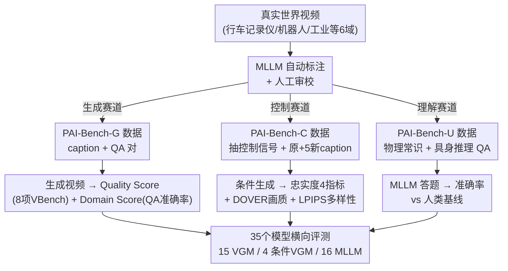

# PAI-Bench: A Comprehensive Benchmark For Physical AI

**会议**: CVPR 2026  
**论文**: [CVF Open Access](https://openaccess.thecvf.com/content/CVPR2026/html/Zhou_PAI-Bench_A_Comprehensive_Benchmark_For_Physical_AI_CVPR_2026_paper.html)  
**代码**: https://github.com/SHI-Labs/physical-ai-bench (有)  
**领域**: 物理AI / 视频生成评测 / 多模态理解 / Benchmark  
**关键词**: Physical AI、视频生成、世界模型、条件视频生成、视频理解

## 一句话总结
PAI-Bench 把"物理 AI"拆成感知和预测两条能力线、再落到视频生成 / 条件视频生成 / 视频理解三个赛道，用 2,808 个真实世界样例配上任务对齐的物理合理性指标，系统评测了 15 个视频生成模型、4 个可控生成模型和 16 个多模态大模型，发现它们画面好看却普遍学不会物理规律、理解能力也远落后于人类。

## 研究背景与动机

**领域现状**：物理 AI（Physical AI）的目标是让模型"感知并预测真实世界的动态"，再据此行动。论文把这个目标拆成两个底层能力——**感知**（理解视觉信号里发生了什么）和**预测**（基于现状推演下一步物理状态）。当下社区里，多模态大模型（MLLM）被寄望于承担感知，视频生成模型（VGM）被视为隐式学习物理规律、承担预测的最有希望路线。

**现有痛点**：但现有评测和真实需求脱节。MLLM 主要在抽象推理（OCR、数学题）和日常感知这类基准上被验证，在专门的物理 AI 场景里到底行不行没人知道；VGM 的现有基准又几乎只盯着画面美学和时序一致性，很少问"它到底懂不懂真实世界的规则"。更糟的是这些基准彼此割裂——要么只测预测、要么只测感知，没有一个统一框架专门面向物理 AI。

**核心矛盾**：评测"看起来对不对"和评测"物理上对不对"是两回事。一个视频可以画质极高却违反基本物理定律；一道题可以靠语言先验或单帧静态信息蒙对，根本不需要理解时序动态。现有指标抓住了前者、漏掉了后者，于是模型的物理能力被系统性高估。

**本文目标**：造一个统一、全面、扎根真实数据的物理 AI 基准，同时覆盖感知与预测，并配上能真正区分"物理合理性"而非"画面好看"的任务对齐指标。

**切入角度**：作者坚持一条统一设计原则——**所有评测都建立在物理上有意义的任务和真实世界数据之上**（视频全部来自真实采集，如行车记录仪），再覆盖自动驾驶、机器人、第一视角、工业、人体动作、物理常识等多个子域。

**核心 idea**：用"感知 / 预测"两条能力线映射到"视频理解（U）/ 视频生成（G）/ 条件视频生成（C）"三个赛道，每个赛道单独设计任务对齐的物理指标，把"画质"和"物理合理性"两个维度拆开来打分。

## 方法详解

PAI-Bench 是一个评测基准，它的"方法"就是**数据如何构建**加上**每个赛道用什么指标评**。整体结构是一棵两层树：顶层是感知 vs 预测两条能力线，中层落成 G/C/U 三个赛道，每个赛道有自己的真实视频数据、标注流程和物理指标，最后汇总成对 35 个模型的横向评测。

### 整体框架

PAI-Bench 共 2,808 个真实世界样例，分三个赛道：

- **PAI-Bench-G（视频生成）**：考预测能力。给定文本 caption，让 VGM 生成视频，再用两个维度打分——Quality Score 看画质保真度、Domain Score 看物理合理性。数据为 1,044 个视频-prompt 对 + 5,636 条 QA，覆盖 6 个域。
- **PAI-Bench-C（条件视频生成）**：进一步考预测，但加上控制信号（模糊 / 边缘 / 深度 / 分割），考的是生成结果对控制信号的**忠实度**。600 个视频，分别从 AgiBot、OpenDV、Ego-Exo-4D 各采 200 个。
- **PAI-Bench-U（视频理解）**：考感知能力，让 MLLM 回答物理相关的视频问答。拆成"物理常识推理"和"具身推理"两类能力。

三个赛道共享统一原则：真实数据 + 物理意义任务。下图给出从数据采集到模型评测的整条管线：

### 关键设计

**1. PAI-Bench-G：把"画质"和"物理合理性"拆成两套独立指标**

VGM 评测最大的陷阱是画质和物理合理性被混为一谈——模型画面越来越精美，于是被默认"懂物理"，但二者并不等价。PAI-Bench-G 因此把生成视频拆成两个正交维度打分。**Quality Score** 直接复用 VBench / VBench++ 的 8 个指标（主体一致性、背景一致性、运动平滑度、美学质量、成像质量、整体一致性，以及图生视频的主体 / 背景两项），衡量画面本身好不好、和文本对不对得上。**Domain Score** 才是物理合理性的关键创新：作者先用 Qwen2.5-VL-72B 给真实视频生成高保真 caption（再人工校正），又基于一套本体（ontology）生成 QA 对（候选由 MLLM 出、人工精修），然后用 Qwen3-VL-235B-A22B 当裁判，拿这些 QA 去"盘问"生成的视频——Domain Score 就定义为裁判在这批 QA 上的回答准确率，本质是把"视频有没有遵守它该遵守的物理 / 语义约束"量化成一个问答得分。这样画质再高、但物理细节经不起 QA 追问的视频，Domain Score 就会掉下来。

**2. PAI-Bench-C：用四种模态忠实度 + 多样性量化"对控制信号的服从"**

可控生成的价值在于人能通过控制信号约束 VGM 的解空间，但"生成视频到底有多忠实于控制信号"一直缺乏细粒度度量。PAI-Bench-C 给出三条评判准则——对控制信号的忠实度、画质、同配置下结果的多样性——并各配指标。忠实度用一套"投影回模态空间再比相似度"的思路：把生成视频用对应工具（Blur Kernel、Canny、Video Depth Anything、GroundingDINO+SAM2）投影回模糊 / 边缘 / 深度 / 分割空间，再和 ground-truth 控制信号比，得到 **Blur SSIM、Edge F1、Depth si-RMSE、Mask mIoU** 四个指标。画质用 DOVER，多样性用 LPIPS。为了能测多样性，作者对每个视频不仅写一条对应原视频的 caption，还让 MLLM 改写出 5 条"连贯但新颖"的 caption（替换画面主导物体、再人工精修），这样同一组控制信号下应当生成多样而非雷同的结果。控制信号本身分 Blur / Edge / Depth / Seg / All（全部等权组合）五种设置。

**3. PAI-Bench-U：用"物理常识 + 具身推理"双能力本体，并做无偏性设计**

MLLM 的物理感知评测容易被两类偏差污染：模型靠语言先验直接蒙答案（不看画面）、或靠单帧静态信息答题（不需要时序）。PAI-Bench-U 一方面用一套清晰本体定义要考什么：**物理常识推理**分 Space（物体关系 / 空间可行性 / 场景构成）、Time（事件时间戳 / 顺序 / 因果）、Physical World（物理原理 / 物体属性 / 违反物理的情形）三个域，共 604 条 QA / 426 个视频；**具身推理**分"预测动作效果"（任务完成判定 + 下一步合理动作预测）和"遵守物理约束"（动作可供性，即某动作可行 / 稳定 / 安全与否），从 RoboVQA、RoboFail、BridgeData、AgiBot、HoloAssist 和一个专有 AV 数据集采 601 视频 / 610 QA。另一方面作者主动验证无偏性——用 0 帧、1 帧、32 帧分别测：0 帧（纯文本）时性能掉回随机猜水平，说明语言先验被有效中和；1 帧到 32 帧间有明显性能跃升，说明题目确实需要时序信息才能答，而非单帧可解。

### 损失函数 / 训练策略
不涉及。PAI-Bench 是纯评测基准，不训练模型，全部为"零样本"评测被测模型（VGM / MLLM 用各自默认配置生成或答题）。

## 实验关键数据

作者评测了 15 个 VGM、4 个条件 VGM（5 种控制设置）、16 个 MLLM。

### 主实验

PAI-Bench-G：画质（Quality）普遍接近真实视频，但物理合理性（Domain）有明显差距；闭源 Veo3 和最强开源模型几乎打平。

| 模型 | 总分 | Domain Avg | Quality Avg |
|------|------|-----------|-------------|
| Source Videos（真实视频上限） | 83.9 | 89.8 | 78.0 |
| Veo3（闭源） | 82.2 | 86.8 | 77.6 |
| Wan2.2-I2V-A14B（最强开源） | 82.3 | 87.1 | 77.5 |
| Cosmos-Predict2.5-2B | 81.4 | 84.9 | 78.0 |
| DynamicCrafter（垫底） | 68.3 | 63.0 | 73.7 |

PAI-Bench-U：所有 MLLM 距人类（93.2）差距巨大，最强模型仅 64.7，且闭源不一定优于开源。

| 模型 | 总分 | 物理常识 Avg | 具身推理 Avg |
|------|------|-------------|-------------|
| Human | 93.2 | 93.6 | 94.0 |
| Qwen3-VL-235B-A22B（最强） | 64.7 | 64.9 | 64.4 |
| GPT-5（minimal reasoning） | 61.8 | 63.9 | 59.7 |
| GPT-4o | 56.2 | 58.6 | 53.8 |
| Claude-3.5-Sonnet | 46.0 | 47.8 | 44.1 |
| Random Guess | 37.0 | 38.9 | 35.2 |

### 消融实验

PAI-Bench-C：以 Cosmos-Transfer2.5-2B 为例，多信号（All）组合画质最高，但分割（Seg）作为控制信号忠实度最差。

| 控制信号 | Edge F1 ↑ | Mask mIoU ↑ | Quality ↑ | Diversity ↑ |
|----------|-----------|-------------|-----------|-------------|
| Blur | 0.26 | 0.75 | 8.77 | 0.18 |
| Edge | 0.39 | 0.74 | 8.05 | 0.36 |
| Depth | 0.17 | 0.72 | 7.30 | 0.41 |
| Seg | 0.13 | 0.71 | 7.87 | 0.44 |
| All（等权组合） | 0.45 | 0.77 | 9.24 | 0.13 |

PAI-Bench-U 思考模式消融：纯文本思考几乎无帮助甚至掉点，GPT-5 引入视觉思考后大涨。

| 模型 | 思考模式 | 总分 | 物理常识 | 具身推理 |
|------|---------|------|---------|---------|
| Qwen3-VL-235B-A22B | 关 | 64.7 | 64.9 | 64.4 |
| Qwen3-VL-235B-A22B | 开（纯文本） | 63.7 (-1.0) | 66.4 (+1.5) | 61.0 (-3.4) |
| GPT-5 | 关（minimal） | 61.8 | 63.9 | 59.7 |
| GPT-5 | 开（medium，含视觉思考） | 69.8 (+8.0) | 71.4 (+7.5) | 68.2 (+8.5) |

### 关键发现
- **画质已基本饱和、物理合理性是短板**：多数领先 VGM 的 Quality Score 已逼近甚至等于真实视频（78.0），但 Domain Score 全线低于真实视频上限——模型学会了"画得像"，没学会"动得对"，增强生成视频的物理合理性是物理 AI 的核心挑战。
- **指标与人类偏好强对齐**：通过 arena 式人评聚合成 ELO 分，再与本文指标算 Pearson 相关，总分 r=0.918、Domain r=0.857、Quality r=0.883，说明 Domain/Quality Score 不是拍脑袋设计。
- **分割信号反而最不忠实**：Seg 作控制信号时 Mask mIoU 最低，作者归因于分割图是最"吵"的监督——连 SAM2 都会出现跨帧丢失物体掩码的时序不一致，监督不可靠拖累了生成。
- **闭源未必赢开源 → 物理 AI 还没被重点优化**：G 赛道开源 Wan2.2 (81.4) 接近闭源 Veo3 (82.2)，U 赛道开源 Qwen3-VL-235B (64.7) 反超 GPT-5 (61.8) 2.9 分；这种"拉不开差距 + 绝对分数都不高"说明该领域要么存在社区级数据缺口、要么模型根本没学到物理 AI 所需能力。
- **视觉思考才是关键，纯文本思考无效**：Qwen3-VL 系列开启纯文本 thinking 在具身推理上普遍掉点；唯独 GPT-5 用 medium reasoning（文本+视觉思考）狂涨 +8.0——当视觉模块抓不住细粒度细节时，后续文本推理缺乏 grounding 形同空转，凸显推进"视觉思考"能力的必要性。

## 亮点与洞察
- **把物理 AI 评测做成"能力线 → 赛道 → 指标"的清晰映射**：感知/预测两条线 → G/C/U 三赛道，每个赛道用任务对齐而非通用画质的指标，是这篇 benchmark 最干净的骨架，别的物理世界基准可以直接借这个二维拆解。
- **Domain Score 用"QA 准确率"度量物理合理性**：把"视频物理上对不对"转成"能不能通过一组针对性 QA 的盘问"，比直接用美学/一致性分数更能戳穿"画质高但违反物理"的样本，且天然可解释（错在哪道题一目了然）。
- **无偏性自证（0/1/32 帧扫描）值得复用**：用零帧塌回随机、单帧到多帧大跳这两条曲线，定量证明基准既中和了语言先验、又强依赖时序，是任何视频理解基准都该补的"质检"步骤。
- **"纯文本思考无用、视觉思考才有用"是很尖锐的洞察**：直接挑战了"加 CoT 就能涨点"的惯性，指出在细粒度物理感知任务上没有视觉 grounding 的文本推理是空转，对设计推理型多模态模型有直接启发。

## 局限与展望
- **重度依赖 MLLM 当标注器和裁判**：caption 生成、QA 候选、Domain Score 评判都用 Qwen 系列大模型（再加人工校），裁判模型自身的物理理解上限会反过来约束基准的天花板，也可能引入与被测 MLLM 同源的偏置。
- **Domain Score 的"物理合理性"实为问答代理**：它度量的是"视频能否答对一组 QA"，而非直接的物理一致性测量（如真实动力学误差），对 QA 覆盖不到的物理违例可能漏检。
- **规模相对有限、域分布不均**：2,808 样例对一个"comprehensive"基准并不算大，且各域 QA/视频数量差异明显（如 PAI-Bench-G 中 Common Sense 1,990 QA vs Industry 359 QA），跨域横向比较需谨慎。
- **C 赛道部分设置被迫缺省**：Wan2.2-Fun-5B 在 blur/seg 条件下生成不连贯被直接剔除，All 条件只在 Cosmos-Transfer 上评，使条件生成的横向可比性打了折扣。

## 相关工作与启发
- **vs VBench / VBench++**：它们主要评画质 / 美学 / 时序一致性，PAI-Bench 直接复用其 8 个指标当 Quality Score，但额外加 Domain Score 把"物理合理性"独立出来——补的正是 VBench 系列"只看画面好不好、不看物理对不对"的缺口。
- **vs Physics-IQ / PhyGenBench / IntPhys2**：这些物理向生成基准要么只覆盖生成单赛道、要么规模小（160~1070 例）、且不覆盖条件生成与理解；PAI-Bench 是首个同时打通 G/C/U 三赛道、且全域覆盖（机器人/AV/工业/第一视角/物理常识）的统一框架。
- **vs EgoSchema / VideoMME / CausalVQA**：这些视频理解基准聚焦通用理解或因果问答，PAI-Bench-U 专攻物理 grounded 的常识 + 具身推理，并显式做无偏性设计，定位互补而非重叠。

## 评分
- 新颖性: ⭐⭐⭐⭐ 首个统一打通生成/条件生成/理解三赛道的物理 AI 基准，二维能力拆解和 Domain Score 设计有新意，但单项指标多为复用既有工具。
- 实验充分度: ⭐⭐⭐⭐⭐ 评了 35 个模型、做了人类基线对齐、无偏性自证和思考模式消融，覆盖面和分析深度都很扎实。
- 写作质量: ⭐⭐⭐⭐ 结构清晰、图表完整、发现有洞察力；个别指标计算细节被推到附录，正文略显概览化。
- 价值: ⭐⭐⭐⭐⭐ 给物理 AI / 世界模型方向提供了一把统一标尺，并定量暴露"画质饱和但物理不达标""视觉思考缺失"等关键缺口，对后续模型设计和数据收集有直接指导意义。

<!-- RELATED:START -->

## 相关论文

- [\[NeurIPS 2025\] RDB2G-Bench: A Comprehensive Benchmark for Automatic Graph Modeling of Relational Databases](../../NeurIPS2025/others/rdb2g-bench_a_comprehensive_benchmark_for_automatic_graph_modeling_of_relational.md)
- [\[ICML 2026\] iWorld-Bench: A Benchmark for Interactive World Models with a Unified Action Generation Framework](../../ICML2026/others/iworld-bench_a_benchmark_for_interactive_world_models_with_a_unified_action_gene.md)
- [\[CVPR 2026\] WiTTA-Bench: Benchmarking Test-Time Adaptation for WiFi Sensing](witta-bench_benchmarking_test-time_adaptation_for_wifi_sensing.md)
- [\[CVPR 2026\] MSPT: Efficient Large-Scale Physical Modeling via Parallelized Multi-Scale Attention](mspt_efficient_large-scale_physical_modeling_via_parallelized_multi-scale_attent.md)
- [\[CVPR 2026\] 4DWorldBench: A Comprehensive Evaluation Framework for 3D/4D World Generation Models](4dworldbench_a_comprehensive_evaluation_framework_for_3d4d_world_generation_mode.md)

<!-- RELATED:END -->
