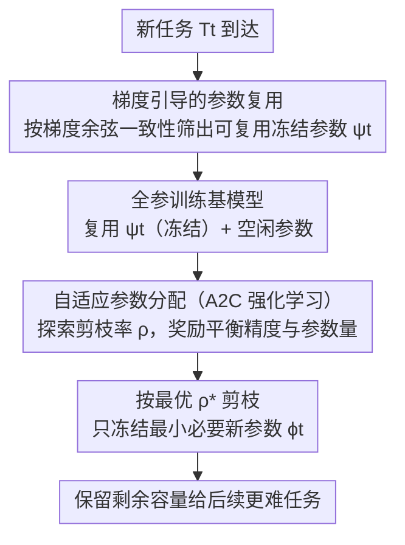

# Parameter-efficient Continual Learning for Enhancing Plasticity without Forgetting under Limited Model Capacity

**会议**: CVPR 2026  
**论文**: [CVF Open Access](https://openaccess.thecvf.com/content/CVPR2026/html/Chen_Parameter-efficient_Continual_Learning_for_Enhancing_Plasticity_without_Forgetting_under_Limited_CVPR_2026_paper.html)  
**代码**: 待确认  
**领域**: 持续学习 / 参数隔离  
**关键词**: 持续学习, 参数隔离, 灾难性遗忘, 梯度一致性, 强化学习剪枝

## 一句话总结
GRAPA 是一种面向"模型容量受限"场景的参数高效持续学习方法，先用梯度方向一致性挑出可安全复用的旧任务冻结参数、再用 A2C 强化学习为每个新任务自适应找出"刚好够用"的剪枝率，从而在不牺牲稳定性（不遗忘）的前提下显著提升可塑性（学新任务），在六条异构任务序列上平均精度最高提升 7.67%、后续复杂任务最高提升 14.92%。

## 研究背景与动机
**领域现状**：持续学习（CL）要在任务依次到来时既不遗忘旧任务（稳定性）又能学好新任务（可塑性）。主流分三类：回放、正则化、参数隔离。参数隔离给每个任务分配不相交的参数子集 $\phi_i\cap\phi_j=\emptyset$，训完即冻结，是抑制灾难性遗忘最强的一类。

**现有痛点**：参数隔离虽抗遗忘，却普遍忽视可塑性。常见做法 ① 在共享骨干上学任务专属 mask 来激活子集——纯复用旧参数，面对越来越难的任务序列不够用；② "训练-剪枝-重训"范式给每个任务按**固定剪枝率**分配新参数——忽略任务复杂度差异，会导致两个问题：在容量受限时新参数可能没学完所有任务就耗尽；任务难度递增时，早期简单任务却冻结了过多参数，给后面的复杂任务留不下容量。

**核心矛盾**：稳定性（冻结保护旧任务）与可塑性（留容量学新任务）在**有限容量**下直接冲突；固定剪枝率把容量"均匀/指数衰减"地分掉，与任务真实需求错配。

**本文目标**：对每个新任务 $T_t$，既要**复用兼容的旧冻结参数**减少新参数消耗，又要**只冻结最少且够用的新参数**，在参数预算 $B$ 下最小化所有任务损失：$\min_{\theta_t}\sum_{t=1}^{N}\mathcal{L}_t(\theta_t)$ s.t. $|\bigcup_t\theta_t|\le B$。

**切入角度**：复用旧参数若梯度方向与新任务冲突会引发负迁移甚至遗忘，所以"哪些旧参数能复用"应由**梯度一致性**判断；而"该给新任务留多少参数"无法靠先验手调，应交给能在未知状态下试错的**强化学习**。

**核心 idea**：梯度引导的参数复用 + 基于强化学习的自适应参数分配——先复用"不打架"的旧参数，再用 A2C 为每个任务搜出"刚好够用"的剪枝率。

## 方法详解

### 整体框架
GRAPA 对每个到来的新任务 $T_t$ 走一条两阶段流水线。**阶段一**从此前所有冻结参数里，按梯度方向一致性筛出可安全复用的子集 $\psi_t$（不引入干扰地最大化知识迁移）；**阶段二**把剩余空闲参数全部分给当前任务训练一个基模型，再用 A2C 强化学习智能体反复探索剪枝率、用奖励平衡"精度保留"与"参数节省"，最终按最优剪枝率剪枝、只冻结最小必要的新参数 $\phi_t$，把尽量多的容量留给后续任务。激活参数为 $\theta_t=\phi_t\cup\psi_t$。

### 关键设计

**1. 梯度引导的参数复用：用梯度方向一致性挑出"不打架"的旧参数**

针对"纯复用旧参数会引入负迁移、复用所有冻结参数会被不兼容任务干扰"的痛点。GRAPA 在每个先前任务收敛时存下其在冻结参数上的梯度（开销有界可控）。训练新任务 $T_t$ 时，逐层逐 epoch 计算当前任务梯度 $g_t^l$ 与某旧任务梯度 $g_{t'}^l$ 的余弦相似度：

$$\cos(g_t^l,g_{t'}^l)=\frac{g_t^l\cdot g_{t'}^l}{\|g_t^l\|_2\,\|g_{t'}^l\|_2}.$$

只有当两任务在该层梯度一致（余弦 $>0$）、且在**超过半数训练 epoch** 上都保持一致时，对应旧参数才判定为可复用，得到复用集合

$$\psi_t=\bigcup_{i=1}^{t-1}\bigcup_l\Big\{\phi_i^l \;\Big|\; \sum_{e=1}^{E}\mathbb{I}\big(\cos(g_{t,e}^l,g_i^l)>0\big)>\tfrac{E}{2}\Big\},$$

复用决策记成二值掩码 $M_t$。这样只迁移方向兼容的旧知识，既省新参数又避免冲突梯度破坏旧任务。

**2. 基于强化学习的自适应参数分配：让 A2C 替每个任务找"刚好够用"的剪枝率**

针对固定剪枝率忽略任务复杂度差异的痛点。GRAPA 先把全部未冻结参数分给当前任务、以剪枝率 0 训出基模型并记其精度 $acc^{base}_t$，再把剪枝建模成"任务自适应试错"问题，用 Advantage Actor-Critic（A2C）求解。状态 $s_t^k$ 含 5 个特征：上一步的剪枝率与精度（两个步依赖量）+ 类别数、样本复杂度、可分性（三个任务描述量）；actor 输出剪枝率 $\rho_t^k\in(0,1)$（以 $\varepsilon=0.2$ 概率均匀探索），剪枝后短暂重训得 $acc_t^k$，奖励为

$$r_t^k=\begin{cases}-1,& \delta_t^k<\eta\\[2pt](\delta_t^k)^{\alpha}\cdot(\rho_t^k)^{\beta},&\text{否则}\end{cases},\qquad \delta_t^k=\frac{acc_t^k}{acc^{base}_t},$$

其中 $\delta_t^k$ 是剪枝带来的相对精度保留率，阈值 $\eta=0.6$ 给精度跌太多时一个明确惩罚以阻止无效探索；$\alpha=5$、$\beta=1.5$ 分别控制"重精度"与"重压缩"的权重。奖励鼓励智能体找到"不显著掉点前提下的最大剪枝率"。智能体只有约 7K 参数（相对 ResNet-18 的 11.7M 可忽略），每任务探索 $\le 20$ 步，且最终不直接用策略输出、而是从满足精度约束的历史经验里挑奖励最高的剪枝率，兼顾鲁棒与低开销（训练智能体 <1.5% 总时间）。

## 实验关键数据

### 主实验
在 8 个数据集组成的两组（MFKT = MNIST/FashionMNIST/KMNIST/TinyImageNet，QSCF = QMNIST/SVHN/CIFAR-10/Food-101）、六条任务序列上评测，骨干为轻量 CNN 和 ResNet-18。下表摘录每条序列的平均测试精度（%）：

| 方法 | MFKT C (CNN) | QSCF C (CNN) | MFKT R1 (R18) | QSCF R1 (R18) | MFKT R2 (R18) | QSCF R2 (R18) |
|------|------|------|------|------|------|------|
| LwF（正则化） | 34.86 | 41.86 | 73.80 | 68.24 | 58.80 | 60.39 |
| PackNet（参数隔离） | 65.39 | 58.95 | 74.90 | 80.64 | 77.88 | 80.78 |
| H2 | 71.78 | 64.81 | 81.34 | 87.64 | 81.22 | 82.72 |
| GrowBrain | 67.78 | 66.49 | 81.74 | 81.98 | 81.78 | 81.79 |
| **GRAPA（本文）** | **76.54** | **74.16** | **85.89** | **90.25** | **85.26** | **88.03** |
| Independent（上界） | 76.86 | 77.34 | 88.84 | 94.12 | 88.84 | 94.12 |

GRAPA 在所有序列上超过全部基线，且逼近"每任务独立训完整模型"的经验上界。其优势主要来自后段更难的任务（如 TinyImageNet、Food-101）：固定剪枝率的 PackNet/H2 在容量耗尽后这些任务急剧掉点，GRAPA 因留下了容量而保持高精度。

### 消融实验
| 配置 | MFKT C | QSCF C | MFKT R1 | MFKT R2 | QSCF R1 | QSCF R2 |
|------|------|------|------|------|------|------|
| GRAPA(w/o GR)（复用全部旧参数） | 74.55 | 72.86 | 80.30 | 62.79 | 81.29 | 85.57 |
| GRAPA(w/o APA)（固定剪枝率） | 73.73 | 70.07 | 73.04 | 75.93 | 71.00 | 78.84 |
| **GRAPA（完整）** | **76.54** | **74.16** | **85.89** | **85.26** | **90.25** | **88.03** |

### 关键发现
- 去掉自适应分配（w/o APA）掉点更狠，尤其在 ResNet-18 长序列上（如 QSCF R1 从 90.25→71.00）——固定剪枝率会快速冻结大量参数、压垮后续复杂任务（其 TinyImageNet 仅 25.11%、Food-101 仅 24.25%）。
- 去掉梯度引导复用（w/o GR）即无脑复用全部冻结参数，会引入不兼容任务的负迁移，精度同样下降，证明"按梯度一致性筛选"是必要的。
- RL 剪枝优于启发式：在 QSCF R1 上线性衰减剪枝率(79.58%)、二分搜索(83.04%) 都不如 GRAPA 的 90.25%，且 GRAPA 对超参 $\alpha,\beta$ 在 CNN 上不敏感（最优最差差距 <2%）。
- 容量保留：H2 因固定比例分配，到 TinyImageNet 阶段仅剩 <1.34% 参数可训；GRAPA 只冻结最小必要参数，给后段留出更多容量。

## 亮点与洞察
- **用梯度余弦一致性当"可复用性"判据**：把"哪些旧参数能安全复用"从启发式 mask 变成有梯度方向依据的筛选，简洁且物理含义清晰，可迁移到任何参数隔离框架做"安全迁移门控"。
- **把剪枝率搜索交给强化学习**：固定剪枝率是该领域长期的硬伤，GRAPA 用仅 7K 参数的轻量 A2C 智能体（≤20 步、含早停式经验选优）把它变成任务自适应，开销可忽略却带来稳定增益——"让模型自己决定该留多少容量"这一思路很可复用。
- **奖励函数同时编码精度与压缩**：$r=\delta^{\alpha}\rho^{\beta}$ 配合 $\eta$ 硬惩罚，把"少掉点 + 多剪枝"两个目标显式写进奖励，调 $\alpha,\beta$ 即可平移偏好。

## 局限与展望
- 总任务数仍受模型总容量硬上限约束：再省也终会耗尽，作者也承认这点，并提出未来可探索"主动遗忘"机制丢弃过时任务/不重要参数。
- 每步探索都要一次"剪枝 + 短重训"，虽单次快、限 20 步，但相对无探索方法仍有额外训练开销（论文称 <1.5% 总时间，但这是相对量，绝对开销随任务数累加）。
- 任务描述状态里的"样本复杂度、可分性"如何精确计算只放在补充材料（⚠️ 以原文/补充为准），其鲁棒性与跨数据集可比性未在正文充分讨论。
- 评测聚焦图像分类任务序列、轻量骨干，未验证在检测/分割或更大模型上的表现。

## 相关工作与启发
- **vs PackNet（固定剪枝率的训练-剪枝-重训）**: PackNet 给每任务按剩余比例剪枝，容量指数衰减、后段任务崩盘；GRAPA 用 RL 自适应剪枝率 + 梯度复用，把容量按需分配，长序列后段显著更优。
- **vs H2（PackNet + Fisher 信息选择性复用）**: H2 用 Fisher 信息选不重要的旧参数复用，但仍是固定剪枝率；GRAPA 改用梯度一致性判可复用、并自适应分配新参数，二者结合更彻底地兼顾稳定与可塑。
- **vs GrowBrain（超网络变换旧参数）**: GrowBrain 靠强任务相关性生成参数调整，异构、难度递增序列上泛化有限；GRAPA 不依赖强相关，按每任务需求分配，在 R2 乱序异构序列上更稳。
- **vs LwF（正则化/知识蒸馏）**: LwF 共享参数空间、对后段复杂任务更灵活但严重遗忘早期任务；GRAPA 走参数隔离保不遗忘，同时通过自适应分配补上可塑性短板。

## 评分
- 新颖性: ⭐⭐⭐⭐ "梯度一致性复用 + RL 自适应剪枝率"两件武器组合解决固定剪枝率痛点，思路清晰且对症
- 实验充分度: ⭐⭐⭐⭐ 六条异构序列、两种骨干、消融+RL 策略对比+容量分析+超参敏感性，较全面
- 写作质量: ⭐⭐⭐⭐ 动机-设计一一对应、伪代码清晰；部分状态特征计算细节放补充材料
- 价值: ⭐⭐⭐⭐ 面向端侧受限容量持续学习，平均精度逼近独立训练上界，实用性强

<!-- RELATED:START -->

## 相关论文

- [\[CVPR 2026\] Exemplar-Free Continual Learning for State Space Models](exemplar-free_continual_learning_for_state_space_models.md)
- [\[CVPR 2026\] A Faster Path to Continual Learning](a_faster_path_to_continual_learning.md)
- [\[CVPR 2026\] Spectral Mixture-of-Experts for Continual Learning](spectral_mixture-of-experts_for_continual_learning.md)
- [\[CVPR 2026\] Subspace Alignment for CLIP-based Continual Learning via Canonical Correlation Analysis](subspace_alignment_for_clip-based_continual_learning_via_canonical_correlation_a.md)
- [\[CVPR 2026\] FEAT: Federated Geometry-Aware Correction for Exemplar Replay under Continual Dynamic Heterogeneity](feat_federated_geometry_aware_correction_for_exemplar_replay_under_continual_dynamic_heterogeneity.md)

<!-- RELATED:END -->
