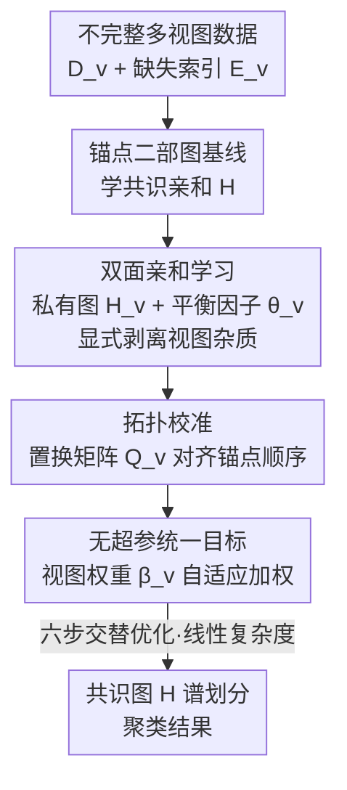

# Plug-and-Play Incomplete Multi-View Clustering via Janus-Faced Affinity Learning with Topology Harmonization

**会议**: CVPR 2026  
**论文**: [CVF Open Access](https://openaccess.thecvf.com/content/CVPR2026/html/Yu_Plug-and-Play_Incomplete_Multi-View_Clustering_via_Janus-Faced_Affinity_Learning_with_Topology_CVPR_2026_paper.html)  
**代码**: 无  
**领域**: 不完整多视图聚类  
**关键词**: 不完整多视图聚类, 锚点图, 双面亲和学习, 拓扑校准, 无超参

## 一句话总结
PJFTH 提出一个**无任何正则超参**的即插即用不完整多视图聚类框架：用「双面（Janus-faced）亲和学习」把每个视图的私有杂质显式剥离出来再融合共识图，用「拓扑校准」把跨视图错乱的锚点顺序对齐，整套目标六步交替优化、复杂度对样本数 $n$ 线性，在 6 个含缺失率数据集上达到有竞争力的聚类效果。

## 研究背景与动机
**领域现状**：多视图数据（多模态 / 多源）在现实中很常见，但传感器故障、传输错误、采集遗漏会导致某些视图样本缺失，由此产生**不完整多视图聚类（IMVC）**。近年主流路线是用「锚点（anchor）—样本」的二部亲和图代替 $n\times n$ 自表达矩阵，先学一个共识亲和图 $H$，再对其谱划分得到聚类。

**现有痛点**：作者指出现有 IMVC 方法有三个共性短板。其一，学习共识表示时**忽略了视图私有杂质（view-exclusive artifacts）的干扰**——每个视图都带有与共识语义无关的偏置（如缺失诱导的偏差、视图独有噪声），直接融合会污染相似度度量。其二，跨视图的**锚点顺序不一致**：聚类无监督，各视图独立采样得到的锚点排列没有对齐，导致图结构里的语义对应被打乱，破坏聚类性能。其三，多数方法依赖**精心调过的正则超参** $\eta$，部署时调参成本高、实用性差。

**核心矛盾**：要在「融合多视图信息」与「抑制缺失/私有杂质带来的负面效应」之间取得真正的分离，而不是让杂质混进共识图；同时锚点表示本身的**顺序自由度**让跨视图融合失去了语义对齐基础。

**本文目标**：在一个统一框架里同时解决——(a) 显式建模并剥离视图私有杂质；(b) 同步跨视图锚点顺序；(c) 去掉所有正则超参，做到即插即用。

**切入角度**：作者观察到杂质干扰来自「私有信息混入共识学习」，于是**给每个视图单独学一张私有图 $H_v$**，再用一个平衡因子 $\theta_v$ 决定共识图 $H$ 和私有图 $H_v$ 各占多少——像两面神 Janus 一样一面朝共识、一面朝私有，从而把杂质显式吸出去。

**核心 idea**：用「共识图 + 视图私有杂质图」的双面分解显式排除干扰，用「带 unary 编码约束的置换矩阵」对齐锚点拓扑，全程不引入任何正则超参，六步交替优化保证线性复杂度。

## 方法详解

### 整体框架
PJFTH 的输入是带缺失的多视图数据集 $\{D_v\in\mathbb{R}^{d_v\times n}\}_{v=1}^V$ 和指示缺失的索引向量 $\{m_v\}$，输出是对共识亲和图 $H$ 做谱划分得到的聚类结果。整条 pipeline 在锚点二部图框架上叠两层修补：先把每个视图的私有杂质用 $H_v$ 吸出去（双面亲和学习），再用置换矩阵 $Q_v$ 把锚点顺序对齐（拓扑校准），最后用视图权重 $\beta_v$ 把各视图加权进一个**无超参**的统一目标，六步交替迭代直到收敛。

先交代基线。IMVC 的全尺寸自表达写法 $\min_{W_v,W}\sum_v\|D_vE_v-D_vE_vW_v\|_F^2+\eta\psi(W,\cdot)$ 至少是立方复杂度，且融合会带来结构畸变。于是改用**锚点共识学习**：用一组锚点 $C_v\in\mathbb{R}^{d_v\times m}$（$m\ll n$）表示原数据，直接学共识亲和 $H\in\mathbb{R}^{m\times n}$：

$$\min_{H}\ \sum_{v=1}^V \|D_vE_v - C_vHE_v\|_F^2 + \eta\phi(H),\quad \text{s.t. } H^\top\mathbf{1}_m=\mathbf{1}_n,\ H\ge 0$$

这里 $E_v\in\mathbb{R}^{n\times n_v}$ 是把观测样本映射回全尺寸的指示矩阵。二部图把开销降下来、也缓解了融合畸变，但它**没处理杂质干扰**、也**没对齐锚点顺序**——这正是 PJFTH 要补的两块。

### 关键设计

**1. 双面亲和学习：给每个视图配一张私有杂质图，把干扰显式吸出去**

针对「融合时杂质污染共识图」这个痛点，作者不再让 $H$ 独自承担所有信息，而是给每个视图额外学一张**视图私有杂质矩阵** $H_v\in\mathbb{R}^{m\times n}$，专门捕获只属于该视图的干扰（缺失诱导偏差、与共识语义无关的信号等），并用一个**平衡因子** $\theta_v\in[0,1]$ 在共识与私有之间分配：

$$\min_{H,H_v,\theta_v}\ \sum_{v=1}^V \big\|D_vE_v - \theta_v C_v H E_v + (\theta_v-1)C_v H_v E_v\big\|_F^2$$

约束为 $0\le\theta_v\le1$、$H^\top\mathbf{1}_m=\mathbf{1}_n$、$H\ge0$、$H_v^\top\mathbf{1}_m=\mathbf{1}_n$、$H_v\ge0$。直觉是：重构 $D_vE_v$ 时，能用共识结构解释的部分交给 $\theta_v C_v H$，剩下解释不了的私有杂质交给 $(\theta_v-1)C_v H_v$ 这一项去吸收。$\theta_v$ 越接近 1，说明该视图越「干净」、越靠共识；越接近 0 则更多依赖私有图去消化杂质。这种「一面朝共识、一面朝私有」的双面（Janus-faced）建模，使得共识图 $H$ 学到的是被净化过的、更鲁棒的相似度——这是和以往直接融合 $\{W_v\}$ 的方法最本质的区别：杂质不再隐式混进共识，而是被显式建模、显式排除。

**2. 拓扑校准：用 0/1 置换矩阵对齐跨视图锚点顺序，只换位不改值**

针对「锚点顺序跨视图错乱、破坏图结构」这个痛点，作者在锚点和共识图之间插入一个**置换变换矩阵** $Q_v\in\{0,1\}^{m\times m}$，把第 $v$ 个视图的锚点拓扑重排到统一顺序后再参与相似度融合：

$$\min_{H,Q_v}\ \sum_{v=1}^V \big\|D_vE_v - C_v Q_v H E_v\big\|_F^2,\quad \text{s.t. } Q_v^\top\mathbf{1}_m=\mathbf{1}_m,\ Q_v\mathbf{1}_m=\mathbf{1}_m,\ Q_v\in\{0,1\}$$

双随机 + 0/1 的 **unary 编码约束**让 $Q_v$ 恰好是一个置换矩阵：每行每列只有一个 1，因此它只**重排锚点顺序、不改变锚点取值**。这一步把「锚点顺序的对齐」前置到相似度整合之前，恢复了跨视图的语义对应——既保留了原始学到的锚点属性，又消除了无监督下采样带来的排列歧义。这是该方法相对纯锚点共识学习的第二处关键修补。

**3. 无超参统一目标 + 视图自适应加权：把两处修补和视图重要性合进一个目标，彻底去掉正则项**

针对「依赖正则超参 $\eta$」这个痛点，作者把双面学习（式 3）和拓扑校准（式 4）合并，再给每个视图配一个**权重系数** $\beta_v$ 动态校准其贡献，写出统一目标：

$$\min_{\Omega}\ \sum_{v=1}^V \beta_v^2 \big\|D_vE_v - \theta_v C_v Q_v H E_v + (\theta_v-1)C_v H_v E_v\big\|_F^2$$

约束为 $\beta\ge0,\ \beta^\top\mathbf{1}=1,\ 0\le\theta_v\le1,\ C_v^\top C_v=I_m$，以及 $H,H_v,Q_v$ 各自的归一化/置换约束，变量集合 $\Omega=\{C_v,Q_v,H,H_v,\theta_v,\beta_v\}$。值得注意的是，**这个目标里没有任何 $\eta$ 类正则超参**——杂质抑制由 $\theta_v$ 自适应学习、视图重要性由 $\beta_v$ 自动分配，全部从数据里解出来。$\beta_v$ 甚至有闭式解 $\beta_v = \frac{1/q_v}{\sum_{v}1/q_v}$（$q_v$ 为该视图的重构残差），自然给残差小（更可信）的视图更大权重。无超参正是「即插即用」承诺的来源：换个数据集不用重新调参。

**4. 六步交替优化 + 对角化技巧：把每个子问题压到线性复杂度**

整套目标用交替最小化求解，每轮按 $C_v\!\to\!Q_v\!\to\!H\!\to\!H_v\!\to\!\theta_v\!\to\!\beta_v$ 六步更新。难点在于朴素实现里很多中间项（如 $D_vE_v(\cdot)^\top$、$Q_vHE_vE_v^\top$）会逼近 $O(n^2)$ 甚至更高。作者反复利用一个关键观察：**$E_vE_v^\top$ 是对角阵**（每列只有一个 1），从而 $D_vE_vE_v^\top$ 可等价写成逐元素积 $D_v\odot B_v$（$B_v$ 由各行观测计数构成），$HE_vE_v^\top$ 写成 $H\odot G_v$。靠这个对角化技巧，每个子问题都被改写成线性开销：更新 $C_v$ 用 SVD（$C_v=UV^\top$）为 $O(m^2n+d_vnm+d_vm^2)$，$Q_v$ 经向量化变成可被现成求解器处理的二值规划且降到 $O(n)$，$H$ 与 $H_v$ 逐列闭式解（如 $H_{:,j}=\max(\frac{1-\mathbf{1}^\top s_j}{m}\mathbf{1}+s_j,0)$）为 $O(n)$，$\theta_v$ 是带裁剪的二次最优解 $O(n)$，$\beta_v$ 闭式 $O(n)$。最终**整体时间/空间复杂度对 $n$ 线性**（Remark 8/9），这是它能跑到 10 万级样本（YOUBESEL，101499 样本）而许多对手直接 OOM 的原因。

### 损失函数 / 训练策略
整个方法只有式 (5) 这一个统一目标，无额外正则项、无超参。优化是六步交替迭代（Algorithm 1）直到目标收敛，最后对共识图 $H$ 做谱聚类输出标签。$C_v$ 还带正交约束 $C_v^\top C_v=I_m$ 以提升锚点判别性。

## 实验关键数据

### 主实验
6 个数据集（230～101499 样本，2～5 视图），与 12 个 IMVC 方法在 30%/60%/80% 三档缺失率下比 ACC/PUR/FSC。表中「NH」为该方法所需超参个数，PJFTH 为 **0**。下面摘取 60% 缺失率的代表性结果：

| 数据集 (60% 缺失) | 指标 | PJFTH (Ours) | 次优方法 | 对比 |
|--------|------|------|----------|------|
| ORLR | ACC | **52.31** | IVCBG 43.70 | +8.6 |
| ORLR | FSC | **35.84** | IVCBG 34.67 | +1.2 |
| WASHING | FSC | **49.31** | HCLGL 47.11 | +2.2 |
| NUJECTEN | FSC | **23.66** | USETL 18.76 | +4.9 |
| YOUBESEL | FSC | **14.53** | OSIMC 10.59 | +3.9 |

关键点：PJFTH 在多数场景（尤其 ORLR、YOUBESEL）取得最优，并且是表中**唯一能在全部 6 个数据集上都跑出结果**的方法——HCMSC/LSIVC/LRIVC/AGIMC/GRIMC/UIMC/USETL 在最大的 NUSWDBJ、YOUBESEL 上直接缺结果（表中为「-」），印证了线性复杂度带来的可扩展性。

### 消融实验
OVAL = 去掉双面亲和学习（VAL），OTH = 去掉拓扑校准（TH），均在 60% 缺失率下：

| 配置 | ORLR ACC | NUJECTEN ACC | YOUBESEL ACC | 说明 |
|------|---------|--------------|--------------|------|
| OVAL（无双面学习） | 51.45 | 23.22 | 17.96 | 杂质未剥离 |
| OTH（无拓扑校准） | 51.59 | 23.68 | 18.21 | 锚点顺序未对齐 |
| Ours（完整） | **52.31** | **24.33** | **18.67** | 两块都加 |

### 关键发现
- **两个模块都正向有效**：去掉 VAL 或 TH 任一都掉点，完整模型最优，说明「剥杂质」和「对齐锚点顺序」是两个互补的修补，而非冗余。
- **可扩展性是硬优势**：资源对比（Fig. 2/3）显示 PJFTH 多数情况下运行时间更短、内存更省（受益于二部图方案），且能覆盖对手跑不动的大数据集。
- **次优情形的诚实归因**：作者指出部分场景非最优，可能源于「先求谱嵌入再划分」的两阶段流程，而非直接解离散标签——这也写进了局限。

## 亮点与洞察
- **Janus 双面分解是核心巧思**：用一个 $\theta_v\in[0,1]$ 把「共识」与「视图私有杂质」显式拆成两项重构同一个 $D_vE_v$，让杂质有专门的容器 $H_v$ 去吸收，而不是隐式污染共识图——这个「给干扰一个出口」的思路可迁移到任何需要分离公共/私有成分的多源融合任务。
- **无超参 = 真正即插即用**：杂质强度（$\theta_v$）和视图权重（$\beta_v$）全部从数据闭式/自适应解出，省掉了 IMVC 里最烦的 $\eta$ 调参，换数据集即用。
- **对角化加速可复用**：反复利用 $E_vE_v^\top$ 对角、把矩阵乘改写成 Hadamard 积（$D_v\odot B_v$、$H\odot G_v$），把多个子问题从 $O(n^2)$ 压到 $O(n)$，是处理「指示矩阵 × 大矩阵」的通用技巧。

## 局限与展望
- **正交锚点约束的副作用**：作者承认 $C_v^\top C_v=I_m$ 虽提升锚点判别性，但可能让锚点偏离原数据的空间分布；让锚点分布更贴近原数据有望进一步提升效果。
- **两阶段聚类放大方差**：先建亲和图再谱划分的两阶段管线会加剧聚类方差；直接从原数据生成簇指示器是更稳的方向。
- **⚠️ 个人观察**：消融只对比了「全去掉某模块」，没有单独验证置换矩阵 $Q_v$ 的 unary 约束相对软对齐（如双随机松弛）的增益；$\theta_v$ 学到的数值在干净/脏视图上的分布也未可视化，双面机制的可解释性还可再挖。

## 相关工作与启发
- **vs 子空间/核方法（LSIVC, AGIMC, GRIMC）**：它们用全尺寸自表达或核学习解 IMVC，复杂度高、大数据上跑不动；PJFTH 用锚点二部图把复杂度压到线性，作者的实验也显示 anchor 策略在结果上更优。
- **vs 普通锚点共识方法（如 PIMVC, OSIMC）**：同样用锚点，但它们既没显式处理视图私有杂质、也没对齐锚点顺序，且常带正则超参；PJFTH 在锚点框架上叠了「双面剥杂质 + 拓扑校准」两块修补并去掉超参。
- **vs 缺失补全/对比式方法（基于插补、原型对比）**：那类方法侧重「补回缺失」或「构造正负对」，PJFTH 不做显式补全，而是从「净化共识表示 + 对齐锚点」角度绕开缺失带来的结构畸变。

## 评分
- 新颖性: ⭐⭐⭐⭐ 双面亲和分离杂质 + 置换对齐锚点 + 全程无超参的组合在 IMVC 里有清晰增量
- 实验充分度: ⭐⭐⭐⭐ 6 数据集 × 3 缺失率 × 12 对手，覆盖到 10 万级，消融/时空开销/收敛都给了
- 写作质量: ⭐⭐⭐⭐ 公式推导（六步更新 + 线性复杂度证明）严谨，但符号密集、消融偏简略
- 价值: ⭐⭐⭐⭐ 无超参、线性复杂度、即插即用，对大规模 IMVC 落地实用性强

<!-- RELATED:START -->

## 相关论文

- [\[CVPR 2026\] Imbalanced View Contribution Evaluation and Refinement for Deep Incomplete Multi-View Clustering](imbalanced_view_contribution_evaluation_and_refinement_for_deep_incomplete_multi.md)
- [\[AAAI 2026\] Deep Incomplete Multi-View Clustering via Hierarchical Imputation and Alignment](../../AAAI2026/others/deep_incomplete_multi-view_clustering_via_hierarchical_imputation_and_alignment.md)
- [\[CVPR 2026\] Cluster-aware Anchor Learning for Multi-View Clustering](cluster-aware_anchor_learning_for_multi-view_clustering.md)
- [\[CVPR 2026\] Cross-View Distillation and Adaptive Masking for Incomplete Multi-View Multi-Label Classification](cross-view_distillation_and_adaptive_masking_for_incomplete_multi-view_multi-lab.md)
- [\[CVPR 2026\] Reliable Clustering Number Estimation for Contrastive Multi-View Clustering](reliable_clustering_number_estimation_for_contrastive_multi-view_clustering.md)

<!-- RELATED:END -->
