# Progressive Neural Architecture Generation

**会议**: CVPR 2026  
**论文**: [CVF Open Access](https://openaccess.thecvf.com/content/CVPR2026/html/Yu_Progressive_Neural_Architecture_Generation_CVPR_2026_paper.html)  
**代码**: 无  
**领域**: 神经架构搜索 / AutoML  
**关键词**: 神经架构生成, 自回归生成, 向量量化, 由粗到精, 步进式约束

## 一句话总结
PNAG 把神经架构"生成"重新建模成一个由简到繁的自回归过程——每一步用向量量化解码出一个**完整可用的子架构**，再逐步增加规模直到目标架构，并在每一步加一致性约束保证有效性，从而把单次生成时间相比扩散式方法压缩了 1300×，同时生成的架构精度还更高。

## 研究背景与动机

**领域现状**：神经架构搜索（NAS）靠搜索策略（强化学习、进化算法、贝叶斯优化）自动设计网络，但这些策略里都嵌着随机的"探索"环节，比如进化算法的随机初始化、贝叶斯优化的随机采集（acquisition）。神经架构生成（NAG）想用一个生成模型**直接产出**高质量候选架构，去替换掉这些不可控的随机步骤。目前主流 NAG 走两条路：基于图 VAE 的方法（在隐空间采样后用复杂解码器重建架构）和基于图扩散的方法（在隐空间反复去噪迭代出架构）。

**现有痛点**：这两条路都有两个硬伤。其一是**生成效率低**——无论是 VAE 解码器还是扩散的多步去噪，都要在高维隐空间里反复做"网络推理"，计算开销巨大，扩散式生成一个 NB201 架构要 8 秒。其二是**架构有效性差**——现有方法只在**最终输出**那一步加有效性约束，对中间生成过程不做监督；即使扩散式方法是逐步精化的，它也只在隐空间里约束，缺乏架构层面的中间监督，误差会一路累积，导致最后产出无法正常训练/运行的"废架构"。

**核心矛盾**：生成过程是在**连续隐空间**里做的，但架构本身是**离散结构**；用连续空间的反复推理去逼近一个离散对象，既慢又难保证每一步都"合法"。

**本文目标**：(1) 大幅提升生成效率，去掉昂贵的网络推理；(2) 让中间每一步生成的都是合法子架构，从根上保证最终有效性。

**切入角度**：作者观察到自回归（AR）模型的"由粗到精、逐 token 生成"范式天然契合架构的离散性——只要把"下一个 token"换成"下一个**更复杂的子架构**"，就能把生成变成一条清晰的离散演化路径。

**核心 idea**：用**离散自回归**代替连续隐空间推理来做架构生成——每个 AR 单元是一个完整可训练的子架构，靠向量量化解码（而非网络推理）逐步放大规模，并在每一步加一致性约束钉住有效性。

## 方法详解

### 整体框架

PNAG 把"生成一个目标架构"拆成 $T$ 步自回归：第 $t$ 步产出一个含 $n$ 个操作的**完整子架构** $g_t$，随着 $t$ 增大，$n$ 从最小的 3（输入、输出 + 1 个功能操作）逐步增加到预定义上限 $N$，子架构由简（粗）到繁（精）地长成最终架构。整个 pipeline 沿用 VAE 的"编码—解码"骨架但换成自回归解码：先用图编码器把原始架构 $Arc$ 编码成特征图 $e$；然后在每一步做两件事——用**多尺度子架构量化（MSQ）**从 $e$ 解码出当前尺度的子架构、用**步进式一致性约束（SCC）**惩罚这一步偏离原架构的程度；累积所有步的特征再解码出重建架构 $\hat{Arc}$。关键在于 MSQ 的码本查找和映射都是线性操作、**不经过任何网络推理**，所以快。训练完这套生成器后，再接一个 surrogate 代理模型做条件/可迁移生成（stage 2/3），让生成朝"高精度/低延迟"等目标走，并能直接预测未见任务上的架构质量。

```mermaid
%%{init: {'flowchart': {'rankSpacing': 24, 'nodeSpacing': 28, 'padding': 6, 'wrappingWidth': 400}}}%%
flowchart TD
    A["原始架构 Arc"] --> B["图编码器<br/>特征图 e"]
    B --> C["多尺度子架构量化 MSQ<br/>码本量化解码出子架构 g_t<br/>规模 n: 3 → N 逐步放大"]
    C --> D["步进式一致性约束 SCC<br/>每步惩罚偏离原架构"]
    D -->|未到第 T 步| C
    D -->|累积特征解码| E["重建架构 Arc&#770;"]
    E --> F["条件 / 可迁移生成<br/>代理模型按目标引导<br/>预测未见任务架构质量"]
    F --> G["目标架构"]
```

### 关键设计

**1. 多尺度子架构量化 MSQ：用码本查找代替网络推理，把生成变成由粗到精的线性放大**

这一设计直接打效率痛点：与其像扩散/VAE 那样在高维隐空间反复推理重建整个架构，MSQ 把 AR 的"预测下一个 token"改成"预测下一个**尺度**的子架构"。具体做法分两步。先做**区域平均聚合**把编码特征图 $e \in \mathbb{R}^{C\times N\times N}$ 缩放到当前尺度 $e' \in \mathbb{R}^{C\times n\times n}$（$n<N$），每个新位置取原图对应区域的均值：$e'_{c,i,j} = \frac{1}{|R_{i,j}|}\sum_{(h,w)\in R_{i,j}} e_{c,h,w}$。再做**向量量化**：用一个所有步共享的可学习码本 $Z \in \mathbb{R}^{V\times C}$（$V$ 等于预定义结构元素个数），对 $e'$ 里每个向量按最小欧氏距离找最近码字，得到码索引并解码成结构元素拼成子架构：

$$o = \Big(\arg\min_{v\in[V]} \lVert \text{lookup}(Z,v) - e' \rVert_2\Big), \qquad g_t = \sum_{i=1}^{n} f(o_i)$$

其中 $f$ 是把码索引映射回结构的线性解码函数。生成时 $n$ 每步 +1，子架构特征经线性插值放大回 $N\times N$ 后累加到 $\hat e$，最后由解码器 $D$ 还原架构（见原文 Algorithm 1）。整条链路里码本查找和映射都是简单线性运算、**完全不碰网络前向**，这正是把单次生成从扩散的 8 秒压到 0.006 秒的根本原因。

**2. 步进式一致性约束 SCC：给每一个中间子架构都上监督，堵住误差累积**

这一设计打有效性痛点。现有方法（含扩散）只在最后一步算重建损失 $L = \lVert Arc - \hat{Arc}\rVert_2 + \lVert e - \hat e\rVert_2$，中间步无人看管，偏差会越滚越大、产出无法运行的架构。SCC 的做法是在**每一个中间步** $t$ 都加一个正则项：把该步子架构特征 $e'_t$ 双线性插值回原尺寸后，惩罚它与原架构编码 $e$ 的偏差：

$$R_{SCC} = \lambda \sum_{t=1}^{T} \lVert e - \text{interpolate}(e'_t, (N,N)) \rVert_2$$

最终训练目标把末步约束和步进约束合在一起：$L = \lVert Arc - \hat{Arc}\rVert_2 + \lVert e - \hat e\rVert_2 + R_{SCC}$。作者进一步用 **Lyapunov 稳定性**给了理论支撑：把"偏差能量" $V(e'_t)=\lVert e - e'_t\rVert_2^2$ 当 Lyapunov 函数，只要学习率满足 $\alpha < -\,2(e-e'_t)^\top \nabla_{e'_t}L(e'_t)\,/\,\lVert \nabla_{e'_t}L(e'_t)\rVert_2^2$，就有 $\Delta V(e'_t)<0$，即每步偏差能量单调下降、生成轨迹渐近稳定地收敛到合法目标（⚠️ 推导细节以原文 Proposition 3.1 与附录为准）。直观说，SCC 让每一步子架构都被"拽回"靠近原架构，从而每一个中间产物都合法。

**3. 条件 / 可迁移生成：把架构评估做成元学习，让一套生成器适配任意新任务**

基础 NAG 是无条件的、只图多样性；但实际要的是按指定属性（高精度、低延迟）生成。PNAG 接一个 **surrogate 代理模型**并把它的训练写成元学习任务——不是在单一任务 $D$ 上学固定映射 $P(y\mid D,\hat{Arc})$，而是在一系列任务上学"如何评估一个架构好坏"的可迁移元知识，于是对未见任务 $\tilde D$ 也能直接预测架构质量。可迁移目标写成 $p\big(g_1,\dots,g_T \mid P(y\mid\tilde D,\hat{Arc})\big)=\prod_{t=1}^{T} p\big(g_t\mid g_{1:t-1}, P(y\mid\tilde D,\hat{Arc})\big)$。好处是换任务时只需换代理模型、**不必重训生成器**：实验里给 Clean/APGD/Blur 三种目标各训一个代理，生成的架构就分别在对应目标上最好。条件生成阶段用的是类 GPT-2 / VQGAN 的 decoder-only transformer，并把 LayerNorm 换成 AdaLN 来注入条件。

### 损失函数 / 训练策略
两阶段训练：阶段一训 VAE（简单图编码器 + 两层线性解码），自回归生成过程本身不引入额外模型；阶段二训条件生成的 decoder-only transformer。AdamW 优化，两阶段学习率分别 0.0001 / 0.001，weight decay 0.0001，batch size 256，训练 300 epoch。总损失即式 (7) 的"末步重建 + SCC 步进约束"。

## 实验关键数据

### 主实验
在 NB201 / MBV3 / DARTS 三个搜索空间 + 四个下游数据集上评测。NB201 上 PNAG 在 CIFAR-10/100 上达到已知最优精度，且只需训练 1 个架构；在更难的 Aircraft / Oxford-IIIT Pets 上相比可迁移类基线平均提升 **+8.43% / +5.07%**。

| 搜索空间 / 数据集 | 指标 | PNAG | 之前最好 | 说明 |
|--------|------|------|----------|------|
| NB201 / Aircraft | Acc(%) | **66.99** | 59.15 (TNAS) | 仅训 1 个架构 |
| NB201 / Oxford-IIIT Pets | Acc(%) | **45.35** | 41.80 (DiffusionNAG) | 仅训 2 个架构 |
| MBV3 / Aircraft | Acc(%) | **84.55** | 82.31 (TNAS) | 平均 +2.24% |
| DARTS / CIFAR-10 | Acc(%) | **97.93** | 97.58 (OStr-DARTS) | 搜索成本仅 0.03 GPU·Day |
| DARTS / ImageNet | Top-5(%) | **93.0** | 93.0 (OStr-DARTS) | 成本最低 |
| AutoFormer / Tiny | Acc(%) | **76.6** | 76.4 (AZ-NAS) | 6.03M 参数，验证可生成 ViT |

### 效率与有效性
单次生成 0.006 秒，相比 DiffusionNAG 的 8 秒提速 **1300×**；CIFAR-10 上完整生成 8 秒 vs DiffusionNAG 150s / VAE 20s（17× / 2×）。1000 个生成架构的合法性/质量见下表。

| 指标（生成 1000 架构）| 搜索空间 | PNAG | DiffusionNAG | POMONAG |
|------|------|------|------|------|
| Validity(%) ↑ | NB201 | **100.0** | 98.97 | 99.97 |
| Uniqueness(%) ↑ | NB201 | **99.70** | 98.70 | 34.14 |
| Novelty(%) ↑ | NB201 | **59.34** | 49.20 | 37.41 |
| Validity(%) ↑ | MBV3 | **100.0** | 99.09 | 72.58 |

### 消融实验
| 配置 | 关键指标 | 说明 |
|------|---------|------|
| SCC step = 0 | Validity / Acc 最低 | 不加任何步进约束，有效性最差 |
| SCC step = t | 随 t 增大 Validity / Acc 均上升 | 约束的步数越多越稳 |
| 完整 SCC | Validity 100% | 步步一致性钉住有效性 |

### 关键发现
- **SCC 是有效性的命门**：图 3 显示约束步数从 0 增加时，架构有效性和精度同步上升——只在最后一步约束远不够，中间步监督才能堵住误差累积。
- **效率提升来自"去网络推理"**：MSQ 用码本查找/线性映射替代隐空间反复推理，这是 1300× 提速的根源，而非简单调小模型。
- **强可迁移性**：换任务只换代理模型；Clean/APGD/Blur 三目标各自由对应代理引导时在对应场景最好（如 fAPGD 引导在 APGD 上 34.52%，显著高于其他引导）。
- **可扩展到 Transformer**：在 AutoFormer 空间生成 ViT，Tiny 设置 76.6% 超过全部基线，说明方法不限于卷积架构。

## 亮点与洞察
- **把 NAG 重新框成"预测下一个尺度"而非"预测下一个 token"**：每个 AR 单元是完整可用的子架构，由粗到精地长大，这个视角让离散自回归和架构的离散性天然对齐，比在连续隐空间里硬逼近优雅得多。
- **"网络无关"的生成最值钱**：1300× 提速不是靠剪枝/蒸馏，而是结构性地把网络推理从生成回路里拿掉，只剩码本查找——这个 trick 可迁移到任何"用生成模型产离散结构"的场景。
- **用 Lyapunov 稳定性论证生成轨迹收敛**：把"中间子架构逐步逼近输入"形式化成偏差能量单调下降，给步进约束提供了理论而非纯经验的支撑，思路可借鉴到其他迭代式生成的稳定性分析。

## 局限与展望
- 作者把架构有效性主要建立在"逼近输入架构"上，SCC 惩罚的是与**原始输入架构**的偏差——这对"重建/逼近已知好架构"很合理，但对生成训练集之外真正新颖结构时，强一致性约束是否会限制探索多样性值得关注（NB201 上 Novelty 59.34% 虽领先但绝对值不算高，作者归因于搜索空间小）。
- ⚠️ 表 5（Adaptation across objectives）的数值组织较跳跃，APGD/Blur 行的 Clean 列出现极低值（如 7.43 / 3.95），具体协议以原文为准。
- 子架构最小规模固定为 3、尺度逐 +1 增长是预设的线性放大策略，是否对所有搜索空间都最优、能否自适应步长，留有空间。

## 相关工作与启发
- **vs 图 VAE 类 NAG（如 Hemmi）**：他们在连续隐空间采样后用复杂解码器一次性重建架构，PNAG 改成离散自回归逐尺度生成，避免高维隐空间反复推理，效率与有效性都更好。
- **vs 扩散类 NAG（DiffusionNAG）**：扩散靠多步隐空间去噪、只在最终隐变量层面约束，PNAG 用码本量化的线性生成 + 架构层面的步进约束，单次生成快 1300×，且 Validity 达 100%。
- **vs VAR / 视觉自回归（"next-scale prediction"）**：PNAG 借鉴了"预测下一个尺度"的范式（[43]），但把对象从图像 token 换成完整子架构，并加入 SCC 这一架构专属的有效性约束，是把该范式迁到 NAS 的一次定制化。

## 评分
- 新颖性: ⭐⭐⭐⭐⭐ 把"预测下一个尺度的子架构"+ 向量量化引入 NAG，视角新颖且切中离散性。
- 实验充分度: ⭐⭐⭐⭐ 覆盖三大搜索空间 + ViT + 效率/有效性/迁移多维度，消融到位；个别表格组织略跳跃。
- 写作质量: ⭐⭐⭐⭐ 动机—方法—理论—实验链条清晰，含 Lyapunov 证明；部分符号需对照附录。
- 价值: ⭐⭐⭐⭐⭐ 1300× 提速 + 100% 有效性，对 NAS 流水线里替换随机环节有直接实用价值。

<!-- RELATED:START -->

## 相关论文

- [\[CVPR 2026\] AutoRegressive Generation with B-rep Holistic Token Sequence Representation](autoregressive_generation_with_b-rep_holistic_token_sequence_representation.md)
- [\[ICCV 2025\] Loss Functions for Predictor-based Neural Architecture Search](../../ICCV2025/others/loss_functions_for_predictor-based_neural_architecture_search.md)
- [\[CVPR 2025\] Subnet-Aware Dynamic Supernet Training for Neural Architecture Search](../../CVPR2025/others/subnet-aware_dynamic_supernet_training_for_neural_architecture_search.md)
- [\[CVPR 2026\] Adapting In-context Generation for Enhanced Composed Image Retrieval](adapting_in-context_generation_for_enhanced_composed_image_retrieval.md)
- [\[CVPR 2026\] Bidirectional Query-Driven Generation of Parametric CAD Sketch](bidirectional_query-driven_generation_of_parametric_cad_sketch.md)

<!-- RELATED:END -->
