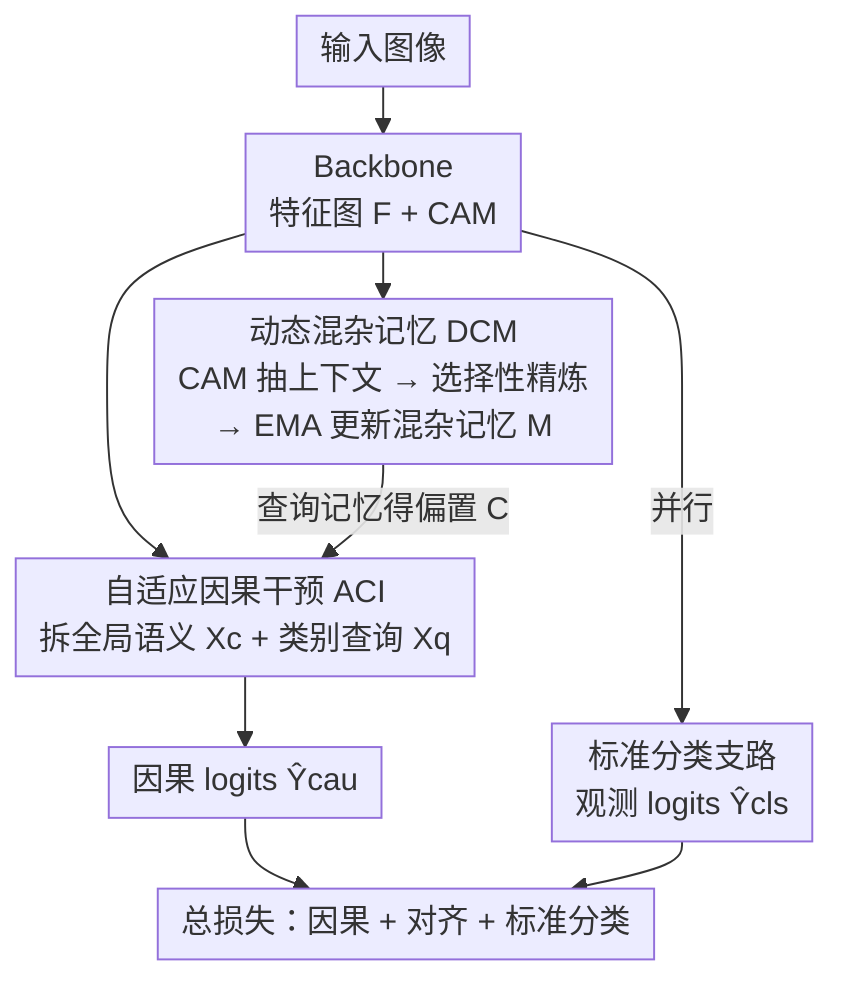

# Prototype-based Causal Intervention for Multi-Label Image Classification

**会议**: CVPR 2026  
**论文**: [CVF Open Access](https://openaccess.thecvf.com/content/CVPR2026/html/Li_Prototype-based_Causal_Intervention_for_Multi-Label_Image_Classification_CVPR_2026_paper.html)  
**代码**: https://github.com/JustinLiam/ProCI  
**领域**: 多标签图像分类 / 因果干预  
**关键词**: 后门调整, 混杂因子, 可学习原型, 多标签分类, 去偏

## 一句话总结
ProCI 把多标签分类里的"混杂上下文"建模成一组**可学习的类别级原型**，用一块动态记忆存它们、再用一个自适应模块在特征空间近似 Pearl 的后门调整，从而**只靠图像级标签**就能掰掉模型对虚假共现的依赖——在重度混杂的工业数据集 Sewer-ML 上把 F2CIW 刷高 +5.44 分。

## 研究背景与动机
**领域现状**：现代多标签图像分类（MLC）在 MS-COCO、VOC 这类标准 benchmark 上 mAP 已经刷得很高，但模型实际是靠数据集里的**虚假共现**（spurious correlation）取巧——比如训练集里"沙发"总和"电视"一起出现，模型就学会看到沙发就猜电视。一旦部署到分布不同的真实场景，这些"捷径"失效，性能崩塌。

**现有痛点**：用因果推断去混杂（de-confounding）是公认更有原则的路子，但已有的因果方法有两个落地硬伤。其一，很多方法的干预**依赖实例级 bounding box**（要框出物体才能算混杂特征），而大规模工业数据往往只有图像级标签，根本没有框。其二，主流近似是把混杂因子建成一本**静态混杂字典**：训练前一次性算好（平均 box 特征或聚类全局特征），之后固定不动。这本字典天生"过拟合"到构造集的统计偏置，无法适应训练中特征空间的漂移，也表达不了复杂、未预见的偏置。

**核心矛盾**：后门调整 $P(Y|do(X)) = \sum_z P(Y|X,z)P(z)$ 要对所有混杂因子 $Z$ 求和，但 $Z$ 不可观测、高维、潜在，直接枚举求边际是 intractable 的。于是大家要么退而用 box 监督，要么用静态字典——两条退路都和"只有图像级标签 + 偏置会动"的现实冲突。

**本文目标**：设计一个框架，**只用图像级标签**就能动态地学出混杂因子的表示，并在特征空间完成后门调整。

**切入角度**：作者借用了 few-shot 里"原型"的思想，但反着用——传统原型表示一个类的**判别性本质**，而 ProCI 用原型去表示一个类**共现的上下文偏置**。关键观察是：在共现偏置下，CAM（类激活图）是被"污染"的信号，必然把目标特征和上下文线索混在一起，所以可以从 CAM 里蒸馏出上下文原型。

**核心 idea**：把混杂因子建成**可学习的类别级上下文原型**，存进一块随训练动态更新的记忆，再用它构造样本特定的偏置向量去校正特征——用"动态可学原型"替掉"静态字典 + box 监督"。

## 方法详解

### 整体框架
ProCI 要解决的是"只有图像级标签时，如何近似不可计算的后门调整 $P(Y|do(X))$"。整体由两个协同的因果模块加一条辅助分类支路组成：**DCM（动态混杂记忆）** 负责"建混杂"——用 CAM 抽出每个类的上下文特征，经一个选择性精炼器过滤后，持续更新一块混杂记忆 $M$；**ACI（自适应因果干预）** 负责"去混杂"——把图像表示拆成全局语义特征和类别查询，用查询去记忆里查出样本特定的混杂表示，再把它和全局语义融合产出因果 logits。与此并行，一条**标准分类支路**学常规的观测概率 $P(Y|X)$，作为互补信号稳住训练。

### 关键设计

**1. 动态混杂记忆 DCM：用可学原型 + 选择性精炼替掉静态字典**

这一设计直接打的是"静态字典不可适应"的痛点。ProCI 维护一块可学习记忆 $M \in \mathbb{R}^{K\times D}$（$K$ 个类，每类一个 $D$ 维上下文原型），目标不是去显式建不可观测的 $Z$，而是去逼近它**可观测的效应**——和某个类稳定共现的上下文模式。第一步是上下文特征提取：用 CAM 做加权池化，把特征图 $F$ 按类激活权重聚成每类特征 $Z_{b,k}=\sum_{h,w}\frac{\mathrm{ReLU}(A[b,k,h,w])}{\sum_{h',w'}\mathrm{ReLU}(A[b,k,h',w'])}\cdot F_b[:,h,w]$，这步把"和类 $k$ 共现的主导模式"抽出来。

光对一个 batch 的 $Z_{:,k}$ 做平均是次优的，因为 CAM 特征有噪声、样本间波动大。于是作者上**选择性原型精炼器**，分两步走："批内选择性"用一个轻量、类别专属的偏好向量 $w_k$ 给每个样本打分 $s_{b,k}=w_k^\top Z_{b,k}$，softmax 归一化成注意力权重 $a_{b,k}$，加权得到精炼后的批原型 $\hat m_k=\sum_{b\in B_k}a_{b,k}Z_{b,k}$，让高质量样本权重更大、压住离群点；"批间稳定性"再用动量 $\alpha$ 的 EMA 平滑更新 $M_k \leftarrow \alpha M_{k-1}+(1-\alpha)\hat m_k$（更新后 L2 归一化）。EMA 维护的是跨 batch 的长期记忆，避免新 batch 覆盖掉早先学到的混杂模式。和静态字典的根本区别在于：原型是从 CAM 里持续蒸馏、随特征空间一起漂移的，而不是训练前算好就冻住。

为了让喂给记忆的上下文证据别太散，DCM 还加一个轻量**对齐损失**把特征空间收紧：用 L2 归一化后的特征 $\tilde Z_{b,k}$ 和原型 $\tilde M_j$，

$$\mathcal{L}_{ali}=-\frac{1}{|P|}\sum_{(b,k)\in P}\log\frac{\exp(\tilde Z_{b,k}\cdot\tilde M_k/\tau)}{\sum_{j=1}^{K}\exp(\tilde Z_{b,k}\cdot\tilde M_j/\tau)}$$

其中 $P$ 是 batch 内的正样本对（$Y_{b,k}=1$），$\tau$ 是温度。它让每个上下文特征贴近自己类的原型、又和别的原型可区分，从而降低特征级噪声、稳住记忆更新。

**2. ACI 自适应因果干预：在特征空间近似后门调整**

DCM 把混杂表示建好后，ACI 负责真正执行干预、把真因果语义（物体本身）从混杂效应（它的共现上下文）里剥出来。第一步是**特征解耦**：把图像表示拆成两路——全局语义特征 $X_c$（context-agnostic 的内容，对最终 backbone 特征图做全局平均池化再 L2 归一化）和类别查询 $X_q$（用类别条件特征 $Z$ 当查询，专门去推断 $Z$ 所代表的上下文）。这一拆很关键：$X_c$ 来自全局特征，$X_q$ 来自类别条件特征、天然更容易捕到共现上下文。

第二步是**自适应混杂估计**：用查询去记忆里"查"出条件期望的混杂表示。作者把归一化原型 $\tilde M_j$ 当作离散的混杂候选，对每个 $Z_{b,k}$ 做一次注意力检索——$(q_{b,k},k_j)=(\mathrm{Norm}(W_q Z_{b,k}),\mathrm{Norm}(W_k\tilde M_j))$，$\beta_{b,k,j}=\mathrm{Softmax}_j\big((q_{b,k}\cdot k_j^\top)/\tau_{aci}\big)$，最后 $C_{b,k}=\sum_{j=1}^{K}\beta_{b,k,j}\tilde M_j\approx \mathbb{E}[z\mid Z_{b,k}]$。这一步本质就是把后门调整里对 $Z$ 的边际化，近似成"在有限原型候选上按注意力加权求期望"，从而把那个 intractable 的求和变得可算。

第三步是**因果 logit 计算**。作者没有粗暴地"减掉偏置"，而是学一个混杂感知的调制函数 $g$：把全局特征 $X_c$ 扩展到与 $C$ 同形后拼接，过一个 MLP（LayerNorm→Tanh→Linear）——$h=\mathrm{Tanh}(\mathrm{LayerNorm}([X_{c,\text{expanded}}\oplus C]))$，$\hat Y_{cau}=W_{cau}h+b_{cau}$。这样训练出来的分类器被鼓励主要走因果路径（经 $X_c$），同时把虚假路径（经 $C$）显式纳入考量后再下权，得到的就是对 $P(Y|do(X))$ 的特征级近似。⚠️ 公式 8–12 的张量形状与投影细节以原文为准。

### 损失函数 / 训练策略
联合优化三项：$\mathcal{L}_{total}=\mathcal{L}_{cau}+\lambda_{ali}\mathcal{L}_{ali}+\lambda_{cls}\mathcal{L}_{cls}$。其中 $\mathcal{L}_{cau}$、$\mathcal{L}_{cls}$ 分别是因果 logits $\hat Y_{cau}$ 和标准 logits $\hat Y_{cls}$ 上的分类损失，都用非对称损失 ASL 实现；$\mathcal{L}_{ali}$ 是上面的对齐损失。实验取 $\lambda_{cls}=\lambda_{ali}=1.0$。训练用 AdamW + cosine 衰减 + 混合精度，共 50 epoch；其中**对齐损失和因果损失在前 10 个 epoch 之后才激活**，先让混杂记忆稳定下来再开始干预。

## 实验关键数据

### 主实验
四个数据集：MS-COCO、Pascal VOC 2007、COCO-Stuff（测共现偏移鲁棒性）、Sewer-ML（130 万张图的重度混杂工业数据）。

MS-COCO（mAP，%）随骨干提升、Transformer 上增益更明显：

| 骨干 | 方法 | mAP | CF1 | OF1 |
|------|------|-----|-----|-----|
| ResNet-101 (576) | CMLL（前SOTA） | 86.5 | 81.2 | 82.8 |
| ResNet-101 (576) | **ProCI** | **87.0** | **82.3** | **83.7** |
| TResNet-L (448) | CMLL | 89.2 | 83.8 | 85.6 |
| TResNet-L (448) | **ProCI** | **90.1** | **84.2** | **86.1** |
| Swin-L (21k) | Q2L-SwinL | 90.5 | 85.4 | 86.4 |
| Swin-L (21k) | **ProCI** | **91.4** | **87.1** | **89.0** |

值得注意：ProCI 用只在 ImageNet-1k 预训练的 Swin-Base 就拿到 90.7% mAP，反超用更大 Swin-L(21k) 的 Q2L（90.5%），显示出对预训练规模的鲁棒性。

Pascal VOC 2007（TResNet-L, 448）：ProCI 96.0% mAP，比前 SOTA OPRL（95.1%）高 **+0.9**，20 类里有 14 类取得最佳/并列最佳 AP。VOC 共现稀疏（约 1.5 标签/图），在这种低相关场景仍有显著增益，说明 ProCI 不只是压共现，而是真的强化了以物体为中心的表示。

重度混杂的 Sewer-ML（TResNet-L, 224）是最能体现方法价值的战场：

| 类型 | 方法 | F2CIW (%) | F1Normal (%) |
|------|------|-----------|--------------|
| End-to-end | TResNet-L | 54.63 | 81.22 |
| End-to-end | SPM（前SOTA） | 63.38 | 91.57 |
| End-to-end | **ProCI** | **68.82** | **92.65** |

ProCI 比同骨干非因果 baseline 高 **+14.19** F2CIW，比前最强 SPM 高 **+5.44**。COCO-Stuff 共现偏移下（mAP）也大幅领先：exclusive 39.3（前 SOTA 31.0，+8.3）、co-occur 75.9（+5.6）、all 64.5。

### 消融实验
在 Sewer-ML 上逐件拆（F2CIW / F1Normal，%）：

| 配置 | F2CIW | F1Normal | 说明 |
|------|-------|----------|------|
| Baseline | 54.63 | 81.22 | 纯 TResNet-L |
| w/o $\mathcal{L}_{cls}$ | 53.04 | 77.43 | 去掉标准分类，反而比 baseline 还差 |
| w/o ACI | 59.37 | 85.96 | 去掉干预模块，掉 **9.45** |
| w/o $\mathcal{L}_{ali}$ | 65.92 | 91.63 | 去对齐损失，掉 2.90 |
| **ProCI (Full)** | **68.82** | **92.65** | 完整模型 |
| – 用 mean pooling | 64.38 | 89.70 | 选择性注意力换成均值池化，掉 4.44 |
| – 用 hard update | 67.49 | 90.03 | EMA 软更新换成硬更新，掉 1.33 |

### 关键发现
- **ACI 干预模块贡献最大**：去掉它 F2CIW 掉 9.45 分，说明"特征级去混杂"这一步才是性能的主来源，DCM 只是为它提供混杂表示。
- **标准分类支路是地基不是配角**：去掉 $\mathcal{L}_{cls}$ 反而比 baseline 还低（53.04 < 54.63），印证它提供了图像级监督下稳定发现混杂所需的"语义锚点"。
- **选择性精炼 + EMA 软更新都有用**：换均值池化掉 4.44、换硬更新掉 1.33，证明"批内选可靠样本 + 批间稳记忆"两步缺一不可。
- 定性上，baseline CAM 把注意力错放在亮眼的检查探头（虚假上下文）上，Confounder-CAM 显示 DCM 确实内化了探头这个偏置，而 ProCI-CAM 把探头响应压下去、重新聚焦到真正的缺陷"错位接头"区域。

## 亮点与洞察
- **把"原型"反着用**是最妙的一笔：few-shot 里原型表示类的判别本质，这里却让原型去表示类的**共现偏置**，于是去偏这件事就有了一个可学、可解释、可随训练漂移的载体。
- **把 intractable 的后门求和变成"有限原型上的注意力期望"**：$\sum_z P(Y|X,z)P(z)$ 的边际化被近似成对 $K$ 个原型候选按注意力加权，这个"离散化 + 软检索"的近似很务实，是只靠图像级标签就能落地的关键。
- **不减偏置而是学调制函数**：不去做 counterfactual 减法，而是把全局语义 $X_c$ 和混杂 $C$ 拼起来过 MLP，让分类器自己学会"主走因果路、把虚假路下权"，比硬减更稳。
- 这套"动态记忆建偏置 + 自适应检索去偏"的思路可迁移到任何有强共现偏置、又缺细粒度标注的弱监督任务（如医学多标签、遥感地物）。

## 局限与展望
- 作者承认：扩到**大词表、多共现标签**的数据集还需进一步研究；对 travel、street、sunset 这类**没有显著锚点的抽象类别**，CAM 会变得弥散，原型表示会失效。
- ⚠️ 自己看：方法整体强依赖 CAM 的质量来抽上下文特征，虽然文中称 DCM 对 CAM 定位质量鲁棒（附录 B），但抽象类 CAM 弥散的局限恰恰说明这个依赖在某些场景仍是瓶颈。
- 对齐损失、因果损失要等 10 个 epoch 后才开，这个"预热"时机像是个需要调的超参，对不同数据集的稳健性未充分讨论。
- 改进方向：作者提出要发展更有表达力的混杂表示来突破上述瓶颈；可考虑给抽象类引入文本/语义先验来补 CAM 弥散的不足。

## 相关工作与启发
- **vs 静态混杂字典方法（如 Chen et al. [7]、CMLL [37]）**: 他们训练前一次性算好混杂字典（平均 box 特征或聚类全局特征）然后冻住，本文则用 EMA 维护一块随训练动态更新的可学记忆，区别在于能否适应特征空间漂移——本文优势是灵活、表达力强，代价是多了记忆更新和对齐损失的开销。
- **vs 依赖 box 的因果干预（如 IDA [24]）**: 他们的干预要实例级 bounding box，本文只用图像级标签 + CAM 抽上下文，适用面更广（尤其工业大规模数据），但精度上限可能受 CAM 质量制约。
- **vs 数据/表示层补丁（re-sampling、SpliceMix-CL [38]、OPRL [54]）**: 这些方法只是"打补丁"缓解偏置症状，本文显式建模并干预底层因果机制，在重度混杂的 Sewer-ML 上拉开 +5.44 的差距正是这一区别的体现。

## 评分
- 新颖性: ⭐⭐⭐⭐⭐ "原型表偏置 + 动态记忆近似后门调整 + 只用图像级标签"三点组合很新
- 实验充分度: ⭐⭐⭐⭐ 四数据集 + 多骨干 + 完整消融 + 定性可视化，但部分对比依赖复现/报告结果
- 写作质量: ⭐⭐⭐⭐ 因果链条和模块职责讲得清晰，公式标注规范
- 价值: ⭐⭐⭐⭐⭐ 在重度混杂工业场景大幅刷 SOTA，弱监督去偏的实用价值高

<!-- RELATED:START -->

## 相关论文

- [\[CVPR 2026\] Revisiting F-measure Optimization in Multi-Label Classification: A Sampling-based Approach](revisiting_f-measure_optimization_in_multi-label_classification_a_sampling-based.md)
- [\[CVPR 2026\] Cross-View Distillation and Adaptive Masking for Incomplete Multi-View Multi-Label Classification](cross-view_distillation_and_adaptive_masking_for_incomplete_multi-view_multi-lab.md)
- [\[CVPR 2026\] Rethinking BCE Loss for Multi-Label Image Recognition with Fine-Tuning](rethinking_bce_loss_for_multi-label_image_recognition_with_fine-tuning.md)
- [\[CVPR 2026\] Advancing Image Classification with Discrete Diffusion Classification Modeling](advancing_image_classification_with_discrete_diffusion_classification_modeling.md)
- [\[CVPR 2026\] DF²-VB: Dual-level Fuzzy Fusion with View-specific Boosting for Multi-view Multi-label Classification](df2-vb_dual-level_fuzzy_fusion_with_view-specific_boosting_for_multi-view_multi-.md)

<!-- RELATED:END -->
