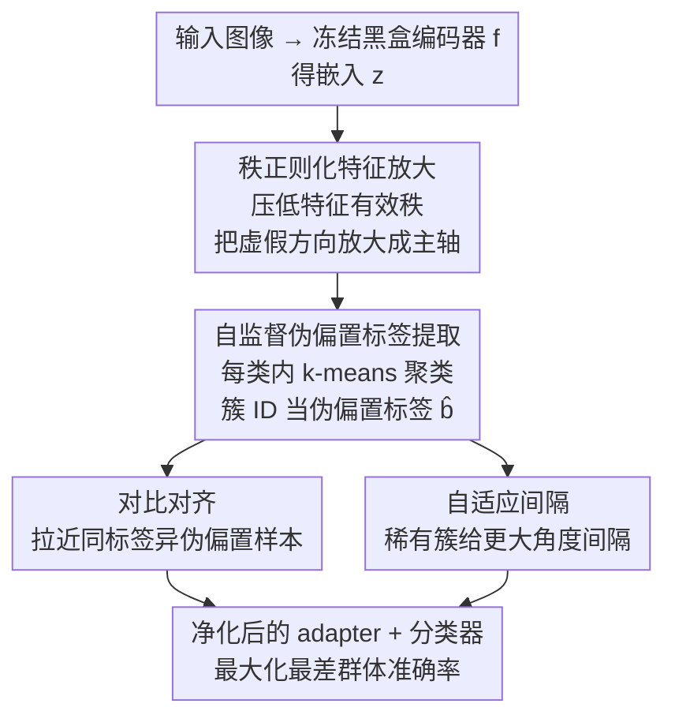

# Rank-Guided Pseudo-Bias Learning for Robust Black-Box Adaptation

**会议**: CVPR 2026  
**论文**: [CVF Open Access](https://openaccess.thecvf.com/content/CVPR2026/html/Dwivedi_Rank-Guided_Pseudo-Bias_Learning_for_Robust_Black-Box_Adaptation_CVPR_2026_paper.html)  
**代码**: 无  
**领域**: 黑盒适配 / 群体鲁棒性 / 公平性  
**关键词**: 黑盒去偏, 最差群体准确率, 秩正则化, 伪偏置标签, 自适应间隔

## 一句话总结
PLD-Debias 在完全冻结、参数不可见的预训练视觉编码器之上挂一个轻量 adapter，先用秩正则化把潜在的虚假相关方向"放大"出来、再聚类得到 90%+ 保真度的伪偏置标签，最后用对比对齐 + 聚类自适应间隔两路 loss 净化表示，在 CelebA / Waterbirds / CMNIST 上无需任何群体标注就把最差群体准确率刷到 SOTA。

## 研究背景与动机
**领域现状**：CLIP、DINOv2、SAM 这类基础模型被当成冻结的特征提取器复用已经是标准做法。但它们从预训练语料里继承了大量虚假相关（spurious correlation）——比如把"水鸟"和"水背景"绑定、把"金发"和"女性"绑定，导致少数子群体（如金发男性、陆地背景的水鸟）的准确率断崖式下跌。论文引用的数据是 CLIP 零样本分类在最差群体上能掉到比平均低 80.7 个点。

**现有痛点**：传统的群体鲁棒方法（Group-DRO、对抗去偏、LfF）都假设训练时能拿到显式的群体标签（性别、背景等）。但现实里这些标注因隐私、成本、或编码器本身是黑盒 API 而拿不到。而且重训基础模型在算力上不现实。

**核心矛盾**：要在"编码器参数不可访问（黑盒）+ 没有群体标签（无监督）"这两个约束同时成立的极端设定下做去偏。已有的无标签方法各有缺口：JTT 这类要靠梯度重训、和黑盒 API 不兼容；Co-Adapt（对比 adapter）只学表示、不修分类边界，对严重类别不平衡敏感；Cluster-Margin（CM）只放大决策间隔、不学鲁棒表示。没有方法能同时把"学好表示"和"重标定分类置信度"两件事一起做。

**切入角度**：作者观察到——既然虚假特征是"容易学到的主方向"，那就反其道而行，主动用**秩正则化**逼 adapter 的特征协方差塌缩到少数主方向上，让虚假属性被刻意放大、从而在特征空间里变得高度可分。放大之后再聚类，就能近乎完美地按隐藏偏置把样本分开。

**核心 idea**：把"放大偏置 → 聚类得伪标签 → 对比对齐 + 自适应间隔去偏"缝成一条端到端、不碰 backbone 的流水线（PLD-Debias），用 adapter 驱动出来的伪偏置标签替代真实群体标注。

## 方法详解

### 整体框架
方法要解决的是：在冻结黑盒编码器 $f$ 之上，只训练一个 adapter $g_\phi$ 和分类器 $h_\theta$，在没有偏置标签 $b$ 的前提下最大化最差群体准确率 WG-Acc。整条流水线分三个阶段串行：**阶段 1** 用秩正则化训练 adapter，把潜在虚假方向放大成可分的簇；**阶段 2** 在每个类别内对放大后的特征做 k-means，得到伪偏置标签 $\hat b_i$；**阶段 3** 拿伪标签同时跑对比对齐 loss 和聚类自适应间隔 loss，把表示净化、把决策边界向少数群体倾斜。整个过程 backbone 始终冻结，是一个即插即用的分类器 adapter。

记输入 $x_i$ 经冻结编码器得到嵌入 $z_i = f(x_i)$，adapter 输出 $u_i = g_\phi(z_i)$，群体 $G_{y,b} := \{i : y_i = y, b_i = b\}$，鲁棒性指标为

$$\text{WG-Acc}(h) = \min_{(y,b)} \frac{1}{|G_{y,b}|} \sum_{i \in G_{y,b}} \mathbb{1}[h(g_\phi(z_i)) = y_i].$$

### 关键设计

**1. 秩正则化特征放大：主动把虚假方向"做大"再消灭**

直接在黑盒特征上聚类很难分出偏置群体，因为虚假信号被淹没在主任务信号里。作者的反直觉做法是先放大它。设当前 mini-batch 的中心化 adapter 输出矩阵为 $U \in \mathbb{R}^{n \times p}$（每行 $U_{i,:} = u_i - \bar u$），定义对角阵 $D = \text{diag}(\frac{1}{n} U^\top U)$ 和归一化相关矩阵 $C = D^{-1/2}(\frac{1}{n} U^\top U) D^{-1/2}$，训练目标为

$$L_{\text{rank}} = L_{\text{CE}}(h_\theta(g_\phi(z_i)), y_i) - \lambda_{\text{rank}} \sum_{j \neq k} C^2_{jk}.$$

注意符号：惩罚项是 $-\lambda_{\text{rank}} \sum_{j\neq k} C^2_{jk}$，即**奖励**特征间的高相关、**鼓励**离对角能量增大，从而把方差挤压到少数主方向、降低有效秩。论文借 Davis–Kahan 定理论证：正则化后相关矩阵的主特征向量会对齐到潜在偏置方向 $v_b$，eigengap 越大、偏置方向越可识别。几个 epoch 后，adapter 的倒数第二层激活就形成了按偏置良好分离的簇。这一步是整条流水线的地基——它直接决定了后面伪标签的保真度。

**2. 自监督伪偏置标签提取：在每个类内聚类换出群体监督信号**

放大之后，作者**在每个任务类别 $c$ 内部**单独跑 k-means（按 silhouette score 在留出子集上选 $k$，实验里 $k \in \{4,6\}$），把簇索引直接当伪偏置标签 $\hat b_i$。在类内聚类而非全局聚类，是为了让聚类抓的是"同类内部的偏置差异"（如金发组里的男 vs 女）而不是任务类别本身。论文强调正是前一步的秩正则化提高了偏置特征的信噪比，才让误聚类变得罕见——实测伪标签在 CMNIST 上 >98%、Waterbirds 上 >92% 匹配真实偏置标注，几乎逼近 oracle。

**3. 对比对齐 + 自适应间隔：表示净化与边界重标定双管齐下**

拿到伪标签后用两路 loss 消除残余虚假相关。**对比对齐**构造正对集 $P = \{(i,j): y_i = y_j, \hat b_i \neq \hat b_j\}$（同任务标签、异伪偏置）和负对集 $N = \{(i,j): y_i \neq y_j\}$，温度缩放的有监督对比损失为

$$L_{\text{con}} = -\frac{1}{|B|} \sum_{i \in B} \log \frac{\sum_{j \in P_i} \exp(\cos(u_i,u_j)/\tau)}{\sum_{j \in P_i \cup N_i} \exp(\cos(u_i,u_j)/\tau)}.$$

它显式地把"标签一致但偏置不同"的样本拉到一起、塌缩掉前面放大出来的虚假方向。**自适应间隔**则给稀有的偏置簇更大的角度间隔来平衡决策边界：类 $c$ 在伪偏置簇 $\hat b$ 上的间隔从正态分布采样

$$m^{\hat b}_c \sim \mathcal{N}\!\left(1 - \frac{n^{\hat b}_c + \epsilon}{\sum_{c' \in C} n^{\hat b}_{c'} + \epsilon},\, \sigma\right),$$

其中 $n^{\hat b}_c$ 是簇 $\hat b$ 里类 $c$ 的样本数——样本越少、均值越接近 1、间隔越大。把它塞进角度 softmax，logit 变成 $\ell_{i,k} = s\cos(\theta_{i,k} + m^{\hat b_i}_k)$（$\theta_{i,k} = \arccos\frac{w_k^\top u_i}{\|w_k\|\|u_i\|}$，$s$ 为缩放因子），得到自适应间隔交叉熵 $L_{\text{AM}}$。这一路正好补上 Co-Adapt 只学表示不修边界、CM 只修边界不学表示的缺口。

### 损失函数 / 训练策略
两阶段训练。**阶段 1**（$T_1=100$ epoch）：冻结 backbone，用 $L^{(1)} = L_{\text{CE}} + \lambda_{\text{rank}} L_{\text{rank}}$ 放大偏置。中间做一次类内 k-means 固定伪标签。**阶段 2**（$T_2=100$ epoch）：用联合目标

$$L = L_{\text{AM}} + \lambda_{\text{con}} L_{\text{con}}$$

训练 adapter-分类器栈。超参 $\tau=0.5$，$s \in \{8,12\}$，$\sigma \in (0.10, 0.25)$，均在平衡验证集上调。论文还给了理论分解，把最差群体风险上界拆成 $R_{\max}(h_T) \le C_0(R_{\text{base}} + \varepsilon_{\text{clust}} + \alpha\lambda_{\text{con}} L_{\text{con}} + \Psi(m_{\min};\beta_{\min}) + \text{Opt}(T))$，说明聚类误差、跨群对齐、自适应间隔、优化精度各自如何贡献鲁棒性（⚠️ 理论部分较多假设，以原文为准）。

## 实验关键数据

### 主实验
三个数据集（CelebA / Waterbirds / CMNIST），三种 backbone（ResNet-18 / CLIP RN-50 / ViT-B/16），对比 ERM、Co-Adapt、Cluster-Margin（CM）。

| 数据集 | Backbone | 方法 | 最差群体↑ | 平均群体↑ | Gap↓ |
|--------|----------|------|-----------|-----------|------|
| CelebA | ResNet-18 | ERM | 27.20 | 75.43 | 48.23 |
| CelebA | ResNet-18 | CM (前SOTA) | 80.79 | 85.56 | 4.77 |
| CelebA | ResNet-18 | **本文** | **83.10** | 85.42 | **2.32** |
| Waterbirds | ResNet-18 | CM | 80.29 | 84.56 | 4.27 |
| Waterbirds | ResNet-18 | **本文** | **83.01** | 85.26 | **2.25** |
| Waterbirds | CLIP | **本文** | **84.92** | 87.07 | **2.15** |

CelebA 上最差群体比 ERM 高 44.2 个点、比前 SOTA CM 高 2.81 个点，同时把 Gap 压到 2.32%。CMNIST-0.9 上 CLIP backbone 的 bias-conflicting 准确率达 95.61%、Gap 收到 1.01%；即便在极端的 CMNIST-0.995 设定下（ERM 在 bias-conflicting 上基本失效）本文仍全面领先。

### 消融实验

| 配置 | Waterbirds 最差群体 | CMNIST-0.9 BCo | 说明 |
|------|---------------------|----------------|------|
| CE | 38.90 | 61.72 | 纯交叉熵基线 |
| CE + 对比 (CL) | 66.67 | 84.56 | 只加对比 loss，无间隔 |
| CM | 80.29 | 81.91 | 只有自适应间隔 |
| CM + CL（完整） | 83.01 | 89.14 | 两路 loss 全开 |

| 数据集 | ResNet | ViT | CLIP | 说明 |
|--------|--------|-----|------|------|
| Waterbirds | 93.62% | 80.58% | 92.43% | 伪偏置标签 vs 真值匹配率 |
| CMNIST-0.9 | 98.99% | 93.51% | 99.56% | 同上 |
| CMNIST-0.995 | 99.92% | 99.25% | 99.84% | 同上 |

### 关键发现
- **对比 loss 单独就很强**：只在 CE 上加对比对齐（无间隔），Waterbirds 最差群体从 38.90% 跳到 66.67%、CMNIST-0.9 的 bias-conflicting 从 61.72% 到 84.56%，已经超过 Co-Adapt 和 CM。说明伪标签驱动的对比公式本身就能学到更公平的表示。
- **两路互补**：对比（学表示）+ 自适应间隔（修边界）叠加才到完整效果，验证了"同时做表示与边界"这一动机。
- **伪标签逼近 oracle**：用真值偏置标签的 oracle 版本相比伪标签版本，Waterbirds 最差群体只高 +2.79%，几乎免费拿到了 oracle 级鲁棒性。
- **ViT 上伪标签保真度偏低**（如 Waterbirds 80.58%），是相对薄弱环节。

## 亮点与洞察
- **"先放大再消灭"的反直觉招**：大多数去偏想抑制虚假特征，本文反而先用秩正则化把它放大到可分，再聚类、再净化。把"难以观测的偏置"变成"显式可聚类的簇"，这是整篇最巧的一步。
- **伪偏置标签替代群体标注**：90%+ 保真度的无监督伪标签让"无群体标签 + 黑盒"这个最苛刻设定也能达到接近 oracle 的效果，对隐私敏感、只给 API 的部署场景很实用。
- **即插即用**：全程不碰 backbone，只是一个挂在冻结基础模型上的分类器 adapter，可迁移到任意冻结编码器的下游去偏场景。
- 秩正则化"压低有效秩 = 暴露主导偏置方向"的视角可迁移到其他需要"显式化隐藏因子"的任务（如概念发现、属性编辑）。

## 局限与展望
- **依赖偏置可被秩正则化放大**：方法假设虚假方向是"容易学的主方向"，对那些不占主方差、或多个偏置纠缠的复杂场景能否放大出可分簇存疑（⚠️ 论文未充分验证）。
- **类内聚类的 $k$ 需要调**：silhouette 选 $k$ 在群体结构不明显时可能不稳；ViT 上伪标签保真度明显低于 ResNet/CLIP，说明对 backbone 敏感。
- **CMNIST-0.995 上 Gap 仍大**：极端虚假相关下 ResNet-18 的 Gap 还有 25.42%，鲁棒性远未饱和。
- 实验集中在 CelebA/Waterbirds/CMNIST 三个经典 benchmark，UTKFace/BAR 放在附录，真实大规模场景的泛化性待考。

## 相关工作与启发
- **vs Group-DRO / LfF**：它们需要显式群体标签，本文用无监督伪标签替代，适配无标注 + 黑盒设定。
- **vs JTT**：JTT 靠梯度重训识别错误样本，和黑盒 API 不兼容；本文不碰 backbone、纯 adapter。
- **vs Co-Adapt（对比 adapter）**：Co-Adapt 只用模型自身预测引导对比、只学表示不修边界，对严重类别不平衡敏感；本文加了自适应间隔修正分类置信度。
- **vs Cluster-Margin（CM）**：CM 只在偏置特征空间放大决策间隔、不学鲁棒表示；本文把对比对齐和自适应间隔缝在一起，两路互补，主实验上全面超过 CM。
- **vs Rank Regularization（RR）**：RR 用高特征相关抑制秩来放大虚假属性，但 RR 单独不修分类边界；本文把秩正则化当作流水线第一阶段，再接伪标签 + 去偏两路 loss。

## 评分
- 新颖性: ⭐⭐⭐⭐ "先放大偏置再聚类去偏"的反直觉流水线，把多个已有组件缝成端到端黑盒方案
- 实验充分度: ⭐⭐⭐⭐ 三数据集三 backbone + 消融 + 伪标签保真度 + oracle 对比，但 benchmark 偏经典小数据集
- 写作质量: ⭐⭐⭐⭐ 方法清晰、理论分解完整，公式符号略多需对照原文
- 价值: ⭐⭐⭐⭐ 无群体标签 + 黑盒的即插即用去偏，对隐私敏感/仅 API 部署很有实用价值

<!-- RELATED:START -->

## 相关论文

- [\[CVPR 2026\] Bias In, Bias Out? Finding Unbiased Subnetworks in Vanilla Models](bias_in_bias_out_finding_unbiased_subnetworks_in_vanilla_models.md)
- [\[CVPR 2026\] Bias at the End of the Score](bias_at_the_end_of_the_score.md)
- [\[CVPR 2026\] Data-Centric Meta-Learning for Robust Few-Shot Generalization](data-centric_meta-learning_for_robust_few-shot_generalization.md)
- [\[CVPR 2026\] Revisiting Sparsity Constraint Under High-Rank Property in Partial Multi-Label Learning](revisiting_sparsity_constraint_under_high-rank_property_in_partial_multi-label_l.md)
- [\[NeurIPS 2025\] The Persistence of Neural Collapse Despite Low-Rank Bias](../../NeurIPS2025/others/the_persistence_of_neural_collapse_despite_low-rank_bias.md)

<!-- RELATED:END -->
