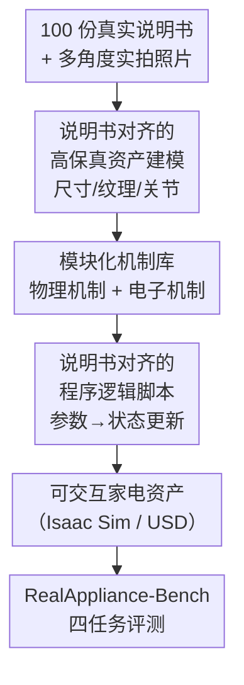

# RealAppliance: Let High-fidelity Appliance Assets Controllable and Workable as Aligned Real Manuals

**会议**: CVPR 2026  
**论文**: [CVF Open Access](https://openaccess.thecvf.com/content/CVPR2026/html/Gao_RealAppiance_Let_High-fidelity_Appliance_Assets_Controllable_and_Workable_as_Aligned_CVPR_2026_paper.html)  
**代码**: https://realappliance.github.io/  
**领域**: 具身智能 / 3D 数字资产 / 机器人  
**关键词**: 家电操作规划, 高保真铰接资产, 说明书对齐, 仿真机制, 多模态大模型评测

## 一句话总结
作者手工建模了 100 件与真实说明书严格对齐的高保真家电数字资产（尺寸/纹理/物理机制/电子机制/程序逻辑全部按真实说明书复刻），并在其上搭建 RealAppliance-Bench，用「说明书检索 / 部件 grounding / 开环规划 / 闭环纠偏」四个任务系统评测主流 MLLM 与具身规划模型，发现哪怕 GPT-5 在完整开环规划上成功率也只有个位数。

## 研究背景与动机
**领域现状**：要研究"机器人按说明书操作家电"，前提是要有逼真的家电数字资产。主流资产来源有 PartNet-Mobility（把家电当铰接物体、给旋钮/按钮/门配关节）、Infinite Mobility（自动化批量生成）、CheckManual（给资产自动配说明书）、ArtVIP（给铰接资产加阻尼/磁吸/触发机制）。

**现有痛点**：这些资产在三个维度都不够真。PartNet-Mobility 渲染质量低、组件"有关节但没机制"（按了不会有任何反应）；CheckManual 生成的说明书文字和插图离真实说明书很远；ArtVIP 虽然加了部分功能但资产数量少、旋钮等组件还是不可操作。更关键的是，**没有一套资产是直接照着真实说明书建的**——尺寸、纹理、机制、程序逻辑都和真实家电对不上，导致仿真到现实存在巨大 gap。

**核心矛盾**：家电不是被动工具，它有"状态机"——按一个触摸键会改变屏幕内容、启动电机、切换指示灯。只有把这套**程序逻辑**也复刻进仿真，资产才能像真家电一样"可操作、可工作"。而以往工作要么只做外观、要么只做机制，没人把"外观 + 物理机制 + 电子机制 + 程序逻辑 + 真实说明书"五件事一次对齐。

**本文目标**：(1) 造一套照着真实说明书建、视觉与功能都高保真的家电资产；(2) 在其上建一个能真实评测"看说明书操作家电"全流程能力的 benchmark。

**核心 idea**：以**真实说明书为唯一对齐基准**，把家电建成"尺寸/纹理/物理机制/电子机制/程序逻辑"逐项与说明书一致的可交互资产，再把"读说明书→定位部件→规划动作→闭环纠偏"拆成四个任务来逼真考查模型。

## 方法详解

### 整体框架
RealAppliance 的构建是一条四步串行流水线：先从多国收集真实家电说明书和实拍照片，再据此手工建模出高保真 3D 资产（含独立部件与精确碰撞体），接着给每个可动部件配置可复用的**物理/电子机制**类，最后照说明书的操作流程写出每件家电的**程序逻辑脚本**，让资产在 Isaac Sim 里像真家电一样响应交互。有了这批资产后，作者再搭建 RealAppliance-Bench，用四个评测任务覆盖"读说明书→定位→规划→纠偏"的完整链路。

### 关键设计

**1. 说明书对齐的高保真资产建模：让尺寸/纹理/关节都"照着真说明书来"**

针对"现有资产尺寸纹理对不上真实家电"的痛点，作者把建模流程整个绑定到真实说明书与实拍照片上。收集说明书时遵循四条原则：剔除按钮太小、机械臂操作不了的家电；选长度适中、能塞进 MLLM 上下文的说明书；要求组件和操作流程描述清晰；要求说明书带尺寸和高清产品图。最终得到 14 类、100 件家电的说明书（覆盖中/俄/法/德等多语种）。建模在 3Ds Max 里按说明书尺寸和照片做，每个功能部件**独立建模并配精确碰撞体**，用 TurboSmooth 提升面数；纹理上做 UV 展开并据实拍照片绘制高分辨率 UV 贴图（logo、刻度都还原）。导入 Isaac Sim 生成 USD 资产后，部件**按说明书里的术语命名**以便检索，并按真实运动方式配关节——旋钮/铰链门/翻盖用旋转关节，机械按钮/滑块/推拉门用平移关节，触摸键/屏幕等不动的界面用固定关节。

**2. 模块化机制库：把"按了才有反应"做成可插拔的物理 + 电子机制类**

这是让资产从"能动"升级到"能工作"的核心。作者把每种机制封装成一个**遵循统一接口的独立类**，可模块化组合/替换/扩展，再按家电需要给部件挂上对应机制。机制分两大类：**物理机制**复刻力驱动行为——内置弹簧（如烤面包机弹起吐司）、磁吸（洗衣机门密封）、机械触发（微波炉开门键弹门、关门键复位所有按下的键）、旋钮倒计时驱动（空气炸锅计时旋钮工作时转回零并停机）、安全锁（搅拌机机头需按键/转旋钮才能抬起）；**电子机制**复刻传感/电机/显示——屏幕显示（实时生成屏幕区域纹理来显示温度/时间）、触摸感应（给触摸键绑虚拟接触传感器检测外力触发）、照明（微波炉工作时内灯自动亮）、Logo 指示灯（洗衣机闪状态图标报完成）、旋转电机（微波炉转盘匀速转动）。和 ArtVIP 只加了阻尼/磁吸/触发相比，这里把"屏幕实时改、电机随状态转、灯随状态亮"这类**有状态的电子反馈**也补齐了。

**3. 说明书对齐的程序逻辑：用"设定参数"把各部件串成一台真正会工作的状态机**

只有机制还不够，部件之间得有逻辑联动才像真家电。作者为每件家电写一个程序脚本，分三步：先据说明书**定义设定参数**（如电源状态、温度、时间、工作模式）及其候选取值范围（如电源是 0/1 二值），这些参数是部件间信息传递的纽带；再**配置部件机制**——每个组件的机制类继承对应机制基类，按该家电的功能特性改参数和函数；最后**设计程序逻辑**——主要靠监测设定参数的状态并相应更新部件状态，当某参数进入预定义区间就更新相关部件状态、必要时还联动调整其他参数。论文给的例子很直观：按触摸键改变屏幕内容、启动搅拌机旋转或切换指示灯，从而在仿真里复现真实操作流程（如"接触温度键→进入测温态→上调键让 time_v 自增并重绘屏幕纹理"这样的循环）。

**4. RealAppliance-Bench：把"看说明书操作家电"拆成四个可量化任务**

针对以往评测的两类缺陷（ApBot 的状态机评测没有视觉反馈、还假设能直接拿到准确的操作后状态；ManualPlan 用合成说明书、文图都离真实差很远），作者基于真实说明书 + 可操作资产搭了带真实视觉反馈的 benchmark，含四个核心任务：**任务 1 说明书页检索**（给说明书和目标页类别，找出相关页，用 precision/recall 评，目的是减小推理开销）；**任务 2 开环规划**（给指令、说明书、初始观测图，从 9 类家电操作动作 + 4 类原子物体操作动作里选动作排出完整步骤，用任务完成率/成功率评，且一步的原子动作和参数全对才算对、所有步全对计划才算对）；**任务 3 部件 grounding**（给说明书和目标部件名，在当前观测图里预测 $[x_1,y_1,x_2,y_2]$ 包围框，用平均 IoU 和 mAP@0.5 评）；**任务 4 闭环纠偏**（在操作中注入固定位置和幅度的扰动如开门/拨旋钮/改屏幕，给说明书+指令+执行历史+初始规划+实时观测，预测下一步原子动作，用逐步成功率评）。此外还有**任务 5 全流程推理**把上述串起来端到端跑（任一部件定位 IoU<0.5 或任一动作预测错即判失败，用"魔法操作"执行以排除底层策略误差）。

### 损失函数 / 训练策略
本文是数据集 + benchmark 工作，不训练模型，无损失函数；评测对象是现成的专有/开源 MLLM 与具身规划模型（零样本/带思维链调用）。

## 实验关键数据

### 资产保真度与规模对比
RealAppliance 是唯一同时满足"真实尺寸 + 真实纹理 + 物理逻辑 + 电子组件 + 电子逻辑 + 真实说明书"的家电资产集。

| 数字资产 | 类别数 | 家电数 | 真实尺寸 | 真实纹理 | 物理逻辑 | 电子逻辑 | 说明书 |
|----------|--------|--------|----------|----------|----------|----------|--------|
| PartNet-Mobility | 17 | 636 | ✗ | ✗ | ✗ | ✗ | ✗ |
| CheckManual | 11 | 369 | ✗ | ✗ | ✗ | ✗ | 合成 |
| Infinite Mobility | 5 | – | ✗ | ✗ | ✗ | ✗ | ✗ |
| ArtVIP | 12 | 49 | ✓ | ✓ | ✓ | ✗ | ✗ |
| **RealAppliance（本文）** | **14** | **100** | ✓ | ✓ | ✓ | ✓ | **真实** |

数据规模：100 件家电共 589 个可操作部件，979 个操作规划任务、941 个中途干扰步，指令平均 766.18 词、规划平均 7.57 步。50 人用户调研在尺寸/材质/纹理三维度按 0–5 打分，本文资产真实感优于 ArtVIP / Infinite-Mobility / PartNet-Mobility（具体分见原文图 4）。

### 主实验：模型在四任务上的表现
总体规律——专有 MLLM > 开源 MLLM > 端到端具身规划模型；但**完整开环规划普遍灾难性地低**，说明 benchmark 很难。

| 任务（指标，Total） | GPT-5 | Gemini 2.5 Pro | Qwen3-VL 235B Think | RoboBrain 2.0-32B | ManualPlan |
|---------------------|-------|----------------|---------------------|-------------------|------------|
| 任务1 说明书检索（Recall/F1） | 86.50/80.89 | 90.00/79.40 | 81.00/80.06 | 68.07/62.47 | 45.83/38.03 |
| 任务2 开环规划（完成率/成功率） | 4.30/1.22 | 4.08/2.45 | 4.36/1.73 | 0.37/0.00 | 5.61/0.40 |
| 任务3 部件 grounding（Avg IoU/mAP@0.5） | 12.15/8.59 | 8.16/6.64 | 2.80/0.87 | 0.00/0.00 | 1.92/0.00 |
| 任务4 闭环纠偏（逐步成功率） | 29.61 | 31.73 | – | 0.00 | – |

注：表中为 14 类家电的总均值（原文逐类列出）。⚠️ 闭环纠偏部分行（如 Qwen3-VL 235B Thinking）原文未在已读片段给出 Total，以原文为准。

### 关键发现
- **开环完整规划几乎全军覆没**：哪怕 GPT-5 的开环"任务成功率"也只有约 1.22%，最强不过 Gemini 2.5 Pro 的 2.45%——因为"全步骤、全参数都对才算对"，长程多步规划极易在某一步翻车。
- **闭环纠偏明显比开环规划容易**：逐步成功率能到约 30%，说明给模型实时视觉反馈、只让它预测"下一步"时，难度远低于一次性排出完整计划。
- **检索强 ≠ 操作强**：说明书页检索任务大模型能到 80%+ F1，但一到部件 grounding（GPT-5 才 ~12 IoU）和动作规划就断崖式下跌，暴露"看懂文档"与"落到具体空间操作"之间的鸿沟。
- **端到端具身规划模型水土不服**：RoboBrain 2.0-7B 在多项任务直接 0 分，32B 也只在检索上勉强可用，说明现有具身规划模型在"说明书驱动家电操作"这一长程、细粒度场景下泛化很差。

## 亮点与洞察
- **"程序逻辑"是这套资产真正的护城河**：别人最多做到"门能开、旋钮能转"，本文把"按键→改参数→联动改屏幕/电机/灯"的状态机也复刻了，资产因此能"工作"而不只是"会动"，这是缩小 sim-to-real gap 的关键一步。
- **机制做成统一接口的独立类**：物理/电子机制 OOP 封装、可插拔组合，意味着加新家电主要是"挑机制 + 写参数 + 接说明书逻辑"，扩展成本低——这套工程化思路可直接迁移到其他铰接交互资产（玩具、工具、医疗设备）。
- **以真实说明书为对齐锚点**是个聪明的"标准答案"来源：说明书天然提供了部件名、尺寸、操作流程，既给建模当 ground truth，又给评测当多语种长文档理解的素材，一举两得。
- **benchmark 的"难"本身就是贡献**：开环成功率个位数把当前 MLLM/具身模型的天花板钉得很清楚，为后续"看说明书操作家电"研究指明了 grounding 与长程规划两个主攻点。

## 局限与展望
- **资产靠手工建模，规模受限**：100 件家电、14 类是高质量但小样本，全程 3Ds Max/Photoshop/Isaac Sim 手工流程难以像 Infinite Mobility 那样规模化；未来如何"自动生成 + 说明书对齐"是开放问题。
- **评测用"魔法操作"绕开底层策略**：全流程任务靠 magic manipulation 执行动作以隔离底层策略误差，因此它衡量的是**高层规划**能力，并不能保证真实机器人末端执行也成功。
- **扰动是固定位置和幅度**：闭环纠偏为了可复现把扰动写死，与真实世界连续、随机的干扰仍有差距，闭环成功率可能偏乐观。
- **⚠️ 部分逐类数字密集且 OCR 易错**：原文表格按 14 类逐列列出，本笔记主要引用 Total 列，个别单元格（如 RoboBrain 闭环、ManualPlan 某些列）以原文为准。

## 相关工作与启发
- **vs PartNet-Mobility / Infinite Mobility**：它们把家电当铰接物体配关节、或自动批量生成，但"有关节无机制、尺寸纹理对不上、无说明书"；本文以真实说明书为锚做高保真建模并补齐机制与程序逻辑，资产能真正"工作"。
- **vs CheckManual**：CheckManual 给已有资产**自动生成**说明书，文图都离真实远；本文反过来，**先有真实说明书再据此建资产**，对齐方向相反、保真度更高。
- **vs ArtVIP**：ArtVIP 给铰接资产加了阻尼/磁吸/触发等交互逻辑，但没实现"操作流程"且无电子逻辑/说明书；本文补上电子机制（屏幕/触摸/电机/指示灯）与说明书对齐的程序逻辑。
- **vs ApBot / ManualPlan**：二者都尝试按说明书规划，但 ApBot 评测无视觉反馈、假设可直接读到准确状态，ManualPlan 用合成说明书；本文用真实说明书 + 可操作资产提供真实视觉反馈，评测更贴近实际。

## 评分
- 新颖性: ⭐⭐⭐⭐⭐ 首个"按真实说明书逐项对齐（含程序逻辑）"的可工作家电资产集 + 配套 benchmark。
- 实验充分度: ⭐⭐⭐⭐ 覆盖专有/开源/具身共十余个模型、四到五个任务，但资产规模偏小、执行用 magic manipulation。
- 写作质量: ⭐⭐⭐⭐ 机制与流水线讲得清楚，机制类伪代码与示例有助理解。
- 价值: ⭐⭐⭐⭐⭐ 给"看说明书操作家电"这条具身路线提供了稀缺的高保真资产与硬核 benchmark。

<!-- RELATED:START -->

## 相关论文

- [\[CVPR 2026\] Differentiable Stroke Planning with Dual Parameterization for Efficient and High-Fidelity Painting Creation](differentiable_stroke_planning_with_dual_parameterization_for_efficient_and_high.md)
- [\[AAAI 2026\] I2E: Real-Time Image-to-Event Conversion for High-Performance Spiking Neural Networks](../../AAAI2026/others/i2e_real-time_image-to-event_conversion_for_high-performance_spiking_neural_netw.md)
- [\[AAAI 2026\] Learning Compact Latent Space for Representing Neural Signed Distance Functions with High-fidelity Geometry Details](../../AAAI2026/others/learning_compact_latent_space_for_representing_neural_signed_distance_functions_.md)
- [\[ECCV 2024\] High-Fidelity 3D Textured Shapes Generation by Sparse Encoding and Adversarial Decoding](../../ECCV2024/others/high-fidelity_3d_textured_shapes_generation_by_sparse_encoding_and_adversarial_d.md)
- [\[CVPR 2026\] Crowdsourcing of Real-world Image Annotation via Visual Properties](crowdsourcing_of_real_world_image_annotation_via_visual_properties.md)

<!-- RELATED:END -->
