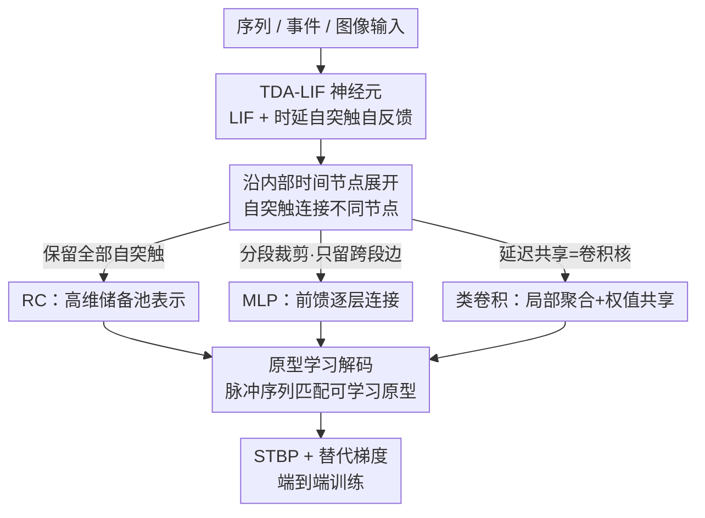

# 用带自突触的单个神经元重构脉冲神经网络

**会议**: CVPR 2026  
**论文**: [CVF Open Access](https://openaccess.thecvf.com/content/CVPR2026/html/Cai_Reconstructing_Spiking_Neural_Networks_Using_a_Single_Neuron_with_Autapses_CVPR_2026_paper.html)  
**代码**: 无  
**领域**: 脉冲神经网络  
**关键词**: 脉冲神经网络, 自突触, 时延反馈, 单神经元计算, 时空复用

## 一句话总结
受小脑浦肯野细胞自突触自反馈启发，本文给 LIF 神经元加上一组「时延自突触」（TDA-LIF），让**单个**脉冲神经元在时间维度展开后，通过裁剪/共享自突触就能等价重构出储备池（RC）、多层感知机（MLP）和类卷积三种 SNN 结构；在 RC/MLP 上达到与同规模标准 SNN 相当的精度，同时把每层神经元数压到 1、状态显存从 8 KB 降到 4 Byte、单神经元信息密度提升几十倍，代价是极端单神经元设置下的时间延迟。

## 研究背景与动机

**领域现状**：脉冲神经网络（SNN）被视为第三代神经网络，靠事件驱动、低功耗和丰富的时间动力学，成为类脑/神经形态计算的基础。但当前高性能 SNN 几乎都照搬 ANN 的「密集多层」结构——大量神经元、大量层间通信、巨大的状态存储。

**现有痛点**：这种密集结构带来很高的**空间开销**：神经元数随网络规模平方/线性增长，膜电位等内部状态要逐神经元存储，难以部署到资源受限的神经形态硬件上。已有提升「单神经元表达力」的工作（树突计算、内在可塑性、侧抑制、神经元异质性、多隔室建模等）虽然增强了单神经元的非线性，但它们的内部状态**主要还是依赖瞬时输入**，缺乏保留长期信息、做递归计算的能力。

**核心矛盾**：要么用很多神经元堆出表达力（空间贵），要么用单神经元但只能处理瞬时信息（能力弱）。生物里其实有现成答案——浦肯野细胞通过**自突触（autapse，神经元和自己形成的突触连接）**实现自反馈，能感知自己过去的放电并据此调制当前状态，天然给单神经元注入了「时间记忆」。已有的单神经元延迟环路（folded-in-time 深网、单核储备池）也印证了「单个节点有很强的时序处理能力」，但它们用连续值、依赖非生物硬件，和脉冲/事件驱动机制本质不同，没法直接迁到 SNN。

**本文目标**：把「延迟」当作神经元的一种内在自突触属性，让**一个**脉冲神经元在时间上展开后就能模拟「网络级」的时序计算，同时保持脉冲可解释性、改善长程时序建模。

**核心 idea**：给 LIF 加时延自突触得到 TDA-LIF 神经元，把网络的**空间连接转化为单神经元内部的时间依赖**——通过对展开后的时间节点选择性保留/裁剪/共享自突触，统一构造出 RC、MLP、类卷积三种结构，用「时间复用」换「空间紧凑」。

## 方法详解

### 整体框架

整篇方法围绕一个核心对象：**TDA-LIF 神经元**——在普通 LIF 上挂一组带不同延迟 $d$ 的自突触，神经元发出的脉冲会在 $d$ 个内部节点之后反馈回自己的树突。把这个神经元沿「内部时间节点」展开，就得到一条节点轨迹，自突触在不同节点之间架起有向连边。接下来全靠**怎么取舍这些自突触连边**来变出三种网络：保留全部自突触 → 储备池（RC）；按段裁剪、只留跨段连边 → 前馈 MLP；让各空间输出节点共享同一组延迟自突触权重 → 类卷积。最后用**原型学习**把输出脉冲序列匹配到可学习原型完成分类，整网用 STBP（时空反向传播）+ 替代梯度端到端训练。

这里要分清两套时间：$t$ 是神经元**内部时间节点**的索引（展开轨迹上的位置），$T$ 是外部数据的时间窗（喂序列/事件输入用的）。TDA-SNN 的魔法发生在内部节点维度——它把别人用空间神经元承载的东西，折叠进了一个神经元的时间轴。

### 关键设计

**1. TDA-LIF：给 LIF 神经元装上时延自突触，把记忆塞进单神经元内部**

普通 LIF 的状态只依赖当前输入，没法记住远处的历史。本文在 LIF 的膜电位迭代里加一项「延迟自突触电流」：神经元在节点 $t$ 发出的脉冲，会在延迟 $d$ 个节点后回到自己的树突。膜电位更新写作

$$v_t = \tau v_{t-1}(1 - s_{t-1}) + I_t + I_t^{\text{autapse}}, \qquad I_t^{\text{autapse}} = \sum_{d \in D_t} w_a^{d}\, s_{t-d},$$

其中 $\tau$ 是膜时间常数，$s_{t-1}$ 是上一节点的脉冲（发放后乘 $(1-s_{t-1})$ 实现软复位），$D_t=\{d\in\mathbb{N}\mid d<t\}$ 是节点 $t$ 处所有合法延迟，$w_a^{d}$ 是延迟为 $d$ 的自突触权重。注入外部输入后写成 $v_t = \tau v_{t-1}(1-s_{t-1}) + W x_t + \sum_{d\in D} w_a^{d}(t)\, s_{t-d}$，$W\in\mathbb{R}^{N\times N_{in}}$ 把输入映射到 $N$ 个节点。关键在于：不同延迟的自突触赋不同权重后，过去脉冲会持续调制后续膜电位轨迹，**单个神经元的内部状态就被「养」成了高维时间表示**——这正是把空间网络的容量搬进时间轴的物理基础。

**2. 时间展开 + 自突触取舍：同一个神经元长成 RC / MLP / 类卷积**

这是全文最巧的一步——三种看似不同的网络结构，其实只是**对展开轨迹上自突触连边的不同取舍**。

- **RC（储备池）**：保留全部延迟自突触。把神经元在 $N$ 个节点上的演化看成一张展开时间图，信号沿节点前向传播、延迟自反馈不断扰动隐藏动力学，节点间的交互把内部状态搅成高维表示，聚合整条轨迹的响应就得到储备池式的高维编码。论文图示里一个神经元演化 10 个节点，蓝色/黄色自突触分别表示延迟 5 和 2。

- **MLP**：把展开轨迹按一条红色虚线**分成两段**，裁掉「段内」的自突触、只保留「跨段」的自突触，再把节点按段重排，就得到前馈层。第二段演化时膜电位写作 $v_t = \tau v_{t-1}(1-s_{t-1}) + W x_t + \sum_{d\in D_{FC}} w_a^{d}(t)\, s_{t-d}$，其中 $D_{FC}=\{d\mid d\le t,\ t-d<t_s\}$ 只收「从第一段连到第二段」的延迟（$t_s$ 是分段边界）。多分几段就得到更深的前馈网络：输入喂第一段，末段脉冲响应用于识别；段间连接矩阵里的对角及平行对角元素对应「相同延迟」的自突触。

- **类卷积**：在 MLP 拓扑基础上，让每个空间输出节点共享同一组延迟自突触权重——**这些共享权重就充当卷积核参数，不同延迟组提供局部空间聚合的时间实现**。各输出节点并行同步、用同一套延迟自突触核去处理输入的不同局部区域，卷积核在空间上的平移就被映射成时间节点上「延迟共享模式的重复」。例如 $3\times3$ 卷积（pad 1、stride 1、单通道）对应 9 个延迟组，靠权值共享恢复出局部连接和权值共享两大卷积性质。

一句话：**RC=不裁、MLP=分段裁、Conv=裁+权共享**，三者统一在「单神经元 + 时延自突触」之下。

**3. 原型学习解码 + 展开式 STBP 训练：让带自反馈的单神经元学得稳**

光有结构还不够，脉冲输出怎么解码、内部延迟反馈怎么求梯度都是难点。解码上，作者不用忽略时间依赖的静态解码，而是引入**时空原型学习**：为 $C$ 个类别定义一组二值原型 $K\in\{0,1\}^{C\times T}$ 表示目标脉冲模式，用编码表示 $f(x;\theta)$ 与第 $i$ 个原型 $k_i$ 的负欧氏距离 $d_i(x) = -\|f(x;\theta)-k_i\|_2^2$ 度量相似度，分类目标为

$$\mathcal{L} = -\log \frac{e^{d_i(x)}}{\sum_{j=1}^{C} e^{d_j(x)}} - \lambda\, d_i(x),$$

后一项是原型正则（$\lambda=0.001$），让输出脉冲序列直接对齐可学习原型，比静态解码更契合 SNN 的脉冲本质、也更可解释。

训练上用 STBP，并对脉冲发放和原型二值化的不可导用 arctangent 替代梯度 $s_t = g(v_t) \approx \frac{1}{\pi}\arctan\!\big[\frac{\pi}{2}\alpha(v_t - v_{th})\big] + \frac{1}{2}$。难点在于**延迟自反馈让梯度不只沿相邻节点回传**：节点 $t$ 的脉冲会影响后续 $t+d$ 节点，所以它的梯度由「后继节点 $t+1$」和「所有接收其延迟脉冲的未来节点 $t+d$」共同决定：

$$\nabla_{v_t}\mathcal{L} = \nabla_{v_{t+1}}\mathcal{L}\cdot \tau(1-s_{t-1}) + \sum_{d\in D}\Big(\nabla_{v_{t+d}}\mathcal{L}\cdot w_a^{d}\cdot \frac{\partial s_t}{\partial v_t}\Big),$$

权重梯度为 $\nabla_W\mathcal{L} = \nabla_{v_t}\mathcal{L}\cdot x_t$、$\nabla_{w_a^{d}}\mathcal{L} = \nabla_{v_{t+d}}\mathcal{L}\cdot s_t$。这套展开式反传把「跨延迟的时间依赖」正确纳入梯度，才让带内部延迟反馈的单神经元模型能稳定端到端学习。

### 损失函数 / 训练策略
分类损失即上式原型学习目标（交叉熵 + $\lambda d_i$ 正则，$\lambda=0.001$）。优化器 Adam + 余弦学习率衰减，默认训练 100 epoch；RC/MLP 实验跑 10 次取均值±标准差，卷积实验因成本高跑 5 次。TDA-SNN 与对照的标准 SNN（STD-SNN）用对齐的训练协议和匹配的结构规模，保证公平比较。

## 实验关键数据

数据集按结构分工：RC 用 DEAP、SHD；MLP 用 MNIST、fMNIST、DVS Gesture；类卷积用 DVS Gesture、CIFAR-10。核心对照是把 STD-SNN 的储备池/层神经元数对齐到 TDA-SNN 的内部演化节点数，保证复杂度可比。

### 主实验：RC / MLP 与同规模 STD-SNN 对比

| 结构 | 数据集 | 节点数 | STD-SNN | TDA-SNN |
|------|--------|--------|---------|---------|
| RC | DEAP | 16 | 81.21±1.00 | 77.59±1.24 |
| RC | DEAP | 256 | 79.92±0.54 | **88.65±0.48** |
| RC | SHD | 256 | 77.63±2.53 | **80.04±0.51**（128 节点最佳 80.68±0.83） |
| MLP | MNIST | 256 | — | 98.23±0.09（16→256 从 92.37 稳升） |
| MLP | fMNIST | 256 | — | 89.16±0.12 |
| MLP | DVS Gesture | 256 | — | 72.95±2.02（16 节点 53.99） |

规律很一致：**节点少时 TDA-SNN 略逊于 STD-SNN**（如 16 节点，时间复用的红利还没体现），随节点增多稳步追上甚至反超——延迟自突触动力学要在「展开轨迹够大」时才充分发挥。

### 消融：自突触选择策略与数量（部分，节选 Table 1）

| 数据集 | 策略 | 1 延迟 | 8 延迟 | 64 延迟 |
|--------|------|--------|--------|---------|
| DEAP | MC | 83.52 | 83.91 | 84.47 |
| DEAP | RD | 83.62 | 83.73 | 84.47 |
| SHD | MC | 78.35 | 74.69 | 80.42 |
| SHD | RD | 78.55 | 78.58 | 80.42 |
| DVS Gesture | RD | 45.45 | 55.31 | 59.55 |
| DVS Gesture | MC | 23.13 | 52.88 | 53.19 |

结论：**自突触「数量」是主导因素**，延迟连接越多越稳；具体选择策略（随机延迟 RD / 最大连接 MC / 时不变 T Inv.）主要在「极低延迟」时才拉开差距——时序更复杂的 DVS Gesture 上，低延迟时 RD/T-Inv. 明显优于 MC（延迟多样性更重要），延迟数超过 4 后三种策略趋同。MLP 深度消融显示效果**依数据集而定**：MNIST 1→4 层从 94.41 升到 95.60，fMNIST 中等深度即够，DVS Gesture 早早饱和（3 层 57.12 最佳）。

### 效率与单神经元信息密度（Table 2，节选）

| 模型 | 结构 | 神经元数 $N_{Neu}$ | 单神经元信息量 $S$ (bit) |
|------|------|------|------|
| STD-SNN | RC | $N$ | 489.91 |
| TDA-SNN | RC | **1** | **32096.37** |
| STD-SNN | MLP | $N_{out}$ | 3113.89 |
| TDA-SNN | MLP | **1** | **199237.63** |
| STD-SNN | Conv | $C_{out}WH$ | 5.48 |
| TDA-SNN | Conv | **1** | 56486.07 |

其中单神经元信息量 $S = \text{Acc}\times N_{samples}\times \log_2 C / N_{Neu}$。TDA-SNN 把每层神经元数从 $N$/$N_{out}$ 直接压到 **1**，单神经元信息密度因此暴涨几十~上百倍；STD-SNN 的空间复杂度（RC $N^2T$、MLP $N_{in}N_{out}T$）被转化为时间依赖（$\sum_d N_d T$）。

### 关键发现
- **空间换时间的 trade-off 真实存在**：RC 设置下训练速度仍可比（21.14 vs 22.57 s/epoch），但 MLP（90.91 vs 8.36）、尤其卷积（3060 vs 17.21 s/epoch）时间开销显著放大——TDA-SNN 的优势是**空间紧凑/神经元数减少**，而非全面更快。
- **卷积仍是 proof-of-concept**：DVS Gesture 上 TDA-SNN 收敛慢且停在 57.58%（STD-SNN 73.61%），CIFAR-10 上 37.64% vs 47.31%。延迟反馈干扰了层级时空特征聚合，作者明确把单神经元卷积当「初步探索」，需多神经元并行来平衡空间表示与时间递归。
- **并行可缓解延迟、显存极省**：增加并行神经元后，CIFAR-10 训练时间开销从 178× 降到 46×，512 并行神经元时推理时间降到 STD-SNN 的 0.92×；状态显存从 STD-SNN 的 8 KB 降到单神经元 TDA-SNN 的 4 Byte。单神经元应被视为「最大化空间紧凑」的极限情形，多神经元并行才是实用工作点。

## 亮点与洞察
- **「网络结构 = 自突触取舍」的统一视角很漂亮**：RC/MLP/Conv 三种结构被还原成「对展开轨迹上自突触连边的保留/裁剪/共享」，一个神经元 + 一套规则就能长出三种网络，理论上还给了构造性证明，概念上非常简洁。
- **把空间维度折叠进时间轴**：核心 trick 是「延迟即内在属性」——别人用一层神经元承载的信息，被复用进单神经元的时间节点序列，单神经元信息密度因此提升几十倍，这种「时间复用」思路可迁移到任何想压空间存储的递归/事件式模型。
- **展开式 STBP 求梯度的细节值得借鉴**：因为脉冲会反馈到未来 $t+d$ 节点，梯度必须同时收「后继节点」和「所有被延迟脉冲影响的未来节点」，这套展开反传是带内部延迟环路模型能稳定训练的关键。

## 局限与展望
- 作者承认：极端单神经元设置下**时间延迟开销大**，卷积结构当前效率和精度都受限，只是初步概念验证；未来要扩展到多神经元和自适应延迟机制。
- 自己观察：RC/MLP 的「competitive」是在**节点足够多**时才成立，小规模下反而不如 STD-SNN，所以「单神经元省空间」和「要堆够时间节点」本身又是一对张力；时间开销在 MLP/Conv 上放大明显，纯单神经元离实用尚远。⚠️ 论文很多结论（统计显著性、CIFAR-100、并行可扩展性细节）放在补充材料，正文只给了趋势性结论。
- 改进思路：自适应/可学习的延迟集合选择（而非固定 RD/MC）、把延迟反馈与卷积的层级聚合更好地解耦，可能缓解卷积设置的优化困难。

## 相关工作与启发
- **vs 树突计算 / 内在可塑性 / 侧抑制等单神经元增强**：它们也想提升单神经元表达力，但内部状态主要依赖瞬时输入，缺长期记忆/递归能力；本文用时延自突触显式注入时间记忆，让单神经元能做长程依赖。
- **vs folded-in-time 深网 / 单核储备池**：同样用「单节点 + 延迟环路」做时序，但那些方法是连续值、依赖非生物硬件，和脉冲/事件驱动本质不同；本文把延迟自突触放进脉冲域，保留事件驱动与可解释性。
- **vs 标准多层 SNN（STD-SNN）**：STD-SNN 用密集空间连接，神经元数和状态存储随规模膨胀；TDA-SNN 把空间耦合换成时间依赖，神经元数压到 1、显存几个数量级下降，代价是时间延迟——是一种空间↔时间的重新分配。

## 评分
- 新颖性: ⭐⭐⭐⭐⭐ 「单神经元 + 时延自突触统一重构 RC/MLP/Conv」视角新颖，且有构造性证明支撑
- 实验充分度: ⭐⭐⭐⭐ 覆盖 RC/MLP/Conv 三结构、多数据集、神经元数/策略/深度多维消融，但卷积仅 proof-of-concept、关键统计细节在补充材料
- 写作质量: ⭐⭐⭐⭐ 结构清晰、公式完整，生物动机到工程实现的链路顺畅；个别段落在缓存里有重复
- 价值: ⭐⭐⭐⭐ 为神经形态计算提供「时间复用换空间紧凑」的新思路，单神经元信息密度和显存优势显著，对资源受限部署有启发

<!-- RELATED:START -->

## 相关论文

- [\[CVPR 2026\] Robust Spiking Neural Networks by Temporal Mutual Information](robust_spiking_neural_networks_by_temporal_mutual_information.md)
- [\[CVPR 2026\] Temporal Interaction in Spiking Transformers with Multi-Delay Mixer](temporal_interaction_in_spiking_transformers_with_multi-delay_mixer.md)
- [\[CVPR 2026\] On the Role of Temporal Granularity in the Robustness of Spiking Neural Networks](on_the_role_of_temporal_granularity_in_the_robustness_of_spiking_neural_networks.md)
- [\[CVPR 2026\] Differences That Matter: Auditing Models for Capability Gap Discovery and Rectification](differences_that_matter_auditing_models_for_capability_gap_discovery_and_rectifi.md)
- [\[CVPR 2026\] PAI-Bench: A Comprehensive Benchmark For Physical AI](pai-bench_a_comprehensive_benchmark_for_physical_ai.md)

<!-- RELATED:END -->
